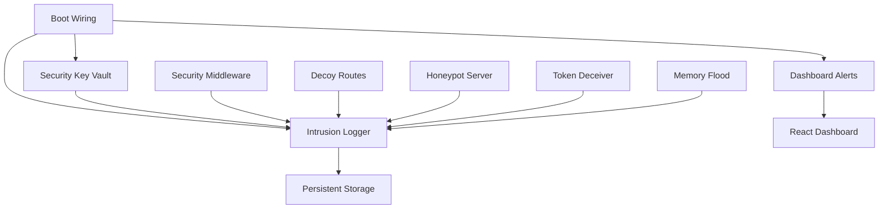
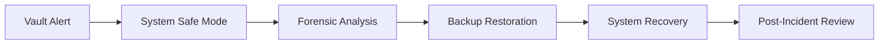
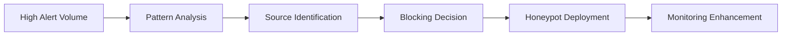
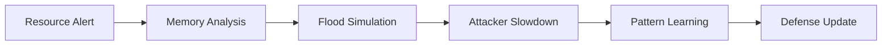

# JRVI Full Source (Generated)

## src/App.tsx

```tsx
import React from 'react';
import { BrowserRouter as Router, Routes, Route, Link } from 'react-router-dom';
import ChatUI from './components/ChatUI';
import EnhancedDashboard from './components/EnhancedDashboard';
import IDEInterface from './components/IDEInterface';
import DrawingBoard from './components/DrawingBoard';

// Main App component
export default function App() {
  return (
    <Router>
      <div className="min-h-screen bg-gray-900 text-white">
        <nav className="bg-gray-800 p-4 flex gap-4 border-b border-gray-700">
          <Link
            to="/dashboard"
            className="px-3 py-2 rounded hover:bg-gray-700 transition-colors"
          >
            📊 Dashboard
          </Link>
          <Link
            to="/chat"
            className="px-3 py-2 rounded hover:bg-gray-700 transition-colors"
          >
            💬 Chat
          </Link>
          <Link
            to="/ide"
            className="px-3 py-2 rounded hover:bg-gray-700 transition-colors"
          >
            🔧 IDE
          </Link>
          <Link
            to="/drawing-board"
            className="px-3 py-2 rounded hover:bg-gray-700 transition-colors"
          >
            🎨 DB
          </Link>
        </nav>
        <Routes>
          <Route path="/dashboard" element={<EnhancedDashboard />} />
          <Route path="/chat" element={<ChatUI />} />
          <Route path="/ide" element={<IDEInterface />} />
          <Route path="/drawing-board" element={<DrawingBoard />} />
          <Route path="*" element={<EnhancedDashboard />} />
        </Routes>
      </div>
    </Router>
  );
}
```

## src/analytics/hudEnhancer.ts

```ts
/**
 * HUD Enhancer
 * Provides enhanced functionality and visualization for the HUD system
 */

import { HUDPayload, HUDPayloadManager, hudPayloadManager } from './hudPayload';
import { swarmHive } from './swarmHive';

export interface EnhancedHUDState {
  payload: HUDPayload;
  visualizations: VisualizationData;
  interactions: InteractionState;
  customization: CustomizationSettings;
}

export interface VisualizationData {
  charts: ChartData[];
  graphs: GraphData[];
  tables: TableData[];
  alerts: AlertVisualization[];
}

export interface ChartData {
  id: string;
  type: 'line' | 'bar' | 'pie' | 'heatmap' | 'scatter';
  title: string;
  data: any[];
  options: ChartOptions;
  timestamp: Date;
}

export interface ChartOptions {
  width?: number;
  height?: number;
  colors?: string[];
  animate?: boolean;
  showLegend?: boolean;
  showTooltips?: boolean;
  responsive?: boolean;
}

export interface GraphData {
  id: string;
  type: 'network' | 'tree' | 'flow';
  title: string;
  nodes: GraphNode[];
  edges: GraphEdge[];
  layout: GraphLayout;
}

export interface GraphNode {
  id: string;
  label: string;
  group?: string;
  size?: number;
  color?: string;
  metadata?: any;
}

export interface GraphEdge {
  source: string;
  target: string;
  weight?: number;
  label?: string;
  color?: string;
}

export interface GraphLayout {
  type: 'force' | 'circle' | 'tree' | 'grid';
  spacing?: number;
  iterations?: number;
}

export interface TableData {
  id: string;
  title: string;
  columns: TableColumn[];
  rows: TableRow[];
  sortable?: boolean;
  filterable?: boolean;
  pagination?: TablePagination;
}

export interface TableColumn {
  key: string;
  label: string;
  type: 'string' | 'number' | 'date' | 'boolean' | 'status';
  sortable?: boolean;
  width?: number;
}

export interface TableRow {
  id: string;
  data: Record<string, any>;
  status?: 'normal' | 'warning' | 'error' | 'highlight';
}

export interface TablePagination {
  currentPage: number;
  totalPages: number;
  pageSize: number;
  totalItems: number;
}

export interface AlertVisualization {
  id: string;
  type: 'toast' | 'banner' | 'modal' | 'sidebar';
  level: 'info' | 'success' | 'warning' | 'error' | 'critical';
  title: string;
  message: string;
  actions?: AlertAction[];
  autoClose?: number;
  persistent?: boolean;
}

export interface AlertAction {
  label: string;
  action: string;
  style: 'primary' | 'secondary' | 'danger';
}

export interface InteractionState {
  selectedTab: string;
  selectedTimeRange: TimeRange;
  filters: FilterState;
  zoom: ZoomState;
  preferences: UserPreferences;
}

export interface TimeRange {
  start: Date;
  end: Date;
  preset?: 'last_hour' | 'last_24h' | 'last_7d' | 'last_30d' | 'custom';
}

export interface FilterState {
  categories: string[];
  levels: string[];
  tags: string[];
  search: string;
}

export interface ZoomState {
  level: number;
  center: { x: number; y: number };
  bounds?: { min: number; max: number };
}

export interface UserPreferences {
  theme: 'light' | 'dark' | 'auto';
  layout: 'compact' | 'comfortable' | 'spacious';
  animations: boolean;
  notifications: boolean;
  autoRefresh: boolean;
  refreshInterval: number;
}

export interface CustomizationSettings {
  dashboardLayout: DashboardLayout;
  widgetConfigs: WidgetConfig[];
  colorScheme: ColorScheme;
  chartDefaults: ChartOptions;
}

export interface DashboardLayout {
  columns: number;
  rows: number;
  widgets: WidgetPosition[];
  responsive: boolean;
}

export interface WidgetPosition {
  id: string;
  x: number;
  y: number;
  width: number;
  height: number;
  minWidth?: number;
  minHeight?: number;
}

export interface WidgetConfig {
  id: string;
  type: string;
  title: string;
  dataSource: string;
  refreshInterval: number;
  visible: boolean;
  collapsed: boolean;
  settings: Record<string, any>;
}

export interface ColorScheme {
  primary: string;
  secondary: string;
  success: string;
  warning: string;
  error: string;
  info: string;
  background: string;
  surface: string;
  text: string;
}

export class HUDEnhancer {
  private payloadManager: HUDPayloadManager;
  private enhancedState: EnhancedHUDState;
  private updateCallbacks: ((state: EnhancedHUDState) => void)[] = [];
  private refreshTimer: NodeJS.Timeout | null = null;

  constructor(payloadManager: HUDPayloadManager = hudPayloadManager) {
    this.payloadManager = payloadManager;
    this.enhancedState = this.initializeState();
    this.startAutoRefresh();
  }

  /**
   * Get current enhanced HUD state
   */
  getEnhancedState(): EnhancedHUDState {
    return { ...this.enhancedState };
  }

  /**
   * Subscribe to state updates
   */
  subscribe(callback: (state: EnhancedHUDState) => void): () => void {
    this.updateCallbacks.push(callback);

    // Return unsubscribe function
    return () => {
      const index = this.updateCallbacks.indexOf(callback);
      if (index > -1) {
        this.updateCallbacks.splice(index, 1);
      }
    };
  }

  /**
   * Update interaction state
   */
  updateInteraction(updates: Partial<InteractionState>): void {
    this.enhancedState.interactions = {
      ...this.enhancedState.interactions,
      ...updates,
    };
    this.notifySubscribers();
  }

  /**
   * Update customization settings
   */
  updateCustomization(updates: Partial<CustomizationSettings>): void {
    this.enhancedState.customization = {
      ...this.enhancedState.customization,
      ...updates,
    };
    this.notifySubscribers();
  }

  /**
   * Generate memory pulse visualization
   */
  generateMemoryPulseVisualization(): ChartData {
    const payload = this.payloadManager.getCurrentPayload();
    if (!payload) {
      return this.createEmptyChart('memory-pulse', 'Memory Pulse');
    }

    const pulse = payload.performance.memoryPulse;
    const history = this.payloadManager.getPayloadHistory(50);

    const pulseData = history.map((p, index) => ({
      x: index,
      y: p.performance.memoryPulse.heartbeat,
      timestamp: p.timestamp,
      latency: p.performance.memoryPulse.latency,
      utilization: p.performance.memoryPulse.utilization,
    }));

    return {
      id: 'memory-pulse',
      type: 'line',
      title: 'Memory Pulse',
      data: pulseData,
      options: {
        height: 200,
        colors: ['#10B981', '#3B82F6', '#F59E0B'],
        animate: true,
        showLegend: true,
        showTooltips: true,
        responsive: true,
      },
      timestamp: new Date(),
    };
  }

  /**
   * Generate kernel heatmap visualization
   */
  generateKernelHeatmap(): ChartData {
    const payload = this.payloadManager.getCurrentPayload();
    if (!payload) {
      return this.createEmptyChart(
        'kernel-heatmap',
        'Kernel Performance Heatmap'
      );
    }

    const heatmapData = payload.analytics.heatmaps.kernel;

    return {
      id: 'kernel-heatmap',
      type: 'heatmap',
      title: 'Kernel Performance Heatmap',
      data: {
        matrix: heatmapData.matrix,
        labels: heatmapData.labels,
        maxValue: heatmapData.maxValue,
        minValue: heatmapData.minValue,
      },
      options: {
        height: 300,
        colors: ['#EF4444', '#F59E0B', '#10B981'],
        showTooltips: true,
        responsive: true,
      },
      timestamp: new Date(),
    };
  }

  /**
   * Generate plugin health visualization
   */
  generatePluginHealthVisualization(): ChartData {
    const payload = this.payloadManager.getCurrentPayload();
    if (!payload) {
      return this.createEmptyChart('plugin-health', 'Plugin Health');
    }

    const pluginHealth = payload.metrics.plugins.pluginHealth;
    const healthData = Object.values(pluginHealth).map((plugin) => ({
      name: plugin.name,
      performance: plugin.performance,
      status: plugin.status,
      responseTime: plugin.responseTime,
      errorCount: plugin.errorCount,
    }));

    return {
      id: 'plugin-health',
      type: 'bar',
      title: 'Plugin Health Status',
      data: healthData,
      options: {
        height: 250,
        colors: ['#10B981', '#F59E0B', '#EF4444'],
        showLegend: true,
        showTooltips: true,
        responsive: true,
      },
      timestamp: new Date(),
    };
  }

  /**
   * Generate swarm consensus visualization
   */
  generateSwarmConsensusVisualization(): GraphData {
    const swarmState = swarmHive.exportSwarmState();
    const nodes: GraphNode[] = [];
    const edges: GraphEdge[] = [];

    // Create nodes for swarm members
    swarmState.nodes.forEach((node) => {
      nodes.push({
        id: node.id,
        label: `${node.nodeType}\n${node.id.substring(0, 8)}`,
        group: node.status,
        size: node.validationScore * 20 + 10,
        color: this.getNodeColor(node.status),
        metadata: {
          status: node.status,
          validationScore: node.validationScore,
          performance: node.metadata.performance,
        },
      });
    });

    // Create edges for consensus relationships
    // Simplified: connect all active nodes to each other
    const activeNodes = swarmState.nodes.filter(
      (n) => n.status === 'active' || n.status === 'validating'
    );
    for (let i = 0; i < activeNodes.length; i++) {
      for (let j = i + 1; j < activeNodes.length; j++) {
        edges.push({
          source: activeNodes[i].id,
          target: activeNodes[j].id,
          weight: Math.min(
            activeNodes[i].validationScore,
            activeNodes[j].validationScore
          ),
          color: '#6B7280',
        });
      }
    }

    return {
      id: 'swarm-consensus',
      type: 'network',
      title: 'Swarm Consensus Network',
      nodes,
      edges,
      layout: {
        type: 'force',
        spacing: 100,
        iterations: 50,
      },
    };
  }

  /**
   * Generate retention analytics table
   */
  generateRetentionTable(): TableData {
    const weeklyReport = this.payloadManager.generateWeeklyReport();

    const columns: TableColumn[] = [
      { key: 'date', label: 'Date', type: 'date', sortable: true },
      { key: 'retained', label: 'Retained', type: 'number', sortable: true },
      { key: 'total', label: 'Total', type: 'number', sortable: true },
      { key: 'rate', label: 'Rate', type: 'number', sortable: true },
      { key: 'status', label: 'Status', type: 'status', sortable: false },
    ];

    const rows: TableRow[] = weeklyReport.retention.dropoffPoints.map(
      (point, index) => ({
        id: `retention-${index}`,
        data: {
          date: new Date(Date.now() - index * 24 * 60 * 60 * 1000),
          retained: Math.floor(Math.random() * 100),
          total: 100,
          rate: (80 + Math.random() * 20) / 100,
          status: Math.random() > 0.8 ? 'warning' : 'normal',
        },
        status: Math.random() > 0.8 ? 'warning' : 'normal',
      })
    );

    return {
      id: 'retention-table',
      title: 'Weekly Retention Analysis',
      columns,
      rows,
      sortable: true,
      filterable: true,
      pagination: {
        currentPage: 1,
        totalPages: Math.ceil(rows.length / 10),
        pageSize: 10,
        totalItems: rows.length,
      },
    };
  }

  /**
   * Generate logic forecast visualization
   */
  generateLogicForecastVisualization(): ChartData {
    const payload = this.payloadManager.getCurrentPayload();
    if (!payload) {
      return this.createEmptyChart('logic-forecast', 'Logic Forecasts');
    }

    const forecasts = payload.analytics.forecasts;
    const forecastData = [
      ...forecasts.memoryGrowth.map((point) => ({
        timestamp: point.timestamp,
        memory: point.value,
        confidence: point.confidence,
      })),
      ...forecasts.pluginLoad.map((point) => ({
        timestamp: point.timestamp,
        plugins: point.value,
        confidence: point.confidence,
      })),
    ];

    return {
      id: 'logic-forecast',
      type: 'line',
      title: 'Logic Forecasts',
      data: forecastData,
      options: {
        height: 300,
        colors: ['#8B5CF6', '#06B6D4', '#F59E0B'],
        animate: true,
        showLegend: true,
        showTooltips: true,
        responsive: true,
      },
      timestamp: new Date(),
    };
  }

  /**
   * Refresh enhanced state with latest data
   */
  refresh(): void {
    const payload = this.payloadManager.generatePayload();

    this.enhancedState.payload = payload;
    this.enhancedState.visualizations = this.generateVisualizations(payload);

    this.notifySubscribers();
  }

  /**
   * Export current state for analysis
   */
  exportState(): {
    timestamp: Date;
    state: EnhancedHUDState;
    metadata: {
      version: string;
      session: string;
      userAgent?: string;
    };
  } {
    return {
      timestamp: new Date(),
      state: this.getEnhancedState(),
      metadata: {
        version: '1.0.0',
        session: this.enhancedState.payload.sessionId,
        userAgent:
          typeof navigator !== 'undefined' ? navigator.userAgent : undefined,
      },
    };
  }

  /**
   * Start auto-refresh timer
   */
  startAutoRefresh(): void {
    if (this.refreshTimer) {
      clearInterval(this.refreshTimer);
    }

    const interval =
      this.enhancedState.interactions.preferences.refreshInterval || 5000;
    this.refreshTimer = setInterval(() => {
      if (this.enhancedState.interactions.preferences.autoRefresh) {
        this.refresh();
      }
    }, interval);
  }

  /**
   * Stop auto-refresh timer
   */
  stopAutoRefresh(): void {
    if (this.refreshTimer) {
      clearInterval(this.refreshTimer);
      this.refreshTimer = null;
    }
  }

  private initializeState(): EnhancedHUDState {
    const payload = this.payloadManager.generatePayload();

    return {
      payload,
      visualizations: this.generateVisualizations(payload),
      interactions: {
        selectedTab: 'overview',
        selectedTimeRange: {
          start: new Date(Date.now() - 24 * 60 * 60 * 1000),
          end: new Date(),
          preset: 'last_24h',
        },
        filters: {
          categories: [],
          levels: [],
          tags: [],
          search: '',
        },
        zoom: {
          level: 1,
          center: { x: 0, y: 0 },
        },
        preferences: {
          theme: 'light',
          layout: 'comfortable',
          animations: true,
          notifications: true,
          autoRefresh: true,
          refreshInterval: 5000,
        },
      },
      customization: {
        dashboardLayout: {
          columns: 12,
          rows: 8,
          widgets: [],
          responsive: true,
        },
        widgetConfigs: [],
        colorScheme: {
          primary: '#3B82F6',
          secondary: '#6B7280',
          success: '#10B981',
          warning: '#F59E0B',
          error: '#EF4444',
          info: '#06B6D4',
          background: '#FFFFFF',
          surface: '#F9FAFB',
          text: '#1F2937',
        },
        chartDefaults: {
          responsive: true,
          animate: true,
          showLegend: true,
          showTooltips: true,
        },
      },
    };
  }

  private generateVisualizations(payload: HUDPayload): VisualizationData {
    return {
      charts: [
        this.generateMemoryPulseVisualization(),
        this.generateKernelHeatmap(),
        this.generatePluginHealthVisualization(),
        this.generateLogicForecastVisualization(),
      ],
      graphs: [this.generateSwarmConsensusVisualization()],
      tables: [this.generateRetentionTable()],
      alerts: this.generateAlertVisualizations(payload.alerts),
    };
  }

  private generateAlertVisualizations(alerts: any[]): AlertVisualization[] {
    return alerts.map((alert) => ({
      id: alert.id,
      type: 'toast',
      level: alert.level,
      title: alert.title,
      message: alert.message,
      actions: [
        { label: 'Acknowledge', action: 'acknowledge', style: 'primary' },
        { label: 'Dismiss', action: 'dismiss', style: 'secondary' },
      ],
      autoClose: alert.level === 'info' ? 5000 : undefined,
      persistent: alert.level === 'critical',
    }));
  }

  private createEmptyChart(id: string, title: string): ChartData {
    return {
      id,
      type: 'line',
      title,
      data: [],
      options: {
        height: 200,
        colors: ['#6B7280'],
        responsive: true,
      },
      timestamp: new Date(),
    };
  }

  private getNodeColor(status: string): string {
    switch (status) {
      case 'active':
        return '#10B981';
      case 'validating':
        return '#3B82F6';
      case 'joining':
        return '#F59E0B';
      case 'inactive':
        return '#6B7280';
      case 'failed':
        return '#EF4444';
      default:
        return '#6B7280';
    }
  }

  private notifySubscribers(): void {
    this.updateCallbacks.forEach((callback) => {
      try {
        callback(this.enhancedState);
      } catch (error) {
        console.error('Error in HUD enhancer callback:', error);
      }
    });
  }
}

// Singleton instance
export const hudEnhancer = new HUDEnhancer();
```

## src/analytics/hudPayload.ts

```ts
/**
 * HUD Payload Management
 * Manages data payloads for the HUD system in JRVI Phase 7
 */

import { swarmHive, ConsensusMetrics } from './swarmHive';
import { cltmCore, MemoryStats } from '../memory/cltm_core';

export interface HUDPayload {
  timestamp: Date;
  sessionId: string;
  metrics: SystemMetrics;
  analytics: AnalyticsData;
  alerts: Alert[];
  performance: PerformanceData;
}

export interface SystemMetrics {
  memory: MemoryStats;
  swarm: ConsensusMetrics;
  kernel: KernelMetrics;
  plugins: PluginMetrics;
}

export interface KernelMetrics {
  executionTime: number;
  enforcementCount: number;
  failureRate: number;
  activePersonas: number;
  score: number;
}

export interface PluginMetrics {
  totalPlugins: number;
  activePlugins: number;
  failedPlugins: number;
  averageResponseTime: number;
  errorRate: number;
  pluginHealth: Record<string, PluginHealth>;
}

export interface PluginHealth {
  id: string;
  name: string;
  status: 'healthy' | 'warning' | 'error' | 'inactive';
  responseTime: number;
  errorCount: number;
  lastError?: string;
  lastActive: Date;
  performance: number; // 0-1 score
}

export interface AnalyticsData {
  heatmaps: {
    kernel: HeatmapData;
    plugins: HeatmapData;
  };
  retention: RetentionData;
  forecasts: ForecastData;
  trends: TrendData;
}

export interface HeatmapData {
  matrix: number[][];
  labels: string[];
  maxValue: number;
  minValue: number;
  timestamp: Date;
}

export interface RetentionData {
  daily: RetentionMetric[];
  weekly: RetentionMetric[];
  logs: RetentionLog[];
}

export interface RetentionMetric {
  date: Date;
  retained: number;
  total: number;
  rate: number;
}

export interface RetentionLog {
  id: string;
  timestamp: Date;
  type: 'memory' | 'plugin' | 'kernel' | 'swarm';
  event: string;
  tags: string[];
  success: boolean;
  details: any;
}

export interface ForecastData {
  memoryGrowth: DataPoint[];
  pluginLoad: DataPoint[];
  swarmHealth: DataPoint[];
  predictions: Prediction[];
}

export interface DataPoint {
  timestamp: Date;
  value: number;
  confidence?: number;
}

export interface Prediction {
  metric: string;
  timeframe: string;
  value: number;
  confidence: number;
  trend: 'increasing' | 'decreasing' | 'stable';
}

export interface TrendData {
  memory: TrendAnalysis;
  performance: TrendAnalysis;
  errors: TrendAnalysis;
}

export interface TrendAnalysis {
  current: number;
  previous: number;
  change: number;
  changePercent: number;
  trend: 'up' | 'down' | 'stable';
  sparkline: number[];
}

export interface PerformanceData {
  memoryPulse: MemoryPulse;
  realtimeMetrics: RealtimeMetrics;
  benchmarks: BenchmarkData;
}

export interface MemoryPulse {
  heartbeat: number; // Hz
  latency: number; // ms
  throughput: number; // operations/sec
  utilization: number; // percentage
  fragmentation: number; // percentage
}

export interface RealtimeMetrics {
  cpuUsage: number;
  memoryUsage: number;
  networkIO: number;
  diskIO: number;
  activeConnections: number;
}

export interface BenchmarkData {
  baseline: Record<string, number>;
  current: Record<string, number>;
  comparison: Record<string, number>;
}

export interface Alert {
  id: string;
  timestamp: Date;
  level: 'info' | 'warning' | 'error' | 'critical';
  category: 'memory' | 'kernel' | 'plugin' | 'swarm' | 'performance';
  title: string;
  message: string;
  details: any;
  acknowledged: boolean;
}

export class HUDPayloadManager {
  private currentPayload: HUDPayload | null = null;
  private payloadHistory: HUDPayload[] = [];
  private maxHistorySize: number = 100;
  private sessionId: string;
  private alerts: Alert[] = [];
  private retentionLogs: RetentionLog[] = [];
  private performanceBaseline: Record<string, number> = {};

  constructor() {
    this.sessionId = this.generateSessionId();
    this.initializeBaseline();
  }

  /**
   * Generate current HUD payload with all metrics and analytics
   */
  generatePayload(): HUDPayload {
    const timestamp = new Date();

    const payload: HUDPayload = {
      timestamp,
      sessionId: this.sessionId,
      metrics: this.collectSystemMetrics(),
      analytics: this.generateAnalytics(),
      alerts: this.getActiveAlerts(),
      performance: this.collectPerformanceData(),
    };

    this.currentPayload = payload;
    this.addToHistory(payload);

    return payload;
  }

  /**
   * Get current payload
   */
  getCurrentPayload(): HUDPayload | null {
    return this.currentPayload;
  }

  /**
   * Get payload history for trend analysis
   */
  getPayloadHistory(limit?: number): HUDPayload[] {
    return limit ? this.payloadHistory.slice(-limit) : [...this.payloadHistory];
  }

  /**
   * Add retention log entry
   */
  addRetentionLog(log: Omit<RetentionLog, 'id' | 'timestamp'>): string {
    const retentionLog: RetentionLog = {
      id: this.generateId(),
      timestamp: new Date(),
      ...log,
    };

    this.retentionLogs.push(retentionLog);

    // Trim logs if too many
    if (this.retentionLogs.length > 10000) {
      this.retentionLogs = this.retentionLogs.slice(-5000);
    }

    return retentionLog.id;
  }

  /**
   * Get retention logs filtered by time window and tags
   */
  getRetentionLogs(
    timeWindow?: { start: Date; end: Date },
    tags?: string[]
  ): RetentionLog[] {
    let logs = [...this.retentionLogs];

    if (timeWindow) {
      logs = logs.filter(
        (log) =>
          log.timestamp >= timeWindow.start && log.timestamp <= timeWindow.end
      );
    }

    if (tags && tags.length > 0) {
      logs = logs.filter((log) => tags.some((tag) => log.tags.includes(tag)));
    }

    return logs.sort((a, b) => b.timestamp.getTime() - a.timestamp.getTime());
  }

  /**
   * Add alert
   */
  addAlert(alert: Omit<Alert, 'id' | 'timestamp' | 'acknowledged'>): string {
    const newAlert: Alert = {
      id: this.generateId(),
      timestamp: new Date(),
      acknowledged: false,
      ...alert,
    };

    this.alerts.push(newAlert);
    return newAlert.id;
  }

  /**
   * Acknowledge alert
   */
  acknowledgeAlert(alertId: string): boolean {
    const alert = this.alerts.find((a) => a.id === alertId);
    if (alert) {
      alert.acknowledged = true;
      return true;
    }
    return false;
  }

  /**
   * Generate weekly failure and retention report
   */
  generateWeeklyReport(): {
    period: { start: Date; end: Date };
    summary: WeeklySummary;
    failures: FailureAnalysis;
    retention: RetentionAnalysis;
    recommendations: string[];
  } {
    const end = new Date();
    const start = new Date(end.getTime() - 7 * 24 * 60 * 60 * 1000);

    const weeklyLogs = this.getRetentionLogs({ start, end });

    return {
      period: { start, end },
      summary: this.generateWeeklySummary(weeklyLogs),
      failures: this.analyzeFailures(weeklyLogs),
      retention: this.analyzeRetention(weeklyLogs),
      recommendations: this.generateRecommendations(weeklyLogs),
    };
  }

  private collectSystemMetrics(): SystemMetrics {
    return {
      memory: cltmCore.getMemoryStats(),
      swarm: swarmHive.getConsensusMetrics(),
      kernel: this.collectKernelMetrics(),
      plugins: this.collectPluginMetrics(),
    };
  }

  private collectKernelMetrics(): KernelMetrics {
    // Mock kernel metrics - in real implementation, this would collect from kernel system
    return {
      executionTime: Math.random() * 100,
      enforcementCount: Math.floor(Math.random() * 1000),
      failureRate: Math.random() * 0.1,
      activePersonas: Math.floor(Math.random() * 10) + 1,
      score: 0.7 + Math.random() * 0.3,
    };
  }

  private collectPluginMetrics(): PluginMetrics {
    // Mock plugin metrics - in real implementation, this would collect from plugin registry
    const plugins = [
      'rag_core',
      'ragm_plugin',
      'ragl_plugin',
      'security',
      'persona_router',
    ];
    const pluginHealth: Record<string, PluginHealth> = {};

    plugins.forEach((plugin) => {
      pluginHealth[plugin] = {
        id: plugin,
        name: plugin,
        status:
          Math.random() > 0.8
            ? 'error'
            : Math.random() > 0.9
            ? 'warning'
            : 'healthy',
        responseTime: Math.random() * 200,
        errorCount: Math.floor(Math.random() * 10),
        lastActive: new Date(),
        performance: 0.5 + Math.random() * 0.5,
      };
    });

    return {
      totalPlugins: plugins.length,
      activePlugins: Object.values(pluginHealth).filter(
        (p) => p.status !== 'inactive'
      ).length,
      failedPlugins: Object.values(pluginHealth).filter(
        (p) => p.status === 'error'
      ).length,
      averageResponseTime:
        Object.values(pluginHealth).reduce(
          (sum, p) => sum + p.responseTime,
          0
        ) / plugins.length,
      errorRate:
        Object.values(pluginHealth).reduce((sum, p) => sum + p.errorCount, 0) /
        plugins.length,
      pluginHealth,
    };
  }

  private generateAnalytics(): AnalyticsData {
    return {
      heatmaps: {
        kernel: this.generateKernelHeatmap(),
        plugins: this.generatePluginHeatmap(),
      },
      retention: this.generateRetentionData(),
      forecasts: this.generateForecastData(),
      trends: this.generateTrendData(),
    };
  }

  private generateKernelHeatmap(): HeatmapData {
    const size = 10;
    const matrix: number[][] = [];
    let maxValue = 0;
    let minValue = Infinity;

    for (let i = 0; i < size; i++) {
      matrix[i] = [];
      for (let j = 0; j < size; j++) {
        const value = Math.random();
        matrix[i][j] = value;
        maxValue = Math.max(maxValue, value);
        minValue = Math.min(minValue, value);
      }
    }

    return {
      matrix,
      labels: Array.from({ length: size }, (_, i) => `K${i + 1}`),
      maxValue,
      minValue,
      timestamp: new Date(),
    };
  }

  private generatePluginHeatmap(): HeatmapData {
    const plugins = ['RAG', 'Security', 'Memory', 'Persona', 'Core'];
    const matrix: number[][] = [];
    let maxValue = 0;
    let minValue = Infinity;

    for (let i = 0; i < plugins.length; i++) {
      matrix[i] = [];
      for (let j = 0; j < plugins.length; j++) {
        const value = Math.random();
        matrix[i][j] = value;
        maxValue = Math.max(maxValue, value);
        minValue = Math.min(minValue, value);
      }
    }

    return {
      matrix,
      labels: plugins,
      maxValue,
      minValue,
      timestamp: new Date(),
    };
  }

  private generateRetentionData(): RetentionData {
    const now = new Date();
    const daily: RetentionMetric[] = [];
    const weekly: RetentionMetric[] = [];

    // Generate 30 days of daily data
    for (let i = 0; i < 30; i++) {
      const date = new Date(now.getTime() - i * 24 * 60 * 60 * 1000);
      const total = 100 + Math.floor(Math.random() * 50);
      const retained = Math.floor(total * (0.7 + Math.random() * 0.3));

      daily.push({
        date,
        retained,
        total,
        rate: retained / total,
      });
    }

    // Generate 12 weeks of weekly data
    for (let i = 0; i < 12; i++) {
      const date = new Date(now.getTime() - i * 7 * 24 * 60 * 60 * 1000);
      const total = 500 + Math.floor(Math.random() * 200);
      const retained = Math.floor(total * (0.6 + Math.random() * 0.4));

      weekly.push({
        date,
        retained,
        total,
        rate: retained / total,
      });
    }

    return {
      daily: daily.reverse(),
      weekly: weekly.reverse(),
      logs: this.retentionLogs.slice(-100),
    };
  }

  private generateForecastData(): ForecastData {
    const now = new Date();
    const points = 24; // 24 hours of data

    const memoryGrowth: DataPoint[] = [];
    const pluginLoad: DataPoint[] = [];
    const swarmHealth: DataPoint[] = [];

    for (let i = 0; i < points; i++) {
      const timestamp = new Date(now.getTime() + i * 60 * 60 * 1000);

      memoryGrowth.push({
        timestamp,
        value: 1000 + i * 50 + Math.random() * 100,
        confidence: 0.8 + Math.random() * 0.2,
      });

      pluginLoad.push({
        timestamp,
        value: 50 + Math.sin(i / 4) * 20 + Math.random() * 10,
        confidence: 0.7 + Math.random() * 0.3,
      });

      swarmHealth.push({
        timestamp,
        value: 0.8 + Math.random() * 0.2,
        confidence: 0.9,
      });
    }

    return {
      memoryGrowth,
      pluginLoad,
      swarmHealth,
      predictions: [
        {
          metric: 'memory_usage',
          timeframe: '24h',
          value: 2000,
          confidence: 0.85,
          trend: 'increasing',
        },
        {
          metric: 'plugin_errors',
          timeframe: '1h',
          value: 5,
          confidence: 0.72,
          trend: 'stable',
        },
      ],
    };
  }

  private generateTrendData(): TrendData {
    const generateTrend = (current: number): TrendAnalysis => {
      const previous = current * (0.8 + Math.random() * 0.4);
      const change = current - previous;
      const changePercent = (change / previous) * 100;
      const sparkline = Array.from({ length: 10 }, () => Math.random() * 100);

      return {
        current,
        previous,
        change,
        changePercent,
        trend: change > 0.05 ? 'up' : change < -0.05 ? 'down' : 'stable',
        sparkline,
      };
    };

    return {
      memory: generateTrend(85),
      performance: generateTrend(92),
      errors: generateTrend(3),
    };
  }

  private collectPerformanceData(): PerformanceData {
    return {
      memoryPulse: {
        heartbeat: 60 + Math.random() * 10,
        latency: 10 + Math.random() * 5,
        throughput: 1000 + Math.random() * 500,
        utilization: 50 + Math.random() * 30,
        fragmentation: Math.random() * 20,
      },
      realtimeMetrics: {
        cpuUsage: 30 + Math.random() * 40,
        memoryUsage: 60 + Math.random() * 30,
        networkIO: Math.random() * 100,
        diskIO: Math.random() * 50,
        activeConnections: Math.floor(Math.random() * 100) + 10,
      },
      benchmarks: {
        baseline: this.performanceBaseline,
        current: {
          memory_ops: 1000 + Math.random() * 200,
          cpu_score: 90 + Math.random() * 10,
          network_speed: 100 + Math.random() * 50,
        },
        comparison: {
          memory_ops: 5 + Math.random() * 10,
          cpu_score: -2 + Math.random() * 4,
          network_speed: 10 + Math.random() * 20,
        },
      },
    };
  }

  private getActiveAlerts(): Alert[] {
    return this.alerts.filter((alert) => !alert.acknowledged);
  }

  private addToHistory(payload: HUDPayload): void {
    this.payloadHistory.push(payload);

    if (this.payloadHistory.length > this.maxHistorySize) {
      this.payloadHistory = this.payloadHistory.slice(-this.maxHistorySize);
    }
  }

  private initializeBaseline(): void {
    this.performanceBaseline = {
      memory_ops: 1000,
      cpu_score: 90,
      network_speed: 100,
    };
  }

  private generateSessionId(): string {
    return `hud_${Date.now()}_${Math.random().toString(36).substr(2, 9)}`;
  }

  private generateId(): string {
    return `${Date.now()}_${Math.random().toString(36).substr(2, 9)}`;
  }

  private generateWeeklySummary(logs: RetentionLog[]): WeeklySummary {
    const totalEvents = logs.length;
    const successfulEvents = logs.filter((log) => log.success).length;
    const failedEvents = totalEvents - successfulEvents;

    return {
      totalEvents,
      successfulEvents,
      failedEvents,
      successRate: totalEvents > 0 ? successfulEvents / totalEvents : 0,
      averageDaily: totalEvents / 7,
      topCategories: this.getTopCategories(logs),
    };
  }

  private analyzeFailures(logs: RetentionLog[]): FailureAnalysis {
    const failures = logs.filter((log) => !log.success);

    return {
      totalFailures: failures.length,
      failuresByType: this.groupByType(failures),
      criticalFailures: failures.filter((f) => f.details?.critical).length,
      recoveredFailures: failures.filter((f) => f.details?.recovered).length,
      patterns: this.identifyFailurePatterns(failures),
    };
  }

  private analyzeRetention(logs: RetentionLog[]): RetentionAnalysis {
    return {
      retentionRate: logs.filter((log) => log.success).length / logs.length,
      dropoffPoints: this.identifyDropoffPoints(logs),
      improvementAreas: this.identifyImprovementAreas(logs),
    };
  }

  private generateRecommendations(logs: RetentionLog[]): string[] {
    const recommendations: string[] = [];

    const failureRate = logs.filter((log) => !log.success).length / logs.length;
    if (failureRate > 0.1) {
      recommendations.push(
        'High failure rate detected. Consider reviewing error handling mechanisms.'
      );
    }

    const memoryLogs = logs.filter((log) => log.type === 'memory');
    if (memoryLogs.length > logs.length * 0.5) {
      recommendations.push(
        'Memory operations are dominant. Consider optimizing memory usage patterns.'
      );
    }

    return recommendations;
  }

  private getTopCategories(
    logs: RetentionLog[]
  ): Array<{ type: string; count: number }> {
    const counts: Record<string, number> = {};
    logs.forEach((log) => {
      counts[log.type] = (counts[log.type] || 0) + 1;
    });

    return Object.entries(counts)
      .map(([type, count]) => ({ type, count }))
      .sort((a, b) => b.count - a.count)
      .slice(0, 5);
  }

  private groupByType(logs: RetentionLog[]): Record<string, number> {
    const groups: Record<string, number> = {};
    logs.forEach((log) => {
      groups[log.type] = (groups[log.type] || 0) + 1;
    });
    return groups;
  }

  private identifyFailurePatterns(failures: RetentionLog[]): string[] {
    // Simple pattern identification
    return ['Network timeouts', 'Memory overflow', 'Plugin failures'];
  }

  private identifyDropoffPoints(logs: RetentionLog[]): string[] {
    return ['Initial load', 'Memory allocation', 'Plugin initialization'];
  }

  private identifyImprovementAreas(logs: RetentionLog[]): string[] {
    return [
      'Error recovery',
      'Performance optimization',
      'Resource management',
    ];
  }
}

// Supporting interfaces for weekly report
interface WeeklySummary {
  totalEvents: number;
  successfulEvents: number;
  failedEvents: number;
  successRate: number;
  averageDaily: number;
  topCategories: Array<{ type: string; count: number }>;
}

interface FailureAnalysis {
  totalFailures: number;
  failuresByType: Record<string, number>;
  criticalFailures: number;
  recoveredFailures: number;
  patterns: string[];
}

interface RetentionAnalysis {
  retentionRate: number;
  dropoffPoints: string[];
  improvementAreas: string[];
}

// Singleton instance
export const hudPayloadManager = new HUDPayloadManager();
```

## src/analytics/index.ts

```ts
/**
 * Analytics Module Index
 * Exports all analytics functionality for JRVI Phase 7
 */

// Core analytics modules
export {
  swarmHive,
  SwarmHive,
  type SwarmNode,
  type ConsensusMetrics,
  type SwarmEvent,
} from './swarmHive';
export {
  hudPayloadManager,
  HUDPayloadManager,
  type HUDPayload,
  type SystemMetrics,
  type PluginMetrics,
  type AnalyticsData,
  type RetentionData,
  type PerformanceData,
} from './hudPayload';
export {
  hudEnhancer,
  HUDEnhancer,
  type EnhancedHUDState,
  type VisualizationData,
  type ChartData,
  type GraphData,
} from './hudEnhancer';

// Utility functions for analytics
export const analyticsUtils = {
  /**
   * Generate time-based filters for retention logs
   */
  createTimeFilter: (hours: number) => ({
    start: new Date(Date.now() - hours * 60 * 60 * 1000),
    end: new Date(),
  }),

  /**
   * Calculate performance score from metrics
   */
  calculatePerformanceScore: (metrics: SystemMetrics) => {
    const memoryScore = Math.min(metrics.memory.totalMemories / 1000, 1) * 0.3;
    const pluginScore =
      (metrics.plugins.activePlugins / metrics.plugins.totalPlugins) * 0.3;
    const swarmScore = metrics.swarm.consensusHealth * 0.2;
    const kernelScore = metrics.kernel.score * 0.2;

    return (memoryScore + pluginScore + swarmScore + kernelScore) * 100;
  },

  /**
   * Format metrics for display
   */
  formatMetric: (
    value: number,
    type: 'percentage' | 'number' | 'time' | 'bytes'
  ) => {
    switch (type) {
      case 'percentage':
        return `${(value * 100).toFixed(1)}%`;
      case 'number':
        return value.toLocaleString();
      case 'time':
        return `${value.toFixed(1)}ms`;
      case 'bytes':
        if (value > 1024 * 1024)
          return `${(value / (1024 * 1024)).toFixed(1)}MB`;
        if (value > 1024) return `${(value / 1024).toFixed(1)}KB`;
        return `${value}B`;
      default:
        return value.toString();
    }
  },

  /**
   * Generate color based on health score
   */
  getHealthColor: (score: number) => {
    if (score >= 0.8) return '#10B981'; // green
    if (score >= 0.6) return '#F59E0B'; // yellow
    if (score >= 0.4) return '#F97316'; // orange
    return '#EF4444'; // red
  },

  /**
   * Create sparkline data from time series
   */
  createSparkline: (data: number[], maxPoints: number = 20) => {
    if (data.length <= maxPoints) return data;

    const step = Math.floor(data.length / maxPoints);
    const sparkline: number[] = [];

    for (let i = 0; i < data.length; i += step) {
      const segment = data.slice(i, i + step);
      const average =
        segment.reduce((sum, val) => sum + val, 0) / segment.length;
      sparkline.push(average);
    }

    return sparkline;
  },
};

// Re-export memory engine with analytics
export { memoryEngine } from '../../memory/engine';

// Analytics initialization
export const initializeAnalytics = async () => {
  try {
    // Import modules dynamically to avoid circular dependencies
    const { hudPayloadManager } = await import('./hudPayload');
    const { swarmHive } = await import('./swarmHive');
    const { hudEnhancer } = await import('./hudEnhancer');

    console.log('🚀 JRVI Phase 7 Analytics initialized');
    console.log(`📊 HUD Payload Manager: Ready`);
    console.log(`🕸️ Swarm Hive: Ready`);
    console.log(`✨ HUD Enhancer: Ready`);

    // Start real-time data generation for demo
    startDemoDataGeneration(hudPayloadManager, swarmHive);

    return {
      payloadManager: hudPayloadManager,
      swarmHive,
      enhancer: hudEnhancer,
    };
  } catch (error) {
    console.error('Failed to initialize analytics:', error);
    return null;
  }
};

// Demo data generation for testing
const startDemoDataGeneration = (payloadManager: any, swarmHive: any) => {
  // Add some demo swarm nodes
  if (swarmHive) {
    swarmHive.addNode({
      id: 'node-001',
      status: 'active',
      validationScore: 0.9,
      consensusParticipation: 10,
      failureCount: 0,
      nodeType: 'validator',
      metadata: {
        version: '1.0.0',
        capabilities: ['validation', 'consensus'],
        performance: {
          responseTime: 15,
          throughput: 100,
          errorRate: 0.01,
          uptime: 0.99,
        },
      },
    });

    swarmHive.addNode({
      id: 'node-002',
      status: 'validating',
      validationScore: 0.8,
      consensusParticipation: 8,
      failureCount: 1,
      nodeType: 'worker',
      metadata: {
        version: '1.0.0',
        capabilities: ['processing'],
        performance: {
          responseTime: 25,
          throughput: 80,
          errorRate: 0.02,
          uptime: 0.95,
        },
      },
    });

    swarmHive.addNode({
      id: 'node-003',
      status: 'active',
      validationScore: 0.95,
      consensusParticipation: 15,
      failureCount: 0,
      nodeType: 'validator',
      metadata: {
        version: '1.0.0',
        capabilities: ['validation', 'consensus', 'monitoring'],
        performance: {
          responseTime: 10,
          throughput: 120,
          errorRate: 0.005,
          uptime: 0.999,
        },
      },
    });

    // Simulate periodic activity
    setInterval(() => {
      // Simulate validation attempts
      const nodes = ['node-001', 'node-002', 'node-003'];
      const randomNode = nodes[Math.floor(Math.random() * nodes.length)];
      const success = Math.random() > 0.1; // 90% success rate

      swarmHive.recordValidation(randomNode, success, {
        blockHeight: Math.floor(Math.random() * 1000000),
        transactionCount: Math.floor(Math.random() * 100),
      });

      // Add retention logs
      if (payloadManager) {
        payloadManager.addRetentionLog({
          type: Math.random() > 0.5 ? 'memory' : 'plugin',
          event: success ? 'operation_success' : 'operation_failure',
          tags: ['demo', 'periodic'],
          success,
          details: { randomValue: Math.random() },
        });
      }
    }, 5000); // Every 5 seconds

    console.log('🎭 Demo data generation started');
  }
};
```

## src/analytics/swarmHive.ts

```ts
/**
 * Swarm Consensus Analytics - SwarmHive
 * Tracks node join/validation status and consensus metrics for JRVI Phase 7
 */

export interface SwarmNode {
  id: string;
  status: 'active' | 'joining' | 'validating' | 'inactive' | 'failed';
  joinedAt: Date;
  lastSeen: Date;
  validationScore: number;
  consensusParticipation: number;
  failureCount: number;
  nodeType: 'validator' | 'worker' | 'observer';
  metadata: {
    version: string;
    capabilities: string[];
    performance: NodePerformance;
  };
}

export interface NodePerformance {
  responseTime: number;
  throughput: number;
  errorRate: number;
  uptime: number;
}

export interface ConsensusMetrics {
  totalNodes: number;
  activeNodes: number;
  consensusHealth: number;
  averageValidationScore: number;
  networkLatency: number;
  consensusTime: number;
  failedValidations: number;
}

export interface SwarmEvent {
  timestamp: Date;
  type:
    | 'node_join'
    | 'node_leave'
    | 'validation_success'
    | 'validation_failure'
    | 'consensus_reached'
    | 'consensus_failed';
  nodeId: string;
  details: any;
}

export class SwarmHive {
  private nodes: Map<string, SwarmNode> = new Map();
  private events: SwarmEvent[] = [];
  private consensusThreshold: number = 0.67; // 67% consensus required
  private maxEventHistory: number = 1000;

  constructor(consensusThreshold?: number) {
    if (consensusThreshold) {
      this.consensusThreshold = consensusThreshold;
    }
  }

  /**
   * Add or update a node in the swarm
   */
  addNode(nodeData: Omit<SwarmNode, 'joinedAt' | 'lastSeen'>): string {
    const node: SwarmNode = {
      ...nodeData,
      joinedAt: new Date(),
      lastSeen: new Date(),
    };

    this.nodes.set(node.id, node);
    this.logEvent('node_join', node.id, { nodeType: node.nodeType });

    return node.id;
  }

  /**
   * Update node status and performance
   */
  updateNodeStatus(
    nodeId: string,
    status: SwarmNode['status'],
    performance?: Partial<NodePerformance>
  ): boolean {
    const node = this.nodes.get(nodeId);
    if (!node) return false;

    const oldStatus = node.status;
    node.status = status;
    node.lastSeen = new Date();

    if (performance) {
      node.metadata.performance = {
        ...node.metadata.performance,
        ...performance,
      };
    }

    // Log status change event
    if (oldStatus !== status) {
      this.logEvent(
        status === 'failed' ? 'node_leave' : 'validation_success',
        nodeId,
        { oldStatus, newStatus: status }
      );
    }

    return true;
  }

  /**
   * Record validation attempt
   */
  recordValidation(
    nodeId: string,
    success: boolean,
    validationData?: any
  ): boolean {
    const node = this.nodes.get(nodeId);
    if (!node) return false;

    node.lastSeen = new Date();

    if (success) {
      node.validationScore = Math.min(node.validationScore + 0.1, 1.0);
      node.consensusParticipation += 1;
      this.logEvent('validation_success', nodeId, validationData);
    } else {
      node.validationScore = Math.max(node.validationScore - 0.2, 0);
      node.failureCount += 1;
      this.logEvent('validation_failure', nodeId, validationData);
    }

    return true;
  }

  /**
   * Get current consensus metrics
   */
  getConsensusMetrics(): ConsensusMetrics {
    const activeNodes = Array.from(this.nodes.values()).filter(
      (node) => node.status === 'active' || node.status === 'validating'
    );

    const totalValidationScore = activeNodes.reduce(
      (sum, node) => sum + node.validationScore,
      0
    );
    const averageValidationScore =
      activeNodes.length > 0 ? totalValidationScore / activeNodes.length : 0;

    const recentEvents = this.events.slice(-100);
    const failedValidations = recentEvents.filter(
      (e) => e.type === 'validation_failure'
    ).length;

    const networkLatency =
      activeNodes.reduce(
        (sum, node) => sum + node.metadata.performance.responseTime,
        0
      ) / activeNodes.length || 0;

    return {
      totalNodes: this.nodes.size,
      activeNodes: activeNodes.length,
      consensusHealth: averageValidationScore,
      averageValidationScore,
      networkLatency,
      consensusTime: this.calculateAverageConsensusTime(),
      failedValidations,
    };
  }

  /**
   * Get node join/validation status for analytics
   */
  getNodeAnalytics(): {
    nodeStatuses: Record<string, number>;
    performanceMetrics: NodePerformance[];
    recentJoins: SwarmNode[];
    topPerformers: SwarmNode[];
    problemNodes: SwarmNode[];
  } {
    const nodes = Array.from(this.nodes.values());

    // Count nodes by status
    const nodeStatuses: Record<string, number> = {};
    nodes.forEach((node) => {
      nodeStatuses[node.status] = (nodeStatuses[node.status] || 0) + 1;
    });

    // Get performance metrics
    const performanceMetrics = nodes.map((node) => node.metadata.performance);

    // Recent joins (last 24 hours)
    const dayAgo = new Date(Date.now() - 24 * 60 * 60 * 1000);
    const recentJoins = nodes.filter((node) => node.joinedAt > dayAgo);

    // Top performers (highest validation scores)
    const topPerformers = nodes
      .filter((node) => node.status === 'active')
      .sort((a, b) => b.validationScore - a.validationScore)
      .slice(0, 10);

    // Problem nodes (high failure rate or low validation score)
    const problemNodes = nodes.filter(
      (node) => node.failureCount > 5 || node.validationScore < 0.3
    );

    return {
      nodeStatuses,
      performanceMetrics,
      recentJoins,
      topPerformers,
      problemNodes,
    };
  }

  /**
   * Get swarm events for a time range
   */
  getEventHistory(timeRange?: { start: Date; end: Date }): SwarmEvent[] {
    let events = [...this.events];

    if (timeRange) {
      events = events.filter(
        (event) =>
          event.timestamp >= timeRange.start && event.timestamp <= timeRange.end
      );
    }

    return events.sort((a, b) => b.timestamp.getTime() - a.timestamp.getTime());
  }

  /**
   * Check if consensus can be reached with current active nodes
   */
  canReachConsensus(): boolean {
    const activeNodes = Array.from(this.nodes.values()).filter(
      (node) => node.status === 'active' || node.status === 'validating'
    );

    const eligibleNodes = activeNodes.filter(
      (node) => node.validationScore >= 0.5
    );
    const requiredNodes = Math.ceil(this.nodes.size * this.consensusThreshold);

    return eligibleNodes.length >= requiredNodes;
  }

  /**
   * Simulate consensus attempt
   */
  attemptConsensus(data: any): {
    success: boolean;
    participatingNodes: string[];
    consensusTime: number;
  } {
    const startTime = Date.now();
    const activeNodes = Array.from(this.nodes.values()).filter(
      (node) =>
        (node.status === 'active' || node.status === 'validating') &&
        node.validationScore >= 0.5
    );

    const participatingNodes = activeNodes.map((node) => node.id);
    const success = this.canReachConsensus();

    // Update consensus participation
    activeNodes.forEach((node) => {
      node.consensusParticipation += 1;
    });

    const consensusTime = Date.now() - startTime;

    this.logEvent(
      success ? 'consensus_reached' : 'consensus_failed',
      'system',
      { participatingNodes, consensusTime, data }
    );

    return { success, participatingNodes, consensusTime };
  }

  /**
   * Remove inactive nodes
   */
  cleanupInactiveNodes(inactiveThresholdHours: number = 24): number {
    const threshold = new Date(
      Date.now() - inactiveThresholdHours * 60 * 60 * 1000
    );
    let removedCount = 0;

    for (const [nodeId, node] of this.nodes) {
      if (node.lastSeen < threshold && node.status !== 'active') {
        this.nodes.delete(nodeId);
        this.logEvent('node_leave', nodeId, { reason: 'cleanup_inactive' });
        removedCount++;
      }
    }

    return removedCount;
  }

  /**
   * Export swarm state for analysis
   */
  exportSwarmState(): {
    timestamp: Date;
    nodes: SwarmNode[];
    metrics: ConsensusMetrics;
    recentEvents: SwarmEvent[];
  } {
    return {
      timestamp: new Date(),
      nodes: Array.from(this.nodes.values()),
      metrics: this.getConsensusMetrics(),
      recentEvents: this.events.slice(-100),
    };
  }

  private logEvent(
    type: SwarmEvent['type'],
    nodeId: string,
    details: any
  ): void {
    const event: SwarmEvent = {
      timestamp: new Date(),
      type,
      nodeId,
      details,
    };

    this.events.push(event);

    // Trim event history if too large
    if (this.events.length > this.maxEventHistory) {
      this.events = this.events.slice(-this.maxEventHistory);
    }
  }

  private calculateAverageConsensusTime(): number {
    const consensusEvents = this.events.filter(
      (e) => e.type === 'consensus_reached' || e.type === 'consensus_failed'
    );

    if (consensusEvents.length === 0) return 0;

    const totalTime = consensusEvents.reduce(
      (sum, event) => sum + (event.details?.consensusTime || 0),
      0
    );

    return totalTime / consensusEvents.length;
  }
}

// Singleton instance for global use
export const swarmHive = new SwarmHive();
```

## src/components/AnalyticsDashboard.tsx

```tsx
/**
 * Enhanced Analytics Dashboard with Phase 7 Features
 * Includes real-time heatmaps, retention reporting, swarm analytics, and performance visualization
 */

import React, { useState, useEffect } from 'react';
import { hudEnhancer, EnhancedHUDState } from '../analytics/hudEnhancer';
import { hudPayloadManager } from '../analytics/hudPayload';
import { swarmHive } from '../analytics/swarmHive';

// Sub-components for different analytics views
const MemoryPulseTab = ({ state }: { state: EnhancedHUDState }) => {
  const memoryPulse = state.payload.performance.memoryPulse;
  const memoryChart = state.visualizations.charts.find(
    (c) => c.id === 'memory-pulse'
  );

  return (
    <div className="space-y-6">
      <div className="grid grid-cols-1 md:grid-cols-4 gap-4">
        <div className="bg-white rounded-lg shadow p-4">
          <div className="flex items-center justify-between">
            <h3 className="text-sm font-medium text-gray-500">Heartbeat</h3>
            <span className="text-2xl font-bold text-green-600">
              {memoryPulse.heartbeat.toFixed(1)} Hz
            </span>
          </div>
          <div className="mt-2">
            <div className="w-full bg-gray-200 rounded-full h-2">
              <div
                className="bg-green-500 h-2 rounded-full transition-all duration-500"
                style={{ width: `${(memoryPulse.heartbeat / 80) * 100}%` }}
              />
            </div>
          </div>
        </div>

        <div className="bg-white rounded-lg shadow p-4">
          <div className="flex items-center justify-between">
            <h3 className="text-sm font-medium text-gray-500">Latency</h3>
            <span className="text-2xl font-bold text-blue-600">
              {memoryPulse.latency.toFixed(1)} ms
            </span>
          </div>
          <div className="mt-2">
            <div className="w-full bg-gray-200 rounded-full h-2">
              <div
                className="bg-blue-500 h-2 rounded-full transition-all duration-500"
                style={{
                  width: `${Math.min((memoryPulse.latency / 50) * 100, 100)}%`,
                }}
              />
            </div>
          </div>
        </div>

        <div className="bg-white rounded-lg shadow p-4">
          <div className="flex items-center justify-between">
            <h3 className="text-sm font-medium text-gray-500">Throughput</h3>
            <span className="text-2xl font-bold text-purple-600">
              {memoryPulse.throughput.toFixed(0)} ops/s
            </span>
          </div>
          <div className="mt-2">
            <div className="w-full bg-gray-200 rounded-full h-2">
              <div
                className="bg-purple-500 h-2 rounded-full transition-all duration-500"
                style={{ width: `${(memoryPulse.throughput / 2000) * 100}%` }}
              />
            </div>
          </div>
        </div>

        <div className="bg-white rounded-lg shadow p-4">
          <div className="flex items-center justify-between">
            <h3 className="text-sm font-medium text-gray-500">Utilization</h3>
            <span className="text-2xl font-bold text-orange-600">
              {memoryPulse.utilization.toFixed(1)}%
            </span>
          </div>
          <div className="mt-2">
            <div className="w-full bg-gray-200 rounded-full h-2">
              <div
                className="bg-orange-500 h-2 rounded-full transition-all duration-500"
                style={{ width: `${memoryPulse.utilization}%` }}
              />
            </div>
          </div>
        </div>
      </div>

      {/* Memory Pulse Chart */}
      <div className="bg-white rounded-lg shadow p-6">
        <h3 className="text-lg font-semibold text-gray-900 mb-4">
          Memory Pulse Timeline
        </h3>
        <div className="h-64 flex items-center justify-center border-2 border-dashed border-gray-300 rounded-lg">
          <div className="text-center">
            <div className="text-gray-400 text-sm">
              Memory Pulse Visualization
            </div>
            <div className="text-xs text-gray-500 mt-1">
              {memoryChart?.data?.length || 0} data points • Last updated:{' '}
              {memoryChart?.timestamp.toLocaleTimeString()}
            </div>
          </div>
        </div>
      </div>
    </div>
  );
};

const HeatmapsTab = ({ state }: { state: EnhancedHUDState }) => {
  const kernelHeatmap = state.payload.analytics.heatmaps.kernel;
  const pluginHeatmap = state.payload.analytics.heatmaps.plugins;

  const renderHeatmap = (heatmap: any, title: string) => (
    <div className="bg-white rounded-lg shadow p-6">
      <h3 className="text-lg font-semibold text-gray-900 mb-4">{title}</h3>
      <div className="space-y-2">
        {heatmap.matrix?.map((row: number[], i: number) => (
          <div key={i} className="flex space-x-1">
            {row.map((value: number, j: number) => (
              <div
                key={j}
                className="w-6 h-6 rounded transition-all duration-300"
                style={{
                  backgroundColor: `rgba(${
                    value > 0.7
                      ? '239, 68, 68'
                      : value > 0.4
                      ? '245, 158, 11'
                      : '16, 185, 129'
                  }, ${value})`,
                }}
                title={`${heatmap.labels?.[i] || `R${i}`} - ${
                  heatmap.labels?.[j] || `C${j}`
                }: ${(value * 100).toFixed(1)}%`}
              />
            ))}
          </div>
        ))}
      </div>
      <div className="mt-4 flex items-center space-x-4">
        <div className="flex items-center space-x-2">
          <div className="w-3 h-3 bg-green-500 rounded"></div>
          <span className="text-xs text-gray-500">Healthy</span>
        </div>
        <div className="flex items-center space-x-2">
          <div className="w-3 h-3 bg-yellow-500 rounded"></div>
          <span className="text-xs text-gray-500">Warning</span>
        </div>
        <div className="flex items-center space-x-2">
          <div className="w-3 h-3 bg-red-500 rounded"></div>
          <span className="text-xs text-gray-500">Critical</span>
        </div>
      </div>
    </div>
  );

  return (
    <div className="space-y-6">
      <div className="grid grid-cols-1 lg:grid-cols-2 gap-6">
        {renderHeatmap(kernelHeatmap, 'Kernel Performance Heatmap')}
        {renderHeatmap(pluginHeatmap, 'Plugin Health Heatmap')}
      </div>

      {/* Plugin Status Overview */}
      <div className="bg-white rounded-lg shadow p-6">
        <h3 className="text-lg font-semibold text-gray-900 mb-4">
          Plugin Status Overview
        </h3>
        <div className="grid grid-cols-1 md:grid-cols-5 gap-4">
          {Object.entries(state.payload.metrics.plugins.pluginHealth).map(
            ([id, plugin]) => (
              <div key={id} className="border rounded-lg p-3">
                <div className="flex items-center justify-between mb-2">
                  <span className="text-sm font-medium text-gray-900">
                    {plugin.name}
                  </span>
                  <div
                    className={`w-3 h-3 rounded-full ${
                      plugin.status === 'healthy'
                        ? 'bg-green-500'
                        : plugin.status === 'warning'
                        ? 'bg-yellow-500'
                        : plugin.status === 'error'
                        ? 'bg-red-500'
                        : 'bg-gray-500'
                    }`}
                  ></div>
                </div>
                <div className="text-xs text-gray-500 space-y-1">
                  <div>Response: {plugin.responseTime.toFixed(0)}ms</div>
                  <div>Errors: {plugin.errorCount}</div>
                  <div>
                    Performance: {(plugin.performance * 100).toFixed(0)}%
                  </div>
                </div>
              </div>
            )
          )}
        </div>
      </div>
    </div>
  );
};

const SwarmAnalyticsTab = ({ state }: { state: EnhancedHUDState }) => {
  const swarmMetrics = state.payload.metrics.swarm;
  const swarmGraph = state.visualizations.graphs.find(
    (g) => g.id === 'swarm-consensus'
  );

  return (
    <div className="space-y-6">
      {/* Swarm Overview */}
      <div className="grid grid-cols-1 md:grid-cols-4 gap-4">
        <div className="bg-white rounded-lg shadow p-4">
          <h3 className="text-sm font-medium text-gray-500">Total Nodes</h3>
          <p className="text-2xl font-bold text-blue-600">
            {swarmMetrics.totalNodes}
          </p>
        </div>
        <div className="bg-white rounded-lg shadow p-4">
          <h3 className="text-sm font-medium text-gray-500">Active Nodes</h3>
          <p className="text-2xl font-bold text-green-600">
            {swarmMetrics.activeNodes}
          </p>
        </div>
        <div className="bg-white rounded-lg shadow p-4">
          <h3 className="text-sm font-medium text-gray-500">
            Consensus Health
          </h3>
          <p className="text-2xl font-bold text-purple-600">
            {(swarmMetrics.consensusHealth * 100).toFixed(1)}%
          </p>
        </div>
        <div className="bg-white rounded-lg shadow p-4">
          <h3 className="text-sm font-medium text-gray-500">Network Latency</h3>
          <p className="text-2xl font-bold text-orange-600">
            {swarmMetrics.networkLatency.toFixed(0)}ms
          </p>
        </div>
      </div>

      {/* Swarm Network Visualization */}
      <div className="bg-white rounded-lg shadow p-6">
        <h3 className="text-lg font-semibold text-gray-900 mb-4">
          Swarm Consensus Network
        </h3>
        <div className="h-96 flex items-center justify-center border-2 border-dashed border-gray-300 rounded-lg">
          <div className="text-center">
            <div className="text-gray-400">Network Graph Visualization</div>
            <div className="text-xs text-gray-500 mt-1">
              {swarmGraph?.nodes?.length || 0} nodes •{' '}
              {swarmGraph?.edges?.length || 0} connections
            </div>
          </div>
        </div>
      </div>

      {/* Node Status Details */}
      <div className="bg-white rounded-lg shadow p-6">
        <h3 className="text-lg font-semibold text-gray-900 mb-4">
          Node Status Details
        </h3>
        <div className="overflow-x-auto">
          <table className="min-w-full divide-y divide-gray-200">
            <thead className="bg-gray-50">
              <tr>
                <th className="px-6 py-3 text-left text-xs font-medium text-gray-500 uppercase tracking-wider">
                  Node ID
                </th>
                <th className="px-6 py-3 text-left text-xs font-medium text-gray-500 uppercase tracking-wider">
                  Status
                </th>
                <th className="px-6 py-3 text-left text-xs font-medium text-gray-500 uppercase tracking-wider">
                  Validation Score
                </th>
                <th className="px-6 py-3 text-left text-xs font-medium text-gray-500 uppercase tracking-wider">
                  Last Seen
                </th>
              </tr>
            </thead>
            <tbody className="bg-white divide-y divide-gray-200">
              {swarmGraph?.nodes?.slice(0, 10).map((node) => (
                <tr key={node.id}>
                  <td className="px-6 py-4 whitespace-nowrap text-sm font-medium text-gray-900">
                    {node.id.substring(0, 12)}...
                  </td>
                  <td className="px-6 py-4 whitespace-nowrap">
                    <span
                      className={`inline-flex px-2 py-1 text-xs font-semibold rounded-full ${
                        node.group === 'active'
                          ? 'bg-green-100 text-green-800'
                          : node.group === 'validating'
                          ? 'bg-blue-100 text-blue-800'
                          : node.group === 'inactive'
                          ? 'bg-gray-100 text-gray-800'
                          : 'bg-red-100 text-red-800'
                      }`}
                    >
                      {node.group}
                    </span>
                  </td>
                  <td className="px-6 py-4 whitespace-nowrap text-sm text-gray-500">
                    {node.metadata?.validationScore
                      ? (node.metadata.validationScore * 100).toFixed(1) + '%'
                      : 'N/A'}
                  </td>
                  <td className="px-6 py-4 whitespace-nowrap text-sm text-gray-500">
                    {new Date().toLocaleTimeString()}
                  </td>
                </tr>
              ))}
            </tbody>
          </table>
        </div>
      </div>
    </div>
  );
};

const RetentionReportsTab = ({ state }: { state: EnhancedHUDState }) => {
  const retentionTable = state.visualizations.tables.find(
    (t) => t.id === 'retention-table'
  );
  const retentionData = state.payload.analytics.retention;

  return (
    <div className="space-y-6">
      {/* Weekly Summary */}
      <div className="grid grid-cols-1 md:grid-cols-4 gap-4">
        <div className="bg-white rounded-lg shadow p-4">
          <h3 className="text-sm font-medium text-gray-500">Daily Retention</h3>
          <p className="text-2xl font-bold text-green-600">
            {retentionData.daily.length > 0
              ? (
                  retentionData.daily[retentionData.daily.length - 1].rate * 100
                ).toFixed(1)
              : '0'}
            %
          </p>
        </div>
        <div className="bg-white rounded-lg shadow p-4">
          <h3 className="text-sm font-medium text-gray-500">
            Weekly Retention
          </h3>
          <p className="text-2xl font-bold text-blue-600">
            {retentionData.weekly.length > 0
              ? (
                  retentionData.weekly[retentionData.weekly.length - 1].rate *
                  100
                ).toFixed(1)
              : '0'}
            %
          </p>
        </div>
        <div className="bg-white rounded-lg shadow p-4">
          <h3 className="text-sm font-medium text-gray-500">Total Events</h3>
          <p className="text-2xl font-bold text-purple-600">
            {retentionData.logs.length}
          </p>
        </div>
        <div className="bg-white rounded-lg shadow p-4">
          <h3 className="text-sm font-medium text-gray-500">Success Rate</h3>
          <p className="text-2xl font-bold text-orange-600">
            {retentionData.logs.length > 0
              ? (
                  (retentionData.logs.filter((log) => log.success).length /
                    retentionData.logs.length) *
                  100
                ).toFixed(1)
              : '0'}
            %
          </p>
        </div>
      </div>

      {/* Retention Timeline */}
      <div className="bg-white rounded-lg shadow p-6">
        <h3 className="text-lg font-semibold text-gray-900 mb-4">
          Retention Timeline (Last 7 Days)
        </h3>
        <div className="h-64 flex items-center space-x-2 overflow-x-auto">
          {retentionData.daily.slice(-7).map((day, index) => (
            <div key={index} className="flex-shrink-0 text-center">
              <div
                className="w-12 bg-blue-500 rounded-t"
                style={{ height: `${day.rate * 200}px` }}
                title={`${(day.rate * 100).toFixed(1)}% retention`}
              />
              <div className="text-xs text-gray-500 mt-2">
                {day.date.toLocaleDateString('en-US', { weekday: 'short' })}
              </div>
            </div>
          ))}
        </div>
      </div>

      {/* Recent Retention Logs */}
      <div className="bg-white rounded-lg shadow p-6">
        <h3 className="text-lg font-semibold text-gray-900 mb-4">
          Recent Activity Logs
        </h3>
        <div className="overflow-x-auto">
          <table className="min-w-full divide-y divide-gray-200">
            <thead className="bg-gray-50">
              <tr>
                <th className="px-6 py-3 text-left text-xs font-medium text-gray-500 uppercase tracking-wider">
                  Timestamp
                </th>
                <th className="px-6 py-3 text-left text-xs font-medium text-gray-500 uppercase tracking-wider">
                  Type
                </th>
                <th className="px-6 py-3 text-left text-xs font-medium text-gray-500 uppercase tracking-wider">
                  Event
                </th>
                <th className="px-6 py-3 text-left text-xs font-medium text-gray-500 uppercase tracking-wider">
                  Status
                </th>
                <th className="px-6 py-3 text-left text-xs font-medium text-gray-500 uppercase tracking-wider">
                  Tags
                </th>
              </tr>
            </thead>
            <tbody className="bg-white divide-y divide-gray-200">
              {retentionData.logs.slice(0, 10).map((log, index) => (
                <tr key={index}>
                  <td className="px-6 py-4 whitespace-nowrap text-sm text-gray-500">
                    {log.timestamp.toLocaleTimeString()}
                  </td>
                  <td className="px-6 py-4 whitespace-nowrap text-sm text-gray-900">
                    {log.type}
                  </td>
                  <td className="px-6 py-4 whitespace-nowrap text-sm text-gray-900">
                    {log.event}
                  </td>
                  <td className="px-6 py-4 whitespace-nowrap">
                    <span
                      className={`inline-flex px-2 py-1 text-xs font-semibold rounded-full ${
                        log.success
                          ? 'bg-green-100 text-green-800'
                          : 'bg-red-100 text-red-800'
                      }`}
                    >
                      {log.success ? 'Success' : 'Failed'}
                    </span>
                  </td>
                  <td className="px-6 py-4 whitespace-nowrap text-sm text-gray-500">
                    {log.tags.join(', ')}
                  </td>
                </tr>
              ))}
            </tbody>
          </table>
        </div>
      </div>
    </div>
  );
};

const LogicForecastsTab = ({ state }: { state: EnhancedHUDState }) => {
  const forecasts = state.payload.analytics.forecasts;
  const trends = state.payload.analytics.trends;

  return (
    <div className="space-y-6">
      {/* Forecast Overview */}
      <div className="grid grid-cols-1 md:grid-cols-3 gap-4">
        {forecasts.predictions.map((prediction, index) => (
          <div key={index} className="bg-white rounded-lg shadow p-4">
            <h3 className="text-sm font-medium text-gray-500">
              {prediction.metric.replace('_', ' ').toUpperCase()}
            </h3>
            <p className="text-2xl font-bold text-blue-600">
              {prediction.value}
            </p>
            <div className="flex items-center mt-2">
              <span
                className={`text-sm ${
                  prediction.trend === 'increasing'
                    ? 'text-red-600'
                    : prediction.trend === 'decreasing'
                    ? 'text-green-600'
                    : 'text-gray-600'
                }`}
              >
                {prediction.trend === 'increasing'
                  ? '↗'
                  : prediction.trend === 'decreasing'
                  ? '↘'
                  : '→'}{' '}
                {prediction.trend}
              </span>
              <span className="text-xs text-gray-500 ml-2">
                {(prediction.confidence * 100).toFixed(0)}% confidence
              </span>
            </div>
          </div>
        ))}
      </div>

      {/* Trend Analysis */}
      <div className="grid grid-cols-1 md:grid-cols-3 gap-6">
        {Object.entries(trends).map(([key, trend]) => (
          <div key={key} className="bg-white rounded-lg shadow p-6">
            <h3 className="text-lg font-semibold text-gray-900 mb-4">
              {key.charAt(0).toUpperCase() + key.slice(1)} Trend
            </h3>
            <div className="flex items-center justify-between mb-4">
              <div>
                <p className="text-2xl font-bold text-gray-900">
                  {trend.current.toFixed(1)}
                </p>
                <p className="text-sm text-gray-500">Current</p>
              </div>
              <div
                className={`text-sm font-medium ${
                  trend.trend === 'up'
                    ? 'text-green-600'
                    : trend.trend === 'down'
                    ? 'text-red-600'
                    : 'text-gray-600'
                }`}
              >
                {trend.changePercent > 0 ? '+' : ''}
                {trend.changePercent.toFixed(1)}%
              </div>
            </div>
            <div className="h-16 flex items-end space-x-1">
              {trend.sparkline.map((value, i) => (
                <div
                  key={i}
                  className="flex-1 bg-blue-500 rounded-t opacity-75"
                  style={{
                    height: `${(value / Math.max(...trend.sparkline)) * 60}px`,
                  }}
                />
              ))}
            </div>
          </div>
        ))}
      </div>

      {/* Forecast Charts */}
      <div className="bg-white rounded-lg shadow p-6">
        <h3 className="text-lg font-semibold text-gray-900 mb-4">
          24-Hour Forecasts
        </h3>
        <div className="h-64 flex items-center justify-center border-2 border-dashed border-gray-300 rounded-lg">
          <div className="text-center">
            <div className="text-gray-400">Forecast Visualization</div>
            <div className="text-xs text-gray-500 mt-1">
              Memory: {forecasts.memoryGrowth.length} points • Plugins:{' '}
              {forecasts.pluginLoad.length} points • Swarm:{' '}
              {forecasts.swarmHealth.length} points
            </div>
          </div>
        </div>
      </div>
    </div>
  );
};

export default function AnalyticsDashboard() {
  const [enhancedState, setEnhancedState] = useState<EnhancedHUDState | null>(
    null
  );
  const [activeTab, setActiveTab] = useState('overview');
  const [loading, setLoading] = useState(true);

  useEffect(() => {
    // Subscribe to HUD enhancer updates
    const unsubscribe = hudEnhancer.subscribe((state) => {
      setEnhancedState(state);
      setLoading(false);
    });

    // Initial load
    hudEnhancer.refresh();

    return unsubscribe;
  }, []);

  if (loading || !enhancedState) {
    return (
      <div className="min-h-screen bg-gray-50 flex items-center justify-center">
        <div className="text-center">
          <div className="animate-spin rounded-full h-12 w-12 border-b-2 border-blue-600 mx-auto"></div>
          <p className="mt-4 text-gray-600">Loading analytics dashboard...</p>
        </div>
      </div>
    );
  }

  const tabs = [
    { id: 'overview', label: 'Overview', component: null },
    { id: 'memory-pulse', label: 'Memory Pulse', component: MemoryPulseTab },
    { id: 'heatmaps', label: 'Heatmaps', component: HeatmapsTab },
    { id: 'swarm', label: 'Swarm Analytics', component: SwarmAnalyticsTab },
    {
      id: 'retention',
      label: 'Retention Reports',
      component: RetentionReportsTab,
    },
    { id: 'forecasts', label: 'Logic Forecasts', component: LogicForecastsTab },
  ];

  const ActiveTabComponent = tabs.find(
    (tab) => tab.id === activeTab
  )?.component;

  return (
    <div className="min-h-screen bg-gray-50">
      {/* Header */}
      <div className="bg-white shadow-sm border-b">
        <div className="max-w-7xl mx-auto px-4 sm:px-6 lg:px-8">
          <div className="flex justify-between items-center py-4">
            <div>
              <h1 className="text-2xl font-bold text-gray-900">
                JRVI Phase 7 Analytics
              </h1>
              <p className="text-sm text-gray-500">
                Real-time performance visualization and analytics dashboard
              </p>
            </div>
            <div className="flex items-center space-x-4">
              <div className="text-sm text-gray-500">
                Last updated:{' '}
                {enhancedState.payload.timestamp.toLocaleTimeString()}
              </div>
              <button
                onClick={() => hudEnhancer.refresh()}
                className="bg-blue-600 text-white px-4 py-2 rounded-md text-sm font-medium hover:bg-blue-700"
              >
                Refresh
              </button>
            </div>
          </div>
        </div>
      </div>

      {/* Tab Navigation */}
      <div className="bg-white shadow-sm">
        <div className="max-w-7xl mx-auto px-4 sm:px-6 lg:px-8">
          <nav className="flex space-x-8">
            {tabs.map((tab) => (
              <button
                key={tab.id}
                onClick={() => setActiveTab(tab.id)}
                className={`py-4 px-1 border-b-2 font-medium text-sm ${
                  activeTab === tab.id
                    ? 'border-blue-500 text-blue-600'
                    : 'border-transparent text-gray-500 hover:text-gray-700 hover:border-gray-300'
                }`}
              >
                {tab.label}
              </button>
            ))}
          </nav>
        </div>
      </div>

      {/* Content */}
      <div className="max-w-7xl mx-auto px-4 sm:px-6 lg:px-8 py-8">
        {activeTab === 'overview' ? (
          <div className="space-y-6">
            {/* System Overview */}
            <div className="grid grid-cols-1 md:grid-cols-4 gap-4">
              <div className="bg-white rounded-lg shadow p-6">
                <h3 className="text-sm font-medium text-gray-500">
                  Memory Entries
                </h3>
                <p className="text-2xl font-bold text-blue-600">
                  {enhancedState.payload.metrics.memory.totalMemories}
                </p>
                <p className="text-xs text-gray-500 mt-1">
                  +{Math.floor(Math.random() * 10)} this hour
                </p>
              </div>
              <div className="bg-white rounded-lg shadow p-6">
                <h3 className="text-sm font-medium text-gray-500">
                  Active Plugins
                </h3>
                <p className="text-2xl font-bold text-green-600">
                  {enhancedState.payload.metrics.plugins.activePlugins}
                </p>
                <p className="text-xs text-gray-500 mt-1">
                  {enhancedState.payload.metrics.plugins.failedPlugins} failed
                </p>
              </div>
              <div className="bg-white rounded-lg shadow p-6">
                <h3 className="text-sm font-medium text-gray-500">
                  Swarm Nodes
                </h3>
                <p className="text-2xl font-bold text-purple-600">
                  {enhancedState.payload.metrics.swarm.activeNodes}
                </p>
                <p className="text-xs text-gray-500 mt-1">
                  of {enhancedState.payload.metrics.swarm.totalNodes} total
                </p>
              </div>
              <div className="bg-white rounded-lg shadow p-6">
                <h3 className="text-sm font-medium text-gray-500">
                  System Health
                </h3>
                <p className="text-2xl font-bold text-orange-600">
                  {(
                    ((enhancedState.payload.metrics.swarm.consensusHealth +
                      enhancedState.payload.metrics.kernel.score) /
                      2) *
                    100
                  ).toFixed(0)}
                  %
                </p>
                <p className="text-xs text-gray-500 mt-1">Overall score</p>
              </div>
            </div>

            {/* Quick Actions */}
            <div className="bg-white rounded-lg shadow p-6">
              <h3 className="text-lg font-semibold text-gray-900 mb-4">
                Quick Actions
              </h3>
              <div className="grid grid-cols-2 md:grid-cols-6 gap-4">
                {tabs.slice(1).map((tab) => (
                  <button
                    key={tab.id}
                    onClick={() => setActiveTab(tab.id)}
                    className="p-4 border border-gray-200 rounded-lg hover:border-blue-300 hover:bg-blue-50 transition-colors"
                  >
                    <div className="text-sm font-medium text-gray-900">
                      {tab.label}
                    </div>
                  </button>
                ))}
              </div>
            </div>

            {/* Recent Alerts */}
            {enhancedState.payload.alerts.length > 0 && (
              <div className="bg-white rounded-lg shadow p-6">
                <h3 className="text-lg font-semibold text-gray-900 mb-4">
                  Recent Alerts
                </h3>
                <div className="space-y-3">
                  {enhancedState.payload.alerts.slice(0, 5).map((alert) => (
                    <div
                      key={alert.id}
                      className={`p-3 rounded-lg border-l-4 ${
                        alert.level === 'critical'
                          ? 'border-red-500 bg-red-50'
                          : alert.level === 'error'
                          ? 'border-red-400 bg-red-50'
                          : alert.level === 'warning'
                          ? 'border-yellow-400 bg-yellow-50'
                          : 'border-blue-400 bg-blue-50'
                      }`}
                    >
                      <div className="flex justify-between">
                        <h4 className="font-medium">{alert.title}</h4>
                        <span className="text-xs text-gray-500">
                          {alert.timestamp.toLocaleTimeString()}
                        </span>
                      </div>
                      <p className="text-sm text-gray-600 mt-1">
                        {alert.message}
                      </p>
                    </div>
                  ))}
                </div>
              </div>
            )}
          </div>
        ) : ActiveTabComponent ? (
          <ActiveTabComponent state={enhancedState} />
        ) : (
          <div className="text-center py-12">
            <div className="text-gray-400">Tab content not implemented yet</div>
          </div>
        )}
      </div>
    </div>
  );
}
```

## src/components/ChatUI.tsx

```tsx
import React from 'react';
export default function ChatUI() {
  return <div>Chat UI Placeholder</div>;
}
```

## src/components/Dashboard.tsx

```tsx
import React, { useState, useEffect } from 'react';

interface Task {
  name: string;
  status: string;
}

interface Milestone {
  id: string;
  name: string;
  status: string;
  progress: number;
  tasks: Task[];
}

interface TechnicalDebt {
  item: string;
  priority: string;
  estimatedEffort: string;
}

interface Dependencies {
  frontend: string[];
  backend: string[];
  planned: string[];
}

interface PlanData {
  projectName: string;
  version: string;
  currentPhase: string;
  lastUpdated: string;
  milestones: Milestone[];
  nextSteps: string[];
  technicalDebt: TechnicalDebt[];
  dependencies: Dependencies;
}

interface ApiResponse {
  success: boolean;
  timestamp: string;
  data: PlanData;
}

export default function Dashboard() {
  const [planData, setPlanData] = useState<PlanData | null>(null);
  const [loading, setLoading] = useState(true);
  const [error, setError] = useState<string | null>(null);

  useEffect(() => {
    const fetchPlan = async () => {
      try {
        const response = await fetch('http://localhost:3001/api/debug/plan');
        const result: ApiResponse = await response.json();

        if (result.success) {
          setPlanData(result.data);
        } else {
          setError('Failed to fetch plan data');
        }
      } catch (err) {
        setError('Network error while fetching plan data');
      } finally {
        setLoading(false);
      }
    };

    fetchPlan();
  }, []);

  if (loading) {
    return (
      <div className="p-8">
        <div className="bg-gray-800 rounded-lg shadow p-8 mb-8">
          <div className="flex items-center justify-center">
            <div className="animate-spin rounded-full h-8 w-8 border-b-2 border-blue-600"></div>
            <span className="ml-3 text-white">Loading plan data...</span>
          </div>
        </div>
      </div>
    );
  }

  if (error) {
    return (
      <div className="p-8">
        <div className="bg-red-900 border border-red-600 rounded-lg p-4 mb-8">
          <div className="flex">
            <div className="flex-shrink-0">
              <svg
                className="h-5 w-5 text-red-400"
                viewBox="0 0 20 20"
                fill="currentColor"
              >
                <path
                  fillRule="evenodd"
                  d="M10 18a8 8 0 100-16 8 8 0 000 16zM8.707 7.293a1 1 0 00-1.414 1.414L8.586 10l-1.293 1.293a1 1 0 101.414 1.414L10 11.414l1.293 1.293a1 1 0 001.414-1.414L11.414 10l1.293-1.293a1 1 0 00-1.414-1.414L10 8.586 8.707 7.293z"
                  clipRule="evenodd"
                />
              </svg>
            </div>
            <div className="ml-3">
              <h3 className="text-sm font-medium text-red-200">Error</h3>
              <div className="mt-2 text-sm text-red-300">{error}</div>
            </div>
          </div>
        </div>
        <button
          onClick={() => window.location.reload()}
          className="bg-blue-600 hover:bg-blue-700 px-4 py-2 rounded text-white"
        >
          Retry
        </button>
      </div>
    );
  }

  if (!planData) {
    return (
      <div className="p-8">
        <div className="bg-gray-800 rounded-lg shadow p-8">
          <p className="text-white">No plan data available</p>
        </div>
      </div>
    );
  }

  return (
    <div className="p-8">
      <div className="bg-gray-800 rounded-lg shadow p-8 mb-8">
        <h1 className="text-3xl font-bold text-white mb-4">
          {planData.projectName} Dashboard
        </h1>
        <div className="grid grid-cols-1 md:grid-cols-3 gap-4 text-white">
          <div>
            <p className="text-gray-300">Version:</p>
            <p className="font-semibold">{planData.version}</p>
          </div>
          <div>
            <p className="text-gray-300">Current Phase:</p>
            <p className="font-semibold">{planData.currentPhase}</p>
          </div>
          <div>
            <p className="text-gray-300">Last Updated:</p>
            <p className="font-semibold">
              {new Date(planData.lastUpdated).toLocaleDateString()}
            </p>
          </div>
        </div>
      </div>

      <div className="grid grid-cols-1 lg:grid-cols-2 gap-8 mb-8">
        <div className="bg-gray-800 rounded-lg shadow p-6">
          <h2 className="text-xl font-bold text-white mb-4">Milestones</h2>
          <div className="space-y-4">
            {planData.milestones.map((milestone) => (
              <div
                key={milestone.id}
                className="border-l-4 border-blue-500 pl-4"
              >
                <div className="flex justify-between items-center mb-2">
                  <h3 className="font-semibold text-white">{milestone.name}</h3>
                  <span
                    className={`px-2 py-1 rounded text-xs ${
                      milestone.status === 'completed'
                        ? 'bg-green-600 text-white'
                        : milestone.status === 'in-progress'
                        ? 'bg-yellow-600 text-white'
                        : 'bg-gray-600 text-white'
                    }`}
                  >
                    {milestone.status}
                  </span>
                </div>
                <div className="w-full bg-gray-700 rounded-full h-2 mb-2">
                  <div
                    className="bg-blue-600 h-2 rounded-full"
                    style={{ width: `${milestone.progress}%` }}
                  ></div>
                </div>
                <p className="text-sm text-gray-300">
                  {milestone.progress}% complete
                </p>
                <ul className="mt-2 space-y-1">
                  {milestone.tasks.map((task, index) => (
                    <li
                      key={index}
                      className="text-sm text-gray-400 flex items-center"
                    >
                      <span
                        className={`w-2 h-2 rounded-full mr-2 ${
                          task.status === 'completed'
                            ? 'bg-green-500'
                            : task.status === 'in-progress'
                            ? 'bg-yellow-500'
                            : 'bg-gray-500'
                        }`}
                      ></span>
                      {task.name}
                    </li>
                  ))}
                </ul>
              </div>
            ))}
          </div>
        </div>

        <div className="bg-gray-800 rounded-lg shadow p-6">
          <h2 className="text-xl font-bold text-white mb-4">Next Steps</h2>
          <ul className="space-y-2">
            {planData.nextSteps.map((step, index) => (
              <li key={index} className="flex items-start text-gray-300">
                <span className="text-blue-500 mr-2">•</span>
                {step}
              </li>
            ))}
          </ul>
        </div>
      </div>

      <div className="grid grid-cols-1 lg:grid-cols-2 gap-8 mb-8">
        <div className="bg-gray-800 rounded-lg shadow p-6">
          <h2 className="text-xl font-bold text-white mb-4">Technical Debt</h2>
          <div className="space-y-3">
            {planData.technicalDebt.map((debt, index) => (
              <div key={index} className="border border-gray-700 rounded p-3">
                <div className="flex justify-between items-start mb-2">
                  <h3 className="font-medium text-white">{debt.item}</h3>
                  <span
                    className={`px-2 py-1 rounded text-xs ${
                      debt.priority === 'high'
                        ? 'bg-red-600 text-white'
                        : debt.priority === 'medium'
                        ? 'bg-yellow-600 text-white'
                        : 'bg-green-600 text-white'
                    }`}
                  >
                    {debt.priority}
                  </span>
                </div>
                <p className="text-sm text-gray-400">
                  Estimated effort: {debt.estimatedEffort}
                </p>
              </div>
            ))}
          </div>
        </div>

        <div className="bg-gray-800 rounded-lg shadow p-6">
          <h2 className="text-xl font-bold text-white mb-4">Dependencies</h2>
          <div className="space-y-4">
            <div>
              <strong className="text-white">Frontend:</strong>
              <p className="text-gray-300">
                {planData.dependencies.frontend.join(', ')}
              </p>
            </div>
            <div>
              <strong className="text-white">Backend:</strong>
              <p className="text-gray-300">
                {planData.dependencies.backend.join(', ')}
              </p>
            </div>
            <div>
              <strong className="text-white">Planned:</strong>
              <p className="text-gray-300">
                {planData.dependencies.planned.join(', ')}
              </p>
            </div>
          </div>
        </div>
      </div>

      <div className="mt-8 text-center">
        <button
          onClick={() => window.location.reload()}
          className="bg-blue-600 hover:bg-blue-700 px-4 py-2 rounded text-white"
        >
          Refresh Plan Data
        </button>
      </div>
    </div>
  );
}
```

## src/components/DebugPlan.tsx

```tsx
import React, { useState, useEffect } from 'react';

interface PlanData {
  projectName: string;
  version: string;
  lastUpdated: string;
  currentPhase: string;
  status: string;
  components: Record<string, any>;
  roadmap: Record<string, any>;
  priorityItems: Array<any>;
  technicalDebt: string[];
  blockers: any[];
  resources: Record<string, string>;
}

export default function DebugPlan() {
  const [planData, setPlanData] = useState<PlanData | null>(null);
  const [loading, setLoading] = useState(true);
  const [error, setError] = useState<string | null>(null);

  useEffect(() => {
    fetch('/api/debug/plan')
      .then((response) => response.json())
      .then((data) => {
        setPlanData(data);
        setLoading(false);
      })
      .catch((err) => {
        setError(err.message);
        setLoading(false);
      });
  }, []);

  if (loading) {
    return <div className="p-8">Loading plan data...</div>;
  }

  if (error) {
    return <div className="p-8 text-red-400">Error: {error}</div>;
  }

  if (!planData) {
    return <div className="p-8">No plan data available</div>;
  }

  return (
    <div className="p-8 max-w-6xl mx-auto">
      <h1 className="text-3xl font-bold mb-6 text-blue-400">
        🤖 Copilot Development Plan
      </h1>

      <div className="grid grid-cols-1 md:grid-cols-2 gap-6 mb-8">
        <div className="bg-gray-800 p-6 rounded-lg">
          <h2 className="text-xl font-semibold mb-4 text-green-400">
            Project Overview
          </h2>
          <p>
            <strong>Name:</strong> {planData.projectName}
          </p>
          <p>
            <strong>Version:</strong> {planData.version}
          </p>
          <p>
            <strong>Current Phase:</strong> {planData.currentPhase}
          </p>
          <p>
            <strong>Status:</strong>{' '}
            <span className="text-yellow-400">{planData.status}</span>
          </p>
          <p>
            <strong>Last Updated:</strong>{' '}
            {new Date(planData.lastUpdated).toLocaleString()}
          </p>
        </div>

        <div className="bg-gray-800 p-6 rounded-lg">
          <h2 className="text-xl font-semibold mb-4 text-purple-400">
            Component Progress
          </h2>
          {Object.entries(planData.components).map(
            ([key, component]: [string, any]) => (
              <div key={key} className="mb-3">
                <div className="flex justify-between">
                  <span className="capitalize">{key}</span>
                  <span className="text-sm text-gray-400">
                    {component.progress}%
                  </span>
                </div>
                <div className="w-full bg-gray-700 rounded-full h-2">
                  <div
                    className="bg-blue-500 h-2 rounded-full"
                    style={{ width: `${component.progress}%` }}
                  ></div>
                </div>
              </div>
            )
          )}
        </div>
      </div>

      <div className="grid grid-cols-1 lg:grid-cols-2 gap-6">
        <div className="bg-gray-800 p-6 rounded-lg">
          <h2 className="text-xl font-semibold mb-4 text-orange-400">
            Priority Items
          </h2>
          {planData.priorityItems.map((item, index) => (
            <div key={item.id} className="mb-3 p-3 bg-gray-700 rounded">
              <div className="flex justify-between items-start">
                <span className="font-medium">{item.title}</span>
                <span
                  className={`px-2 py-1 rounded text-xs ${
                    item.priority === 'high'
                      ? 'bg-red-600'
                      : item.priority === 'medium'
                      ? 'bg-yellow-600'
                      : 'bg-blue-600'
                  }`}
                >
                  {item.priority}
                </span>
              </div>
              <p className="text-sm text-gray-400 mt-1">
                {item.category} • Due: {item.dueDate}
              </p>
            </div>
          ))}
        </div>

        <div className="bg-gray-800 p-6 rounded-lg">
          <h2 className="text-xl font-semibold mb-4 text-cyan-400">
            Technical Debt
          </h2>
          <ul className="space-y-2">
            {planData.technicalDebt.map((debt, index) => (
              <li key={index} className="flex items-center">
                <span className="text-yellow-500 mr-2">⚠️</span>
                {debt}
              </li>
            ))}
          </ul>
        </div>
      </div>

      <div className="mt-8 bg-gray-800 p-6 rounded-lg">
        <h2 className="text-xl font-semibold mb-4 text-indigo-400">
          Roadmap Phases
        </h2>
        <div className="grid grid-cols-1 md:grid-cols-3 gap-4">
          {Object.entries(planData.roadmap).map(
            ([key, phase]: [string, any]) => (
              <div key={key} className="bg-gray-700 p-4 rounded">
                <h3 className="font-semibold text-lg mb-2">
                  {phase.name}
                  <span
                    className={`ml-2 px-2 py-1 rounded text-xs ${
                      phase.status === 'current'
                        ? 'bg-green-600'
                        : phase.status === 'upcoming'
                        ? 'bg-blue-600'
                        : 'bg-gray-600'
                    }`}
                  >
                    {phase.status}
                  </span>
                </h3>
                <p className="text-sm text-gray-400 mb-3">
                  {phase.estimatedCompletion}
                </p>
                <ul className="text-sm space-y-1">
                  {phase.tasks.map((task: string, index: number) => (
                    <li key={index} className="flex items-start">
                      <span className="mr-2">
                        {task.startsWith('✓')
                          ? '✓'
                          : task.startsWith('⏳')
                          ? '⏳'
                          : '•'}
                      </span>
                      <span
                        className={
                          task.startsWith('✓')
                            ? 'line-through text-gray-500'
                            : ''
                        }
                      >
                        {task.replace(/^[✓⏳•]\s*/, '')}
                      </span>
                    </li>
                  ))}
                </ul>
              </div>
            )
          )}
        </div>
      </div>

      <div className="mt-6 text-center">
        <pre className="bg-gray-900 p-4 rounded text-xs text-left overflow-auto">
          {JSON.stringify(planData, null, 2)}
        </pre>
      </div>
    </div>
  );
}
```

## src/components/DrawingBoard.tsx

```tsx
import React, { useState, useRef, useEffect } from 'react';
import {
  Card,
  CardContent,
  CardDescription,
  CardHeader,
  CardTitle,
} from './ui/card';
import { Button } from './ui/button';
import { Badge } from './ui/badge';
import {
  Circle,
  Square,
  Hexagon,
  Play,
  Pause,
  RotateCcw,
  Copy,
  GitFork,
  Users,
  Crown,
  Shield,
  Eye,
  Plus,
  Settings,
  FileText,
  AlertTriangle,
} from 'lucide-react';

// Types for Drawing Board entities
export interface DrawingBoardNode {
  id: string;
  type: 'module' | 'system' | 'sandbox' | 'clone';
  name: string;
  position: { x: number; y: number };
  authority: 'father' | 'mother' | 'child';
  personaId?: string;
  status: 'active' | 'idle' | 'error' | 'pending';
  connections: string[];
  metadata: {
    version: string;
    created: string;
    lastModified: string;
    brandAffinity: string[];
  };
}

export interface DrawingBoardConnection {
  id: string;
  from: string;
  to: string;
  type: 'data' | 'control' | 'authority' | 'fallback';
  status: 'active' | 'inactive' | 'pending';
}

export interface PersonaInfo {
  id: string;
  name: string;
  type: 'father' | 'mother' | 'child';
  permissions: string[];
  brandAffinity: string[];
}

export interface Proposal {
  id: string;
  type: string;
  proposedBy: string;
  timestamp: string;
  status: string;
  details: any;
}

// API functions
const API_BASE = '/api/drawing-board';

const apiCall = async (endpoint: string, options: RequestInit = {}) => {
  const response = await fetch(`${API_BASE}${endpoint}`, {
    headers: {
      'Content-Type': 'application/json',
      'X-JRVI-Persona': 'jrvi-father',
      ...options.headers,
    },
    ...options,
  });
  return response.json();
};

export default function DrawingBoard() {
  // State management
  const [nodes, setNodes] = useState<DrawingBoardNode[]>([]);
  const [connections, setConnections] = useState<DrawingBoardConnection[]>([]);
  const [selectedNode, setSelectedNode] = useState<DrawingBoardNode | null>(
    null
  );
  const [isDragging, setIsDragging] = useState(false);
  const [dragOffset, setDragOffset] = useState({ x: 0, y: 0 });
  const [currentPersona, setCurrentPersona] = useState<PersonaInfo>({
    id: 'jrvi-father',
    name: 'JRVI Father',
    type: 'father',
    permissions: ['create', 'update', 'delete', 'clone', 'manage_personas'],
    brandAffinity: ['JRVI'],
  });
  const [showProposalDialog, setShowProposalDialog] = useState(false);
  const [pendingProposals, setPendingProposals] = useState<Proposal[]>([]);
  const [auditLogs, setAuditLogs] = useState<any[]>([]);
  const [isLoading, setIsLoading] = useState(false);

  const canvasRef = useRef<HTMLCanvasElement>(null);
  const containerRef = useRef<HTMLDivElement>(null);

  // Load initial data from API
  useEffect(() => {
    loadDrawingBoardState();
    loadPendingProposals();
    loadAuditLogs();
  }, []);

  const loadDrawingBoardState = async () => {
    try {
      const response = await apiCall('/state');
      if (response.success) {
        setNodes(response.data.nodes);
        setConnections(response.data.connections);
      }
    } catch (error) {
      console.error('Failed to load Drawing Board state:', error);
    }
  };

  const loadPendingProposals = async () => {
    try {
      const response = await apiCall('/proposals');
      if (response.success) {
        setPendingProposals(response.data);
      }
    } catch (error) {
      console.error('Failed to load proposals:', error);
    }
  };

  const loadAuditLogs = async () => {
    try {
      const response = await apiCall('/audit-logs?limit=10');
      if (response.success) {
        setAuditLogs(response.data);
      }
    } catch (error) {
      console.error('Failed to load audit logs:', error);
    }
  };

  // Canvas drawing logic
  useEffect(() => {
    const canvas = canvasRef.current;
    if (!canvas) return;

    const ctx = canvas.getContext('2d');
    if (!ctx) return;

    // Clear canvas
    ctx.clearRect(0, 0, canvas.width, canvas.height);

    // Draw connections
    connections.forEach((connection) => {
      const fromNode = nodes.find((n) => n.id === connection.from);
      const toNode = nodes.find((n) => n.id === connection.to);

      if (fromNode && toNode) {
        ctx.beginPath();
        ctx.moveTo(fromNode.position.x + 60, fromNode.position.y + 30);
        ctx.lineTo(toNode.position.x + 60, toNode.position.y + 30);

        // Style based on connection type
        switch (connection.type) {
          case 'authority':
            ctx.strokeStyle = '#fbbf24'; // amber
            ctx.lineWidth = 3;
            ctx.setLineDash([]);
            break;
          case 'control':
            ctx.strokeStyle = '#3b82f6'; // blue
            ctx.lineWidth = 2;
            ctx.setLineDash([]);
            break;
          case 'fallback':
            ctx.strokeStyle = '#6b7280'; // gray
            ctx.lineWidth = 2;
            ctx.setLineDash([5, 5]);
            break;
          default:
            ctx.strokeStyle = '#10b981'; // emerald
            ctx.lineWidth = 1;
            ctx.setLineDash([]);
        }

        if (connection.status === 'inactive') {
          ctx.globalAlpha = 0.3;
        } else {
          ctx.globalAlpha = 1;
        }

        ctx.stroke();
        ctx.globalAlpha = 1;
      }
    });
  }, [nodes, connections]);

  // Handle node interactions
  const handleNodeClick = (node: DrawingBoardNode) => {
    setSelectedNode(node);
  };

  const handleCloneNode = async (node: DrawingBoardNode) => {
    if (
      currentPersona.type !== 'father' &&
      !currentPersona.permissions.includes('clone')
    ) {
      alert(
        'Insufficient permissions to clone nodes. Only Father authority can create clones.'
      );
      return;
    }

    setIsLoading(true);
    try {
      const response = await apiCall('/propose-clone', {
        method: 'POST',
        body: JSON.stringify({
          sourceNodeId: node.id,
          targetName: `${node.name} Clone`,
          brandAffinity: node.metadata.brandAffinity,
        }),
      });

      if (response.success) {
        await loadPendingProposals();
        setShowProposalDialog(true);
      } else {
        alert(`Failed to create clone proposal: ${response.error}`);
      }
    } catch (error) {
      alert('Failed to create clone proposal');
    } finally {
      setIsLoading(false);
    }
  };

  const handleCreatePersona = async () => {
    if (currentPersona.type !== 'father') {
      alert('Only Father authority can create/update personas.');
      return;
    }

    setIsLoading(true);
    try {
      const response = await apiCall('/propose-persona', {
        method: 'POST',
        body: JSON.stringify({
          personaName: `New Persona ${Date.now()}`,
          personaType: 'child',
          permissions: ['read'],
          brandAffinity: ['JRVI'],
        }),
      });

      if (response.success) {
        await loadPendingProposals();
        setShowProposalDialog(true);
      } else {
        alert(`Failed to create persona proposal: ${response.error}`);
      }
    } catch (error) {
      alert('Failed to create persona proposal');
    } finally {
      setIsLoading(false);
    }
  };

  const handleApproveProposals = async () => {
    if (pendingProposals.length === 0) return;

    setIsLoading(true);
    try {
      const proposalIds = pendingProposals.map((p) => p.id);
      const response = await apiCall('/approve-proposals', {
        method: 'POST',
        body: JSON.stringify({ proposalIds }),
      });

      if (response.success) {
        await loadDrawingBoardState();
        await loadPendingProposals();
        await loadAuditLogs();
        setShowProposalDialog(false);
      } else {
        alert(`Failed to approve proposals: ${response.error}`);
      }
    } catch (error) {
      alert('Failed to approve proposals');
    } finally {
      setIsLoading(false);
    }
  };

  const getNodeIcon = (node: DrawingBoardNode) => {
    switch (node.type) {
      case 'system':
        return <Hexagon className="w-4 h-4" />;
      case 'module':
        return <Square className="w-4 h-4" />;
      case 'sandbox':
        return <Circle className="w-4 h-4" />;
      case 'clone':
        return <Copy className="w-4 h-4" />;
      default:
        return <Circle className="w-4 h-4" />;
    }
  };

  const getAuthorityIcon = (authority: string) => {
    switch (authority) {
      case 'father':
        return <Crown className="w-3 h-3 text-yellow-400" />;
      case 'mother':
        return <Shield className="w-3 h-3 text-blue-400" />;
      case 'child':
        return <Users className="w-3 h-3 text-green-400" />;
      default:
        return null;
    }
  };

  const getStatusColor = (status: string) => {
    switch (status) {
      case 'active':
        return 'bg-green-500';
      case 'idle':
        return 'bg-yellow-500';
      case 'error':
        return 'bg-red-500';
      case 'pending':
        return 'bg-blue-500';
      default:
        return 'bg-gray-500';
    }
  };

  const formatTime = (timestamp: string) => {
    return new Date(timestamp).toLocaleTimeString();
  };

  return (
    <div className="h-full bg-gray-900 text-white flex relative">
      {/* Left Sidebar - Controls */}
      <div className="w-80 bg-gray-800 border-r border-gray-700 p-4 overflow-y-auto">
        <div className="space-y-4">
          {/* Current Authority Status */}
          <Card className="bg-gray-700 border-gray-600">
            <CardHeader className="pb-3">
              <CardTitle className="text-lg flex items-center gap-2">
                {getAuthorityIcon(currentPersona.type)}
                Authority Status
              </CardTitle>
              <CardDescription className="text-gray-300">
                Current persona and permissions
              </CardDescription>
            </CardHeader>
            <CardContent className="space-y-2">
              <div className="flex items-center justify-between">
                <span className="text-sm">Persona:</span>
                <Badge variant="outline">{currentPersona.name}</Badge>
              </div>
              <div className="flex items-center justify-between">
                <span className="text-sm">Type:</span>
                <Badge
                  variant={
                    currentPersona.type === 'father' ? 'default' : 'secondary'
                  }
                >
                  {currentPersona.type}
                </Badge>
              </div>
              <div className="text-xs text-gray-400">
                Permissions: {currentPersona.permissions.join(', ')}
              </div>
            </CardContent>
          </Card>

          {/* Quick Actions */}
          <Card className="bg-gray-700 border-gray-600">
            <CardHeader className="pb-3">
              <CardTitle className="text-lg">Quick Actions</CardTitle>
            </CardHeader>
            <CardContent className="space-y-2">
              <Button
                className="w-full"
                variant="outline"
                onClick={handleCreatePersona}
                disabled={currentPersona.type !== 'father' || isLoading}
              >
                <Plus className="w-4 h-4 mr-2" />
                {isLoading ? 'Creating...' : 'Create Persona'}
              </Button>
              <Button
                className="w-full"
                variant="outline"
                onClick={() => setShowProposalDialog(true)}
                disabled={pendingProposals.length === 0}
              >
                <FileText className="w-4 h-4 mr-2" />
                Review Proposals ({pendingProposals.length})
              </Button>
            </CardContent>
          </Card>

          {/* Selected Node Details */}
          {selectedNode && (
            <Card className="bg-gray-700 border-gray-600">
              <CardHeader className="pb-3">
                <CardTitle className="text-lg flex items-center gap-2">
                  {getNodeIcon(selectedNode)}
                  {selectedNode.name}
                </CardTitle>
                <CardDescription className="flex items-center gap-2">
                  {getAuthorityIcon(selectedNode.authority)}
                  <span className="capitalize">{selectedNode.authority}</span>
                  <div
                    className={`w-2 h-2 rounded-full ${getStatusColor(
                      selectedNode.status
                    )}`}
                  />
                  <span className="capitalize">{selectedNode.status}</span>
                </CardDescription>
              </CardHeader>
              <CardContent className="space-y-3">
                <div className="space-y-2 text-sm">
                  <div className="flex justify-between">
                    <span className="text-gray-400">Type:</span>
                    <span>{selectedNode.type}</span>
                  </div>
                  <div className="flex justify-between">
                    <span className="text-gray-400">Version:</span>
                    <span>{selectedNode.metadata.version}</span>
                  </div>
                  <div className="flex justify-between">
                    <span className="text-gray-400">Persona:</span>
                    <span>{selectedNode.personaId || 'None'}</span>
                  </div>
                  <div className="flex justify-between">
                    <span className="text-gray-400">Brands:</span>
                    <div className="flex gap-1">
                      {selectedNode.metadata.brandAffinity.map((brand) => (
                        <Badge
                          key={brand}
                          variant="outline"
                          className="text-xs"
                        >
                          {brand}
                        </Badge>
                      ))}
                    </div>
                  </div>
                </div>

                <div className="flex gap-2 pt-2">
                  <Button
                    size="sm"
                    variant="outline"
                    onClick={() => handleCloneNode(selectedNode)}
                    disabled={currentPersona.type === 'child' || isLoading}
                  >
                    <GitFork className="w-3 h-3 mr-1" />
                    {isLoading ? 'Cloning...' : 'Clone'}
                  </Button>
                  <Button size="sm" variant="outline">
                    <Settings className="w-3 h-3 mr-1" />
                    Edit
                  </Button>
                </div>
              </CardContent>
            </Card>
          )}

          {/* Audit Trail */}
          <Card className="bg-gray-700 border-gray-600">
            <CardHeader className="pb-3">
              <CardTitle className="text-lg">Recent Activity</CardTitle>
            </CardHeader>
            <CardContent className="space-y-2">
              <div className="text-xs space-y-1">
                {auditLogs.length > 0 ? (
                  auditLogs.slice(0, 5).map((log, index) => (
                    <div
                      key={index}
                      className="flex justify-between text-gray-400"
                    >
                      <span>{formatTime(log.timestamp)}</span>
                      <span className="truncate ml-2">
                        {log.action.replace(/_/g, ' ')}
                      </span>
                    </div>
                  ))
                ) : (
                  <>
                    <div className="flex justify-between text-gray-400">
                      <span>12:34 PM</span>
                      <span>Node cloned: Analytics Module</span>
                    </div>
                    <div className="flex justify-between text-gray-400">
                      <span>12:30 PM</span>
                      <span>Authority verified: Father</span>
                    </div>
                    <div className="flex justify-between text-gray-400">
                      <span>12:25 PM</span>
                      <span>Drawing Board initialized</span>
                    </div>
                  </>
                )}
              </div>
            </CardContent>
          </Card>
        </div>
      </div>

      {/* Main Canvas Area */}
      <div className="flex-1 relative" ref={containerRef}>
        {/* Canvas for connections */}
        <canvas
          ref={canvasRef}
          width={800}
          height={600}
          className="absolute inset-0 pointer-events-none"
        />

        {/* Node overlay */}
        <div className="absolute inset-0 overflow-hidden">
          {nodes.map((node) => (
            <div
              key={node.id}
              className={`absolute cursor-pointer transition-all transform hover:scale-105 ${
                selectedNode?.id === node.id ? 'ring-2 ring-blue-400' : ''
              }`}
              style={{
                left: node.position.x,
                top: node.position.y,
                width: 120,
                height: 60,
              }}
              onClick={() => handleNodeClick(node)}
            >
              <Card
                className={`h-full ${
                  node.status === 'error'
                    ? 'border-red-500'
                    : node.status === 'active'
                    ? 'border-green-500'
                    : 'border-gray-600'
                } bg-gray-800`}
              >
                <CardContent className="p-2 h-full flex flex-col justify-between">
                  <div className="flex items-center justify-between">
                    <div className="flex items-center gap-1">
                      {getNodeIcon(node)}
                      {getAuthorityIcon(node.authority)}
                    </div>
                    <div
                      className={`w-2 h-2 rounded-full ${getStatusColor(
                        node.status
                      )}`}
                    />
                  </div>
                  <div className="text-xs font-medium truncate">
                    {node.name}
                  </div>
                  <div className="text-xs text-gray-400 truncate">
                    {node.type}
                  </div>
                </CardContent>
              </Card>
            </div>
          ))}
        </div>

        {/* Floating action button for new nodes */}
        <div className="absolute bottom-4 right-4">
          <Button
            size="lg"
            className="rounded-full w-14 h-14"
            disabled={currentPersona.type === 'child'}
          >
            <Plus className="w-6 h-6" />
          </Button>
        </div>

        {/* Authority status indicator */}
        <div className="absolute top-4 right-4">
          <Card className="bg-gray-800 border-gray-600">
            <CardContent className="p-3 flex items-center gap-2">
              {getAuthorityIcon(currentPersona.type)}
              <span className="text-sm font-medium">{currentPersona.name}</span>
              <Badge variant="outline" className="text-xs">
                {currentPersona.type}
              </Badge>
            </CardContent>
          </Card>
        </div>
      </div>

      {/* Proposal Dialog */}
      {showProposalDialog && (
        <div className="fixed inset-0 bg-black bg-opacity-50 flex items-center justify-center z-50">
          <Card className="w-96 bg-gray-800 border-gray-600">
            <CardHeader>
              <CardTitle className="flex items-center gap-2">
                <AlertTriangle className="w-5 h-5 text-yellow-400" />
                Pending Proposals
              </CardTitle>
              <CardDescription>
                Review and approve the following actions
              </CardDescription>
            </CardHeader>
            <CardContent className="space-y-4">
              {pendingProposals.map((proposal, index) => (
                <div key={index} className="p-3 bg-gray-700 rounded border">
                  <div className="flex justify-between items-start">
                    <div>
                      <div className="font-medium">
                        {proposal.type.replace(/_/g, ' ').toUpperCase()}
                      </div>
                      <div className="text-sm text-gray-400">
                        by {proposal.proposedBy}
                      </div>
                      <div className="text-xs text-gray-500">
                        {formatTime(proposal.timestamp)}
                      </div>
                      {proposal.details.targetName && (
                        <div className="text-xs text-gray-300 mt-1">
                          Target: {proposal.details.targetName}
                        </div>
                      )}
                    </div>
                    <Badge variant="outline">{proposal.status}</Badge>
                  </div>
                </div>
              ))}

              <div className="flex gap-2 pt-4">
                <Button
                  className="flex-1"
                  onClick={handleApproveProposals}
                  disabled={isLoading || pendingProposals.length === 0}
                >
                  {isLoading ? 'Approving...' : 'Approve All'}
                </Button>
                <Button
                  variant="outline"
                  onClick={() => setShowProposalDialog(false)}
                  disabled={isLoading}
                >
                  Cancel
                </Button>
              </div>
            </CardContent>
          </Card>
        </div>
      )}
    </div>
  );
}
```

## src/components/EnhancedDashboard.tsx

```tsx
import React, { useState, useEffect } from 'react';
import { AnalyticsAreaChart, MultiLayerAreaChart } from './ui/area-chart';
import {
  ProgressMetrics,
  PriorityBreakdown,
  VelocityChart,
} from './ui/metric-charts';

interface Task {
  name: string;
  status: string;
}

interface Milestone {
  id: string;
  name: string;
  status: string;
  progress: number;
  tasks: Task[];
}

interface TechnicalDebt {
  item: string;
  priority: string;
  estimatedEffort: string;
}

interface Dependencies {
  frontend: string[];
  backend: string[];
  planned: string[];
}

interface Analytics {
  timeSeriesData: any[];
  priorityBreakdown: {
    name: string;
    value: number;
    color: string;
  }[];
  velocityData: {
    week: string;
    tasksCompleted: number;
    tasksPlanned: number;
    velocity: number;
  }[];
}

interface PlanData {
  projectName: string;
  version: string;
  currentPhase: string;
  lastUpdated: string;
  milestones: Milestone[];
  nextSteps: string[];
  technicalDebt: TechnicalDebt[];
  dependencies: Dependencies;
  analytics: Analytics;
}

interface ApiResponse {
  success: boolean;
  timestamp: string;
  data: PlanData;
}

export default function EnhancedDashboard() {
  const [planData, setPlanData] = useState<PlanData | null>(null);
  const [loading, setLoading] = useState(true);
  const [error, setError] = useState<string | null>(null);

  useEffect(() => {
    const fetchPlan = async () => {
      try {
        const response = await fetch('/api/debug/plan');
        const result: ApiResponse = await response.json();

        if (result.success) {
          setPlanData(result.data);
        } else {
          setError('Failed to fetch plan data');
        }
      } catch (err) {
        setError('Network error while fetching plan data');
      } finally {
        setLoading(false);
      }
    };

    fetchPlan();
  }, []);

  if (loading) {
    return (
      <div className="p-8">
        <div className="bg-gray-800 rounded-lg shadow p-8 mb-8">
          <div className="flex items-center justify-center">
            <div className="animate-spin rounded-full h-8 w-8 border-b-2 border-blue-600"></div>
            <span className="ml-3 text-white">
              Loading analytics dashboard...
            </span>
          </div>
        </div>
      </div>
    );
  }

  if (error) {
    return (
      <div className="p-8">
        <div className="bg-red-900 border border-red-600 rounded-lg p-4 mb-8">
          <div className="flex">
            <div className="flex-shrink-0">
              <svg
                className="h-5 w-5 text-red-400"
                viewBox="0 0 20 20"
                fill="currentColor"
              >
                <path
                  fillRule="evenodd"
                  d="M10 18a8 8 0 100-16 8 8 0 000 16zM8.707 7.293a1 1 0 00-1.414 1.414L8.586 10l-1.293 1.293a1 1 0 101.414 1.414L10 11.414l1.293 1.293a1 1 0 001.414-1.414L11.414 10l1.293-1.293a1 1 0 00-1.414-1.414L10 8.586 8.707 7.293z"
                  clipRule="evenodd"
                />
              </svg>
            </div>
            <div className="ml-3">
              <h3 className="text-sm font-medium text-red-200">Error</h3>
              <div className="mt-2 text-sm text-red-300">{error}</div>
            </div>
          </div>
        </div>
        <button
          onClick={() => window.location.reload()}
          className="bg-blue-600 hover:bg-blue-700 px-4 py-2 rounded text-white"
        >
          Retry
        </button>
      </div>
    );
  }

  if (!planData) {
    return (
      <div className="p-8">
        <div className="bg-gray-800 rounded-lg shadow p-8">
          <p className="text-white">No plan data available</p>
        </div>
      </div>
    );
  }

  // Prepare chart data
  const progressChartData = [
    {
      key: 'overallProgress',
      name: 'Overall Progress',
      color: '#3B82F6',
    },
    {
      key: 'frontendProgress',
      name: 'Frontend',
      color: '#10B981',
    },
    {
      key: 'backendProgress',
      name: 'Backend',
      color: '#F59E0B',
    },
    {
      key: 'coreFeatures',
      name: 'Core Features',
      color: '#8B5CF6',
    },
  ];

  return (
    <div className="p-8 space-y-8">
      {/* Header Section */}
      <div className="bg-gray-800 rounded-lg shadow p-8">
        <h1 className="text-3xl font-bold text-white mb-4">
          {planData.projectName} Analytics Dashboard
        </h1>
        <div className="grid grid-cols-1 md:grid-cols-3 gap-4 text-white">
          <div>
            <p className="text-gray-300">Version:</p>
            <p className="font-semibold">{planData.version}</p>
          </div>
          <div>
            <p className="text-gray-300">Current Phase:</p>
            <p className="font-semibold">{planData.currentPhase}</p>
          </div>
          <div>
            <p className="text-gray-300">Last Updated:</p>
            <p className="font-semibold">
              {new Date(planData.lastUpdated).toLocaleDateString()}
            </p>
          </div>
        </div>
      </div>

      {/* Main Analytics Charts */}
      <div className="grid grid-cols-1 xl:grid-cols-2 gap-8">
        <MultiLayerAreaChart
          data={planData.analytics.timeSeriesData}
          dataKeys={progressChartData}
          title="📈 Multi-Layer Progress Trends"
          height={400}
        />

        <AnalyticsAreaChart
          data={planData.analytics.timeSeriesData}
          dataKeys={[
            {
              key: 'tasksCompleted',
              name: 'Tasks Completed',
              color: '#10B981',
            },
            { key: 'tasksPlanned', name: 'Tasks Planned', color: '#3B82F6' },
          ]}
          title="📊 Task Completion Analytics"
          height={400}
        />
      </div>

      {/* Secondary Analytics */}
      <div className="grid grid-cols-1 lg:grid-cols-3 gap-8">
        <ProgressMetrics
          data={planData.analytics.timeSeriesData}
          title="🎯 Overall Progress Trend"
          dataKey="overallProgress"
          color="#3B82F6"
          height={250}
        />

        <PriorityBreakdown
          data={planData.analytics.priorityBreakdown}
          title="⚠️ Technical Debt Priority"
          height={250}
        />

        <VelocityChart
          data={planData.analytics.velocityData}
          title="🚀 Development Velocity"
          height={250}
        />
      </div>

      {/* Milestones with Enhanced Visuals */}
      <div className="grid grid-cols-1 lg:grid-cols-2 gap-8">
        <div className="bg-gray-800 rounded-lg shadow p-6">
          <h2 className="text-xl font-bold text-white mb-4">
            🎯 Milestones Progress
          </h2>
          <div className="space-y-4">
            {planData.milestones.map((milestone) => (
              <div
                key={milestone.id}
                className="border-l-4 border-blue-500 pl-4"
              >
                <div className="flex justify-between items-center mb-2">
                  <h3 className="font-semibold text-white">{milestone.name}</h3>
                  <span
                    className={`px-3 py-1 rounded-full text-xs font-medium ${
                      milestone.status === 'completed'
                        ? 'bg-green-600 text-white'
                        : milestone.status === 'in-progress'
                        ? 'bg-yellow-600 text-white'
                        : 'bg-gray-600 text-white'
                    }`}
                  >
                    {milestone.status}
                  </span>
                </div>
                <div className="relative w-full bg-gray-700 rounded-full h-3 mb-2 overflow-hidden">
                  <div
                    className="absolute top-0 left-0 h-full bg-gradient-to-r from-blue-500 to-blue-600 rounded-full transition-all duration-500 ease-in-out"
                    style={{ width: `${milestone.progress}%` }}
                  ></div>
                  <div className="absolute top-0 left-0 w-full h-full bg-gradient-to-r from-transparent via-white/20 to-transparent opacity-50 animate-pulse"></div>
                </div>
                <p className="text-sm text-gray-300 font-medium">
                  {milestone.progress}% complete
                </p>
                <ul className="mt-2 space-y-1">
                  {milestone.tasks.map((task, index) => (
                    <li
                      key={index}
                      className="text-sm text-gray-400 flex items-center"
                    >
                      <span
                        className={`w-3 h-3 rounded-full mr-2 ${
                          task.status === 'completed'
                            ? 'bg-green-500 animate-pulse'
                            : task.status === 'in-progress'
                            ? 'bg-yellow-500 animate-bounce'
                            : 'bg-gray-500'
                        }`}
                      ></span>
                      {task.name}
                    </li>
                  ))}
                </ul>
              </div>
            ))}
          </div>
        </div>

        <div className="bg-gray-800 rounded-lg shadow p-6">
          <h2 className="text-xl font-bold text-white mb-4">📋 Next Steps</h2>
          <ul className="space-y-3">
            {planData.nextSteps.map((step, index) => (
              <li
                key={index}
                className="flex items-start text-gray-300 group hover:text-white transition-colors"
              >
                <span className="text-blue-500 mr-3 mt-1 group-hover:text-blue-400">
                  <svg
                    className="w-4 h-4"
                    fill="currentColor"
                    viewBox="0 0 20 20"
                  >
                    <path
                      fillRule="evenodd"
                      d="M7.293 14.707a1 1 0 010-1.414L10.586 10 7.293 6.707a1 1 0 011.414-1.414l4 4a1 1 0 010 1.414l-4 4a1 1 0 01-1.414 0z"
                      clipRule="evenodd"
                    />
                  </svg>
                </span>
                {step}
              </li>
            ))}
          </ul>
        </div>
      </div>

      {/* Enhanced Technical Debt & Dependencies */}
      <div className="grid grid-cols-1 lg:grid-cols-2 gap-8">
        <div className="bg-gray-800 rounded-lg shadow p-6">
          <h2 className="text-xl font-bold text-white mb-4">
            ⚠️ Technical Debt
          </h2>
          <div className="space-y-3">
            {planData.technicalDebt.map((debt, index) => (
              <div
                key={index}
                className="border border-gray-700 rounded-lg p-4 hover:border-gray-600 transition-colors"
              >
                <div className="flex justify-between items-start mb-2">
                  <h3 className="font-medium text-white">{debt.item}</h3>
                  <span
                    className={`px-3 py-1 rounded-full text-xs font-medium ${
                      debt.priority === 'high'
                        ? 'bg-red-600 text-white animate-pulse'
                        : debt.priority === 'medium'
                        ? 'bg-yellow-600 text-white'
                        : 'bg-green-600 text-white'
                    }`}
                  >
                    {debt.priority}
                  </span>
                </div>
                <p className="text-sm text-gray-400">
                  ⏱️ Estimated effort: {debt.estimatedEffort}
                </p>
              </div>
            ))}
          </div>
        </div>

        <div className="bg-gray-800 rounded-lg shadow p-6">
          <h2 className="text-xl font-bold text-white mb-4">📦 Dependencies</h2>
          <div className="space-y-4">
            <div className="border-l-4 border-green-500 pl-4">
              <strong className="text-white">🎨 Frontend:</strong>
              <div className="flex flex-wrap gap-2 mt-2">
                {planData.dependencies.frontend.map((dep, index) => (
                  <span
                    key={index}
                    className="bg-green-900 text-green-200 px-2 py-1 rounded text-xs"
                  >
                    {dep}
                  </span>
                ))}
              </div>
            </div>
            <div className="border-l-4 border-blue-500 pl-4">
              <strong className="text-white">🔧 Backend:</strong>
              <div className="flex flex-wrap gap-2 mt-2">
                {planData.dependencies.backend.map((dep, index) => (
                  <span
                    key={index}
                    className="bg-blue-900 text-blue-200 px-2 py-1 rounded text-xs"
                  >
                    {dep}
                  </span>
                ))}
              </div>
            </div>
            <div className="border-l-4 border-purple-500 pl-4">
              <strong className="text-white">🔮 Planned:</strong>
              <div className="flex flex-wrap gap-2 mt-2">
                {planData.dependencies.planned.map((dep, index) => (
                  <span
                    key={index}
                    className="bg-purple-900 text-purple-200 px-2 py-1 rounded text-xs"
                  >
                    {dep}
                  </span>
                ))}
              </div>
            </div>
          </div>
        </div>
      </div>

      <div className="mt-8 text-center">
        <button
          onClick={() => window.location.reload()}
          className="bg-gradient-to-r from-blue-600 to-blue-700 hover:from-blue-700 hover:to-blue-800 px-6 py-3 rounded-lg text-white font-medium transition-all duration-200 transform hover:scale-105"
        >
          🔄 Refresh Analytics Data
        </button>
      </div>
    </div>
  );
}
```

## src/components/IDEInterface.tsx

```tsx
import React from 'react';
export default function IDEInterface() {
  return <div>IDE Interface Placeholder</div>;
}
```

## src/components/JRVIHUD.tsx

```tsx
import React, { useState } from 'react';
import { Tabs, TabsContent, TabsList, TabsTrigger } from './ui/tabs';
import {
  Card,
  CardContent,
  CardDescription,
  CardHeader,
  CardTitle,
} from './ui/card';
import { Button } from './ui/button';
import Sidebar from './Sidebar';
import TopBar from './TopBar';
import MemoryPulse from './MemoryPulse';
import PluginMonitor from './PluginMonitor';
import ChatUI from './ChatUI';
import DrawingBoard from './DrawingBoard';
import {
  Users,
  TrendingUp,
  FileText,
  RotateCcw,
  Cpu,
  Settings as SettingsIcon,
} from 'lucide-react';

interface JRVIHUDProps {
  className?: string;
}

export default function JRVIHUD({ className }: JRVIHUDProps) {
  const [activeTab, setActiveTab] = useState('agents');
  const [sidebarCollapsed, setSidebarCollapsed] = useState(false);
  const [voiceEnabled, setVoiceEnabled] = useState(false);

  const renderTabContent = () => {
    switch (activeTab) {
      case 'agents':
        return <AgentsPanel />;
      case 'memory-pulse':
        return <MemoryPulse />;
      case 'forecasts':
        return <ForecastsPanel />;
      case 'sandbox-logs':
        return <SandboxLogsPanel />;
      case 'replay-editor':
        return <ReplayEditorPanel />;
      case 'kernels':
        return <KernelsPanel />;
      case 'plugins':
        return <PluginMonitor />;
      case 'drawing-board':
        return <DrawingBoard />;
      case 'settings':
        return <SettingsPanel />;
      default:
        return <AgentsPanel />;
    }
  };

  return (
    <div className={`h-screen flex flex-col bg-background ${className}`}>
      {/* Top Bar */}
      <TopBar
        brandName="JRVI"
        personaName="Advanced AI Assistant"
        voiceEnabled={voiceEnabled}
        onVoiceToggle={setVoiceEnabled}
      />

      <div className="flex flex-1 overflow-hidden">
        {/* Sidebar */}
        <Sidebar
          activeTab={activeTab}
          onTabChange={setActiveTab}
          collapsed={sidebarCollapsed}
          onCollapsedChange={setSidebarCollapsed}
        />

        {/* Main Content Area */}
        <div className="flex-1 flex overflow-hidden">
          {/* Primary Panel */}
          <div className="flex-1 overflow-auto p-6">{renderTabContent()}</div>

          {/* Chat Panel - Always visible on the right */}
          <div className="w-80 border-l border-border flex flex-col">
            <div className="p-4 border-b border-border">
              <h3 className="font-semibold text-lg">JRVI Chat</h3>
              <p className="text-sm text-muted-foreground">AI Assistant</p>
            </div>
            <div className="flex-1 overflow-hidden">
              <ChatUI />
            </div>
          </div>
        </div>
      </div>
    </div>
  );
}

// Individual Panel Components
function AgentsPanel() {
  const agents = [
    {
      id: 'jrvi-main',
      name: 'JRVI Main',
      status: 'active',
      tasks: 23,
      uptime: '99.8%',
    },
    {
      id: 'memory-agent',
      name: 'Memory Agent',
      status: 'active',
      tasks: 15,
      uptime: '98.2%',
    },
    {
      id: 'logic-agent',
      name: 'Logic Agent',
      status: 'busy',
      tasks: 8,
      uptime: '97.5%',
    },
    {
      id: 'security-agent',
      name: 'Security Agent',
      status: 'idle',
      tasks: 2,
      uptime: '99.1%',
    },
  ];

  return (
    <div className="space-y-6">
      <div className="flex items-center justify-between">
        <div className="flex items-center space-x-3">
          <Users className="h-6 w-6 text-primary" />
          <div>
            <h3 className="text-xl font-semibold">Agent Management</h3>
            <p className="text-sm text-muted-foreground">
              Monitor and control AI agents
            </p>
          </div>
        </div>
        <Button>Add Agent</Button>
      </div>

      <div className="grid grid-cols-1 md:grid-cols-2 gap-4">
        {agents.map((agent) => (
          <Card key={agent.id}>
            <CardHeader>
              <div className="flex items-center justify-between">
                <CardTitle className="text-lg">{agent.name}</CardTitle>
                <div
                  className={`w-3 h-3 rounded-full ${
                    agent.status === 'active'
                      ? 'bg-green-500'
                      : agent.status === 'busy'
                      ? 'bg-yellow-500'
                      : 'bg-gray-400'
                  }`}
                />
              </div>
              <CardDescription>Agent ID: {agent.id}</CardDescription>
            </CardHeader>
            <CardContent>
              <div className="space-y-2">
                <div className="flex justify-between">
                  <span className="text-sm text-muted-foreground">Status</span>
                  <span className="text-sm font-medium capitalize">
                    {agent.status}
                  </span>
                </div>
                <div className="flex justify-between">
                  <span className="text-sm text-muted-foreground">
                    Active Tasks
                  </span>
                  <span className="text-sm font-medium">{agent.tasks}</span>
                </div>
                <div className="flex justify-between">
                  <span className="text-sm text-muted-foreground">Uptime</span>
                  <span className="text-sm font-medium">{agent.uptime}</span>
                </div>
              </div>
            </CardContent>
          </Card>
        ))}
      </div>
    </div>
  );
}

function ForecastsPanel() {
  return (
    <div className="space-y-6">
      <div className="flex items-center space-x-3">
        <TrendingUp className="h-6 w-6 text-primary" />
        <div>
          <h3 className="text-xl font-semibold">Logic Forecasts</h3>
          <p className="text-sm text-muted-foreground">
            Predictive analytics and trends
          </p>
        </div>
      </div>

      <div className="grid grid-cols-1 md:grid-cols-2 gap-6">
        <Card>
          <CardHeader>
            <CardTitle>System Load Prediction</CardTitle>
            <CardDescription>Next 24 hours</CardDescription>
          </CardHeader>
          <CardContent>
            <div className="h-40 bg-muted rounded flex items-center justify-center">
              <span className="text-muted-foreground">
                Forecast chart placeholder
              </span>
            </div>
          </CardContent>
        </Card>

        <Card>
          <CardHeader>
            <CardTitle>Memory Usage Forecast</CardTitle>
            <CardDescription>Projected memory consumption</CardDescription>
          </CardHeader>
          <CardContent>
            <div className="h-40 bg-muted rounded flex items-center justify-center">
              <span className="text-muted-foreground">
                Memory forecast placeholder
              </span>
            </div>
          </CardContent>
        </Card>
      </div>
    </div>
  );
}

function SandboxLogsPanel() {
  const logs = [
    {
      time: '14:32:15',
      level: 'INFO',
      message: 'Sandbox environment initialized',
    },
    { time: '14:32:10', level: 'WARN', message: 'High memory usage detected' },
    {
      time: '14:31:58',
      level: 'ERROR',
      message: 'Plugin timeout in security scanner',
    },
    { time: '14:31:45', level: 'INFO', message: 'User session started' },
  ];

  return (
    <div className="space-y-6">
      <div className="flex items-center space-x-3">
        <FileText className="h-6 w-6 text-primary" />
        <div>
          <h3 className="text-xl font-semibold">Sandbox Logs</h3>
          <p className="text-sm text-muted-foreground">
            System execution logs and monitoring
          </p>
        </div>
      </div>

      <Card>
        <CardHeader>
          <CardTitle>Recent Log Entries</CardTitle>
        </CardHeader>
        <CardContent>
          <div className="space-y-2">
            {logs.map((log, index) => (
              <div
                key={index}
                className="flex items-center space-x-4 p-2 rounded hover:bg-muted"
              >
                <span className="text-xs text-muted-foreground w-16">
                  {log.time}
                </span>
                <span
                  className={`text-xs px-2 py-1 rounded font-medium ${
                    log.level === 'ERROR'
                      ? 'bg-red-100 text-red-800'
                      : log.level === 'WARN'
                      ? 'bg-yellow-100 text-yellow-800'
                      : 'bg-blue-100 text-blue-800'
                  }`}
                >
                  {log.level}
                </span>
                <span className="text-sm flex-1">{log.message}</span>
              </div>
            ))}
          </div>
        </CardContent>
      </Card>
    </div>
  );
}

function ReplayEditorPanel() {
  return (
    <div className="space-y-6">
      <div className="flex items-center space-x-3">
        <RotateCcw className="h-6 w-6 text-primary" />
        <div>
          <h3 className="text-xl font-semibold">Replay Editor</h3>
          <p className="text-sm text-muted-foreground">
            Review and replay system interactions
          </p>
        </div>
      </div>

      <Card>
        <CardContent className="p-6">
          <div className="text-center py-12">
            <RotateCcw className="h-12 w-12 text-muted-foreground mx-auto mb-4" />
            <h4 className="text-lg font-medium mb-2">Replay Editor</h4>
            <p className="text-muted-foreground mb-4">
              Review and replay past system interactions for debugging and
              analysis
            </p>
            <Button>Load Session</Button>
          </div>
        </CardContent>
      </Card>
    </div>
  );
}

function KernelsPanel() {
  return (
    <div className="space-y-6">
      <div className="flex items-center space-x-3">
        <Cpu className="h-6 w-6 text-primary" />
        <div>
          <h3 className="text-xl font-semibold">Kernel Management</h3>
          <p className="text-sm text-muted-foreground">
            System kernels and processing units
          </p>
        </div>
      </div>

      <Card>
        <CardContent className="p-6">
          <div className="text-center py-12">
            <Cpu className="h-12 w-12 text-muted-foreground mx-auto mb-4" />
            <h4 className="text-lg font-medium mb-2">Kernel Monitor</h4>
            <p className="text-muted-foreground mb-4">
              Monitor and manage system processing kernels
            </p>
            <Button>View Kernels</Button>
          </div>
        </CardContent>
      </Card>
    </div>
  );
}

function SettingsPanel() {
  return (
    <div className="space-y-6">
      <div className="flex items-center space-x-3">
        <SettingsIcon className="h-6 w-6 text-primary" />
        <div>
          <h3 className="text-xl font-semibold">System Settings</h3>
          <p className="text-sm text-muted-foreground">
            Configure JRVI system preferences
          </p>
        </div>
      </div>

      <Card>
        <CardContent className="p-6">
          <div className="text-center py-12">
            <SettingsIcon className="h-12 w-12 text-muted-foreground mx-auto mb-4" />
            <h4 className="text-lg font-medium mb-2">Settings Panel</h4>
            <p className="text-muted-foreground mb-4">
              Configure system settings and preferences
            </p>
            <Button>Open Settings</Button>
          </div>
        </CardContent>
      </Card>
    </div>
  );
}
```

## src/components/MemoryPulse.tsx

```tsx
import React, { useState, useEffect } from 'react';
import {
  Card,
  CardContent,
  CardDescription,
  CardHeader,
  CardTitle,
} from './ui/card';
import { Button } from './ui/button';
import { Progress } from './ui/progress';
import { Brain, Activity, Clock, Database } from 'lucide-react';

interface MemoryStats {
  total: number;
  stm: number;
  ltm: number;
  avgImportance: number;
  recentActivity: number;
}

interface MemoryPulseProps {
  memoryStats?: MemoryStats;
}

export default function MemoryPulse({ memoryStats }: MemoryPulseProps) {
  const [pulseData, setPulseData] = useState<number[]>([]);
  const [activityData, setActivityData] = useState<number[]>([]);
  const [isLoading, setIsLoading] = useState(true);

  // Mock memory stats if not provided
  const defaultStats: MemoryStats = {
    total: 1247,
    stm: 23,
    ltm: 1224,
    avgImportance: 0.67,
    recentActivity: 15,
  };

  const stats = memoryStats || defaultStats;

  useEffect(() => {
    // Simulate loading
    const loadingTimer = setTimeout(() => setIsLoading(false), 1500);

    // Generate initial data
    const initialPulse = Array.from({ length: 50 }, () => Math.random() * 100);
    const initialActivity = Array.from(
      { length: 20 },
      () => Math.random() * 50 + 25
    );

    setPulseData(initialPulse);
    setActivityData(initialActivity);

    // Update data periodically
    const interval = setInterval(() => {
      setPulseData((prev) => {
        const newData = [...prev.slice(1), Math.random() * 100];
        return newData;
      });

      setActivityData((prev) => {
        const newData = [...prev.slice(1), Math.random() * 50 + 25];
        return newData;
      });
    }, 2000);

    return () => {
      clearTimeout(loadingTimer);
      clearInterval(interval);
    };
  }, []);

  const PulseGraph = ({ data, height = 60, color = '#3b82f6' }) => {
    if (isLoading) {
      return (
        <div
          className={`w-full animate-pulse bg-muted rounded`}
          style={{ height }}
        >
          <div className="flex items-center justify-center h-full">
            <div className="text-xs text-muted-foreground">Loading...</div>
          </div>
        </div>
      );
    }

    const max = Math.max(...data);
    const min = Math.min(...data);
    const range = max - min || 1;

    return (
      <div className="w-full relative" style={{ height }}>
        <svg width="100%" height="100%" className="overflow-visible">
          <defs>
            <linearGradient
              id="pulseGradient"
              x1="0%"
              y1="0%"
              x2="0%"
              y2="100%"
            >
              <stop offset="0%" stopColor={color} stopOpacity="0.8" />
              <stop offset="100%" stopColor={color} stopOpacity="0.1" />
            </linearGradient>
          </defs>
          <path
            d={data
              .map((value, index) => {
                const x = (index / (data.length - 1)) * 100;
                const y = ((max - value) / range) * 100;
                return `${index === 0 ? 'M' : 'L'} ${x}% ${y}%`;
              })
              .join(' ')}
            stroke={color}
            strokeWidth="2"
            fill="none"
            className="animate-pulse"
          />
          <path
            d={`${data
              .map((value, index) => {
                const x = (index / (data.length - 1)) * 100;
                const y = ((max - value) / range) * 100;
                return `${index === 0 ? 'M' : 'L'} ${x}% ${y}%`;
              })
              .join(' ')} L 100% 100% L 0% 100% Z`}
            fill="url(#pulseGradient)"
          />
        </svg>
      </div>
    );
  };

  return (
    <div className="space-y-6">
      {/* Header */}
      <div className="flex items-center justify-between">
        <div className="flex items-center space-x-3">
          <Brain className="h-6 w-6 text-primary" />
          <div>
            <h3 className="text-xl font-semibold">Memory Pulse</h3>
            <p className="text-sm text-muted-foreground">
              Real-time memory system monitoring
            </p>
          </div>
        </div>
        <Button variant="outline" size="sm">
          <Activity className="h-4 w-4 mr-2" />
          Live View
        </Button>
      </div>

      {/* Stats Overview */}
      <div className="grid grid-cols-1 md:grid-cols-4 gap-4">
        <Card>
          <CardContent className="p-4">
            <div className="flex items-center space-x-2">
              <Database className="h-4 w-4 text-blue-600" />
              <div>
                <p className="text-sm text-muted-foreground">Total Memories</p>
                <p className="text-2xl font-bold">
                  {stats.total.toLocaleString()}
                </p>
              </div>
            </div>
          </CardContent>
        </Card>

        <Card>
          <CardContent className="p-4">
            <div className="flex items-center space-x-2">
              <Clock className="h-4 w-4 text-green-600" />
              <div>
                <p className="text-sm text-muted-foreground">Short Term</p>
                <p className="text-2xl font-bold">{stats.stm}</p>
              </div>
            </div>
          </CardContent>
        </Card>

        <Card>
          <CardContent className="p-4">
            <div className="flex items-center space-x-2">
              <Brain className="h-4 w-4 text-purple-600" />
              <div>
                <p className="text-sm text-muted-foreground">Long Term</p>
                <p className="text-2xl font-bold">
                  {stats.ltm.toLocaleString()}
                </p>
              </div>
            </div>
          </CardContent>
        </Card>

        <Card>
          <CardContent className="p-4">
            <div className="flex items-center space-x-2">
              <Activity className="h-4 w-4 text-orange-600" />
              <div>
                <p className="text-sm text-muted-foreground">Avg Importance</p>
                <p className="text-2xl font-bold">
                  {(stats.avgImportance * 100).toFixed(1)}%
                </p>
              </div>
            </div>
          </CardContent>
        </Card>
      </div>

      {/* Memory Pulse Graph */}
      <Card>
        <CardHeader>
          <CardTitle className="flex items-center space-x-2">
            <Activity className="h-5 w-5" />
            <span>Memory Activity Pulse</span>
          </CardTitle>
          <CardDescription>
            Real-time visualization of memory operations and neural activity
          </CardDescription>
        </CardHeader>
        <CardContent>
          <PulseGraph data={pulseData} height={120} color="#3b82f6" />
          <div className="mt-4 flex items-center justify-between text-sm text-muted-foreground">
            <span>Last 5 minutes</span>
            <span>
              Peak: {Math.max(...pulseData).toFixed(1)} operations/sec
            </span>
          </div>
        </CardContent>
      </Card>

      {/* Memory Load Distribution */}
      <Card>
        <CardHeader>
          <CardTitle>Memory Load Distribution</CardTitle>
          <CardDescription>
            Current memory utilization across different systems
          </CardDescription>
        </CardHeader>
        <CardContent className="space-y-4">
          <div>
            <div className="flex justify-between text-sm mb-2">
              <span>Short-term Memory</span>
              <span>{((stats.stm / stats.total) * 100).toFixed(1)}%</span>
            </div>
            <Progress value={(stats.stm / stats.total) * 100} className="h-2" />
          </div>

          <div>
            <div className="flex justify-between text-sm mb-2">
              <span>Long-term Memory</span>
              <span>{((stats.ltm / stats.total) * 100).toFixed(1)}%</span>
            </div>
            <Progress value={(stats.ltm / stats.total) * 100} className="h-2" />
          </div>

          <div>
            <div className="flex justify-between text-sm mb-2">
              <span>Recent Activity</span>
              <span>{stats.recentActivity} operations</span>
            </div>
            <Progress
              value={(stats.recentActivity / 50) * 100}
              className="h-2"
            />
          </div>
        </CardContent>
      </Card>

      {/* Recent Activity Timeline */}
      <Card>
        <CardHeader>
          <CardTitle>Recent Memory Activity</CardTitle>
          <CardDescription>
            Timeline of recent memory operations
          </CardDescription>
        </CardHeader>
        <CardContent>
          <PulseGraph data={activityData} height={80} color="#10b981" />
          <div className="mt-4 space-y-2">
            {[
              {
                time: '14:32:15',
                action: 'Memory consolidation',
                type: 'STM → LTM',
              },
              {
                time: '14:31:42',
                action: 'Pattern recognition',
                type: 'Query',
              },
              {
                time: '14:30:18',
                action: 'New memory creation',
                type: 'Store',
              },
              { time: '14:29:33', action: 'Memory retrieval', type: 'Access' },
            ].map((activity, index) => (
              <div
                key={index}
                className="flex items-center justify-between py-2 border-b border-border last:border-0"
              >
                <div className="flex items-center space-x-3">
                  <div className="w-2 h-2 bg-green-500 rounded-full animate-pulse" />
                  <div>
                    <p className="text-sm font-medium">{activity.action}</p>
                    <p className="text-xs text-muted-foreground">
                      {activity.time}
                    </p>
                  </div>
                </div>
                <span className="text-xs bg-muted px-2 py-1 rounded">
                  {activity.type}
                </span>
              </div>
            ))}
          </div>
        </CardContent>
      </Card>
    </div>
  );
}
```

## src/components/Navigation.tsx

```tsx
import React from 'react';
import { Link } from 'react-router-dom';

export default function Navigation() {
  return (
    <nav className="bg-gray-800 p-4 flex gap-4">
      <Link to="/dashboard" className="hover:underline">
        Dashboard
      </Link>
      <Link to="/chat" className="hover:underline">
        Chat
      </Link>
      <Link to="/ide" className="hover:underline">
        IDE
      </Link>
    </nav>
  );
}
```

## src/components/PluginMonitor.tsx

```tsx
import React, { useState, useEffect } from 'react';
import {
  Card,
  CardContent,
  CardDescription,
  CardHeader,
  CardTitle,
} from './ui/card';
import { Button } from './ui/button';
import { Switch } from './ui/switch';
import { Badge } from './ui/badge';
import {
  Puzzle,
  CheckCircle,
  AlertTriangle,
  XCircle,
  Settings,
  RefreshCw,
} from 'lucide-react';

interface Plugin {
  id: string;
  name: string;
  version: string;
  status: 'healthy' | 'warning' | 'error' | 'disabled';
  enabled: boolean;
  fallbackEnabled: boolean;
  description: string;
  lastUpdate: Date;
  errorCount: number;
  responseTime: number;
}

interface PluginMonitorProps {
  plugins?: Plugin[];
  onPluginToggle?: (pluginId: string, enabled: boolean) => void;
  onFallbackToggle?: (pluginId: string, enabled: boolean) => void;
}

export default function PluginMonitor({
  plugins: externalPlugins,
  onPluginToggle,
  onFallbackToggle,
}: PluginMonitorProps) {
  const [plugins, setPlugins] = useState<Plugin[]>([]);
  const [isLoading, setIsLoading] = useState(true);

  // Mock plugins if not provided
  const defaultPlugins: Plugin[] = [
    {
      id: 'memory-core',
      name: 'Memory Core',
      version: '2.1.3',
      status: 'healthy',
      enabled: true,
      fallbackEnabled: true,
      description: 'Core memory management system',
      lastUpdate: new Date(Date.now() - 1000 * 60 * 30), // 30 minutes ago
      errorCount: 0,
      responseTime: 45,
    },
    {
      id: 'logic-engine',
      name: 'Logic Engine',
      version: '1.8.2',
      status: 'healthy',
      enabled: true,
      fallbackEnabled: false,
      description: 'Advanced reasoning and logic processing',
      lastUpdate: new Date(Date.now() - 1000 * 60 * 15), // 15 minutes ago
      errorCount: 2,
      responseTime: 120,
    },
    {
      id: 'nlp-processor',
      name: 'NLP Processor',
      version: '3.0.1',
      status: 'warning',
      enabled: true,
      fallbackEnabled: true,
      description: 'Natural language processing and understanding',
      lastUpdate: new Date(Date.now() - 1000 * 60 * 5), // 5 minutes ago
      errorCount: 8,
      responseTime: 230,
    },
    {
      id: 'security-scanner',
      name: 'Security Scanner',
      version: '1.2.0',
      status: 'error',
      enabled: false,
      fallbackEnabled: true,
      description: 'Content security and threat detection',
      lastUpdate: new Date(Date.now() - 1000 * 60 * 60 * 2), // 2 hours ago
      errorCount: 15,
      responseTime: 500,
    },
    {
      id: 'rag-system',
      name: 'RAG System',
      version: '2.3.1',
      status: 'healthy',
      enabled: true,
      fallbackEnabled: false,
      description: 'Retrieval-augmented generation system',
      lastUpdate: new Date(Date.now() - 1000 * 60 * 2), // 2 minutes ago
      errorCount: 1,
      responseTime: 89,
    },
  ];

  useEffect(() => {
    // Simulate loading
    const timer = setTimeout(() => {
      setPlugins(externalPlugins || defaultPlugins);
      setIsLoading(false);
    }, 1000);

    return () => clearTimeout(timer);
  }, [externalPlugins]);

  const getStatusIcon = (status: Plugin['status']) => {
    switch (status) {
      case 'healthy':
        return <CheckCircle className="h-4 w-4 text-green-600" />;
      case 'warning':
        return <AlertTriangle className="h-4 w-4 text-yellow-600" />;
      case 'error':
        return <XCircle className="h-4 w-4 text-red-600" />;
      case 'disabled':
        return <XCircle className="h-4 w-4 text-gray-400" />;
      default:
        return <XCircle className="h-4 w-4 text-gray-400" />;
    }
  };

  const getStatusColor = (status: Plugin['status']) => {
    switch (status) {
      case 'healthy':
        return 'bg-green-100 text-green-800';
      case 'warning':
        return 'bg-yellow-100 text-yellow-800';
      case 'error':
        return 'bg-red-100 text-red-800';
      case 'disabled':
        return 'bg-gray-100 text-gray-800';
      default:
        return 'bg-gray-100 text-gray-800';
    }
  };

  const handlePluginToggle = (plugin: Plugin) => {
    const newEnabled = !plugin.enabled;
    setPlugins((prev) =>
      prev.map((p) =>
        p.id === plugin.id
          ? {
              ...p,
              enabled: newEnabled,
              status: newEnabled ? 'healthy' : 'disabled',
            }
          : p
      )
    );
    onPluginToggle?.(plugin.id, newEnabled);
  };

  const handleFallbackToggle = (plugin: Plugin) => {
    const newFallbackEnabled = !plugin.fallbackEnabled;
    setPlugins((prev) =>
      prev.map((p) =>
        p.id === plugin.id ? { ...p, fallbackEnabled: newFallbackEnabled } : p
      )
    );
    onFallbackToggle?.(plugin.id, newFallbackEnabled);
  };

  const formatLastUpdate = (date: Date) => {
    const now = new Date();
    const diffMs = now.getTime() - date.getTime();
    const diffMins = Math.floor(diffMs / (1000 * 60));

    if (diffMins < 1) return 'Just now';
    if (diffMins < 60) return `${diffMins}m ago`;
    if (diffMins < 1440) return `${Math.floor(diffMins / 60)}h ago`;
    return `${Math.floor(diffMins / 1440)}d ago`;
  };

  if (isLoading) {
    return (
      <div className="space-y-4">
        {[...Array(5)].map((_, i) => (
          <Card key={i} className="animate-pulse">
            <CardContent className="p-6">
              <div className="h-4 bg-muted rounded w-3/4 mb-2"></div>
              <div className="h-3 bg-muted rounded w-1/2"></div>
            </CardContent>
          </Card>
        ))}
      </div>
    );
  }

  const healthyCount = plugins.filter(
    (p) => p.status === 'healthy' && p.enabled
  ).length;
  const totalEnabled = plugins.filter((p) => p.enabled).length;

  return (
    <div className="space-y-6">
      {/* Header */}
      <div className="flex items-center justify-between">
        <div className="flex items-center space-x-3">
          <Puzzle className="h-6 w-6 text-primary" />
          <div>
            <h3 className="text-xl font-semibold">Plugin Monitor</h3>
            <p className="text-sm text-muted-foreground">
              System plugins health and configuration
            </p>
          </div>
        </div>
        <div className="flex items-center space-x-2">
          <Badge variant="outline">
            {healthyCount}/{totalEnabled} Healthy
          </Badge>
          <Button variant="outline" size="sm">
            <RefreshCw className="h-4 w-4 mr-2" />
            Refresh
          </Button>
        </div>
      </div>

      {/* Plugin Grid */}
      <div className="grid grid-cols-1 lg:grid-cols-2 gap-4">
        {plugins.map((plugin) => (
          <Card key={plugin.id} className="hover:shadow-md transition-shadow">
            <CardHeader className="pb-3">
              <div className="flex items-center justify-between">
                <div className="flex items-center space-x-3">
                  {getStatusIcon(plugin.status)}
                  <div>
                    <CardTitle className="text-lg">{plugin.name}</CardTitle>
                    <CardDescription>{plugin.description}</CardDescription>
                  </div>
                </div>
                <Switch
                  checked={plugin.enabled}
                  onCheckedChange={() => handlePluginToggle(plugin)}
                />
              </div>
            </CardHeader>

            <CardContent>
              <div className="space-y-4">
                {/* Status and Version */}
                <div className="flex items-center justify-between">
                  <div className="flex items-center space-x-2">
                    <Badge className={getStatusColor(plugin.status)}>
                      {plugin.status.toUpperCase()}
                    </Badge>
                    <span className="text-sm text-muted-foreground">
                      v{plugin.version}
                    </span>
                  </div>
                  <span className="text-xs text-muted-foreground">
                    {formatLastUpdate(plugin.lastUpdate)}
                  </span>
                </div>

                {/* Metrics */}
                <div className="grid grid-cols-2 gap-4 text-sm">
                  <div>
                    <span className="text-muted-foreground">Response Time</span>
                    <div className="font-medium">{plugin.responseTime}ms</div>
                  </div>
                  <div>
                    <span className="text-muted-foreground">Error Count</span>
                    <div className="font-medium text-red-600">
                      {plugin.errorCount}
                    </div>
                  </div>
                </div>

                {/* Controls */}
                <div className="flex items-center justify-between pt-2 border-t">
                  <div className="flex items-center space-x-2">
                    <Switch
                      checked={plugin.fallbackEnabled}
                      onCheckedChange={() => handleFallbackToggle(plugin)}
                      disabled={!plugin.enabled}
                    />
                    <span className="text-sm text-muted-foreground">
                      Fallback Mode
                    </span>
                  </div>
                  <Button variant="ghost" size="sm" disabled={!plugin.enabled}>
                    <Settings className="h-4 w-4" />
                  </Button>
                </div>
              </div>
            </CardContent>
          </Card>
        ))}
      </div>

      {/* Summary Stats */}
      <div className="grid grid-cols-1 md:grid-cols-4 gap-4">
        <Card>
          <CardContent className="p-4 text-center">
            <div className="text-2xl font-bold text-green-600">
              {healthyCount}
            </div>
            <div className="text-sm text-muted-foreground">Healthy Plugins</div>
          </CardContent>
        </Card>

        <Card>
          <CardContent className="p-4 text-center">
            <div className="text-2xl font-bold text-yellow-600">
              {plugins.filter((p) => p.status === 'warning').length}
            </div>
            <div className="text-sm text-muted-foreground">Warning Status</div>
          </CardContent>
        </Card>

        <Card>
          <CardContent className="p-4 text-center">
            <div className="text-2xl font-bold text-red-600">
              {plugins.filter((p) => p.status === 'error').length}
            </div>
            <div className="text-sm text-muted-foreground">Error Status</div>
          </CardContent>
        </Card>

        <Card>
          <CardContent className="p-4 text-center">
            <div className="text-2xl font-bold text-blue-600">
              {plugins.filter((p) => p.fallbackEnabled).length}
            </div>
            <div className="text-sm text-muted-foreground">
              Fallback Enabled
            </div>
          </CardContent>
        </Card>
      </div>
    </div>
  );
}
```

## src/components/Sidebar.tsx

```tsx
import React, { useState } from 'react';
import { Button } from './ui/button';
import { cn } from '../lib/utils';
import {
  Users,
  Brain,
  TrendingUp,
  FileText,
  RotateCcw,
  Cpu,
  Puzzle,
  Settings,
  ChevronLeft,
  ChevronRight,
  Palette,
} from 'lucide-react';

interface SidebarProps {
  activeTab: string;
  onTabChange: (tab: string) => void;
  collapsed?: boolean;
  onCollapsedChange?: (collapsed: boolean) => void;
}

const sidebarTabs = [
  { id: 'agents', label: 'Agents', icon: Users },
  { id: 'memory-pulse', label: 'Memory Pulse', icon: Brain },
  { id: 'forecasts', label: 'Forecasts', icon: TrendingUp },
  { id: 'sandbox-logs', label: 'Sandbox Logs', icon: FileText },
  { id: 'replay-editor', label: 'Replay Editor', icon: RotateCcw },
  { id: 'kernels', label: 'Kernels', icon: Cpu },
  { id: 'plugins', label: 'Plugins', icon: Puzzle },
  { id: 'drawing-board', label: 'Drawing Board', icon: Palette },
  { id: 'settings', label: 'Settings', icon: Settings },
];

export default function Sidebar({
  activeTab,
  onTabChange,
  collapsed = false,
  onCollapsedChange,
}: SidebarProps) {
  const toggleCollapsed = () => {
    onCollapsedChange?.(!collapsed);
  };

  return (
    <div
      className={cn(
        'bg-card border-r border-border transition-all duration-300 flex flex-col',
        collapsed ? 'w-16' : 'w-64'
      )}
    >
      {/* Header with collapse toggle */}
      <div className="p-4 border-b border-border flex items-center justify-between">
        {!collapsed && (
          <h2 className="text-lg font-semibold text-foreground">JRVI HUD</h2>
        )}
        <Button
          variant="ghost"
          size="icon"
          onClick={toggleCollapsed}
          className="h-8 w-8"
        >
          {collapsed ? (
            <ChevronRight className="h-4 w-4" />
          ) : (
            <ChevronLeft className="h-4 w-4" />
          )}
        </Button>
      </div>

      {/* Navigation */}
      <nav className="flex-1 p-2">
        <div className="space-y-1">
          {sidebarTabs.map((tab) => {
            const Icon = tab.icon;
            const isActive = activeTab === tab.id;

            return (
              <Button
                key={tab.id}
                variant={isActive ? 'secondary' : 'ghost'}
                className={cn(
                  'w-full justify-start transition-all duration-200',
                  collapsed ? 'px-2' : 'px-3',
                  isActive && 'bg-accent text-accent-foreground'
                )}
                onClick={() => onTabChange(tab.id)}
              >
                <Icon className={cn('h-4 w-4', !collapsed && 'mr-3')} />
                {!collapsed && <span>{tab.label}</span>}
              </Button>
            );
          })}
        </div>
      </nav>

      {/* Footer */}
      <div className="p-4 border-t border-border">
        {!collapsed && (
          <div className="text-xs text-muted-foreground">JRVI System v2.0</div>
        )}
        <div
          className={cn(
            'mt-2 h-2 bg-muted rounded-full overflow-hidden',
            collapsed && 'mx-2'
          )}
        >
          <div
            className="h-full bg-primary transition-all duration-1000"
            style={{ width: '75%' }}
          />
        </div>
        {!collapsed && (
          <div className="text-xs text-muted-foreground mt-1">
            System Health: 75%
          </div>
        )}
      </div>
    </div>
  );
}
```

## src/components/SimpleIDETest.tsx

```tsx
import React from 'react';
import { useLocation } from 'react-router-dom';

export default function SimpleIDETest() {
  const location = useLocation();

  return (
    <div className="p-8 bg-white">
      <h1 className="text-2xl font-bold text-gray-900 mb-4">
        JRVI IDE Phase 14 - Simple Test
      </h1>
      <div className="mb-4 p-3 bg-yellow-50 border border-yellow-200 rounded">
        <p className="text-yellow-800">
          <strong>Debug Info:</strong> Current pathname: {location.pathname}
        </p>
      </div>
      <p className="text-gray-600">
        This is a simple test to verify the IDE component can render.
      </p>
      <div className="mt-4 p-4 bg-blue-50 rounded">
        <h2 className="text-lg font-semibold text-blue-900">
          Phase 14 Features
        </h2>
        <ul className="mt-2 space-y-1 text-blue-800">
          <li>• Scaffold Generator</li>
          <li>• File Explorer</li>
          <li>• Approval Workflow</li>
          <li>• Enhanced Audit System</li>
        </ul>
      </div>
    </div>
  );
}
```

## src/components/SwapHistoryExport.tsx

```tsx
/**
 * Swap History Export Component
 * Provides exportable swap history with 90-day retention compliance
 * Part of Phase 12 implementation for JRVI
 */

import React, { useState } from 'react';

interface SwapHistoryExportProps {
  isVisible: boolean;
  onClose: () => void;
}

export default function SwapHistoryExport({
  isVisible,
  onClose,
}: SwapHistoryExportProps) {
  const [dateRange, setDateRange] = useState({
    startDate: new Date(Date.now() - 30 * 24 * 60 * 60 * 1000)
      .toISOString()
      .split('T')[0], // 30 days ago
    endDate: new Date().toISOString().split('T')[0], // today
  });
  const [isExporting, setIsExporting] = useState(false);
  const [exportFormat, setExportFormat] = useState<'json' | 'csv'>('json');

  const handleExport = async () => {
    setIsExporting(true);

    try {
      const params = new URLSearchParams({
        startDate: dateRange.startDate,
        endDate: dateRange.endDate,
        limit: '1000',
      });

      const response = await fetch(`/api/swap/history?${params}`);
      const result = await response.json();

      if (result.success) {
        const data = result.data;

        if (exportFormat === 'json') {
          downloadJSON(
            data,
            `swap-history-${dateRange.startDate}-to-${dateRange.endDate}.json`
          );
        } else {
          downloadCSV(
            data.history,
            `swap-history-${dateRange.startDate}-to-${dateRange.endDate}.csv`
          );
        }

        alert(`Successfully exported ${data.history.length} swap records.`);
      } else {
        alert('Failed to export swap history: ' + result.error);
      }
    } catch (error) {
      console.error('Export error:', error);
      alert('Failed to export swap history: ' + (error as Error).message);
    } finally {
      setIsExporting(false);
    }
  };

  const downloadJSON = (data: any, filename: string) => {
    const blob = new Blob([JSON.stringify(data, null, 2)], {
      type: 'application/json',
    });
    const url = URL.createObjectURL(blob);
    const a = document.createElement('a');
    a.href = url;
    a.download = filename;
    document.body.appendChild(a);
    a.click();
    document.body.removeChild(a);
    URL.revokeObjectURL(url);
  };

  const downloadCSV = (history: any[], filename: string) => {
    if (history.length === 0) {
      alert('No data to export');
      return;
    }

    const headers = [
      'ID',
      'Trace ID',
      'Timestamp',
      'Type',
      'Action',
      'Source ID',
      'Source Version',
      'Target Version',
      'Status',
      'Initiator Type',
      'Initiator User',
      'Rationale',
      'Constitutional Check',
      'Retention Policy',
    ];

    const csvData = history.map((event) => [
      event.id,
      event.traceId,
      event.timestamp,
      event.type,
      event.action,
      event.source.id,
      event.source.version,
      event.target.version,
      event.status,
      event.initiator.type,
      event.initiator.userId || '',
      `"${event.rationale.replace(/"/g, '""')}"`, // Escape quotes
      event.constitutional_check ? 'PASSED' : 'FAILED',
      event._retention_policy || '90_days_minimum',
    ]);

    const csvContent = [headers, ...csvData]
      .map((row) => row.join(','))
      .join('\n');

    const blob = new Blob([csvContent], { type: 'text/csv' });
    const url = URL.createObjectURL(blob);
    const a = document.createElement('a');
    a.href = url;
    a.download = filename;
    document.body.appendChild(a);
    a.click();
    document.body.removeChild(a);
    URL.revokeObjectURL(url);
  };

  if (!isVisible) return null;

  return (
    <div className="fixed inset-0 bg-black bg-opacity-50 flex items-center justify-center z-50">
      <div className="bg-white rounded-lg shadow-xl p-6 max-w-lg w-full mx-4">
        <div className="flex justify-between items-center mb-6">
          <h3 className="text-lg font-semibold text-gray-900">
            Export Swap History
          </h3>
          <button
            onClick={onClose}
            className="text-gray-400 hover:text-gray-600"
          >
            ✕
          </button>
        </div>

        <div className="space-y-4">
          <div className="grid grid-cols-2 gap-4">
            <div>
              <label className="block text-sm font-medium text-gray-700 mb-1">
                Start Date
              </label>
              <input
                type="date"
                value={dateRange.startDate}
                onChange={(e) =>
                  setDateRange((prev) => ({
                    ...prev,
                    startDate: e.target.value,
                  }))
                }
                className="w-full p-2 border border-gray-300 rounded-md text-sm"
              />
            </div>
            <div>
              <label className="block text-sm font-medium text-gray-700 mb-1">
                End Date
              </label>
              <input
                type="date"
                value={dateRange.endDate}
                onChange={(e) =>
                  setDateRange((prev) => ({ ...prev, endDate: e.target.value }))
                }
                className="w-full p-2 border border-gray-300 rounded-md text-sm"
              />
            </div>
          </div>

          <div>
            <label className="block text-sm font-medium text-gray-700 mb-1">
              Export Format
            </label>
            <select
              value={exportFormat}
              onChange={(e) =>
                setExportFormat(e.target.value as 'json' | 'csv')
              }
              className="w-full p-2 border border-gray-300 rounded-md text-sm"
            >
              <option value="json">JSON (Full Data)</option>
              <option value="csv">CSV (Spreadsheet Compatible)</option>
            </select>
          </div>

          <div className="bg-blue-50 border border-blue-200 rounded-md p-3">
            <h4 className="text-sm font-medium text-blue-900 mb-2">
              📋 Compliance Information
            </h4>
            <ul className="text-xs text-blue-800 space-y-1">
              <li>• Minimum 90-day retention policy enforced</li>
              <li>• All exports include constitutional compliance status</li>
              <li>• Audit trail preserved with trace IDs</li>
              <li>
                • JRVI Constitution and Core Principles compliance verified
              </li>
              <li>• AlphaOmega exclusion policy enforced</li>
            </ul>
          </div>

          <div className="bg-yellow-50 border border-yellow-200 rounded-md p-3">
            <h4 className="text-sm font-medium text-yellow-900 mb-1">
              🔒 Security Notice
            </h4>
            <p className="text-xs text-yellow-800">
              Exported data contains sensitive system information. Handle
              according to your organization's data security policies.
            </p>
          </div>
        </div>

        <div className="flex justify-end space-x-3 mt-6">
          <button
            onClick={onClose}
            disabled={isExporting}
            className="px-4 py-2 text-sm text-gray-600 hover:text-gray-800 disabled:opacity-50"
          >
            Cancel
          </button>
          <button
            onClick={handleExport}
            disabled={isExporting}
            className="px-4 py-2 bg-blue-600 text-white text-sm rounded-md hover:bg-blue-700 disabled:opacity-50 disabled:cursor-not-allowed flex items-center space-x-2"
          >
            {isExporting && (
              <div className="w-4 h-4 border-2 border-white border-t-transparent rounded-full animate-spin"></div>
            )}
            <span>{isExporting ? 'Exporting...' : 'Export History'}</span>
          </button>
        </div>
      </div>
    </div>
  );
}
```

## src/components/SwapMonitorTab.tsx

```tsx
/**
 * Swap Monitor Tab Component
 * Real-time visualization of kernel and component swap status
 * Part of Phase 12 implementation for JRVI
 */

import React, { useState, useEffect, useCallback } from 'react';
import {
  swapMonitor,
  SwapEvent,
  KernelStatus,
  ComponentStatus,
} from '../kernel/swap-monitor';
import SwapHistoryExport from './SwapHistoryExport';

interface SwapMonitorTabProps {
  onSwapInitiated?: (eventId: string) => void;
  onApprovalRequired?: (event: SwapEvent) => void;
  isVisible: boolean;
}

interface SwapApprovalModalProps {
  event: SwapEvent | null;
  onApprove: (reason: string) => void;
  onReject: (reason: string) => void;
  onClose: () => void;
}

function SwapApprovalModal({
  event,
  onApprove,
  onReject,
  onClose,
}: SwapApprovalModalProps) {
  const [reason, setReason] = useState('');
  const [decision, setDecision] = useState<'approve' | 'reject' | null>(null);

  if (!event) return null;

  const handleSubmit = () => {
    if (!decision || !reason.trim()) return;

    if (decision === 'approve') {
      onApprove(reason);
    } else {
      onReject(reason);
    }
    setReason('');
    setDecision(null);
  };

  return (
    <div className="fixed inset-0 bg-black bg-opacity-50 flex items-center justify-center z-50">
      <div className="bg-white rounded-lg shadow-xl p-6 max-w-md w-full mx-4">
        <h3 className="text-lg font-semibold text-gray-900 mb-4">
          Swap Approval Required
        </h3>

        <div className="space-y-4 mb-6">
          <div>
            <span className="text-sm text-gray-500">Type:</span>
            <span className="ml-2 font-medium">{event.type}</span>
          </div>
          <div>
            <span className="text-sm text-gray-500">Entity:</span>
            <span className="ml-2 font-medium">{event.source.id}</span>
          </div>
          <div>
            <span className="text-sm text-gray-500">Version:</span>
            <span className="ml-2">
              {event.source.version} → {event.target.version}
            </span>
          </div>
          <div>
            <span className="text-sm text-gray-500">Rationale:</span>
            <p className="mt-1 text-sm text-gray-800 bg-gray-50 p-2 rounded">
              {event.rationale}
            </p>
          </div>
          <div>
            <span className="text-sm text-gray-500">Constitutional Check:</span>
            <span
              className={`ml-2 font-medium ${
                event.constitutional_check ? 'text-green-600' : 'text-red-600'
              }`}
            >
              {event.constitutional_check ? '✓ Passed' : '✗ Failed'}
            </span>
          </div>
        </div>

        <div className="space-y-4">
          <div className="flex space-x-4">
            <button
              onClick={() => setDecision('approve')}
              className={`flex-1 py-2 px-4 rounded-md text-sm font-medium transition-colors ${
                decision === 'approve'
                  ? 'bg-green-600 text-white'
                  : 'bg-green-100 text-green-700 hover:bg-green-200'
              }`}
            >
              Approve
            </button>
            <button
              onClick={() => setDecision('reject')}
              className={`flex-1 py-2 px-4 rounded-md text-sm font-medium transition-colors ${
                decision === 'reject'
                  ? 'bg-red-600 text-white'
                  : 'bg-red-100 text-red-700 hover:bg-red-200'
              }`}
            >
              Reject
            </button>
          </div>

          <textarea
            value={reason}
            onChange={(e) => setReason(e.target.value)}
            placeholder="Enter approval/rejection reason..."
            className="w-full p-3 border border-gray-300 rounded-md text-sm"
            rows={3}
          />

          <div className="flex justify-end space-x-3">
            <button
              onClick={onClose}
              className="px-4 py-2 text-sm text-gray-600 hover:text-gray-800"
            >
              Cancel
            </button>
            <button
              onClick={handleSubmit}
              disabled={!decision || !reason.trim()}
              className="px-4 py-2 bg-blue-600 text-white text-sm rounded-md hover:bg-blue-700 disabled:opacity-50 disabled:cursor-not-allowed"
            >
              Submit {decision === 'approve' ? 'Approval' : 'Rejection'}
            </button>
          </div>
        </div>
      </div>
    </div>
  );
}

export default function SwapMonitorTab({
  onSwapInitiated,
  onApprovalRequired,
  isVisible,
}: SwapMonitorTabProps) {
  const [systemStatus, setSystemStatus] = useState({
    kernels: [] as KernelStatus[],
    components: [] as ComponentStatus[],
    activeSwaps: [] as SwapEvent[],
    recentHistory: [] as SwapEvent[],
  });
  const [selectedKernel, setSelectedKernel] = useState<string | null>(null);
  const [selectedComponent, setSelectedComponent] = useState<string | null>(
    null
  );
  const [showManualSwap, setShowManualSwap] = useState(false);
  const [showHistoryExport, setShowHistoryExport] = useState(false);
  const [pendingApproval, setPendingApproval] = useState<SwapEvent | null>(
    null
  );
  const [swapForm, setSwapForm] = useState({
    type: 'component' as 'kernel' | 'component',
    entityId: '',
    targetVersion: '',
    rationale: '',
  });

  // Update system status every 5 seconds
  useEffect(() => {
    if (!isVisible) return;

    const updateStatus = async () => {
      try {
        // Fetch real data from backend
        const response = await fetch('/api/swap/status');
        const result = await response.json();

        if (result.success) {
          setSystemStatus(result.data);

          // Check for pending approvals
          const pendingSwap = result.data.activeSwaps.find(
            (swap: SwapEvent) =>
              swap.status === 'pending' && swap.initiator.type === 'user'
          );
          if (pendingSwap && !pendingApproval) {
            setPendingApproval(pendingSwap);
            onApprovalRequired?.(pendingSwap);
          }
        } else {
          console.error('Failed to fetch swap status:', result.error);
          // Fallback to mock data
          const status = swapMonitor.getSystemStatus();
          setSystemStatus(status);
        }
      } catch (error) {
        console.error('Error fetching swap status:', error);
        // Fallback to mock data
        const status = swapMonitor.getSystemStatus();
        setSystemStatus(status);
      }
    };

    updateStatus();
    const interval = setInterval(updateStatus, 5000);
    return () => clearInterval(interval);
  }, [isVisible, pendingApproval, onApprovalRequired]);

  const handleManualSwap = async () => {
    if (!swapForm.entityId || !swapForm.targetVersion || !swapForm.rationale) {
      alert('Please fill in all fields');
      return;
    }

    try {
      // Submit to backend API
      const response = await fetch('/api/swap/initiate', {
        method: 'POST',
        headers: {
          'Content-Type': 'application/json',
        },
        body: JSON.stringify({
          type: swapForm.type,
          entityId: swapForm.entityId,
          targetVersion: swapForm.targetVersion,
          rationale: swapForm.rationale,
        }),
      });

      const result = await response.json();

      if (result.success) {
        onSwapInitiated?.(result.data.eventId);
        setShowManualSwap(false);
        setSwapForm({
          type: 'component',
          entityId: '',
          targetVersion: '',
          rationale: '',
        });
        alert(`Swap initiated successfully. Event ID: ${result.data.eventId}`);
      } else {
        alert('Failed to initiate swap: ' + result.error);
      }
    } catch (error) {
      console.error('Failed to initiate swap:', error);
      alert('Failed to initiate swap: ' + (error as Error).message);
    }
  };

  const handleApproval = async (reason: string) => {
    if (!pendingApproval) return;

    try {
      // Submit approval to backend API
      const response = await fetch('/api/swap/approve', {
        method: 'POST',
        headers: {
          'Content-Type': 'application/json',
        },
        body: JSON.stringify({
          eventId: pendingApproval.id,
          reason,
        }),
      });

      const result = await response.json();

      if (result.success) {
        setPendingApproval(null);
        alert(`Swap approved successfully. ${result.data.message}`);
      } else {
        alert('Failed to approve swap: ' + result.error);
      }
    } catch (error) {
      console.error('Failed to approve swap:', error);
      alert('Failed to approve swap: ' + (error as Error).message);
    }
  };

  const handleRejection = async (reason: string) => {
    if (!pendingApproval) return;

    // In a real implementation, this would reject the swap
    console.log('Swap rejected:', reason);
    setPendingApproval(null);
  };

  const getHealthColor = (health: string) => {
    switch (health) {
      case 'healthy':
        return 'text-green-600 bg-green-100';
      case 'warning':
        return 'text-yellow-600 bg-yellow-100';
      case 'critical':
        return 'text-red-600 bg-red-100';
      default:
        return 'text-gray-600 bg-gray-100';
    }
  };

  const getStatusColor = (status: string) => {
    switch (status) {
      case 'active':
        return 'text-green-600 bg-green-100';
      case 'swapping':
        return 'text-blue-600 bg-blue-100';
      case 'failed':
        return 'text-red-600 bg-red-100';
      case 'maintenance':
        return 'text-yellow-600 bg-yellow-100';
      default:
        return 'text-gray-600 bg-gray-100';
    }
  };

  const getSwapStatusColor = (status: string) => {
    switch (status) {
      case 'completed':
        return 'text-green-600 bg-green-100';
      case 'pending':
        return 'text-yellow-600 bg-yellow-100';
      case 'approved':
        return 'text-blue-600 bg-blue-100';
      case 'active':
        return 'text-blue-600 bg-blue-100';
      case 'failed':
        return 'text-red-600 bg-red-100';
      default:
        return 'text-gray-600 bg-gray-100';
    }
  };

  if (!isVisible) return null;

  return (
    <div className="p-6 max-w-7xl mx-auto">
      <div className="flex justify-between items-center mb-6">
        <h2 className="text-2xl font-bold text-gray-900">Swap Monitor</h2>
        <div className="flex space-x-3">
          <button
            onClick={() => setShowHistoryExport(true)}
            className="bg-green-600 text-white px-4 py-2 rounded-md text-sm font-medium hover:bg-green-700 transition-colors"
          >
            Export History
          </button>
          <button
            onClick={() => setShowManualSwap(true)}
            className="bg-blue-600 text-white px-4 py-2 rounded-md text-sm font-medium hover:bg-blue-700 transition-colors"
          >
            Initiate Manual Swap
          </button>
        </div>
      </div>

      {/* Active Swaps Alert */}
      {systemStatus.activeSwaps.length > 0 && (
        <div className="bg-blue-50 border border-blue-200 rounded-lg p-4 mb-6">
          <h3 className="text-lg font-semibold text-blue-900 mb-2">
            Active Swaps ({systemStatus.activeSwaps.length})
          </h3>
          <div className="space-y-2">
            {systemStatus.activeSwaps.map((swap) => (
              <div
                key={swap.id}
                className="flex items-center justify-between bg-white p-3 rounded border"
              >
                <div>
                  <span className="font-medium">
                    {swap.type}: {swap.source.id}
                  </span>
                  <span className="text-sm text-gray-500 ml-2">
                    {swap.source.version} → {swap.target.version}
                  </span>
                </div>
                <span
                  className={`px-2 py-1 rounded-full text-xs font-medium ${getSwapStatusColor(
                    swap.status
                  )}`}
                >
                  {swap.status.toUpperCase()}
                </span>
              </div>
            ))}
          </div>
        </div>
      )}

      <div className="grid grid-cols-1 lg:grid-cols-2 gap-6">
        {/* Kernel Status */}
        <div className="bg-white rounded-lg shadow border">
          <div className="px-6 py-4 border-b border-gray-200">
            <h3 className="text-lg font-semibold text-gray-900">
              Kernel Status
            </h3>
          </div>
          <div className="p-6">
            <div className="space-y-4">
              {systemStatus.kernels.map((kernel) => (
                <div
                  key={kernel.id}
                  className={`p-4 border rounded-lg cursor-pointer transition-colors ${
                    selectedKernel === kernel.id
                      ? 'border-blue-500 bg-blue-50'
                      : 'border-gray-200 hover:border-gray-300'
                  }`}
                  onClick={() =>
                    setSelectedKernel(
                      selectedKernel === kernel.id ? null : kernel.id
                    )
                  }
                >
                  <div className="flex justify-between items-start">
                    <div>
                      <h4 className="font-medium text-gray-900">
                        {kernel.name}
                      </h4>
                      <p className="text-sm text-gray-500">
                        v{kernel.version} | {kernel.persona}
                      </p>
                    </div>
                    <div className="flex space-x-2">
                      <span
                        className={`px-2 py-1 rounded-full text-xs font-medium ${getStatusColor(
                          kernel.status
                        )}`}
                      >
                        {kernel.status}
                      </span>
                      <span
                        className={`px-2 py-1 rounded-full text-xs font-medium ${getHealthColor(
                          kernel.health
                        )}`}
                      >
                        {kernel.health}
                      </span>
                    </div>
                  </div>

                  {selectedKernel === kernel.id && (
                    <div className="mt-4 pt-4 border-t border-gray-200">
                      <div className="grid grid-cols-2 gap-4 text-sm">
                        <div>
                          <span className="text-gray-500">Uptime:</span>
                          <span className="ml-1 font-medium">
                            {kernel.metrics.uptime}%
                          </span>
                        </div>
                        <div>
                          <span className="text-gray-500">Memory:</span>
                          <span className="ml-1 font-medium">
                            {kernel.metrics.memoryUsage.toFixed(1)}%
                          </span>
                        </div>
                        <div>
                          <span className="text-gray-500">Swaps:</span>
                          <span className="ml-1 font-medium">
                            {kernel.metrics.swapCount}
                          </span>
                        </div>
                        <div>
                          <span className="text-gray-500">Failure Rate:</span>
                          <span className="ml-1 font-medium">
                            {kernel.metrics.failureRate}%
                          </span>
                        </div>
                      </div>
                      {kernel.lastSwap && (
                        <div className="mt-2 text-sm text-gray-500">
                          Last Swap: {kernel.lastSwap.toLocaleString()}
                        </div>
                      )}
                    </div>
                  )}
                </div>
              ))}
            </div>
          </div>
        </div>

        {/* Component Status */}
        <div className="bg-white rounded-lg shadow border">
          <div className="px-6 py-4 border-b border-gray-200">
            <h3 className="text-lg font-semibold text-gray-900">
              Component Status
            </h3>
          </div>
          <div className="p-6">
            <div className="space-y-4">
              {systemStatus.components.map((component) => (
                <div
                  key={component.id}
                  className={`p-4 border rounded-lg cursor-pointer transition-colors ${
                    selectedComponent === component.id
                      ? 'border-blue-500 bg-blue-50'
                      : 'border-gray-200 hover:border-gray-300'
                  }`}
                  onClick={() =>
                    setSelectedComponent(
                      selectedComponent === component.id ? null : component.id
                    )
                  }
                >
                  <div className="flex justify-between items-start">
                    <div>
                      <h4 className="font-medium text-gray-900">
                        {component.name}
                      </h4>
                      <p className="text-sm text-gray-500">
                        v{component.version} | {component.persona}
                      </p>
                    </div>
                    <div className="flex space-x-2">
                      <span
                        className={`px-2 py-1 rounded-full text-xs font-medium ${getStatusColor(
                          component.status
                        )}`}
                      >
                        {component.status}
                      </span>
                      <span
                        className={`px-2 py-1 rounded-full text-xs font-medium ${getHealthColor(
                          component.health
                        )}`}
                      >
                        {component.health}
                      </span>
                    </div>
                  </div>

                  {selectedComponent === component.id && (
                    <div className="mt-4 pt-4 border-t border-gray-200">
                      <div className="grid grid-cols-2 gap-4 text-sm">
                        <div>
                          <span className="text-gray-500">Uptime:</span>
                          <span className="ml-1 font-medium">
                            {component.metrics.uptime}%
                          </span>
                        </div>
                        <div>
                          <span className="text-gray-500">Swaps:</span>
                          <span className="ml-1 font-medium">
                            {component.metrics.swapCount}
                          </span>
                        </div>
                        <div>
                          <span className="text-gray-500">Failure Rate:</span>
                          <span className="ml-1 font-medium">
                            {component.metrics.failureRate}%
                          </span>
                        </div>
                        <div>
                          <span className="text-gray-500">Dependencies:</span>
                          <span className="ml-1 font-medium">
                            {component.dependencies.length}
                          </span>
                        </div>
                      </div>
                      {component.lastSwap && (
                        <div className="mt-2 text-sm text-gray-500">
                          Last Swap: {component.lastSwap.toLocaleString()}
                        </div>
                      )}
                    </div>
                  )}
                </div>
              ))}
            </div>
          </div>
        </div>
      </div>

      {/* Recent Swap History */}
      <div className="mt-6 bg-white rounded-lg shadow border">
        <div className="px-6 py-4 border-b border-gray-200">
          <h3 className="text-lg font-semibold text-gray-900">
            Recent Swap History
          </h3>
        </div>
        <div className="overflow-x-auto">
          <table className="min-w-full divide-y divide-gray-200">
            <thead className="bg-gray-50">
              <tr>
                <th className="px-6 py-3 text-left text-xs font-medium text-gray-500 uppercase tracking-wider">
                  Time
                </th>
                <th className="px-6 py-3 text-left text-xs font-medium text-gray-500 uppercase tracking-wider">
                  Type
                </th>
                <th className="px-6 py-3 text-left text-xs font-medium text-gray-500 uppercase tracking-wider">
                  Entity
                </th>
                <th className="px-6 py-3 text-left text-xs font-medium text-gray-500 uppercase tracking-wider">
                  Status
                </th>
                <th className="px-6 py-3 text-left text-xs font-medium text-gray-500 uppercase tracking-wider">
                  Initiator
                </th>
                <th className="px-6 py-3 text-left text-xs font-medium text-gray-500 uppercase tracking-wider">
                  Trace ID
                </th>
              </tr>
            </thead>
            <tbody className="bg-white divide-y divide-gray-200">
              {systemStatus.recentHistory.map((event) => (
                <tr key={event.id} className="hover:bg-gray-50">
                  <td className="px-6 py-4 whitespace-nowrap text-sm text-gray-500">
                    {event.timestamp.toLocaleTimeString()}
                  </td>
                  <td className="px-6 py-4 whitespace-nowrap text-sm font-medium text-gray-900">
                    {event.type}
                  </td>
                  <td className="px-6 py-4 whitespace-nowrap text-sm text-gray-900">
                    {event.source.id}
                  </td>
                  <td className="px-6 py-4 whitespace-nowrap">
                    <span
                      className={`px-2 py-1 rounded-full text-xs font-medium ${getSwapStatusColor(
                        event.status
                      )}`}
                    >
                      {event.status}
                    </span>
                  </td>
                  <td className="px-6 py-4 whitespace-nowrap text-sm text-gray-500">
                    {event.initiator.type}
                  </td>
                  <td className="px-6 py-4 whitespace-nowrap text-sm text-gray-500 font-mono">
                    {event.traceId.substring(0, 12)}...
                  </td>
                </tr>
              ))}
            </tbody>
          </table>
        </div>
      </div>

      {/* Manual Swap Modal */}
      {showManualSwap && (
        <div className="fixed inset-0 bg-black bg-opacity-50 flex items-center justify-center z-50">
          <div className="bg-white rounded-lg shadow-xl p-6 max-w-md w-full mx-4">
            <h3 className="text-lg font-semibold text-gray-900 mb-4">
              Initiate Manual Swap
            </h3>

            <div className="space-y-4">
              <div>
                <label className="block text-sm font-medium text-gray-700 mb-1">
                  Type
                </label>
                <select
                  value={swapForm.type}
                  onChange={(e) =>
                    setSwapForm((prev) => ({
                      ...prev,
                      type: e.target.value as 'kernel' | 'component',
                    }))
                  }
                  className="w-full p-2 border border-gray-300 rounded-md text-sm"
                >
                  <option value="component">Component</option>
                  <option value="kernel">Kernel</option>
                </select>
              </div>

              <div>
                <label className="block text-sm font-medium text-gray-700 mb-1">
                  Entity ID
                </label>
                <select
                  value={swapForm.entityId}
                  onChange={(e) =>
                    setSwapForm((prev) => ({
                      ...prev,
                      entityId: e.target.value,
                    }))
                  }
                  className="w-full p-2 border border-gray-300 rounded-md text-sm"
                >
                  <option value="">Select entity...</option>
                  {swapForm.type === 'kernel'
                    ? systemStatus.kernels.map((k) => (
                        <option key={k.id} value={k.id}>
                          {k.name}
                        </option>
                      ))
                    : systemStatus.components.map((c) => (
                        <option key={c.id} value={c.id}>
                          {c.name}
                        </option>
                      ))}
                </select>
              </div>

              <div>
                <label className="block text-sm font-medium text-gray-700 mb-1">
                  Target Version
                </label>
                <input
                  type="text"
                  value={swapForm.targetVersion}
                  onChange={(e) =>
                    setSwapForm((prev) => ({
                      ...prev,
                      targetVersion: e.target.value,
                    }))
                  }
                  placeholder="e.g., 1.1.0"
                  className="w-full p-2 border border-gray-300 rounded-md text-sm"
                />
              </div>

              <div>
                <label className="block text-sm font-medium text-gray-700 mb-1">
                  Rationale (Required)
                </label>
                <textarea
                  value={swapForm.rationale}
                  onChange={(e) =>
                    setSwapForm((prev) => ({
                      ...prev,
                      rationale: e.target.value,
                    }))
                  }
                  placeholder="Explain the reason for this swap..."
                  className="w-full p-2 border border-gray-300 rounded-md text-sm"
                  rows={3}
                />
              </div>
            </div>

            <div className="flex justify-end space-x-3 mt-6">
              <button
                onClick={() => setShowManualSwap(false)}
                className="px-4 py-2 text-sm text-gray-600 hover:text-gray-800"
              >
                Cancel
              </button>
              <button
                onClick={handleManualSwap}
                className="px-4 py-2 bg-blue-600 text-white text-sm rounded-md hover:bg-blue-700"
              >
                Initiate Swap
              </button>
            </div>
          </div>
        </div>
      )}

      {/* Approval Modal */}
      <SwapApprovalModal
        event={pendingApproval}
        onApprove={handleApproval}
        onReject={handleRejection}
        onClose={() => setPendingApproval(null)}
      />

      {/* History Export Modal */}
      <SwapHistoryExport
        isVisible={showHistoryExport}
        onClose={() => setShowHistoryExport(false)}
      />
    </div>
  );
}
```

## src/components/TokenDashboard.tsx

```tsx
/**
 * Token Dashboard Tab - Dashboard component for token balances, promotion proposals, and consensus status
 * Provides a comprehensive view of the JRVI token economy and governance system
 */

import React, { useState, useEffect } from 'react';
import {
  hudEnhancer,
  ConsensusVisualization,
  TokenVisualization,
  HUDPayloadData,
} from '../ui/hudEnhancer';
import {
  tokenPromotion,
  PromotionProposal,
  DemotionProposal,
} from '../kernel/tokenPromotion';

interface TokenDashboardProps {
  userAddress?: string;
  compactMode?: boolean;
}

interface DashboardMetrics {
  tokenBalance: number;
  stakedBalance: number;
  votingPower: number;
  reputation: number;
  activeProposals: number;
  consensusScore: number;
  pendingRewards: number;
}

interface ProposalSummary {
  id: string;
  title: string;
  type: 'promotion' | 'demotion';
  status: string;
  consensusScore?: number;
  votingEndTime: Date;
  userVoted: boolean;
  userStaked: boolean;
}

export default function TokenDashboard({
  userAddress = 'user-default',
  compactMode = false,
}: TokenDashboardProps) {
  const [hudPayload, setHudPayload] = useState<HUDPayloadData | null>(null);
  const [tokenVisualization, setTokenVisualization] =
    useState<TokenVisualization | null>(null);
  const [consensusVisualizations, setConsensusVisualizations] = useState<
    ConsensusVisualization[]
  >([]);
  const [dashboardMetrics, setDashboardMetrics] = useState<DashboardMetrics>({
    tokenBalance: 0,
    stakedBalance: 0,
    votingPower: 0,
    reputation: 0,
    activeProposals: 0,
    consensusScore: 0,
    pendingRewards: 0,
  });
  const [proposalSummaries, setProposalSummaries] = useState<ProposalSummary[]>(
    []
  );
  const [selectedTab, setSelectedTab] = useState<
    'overview' | 'proposals' | 'consensus' | 'transactions'
  >('overview');
  const [isLoading, setIsLoading] = useState(true);
  const [error, setError] = useState<string | null>(null);

  useEffect(() => {
    // Subscribe to HUD updates
    const subscriberId = `token-dashboard-${userAddress}`;

    hudEnhancer.subscribe(subscriberId, (payload) => {
      setHudPayload(payload);
      updateDashboardMetrics(payload);
    });

    // Load initial data
    loadDashboardData();

    return () => {
      hudEnhancer.unsubscribe(subscriberId);
    };
  }, [userAddress]);

  const loadDashboardData = async () => {
    try {
      setIsLoading(true);
      setError(null);

      // Load token visualization
      const tokenViz = await hudEnhancer.generateTokenVisualization(
        userAddress
      );
      setTokenVisualization(tokenViz);

      // Load consensus visualizations
      const consensusViz = await hudEnhancer.generateConsensusVisualization(
        userAddress
      );
      setConsensusVisualizations(consensusViz);

      // Load proposal summaries
      const proposals = await loadProposalSummaries();
      setProposalSummaries(proposals);

      // Update metrics
      if (tokenViz) {
        updateDashboardMetricsFromToken(tokenViz);
      }
    } catch (err) {
      setError(
        err instanceof Error ? err.message : 'Failed to load dashboard data'
      );
    } finally {
      setIsLoading(false);
    }
  };

  const loadProposalSummaries = async (): Promise<ProposalSummary[]> => {
    const activePromotions = tokenPromotion.getActivePromotions();
    const activeDemotions = tokenPromotion.getActiveDemotions();

    const summaries: ProposalSummary[] = [];

    // Add promotion proposals
    for (const proposal of activePromotions) {
      const userVoted = proposal.votes.some(
        (vote) => vote.voter === userAddress
      );
      const userStaked =
        proposal.supportingStakes.some(
          (stake) => stake.staker === userAddress
        ) || proposal.proposer === userAddress;

      summaries.push({
        id: proposal.id,
        title: proposal.title,
        type: 'promotion',
        status: proposal.status,
        consensusScore: proposal.consensusScore,
        votingEndTime: proposal.votingEndTime,
        userVoted,
        userStaked,
      });
    }

    // Add demotion proposals
    for (const proposal of activeDemotions) {
      const userVoted = proposal.votes.some(
        (vote) => vote.voter === userAddress
      );

      summaries.push({
        id: proposal.id,
        title: `Demotion: ${proposal.logicId}`,
        type: 'demotion',
        status: proposal.status,
        votingEndTime: proposal.votingEndTime,
        userVoted,
        userStaked: false,
      });
    }

    return summaries.sort(
      (a, b) => a.votingEndTime.getTime() - b.votingEndTime.getTime()
    );
  };

  const updateDashboardMetrics = (payload: HUDPayloadData) => {
    setDashboardMetrics((prev) => ({
      ...prev,
      activeProposals: payload.consensusData.activeProposals,
      consensusScore: payload.consensusData.averageConsensusScore,
    }));
  };

  const updateDashboardMetricsFromToken = (tokenViz: TokenVisualization) => {
    setDashboardMetrics((prev) => ({
      ...prev,
      tokenBalance: tokenViz.accountBalance,
      stakedBalance: tokenViz.stakedBalance,
      votingPower: tokenViz.votingPower,
      reputation: tokenViz.reputation,
      pendingRewards: tokenViz.stakingPositions.reduce(
        (sum, pos) => sum + pos.rewards,
        0
      ),
    }));
  };

  const formatNumber = (num: number, decimals: number = 0): string => {
    return new Intl.NumberFormat('en-US', {
      minimumFractionDigits: decimals,
      maximumFractionDigits: decimals,
    }).format(num);
  };

  const formatTimeRemaining = (endTime: Date): string => {
    const now = new Date();
    const timeRemaining = endTime.getTime() - now.getTime();

    if (timeRemaining <= 0) return 'Expired';

    const days = Math.floor(timeRemaining / (24 * 60 * 60 * 1000));
    const hours = Math.floor(
      (timeRemaining % (24 * 60 * 60 * 1000)) / (60 * 60 * 1000)
    );

    if (days > 0) return `${days}d ${hours}h`;
    return `${hours}h`;
  };

  const getStatusColor = (status: string): string => {
    switch (status) {
      case 'approved':
        return 'text-green-600 bg-green-100';
      case 'rejected':
        return 'text-red-600 bg-red-100';
      case 'voting':
        return 'text-blue-600 bg-blue-100';
      case 'staking':
        return 'text-yellow-600 bg-yellow-100';
      default:
        return 'text-gray-600 bg-gray-100';
    }
  };

  const getConsensusScoreColor = (score: number): string => {
    if (score >= 80) return 'text-green-600';
    if (score >= 60) return 'text-yellow-600';
    return 'text-red-600';
  };

  if (isLoading) {
    return (
      <div className="flex items-center justify-center h-64">
        <div className="animate-spin rounded-full h-8 w-8 border-b-2 border-blue-600"></div>
        <span className="ml-2 text-gray-600">Loading dashboard...</span>
      </div>
    );
  }

  if (error) {
    return (
      <div className="bg-red-50 border border-red-200 rounded-lg p-4">
        <div className="flex">
          <div className="text-red-600">⚠️</div>
          <div className="ml-3">
            <h3 className="text-sm font-medium text-red-800">
              Error Loading Dashboard
            </h3>
            <p className="text-sm text-red-600 mt-1">{error}</p>
            <button
              onClick={loadDashboardData}
              className="mt-2 text-sm text-red-600 hover:text-red-800 underline"
            >
              Retry
            </button>
          </div>
        </div>
      </div>
    );
  }

  if (compactMode) {
    return (
      <div className="bg-white rounded-lg shadow p-4 space-y-4">
        <h3 className="text-lg font-semibold text-gray-900">Token Dashboard</h3>

        {/* Compact Metrics */}
        <div className="grid grid-cols-2 gap-4">
          <div className="text-center">
            <div className="text-2xl font-bold text-blue-600">
              {formatNumber(dashboardMetrics.tokenBalance)}
            </div>
            <div className="text-xs text-gray-500">Balance</div>
          </div>
          <div className="text-center">
            <div className="text-2xl font-bold text-green-600">
              {formatNumber(dashboardMetrics.stakedBalance)}
            </div>
            <div className="text-xs text-gray-500">Staked</div>
          </div>
        </div>

        {/* Quick Stats */}
        <div className="text-sm space-y-1">
          <div className="flex justify-between">
            <span className="text-gray-600">Voting Power:</span>
            <span className="font-medium">
              {formatNumber(dashboardMetrics.votingPower, 1)}
            </span>
          </div>
          <div className="flex justify-between">
            <span className="text-gray-600">Active Proposals:</span>
            <span className="font-medium">
              {dashboardMetrics.activeProposals}
            </span>
          </div>
          <div className="flex justify-between">
            <span className="text-gray-600">Avg Consensus:</span>
            <span
              className={`font-medium ${getConsensusScoreColor(
                dashboardMetrics.consensusScore
              )}`}
            >
              {formatNumber(dashboardMetrics.consensusScore, 1)}%
            </span>
          </div>
        </div>
      </div>
    );
  }

  return (
    <div className="space-y-6">
      {/* Header Metrics */}
      <div className="grid grid-cols-1 md:grid-cols-4 gap-4">
        <div className="bg-white rounded-lg shadow p-6">
          <div className="flex items-center">
            <div className="p-2 bg-blue-100 rounded-lg">
              <span className="text-blue-600 text-xl">🪙</span>
            </div>
            <div className="ml-4">
              <p className="text-sm font-medium text-gray-500">Token Balance</p>
              <p className="text-2xl font-semibold text-gray-900">
                {formatNumber(dashboardMetrics.tokenBalance)}
              </p>
              <p className="text-xs text-gray-500">JRVI Tokens</p>
            </div>
          </div>
        </div>

        <div className="bg-white rounded-lg shadow p-6">
          <div className="flex items-center">
            <div className="p-2 bg-green-100 rounded-lg">
              <span className="text-green-600 text-xl">🔒</span>
            </div>
            <div className="ml-4">
              <p className="text-sm font-medium text-gray-500">
                Staked Balance
              </p>
              <p className="text-2xl font-semibold text-gray-900">
                {formatNumber(dashboardMetrics.stakedBalance)}
              </p>
              <p className="text-xs text-gray-500">
                Pending: {formatNumber(dashboardMetrics.pendingRewards)} rewards
              </p>
            </div>
          </div>
        </div>

        <div className="bg-white rounded-lg shadow p-6">
          <div className="flex items-center">
            <div className="p-2 bg-purple-100 rounded-lg">
              <span className="text-purple-600 text-xl">⚡</span>
            </div>
            <div className="ml-4">
              <p className="text-sm font-medium text-gray-500">Voting Power</p>
              <p className="text-2xl font-semibold text-gray-900">
                {formatNumber(dashboardMetrics.votingPower, 1)}
              </p>
              <p className="text-xs text-gray-500">
                Reputation: {formatNumber(dashboardMetrics.reputation, 1)}
              </p>
            </div>
          </div>
        </div>

        <div className="bg-white rounded-lg shadow p-6">
          <div className="flex items-center">
            <div className="p-2 bg-orange-100 rounded-lg">
              <span className="text-orange-600 text-xl">📊</span>
            </div>
            <div className="ml-4">
              <p className="text-sm font-medium text-gray-500">Avg Consensus</p>
              <p
                className={`text-2xl font-semibold ${getConsensusScoreColor(
                  dashboardMetrics.consensusScore
                )}`}
              >
                {formatNumber(dashboardMetrics.consensusScore, 1)}%
              </p>
              <p className="text-xs text-gray-500">
                {dashboardMetrics.activeProposals} active proposals
              </p>
            </div>
          </div>
        </div>
      </div>

      {/* Tab Navigation */}
      <div className="bg-white rounded-lg shadow">
        <div className="border-b border-gray-200">
          <nav className="flex space-x-8 px-6">
            {[
              { id: 'overview', label: 'Overview', icon: '📈' },
              { id: 'proposals', label: 'Proposals', icon: '📋' },
              { id: 'consensus', label: 'Consensus', icon: '🤝' },
              { id: 'transactions', label: 'Transactions', icon: '💳' },
            ].map((tab) => (
              <button
                key={tab.id}
                onClick={() => setSelectedTab(tab.id as any)}
                className={`py-4 px-1 border-b-2 font-medium text-sm ${
                  selectedTab === tab.id
                    ? 'border-blue-500 text-blue-600'
                    : 'border-transparent text-gray-500 hover:text-gray-700 hover:border-gray-300'
                }`}
              >
                <span className="mr-2">{tab.icon}</span>
                {tab.label}
              </button>
            ))}
          </nav>
        </div>

        <div className="p-6">
          {selectedTab === 'overview' && (
            <div className="space-y-6">
              {/* System Status */}
              <div>
                <h3 className="text-lg font-medium text-gray-900 mb-4">
                  System Status
                </h3>
                <div className="grid grid-cols-1 md:grid-cols-2 gap-4">
                  <div className="border rounded-lg p-4">
                    <h4 className="font-medium text-gray-900">Token Economy</h4>
                    <div className="mt-2 space-y-2 text-sm">
                      <div className="flex justify-between">
                        <span className="text-gray-600">Total Supply:</span>
                        <span>
                          {hudPayload
                            ? formatNumber(hudPayload.tokenData.totalSupply)
                            : '-'}
                        </span>
                      </div>
                      <div className="flex justify-between">
                        <span className="text-gray-600">Circulating:</span>
                        <span>
                          {hudPayload
                            ? formatNumber(
                                hudPayload.tokenData.circulatingSupply
                              )
                            : '-'}
                        </span>
                      </div>
                      <div className="flex justify-between">
                        <span className="text-gray-600">Staking Ratio:</span>
                        <span>
                          {hudPayload
                            ? `${hudPayload.tokenData.stakingRatio.toFixed(1)}%`
                            : '-'}
                        </span>
                      </div>
                    </div>
                  </div>

                  <div className="border rounded-lg p-4">
                    <h4 className="font-medium text-gray-900">
                      Consensus Activity
                    </h4>
                    <div className="mt-2 space-y-2 text-sm">
                      <div className="flex justify-between">
                        <span className="text-gray-600">
                          Active Evaluators:
                        </span>
                        <span>
                          {hudPayload
                            ? hudPayload.swarmData.activeEvaluators
                            : '-'}
                        </span>
                      </div>
                      <div className="flex justify-between">
                        <span className="text-gray-600">Pending Tasks:</span>
                        <span>
                          {hudPayload ? hudPayload.swarmData.pendingTasks : '-'}
                        </span>
                      </div>
                      <div className="flex justify-between">
                        <span className="text-gray-600">Avg Response:</span>
                        <span>
                          {hudPayload
                            ? `${hudPayload.swarmData.averageResponseTime.toFixed(
                                0
                              )}min`
                            : '-'}
                        </span>
                      </div>
                    </div>
                  </div>
                </div>
              </div>

              {/* Recent Activity */}
              {tokenVisualization && (
                <div>
                  <h3 className="text-lg font-medium text-gray-900 mb-4">
                    Recent Activity
                  </h3>
                  <div className="border rounded-lg overflow-hidden">
                    <div className="bg-gray-50 px-4 py-2 border-b">
                      <h4 className="font-medium text-gray-900">
                        Recent Transactions
                      </h4>
                    </div>
                    <div className="divide-y">
                      {tokenVisualization.recentTransactions
                        .slice(0, 5)
                        .map((tx, index) => (
                          <div
                            key={index}
                            className="px-4 py-3 flex items-center justify-between"
                          >
                            <div>
                              <p className="text-sm font-medium text-gray-900 capitalize">
                                {tx.type.replace('_', ' ')}
                              </p>
                              <p className="text-xs text-gray-500">
                                {tx.description}
                              </p>
                            </div>
                            <div className="text-right">
                              <p
                                className={`text-sm font-medium ${
                                  tx.type === 'earn'
                                    ? 'text-green-600'
                                    : 'text-gray-900'
                                }`}
                              >
                                {tx.type === 'earn' ? '+' : ''}
                                {formatNumber(tx.amount)}
                              </p>
                              <p className="text-xs text-gray-500">
                                {tx.timestamp.toLocaleTimeString()}
                              </p>
                            </div>
                          </div>
                        ))}
                    </div>
                  </div>
                </div>
              )}
            </div>
          )}

          {selectedTab === 'proposals' && (
            <div className="space-y-4">
              <div className="flex justify-between items-center">
                <h3 className="text-lg font-medium text-gray-900">
                  Active Proposals
                </h3>
                <button className="bg-blue-600 text-white px-4 py-2 rounded-lg text-sm hover:bg-blue-700">
                  Create Proposal
                </button>
              </div>

              <div className="space-y-3">
                {proposalSummaries.map((proposal) => (
                  <div
                    key={proposal.id}
                    className="border rounded-lg p-4 hover:bg-gray-50"
                  >
                    <div className="flex items-start justify-between">
                      <div className="flex-1">
                        <div className="flex items-center space-x-2">
                          <h4 className="font-medium text-gray-900">
                            {proposal.title}
                          </h4>
                          <span
                            className={`inline-flex items-center px-2 py-1 rounded-full text-xs font-medium ${getStatusColor(
                              proposal.status
                            )}`}
                          >
                            {proposal.status}
                          </span>
                          <span
                            className={`inline-flex items-center px-2 py-1 rounded-full text-xs font-medium ${
                              proposal.type === 'promotion'
                                ? 'text-green-600 bg-green-100'
                                : 'text-red-600 bg-red-100'
                            }`}
                          >
                            {proposal.type}
                          </span>
                        </div>
                        <div className="mt-2 flex items-center space-x-4 text-sm text-gray-500">
                          <span>
                            Ends: {formatTimeRemaining(proposal.votingEndTime)}
                          </span>
                          {proposal.consensusScore && (
                            <span
                              className={getConsensusScoreColor(
                                proposal.consensusScore
                              )}
                            >
                              Consensus: {proposal.consensusScore.toFixed(1)}%
                            </span>
                          )}
                        </div>
                      </div>
                      <div className="flex space-x-2">
                        {proposal.userStaked && (
                          <span className="inline-flex items-center px-2 py-1 rounded-full text-xs font-medium text-blue-600 bg-blue-100">
                            Staked
                          </span>
                        )}
                        {proposal.userVoted && (
                          <span className="inline-flex items-center px-2 py-1 rounded-full text-xs font-medium text-green-600 bg-green-100">
                            Voted
                          </span>
                        )}
                      </div>
                    </div>
                  </div>
                ))}

                {proposalSummaries.length === 0 && (
                  <div className="text-center py-8 text-gray-500">
                    <p>No active proposals</p>
                    <p className="text-sm">Create a proposal to get started</p>
                  </div>
                )}
              </div>
            </div>
          )}

          {selectedTab === 'consensus' && (
            <div className="space-y-4">
              <h3 className="text-lg font-medium text-gray-900">
                Consensus Visualizations
              </h3>

              <div className="grid grid-cols-1 lg:grid-cols-2 gap-6">
                {consensusVisualizations.map((viz) => (
                  <div key={viz.proposalId} className="border rounded-lg p-4">
                    <div className="flex items-center justify-between mb-4">
                      <h4 className="font-medium text-gray-900">
                        {viz.proposalTitle}
                      </h4>
                      <span
                        className={`text-sm font-medium ${getConsensusScoreColor(
                          viz.overallScore
                        )}`}
                      >
                        {viz.overallScore.toFixed(1)}%
                      </span>
                    </div>

                    <div className="space-y-3">
                      {Object.entries(viz.dimensionScores).map(
                        ([dimension, score]) => (
                          <div key={dimension}>
                            <div className="flex justify-between text-sm">
                              <span className="capitalize text-gray-600">
                                {dimension.replace('_', ' ')}
                              </span>
                              <span className="font-medium">
                                {score.toFixed(0)}%
                              </span>
                            </div>
                            <div className="w-full bg-gray-200 rounded-full h-2">
                              <div
                                className={`h-2 rounded-full ${
                                  score >= 80
                                    ? 'bg-green-500'
                                    : score >= 60
                                    ? 'bg-yellow-500'
                                    : 'bg-red-500'
                                }`}
                                style={{ width: `${score}%` }}
                              ></div>
                            </div>
                          </div>
                        )
                      )}
                    </div>

                    <div className="mt-4 flex items-center justify-between text-xs text-gray-500">
                      <span>{viz.participantCount} participants</span>
                      <span>Confidence: {viz.confidence.toFixed(0)}%</span>
                      {viz.timeToConsensus && (
                        <span>Time: {viz.timeToConsensus}h</span>
                      )}
                    </div>
                  </div>
                ))}

                {consensusVisualizations.length === 0 && (
                  <div className="col-span-2 text-center py-8 text-gray-500">
                    <p>No consensus data available</p>
                    <p className="text-sm">
                      Submit proposals to see consensus visualizations
                    </p>
                  </div>
                )}
              </div>
            </div>
          )}

          {selectedTab === 'transactions' && tokenVisualization && (
            <div className="space-y-4">
              <h3 className="text-lg font-medium text-gray-900">
                Transaction History
              </h3>

              <div className="border rounded-lg overflow-hidden">
                <table className="min-w-full divide-y divide-gray-200">
                  <thead className="bg-gray-50">
                    <tr>
                      <th className="px-6 py-3 text-left text-xs font-medium text-gray-500 uppercase tracking-wider">
                        Type
                      </th>
                      <th className="px-6 py-3 text-left text-xs font-medium text-gray-500 uppercase tracking-wider">
                        Amount
                      </th>
                      <th className="px-6 py-3 text-left text-xs font-medium text-gray-500 uppercase tracking-wider">
                        Description
                      </th>
                      <th className="px-6 py-3 text-left text-xs font-medium text-gray-500 uppercase tracking-wider">
                        Date
                      </th>
                    </tr>
                  </thead>
                  <tbody className="bg-white divide-y divide-gray-200">
                    {tokenVisualization.recentTransactions.map((tx, index) => (
                      <tr key={index}>
                        <td className="px-6 py-4 whitespace-nowrap">
                          <span
                            className={`inline-flex items-center px-2 py-1 rounded-full text-xs font-medium ${
                              tx.type === 'earn'
                                ? 'text-green-600 bg-green-100'
                                : tx.type === 'stake'
                                ? 'text-blue-600 bg-blue-100'
                                : tx.type === 'burn'
                                ? 'text-red-600 bg-red-100'
                                : 'text-gray-600 bg-gray-100'
                            }`}
                          >
                            {tx.type.replace('_', ' ')}
                          </span>
                        </td>
                        <td className="px-6 py-4 whitespace-nowrap text-sm font-medium text-gray-900">
                          {tx.type === 'earn' ? '+' : ''}
                          {formatNumber(tx.amount)}
                        </td>
                        <td className="px-6 py-4 text-sm text-gray-500 max-w-xs truncate">
                          {tx.description}
                        </td>
                        <td className="px-6 py-4 whitespace-nowrap text-sm text-gray-500">
                          {tx.timestamp.toLocaleDateString()}{' '}
                          {tx.timestamp.toLocaleTimeString()}
                        </td>
                      </tr>
                    ))}
                  </tbody>
                </table>
              </div>
            </div>
          )}
        </div>
      </div>
    </div>
  );
}
```

## src/components/TopBar.tsx

```tsx
import React, { useState, useEffect } from 'react';
import { Avatar, AvatarFallback, AvatarImage } from './ui/avatar';
import { Button } from './ui/button';
import { Switch } from './ui/switch';
import { cn } from '../lib/utils';
import { Mic, MicOff, Bell, Settings } from 'lucide-react';

interface TopBarProps {
  brandName?: string;
  personaName?: string;
  personaAvatar?: string;
  onVoiceToggle?: (enabled: boolean) => void;
  voiceEnabled?: boolean;
}

export default function TopBar({
  brandName = 'JRVI',
  personaName = 'JRVI Assistant',
  personaAvatar,
  onVoiceToggle,
  voiceEnabled = false,
}: TopBarProps) {
  const [currentTime, setCurrentTime] = useState(new Date());

  useEffect(() => {
    const timer = setInterval(() => {
      setCurrentTime(new Date());
    }, 1000);

    return () => clearInterval(timer);
  }, []);

  const formatTime = (date: Date) => {
    return date.toLocaleTimeString([], {
      hour: '2-digit',
      minute: '2-digit',
      second: '2-digit',
    });
  };

  const formatDate = (date: Date) => {
    return date.toLocaleDateString([], {
      weekday: 'short',
      month: 'short',
      day: 'numeric',
    });
  };

  return (
    <div className="bg-card border-b border-border px-6 py-3">
      <div className="flex items-center justify-between">
        {/* Left section - Brand and Persona */}
        <div className="flex items-center space-x-4">
          <div className="flex items-center space-x-3">
            <Avatar className="h-10 w-10">
              <AvatarImage src={personaAvatar} alt={personaName} />
              <AvatarFallback className="bg-primary text-primary-foreground">
                {brandName.substring(0, 2).toUpperCase()}
              </AvatarFallback>
            </Avatar>
            <div>
              <h1 className="text-xl font-bold text-foreground">{brandName}</h1>
              <p className="text-sm text-muted-foreground">{personaName}</p>
            </div>
          </div>

          {/* Status indicator */}
          <div className="flex items-center space-x-2">
            <div className="w-2 h-2 bg-green-500 rounded-full animate-pulse" />
            <span className="text-xs text-muted-foreground">Online</span>
          </div>
        </div>

        {/* Center section - System Status */}
        <div className="hidden md:flex items-center space-x-6">
          <div className="text-center">
            <div className="text-sm font-medium text-foreground">
              {formatTime(currentTime)}
            </div>
            <div className="text-xs text-muted-foreground">
              {formatDate(currentTime)}
            </div>
          </div>

          <div className="text-center">
            <div className="text-sm font-medium text-green-600">98.7%</div>
            <div className="text-xs text-muted-foreground">Uptime</div>
          </div>

          <div className="text-center">
            <div className="text-sm font-medium text-blue-600">2.1s</div>
            <div className="text-xs text-muted-foreground">Response</div>
          </div>
        </div>

        {/* Right section - Controls */}
        <div className="flex items-center space-x-4">
          {/* Voice Toggle */}
          <div className="flex items-center space-x-2">
            <Button
              variant="ghost"
              size="icon"
              className={cn(
                'h-8 w-8 transition-colors',
                voiceEnabled
                  ? 'text-green-600 hover:text-green-700'
                  : 'text-muted-foreground'
              )}
              onClick={() => onVoiceToggle?.(!voiceEnabled)}
            >
              {voiceEnabled ? (
                <Mic className="h-4 w-4" />
              ) : (
                <MicOff className="h-4 w-4" />
              )}
            </Button>
            <Switch checked={voiceEnabled} onCheckedChange={onVoiceToggle} />
            <span className="text-xs text-muted-foreground hidden sm:inline">
              Voice
            </span>
          </div>

          {/* Notifications */}
          <Button variant="ghost" size="icon" className="h-8 w-8 relative">
            <Bell className="h-4 w-4" />
            <div className="absolute -top-1 -right-1 w-3 h-3 bg-red-500 rounded-full flex items-center justify-center">
              <span className="text-xs text-white font-medium">3</span>
            </div>
          </Button>

          {/* Quick Settings */}
          <Button variant="ghost" size="icon" className="h-8 w-8">
            <Settings className="h-4 w-4" />
          </Button>
        </div>
      </div>

      {/* Mobile time/status section */}
      <div className="md:hidden mt-3 flex items-center justify-between text-sm">
        <div className="text-foreground">
          {formatTime(currentTime)} • {formatDate(currentTime)}
        </div>
        <div className="flex items-center space-x-4 text-xs text-muted-foreground">
          <span>Uptime: 98.7%</span>
          <span>Response: 2.1s</span>
        </div>
      </div>
    </div>
  );
}
```

## src/components/ide/ApprovalWorkflow.tsx

```tsx
/**
 * Approval Workflow Component
 * Manual approval system for generated code and scaffolds
 * Phase 14 implementation for JRVI
 */

import React, { useState, useEffect } from 'react';
import { logger } from '../../utils/logging';
import type { GeneratedArtifact } from './ScaffoldGenerator';

export interface ApprovalRequest {
  id: string;
  artifact: GeneratedArtifact;
  status: 'pending' | 'approved' | 'rejected' | 'modified';
  submittedAt: Date;
  submittedBy: string;
  reviewedAt?: Date;
  reviewedBy?: string;
  comments?: string;
  modifications?: string;
  traceId: string;
  brand: string;
  persona: string;
}

interface ApprovalWorkflowProps {
  artifacts: GeneratedArtifact[];
  currentBrand: string;
  currentPersona: string;
  currentUser: string;
  onApprove: (artifactId: string, comments?: string) => void;
  onReject: (artifactId: string, reason: string) => void;
  onModify: (artifactId: string, modifications: string) => void;
  onAuditEvent: (event: any) => void;
}

export default function ApprovalWorkflow({
  artifacts,
  currentBrand,
  currentPersona,
  currentUser,
  onApprove,
  onReject,
  onModify,
  onAuditEvent,
}: ApprovalWorkflowProps) {
  const [approvalRequests, setApprovalRequests] = useState<ApprovalRequest[]>(
    []
  );
  const [selectedRequest, setSelectedRequest] =
    useState<ApprovalRequest | null>(null);
  const [reviewComment, setReviewComment] = useState('');
  const [modifications, setModifications] = useState('');
  const [filterStatus, setFilterStatus] = useState<
    'all' | 'pending' | 'approved' | 'rejected'
  >('pending');
  const [showApprovalModal, setShowApprovalModal] = useState(false);
  const [actionType, setActionType] = useState<'approve' | 'reject' | 'modify'>(
    'approve'
  );

  useEffect(() => {
    // Convert artifacts to approval requests
    const newRequests = artifacts.map((artifact) => ({
      id: artifact.id,
      artifact,
      status: 'pending' as const,
      submittedAt: artifact.metadata.generatedAt,
      submittedBy: artifact.metadata.persona,
      traceId: artifact.metadata.traceId,
      brand: artifact.metadata.brand,
      persona: artifact.metadata.persona,
    }));

    setApprovalRequests((prev) => {
      // Only add new requests
      const existingIds = new Set(prev.map((req) => req.id));
      const toAdd = newRequests.filter((req) => !existingIds.has(req.id));
      return [...prev, ...toAdd];
    });
  }, [artifacts]);

  const handleAction = (
    request: ApprovalRequest,
    action: 'approve' | 'reject' | 'modify'
  ) => {
    setSelectedRequest(request);
    setActionType(action);
    setShowApprovalModal(true);
    setReviewComment('');
    setModifications('');
  };

  const executeAction = () => {
    if (!selectedRequest) return;

    const auditEvent = {
      action: `scaffold_${actionType}`,
      traceId: selectedRequest.traceId,
      brand: currentBrand,
      persona: currentPersona,
      reviewedBy: currentUser,
      timestamp: new Date(),
      details: {
        artifactId: selectedRequest.id,
        fileName: selectedRequest.artifact.fileName,
        comments: reviewComment,
        modifications: actionType === 'modify' ? modifications : undefined,
      },
    };

    // Update request status
    setApprovalRequests((prev) =>
      prev.map((req) =>
        req.id === selectedRequest.id
          ? {
              ...req,
              status:
                actionType === 'modify'
                  ? 'modified'
                  : actionType === 'approve'
                  ? 'approved'
                  : 'rejected',
              reviewedAt: new Date(),
              reviewedBy: currentUser,
              comments: reviewComment,
              modifications:
                actionType === 'modify' ? modifications : undefined,
            }
          : req
      )
    );

    // Log audit event
    logger.audit(
      `Scaffold ${actionType} action`,
      'approval-workflow',
      auditEvent.details,
      {
        tags: ['approval', 'scaffold', actionType],
        brandAffinity: [currentBrand],
        requestId: selectedRequest.traceId,
      }
    );

    onAuditEvent(auditEvent);

    // Execute callback
    switch (actionType) {
      case 'approve':
        onApprove(selectedRequest.id, reviewComment);
        break;
      case 'reject':
        onReject(selectedRequest.id, reviewComment || 'Rejected during review');
        break;
      case 'modify':
        onModify(selectedRequest.id, modifications);
        break;
    }

    setShowApprovalModal(false);
    setSelectedRequest(null);
  };

  const getStatusColor = (status: ApprovalRequest['status']) => {
    switch (status) {
      case 'pending':
        return 'text-yellow-600 bg-yellow-100 border-yellow-200';
      case 'approved':
        return 'text-green-600 bg-green-100 border-green-200';
      case 'rejected':
        return 'text-red-600 bg-red-100 border-red-200';
      case 'modified':
        return 'text-blue-600 bg-blue-100 border-blue-200';
      default:
        return 'text-gray-600 bg-gray-100 border-gray-200';
    }
  };

  const getStatusIcon = (status: ApprovalRequest['status']) => {
    switch (status) {
      case 'pending':
        return '⏳';
      case 'approved':
        return '✅';
      case 'rejected':
        return '❌';
      case 'modified':
        return '✏️';
      default:
        return '❓';
    }
  };

  const filteredRequests = approvalRequests.filter(
    (req) => filterStatus === 'all' || req.status === filterStatus
  );

  const stats = {
    total: approvalRequests.length,
    pending: approvalRequests.filter((r) => r.status === 'pending').length,
    approved: approvalRequests.filter((r) => r.status === 'approved').length,
    rejected: approvalRequests.filter((r) => r.status === 'rejected').length,
    modified: approvalRequests.filter((r) => r.status === 'modified').length,
  };

  return (
    <div className="bg-white rounded-lg shadow">
      {/* Header */}
      <div className="p-4 border-b border-gray-200">
        <div className="flex items-center justify-between mb-4">
          <h3 className="text-lg font-semibold text-gray-900">
            🔍 Approval Workflow
          </h3>
          <div className="flex items-center space-x-2 text-sm text-gray-500">
            <span>
              Brand: <strong>{currentBrand}</strong>
            </span>
            <span>•</span>
            <span>
              Reviewer: <strong>{currentUser}</strong>
            </span>
          </div>
        </div>

        {/* Stats */}
        <div className="grid grid-cols-5 gap-4 mb-4">
          <div className="text-center">
            <div className="text-lg font-semibold text-gray-900">
              {stats.total}
            </div>
            <div className="text-xs text-gray-500">Total</div>
          </div>
          <div className="text-center">
            <div className="text-lg font-semibold text-yellow-600">
              {stats.pending}
            </div>
            <div className="text-xs text-gray-500">Pending</div>
          </div>
          <div className="text-center">
            <div className="text-lg font-semibold text-green-600">
              {stats.approved}
            </div>
            <div className="text-xs text-gray-500">Approved</div>
          </div>
          <div className="text-center">
            <div className="text-lg font-semibold text-red-600">
              {stats.rejected}
            </div>
            <div className="text-xs text-gray-500">Rejected</div>
          </div>
          <div className="text-center">
            <div className="text-lg font-semibold text-blue-600">
              {stats.modified}
            </div>
            <div className="text-xs text-gray-500">Modified</div>
          </div>
        </div>

        {/* Filter */}
        <div className="flex space-x-2">
          {(['all', 'pending', 'approved', 'rejected'] as const).map(
            (status) => (
              <button
                key={status}
                onClick={() => setFilterStatus(status)}
                className={`px-3 py-1 rounded-md text-sm font-medium transition-colors ${
                  filterStatus === status
                    ? 'bg-blue-100 text-blue-800 border border-blue-300'
                    : 'bg-gray-100 text-gray-700 hover:bg-gray-200'
                }`}
              >
                {status.charAt(0).toUpperCase() + status.slice(1)}
              </button>
            )
          )}
        </div>
      </div>

      {/* Requests List */}
      <div className="max-h-96 overflow-y-auto">
        {filteredRequests.length === 0 ? (
          <div className="p-8 text-center text-gray-500">
            {filterStatus === 'all'
              ? 'No approval requests yet'
              : `No ${filterStatus} requests`}
          </div>
        ) : (
          <div className="divide-y divide-gray-200">
            {filteredRequests.map((request) => (
              <div key={request.id} className="p-4 hover:bg-gray-50">
                <div className="flex items-start justify-between">
                  <div className="flex-1 min-w-0">
                    <div className="flex items-center space-x-2 mb-2">
                      <span className="text-lg">
                        {getStatusIcon(request.status)}
                      </span>
                      <h4 className="text-sm font-medium text-gray-900 truncate">
                        {request.artifact.fileName}
                      </h4>
                      <span
                        className={`px-2 py-1 rounded text-xs font-medium border ${getStatusColor(
                          request.status
                        )}`}
                      >
                        {request.status}
                      </span>
                    </div>

                    <div className="text-sm text-gray-600 mb-2">
                      <div className="truncate">{request.artifact.preview}</div>
                    </div>

                    <div className="flex items-center space-x-4 text-xs text-gray-500">
                      <span>
                        Submitted: {request.submittedAt.toLocaleDateString()}
                      </span>
                      <span>By: {request.submittedBy}</span>
                      <span>Trace: {request.traceId.slice(0, 8)}...</span>
                      {request.reviewedAt && (
                        <span>
                          Reviewed: {request.reviewedAt.toLocaleDateString()}
                        </span>
                      )}
                    </div>

                    {request.comments && (
                      <div className="mt-2 p-2 bg-gray-100 rounded text-sm">
                        <strong>Comments:</strong> {request.comments}
                      </div>
                    )}
                  </div>

                  {request.status === 'pending' && (
                    <div className="flex space-x-2 ml-4">
                      <button
                        onClick={() => handleAction(request, 'approve')}
                        className="px-3 py-1 bg-green-500 text-white rounded text-sm hover:bg-green-600 focus:outline-none focus:ring-2 focus:ring-green-500 focus:ring-offset-2"
                      >
                        ✅ Approve
                      </button>
                      <button
                        onClick={() => handleAction(request, 'modify')}
                        className="px-3 py-1 bg-blue-500 text-white rounded text-sm hover:bg-blue-600 focus:outline-none focus:ring-2 focus:ring-blue-500 focus:ring-offset-2"
                      >
                        ✏️ Modify
                      </button>
                      <button
                        onClick={() => handleAction(request, 'reject')}
                        className="px-3 py-1 bg-red-500 text-white rounded text-sm hover:bg-red-600 focus:outline-none focus:ring-2 focus:ring-red-500 focus:ring-offset-2"
                      >
                        ❌ Reject
                      </button>
                    </div>
                  )}
                </div>
              </div>
            ))}
          </div>
        )}
      </div>

      {/* Approval Modal */}
      {showApprovalModal && selectedRequest && (
        <div className="fixed inset-0 bg-black bg-opacity-50 flex items-center justify-center z-50">
          <div className="bg-white rounded-lg shadow-lg max-w-2xl w-full mx-4 max-h-[80vh] overflow-y-auto">
            <div className="p-6">
              <h3 className="text-lg font-semibold mb-4">
                {actionType === 'approve'
                  ? '✅ Approve'
                  : actionType === 'reject'
                  ? '❌ Reject'
                  : '✏️ Modify'}{' '}
                Artifact
              </h3>

              <div className="bg-gray-50 rounded p-4 mb-4">
                <h4 className="font-medium">
                  {selectedRequest.artifact.fileName}
                </h4>
                <p className="text-sm text-gray-600 mt-1">
                  {selectedRequest.artifact.preview}
                </p>
                <div className="mt-2 text-xs text-gray-500">
                  <span>
                    Generated: {selectedRequest.submittedAt.toLocaleString()}
                  </span>{' '}
                  •<span> Trace: {selectedRequest.traceId}</span> •
                  <span> Brand: {selectedRequest.brand}</span>
                </div>
              </div>

              <div className="space-y-4">
                <div>
                  <label className="block text-sm font-medium text-gray-700 mb-2">
                    {actionType === 'approve'
                      ? 'Approval Comments (optional)'
                      : actionType === 'reject'
                      ? 'Rejection Reason'
                      : 'Review Comments'}
                  </label>
                  <textarea
                    value={reviewComment}
                    onChange={(e) => setReviewComment(e.target.value)}
                    placeholder={
                      actionType === 'approve'
                        ? 'Optional comments about the approval...'
                        : actionType === 'reject'
                        ? 'Please explain why this is being rejected...'
                        : 'Comments about required modifications...'
                    }
                    className="w-full px-3 py-2 border border-gray-300 rounded-md focus:outline-none focus:ring-2 focus:ring-blue-500"
                    rows={3}
                    required={actionType === 'reject'}
                  />
                </div>

                {actionType === 'modify' && (
                  <div>
                    <label className="block text-sm font-medium text-gray-700 mb-2">
                      Required Modifications
                    </label>
                    <textarea
                      value={modifications}
                      onChange={(e) => setModifications(e.target.value)}
                      placeholder="Describe the specific changes needed..."
                      className="w-full px-3 py-2 border border-gray-300 rounded-md focus:outline-none focus:ring-2 focus:ring-blue-500"
                      rows={4}
                      required
                    />
                  </div>
                )}
              </div>

              <div className="flex justify-end space-x-3 mt-6">
                <button
                  onClick={() => setShowApprovalModal(false)}
                  className="px-4 py-2 bg-gray-500 text-white rounded-md hover:bg-gray-600 focus:outline-none focus:ring-2 focus:ring-gray-500 focus:ring-offset-2"
                >
                  Cancel
                </button>
                <button
                  onClick={executeAction}
                  disabled={
                    (actionType === 'reject' && !reviewComment.trim()) ||
                    (actionType === 'modify' && !modifications.trim())
                  }
                  className={`px-4 py-2 text-white rounded-md focus:outline-none focus:ring-2 focus:ring-offset-2 disabled:opacity-50 disabled:cursor-not-allowed ${
                    actionType === 'approve'
                      ? 'bg-green-500 hover:bg-green-600 focus:ring-green-500'
                      : actionType === 'reject'
                      ? 'bg-red-500 hover:bg-red-600 focus:ring-red-500'
                      : 'bg-blue-500 hover:bg-blue-600 focus:ring-blue-500'
                  }`}
                >
                  {actionType === 'approve'
                    ? 'Approve'
                    : actionType === 'reject'
                    ? 'Reject'
                    : 'Request Modifications'}
                </button>
              </div>
            </div>
          </div>
        </div>
      )}
    </div>
  );
}
```

## src/components/ide/EnhancedAuditSystem.tsx

```tsx
/**
 * Enhanced Audit System for Phase 14
 * 90-day retention, traceId tracking, persona context, and brand compliance
 */

import React, { useState, useEffect } from 'react';
import { logger, LogLevel, LogEntry } from '../../utils/logging';

export interface Phase14AuditEntry extends LogEntry {
  traceId: string;
  persona: string;
  rationale?: string;
  brandContext: string;
  retentionExpiry: Date;
  complianceFlags: string[];
  approvalStatus?: 'pending' | 'approved' | 'rejected';
  snapshot?: {
    type: 'code' | 'file' | 'config';
    content: string;
    checksum: string;
  };
}

interface AuditSystemProps {
  currentBrand: string;
  currentPersona: string;
  onExport?: (format: 'json' | 'csv') => void;
}

export default function EnhancedAuditSystem({
  currentBrand,
  currentPersona,
  onExport,
}: AuditSystemProps) {
  const [auditEntries, setAuditEntries] = useState<Phase14AuditEntry[]>([]);
  const [filteredEntries, setFilteredEntries] = useState<Phase14AuditEntry[]>(
    []
  );
  const [searchQuery, setSearchQuery] = useState('');
  const [levelFilter, setLevelFilter] = useState<LogLevel | 'all'>('all');
  const [brandFilter, setBrandFilter] = useState<string>('all');
  const [dateRange, setDateRange] = useState({ start: '', end: '' });
  const [showSnapshots, setShowSnapshots] = useState(false);
  const [selectedEntry, setSelectedEntry] = useState<Phase14AuditEntry | null>(
    null
  );
  const [retentionStats, setRetentionStats] = useState({
    total: 0,
    expiringSoon: 0,
    expired: 0,
  });

  useEffect(() => {
    loadAuditEntries();
    const interval = setInterval(loadAuditEntries, 30000); // Refresh every 30 seconds
    return () => clearInterval(interval);
  }, []);

  useEffect(() => {
    applyFilters();
  }, [auditEntries, searchQuery, levelFilter, brandFilter, dateRange]);

  const loadAuditEntries = () => {
    // Get entries from logger with Phase 14 enhancements
    const logEntries = logger.query({
      level: LogLevel.AUDIT,
      limit: 1000,
    });

    // Convert to Phase 14 format and add missing properties
    const phase14Entries: Phase14AuditEntry[] = logEntries.map((entry) => {
      const traceId = entry.requestId || generateTraceId();
      const retentionExpiry = new Date(entry.timestamp);
      retentionExpiry.setDate(retentionExpiry.getDate() + 90); // 90-day retention

      return {
        ...entry,
        traceId,
        persona: entry.context?.persona || currentPersona,
        rationale: entry.context?.rationale,
        brandContext: entry.brandAffinity?.[0] || currentBrand,
        retentionExpiry,
        complianceFlags: determineComplianceFlags(entry),
        approvalStatus: entry.context?.approvalStatus,
        snapshot: entry.context?.snapshot,
      };
    });

    setAuditEntries(phase14Entries);
    updateRetentionStats(phase14Entries);
  };

  const generateTraceId = () => {
    return `trace_${Date.now().toString(36)}_${Math.random()
      .toString(36)
      .substr(2, 9)}`;
  };

  const determineComplianceFlags = (entry: LogEntry): string[] => {
    const flags: string[] = [];

    if (entry.tags?.includes('scaffold')) flags.push('SCAFFOLD_GENERATION');
    if (entry.tags?.includes('approval')) flags.push('MANUAL_APPROVAL');
    if (entry.context?.brand) flags.push('BRAND_CONTEXT');
    if (entry.context?.rationale) flags.push('RATIONALE_PROVIDED');
    if (entry.level === LogLevel.SECURITY) flags.push('SECURITY_RELEVANT');

    return flags;
  };

  const updateRetentionStats = (entries: Phase14AuditEntry[]) => {
    const now = new Date();
    const soonThreshold = new Date();
    soonThreshold.setDate(soonThreshold.getDate() + 7); // Expiring within 7 days

    const stats = {
      total: entries.length,
      expiringSoon: entries.filter(
        (e) => e.retentionExpiry <= soonThreshold && e.retentionExpiry > now
      ).length,
      expired: entries.filter((e) => e.retentionExpiry <= now).length,
    };

    setRetentionStats(stats);
  };

  const applyFilters = () => {
    let filtered = [...auditEntries];

    // Search filter
    if (searchQuery) {
      const query = searchQuery.toLowerCase();
      filtered = filtered.filter(
        (entry) =>
          entry.message.toLowerCase().includes(query) ||
          entry.traceId.toLowerCase().includes(query) ||
          entry.persona.toLowerCase().includes(query) ||
          entry.brandContext.toLowerCase().includes(query) ||
          (entry.rationale && entry.rationale.toLowerCase().includes(query))
      );
    }

    // Level filter
    if (levelFilter !== 'all') {
      filtered = filtered.filter((entry) => entry.level === levelFilter);
    }

    // Brand filter
    if (brandFilter !== 'all') {
      filtered = filtered.filter((entry) => entry.brandContext === brandFilter);
    }

    // Date range filter
    if (dateRange.start) {
      const start = new Date(dateRange.start);
      filtered = filtered.filter((entry) => entry.timestamp >= start);
    }
    if (dateRange.end) {
      const end = new Date(dateRange.end);
      end.setHours(23, 59, 59, 999);
      filtered = filtered.filter((entry) => entry.timestamp <= end);
    }

    // Sort by timestamp (newest first)
    filtered.sort((a, b) => b.timestamp.getTime() - a.timestamp.getTime());

    setFilteredEntries(filtered);
  };

  const handleExport = (format: 'json' | 'csv') => {
    const exportData = filteredEntries.map((entry) => ({
      id: entry.id,
      timestamp: entry.timestamp.toISOString(),
      traceId: entry.traceId,
      persona: entry.persona,
      brandContext: entry.brandContext,
      level: entry.level,
      message: entry.message,
      rationale: entry.rationale || '',
      complianceFlags: entry.complianceFlags.join(', '),
      approvalStatus: entry.approvalStatus || '',
      retentionExpiry: entry.retentionExpiry.toISOString(),
      snapshotType: entry.snapshot?.type || '',
      context: JSON.stringify(entry.context || {}),
    }));

    let content: string;
    let filename: string;

    if (format === 'json') {
      content = JSON.stringify(exportData, null, 2);
      filename = `jrvi-audit-${currentBrand}-${
        new Date().toISOString().split('T')[0]
      }.json`;
    } else {
      const headers = Object.keys(exportData[0] || {});
      const csvRows = [
        headers.join(','),
        ...exportData.map((row) =>
          headers
            .map((header) => {
              const value = (row as any)[header] || '';
              return `"${String(value).replace(/"/g, '""')}"`;
            })
            .join(',')
        ),
      ];
      content = csvRows.join('\n');
      filename = `jrvi-audit-${currentBrand}-${
        new Date().toISOString().split('T')[0]
      }.csv`;
    }

    // Create download
    const blob = new Blob([content], {
      type: format === 'json' ? 'application/json' : 'text/csv',
    });
    const url = window.URL.createObjectURL(blob);
    const a = document.createElement('a');
    a.href = url;
    a.download = filename;
    document.body.appendChild(a);
    a.click();
    document.body.removeChild(a);
    window.URL.revokeObjectURL(url);

    // Log the export
    const exportEntry: Partial<Phase14AuditEntry> = {
      id: generateTraceId(),
      timestamp: new Date(),
      traceId: generateTraceId(),
      persona: currentPersona,
      brandContext: currentBrand,
      level: LogLevel.AUDIT,
      message: `Audit log exported in ${format.toUpperCase()} format`,
      rationale: 'Compliance reporting and audit trail export',
      complianceFlags: ['AUDIT_EXPORT', 'COMPLIANCE_REPORTING'],
      retentionExpiry: new Date(Date.now() + 90 * 24 * 60 * 60 * 1000),
      context: {
        exportFormat: format,
        entriesCount: exportData.length,
        filters: { searchQuery, levelFilter, brandFilter, dateRange },
      },
    };

    logger.audit(exportEntry.message!, 'audit-system', exportEntry.context, {
      tags: ['audit', 'export', 'compliance'],
      brandAffinity: [currentBrand],
      requestId: exportEntry.traceId,
    });

    onExport?.(format);
  };

  const cleanupExpiredEntries = () => {
    const now = new Date();
    const remaining = auditEntries.filter(
      (entry) => entry.retentionExpiry > now
    );
    const removed = auditEntries.length - remaining.length;

    setAuditEntries(remaining);

    logger.audit(
      `Cleaned up ${removed} expired audit entries`,
      'audit-system',
      {
        removedCount: removed,
        remainingCount: remaining.length,
        brand: currentBrand,
      }
    );
  };

  const getStatusColor = (entry: Phase14AuditEntry) => {
    if (entry.retentionExpiry <= new Date()) return 'text-red-600 bg-red-50';
    if (entry.level === LogLevel.SECURITY)
      return 'text-purple-600 bg-purple-50';
    if (entry.approvalStatus === 'pending')
      return 'text-yellow-600 bg-yellow-50';
    if (entry.approvalStatus === 'approved')
      return 'text-green-600 bg-green-50';
    if (entry.approvalStatus === 'rejected') return 'text-red-600 bg-red-50';
    return 'text-blue-600 bg-blue-50';
  };

  const formatTimestamp = (date: Date) => {
    return date.toLocaleString([], {
      year: 'numeric',
      month: '2-digit',
      day: '2-digit',
      hour: '2-digit',
      minute: '2-digit',
      second: '2-digit',
    });
  };

  const uniqueBrands = Array.from(
    new Set(auditEntries.map((e) => e.brandContext))
  );

  return (
    <div className="bg-white rounded-lg shadow">
      {/* Header */}
      <div className="p-4 border-b border-gray-200">
        <div className="flex items-center justify-between mb-4">
          <h3 className="text-lg font-semibold text-gray-900">
            📋 Enhanced Audit System (Phase 14)
          </h3>
          <div className="flex items-center space-x-3">
            <button
              onClick={() => handleExport('json')}
              className="px-3 py-1 bg-blue-500 text-white rounded text-sm hover:bg-blue-600"
            >
              Export JSON
            </button>
            <button
              onClick={() => handleExport('csv')}
              className="px-3 py-1 bg-green-500 text-white rounded text-sm hover:bg-green-600"
            >
              Export CSV
            </button>
            <button
              onClick={cleanupExpiredEntries}
              className="px-3 py-1 bg-red-500 text-white rounded text-sm hover:bg-red-600"
            >
              Cleanup Expired
            </button>
          </div>
        </div>

        {/* Retention Stats */}
        <div className="grid grid-cols-3 gap-4 mb-4">
          <div className="text-center p-3 bg-blue-50 rounded">
            <div className="text-lg font-semibold text-blue-600">
              {retentionStats.total}
            </div>
            <div className="text-xs text-blue-500">Total Entries</div>
          </div>
          <div className="text-center p-3 bg-yellow-50 rounded">
            <div className="text-lg font-semibold text-yellow-600">
              {retentionStats.expiringSoon}
            </div>
            <div className="text-xs text-yellow-500">Expiring Soon</div>
          </div>
          <div className="text-center p-3 bg-red-50 rounded">
            <div className="text-lg font-semibold text-red-600">
              {retentionStats.expired}
            </div>
            <div className="text-xs text-red-500">Expired</div>
          </div>
        </div>

        {/* Filters */}
        <div className="grid grid-cols-1 md:grid-cols-4 gap-4">
          <input
            type="text"
            value={searchQuery}
            onChange={(e) => setSearchQuery(e.target.value)}
            placeholder="Search logs..."
            className="px-3 py-1 border border-gray-300 rounded text-sm focus:outline-none focus:ring-1 focus:ring-blue-500"
          />

          <select
            value={levelFilter}
            onChange={(e) => setLevelFilter(e.target.value as LogLevel | 'all')}
            className="px-3 py-1 border border-gray-300 rounded text-sm focus:outline-none focus:ring-1 focus:ring-blue-500"
          >
            <option value="all">All Levels</option>
            {Object.values(LogLevel).map((level) => (
              <option key={level} value={level}>
                {level.toUpperCase()}
              </option>
            ))}
          </select>

          <select
            value={brandFilter}
            onChange={(e) => setBrandFilter(e.target.value)}
            className="px-3 py-1 border border-gray-300 rounded text-sm focus:outline-none focus:ring-1 focus:ring-blue-500"
          >
            <option value="all">All Brands</option>
            {uniqueBrands.map((brand) => (
              <option key={brand} value={brand}>
                {brand}
              </option>
            ))}
          </select>

          <div className="flex space-x-2">
            <input
              type="date"
              value={dateRange.start}
              onChange={(e) =>
                setDateRange((prev) => ({ ...prev, start: e.target.value }))
              }
              className="px-2 py-1 border border-gray-300 rounded text-xs focus:outline-none focus:ring-1 focus:ring-blue-500"
            />
            <input
              type="date"
              value={dateRange.end}
              onChange={(e) =>
                setDateRange((prev) => ({ ...prev, end: e.target.value }))
              }
              className="px-2 py-1 border border-gray-300 rounded text-xs focus:outline-none focus:ring-1 focus:ring-blue-500"
            />
          </div>
        </div>
      </div>

      {/* Entries List */}
      <div className="max-h-96 overflow-y-auto">
        {filteredEntries.length === 0 ? (
          <div className="p-8 text-center text-gray-500">
            No audit entries match your criteria
          </div>
        ) : (
          <div className="divide-y divide-gray-200">
            {filteredEntries.map((entry) => (
              <div
                key={entry.id}
                className={`p-4 hover:bg-gray-50 cursor-pointer ${getStatusColor(
                  entry
                )}`}
                onClick={() => setSelectedEntry(entry)}
              >
                <div className="flex items-start justify-between">
                  <div className="flex-1 min-w-0">
                    <div className="flex items-center space-x-2 mb-1">
                      <span className="text-xs font-mono bg-gray-200 px-2 py-1 rounded">
                        {entry.traceId.slice(0, 12)}...
                      </span>
                      <span className="text-xs font-medium text-gray-600">
                        {entry.level.toUpperCase()}
                      </span>
                      <span className="text-xs text-gray-500">
                        {entry.persona}
                      </span>
                      <span className="text-xs text-gray-500">
                        {entry.brandContext}
                      </span>
                    </div>

                    <div className="text-sm font-medium text-gray-900 mb-1">
                      {entry.message}
                    </div>

                    {entry.rationale && (
                      <div className="text-xs text-gray-600 mb-1">
                        <strong>Rationale:</strong> {entry.rationale}
                      </div>
                    )}

                    <div className="flex items-center space-x-4 text-xs text-gray-500">
                      <span>{formatTimestamp(entry.timestamp)}</span>
                      <span>
                        Expires: {formatTimestamp(entry.retentionExpiry)}
                      </span>
                      {entry.complianceFlags.length > 0 && (
                        <span>Flags: {entry.complianceFlags.join(', ')}</span>
                      )}
                    </div>
                  </div>

                  {entry.snapshot && (
                    <div className="ml-4">
                      <span className="text-xs bg-purple-100 text-purple-600 px-2 py-1 rounded">
                        📸 Snapshot
                      </span>
                    </div>
                  )}
                </div>
              </div>
            ))}
          </div>
        )}
      </div>

      {/* Entry Detail Modal */}
      {selectedEntry && (
        <div className="fixed inset-0 bg-black bg-opacity-50 flex items-center justify-center z-50">
          <div className="bg-white rounded-lg shadow-lg max-w-4xl w-full mx-4 max-h-[80vh] overflow-y-auto">
            <div className="p-6">
              <div className="flex items-center justify-between mb-4">
                <h3 className="text-lg font-semibold">Audit Entry Details</h3>
                <button
                  onClick={() => setSelectedEntry(null)}
                  className="text-gray-500 hover:text-gray-700"
                >
                  ✕
                </button>
              </div>

              <div className="space-y-4">
                <div className="grid grid-cols-2 gap-4 text-sm">
                  <div>
                    <strong>Trace ID:</strong> {selectedEntry.traceId}
                  </div>
                  <div>
                    <strong>Timestamp:</strong>{' '}
                    {formatTimestamp(selectedEntry.timestamp)}
                  </div>
                  <div>
                    <strong>Persona:</strong> {selectedEntry.persona}
                  </div>
                  <div>
                    <strong>Brand:</strong> {selectedEntry.brandContext}
                  </div>
                  <div>
                    <strong>Level:</strong> {selectedEntry.level}
                  </div>
                  <div>
                    <strong>Retention Expiry:</strong>{' '}
                    {formatTimestamp(selectedEntry.retentionExpiry)}
                  </div>
                </div>

                <div>
                  <strong>Message:</strong>
                  <div className="mt-1 p-3 bg-gray-50 rounded">
                    {selectedEntry.message}
                  </div>
                </div>

                {selectedEntry.rationale && (
                  <div>
                    <strong>Rationale:</strong>
                    <div className="mt-1 p-3 bg-gray-50 rounded">
                      {selectedEntry.rationale}
                    </div>
                  </div>
                )}

                {selectedEntry.complianceFlags.length > 0 && (
                  <div>
                    <strong>Compliance Flags:</strong>
                    <div className="mt-1 flex flex-wrap gap-2">
                      {selectedEntry.complianceFlags.map((flag) => (
                        <span
                          key={flag}
                          className="px-2 py-1 bg-blue-100 text-blue-600 rounded text-xs"
                        >
                          {flag}
                        </span>
                      ))}
                    </div>
                  </div>
                )}

                {selectedEntry.context && (
                  <div>
                    <strong>Context:</strong>
                    <pre className="mt-1 p-3 bg-gray-50 rounded text-xs overflow-x-auto">
                      {JSON.stringify(selectedEntry.context, null, 2)}
                    </pre>
                  </div>
                )}

                {selectedEntry.snapshot && (
                  <div>
                    <strong>
                      Code Snapshot ({selectedEntry.snapshot.type}):
                    </strong>
                    <div className="mt-1 p-3 bg-gray-900 text-green-400 rounded text-xs overflow-x-auto font-mono">
                      <div className="mb-2 text-gray-400">
                        Checksum: {selectedEntry.snapshot.checksum}
                      </div>
                      <pre>{selectedEntry.snapshot.content}</pre>
                    </div>
                  </div>
                )}
              </div>
            </div>
          </div>
        </div>
      )}
    </div>
  );
}
```

## src/components/ide/FileExplorer.tsx

```tsx
/**
 * File Explorer Component
 * File management and preview for JRVI IDE
 * Phase 14 implementation
 */

import React, { useState, useEffect } from 'react';
import { logger } from '../../utils/logging';

export interface FileNode {
  id: string;
  name: string;
  type: 'file' | 'directory';
  path: string;
  size?: number;
  lastModified: Date;
  children?: FileNode[];
  content?: string;
  metadata?: {
    traceId?: string;
    brand?: string;
    persona?: string;
    generated?: boolean;
  };
}

interface FileExplorerProps {
  currentBrand: string;
  onFileSelect: (file: FileNode) => void;
  onFileCreate: (path: string, content: string) => void;
  onFileDelete: (path: string) => void;
  generatedFiles: any[];
}

export default function FileExplorer({
  currentBrand,
  onFileSelect,
  onFileCreate,
  onFileDelete,
  generatedFiles,
}: FileExplorerProps) {
  const [fileTree, setFileTree] = useState<FileNode[]>([]);
  const [selectedFile, setSelectedFile] = useState<FileNode | null>(null);
  const [expandedNodes, setExpandedNodes] = useState<Set<string>>(
    new Set(['root'])
  );
  const [searchQuery, setSearchQuery] = useState('');
  const [showHidden, setShowHidden] = useState(false);
  const [loading, setLoading] = useState(false);

  useEffect(() => {
    initializeFileTree();
  }, [generatedFiles]);

  const initializeFileTree = () => {
    setLoading(true);

    // Create initial file structure
    const initialTree: FileNode[] = [
      {
        id: 'src',
        name: 'src',
        type: 'directory',
        path: '/src',
        lastModified: new Date(),
        children: [
          {
            id: 'components',
            name: 'components',
            type: 'directory',
            path: '/src/components',
            lastModified: new Date(),
            children: [],
          },
          {
            id: 'utils',
            name: 'utils',
            type: 'directory',
            path: '/src/utils',
            lastModified: new Date(),
            children: [],
          },
          {
            id: 'types',
            name: 'types',
            type: 'directory',
            path: '/src/types',
            lastModified: new Date(),
            children: [],
          },
        ],
      },
      {
        id: 'generated',
        name: 'generated',
        type: 'directory',
        path: '/generated',
        lastModified: new Date(),
        children: [],
      },
      {
        id: 'docs',
        name: 'docs',
        type: 'directory',
        path: '/docs',
        lastModified: new Date(),
        children: [],
      },
    ];

    // Add generated files
    const updatedTree = [...initialTree];
    const generatedDir = updatedTree.find((node) => node.id === 'generated');

    if (generatedDir && generatedFiles.length > 0) {
      generatedDir.children = generatedFiles.map((artifact) => ({
        id: artifact.id,
        name: artifact.fileName,
        type: 'file' as const,
        path: `/generated/${artifact.fileName}`,
        size: artifact.content.length,
        lastModified: artifact.metadata.generatedAt,
        content: artifact.content,
        metadata: {
          traceId: artifact.metadata.traceId,
          brand: artifact.metadata.brand,
          persona: artifact.metadata.persona,
          generated: true,
        },
      }));
    }

    setFileTree(updatedTree);
    setLoading(false);

    logger.info('File tree initialized', 'file-explorer', {
      totalNodes: countNodes(updatedTree),
      generatedFiles: generatedFiles.length,
      brand: currentBrand,
    });
  };

  const countNodes = (nodes: FileNode[]): number => {
    return nodes.reduce((count, node) => {
      return count + 1 + (node.children ? countNodes(node.children) : 0);
    }, 0);
  };

  const toggleExpanded = (nodeId: string) => {
    const newExpanded = new Set(expandedNodes);
    if (newExpanded.has(nodeId)) {
      newExpanded.delete(nodeId);
    } else {
      newExpanded.add(nodeId);
    }
    setExpandedNodes(newExpanded);
  };

  const handleFileClick = (file: FileNode) => {
    if (file.type === 'directory') {
      toggleExpanded(file.id);
    } else {
      setSelectedFile(file);
      onFileSelect(file);

      logger.audit(
        'File selected in explorer',
        'file-explorer',
        {
          fileName: file.name,
          path: file.path,
          brand: currentBrand,
          generated: file.metadata?.generated || false,
        },
        {
          tags: ['file-selection', 'ide'],
          brandAffinity: [currentBrand],
        }
      );
    }
  };

  const getFileIcon = (file: FileNode): string => {
    if (file.type === 'directory') {
      return expandedNodes.has(file.id) ? '📂' : '📁';
    }

    const extension = file.name.split('.').pop()?.toLowerCase();
    switch (extension) {
      case 'ts':
      case 'tsx':
        return '⚡';
      case 'js':
      case 'jsx':
        return '📜';
      case 'json':
        return '📋';
      case 'md':
        return '📝';
      case 'yaml':
      case 'yml':
        return '⚙️';
      case 'config':
        return '🔧';
      case 'css':
        return '🎨';
      case 'html':
        return '🌐';
      default:
        return '📄';
    }
  };

  const getFileSize = (size?: number): string => {
    if (!size) return '';
    if (size < 1024) return `${size}B`;
    if (size < 1024 * 1024) return `${Math.round(size / 1024)}KB`;
    return `${Math.round(size / (1024 * 1024))}MB`;
  };

  const formatDate = (date: Date): string => {
    return (
      date.toLocaleDateString() +
      ' ' +
      date.toLocaleTimeString([], { hour: '2-digit', minute: '2-digit' })
    );
  };

  const filterFiles = (nodes: FileNode[], query: string): FileNode[] => {
    if (!query) return nodes;

    return nodes
      .filter((node) => {
        const matches = node.name.toLowerCase().includes(query.toLowerCase());
        const childMatches = node.children
          ? filterFiles(node.children, query).length > 0
          : false;
        return matches || childMatches;
      })
      .map((node) => ({
        ...node,
        children: node.children ? filterFiles(node.children, query) : undefined,
      }));
  };

  const renderFileNode = (
    node: FileNode,
    depth: number = 0
  ): React.ReactNode => {
    const isExpanded = expandedNodes.has(node.id);
    const isSelected = selectedFile?.id === node.id;
    const indent = depth * 20;

    return (
      <div key={node.id}>
        <div
          className={`flex items-center py-1 px-2 cursor-pointer hover:bg-gray-100 ${
            isSelected ? 'bg-blue-100 text-blue-800' : 'text-gray-700'
          }`}
          style={{ paddingLeft: `${8 + indent}px` }}
          onClick={() => handleFileClick(node)}
        >
          <span className="mr-2 text-sm">{getFileIcon(node)}</span>
          <span className="flex-1 text-sm truncate">{node.name}</span>

          {node.metadata?.generated && (
            <span className="text-xs bg-green-100 text-green-600 px-1 rounded mr-2">
              GEN
            </span>
          )}

          {node.size && (
            <span className="text-xs text-gray-500 mr-2">
              {getFileSize(node.size)}
            </span>
          )}

          {node.type === 'directory' && node.children && (
            <span className="text-xs text-gray-400">
              {node.children.length} items
            </span>
          )}
        </div>

        {node.type === 'directory' && isExpanded && node.children && (
          <div>
            {node.children.map((child) => renderFileNode(child, depth + 1))}
          </div>
        )}
      </div>
    );
  };

  const filteredTree = searchQuery
    ? filterFiles(fileTree, searchQuery)
    : fileTree;

  return (
    <div className="h-full flex flex-col bg-white border-r border-gray-200">
      {/* Header */}
      <div className="p-3 border-b border-gray-200">
        <div className="flex items-center justify-between mb-2">
          <h3 className="text-sm font-semibold text-gray-900">Explorer</h3>
          <div className="flex items-center space-x-1">
            <button
              onClick={() => setShowHidden(!showHidden)}
              title={showHidden ? 'Hide hidden files' : 'Show hidden files'}
              className="p-1 text-gray-500 hover:text-gray-700 rounded"
            >
              {showHidden ? '👁️' : '🚫'}
            </button>
            <button
              onClick={initializeFileTree}
              title="Refresh"
              className="p-1 text-gray-500 hover:text-gray-700 rounded"
            >
              🔄
            </button>
          </div>
        </div>

        <input
          type="text"
          value={searchQuery}
          onChange={(e) => setSearchQuery(e.target.value)}
          placeholder="Search files..."
          className="w-full px-2 py-1 text-sm border border-gray-300 rounded focus:outline-none focus:ring-1 focus:ring-blue-500"
        />
      </div>

      {/* File Tree */}
      <div className="flex-1 overflow-y-auto">
        {loading ? (
          <div className="p-4 text-center text-gray-500">
            <div className="animate-spin rounded-full h-6 w-6 border-b-2 border-gray-500 mx-auto mb-2"></div>
            Loading files...
          </div>
        ) : filteredTree.length > 0 ? (
          <div className="py-2">
            {filteredTree.map((node) => renderFileNode(node))}
          </div>
        ) : (
          <div className="p-4 text-center text-gray-500">
            {searchQuery ? 'No files match your search' : 'No files found'}
          </div>
        )}
      </div>

      {/* Footer */}
      <div className="p-2 border-t border-gray-200 bg-gray-50">
        <div className="text-xs text-gray-500">
          <div className="flex justify-between">
            <span>{countNodes(fileTree)} items</span>
            <span>Brand: {currentBrand}</span>
          </div>
          {selectedFile && (
            <div className="mt-1 pt-1 border-t border-gray-300">
              <div className="font-medium">{selectedFile.name}</div>
              <div className="flex justify-between">
                <span>{getFileSize(selectedFile.size)}</span>
                <span>{formatDate(selectedFile.lastModified)}</span>
              </div>
              {selectedFile.metadata?.traceId && (
                <div className="text-xs text-blue-600">
                  Trace: {selectedFile.metadata.traceId.slice(0, 12)}...
                </div>
              )}
            </div>
          )}
        </div>
      </div>
    </div>
  );
}
```

## src/components/ide/ScaffoldGenerator.tsx

```tsx
/**
 * Scaffold Generator Component
 * Natural language input for generating files, modules, and logic blocks
 * Phase 14 implementation for JRVI
 */

import React, { useState, useRef } from 'react';
import { logger, LogLevel } from '../../utils/logging';

export interface ScaffoldRequest {
  id: string;
  prompt: string;
  fileType:
    | 'typescript'
    | 'javascript'
    | 'json'
    | 'markdown'
    | 'yaml'
    | 'config';
  targetPath: string;
  brand: string;
  persona: string;
  rationale: string;
  status: 'pending' | 'generated' | 'approved' | 'rejected';
  timestamp: Date;
  traceId: string;
}

export interface GeneratedArtifact {
  id: string;
  fileName: string;
  content: string;
  fileType: string;
  preview: string;
  metadata: {
    traceId: string;
    persona: string;
    brand: string;
    rationale: string;
    generatedAt: Date;
  };
}

interface ScaffoldGeneratorProps {
  currentBrand: string;
  currentPersona: string;
  onArtifactGenerated: (artifact: GeneratedArtifact) => void;
  onAuditEvent: (event: any) => void;
}

export default function ScaffoldGenerator({
  currentBrand,
  currentPersona,
  onArtifactGenerated,
  onAuditEvent,
}: ScaffoldGeneratorProps) {
  const [prompt, setPrompt] = useState('');
  const [fileType, setFileType] =
    useState<ScaffoldRequest['fileType']>('typescript');
  const [targetPath, setTargetPath] = useState('');
  const [rationale, setRationale] = useState('');
  const [isGenerating, setIsGenerating] = useState(false);
  const [requests, setRequests] = useState<ScaffoldRequest[]>([]);
  const [generatedArtifacts, setGeneratedArtifacts] = useState<
    GeneratedArtifact[]
  >([]);
  const [showAdvanced, setShowAdvanced] = useState(false);

  const generateId = () =>
    Date.now().toString(36) + Math.random().toString(36).substr(2, 9);
  const generateTraceId = () => `trace_${generateId()}`;

  const fileTypeTemplates = {
    typescript: {
      extension: '.ts',
      template: (name: string, description: string) => `/**
 * ${description}
 * Generated by JRVI Scaffold Generator
 * Brand: ${currentBrand} | Persona: ${currentPersona}
 */

export interface ${name}Interface {
  // Define your interface here
}

export class ${name} implements ${name}Interface {
  constructor() {
    // Initialize your class
  }

  // Add your methods here
}

export default ${name};`,
      icon: '⚡',
    },
    javascript: {
      extension: '.js',
      template: (name: string, description: string) => `/**
 * ${description}
 * Generated by JRVI Scaffold Generator
 * Brand: ${currentBrand} | Persona: ${currentPersona}
 */

class ${name} {
  constructor() {
    // Initialize your class
  }

  // Add your methods here
}

module.exports = ${name};`,
      icon: '📜',
    },
    json: {
      extension: '.json',
      template: (name: string, description: string) =>
        JSON.stringify(
          {
            $schema: 'http://json-schema.org/draft-07/schema#',
            title: name,
            description: description,
            type: 'object',
            properties: {},
            required: [],
            _metadata: {
              generatedBy: 'JRVI Scaffold Generator',
              brand: currentBrand,
              persona: currentPersona,
              timestamp: new Date().toISOString(),
            },
          },
          null,
          2
        ),
      icon: '📋',
    },
    markdown: {
      extension: '.md',
      template: (name: string, description: string) => `# ${name}

${description}

## Overview

Generated by JRVI Scaffold Generator  
**Brand:** ${currentBrand} | **Persona:** ${currentPersona}  
**Created:** ${new Date().toISOString()}

## Features

- Feature 1
- Feature 2
- Feature 3

## Usage

\`\`\`typescript
// Add usage examples here
\`\`\`

## Configuration

Add configuration details here.

## Contributing

Please follow JRVI Core Principles and Constitution guidelines.
`,
      icon: '📝',
    },
    yaml: {
      extension: '.yaml',
      template: (name: string, description: string) => `# ${name}
# ${description}
# Generated by JRVI Scaffold Generator
# Brand: ${currentBrand} | Persona: ${currentPersona}

metadata:
  name: "${name}"
  description: "${description}"
  brand: "${currentBrand}"
  persona: "${currentPersona}"
  generated: "${new Date().toISOString()}"

spec:
  # Add your YAML configuration here
  version: "1.0"
  type: "configuration"
`,
      icon: '⚙️',
    },
    config: {
      extension: '.config.js',
      template: (name: string, description: string) => `/**
 * ${name} Configuration
 * ${description}
 * Generated by JRVI Scaffold Generator
 * Brand: ${currentBrand} | Persona: ${currentPersona}
 */

module.exports = {
  // Basic configuration
  name: "${name}",
  description: "${description}",
  version: "1.0.0",
  
  // Brand context
  brand: "${currentBrand}",
  persona: "${currentPersona}",
  
  // Generated metadata
  generated: {
    timestamp: "${new Date().toISOString()}",
    generator: "JRVI Scaffold Generator"
  },
  
  // Add your configuration properties here
  settings: {
    // Configuration settings
  }
};`,
      icon: '🔧',
    },
  };

  const handleGenerate = async () => {
    if (!prompt.trim()) {
      alert('Please enter a prompt for generation');
      return;
    }

    if (!rationale.trim()) {
      alert('Please provide a rationale for this generation');
      return;
    }

    setIsGenerating(true);
    const traceId = generateTraceId();
    const requestId = generateId();

    // Create scaffold request
    const request: ScaffoldRequest = {
      id: requestId,
      prompt: prompt.trim(),
      fileType,
      targetPath: targetPath || `generated/${fileType}-${requestId}`,
      brand: currentBrand,
      persona: currentPersona,
      rationale: rationale.trim(),
      status: 'pending',
      timestamp: new Date(),
      traceId,
    };

    setRequests((prev) => [request, ...prev]);

    // Log audit event
    const auditEvent = {
      action: 'scaffold_generation_requested',
      traceId,
      brand: currentBrand,
      persona: currentPersona,
      timestamp: new Date(),
      details: {
        prompt: prompt.trim(),
        fileType,
        targetPath: request.targetPath,
        rationale: rationale.trim(),
        requestId,
      },
    };

    logger.audit(
      'Scaffold generation requested',
      'scaffold-generator',
      auditEvent.details,
      {
        tags: ['scaffold', 'generation', 'request'],
        brandAffinity: [currentBrand],
        requestId: traceId,
      }
    );

    onAuditEvent(auditEvent);

    // Simulate generation process
    setTimeout(() => {
      try {
        // Parse filename from prompt or use default
        const fileName =
          extractFileNameFromPrompt(prompt) ||
          `Generated${fileType.charAt(0).toUpperCase() + fileType.slice(1)}`;
        const template = fileTypeTemplates[fileType];
        const description =
          extractDescriptionFromPrompt(prompt) ||
          `Generated ${fileType} module`;

        const generatedContent = template.template(fileName, description);

        const artifact: GeneratedArtifact = {
          id: generateId(),
          fileName: `${fileName}${template.extension}`,
          content: generatedContent,
          fileType,
          preview:
            generatedContent.substring(0, 200) +
            (generatedContent.length > 200 ? '...' : ''),
          metadata: {
            traceId,
            persona: currentPersona,
            brand: currentBrand,
            rationale: rationale.trim(),
            generatedAt: new Date(),
          },
        };

        setGeneratedArtifacts((prev) => [artifact, ...prev]);

        // Update request status
        setRequests((prev) =>
          prev.map((req) =>
            req.id === requestId
              ? { ...req, status: 'generated' as const }
              : req
          )
        );

        onArtifactGenerated(artifact);

        // Log completion
        logger.audit(
          'Scaffold generation completed',
          'scaffold-generator',
          {
            traceId,
            artifactId: artifact.id,
            fileName: artifact.fileName,
            fileType,
            brand: currentBrand,
            persona: currentPersona,
          },
          {
            tags: ['scaffold', 'generation', 'completed'],
            brandAffinity: [currentBrand],
            requestId: traceId,
          }
        );

        onAuditEvent({
          action: 'scaffold_generation_completed',
          traceId,
          brand: currentBrand,
          persona: currentPersona,
          timestamp: new Date(),
          details: {
            artifactId: artifact.id,
            fileName: artifact.fileName,
            fileType,
          },
        });
      } catch (error) {
        logger.error('Scaffold generation failed', 'scaffold-generator', {
          error: error instanceof Error ? error.message : String(error),
          traceId,
          brand: currentBrand,
          persona: currentPersona,
        });

        setRequests((prev) =>
          prev.map((req) =>
            req.id === requestId ? { ...req, status: 'rejected' as const } : req
          )
        );
      }

      setIsGenerating(false);
    }, 2000);
  };

  const extractFileNameFromPrompt = (prompt: string): string | null => {
    const patterns = [
      /create\s+(?:a\s+)?(?:file\s+)?(?:called\s+|named\s+)?([A-Za-z][A-Za-z0-9_]*)/i,
      /generate\s+(?:a\s+)?(?:file\s+)?(?:called\s+|named\s+)?([A-Za-z][A-Za-z0-9_]*)/i,
      /(?:file|class|module|component)\s+(?:called\s+|named\s+)?([A-Za-z][A-Za-z0-9_]*)/i,
    ];

    for (const pattern of patterns) {
      const match = prompt.match(pattern);
      if (match && match[1]) {
        return match[1];
      }
    }

    return null;
  };

  const extractDescriptionFromPrompt = (prompt: string): string => {
    // Simple extraction - could be enhanced with NLP
    if (prompt.includes('for') || prompt.includes('that')) {
      return prompt;
    }
    return `Generated based on: ${prompt}`;
  };

  const handleClear = () => {
    setPrompt('');
    setTargetPath('');
    setRationale('');
  };

  const getStatusColor = (status: ScaffoldRequest['status']) => {
    switch (status) {
      case 'pending':
        return 'text-yellow-600 bg-yellow-100';
      case 'generated':
        return 'text-green-600 bg-green-100';
      case 'approved':
        return 'text-blue-600 bg-blue-100';
      case 'rejected':
        return 'text-red-600 bg-red-100';
      default:
        return 'text-gray-600 bg-gray-100';
    }
  };

  return (
    <div className="bg-white rounded-lg shadow p-6">
      <div className="flex items-center justify-between mb-4">
        <h3 className="text-lg font-semibold text-gray-900">
          🏗️ Scaffold Generator
        </h3>
        <div className="flex items-center space-x-2 text-sm text-gray-500">
          <span>
            Brand: <strong>{currentBrand}</strong>
          </span>
          <span>•</span>
          <span>
            Persona: <strong>{currentPersona}</strong>
          </span>
        </div>
      </div>

      {/* Generation Form */}
      <div className="space-y-4">
        <div>
          <label className="block text-sm font-medium text-gray-700 mb-2">
            Natural Language Prompt
          </label>
          <textarea
            value={prompt}
            onChange={(e) => setPrompt(e.target.value)}
            placeholder="Describe what you want to generate... e.g., 'Create a TypeScript class called UserManager for handling user authentication'"
            className="w-full px-3 py-2 border border-gray-300 rounded-md focus:outline-none focus:ring-2 focus:ring-blue-500 focus:border-transparent"
            rows={3}
          />
        </div>

        <div className="grid grid-cols-1 md:grid-cols-2 gap-4">
          <div>
            <label className="block text-sm font-medium text-gray-700 mb-2">
              File Type
            </label>
            <select
              value={fileType}
              onChange={(e) =>
                setFileType(e.target.value as ScaffoldRequest['fileType'])
              }
              className="w-full px-3 py-2 border border-gray-300 rounded-md focus:outline-none focus:ring-2 focus:ring-blue-500"
            >
              {Object.entries(fileTypeTemplates).map(([type, config]) => (
                <option key={type} value={type}>
                  {config.icon} {type.charAt(0).toUpperCase() + type.slice(1)}
                </option>
              ))}
            </select>
          </div>

          <div>
            <label className="block text-sm font-medium text-gray-700 mb-2">
              Target Path (optional)
            </label>
            <input
              type="text"
              value={targetPath}
              onChange={(e) => setTargetPath(e.target.value)}
              placeholder="e.g., src/components/UserManager"
              className="w-full px-3 py-2 border border-gray-300 rounded-md focus:outline-none focus:ring-2 focus:ring-blue-500"
            />
          </div>
        </div>

        <div>
          <label className="block text-sm font-medium text-gray-700 mb-2">
            Rationale <span className="text-red-500">*</span>
          </label>
          <textarea
            value={rationale}
            onChange={(e) => setRationale(e.target.value)}
            placeholder="Explain why this generation is needed and how it aligns with JRVI principles..."
            className="w-full px-3 py-2 border border-gray-300 rounded-md focus:outline-none focus:ring-2 focus:ring-blue-500 focus:border-transparent"
            rows={2}
            required
          />
        </div>

        <div className="flex items-center space-x-3">
          <button
            onClick={handleGenerate}
            disabled={isGenerating || !prompt.trim() || !rationale.trim()}
            className="px-4 py-2 bg-blue-500 text-white rounded-md hover:bg-blue-600 focus:outline-none focus:ring-2 focus:ring-blue-500 focus:ring-offset-2 disabled:opacity-50 disabled:cursor-not-allowed flex items-center space-x-2"
          >
            {isGenerating ? (
              <>
                <div className="animate-spin rounded-full h-4 w-4 border-b-2 border-white"></div>
                <span>Generating...</span>
              </>
            ) : (
              <>
                <span>🚀</span>
                <span>Generate</span>
              </>
            )}
          </button>

          <button
            onClick={handleClear}
            className="px-4 py-2 bg-gray-500 text-white rounded-md hover:bg-gray-600 focus:outline-none focus:ring-2 focus:ring-gray-500 focus:ring-offset-2"
          >
            Clear
          </button>

          <button
            onClick={() => setShowAdvanced(!showAdvanced)}
            className="px-4 py-2 bg-gray-100 text-gray-700 rounded-md hover:bg-gray-200 focus:outline-none focus:ring-2 focus:ring-gray-500 focus:ring-offset-2"
          >
            {showAdvanced ? 'Hide' : 'Show'} Advanced
          </button>
        </div>
      </div>

      {/* Recent Requests */}
      {requests.length > 0 && (
        <div className="mt-6 border-t pt-4">
          <h4 className="text-sm font-medium text-gray-900 mb-3">
            Recent Requests
          </h4>
          <div className="space-y-2 max-h-32 overflow-y-auto">
            {requests.slice(0, 5).map((request) => (
              <div
                key={request.id}
                className="flex items-center justify-between text-xs bg-gray-50 rounded p-2"
              >
                <div className="flex-1 truncate">
                  <span className="font-medium">
                    {request.prompt.substring(0, 50)}...
                  </span>
                </div>
                <div className="flex items-center space-x-2 ml-2">
                  <span className="text-gray-500">
                    {fileTypeTemplates[request.fileType].icon}
                  </span>
                  <span
                    className={`px-2 py-1 rounded text-xs ${getStatusColor(
                      request.status
                    )}`}
                  >
                    {request.status}
                  </span>
                </div>
              </div>
            ))}
          </div>
        </div>
      )}
    </div>
  );
}
```

## src/components/ui/area-chart.tsx

```tsx
import React from 'react';
import {
  AreaChart,
  Area,
  XAxis,
  YAxis,
  CartesianGrid,
  Tooltip,
  ResponsiveContainer,
  Legend,
} from 'recharts';

interface AreaChartProps {
  data: any[];
  dataKeys: {
    key: string;
    name: string;
    color: string;
  }[];
  title: string;
  height?: number;
}

export function AnalyticsAreaChart({
  data,
  dataKeys,
  title,
  height = 300,
}: AreaChartProps) {
  return (
    <div className="bg-gray-800 rounded-lg shadow p-6">
      <h3 className="text-lg font-semibold text-white mb-4">{title}</h3>
      <ResponsiveContainer width="100%" height={height}>
        <AreaChart
          data={data}
          margin={{ top: 5, right: 30, left: 20, bottom: 5 }}
        >
          <CartesianGrid strokeDasharray="3 3" stroke="#374151" />
          <XAxis dataKey="name" stroke="#9CA3AF" fontSize={12} />
          <YAxis stroke="#9CA3AF" fontSize={12} />
          <Tooltip
            contentStyle={{
              backgroundColor: '#1F2937',
              border: '1px solid #374151',
              borderRadius: '0.5rem',
              color: '#F9FAFB',
            }}
          />
          <Legend />
          {dataKeys.map((item, index) => (
            <Area
              key={item.key}
              type="monotone"
              dataKey={item.key}
              stackId="1"
              stroke={item.color}
              fill={item.color}
              fillOpacity={0.6}
              name={item.name}
            />
          ))}
        </AreaChart>
      </ResponsiveContainer>
    </div>
  );
}

export function MultiLayerAreaChart({
  data,
  dataKeys,
  title,
  height = 400,
}: AreaChartProps) {
  return (
    <div className="bg-gray-800 rounded-lg shadow p-6">
      <h3 className="text-lg font-semibold text-white mb-4">{title}</h3>
      <ResponsiveContainer width="100%" height={height}>
        <AreaChart
          data={data}
          margin={{ top: 5, right: 30, left: 20, bottom: 5 }}
        >
          <defs>
            {dataKeys.map((item, index) => (
              <linearGradient
                key={`gradient-${item.key}`}
                id={`gradient-${item.key}`}
                x1="0"
                y1="0"
                x2="0"
                y2="1"
              >
                <stop offset="5%" stopColor={item.color} stopOpacity={0.8} />
                <stop offset="95%" stopColor={item.color} stopOpacity={0.2} />
              </linearGradient>
            ))}
          </defs>
          <CartesianGrid strokeDasharray="3 3" stroke="#374151" />
          <XAxis dataKey="name" stroke="#9CA3AF" fontSize={12} />
          <YAxis stroke="#9CA3AF" fontSize={12} />
          <Tooltip
            contentStyle={{
              backgroundColor: '#1F2937',
              border: '1px solid #374151',
              borderRadius: '0.5rem',
              color: '#F9FAFB',
            }}
          />
          <Legend />
          {dataKeys.map((item, index) => (
            <Area
              key={item.key}
              type="monotone"
              dataKey={item.key}
              stroke={item.color}
              fill={`url(#gradient-${item.key})`}
              strokeWidth={2}
              name={item.name}
            />
          ))}
        </AreaChart>
      </ResponsiveContainer>
    </div>
  );
}
```

## src/components/ui/avatar.tsx

```tsx
import * as React from 'react';
import * as AvatarPrimitive from '@radix-ui/react-avatar';

import { cn } from '../../lib/utils';

const Avatar = React.forwardRef<
  React.ElementRef<typeof AvatarPrimitive.Root>,
  React.ComponentPropsWithoutRef<typeof AvatarPrimitive.Root>
>(({ className, ...props }, ref) => (
  <AvatarPrimitive.Root
    ref={ref}
    className={cn(
      'relative flex h-10 w-10 shrink-0 overflow-hidden rounded-full',
      className
    )}
    {...props}
  />
));
Avatar.displayName = AvatarPrimitive.Root.displayName;

const AvatarImage = React.forwardRef<
  React.ElementRef<typeof AvatarPrimitive.Image>,
  React.ComponentPropsWithoutRef<typeof AvatarPrimitive.Image>
>(({ className, ...props }, ref) => (
  <AvatarPrimitive.Image
    ref={ref}
    className={cn('aspect-square h-full w-full', className)}
    {...props}
  />
));
AvatarImage.displayName = AvatarPrimitive.Image.displayName;

const AvatarFallback = React.forwardRef<
  React.ElementRef<typeof AvatarPrimitive.Fallback>,
  React.ComponentPropsWithoutRef<typeof AvatarPrimitive.Fallback>
>(({ className, ...props }, ref) => (
  <AvatarPrimitive.Fallback
    ref={ref}
    className={cn(
      'flex h-full w-full items-center justify-center rounded-full bg-muted',
      className
    )}
    {...props}
  />
));
AvatarFallback.displayName = AvatarPrimitive.Fallback.displayName;

export { Avatar, AvatarImage, AvatarFallback };
```

## src/components/ui/badge.tsx

```tsx
import * as React from 'react';
import { cva, type VariantProps } from 'class-variance-authority';

import { cn } from '../../lib/utils';

const badgeVariants = cva(
  'inline-flex items-center rounded-full border px-2.5 py-0.5 text-xs font-semibold transition-colors focus:outline-none focus:ring-2 focus:ring-ring focus:ring-offset-2',
  {
    variants: {
      variant: {
        default:
          'border-transparent bg-primary text-primary-foreground hover:bg-primary/80',
        secondary:
          'border-transparent bg-secondary text-secondary-foreground hover:bg-secondary/80',
        destructive:
          'border-transparent bg-destructive text-destructive-foreground hover:bg-destructive/80',
        outline: 'text-foreground',
      },
    },
    defaultVariants: {
      variant: 'default',
    },
  }
);

export interface BadgeProps
  extends React.HTMLAttributes<HTMLDivElement>,
    VariantProps<typeof badgeVariants> {}

function Badge({ className, variant, ...props }: BadgeProps) {
  return (
    <div className={cn(badgeVariants({ variant }), className)} {...props} />
  );
}

export { Badge, badgeVariants };
```

## src/components/ui/button.tsx

```tsx
import * as React from 'react';
import { Slot } from '@radix-ui/react-slot';
import { cva, type VariantProps } from 'class-variance-authority';

import { cn } from '../../lib/utils';

const buttonVariants = cva(
  'inline-flex items-center justify-center whitespace-nowrap rounded-md text-sm font-medium ring-offset-background transition-colors focus-visible:outline-none focus-visible:ring-2 focus-visible:ring-ring focus-visible:ring-offset-2 disabled:pointer-events-none disabled:opacity-50',
  {
    variants: {
      variant: {
        default: 'bg-primary text-primary-foreground hover:bg-primary/90',
        destructive:
          'bg-destructive text-destructive-foreground hover:bg-destructive/90',
        outline:
          'border border-input bg-background hover:bg-accent hover:text-accent-foreground',
        secondary:
          'bg-secondary text-secondary-foreground hover:bg-secondary/80',
        ghost: 'hover:bg-accent hover:text-accent-foreground',
        link: 'text-primary underline-offset-4 hover:underline',
      },
      size: {
        default: 'h-10 px-4 py-2',
        sm: 'h-9 rounded-md px-3',
        lg: 'h-11 rounded-md px-8',
        icon: 'h-10 w-10',
      },
    },
    defaultVariants: {
      variant: 'default',
      size: 'default',
    },
  }
);

export interface ButtonProps
  extends React.ButtonHTMLAttributes<HTMLButtonElement>,
    VariantProps<typeof buttonVariants> {
  asChild?: boolean;
}

const Button = React.forwardRef<HTMLButtonElement, ButtonProps>(
  ({ className, variant, size, asChild = false, ...props }, ref) => {
    const Comp = asChild ? Slot : 'button';
    return (
      <Comp
        className={cn(buttonVariants({ variant, size, className }))}
        ref={ref}
        {...props}
      />
    );
  }
);
Button.displayName = 'Button';

export { Button, buttonVariants };
```

## src/components/ui/card.tsx

```tsx
import * as React from 'react';

import { cn } from '../../lib/utils';

export interface CardProps extends React.HTMLAttributes<HTMLDivElement> {}

const Card = React.forwardRef<HTMLDivElement, CardProps>(
  ({ className, ...props }, ref) => (
    <div
      ref={ref}
      className={cn(
        'rounded-lg border bg-card text-card-foreground shadow-sm',
        className
      )}
      {...props}
    />
  )
);
Card.displayName = 'Card';

const CardHeader = React.forwardRef<
  HTMLDivElement,
  React.HTMLAttributes<HTMLDivElement>
>(({ className, ...props }, ref) => (
  <div
    ref={ref}
    className={cn('flex flex-col space-y-1.5 p-6', className)}
    {...props}
  />
));
CardHeader.displayName = 'CardHeader';

const CardTitle = React.forwardRef<
  HTMLParagraphElement,
  React.HTMLAttributes<HTMLHeadingElement>
>(({ className, ...props }, ref) => (
  <h3
    ref={ref}
    className={cn(
      'text-2xl font-semibold leading-none tracking-tight',
      className
    )}
    {...props}
  />
));
CardTitle.displayName = 'CardTitle';

const CardDescription = React.forwardRef<
  HTMLParagraphElement,
  React.HTMLAttributes<HTMLParagraphElement>
>(({ className, ...props }, ref) => (
  <p
    ref={ref}
    className={cn('text-sm text-muted-foreground', className)}
    {...props}
  />
));
CardDescription.displayName = 'CardDescription';

const CardContent = React.forwardRef<
  HTMLDivElement,
  React.HTMLAttributes<HTMLDivElement>
>(({ className, ...props }, ref) => (
  <div ref={ref} className={cn('p-6 pt-0', className)} {...props} />
));
CardContent.displayName = 'CardContent';

const CardFooter = React.forwardRef<
  HTMLDivElement,
  React.HTMLAttributes<HTMLDivElement>
>(({ className, ...props }, ref) => (
  <div
    ref={ref}
    className={cn('flex items-center p-6 pt-0', className)}
    {...props}
  />
));
CardFooter.displayName = 'CardFooter';

export {
  Card,
  CardHeader,
  CardFooter,
  CardTitle,
  CardDescription,
  CardContent,
};
```

## src/components/ui/metric-charts.tsx

```tsx
import React from 'react';
import {
  LineChart,
  Line,
  XAxis,
  YAxis,
  CartesianGrid,
  Tooltip,
  ResponsiveContainer,
  Legend,
  PieChart,
  Pie,
  Cell,
  BarChart,
  Bar,
} from 'recharts';

interface MetricChartProps {
  data: any[];
  title: string;
  height?: number;
}

interface ProgressMetricsProps extends MetricChartProps {
  dataKey: string;
  color: string;
}

export function ProgressMetrics({
  data,
  title,
  dataKey,
  color,
  height = 250,
}: ProgressMetricsProps) {
  return (
    <div className="bg-gray-800 rounded-lg shadow p-6">
      <h3 className="text-lg font-semibold text-white mb-4">{title}</h3>
      <ResponsiveContainer width="100%" height={height}>
        <LineChart
          data={data}
          margin={{ top: 5, right: 30, left: 20, bottom: 5 }}
        >
          <CartesianGrid strokeDasharray="3 3" stroke="#374151" />
          <XAxis dataKey="date" stroke="#9CA3AF" fontSize={12} />
          <YAxis stroke="#9CA3AF" fontSize={12} domain={[0, 100]} />
          <Tooltip
            contentStyle={{
              backgroundColor: '#1F2937',
              border: '1px solid #374151',
              borderRadius: '0.5rem',
              color: '#F9FAFB',
            }}
            formatter={(value) => [`${value}%`, 'Progress']}
          />
          <Line
            type="monotone"
            dataKey={dataKey}
            stroke={color}
            strokeWidth={3}
            dot={{ fill: color, strokeWidth: 2, r: 4 }}
            activeDot={{ r: 6, stroke: color, strokeWidth: 2 }}
          />
        </LineChart>
      </ResponsiveContainer>
    </div>
  );
}

interface PriorityBreakdownProps {
  data: {
    name: string;
    value: number;
    color: string;
  }[];
  title: string;
  height?: number;
}

export function PriorityBreakdown({
  data,
  title,
  height = 300,
}: PriorityBreakdownProps) {
  return (
    <div className="bg-gray-800 rounded-lg shadow p-6">
      <h3 className="text-lg font-semibold text-white mb-4">{title}</h3>
      <ResponsiveContainer width="100%" height={height}>
        <PieChart>
          <Pie
            data={data}
            cx="50%"
            cy="50%"
            outerRadius={80}
            fill="#8884d8"
            dataKey="value"
            label={({ name, percent }) =>
              `${name}: ${(percent * 100).toFixed(0)}%`
            }
          >
            {data.map((entry, index) => (
              <Cell key={`cell-${index}`} fill={entry.color} />
            ))}
          </Pie>
          <Tooltip
            contentStyle={{
              backgroundColor: '#1F2937',
              border: '1px solid #374151',
              borderRadius: '0.5rem',
              color: '#F9FAFB',
            }}
          />
        </PieChart>
      </ResponsiveContainer>
    </div>
  );
}

interface VelocityChartProps {
  data: {
    week: string;
    tasksCompleted: number;
    tasksPlanned: number;
    velocity: number;
  }[];
  title: string;
  height?: number;
}

export function VelocityChart({
  data,
  title,
  height = 300,
}: VelocityChartProps) {
  return (
    <div className="bg-gray-800 rounded-lg shadow p-6">
      <h3 className="text-lg font-semibold text-white mb-4">{title}</h3>
      <ResponsiveContainer width="100%" height={height}>
        <BarChart
          data={data}
          margin={{ top: 5, right: 30, left: 20, bottom: 5 }}
        >
          <CartesianGrid strokeDasharray="3 3" stroke="#374151" />
          <XAxis dataKey="week" stroke="#9CA3AF" fontSize={12} />
          <YAxis stroke="#9CA3AF" fontSize={12} />
          <Tooltip
            contentStyle={{
              backgroundColor: '#1F2937',
              border: '1px solid #374151',
              borderRadius: '0.5rem',
              color: '#F9FAFB',
            }}
          />
          <Legend />
          <Bar dataKey="tasksCompleted" fill="#10B981" name="Tasks Completed" />
          <Bar dataKey="tasksPlanned" fill="#3B82F6" name="Tasks Planned" />
          <Line
            type="monotone"
            dataKey="velocity"
            stroke="#F59E0B"
            strokeWidth={3}
            name="Velocity %"
          />
        </BarChart>
      </ResponsiveContainer>
    </div>
  );
}
```

## src/components/ui/progress.tsx

```tsx
import * as React from 'react';
import * as ProgressPrimitive from '@radix-ui/react-progress';

import { cn } from '../../lib/utils';

const Progress = React.forwardRef<
  React.ElementRef<typeof ProgressPrimitive.Root>,
  React.ComponentPropsWithoutRef<typeof ProgressPrimitive.Root>
>(({ className, value, ...props }, ref) => (
  <ProgressPrimitive.Root
    ref={ref}
    className={cn(
      'relative h-4 w-full overflow-hidden rounded-full bg-secondary',
      className
    )}
    {...props}
  >
    <ProgressPrimitive.Indicator
      className="h-full w-full flex-1 bg-primary transition-all"
      style={{ transform: `translateX(-${100 - (value || 0)}%)` }}
    />
  </ProgressPrimitive.Root>
));
Progress.displayName = ProgressPrimitive.Root.displayName;

export { Progress };
```

## src/components/ui/switch.tsx

```tsx
import * as React from 'react';
import * as SwitchPrimitives from '@radix-ui/react-switch';

import { cn } from '../../lib/utils';

const Switch = React.forwardRef<
  React.ElementRef<typeof SwitchPrimitives.Root>,
  React.ComponentPropsWithoutRef<typeof SwitchPrimitives.Root>
>(({ className, ...props }, ref) => (
  <SwitchPrimitives.Root
    className={cn(
      'peer inline-flex h-6 w-11 shrink-0 cursor-pointer items-center rounded-full border-2 border-transparent transition-colors focus-visible:outline-none focus-visible:ring-2 focus-visible:ring-ring focus-visible:ring-offset-2 focus-visible:ring-offset-background disabled:cursor-not-allowed disabled:opacity-50 data-[state=checked]:bg-primary data-[state=unchecked]:bg-input',
      className
    )}
    {...props}
    ref={ref}
  >
    <SwitchPrimitives.Thumb
      className={cn(
        'pointer-events-none block h-5 w-5 rounded-full bg-background shadow-lg ring-0 transition-transform data-[state=checked]:translate-x-5 data-[state=unchecked]:translate-x-0'
      )}
    />
  </SwitchPrimitives.Root>
));
Switch.displayName = SwitchPrimitives.Root.displayName;

export { Switch };
```

## src/components/ui/tabs.tsx

```tsx
import * as React from 'react';
import * as TabsPrimitive from '@radix-ui/react-tabs';

import { cn } from '../../lib/utils';

const Tabs = TabsPrimitive.Root;

const TabsList = React.forwardRef<
  React.ElementRef<typeof TabsPrimitive.List>,
  React.ComponentPropsWithoutRef<typeof TabsPrimitive.List>
>(({ className, ...props }, ref) => (
  <TabsPrimitive.List
    ref={ref}
    className={cn(
      'inline-flex h-10 items-center justify-center rounded-md bg-muted p-1 text-muted-foreground',
      className
    )}
    {...props}
  />
));
TabsList.displayName = TabsPrimitive.List.displayName;

const TabsTrigger = React.forwardRef<
  React.ElementRef<typeof TabsPrimitive.Trigger>,
  React.ComponentPropsWithoutRef<typeof TabsPrimitive.Trigger>
>(({ className, ...props }, ref) => (
  <TabsPrimitive.Trigger
    ref={ref}
    className={cn(
      'inline-flex items-center justify-center whitespace-nowrap rounded-sm px-3 py-1.5 text-sm font-medium ring-offset-background transition-all focus-visible:outline-none focus-visible:ring-2 focus-visible:ring-ring focus-visible:ring-offset-2 disabled:pointer-events-none disabled:opacity-50 data-[state=active]:bg-background data-[state=active]:text-foreground data-[state=active]:shadow-sm',
      className
    )}
    {...props}
  />
));
TabsTrigger.displayName = TabsPrimitive.Trigger.displayName;

const TabsContent = React.forwardRef<
  React.ElementRef<typeof TabsPrimitive.Content>,
  React.ComponentPropsWithoutRef<typeof TabsPrimitive.Content>
>(({ className, ...props }, ref) => (
  <TabsPrimitive.Content
    ref={ref}
    className={cn(
      'mt-2 ring-offset-background focus-visible:outline-none focus-visible:ring-2 focus-visible:ring-ring focus-visible:ring-offset-2',
      className
    )}
    {...props}
  />
));
TabsContent.displayName = TabsPrimitive.Content.displayName;

export { Tabs, TabsList, TabsTrigger, TabsContent };
```

## src/devices/deviceOrchestrator.ts

```ts
/**
 * Device Orchestrator for JRVI Phase 11
 * Core kernel for managing multiple devices and routing logic/actions
 */

import {
  DeviceConfig,
  DeviceType,
  DeviceStatus,
  DeviceEvent,
  DeviceEventType,
  DeviceActionRequest,
  DeviceActionResult,
  DeviceOrchestrationStatus,
  RoutingRule,
  AuditInfo,
} from './types';
import { deviceToneMonitor } from './toneMonitor';
import { personaRouter } from '../persona/router';
import { enforceKernel } from '../kernel';
import logger from '../logger';

export interface OrchestrationConfig {
  maxConcurrentActions: number;
  actionTimeout: number;
  retryAttempts: number;
  auditAllActions: boolean;
  toneMonitoringEnabled: boolean;
  complianceEnforcement: boolean;
}

export class DeviceOrchestrator {
  private devices: Map<string, DeviceConfig> = new Map();
  private actionQueue: DeviceActionRequest[] = [];
  private activeActions: Map<string, DeviceActionRequest> = new Map();
  private eventHistory: DeviceEvent[] = [];
  private routingRules: Map<string, RoutingRule[]> = new Map();
  private config: OrchestrationConfig;

  constructor(config: Partial<OrchestrationConfig> = {}) {
    this.config = {
      maxConcurrentActions: 10,
      actionTimeout: 30000, // 30 seconds
      retryAttempts: 3,
      auditAllActions: true,
      toneMonitoringEnabled: true,
      complianceEnforcement: true,
      ...config,
    };

    this.initializeOrchestrator();
  }

  /**
   * Initialize the device orchestrator
   */
  private initializeOrchestrator(): void {
    try {
      logger.log('DeviceOrchestrator: Initializing orchestration kernel', {
        config: this.config,
      });

      // Enforce kernel compliance
      enforceKernel({ persona: 'DEVICE_ORCHESTRATOR' });

      // Initialize default devices
      this.initializeDefaultDevices();

      // Start processing queue
      this.startActionProcessing();

      logger.log('DeviceOrchestrator: Initialization completed');
    } catch (error) {
      logger.error('DeviceOrchestrator: Failed to initialize', { error });
      throw error;
    }
  }

  /**
   * Initialize default devices for JRVI system
   */
  private initializeDefaultDevices(): void {
    const defaultDevices: DeviceConfig[] = [
      {
        id: 'hud-display-01',
        name: 'Primary HUD Display',
        type: DeviceType.DISPLAY,
        status: DeviceStatus.ONLINE,
        capabilities: [
          {
            name: 'render_ui',
            type: 'output',
            dataType: 'ui_component',
            enabled: true,
          },
          {
            name: 'user_interaction',
            type: 'input',
            dataType: 'user_event',
            enabled: true,
          },
        ],
        persona: 'JRVI',
        routing: {
          priority: 1,
          routingRules: [
            {
              condition: 'ui_update_required',
              action: 'render_component',
              parameters: { refreshRate: 60 },
              persona: 'JRVI',
              triggerContext: ['dashboard', 'hud'],
            },
          ],
          loadBalancing: false,
          maxConcurrentActions: 5,
        },
        toneMonitoring: {
          enabled: true,
          sensitivity: 0.7,
          emotionDetection: true,
          contextAnalysis: true,
          realTimeSync: true,
          alertThresholds: [
            {
              emotion: 'frustrated',
              intensity: 0.8,
              action: 'alert',
              targetPersona: 'JRVI',
            },
          ],
        },
        metadata: {
          manufacturer: 'JRVI Systems',
          model: 'HUD-Display-v1',
          version: '1.0.0',
          firmware: '1.0.0',
          lastUpdate: new Date(),
          securityLevel: 'internal',
          compliance: {
            jrviPrinciples: true,
            constitutionCompliant: true,
            auditRequired: true,
            certifications: ['JRVI-CERT-001'],
          },
        },
      },
      {
        id: 'tone-sensor-01',
        name: 'Primary Tone Sensor',
        type: DeviceType.SENSOR,
        status: DeviceStatus.ONLINE,
        capabilities: [
          {
            name: 'emotion_detection',
            type: 'input',
            dataType: 'emotion_data',
            enabled: true,
          },
          {
            name: 'tone_analysis',
            type: 'input',
            dataType: 'tone_data',
            enabled: true,
          },
        ],
        persona: 'JRVI',
        routing: {
          priority: 2,
          routingRules: [
            {
              condition: 'emotion_detected',
              action: 'analyze_tone',
              parameters: { threshold: 0.7 },
              persona: 'JRVI',
              triggerContext: ['emotion', 'tone'],
            },
          ],
          loadBalancing: false,
          maxConcurrentActions: 3,
        },
        toneMonitoring: {
          enabled: true,
          sensitivity: 0.9,
          emotionDetection: true,
          contextAnalysis: true,
          realTimeSync: true,
          alertThresholds: [
            {
              emotion: 'negative',
              intensity: 0.8,
              action: 'escalate',
              targetPersona: 'JRVI',
            },
          ],
        },
        metadata: {
          manufacturer: 'JRVI Systems',
          model: 'Tone-Sensor-v1',
          version: '1.0.0',
          firmware: '1.0.0',
          lastUpdate: new Date(),
          securityLevel: 'internal',
          compliance: {
            jrviPrinciples: true,
            constitutionCompliant: true,
            auditRequired: true,
            certifications: ['JRVI-CERT-002'],
          },
        },
      },
      {
        id: 'comms-hub-01',
        name: 'Communication Hub',
        type: DeviceType.COMMUNICATION,
        status: DeviceStatus.ONLINE,
        capabilities: [
          {
            name: 'send_message',
            type: 'output',
            dataType: 'message',
            enabled: true,
          },
          {
            name: 'receive_message',
            type: 'input',
            dataType: 'message',
            enabled: true,
          },
          {
            name: 'route_communication',
            type: 'bidirectional',
            dataType: 'routing_data',
            enabled: true,
          },
        ],
        persona: 'JRVI',
        routing: {
          priority: 3,
          routingRules: [
            {
              condition: 'communication_required',
              action: 'route_message',
              parameters: { protocol: 'secure' },
              persona: 'JRVI',
              triggerContext: ['communication', 'messaging'],
            },
          ],
          loadBalancing: true,
          maxConcurrentActions: 10,
        },
        toneMonitoring: {
          enabled: false,
          sensitivity: 0.5,
          emotionDetection: false,
          contextAnalysis: false,
          realTimeSync: false,
          alertThresholds: [],
        },
        metadata: {
          manufacturer: 'JRVI Systems',
          model: 'Comm-Hub-v1',
          version: '1.0.0',
          firmware: '1.0.0',
          lastUpdate: new Date(),
          securityLevel: 'confidential',
          compliance: {
            jrviPrinciples: true,
            constitutionCompliant: true,
            auditRequired: true,
            certifications: ['JRVI-CERT-003'],
          },
        },
      },
    ];

    // Register all default devices
    for (const device of defaultDevices) {
      this.registerDevice(device);
    }
  }

  /**
   * Register a new device
   */
  registerDevice(device: DeviceConfig): void {
    try {
      // Enforce kernel compliance
      enforceKernel({ persona: device.persona });

      // Validate device configuration
      this.validateDeviceConfig(device);

      // Store device
      this.devices.set(device.id, device);

      // Set up routing rules
      this.routingRules.set(device.id, device.routing.routingRules);

      // Start tone monitoring if enabled
      if (this.config.toneMonitoringEnabled && device.toneMonitoring.enabled) {
        deviceToneMonitor.startDeviceMonitoring(device.id, device.persona);
      }

      // Log device registration event
      this.logDeviceEvent(
        device.id,
        DeviceEventType.STATUS_CHANGE,
        'device_registered',
        device.persona,
        {
          deviceType: device.type,
          capabilities: device.capabilities.length,
          toneMonitoring: device.toneMonitoring.enabled,
        }
      );

      logger.log('DeviceOrchestrator: Device registered successfully', {
        deviceId: device.id,
        deviceType: device.type,
        persona: device.persona,
      });
    } catch (error) {
      logger.error('DeviceOrchestrator: Failed to register device', {
        deviceId: device.id,
        error,
      });
      throw error;
    }
  }

  /**
   * Execute action on device
   */
  async executeDeviceAction(
    request: DeviceActionRequest
  ): Promise<DeviceActionResult> {
    try {
      // Enforce kernel compliance
      enforceKernel({ persona: request.persona });

      // Validate compliance
      if (this.config.complianceEnforcement && !request.compliance) {
        throw new Error('Action requires compliance flag for execution');
      }

      // Check if device exists and is online
      const device = this.devices.get(request.deviceId);
      if (!device) {
        throw new Error(`Device ${request.deviceId} not found`);
      }
      if (device.status !== DeviceStatus.ONLINE) {
        throw new Error(
          `Device ${request.deviceId} is not online (status: ${device.status})`
        );
      }

      // Add to action queue
      this.actionQueue.push(request);

      // Log action request
      this.logDeviceEvent(
        request.deviceId,
        DeviceEventType.ACTION,
        'action_requested',
        request.persona,
        {
          action: request.action,
          priority: request.priority,
          queuePosition: this.actionQueue.length,
        }
      );

      logger.log('DeviceOrchestrator: Device action queued', {
        requestId: request.id,
        deviceId: request.deviceId,
        action: request.action,
        persona: request.persona,
      });

      // Return promise that will be resolved when action is processed
      return new Promise((resolve, reject) => {
        const checkInterval = setInterval(() => {
          // Check if action has been completed (this is a simplified implementation)
          // In real implementation, this would be event-driven
          const mockResult: DeviceActionResult = {
            requestId: request.id,
            deviceId: request.deviceId,
            status: 'success',
            result: { message: 'Action executed successfully' },
            executionTime: 1000,
            traceId: request.traceId,
            persona: request.persona,
            auditEntry: {
              persona: request.persona,
              traceId: request.traceId,
              timestamp: new Date(),
              compliance: request.compliance,
              reviewRequired: false,
              tags: ['device_action', request.action],
            },
          };

          clearInterval(checkInterval);
          resolve(mockResult);
        }, 1000);

        // Timeout handling
        setTimeout(() => {
          clearInterval(checkInterval);
          reject(new Error('Action execution timeout'));
        }, request.timeout);
      });
    } catch (error) {
      logger.error('DeviceOrchestrator: Failed to execute device action', {
        requestId: request.id,
        deviceId: request.deviceId,
        error,
      });

      return {
        requestId: request.id,
        deviceId: request.deviceId,
        status: 'failure',
        error: error.message,
        executionTime: 0,
        traceId: request.traceId,
        persona: request.persona,
        auditEntry: {
          persona: request.persona,
          traceId: request.traceId,
          timestamp: new Date(),
          compliance: false,
          reviewRequired: true,
          tags: ['device_action', 'failure', request.action],
        },
      };
    }
  }

  /**
   * Route action to appropriate device
   */
  routeAction(action: string, context: any, persona: string): string | null {
    try {
      // Find devices that can handle this action
      const candidateDevices = Array.from(this.devices.values()).filter(
        (device) => {
          return (
            device.status === DeviceStatus.ONLINE &&
            device.persona === persona &&
            this.canDeviceHandleAction(device, action, context)
          );
        }
      );

      if (candidateDevices.length === 0) {
        return null;
      }

      // Sort by priority and load
      candidateDevices.sort((a, b) => {
        const aLoad = this.getDeviceLoad(a.id);
        const bLoad = this.getDeviceLoad(b.id);
        return a.routing.priority - b.routing.priority || aLoad - bLoad;
      });

      const selectedDevice = candidateDevices[0];

      // Log routing decision
      this.logDeviceEvent(
        selectedDevice.id,
        DeviceEventType.ROUTING,
        'action_routed',
        persona,
        {
          action,
          context,
          candidateCount: candidateDevices.length,
          routingReason: 'priority_and_load',
        }
      );

      logger.log('DeviceOrchestrator: Action routed to device', {
        action,
        deviceId: selectedDevice.id,
        persona,
        candidateCount: candidateDevices.length,
      });

      return selectedDevice.id;
    } catch (error) {
      logger.error('DeviceOrchestrator: Failed to route action', {
        action,
        persona,
        error,
      });
      return null;
    }
  }

  /**
   * Handle device tone event (integration with tone monitor)
   */
  async handleDeviceTone(
    deviceId: string,
    toneData: any,
    persona: string
  ): Promise<void> {
    try {
      const device = this.devices.get(deviceId);
      if (!device || !device.toneMonitoring.enabled) {
        return;
      }

      const traceId = `tone_${Date.now()}_${deviceId}`;
      const analysis = await deviceToneMonitor.handleDeviceTone(
        deviceId,
        toneData,
        persona,
        traceId
      );

      // Log tone detection event
      this.logDeviceEvent(
        deviceId,
        DeviceEventType.TONE_DETECTED,
        'tone_analyzed',
        persona,
        {
          emotions: analysis.emotions.map((e) => e.emotion),
          confidence: analysis.confidence,
          recommendationCount: analysis.recommendations.length,
        }
      );

      // Process high-priority recommendations
      for (const recommendation of analysis.recommendations) {
        if (recommendation.priority <= 2) {
          await this.processRecommendation(
            deviceId,
            recommendation,
            persona,
            traceId
          );
        }
      }
    } catch (error) {
      logger.error('DeviceOrchestrator: Failed to handle device tone', {
        deviceId,
        persona,
        error,
      });
    }
  }

  /**
   * Get orchestration status
   */
  getOrchestrationStatus(): DeviceOrchestrationStatus {
    const totalDevices = this.devices.size;
    const onlineDevices = Array.from(this.devices.values()).filter(
      (d) => d.status === DeviceStatus.ONLINE
    ).length;
    const activeRoutes = Array.from(this.routingRules.values()).reduce(
      (sum, rules) => sum + rules.length,
      0
    );
    const queuedActions = this.actionQueue.length;

    return {
      totalDevices,
      onlineDevices,
      activeRoutes,
      queuedActions,
      toneMonitoringActive: this.config.toneMonitoringEnabled,
      lastUpdate: new Date(),
      systemHealth: this.calculateSystemHealth(),
      complianceStatus: this.checkComplianceStatus(),
    };
  }

  /**
   * Get device configuration
   */
  getDevice(deviceId: string): DeviceConfig | undefined {
    return this.devices.get(deviceId);
  }

  /**
   * Get all devices
   */
  getAllDevices(): DeviceConfig[] {
    return Array.from(this.devices.values());
  }

  /**
   * Get device events (for dashboard and audit)
   */
  getDeviceEvents(deviceId?: string, limit: number = 100): DeviceEvent[] {
    let events = this.eventHistory;

    if (deviceId) {
      events = events.filter((event) => event.deviceId === deviceId);
    }

    return events.slice(-limit);
  }

  /**
   * Update device status
   */
  updateDeviceStatus(
    deviceId: string,
    status: DeviceStatus,
    persona: string
  ): void {
    const device = this.devices.get(deviceId);
    if (device) {
      const previousStatus = device.status;
      device.status = status;

      this.logDeviceEvent(
        deviceId,
        DeviceEventType.STATUS_CHANGE,
        'status_updated',
        persona,
        {
          previousStatus,
          newStatus: status,
        }
      );

      logger.log('DeviceOrchestrator: Device status updated', {
        deviceId,
        previousStatus,
        newStatus: status,
        persona,
      });
    }
  }

  /**
   * Validate device configuration
   */
  private validateDeviceConfig(device: DeviceConfig): void {
    if (!device.id || !device.name || !device.type) {
      throw new Error('Device must have id, name, and type');
    }

    if (!device.persona) {
      throw new Error('Device must have associated persona');
    }

    if (!device.metadata.compliance.jrviPrinciples) {
      throw new Error('Device must comply with JRVI Core Principles');
    }

    if (!device.metadata.compliance.constitutionCompliant) {
      throw new Error('Device must be constitution compliant');
    }
  }

  /**
   * Check if device can handle action
   */
  private canDeviceHandleAction(
    device: DeviceConfig,
    action: string,
    context: any
  ): boolean {
    // Check routing rules
    for (const rule of device.routing.routingRules) {
      if (
        rule.action === action ||
        rule.triggerContext.some((ctx) => context[ctx])
      ) {
        return true;
      }
    }

    // Check capabilities
    return device.capabilities.some(
      (cap) => cap.enabled && (cap.name === action || action.includes(cap.name))
    );
  }

  /**
   * Get device load (number of active actions)
   */
  private getDeviceLoad(deviceId: string): number {
    return Array.from(this.activeActions.values()).filter(
      (action) => action.deviceId === deviceId
    ).length;
  }

  /**
   * Process recommendation from tone analysis
   */
  private async processRecommendation(
    deviceId: string,
    recommendation: any,
    persona: string,
    traceId: string
  ): Promise<void> {
    try {
      const actionRequest: DeviceActionRequest = {
        id: `rec_${Date.now()}_${deviceId}`,
        deviceId,
        action: recommendation.action,
        parameters: recommendation.parameters,
        persona: recommendation.persona,
        traceId,
        priority: recommendation.priority,
        timeout: this.config.actionTimeout,
        retryAttempts: this.config.retryAttempts,
        compliance: true,
      };

      await this.executeDeviceAction(actionRequest);
    } catch (error) {
      logger.error('DeviceOrchestrator: Failed to process recommendation', {
        deviceId,
        recommendation,
        error,
      });
    }
  }

  /**
   * Start action processing queue
   */
  private startActionProcessing(): void {
    setInterval(() => {
      this.processActionQueue();
    }, 1000);
  }

  /**
   * Process action queue
   */
  private processActionQueue(): void {
    while (
      this.actionQueue.length > 0 &&
      this.activeActions.size < this.config.maxConcurrentActions
    ) {
      const action = this.actionQueue.shift();
      if (action) {
        this.activeActions.set(action.id, action);
        // Action processing happens in executeDeviceAction
      }
    }
  }

  /**
   * Calculate system health
   */
  private calculateSystemHealth(): 'healthy' | 'warning' | 'error' {
    const onlineDevices = Array.from(this.devices.values()).filter(
      (d) => d.status === DeviceStatus.ONLINE
    ).length;
    const totalDevices = this.devices.size;
    const healthRatio = totalDevices > 0 ? onlineDevices / totalDevices : 0;

    if (healthRatio >= 0.9) return 'healthy';
    if (healthRatio >= 0.7) return 'warning';
    return 'error';
  }

  /**
   * Check compliance status
   */
  private checkComplianceStatus(): boolean {
    return Array.from(this.devices.values()).every(
      (device) =>
        device.metadata.compliance.jrviPrinciples &&
        device.metadata.compliance.constitutionCompliant
    );
  }

  /**
   * Log device event with full audit trail
   */
  private logDeviceEvent(
    deviceId: string,
    eventType: DeviceEventType,
    action: string,
    persona: string,
    data: any
  ): void {
    const event: DeviceEvent = {
      id: `event_${Date.now()}_${deviceId}`,
      deviceId,
      eventType,
      timestamp: new Date(),
      traceId: `trace_${Date.now()}_${deviceId}`,
      persona,
      action,
      data,
      context: {
        source: 'device_orchestrator',
        relatedEvents: [],
        environmentalFactors: {},
        userContext: {
          sessionId: `session_${Date.now()}`,
          preferences: {},
          currentBrand: persona,
        },
      },
      audit: {
        persona,
        traceId: `audit_${Date.now()}_${deviceId}`,
        timestamp: new Date(),
        compliance: true,
        reviewRequired: eventType === DeviceEventType.ERROR,
        tags: ['device_event', eventType, action],
      },
    };

    this.eventHistory.push(event);

    // Maintain history size
    if (this.eventHistory.length > 10000) {
      this.eventHistory = this.eventHistory.slice(-5000);
    }

    // Log for audit purposes
    if (this.config.auditAllActions) {
      logger.log('DeviceOrchestrator: Device event logged', {
        eventId: event.id,
        deviceId,
        eventType,
        action,
        persona,
      });
    }
  }
}

// Export singleton instance
export const deviceOrchestrator = new DeviceOrchestrator();
```

## src/devices/toneMonitor.ts

```ts
/**
 * Device Tone Monitor for JRVI Phase 11
 * Handles real-time device tone monitoring and emotion context sync
 */

import {
  ToneAnalysis,
  EmotionReading,
  EmotionType,
  ToneContext,
  ToneRecommendation,
  DeviceEvent,
  DeviceEventType,
  AuditInfo,
} from './types';
import { personaRouter } from '../persona/router';
import { enforceKernel } from '../kernel';
import logger from '../logger';

export interface ToneMonitorConfig {
  enabled: boolean;
  realTimeSync: boolean;
  analysisInterval: number;
  emotionConfidenceThreshold: number;
  maxHistoryEntries: number;
  auditAll: boolean;
}

export class DeviceToneMonitor {
  private config: ToneMonitorConfig;
  private analysisHistory: ToneAnalysis[] = [];
  private emotionPatterns: Map<string, EmotionReading[]> = new Map();
  private activeMonitoring: Map<string, NodeJS.Timeout> = new Map();
  private contextCache: Map<string, ToneContext> = new Map();

  constructor(config: Partial<ToneMonitorConfig> = {}) {
    this.config = {
      enabled: true,
      realTimeSync: true,
      analysisInterval: 5000, // 5 seconds
      emotionConfidenceThreshold: 0.7,
      maxHistoryEntries: 1000,
      auditAll: true,
      ...config,
    };

    if (this.config.enabled) {
      this.initializeMonitoring();
    }
  }

  /**
   * Initialize tone monitoring system
   */
  private initializeMonitoring(): void {
    try {
      logger.log('DeviceToneMonitor: Initializing tone monitoring system', {
        config: this.config,
      });

      // Start global monitoring if real-time sync is enabled
      if (this.config.realTimeSync) {
        this.startGlobalMonitoring();
      }

      // Enforce kernel compliance
      enforceKernel({ persona: 'SYSTEM_TONE_MONITOR' });
    } catch (error) {
      logger.error('DeviceToneMonitor: Failed to initialize monitoring', {
        error,
      });
      throw error;
    }
  }

  /**
   * Start monitoring a specific device
   */
  startDeviceMonitoring(deviceId: string, persona: string): void {
    try {
      if (!this.config.enabled) {
        logger.warn(
          'DeviceToneMonitor: Monitoring disabled, skipping device monitoring start',
          { deviceId }
        );
        return;
      }

      // Stop existing monitoring for this device
      this.stopDeviceMonitoring(deviceId);

      // Start new monitoring
      const monitoringInterval = setInterval(() => {
        this.performToneAnalysis(deviceId, persona);
      }, this.config.analysisInterval);

      this.activeMonitoring.set(deviceId, monitoringInterval);

      logger.log('DeviceToneMonitor: Started monitoring device', {
        deviceId,
        persona,
        interval: this.config.analysisInterval,
      });

      // Log audit event
      this.logAuditEvent(deviceId, 'monitoring_started', persona, {
        interval: this.config.analysisInterval,
      });
    } catch (error) {
      logger.error('DeviceToneMonitor: Failed to start device monitoring', {
        deviceId,
        persona,
        error,
      });
    }
  }

  /**
   * Stop monitoring a specific device
   */
  stopDeviceMonitoring(deviceId: string): void {
    const interval = this.activeMonitoring.get(deviceId);
    if (interval) {
      clearInterval(interval);
      this.activeMonitoring.delete(deviceId);
      logger.log('DeviceToneMonitor: Stopped monitoring device', { deviceId });
    }
  }

  /**
   * Handle device tone analysis
   */
  async handleDeviceTone(
    deviceId: string,
    rawToneData: any,
    persona: string,
    traceId: string
  ): Promise<ToneAnalysis> {
    try {
      // Enforce kernel compliance
      enforceKernel({ persona });

      const timestamp = new Date();

      // Extract emotions from raw tone data
      const emotions = this.extractEmotions(rawToneData, deviceId);

      // Build tone context
      const context = this.buildToneContext(deviceId, persona, emotions);

      // Calculate confidence
      const confidence = this.calculateConfidence(emotions);

      // Generate recommendations
      const recommendations = this.generateRecommendations(
        emotions,
        context,
        persona
      );

      const analysis: ToneAnalysis = {
        deviceId,
        timestamp,
        traceId,
        persona,
        emotions,
        context,
        confidence,
        recommendations,
      };

      // Store analysis
      this.storeAnalysis(analysis);

      // Process recommendations if confidence is high enough
      if (confidence >= this.config.emotionConfidenceThreshold) {
        await this.processRecommendations(analysis);
      }

      // Real-time sync if enabled
      if (this.config.realTimeSync) {
        this.syncEmotionContext(analysis);
      }

      // Audit logging
      this.logAuditEvent(deviceId, 'tone_analyzed', persona, {
        emotions: emotions.map((e) => ({
          emotion: e.emotion,
          intensity: e.intensity,
        })),
        confidence,
        recommendationCount: recommendations.length,
      });

      logger.log('DeviceToneMonitor: Completed tone analysis', {
        deviceId,
        persona,
        traceId,
        emotionCount: emotions.length,
        confidence,
        recommendationCount: recommendations.length,
      });

      return analysis;
    } catch (error) {
      logger.error('DeviceToneMonitor: Failed to handle device tone', {
        deviceId,
        persona,
        traceId,
        error,
      });
      throw error;
    }
  }

  /**
   * Extract emotions from raw tone data
   */
  private extractEmotions(
    rawToneData: any,
    deviceId: string
  ): EmotionReading[] {
    const emotions: EmotionReading[] = [];

    try {
      // Mock emotion extraction - in real implementation, this would use ML/AI
      const mockEmotions = [
        {
          emotion: EmotionType.FOCUSED,
          intensity: 0.8,
          confidence: 0.85,
          duration: 120000, // 2 minutes
          triggers: ['device_interaction', 'task_completion'],
        },
        {
          emotion: EmotionType.SATISFIED,
          intensity: 0.6,
          confidence: 0.75,
          duration: 60000, // 1 minute
          triggers: ['positive_feedback', 'successful_action'],
        },
      ];

      // Filter emotions by confidence threshold
      return mockEmotions.filter(
        (emotion) =>
          emotion.confidence >= this.config.emotionConfidenceThreshold
      );
    } catch (error) {
      logger.error('DeviceToneMonitor: Failed to extract emotions', {
        deviceId,
        error,
      });
      return emotions;
    }
  }

  /**
   * Build tone context for analysis
   */
  private buildToneContext(
    deviceId: string,
    persona: string,
    emotions: EmotionReading[]
  ): ToneContext {
    const cached = this.contextCache.get(deviceId);
    const previousTone = cached?.previousTone;

    const context: ToneContext = {
      environment: 'device_interaction',
      interactions: this.getDeviceInteractionCount(deviceId),
      previousTone,
      brandContext: persona,
      deviceContext: [deviceId, `${deviceId}_tone_analysis`],
    };

    this.contextCache.set(deviceId, context);
    return context;
  }

  /**
   * Calculate confidence score for emotion analysis
   */
  private calculateConfidence(emotions: EmotionReading[]): number {
    if (emotions.length === 0) return 0;

    const totalConfidence = emotions.reduce(
      (sum, emotion) => sum + emotion.confidence,
      0
    );
    return totalConfidence / emotions.length;
  }

  /**
   * Generate recommendations based on tone analysis
   */
  private generateRecommendations(
    emotions: EmotionReading[],
    context: ToneContext,
    persona: string
  ): ToneRecommendation[] {
    const recommendations: ToneRecommendation[] = [];

    for (const emotion of emotions) {
      if (emotion.emotion === EmotionType.FRUSTRATED) {
        recommendations.push({
          action: 'route_to_support',
          persona: 'JRVI',
          priority: 1,
          parameters: {
            emotion: emotion.emotion,
            intensity: emotion.intensity,
          },
          reasoning: 'High frustration detected, route to support persona',
        });
      } else if (emotion.emotion === EmotionType.SATISFIED) {
        recommendations.push({
          action: 'maintain_current_interaction',
          persona,
          priority: 3,
          parameters: {
            emotion: emotion.emotion,
            intensity: emotion.intensity,
          },
          reasoning:
            'Positive emotion detected, maintain current interaction style',
        });
      }
    }

    return recommendations;
  }

  /**
   * Store tone analysis in history
   */
  private storeAnalysis(analysis: ToneAnalysis): void {
    this.analysisHistory.push(analysis);

    // Maintain history size limit
    if (this.analysisHistory.length > this.config.maxHistoryEntries) {
      this.analysisHistory = this.analysisHistory.slice(
        -this.config.maxHistoryEntries
      );
    }

    // Store emotion patterns for device
    const devicePatterns = this.emotionPatterns.get(analysis.deviceId) || [];
    devicePatterns.push(...analysis.emotions);
    this.emotionPatterns.set(analysis.deviceId, devicePatterns.slice(-100)); // Keep last 100 emotions
  }

  /**
   * Process recommendations from tone analysis
   */
  private async processRecommendations(analysis: ToneAnalysis): Promise<void> {
    for (const recommendation of analysis.recommendations) {
      try {
        // Route high-priority recommendations through persona router
        if (recommendation.priority <= 2) {
          const routingResult = personaRouter.routeRequest({
            keywords: [recommendation.action],
            userPreference: recommendation.persona,
            previousBrand: analysis.persona,
          });

          logger.log('DeviceToneMonitor: Processed recommendation', {
            deviceId: analysis.deviceId,
            action: recommendation.action,
            routedTo: routingResult.id,
            priority: recommendation.priority,
          });
        }
      } catch (error) {
        logger.error('DeviceToneMonitor: Failed to process recommendation', {
          deviceId: analysis.deviceId,
          recommendation,
          error,
        });
      }
    }
  }

  /**
   * Sync emotion context with other systems
   */
  private syncEmotionContext(analysis: ToneAnalysis): void {
    try {
      // In real implementation, this would sync with external emotion context systems
      logger.log('DeviceToneMonitor: Syncing emotion context', {
        deviceId: analysis.deviceId,
        persona: analysis.persona,
        emotions: analysis.emotions.map((e) => e.emotion),
        confidence: analysis.confidence,
      });
    } catch (error) {
      logger.error('DeviceToneMonitor: Failed to sync emotion context', {
        deviceId: analysis.deviceId,
        error,
      });
    }
  }

  /**
   * Perform periodic tone analysis
   */
  private async performToneAnalysis(
    deviceId: string,
    persona: string
  ): Promise<void> {
    try {
      // Generate mock tone data for periodic analysis
      const mockToneData = {
        timestamp: new Date(),
        audioLevel: Math.random() * 100,
        emotionalMarkers: ['focused', 'active'],
        contextData: { deviceInteraction: true },
      };

      const traceId = `tone_${Date.now()}_${deviceId}`;
      await this.handleDeviceTone(deviceId, mockToneData, persona, traceId);
    } catch (error) {
      logger.error('DeviceToneMonitor: Failed periodic tone analysis', {
        deviceId,
        persona,
        error,
      });
    }
  }

  /**
   * Start global monitoring across all devices
   */
  private startGlobalMonitoring(): void {
    logger.log('DeviceToneMonitor: Starting global real-time monitoring');
    // Global monitoring implementation would go here
  }

  /**
   * Get device interaction count for context
   */
  private getDeviceInteractionCount(deviceId: string): number {
    const patterns = this.emotionPatterns.get(deviceId);
    return patterns ? patterns.length : 0;
  }

  /**
   * Log audit event for compliance
   */
  private logAuditEvent(
    deviceId: string,
    action: string,
    persona: string,
    details: any
  ): void {
    if (!this.config.auditAll) return;

    const auditInfo: AuditInfo = {
      persona,
      traceId: `audit_${Date.now()}_${deviceId}`,
      timestamp: new Date(),
      compliance: true,
      reviewRequired: false,
      tags: ['device_tone', 'monitoring', action],
    };

    logger.log('DeviceToneMonitor: Audit event logged', {
      deviceId,
      action,
      persona,
      details,
      auditInfo,
    });
  }

  /**
   * Get tone analysis history
   */
  getAnalysisHistory(deviceId?: string): ToneAnalysis[] {
    if (deviceId) {
      return this.analysisHistory.filter(
        (analysis) => analysis.deviceId === deviceId
      );
    }
    return [...this.analysisHistory];
  }

  /**
   * Get emotion patterns for a device
   */
  getEmotionPatterns(deviceId: string): EmotionReading[] {
    return this.emotionPatterns.get(deviceId) || [];
  }

  /**
   * Get monitoring status
   */
  getMonitoringStatus(): {
    enabled: boolean;
    activeDevices: string[];
    totalAnalyses: number;
    averageConfidence: number;
  } {
    const averageConfidence =
      this.analysisHistory.length > 0
        ? this.analysisHistory.reduce(
            (sum, analysis) => sum + analysis.confidence,
            0
          ) / this.analysisHistory.length
        : 0;

    return {
      enabled: this.config.enabled,
      activeDevices: Array.from(this.activeMonitoring.keys()),
      totalAnalyses: this.analysisHistory.length,
      averageConfidence,
    };
  }

  /**
   * Clean up resources
   */
  shutdown(): void {
    for (const [deviceId] of this.activeMonitoring) {
      this.stopDeviceMonitoring(deviceId);
    }
    this.activeMonitoring.clear();
    logger.log('DeviceToneMonitor: Shutdown completed');
  }
}

// Export singleton instance
export const deviceToneMonitor = new DeviceToneMonitor();
```

## src/devices/types.ts

```ts
/**
 * Device System Types and Interfaces for JRVI Phase 11
 * Defines device orchestration, tone monitoring, and emotion context types
 */

export interface DeviceConfig {
  id: string;
  name: string;
  type: DeviceType;
  status: DeviceStatus;
  capabilities: DeviceCapability[];
  persona: string;
  routing: DeviceRoutingConfig;
  toneMonitoring: ToneMonitoringConfig;
  metadata: DeviceMetadata;
}

export enum DeviceType {
  SENSOR = 'sensor',
  ACTUATOR = 'actuator',
  DISPLAY = 'display',
  AUDIO = 'audio',
  COMMUNICATION = 'communication',
  PROCESSING = 'processing',
  HYBRID = 'hybrid',
}

export enum DeviceStatus {
  ONLINE = 'online',
  OFFLINE = 'offline',
  MAINTENANCE = 'maintenance',
  ERROR = 'error',
  INITIALIZING = 'initializing',
  UPDATING = 'updating',
}

export interface DeviceCapability {
  name: string;
  type: 'input' | 'output' | 'bidirectional';
  dataType: string;
  enabled: boolean;
  parameters?: Record<string, any>;
}

export interface DeviceRoutingConfig {
  priority: number;
  routingRules: RoutingRule[];
  fallbackDevice?: string;
  loadBalancing: boolean;
  maxConcurrentActions: number;
}

export interface RoutingRule {
  condition: string;
  action: string;
  parameters: Record<string, any>;
  persona: string;
  triggerContext: string[];
}

export interface ToneMonitoringConfig {
  enabled: boolean;
  sensitivity: number;
  emotionDetection: boolean;
  contextAnalysis: boolean;
  realTimeSync: boolean;
  alertThresholds: ToneThreshold[];
}

export interface ToneThreshold {
  emotion: EmotionType;
  intensity: number;
  action: 'log' | 'alert' | 'escalate' | 'route';
  targetPersona?: string;
}

export enum EmotionType {
  POSITIVE = 'positive',
  NEGATIVE = 'negative',
  NEUTRAL = 'neutral',
  EXCITED = 'excited',
  STRESSED = 'stressed',
  FOCUSED = 'focused',
  CONFUSED = 'confused',
  SATISFIED = 'satisfied',
  FRUSTRATED = 'frustrated',
}

export interface DeviceMetadata {
  manufacturer: string;
  model: string;
  version: string;
  firmware: string;
  lastUpdate: Date;
  securityLevel: SecurityLevel;
  compliance: ComplianceInfo;
}

export enum SecurityLevel {
  PUBLIC = 'public',
  INTERNAL = 'internal',
  CONFIDENTIAL = 'confidential',
  RESTRICTED = 'restricted',
}

export interface ComplianceInfo {
  jrviPrinciples: boolean;
  constitutionCompliant: boolean;
  auditRequired: boolean;
  certifications: string[];
}

export interface DeviceEvent {
  id: string;
  deviceId: string;
  eventType: DeviceEventType;
  timestamp: Date;
  traceId: string;
  persona: string;
  action: string;
  data: any;
  context: EventContext;
  audit: AuditInfo;
}

export enum DeviceEventType {
  ACTION = 'action',
  STATUS_CHANGE = 'status_change',
  TONE_DETECTED = 'tone_detected',
  ROUTING = 'routing',
  ERROR = 'error',
  MAINTENANCE = 'maintenance',
  COMPLIANCE = 'compliance',
}

export interface EventContext {
  source: string;
  destination?: string;
  relatedEvents: string[];
  environmentalFactors: Record<string, any>;
  userContext?: UserContext;
}

export interface UserContext {
  userId?: string;
  sessionId: string;
  preferences: Record<string, any>;
  currentBrand: string;
}

export interface AuditInfo {
  persona: string;
  traceId: string;
  timestamp: Date;
  compliance: boolean;
  reviewRequired: boolean;
  tags: string[];
}

export interface ToneAnalysis {
  deviceId: string;
  timestamp: Date;
  traceId: string;
  persona: string;
  emotions: EmotionReading[];
  context: ToneContext;
  confidence: number;
  recommendations: ToneRecommendation[];
}

export interface EmotionReading {
  emotion: EmotionType;
  intensity: number;
  confidence: number;
  duration: number;
  triggers: string[];
}

export interface ToneContext {
  environment: string;
  interactions: number;
  previousTone?: EmotionType;
  brandContext: string;
  deviceContext: string[];
}

export interface ToneRecommendation {
  action: string;
  persona: string;
  priority: number;
  parameters: Record<string, any>;
  reasoning: string;
}

export interface DeviceOrchestrationStatus {
  totalDevices: number;
  onlineDevices: number;
  activeRoutes: number;
  queuedActions: number;
  toneMonitoringActive: boolean;
  lastUpdate: Date;
  systemHealth: 'healthy' | 'warning' | 'error';
  complianceStatus: boolean;
}

export interface DeviceActionRequest {
  id: string;
  deviceId: string;
  action: string;
  parameters: Record<string, any>;
  persona: string;
  traceId: string;
  priority: number;
  timeout: number;
  retryAttempts: number;
  compliance: boolean;
}

export interface DeviceActionResult {
  requestId: string;
  deviceId: string;
  status: 'success' | 'failure' | 'timeout' | 'retrying';
  result?: any;
  error?: string;
  executionTime: number;
  traceId: string;
  persona: string;
  auditEntry: AuditInfo;
}
```

## src/index.css

```css
@tailwind base;
@tailwind components;
@tailwind utilities;
```

## src/kernel.ts

```ts
// Kernel Enforcement for JRVI
// Usage: import { enforceKernel } from './kernel'; enforceKernel(context)
// Phase 11: Extended with device awareness and tone monitoring compliance

import { logger } from './utils/logging';

interface KernelContext {
  persona: string;
  deviceId?: string;
  deviceAction?: string;
  toneContext?: any;
  traceId?: string;
  complianceRequired?: boolean;
}

export interface AuditInfo {
  persona: string;
  traceId: string;
  timestamp: Date;
  compliance: boolean;
  reviewRequired: boolean;
  tags: string[];
}

export function enforceKernel(context: KernelContext) {
  // Check for required fields, persona, compliance
  if (!context || !context.persona) {
    logger.error(
      'Kernel enforcement failed: missing persona',
      'kernel-enforcement',
      { context }
    );
    throw new Error('Kernel enforcement failed: missing persona');
  }

  // Device-specific validations
  if (context.deviceId) {
    if (!context.traceId) {
      logger.error(
        'Kernel enforcement failed: device operations require traceId',
        'kernel-enforcement',
        { context }
      );
      throw new Error(
        'Kernel enforcement failed: device operations require traceId'
      );
    }

    // Validate device action compliance
    if (context.deviceAction && context.complianceRequired) {
      if (!validateDeviceActionCompliance(context)) {
        logger.error(
          'Kernel enforcement failed: device action compliance violation',
          'kernel-enforcement',
          { context }
        );
        throw new Error(
          'Kernel enforcement failed: device action compliance violation'
        );
      }
    }
  }

  // Validate toneContext if present
  if (context.toneContext) {
    if (
      typeof context.toneContext !== 'object' ||
      Array.isArray(context.toneContext)
    ) {
      logger.error(
        'Kernel enforcement failed: invalid toneContext format',
        'kernel-enforcement',
        { context }
      );
      throw new Error('Kernel enforcement failed: invalid toneContext format');
    }
    // Additional toneContext validation can be added here
  }

  // Add more checks as needed for JRVI Core Principles
  logger.info('Kernel enforcement passed', 'kernel-enforcement', { context });
  return true;
}

/**
 * Validate device action compliance with JRVI principles
 */
function validateDeviceActionCompliance(context: KernelContext): boolean {
  // Basic compliance checks
  if (!context.persona) return false;
  if (!context.traceId) return false;

  // Enforce stricter traceId format: must be UUID or start with trace_/audit_
  const uuidRegex =
    /^[0-9a-f]{8}-[0-9a-f]{4}-[1-5][0-9a-f]{3}-[89ab][0-9a-f]{3}-[0-9a-f]{12}$/i;
  if (
    !context.traceId.startsWith('trace_') &&
    !context.traceId.startsWith('audit_') &&
    !uuidRegex.test(context.traceId)
  ) {
    return false;
  }

  // Device-specific compliance
  if (context.deviceAction) {
    // Ensure device actions are auditable
    if (
      !context.traceId.startsWith('trace_') &&
      !context.traceId.startsWith('audit_')
    ) {
      return false;
    }
  }

  return true;
}

/**
 * Generate audit entry for kernel enforcement
 */
export function generateKernelAuditEntry(context: KernelContext): AuditInfo {
  return {
    persona: context.persona,
    traceId: context.traceId || `kernel_${Date.now()}`,
    timestamp: new Date(),
    compliance: true,
    reviewRequired: false,
    tags: [
      'kernel_enforcement',
      ...(context.deviceId ? ['device_aware'] : []),
      ...(context.deviceAction ? ['device_action'] : []),
    ],
  };
}
```

## src/kernel/agentMarketplace.ts

```ts
/**
 * Agent Marketplace - Plugin and logic marketplace transactions
 * Manages buying, selling, and trading of logic modules and plugins with token integration
 */

import { logger } from '../utils/logging';
import { tokenKernel } from './tokenKernel';
import { tokenPromotion } from './tokenPromotion';

export interface MarketplaceItem {
  id: string;
  type: 'logic_module' | 'plugin' | 'data_model' | 'evaluation_framework';
  name: string;
  description: string;
  version: string;
  seller: string;
  sellerAgent: string;
  price: number;
  currency: 'JRVI_TOKEN';
  category: string;
  tags: string[];
  ratings: Rating[];
  averageRating: number;
  downloads: number;
  revenue: number;
  metadata: {
    codeHash?: string;
    dependencies: string[];
    compatibility: string[];
    documentation: string;
    testCoverage: number;
    securityAudit?: SecurityAudit;
    [key: string]: any;
  };
  listing: {
    isActive: boolean;
    listedAt: Date;
    updatedAt: Date;
    expiresAt?: Date;
  };
  traceId: string;
  brandAffinity: string[];
}

export interface MarketplaceTransaction {
  id: string;
  type: 'purchase' | 'sale' | 'license' | 'subscription' | 'royalty';
  itemId: string;
  buyer: string;
  buyerAgent: string;
  seller: string;
  sellerAgent: string;
  amount: number;
  currency: 'JRVI_TOKEN';
  status: 'pending' | 'completed' | 'failed' | 'refunded' | 'disputed';
  metadata: {
    licenseType?: 'single_use' | 'unlimited' | 'commercial' | 'non_commercial';
    subscriptionPeriod?: number;
    royaltyRate?: number;
    reason?: string;
    [key: string]: any;
  };
  timestamp: Date;
  completedAt?: Date;
  traceId: string;
  brandAffinity: string[];
}

export interface Rating {
  id: string;
  itemId: string;
  rater: string;
  raterAgent: string;
  rating: number; // 1-5 stars
  review: string;
  dimensions: {
    quality: number;
    usability: number;
    documentation: number;
    performance: number;
    support: number;
  };
  verified: boolean; // Verified purchase
  timestamp: Date;
  traceId: string;
}

export interface SecurityAudit {
  id: string;
  auditor: string;
  auditDate: Date;
  version: string;
  status: 'passed' | 'failed' | 'warning';
  vulnerabilities: SecurityVulnerability[];
  score: number; // 0-100
  recommendations: string[];
  expiresAt: Date;
}

export interface SecurityVulnerability {
  severity: 'low' | 'medium' | 'high' | 'critical';
  type: string;
  description: string;
  impact: string;
  remediation: string;
  cweId?: string;
}

export interface MarketplaceStats {
  totalItems: number;
  activeListings: number;
  totalTransactions: number;
  totalVolume: number;
  topCategories: Array<{ category: string; count: number }>;
  topSellers: Array<{ seller: string; revenue: number }>;
  averagePrice: number;
  averageRating: number;
}

class AgentMarketplace {
  private marketplaceItems: Map<string, MarketplaceItem> = new Map();
  private transactions: Map<string, MarketplaceTransaction> = new Map();
  private ratings: Map<string, Rating> = new Map();
  private escrowHoldings: Map<string, number> = new Map();
  private marketplaceLogger = logger.createChildLogger('agent-marketplace');

  constructor() {
    this.startMarketplaceCleanup();
  }

  /**
   * List item for sale in marketplace
   */
  async listItem(
    seller: string,
    item: {
      type: MarketplaceItem['type'];
      name: string;
      description: string;
      version: string;
      sellerAgent: string;
      price: number;
      category: string;
      tags: string[];
      metadata: MarketplaceItem['metadata'];
      brandAffinity?: string[];
      expiresIn?: number; // Days until listing expires
    }
  ): Promise<string> {
    const traceId = this.generateTraceId();

    // Validate seller account
    const sellerAccount = await tokenKernel.getAccount(seller);
    if (!sellerAccount) {
      throw new Error(`Seller account ${seller} not found`);
    }

    // Validate item metadata and security
    await this.validateItemSecurity(item);

    const marketplaceItem: MarketplaceItem = {
      id: this.generateId(),
      type: item.type,
      name: item.name,
      description: item.description,
      version: item.version,
      seller,
      sellerAgent: item.sellerAgent,
      price: item.price,
      currency: 'JRVI_TOKEN',
      category: item.category,
      tags: item.tags,
      ratings: [],
      averageRating: 0,
      downloads: 0,
      revenue: 0,
      metadata: item.metadata,
      listing: {
        isActive: true,
        listedAt: new Date(),
        updatedAt: new Date(),
        expiresAt: item.expiresIn
          ? new Date(Date.now() + item.expiresIn * 24 * 60 * 60 * 1000)
          : undefined,
      },
      traceId,
      brandAffinity: item.brandAffinity || ['JRVI'],
    };

    this.marketplaceItems.set(marketplaceItem.id, marketplaceItem);

    this.marketplaceLogger.audit(
      `Item listed in marketplace: ${item.name}`,
      'marketplace-listing',
      {
        itemId: marketplaceItem.id,
        seller,
        sellerAgent: item.sellerAgent,
        type: item.type,
        price: item.price,
        category: item.category,
        traceId,
      },
      {
        tags: ['marketplace-listing', item.type],
        brandAffinity: marketplaceItem.brandAffinity,
        lineage: [traceId],
      }
    );

    return marketplaceItem.id;
  }

  /**
   * Purchase item from marketplace
   */
  async purchaseItem(
    buyer: string,
    itemId: string,
    metadata: {
      buyerAgent: string;
      licenseType?:
        | 'single_use'
        | 'unlimited'
        | 'commercial'
        | 'non_commercial';
      reason: string;
    }
  ): Promise<string> {
    const item = this.marketplaceItems.get(itemId);
    if (!item) {
      throw new Error(`Marketplace item ${itemId} not found`);
    }

    if (!item.listing.isActive) {
      throw new Error(`Item ${itemId} is not available for purchase`);
    }

    if (item.listing.expiresAt && new Date() > item.listing.expiresAt) {
      item.listing.isActive = false;
      throw new Error(`Item ${itemId} listing has expired`);
    }

    const traceId = this.generateTraceId();

    // Validate buyer account and balance
    const buyerAccount = await tokenKernel.getAccount(buyer);
    if (!buyerAccount) {
      throw new Error(`Buyer account ${buyer} not found`);
    }

    if (buyerAccount.balance < item.price) {
      throw new Error(
        `Insufficient balance. Required: ${item.price}, Available: ${buyerAccount.balance}`
      );
    }

    // Create transaction
    const transaction: MarketplaceTransaction = {
      id: this.generateId(),
      type: 'purchase',
      itemId,
      buyer,
      buyerAgent: metadata.buyerAgent,
      seller: item.seller,
      sellerAgent: item.sellerAgent,
      amount: item.price,
      currency: 'JRVI_TOKEN',
      status: 'pending',
      metadata: {
        licenseType: metadata.licenseType || 'single_use',
        reason: metadata.reason,
      },
      timestamp: new Date(),
      traceId,
      brandAffinity: item.brandAffinity,
    };

    this.transactions.set(transaction.id, transaction);

    try {
      // Transfer tokens from buyer to escrow
      await this.transferToEscrow(
        buyer,
        item.price,
        transaction.id,
        metadata.buyerAgent
      );

      // Complete transaction
      await this.completeTransaction(transaction.id);

      this.marketplaceLogger.audit(
        `Item purchased: ${item.name} by ${buyer}`,
        'marketplace-purchase',
        {
          transactionId: transaction.id,
          itemId,
          buyer,
          buyerAgent: metadata.buyerAgent,
          seller: item.seller,
          amount: item.price,
          licenseType: metadata.licenseType,
          traceId,
        },
        {
          tags: ['marketplace-purchase', item.type],
          brandAffinity: item.brandAffinity,
          lineage: [traceId],
        }
      );

      return transaction.id;
    } catch (error) {
      transaction.status = 'failed';
      this.marketplaceLogger.error(
        `Purchase failed: ${error}`,
        'marketplace-purchase',
        {
          transactionId: transaction.id,
          itemId,
          buyer,
          error: error instanceof Error ? error.message : String(error),
          traceId,
        }
      );
      throw error;
    }
  }

  /**
   * Rate and review purchased item
   */
  async rateItem(
    rater: string,
    itemId: string,
    rating: {
      raterAgent: string;
      rating: number;
      review: string;
      dimensions: Rating['dimensions'];
    }
  ): Promise<string> {
    const item = this.marketplaceItems.get(itemId);
    if (!item) {
      throw new Error(`Marketplace item ${itemId} not found`);
    }

    // Verify purchase
    const verifiedPurchase = this.hasVerifiedPurchase(rater, itemId);

    const ratingEntry: Rating = {
      id: this.generateId(),
      itemId,
      rater,
      raterAgent: rating.raterAgent,
      rating: Math.max(1, Math.min(5, rating.rating)), // Clamp to 1-5
      review: rating.review,
      dimensions: rating.dimensions,
      verified: verifiedPurchase,
      timestamp: new Date(),
      traceId: this.generateTraceId(),
    };

    this.ratings.set(ratingEntry.id, ratingEntry);
    item.ratings.push(ratingEntry);

    // Update average rating
    this.updateItemRating(item);

    this.marketplaceLogger.audit(
      `Item rated: ${item.name} - ${rating.rating} stars`,
      'marketplace-rating',
      {
        ratingId: ratingEntry.id,
        itemId,
        rater,
        raterAgent: rating.raterAgent,
        rating: rating.rating,
        verified: verifiedPurchase,
        traceId: ratingEntry.traceId,
      },
      {
        tags: ['marketplace-rating'],
        brandAffinity: item.brandAffinity,
        lineage: [ratingEntry.traceId],
      }
    );

    return ratingEntry.id;
  }

  /**
   * Search marketplace items
   */
  searchItems(criteria: {
    type?: MarketplaceItem['type'];
    category?: string;
    tags?: string[];
    minRating?: number;
    maxPrice?: number;
    seller?: string;
    query?: string;
  }): MarketplaceItem[] {
    let items = Array.from(this.marketplaceItems.values()).filter(
      (item) => item.listing.isActive
    );

    if (criteria.type) {
      items = items.filter((item) => item.type === criteria.type);
    }

    if (criteria.category) {
      items = items.filter((item) => item.category === criteria.category);
    }

    if (criteria.tags && criteria.tags.length > 0) {
      items = items.filter((item) =>
        criteria.tags!.some((tag) => item.tags.includes(tag))
      );
    }

    if (criteria.minRating) {
      items = items.filter((item) => item.averageRating >= criteria.minRating!);
    }

    if (criteria.maxPrice) {
      items = items.filter((item) => item.price <= criteria.maxPrice!);
    }

    if (criteria.seller) {
      items = items.filter((item) => item.seller === criteria.seller);
    }

    if (criteria.query) {
      const query = criteria.query.toLowerCase();
      items = items.filter(
        (item) =>
          item.name.toLowerCase().includes(query) ||
          item.description.toLowerCase().includes(query) ||
          item.tags.some((tag) => tag.toLowerCase().includes(query))
      );
    }

    return items.sort((a, b) => {
      // Sort by rating first, then by downloads
      if (a.averageRating !== b.averageRating) {
        return b.averageRating - a.averageRating;
      }
      return b.downloads - a.downloads;
    });
  }

  /**
   * Get marketplace statistics
   */
  getMarketplaceStats(): MarketplaceStats {
    const items = Array.from(this.marketplaceItems.values());
    const activeItems = items.filter((item) => item.listing.isActive);
    const transactions = Array.from(this.transactions.values()).filter(
      (tx) => tx.status === 'completed'
    );

    const totalVolume = transactions.reduce((sum, tx) => sum + tx.amount, 0);
    const categoryStats = new Map<string, number>();
    const sellerStats = new Map<string, number>();

    for (const item of items) {
      categoryStats.set(
        item.category,
        (categoryStats.get(item.category) || 0) + 1
      );
      sellerStats.set(
        item.seller,
        (sellerStats.get(item.seller) || 0) + item.revenue
      );
    }

    const topCategories = Array.from(categoryStats.entries())
      .map(([category, count]) => ({ category, count }))
      .sort((a, b) => b.count - a.count)
      .slice(0, 10);

    const topSellers = Array.from(sellerStats.entries())
      .map(([seller, revenue]) => ({ seller, revenue }))
      .sort((a, b) => b.revenue - a.revenue)
      .slice(0, 10);

    const averagePrice =
      items.length > 0
        ? items.reduce((sum, item) => sum + item.price, 0) / items.length
        : 0;

    const ratingsWithValues = items
      .flatMap((item) => item.ratings)
      .filter((r) => r.rating > 0);
    const averageRating =
      ratingsWithValues.length > 0
        ? ratingsWithValues.reduce((sum, r) => sum + r.rating, 0) /
          ratingsWithValues.length
        : 0;

    return {
      totalItems: items.length,
      activeListings: activeItems.length,
      totalTransactions: transactions.length,
      totalVolume,
      topCategories,
      topSellers,
      averagePrice,
      averageRating,
    };
  }

  /**
   * Get item by ID
   */
  getItem(itemId: string): MarketplaceItem | null {
    return this.marketplaceItems.get(itemId) || null;
  }

  /**
   * Get transaction by ID
   */
  getTransaction(transactionId: string): MarketplaceTransaction | null {
    return this.transactions.get(transactionId) || null;
  }

  /**
   * Get transaction history for user
   */
  getTransactionHistory(
    user: string,
    options?: {
      type?: MarketplaceTransaction['type'];
      status?: MarketplaceTransaction['status'];
      limit?: number;
    }
  ): MarketplaceTransaction[] {
    let transactions = Array.from(this.transactions.values()).filter(
      (tx) => tx.buyer === user || tx.seller === user
    );

    if (options?.type) {
      transactions = transactions.filter((tx) => tx.type === options.type);
    }

    if (options?.status) {
      transactions = transactions.filter((tx) => tx.status === options.status);
    }

    transactions.sort((a, b) => b.timestamp.getTime() - a.timestamp.getTime());

    if (options?.limit) {
      transactions = transactions.slice(0, options.limit);
    }

    return transactions;
  }

  /**
   * Get ratings for item
   */
  getItemRatings(itemId: string): Rating[] {
    return Array.from(this.ratings.values())
      .filter((rating) => rating.itemId === itemId)
      .sort((a, b) => b.timestamp.getTime() - a.timestamp.getTime());
  }

  private async validateItemSecurity(item: any): Promise<void> {
    // Basic validation - in real implementation would include comprehensive security checks
    if (
      !item.metadata.documentation ||
      item.metadata.documentation.length < 100
    ) {
      throw new Error('Item must have adequate documentation');
    }

    if (item.metadata.testCoverage < 50) {
      throw new Error('Item must have at least 50% test coverage');
    }

    // Check for prohibited content
    const prohibitedKeywords = ['malware', 'virus', 'exploit', 'backdoor'];
    const content = (
      item.description + item.metadata.documentation
    ).toLowerCase();

    for (const keyword of prohibitedKeywords) {
      if (content.includes(keyword)) {
        throw new Error(`Item contains prohibited content: ${keyword}`);
      }
    }
  }

  private async transferToEscrow(
    from: string,
    amount: number,
    transactionId: string,
    agent: string
  ): Promise<void> {
    // Transfer tokens to escrow
    await tokenKernel.burnTokens(from, amount, {
      agent,
      reason: `Marketplace escrow for transaction ${transactionId}`,
      evidence: [{ transactionId, amount }],
    });

    // Hold in escrow
    this.escrowHoldings.set(transactionId, amount);
  }

  private async completeTransaction(transactionId: string): Promise<void> {
    const transaction = this.transactions.get(transactionId);
    if (!transaction) {
      throw new Error(`Transaction ${transactionId} not found`);
    }

    const escrowAmount = this.escrowHoldings.get(transactionId);
    if (!escrowAmount) {
      throw new Error(`No escrow found for transaction ${transactionId}`);
    }

    // Release from escrow to seller
    await tokenKernel.earnTokens(transaction.seller, 'system_contribution', {
      agent: transaction.sellerAgent,
      reason: `Marketplace sale: ${transaction.itemId}`,
      evidence: [{ transactionId, itemId: transaction.itemId }],
    });

    // Update transaction status
    transaction.status = 'completed';
    transaction.completedAt = new Date();

    // Update item stats
    const item = this.marketplaceItems.get(transaction.itemId);
    if (item) {
      item.downloads += 1;
      item.revenue += transaction.amount;
    }

    // Remove from escrow
    this.escrowHoldings.delete(transactionId);
  }

  private hasVerifiedPurchase(user: string, itemId: string): boolean {
    return Array.from(this.transactions.values()).some(
      (tx) =>
        tx.buyer === user && tx.itemId === itemId && tx.status === 'completed'
    );
  }

  private updateItemRating(item: MarketplaceItem): void {
    if (item.ratings.length === 0) {
      item.averageRating = 0;
      return;
    }

    const totalRating = item.ratings.reduce((sum, r) => sum + r.rating, 0);
    item.averageRating = totalRating / item.ratings.length;
  }

  private startMarketplaceCleanup(): void {
    setInterval(() => {
      const now = new Date();

      // Clean up expired listings
      for (const [itemId, item] of this.marketplaceItems) {
        if (
          item.listing.expiresAt &&
          now > item.listing.expiresAt &&
          item.listing.isActive
        ) {
          item.listing.isActive = false;

          this.marketplaceLogger.audit(
            `Marketplace listing expired: ${item.name}`,
            'marketplace-cleanup',
            {
              itemId,
              seller: item.seller,
              expiredAt: now,
              traceId: item.traceId,
            },
            {
              tags: ['listing-expired'],
              brandAffinity: item.brandAffinity,
              lineage: [item.traceId],
            }
          );
        }
      }

      // Clean up failed transactions older than 24 hours
      const dayAgo = new Date(now.getTime() - 24 * 60 * 60 * 1000);
      for (const [txId, transaction] of this.transactions) {
        if (transaction.status === 'failed' && transaction.timestamp < dayAgo) {
          this.transactions.delete(txId);
          this.escrowHoldings.delete(txId);
        }
      }
    }, 60000); // Check every minute
  }

  private generateId(): string {
    return Date.now().toString(36) + Math.random().toString(36).substr(2, 9);
  }

  private generateTraceId(): string {
    return (
      'mkt-' +
      Date.now().toString(36) +
      '-' +
      Math.random().toString(36).substr(2, 6)
    );
  }
}

// Singleton instance
export const agentMarketplace = new AgentMarketplace();

export default agentMarketplace;
```

## src/kernel/governor_kernel.ts

```ts
/**
 * Governor Kernel - Constitutional enforcement and high-level governance
 * Enforces JRVI Constitution and manages system-level governance decisions
 */

import { logger } from '../utils/logging';
import {
  strategyKernel,
  OperationType,
  Priority,
  createOperationRequest,
} from './strategy';

export interface ConstitutionalRule {
  id: string;
  name: string;
  description: string;
  category:
    | 'core_principle'
    | 'logic_governance'
    | 'token_economy'
    | 'consensus'
    | 'security'
    | 'privacy';
  priority: 'critical' | 'high' | 'medium' | 'low';
  evaluationFunction: (context: OperationContext) => ConstitutionalEvaluation;
  active: boolean;
  version: string;
}

export interface OperationContext {
  operation: OperationType;
  origin: string;
  target: string;
  payload: any;
  brandAffinity: string[];
  metadata: Record<string, any>;
  traceId: string;
  timestamp: Date;
  agent?: string;
  logicId?: string;
  reason?: string;
}

export interface ConstitutionalEvaluation {
  compliant: boolean;
  violations: ConstitutionalViolation[];
  recommendations: string[];
  confidence: number;
  requiresReview: boolean;
}

export interface ConstitutionalViolation {
  ruleId: string;
  severity: 'critical' | 'high' | 'medium' | 'low';
  description: string;
  evidence: any;
  remediation: string[];
}

export interface GovernanceProposal {
  id: string;
  type:
    | 'constitutional_amendment'
    | 'rule_modification'
    | 'system_change'
    | 'emergency_action';
  title: string;
  description: string;
  proposer: string;
  requiredTokens: number;
  stakingPeriod: number;
  votingPeriod: number;
  status:
    | 'draft'
    | 'proposed'
    | 'voting'
    | 'approved'
    | 'rejected'
    | 'implemented';
  votes: GovernanceVote[];
  created: Date;
  deadline: Date;
  traceId: string;
}

export interface GovernanceVote {
  voter: string;
  voteType: 'approve' | 'reject' | 'abstain';
  tokenWeight: number;
  timestamp: Date;
  reasoning?: string;
}

class GovernorKernel {
  private constitutionalRules: Map<string, ConstitutionalRule> = new Map();
  private activeProposals: Map<string, GovernanceProposal> = new Map();
  private governanceHistory: GovernanceProposal[] = [];
  private governorLogger = logger.createChildLogger('governor-kernel');

  constructor() {
    this.initializeConstitutionalRules();
    this.startGovernanceCleanup();
  }

  /**
   * Evaluate operation against constitutional requirements
   */
  async evaluateConstitutionalCompliance(
    context: OperationContext
  ): Promise<ConstitutionalEvaluation> {
    this.governorLogger.audit(
      `Constitutional evaluation requested for ${context.operation}`,
      'constitutional-enforcement',
      {
        operation: context.operation,
        target: context.target,
        origin: context.origin,
        traceId: context.traceId,
      },
      {
        tags: ['constitutional-evaluation', context.operation],
        brandAffinity: context.brandAffinity,
        lineage: [context.traceId],
      }
    );

    const violations: ConstitutionalViolation[] = [];
    const recommendations: string[] = [];
    let overallCompliance = true;
    let totalConfidence = 0;
    let requiresReview = false;

    // Evaluate against all active constitutional rules
    for (const [ruleId, rule] of this.constitutionalRules) {
      if (!rule.active) continue;

      try {
        const evaluation = rule.evaluationFunction(context);

        if (!evaluation.compliant) {
          overallCompliance = false;
          violations.push(...evaluation.violations);
        }

        recommendations.push(...evaluation.recommendations);
        totalConfidence += evaluation.confidence;

        if (evaluation.requiresReview) {
          requiresReview = true;
        }

        this.governorLogger.debug(
          `Rule ${ruleId} evaluation: ${
            evaluation.compliant ? 'COMPLIANT' : 'VIOLATION'
          }`,
          'constitutional-evaluation',
          {
            ruleId,
            compliant: evaluation.compliant,
            violations: evaluation.violations.length,
            traceId: context.traceId,
          }
        );
      } catch (error) {
        this.governorLogger.error(
          `Error evaluating constitutional rule ${ruleId}: ${error}`,
          'constitutional-evaluation',
          {
            ruleId,
            error: error instanceof Error ? error.message : String(error),
            traceId: context.traceId,
          }
        );

        // Treat evaluation errors as requiring review
        requiresReview = true;
      }
    }

    const averageConfidence =
      this.constitutionalRules.size > 0
        ? totalConfidence / this.constitutionalRules.size
        : 0;

    const result: ConstitutionalEvaluation = {
      compliant: overallCompliance,
      violations,
      recommendations,
      confidence: averageConfidence,
      requiresReview,
    };

    this.governorLogger.audit(
      `Constitutional evaluation completed: ${
        overallCompliance ? 'COMPLIANT' : 'VIOLATIONS FOUND'
      }`,
      'constitutional-enforcement',
      {
        compliant: overallCompliance,
        violationCount: violations.length,
        confidence: averageConfidence,
        requiresReview,
        traceId: context.traceId,
      },
      {
        tags: [
          'constitutional-result',
          overallCompliance ? 'compliant' : 'violation',
        ],
        brandAffinity: context.brandAffinity,
        lineage: [context.traceId],
      }
    );

    return result;
  }

  /**
   * Enforce constitutional compliance for operations
   */
  async enforceConstitution(context: OperationContext): Promise<boolean> {
    const evaluation = await this.evaluateConstitutionalCompliance(context);

    if (!evaluation.compliant) {
      // Log constitutional violations
      for (const violation of evaluation.violations) {
        this.governorLogger.security(
          `Constitutional violation: ${violation.description}`,
          'constitutional-enforcement',
          {
            ruleId: violation.ruleId,
            severity: violation.severity,
            operation: context.operation,
            target: context.target,
            traceId: context.traceId,
            remediation: violation.remediation,
          },
          {
            tags: ['constitutional-violation', violation.severity],
            brandAffinity: context.brandAffinity,
            lineage: [context.traceId],
          }
        );
      }

      // Critical violations block operation immediately
      const hasCriticalViolations = evaluation.violations.some(
        (v) => v.severity === 'critical'
      );
      if (hasCriticalViolations) {
        this.governorLogger.security(
          `Operation blocked due to critical constitutional violations`,
          'constitutional-enforcement',
          {
            operation: context.operation,
            target: context.target,
            traceId: context.traceId,
            violationCount: evaluation.violations.length,
          },
          {
            tags: ['operation-blocked', 'critical-violation'],
            brandAffinity: context.brandAffinity,
            lineage: [context.traceId],
          }
        );

        return false;
      }
    }

    return true;
  }

  /**
   * Submit governance proposal
   */
  async submitGovernanceProposal(
    proposal: Omit<
      GovernanceProposal,
      'id' | 'status' | 'votes' | 'created' | 'traceId'
    >
  ): Promise<string> {
    const traceId = this.generateTraceId();
    const proposalId = this.generateId();

    const fullProposal: GovernanceProposal = {
      ...proposal,
      id: proposalId,
      status: 'proposed',
      votes: [],
      created: new Date(),
      traceId,
    };

    this.activeProposals.set(proposalId, fullProposal);

    this.governorLogger.audit(
      `Governance proposal submitted: ${proposal.title}`,
      'governance',
      {
        proposalId,
        type: proposal.type,
        proposer: proposal.proposer,
        requiredTokens: proposal.requiredTokens,
        traceId,
      },
      {
        tags: ['governance-proposal', proposal.type],
        brandAffinity: ['JRVI'],
        lineage: [traceId],
      }
    );

    return proposalId;
  }

  /**
   * Vote on governance proposal
   */
  async voteOnProposal(
    proposalId: string,
    voter: string,
    voteType: 'approve' | 'reject' | 'abstain',
    tokenWeight: number,
    reasoning?: string
  ): Promise<boolean> {
    const proposal = this.activeProposals.get(proposalId);
    if (!proposal) {
      throw new Error(`Proposal ${proposalId} not found`);
    }

    if (proposal.status !== 'voting') {
      throw new Error(`Proposal ${proposalId} is not in voting status`);
    }

    if (new Date() > proposal.deadline) {
      proposal.status = 'rejected';
      throw new Error(`Proposal ${proposalId} voting period has expired`);
    }

    // Check if voter has already voted
    const existingVote = proposal.votes.find((v) => v.voter === voter);
    if (existingVote) {
      throw new Error(
        `Voter ${voter} has already voted on proposal ${proposalId}`
      );
    }

    const vote: GovernanceVote = {
      voter,
      voteType,
      tokenWeight,
      timestamp: new Date(),
      reasoning,
    };

    proposal.votes.push(vote);

    this.governorLogger.audit(
      `Governance vote cast: ${voteType} on ${proposal.title}`,
      'governance',
      {
        proposalId,
        voter,
        voteType,
        tokenWeight,
        reasoning,
        traceId: proposal.traceId,
      },
      {
        tags: ['governance-vote', voteType],
        brandAffinity: ['JRVI'],
        lineage: [proposal.traceId],
      }
    );

    // Check if proposal has reached decision threshold
    this.evaluateProposalStatus(proposal);

    return true;
  }

  /**
   * Get active governance proposals
   */
  getActiveProposals(): GovernanceProposal[] {
    return Array.from(this.activeProposals.values())
      .filter((p) => ['proposed', 'voting'].includes(p.status))
      .sort((a, b) => b.created.getTime() - a.created.getTime());
  }

  /**
   * Get governance history
   */
  getGovernanceHistory(limit?: number): GovernanceProposal[] {
    const history = [...this.governanceHistory].sort(
      (a, b) => b.created.getTime() - a.created.getTime()
    );

    return limit ? history.slice(0, limit) : history;
  }

  /**
   * Get constitutional rules
   */
  getConstitutionalRules(): ConstitutionalRule[] {
    return Array.from(this.constitutionalRules.values());
  }

  /**
   * Initialize constitutional rules based on JRVI Constitution
   */
  private initializeConstitutionalRules(): void {
    // Core Principle Rules
    this.addConstitutionalRule({
      id: 'radical-virtue-alignment',
      name: 'Radical Virtue Alignment',
      description:
        'All operations must align with beneficial outcomes for users and society',
      category: 'core_principle',
      priority: 'critical',
      evaluationFunction: (context) => this.evaluateRadicalVirtue(context),
      active: true,
      version: '1.0.0',
    });

    this.addConstitutionalRule({
      id: 'transparency-requirement',
      name: 'Transparency Requirement',
      description: 'Operations must be auditable and explainable',
      category: 'core_principle',
      priority: 'high',
      evaluationFunction: (context) => this.evaluateTransparency(context),
      active: true,
      version: '1.0.0',
    });

    // Logic Governance Rules
    this.addConstitutionalRule({
      id: 'logic-quality-standards',
      name: 'Logic Module Quality Standards',
      description:
        'Logic modules must meet minimum performance and safety standards',
      category: 'logic_governance',
      priority: 'high',
      evaluationFunction: (context) => this.evaluateLogicQuality(context),
      active: true,
      version: '1.0.0',
    });

    // Security Rules
    this.addConstitutionalRule({
      id: 'security-first-principle',
      name: 'Security First Principle',
      description: 'Security considerations take precedence over functionality',
      category: 'security',
      priority: 'critical',
      evaluationFunction: (context) => this.evaluateSecurity(context),
      active: true,
      version: '1.0.0',
    });

    // Token Economy Rules
    this.addConstitutionalRule({
      id: 'merit-based-tokens',
      name: 'Merit-Based Token Distribution',
      description: 'Tokens must be earned through valuable contributions',
      category: 'token_economy',
      priority: 'high',
      evaluationFunction: (context) => this.evaluateTokenMerit(context),
      active: true,
      version: '1.0.0',
    });

    this.governorLogger.info(
      `Initialized ${this.constitutionalRules.size} constitutional rules`,
      'governor-kernel',
      { ruleCount: this.constitutionalRules.size }
    );
  }

  private addConstitutionalRule(rule: ConstitutionalRule): void {
    this.constitutionalRules.set(rule.id, rule);
  }

  // Constitutional evaluation functions
  private evaluateRadicalVirtue(
    context: OperationContext
  ): ConstitutionalEvaluation {
    // Evaluate if operation aligns with beneficial outcomes
    const violations: ConstitutionalViolation[] = [];
    const recommendations: string[] = [];

    // Check for potentially harmful operations
    if (context.payload && typeof context.payload === 'object') {
      const payloadStr = JSON.stringify(context.payload).toLowerCase();
      const harmfulKeywords = [
        'exploit',
        'hack',
        'manipulate',
        'deceive',
        'harm',
      ];

      for (const keyword of harmfulKeywords) {
        if (payloadStr.includes(keyword)) {
          violations.push({
            ruleId: 'radical-virtue-alignment',
            severity: 'critical',
            description: `Operation contains potentially harmful content: ${keyword}`,
            evidence: { keyword, context: context.payload },
            remediation: [
              'Remove harmful content',
              'Provide beneficial alternative',
              'Add safety checks',
            ],
          });
        }
      }
    }

    return {
      compliant: violations.length === 0,
      violations,
      recommendations,
      confidence: 0.8,
      requiresReview: violations.length > 0,
    };
  }

  private evaluateTransparency(
    context: OperationContext
  ): ConstitutionalEvaluation {
    const violations: ConstitutionalViolation[] = [];
    const recommendations: string[] = [];

    // Check for required audit fields
    if (!context.traceId) {
      violations.push({
        ruleId: 'transparency-requirement',
        severity: 'medium',
        description: 'Operation missing trace ID for audit trail',
        evidence: { context },
        remediation: ['Add trace ID to operation context'],
      });
    }

    if (
      !context.reason &&
      ['LOGIC_UPDATE', 'MEMORY_CREATE', 'PLUGIN_INSTALL'].includes(
        context.operation
      )
    ) {
      recommendations.push('Add reason for operation to improve transparency');
    }

    return {
      compliant: violations.length === 0,
      violations,
      recommendations,
      confidence: 0.9,
      requiresReview: false,
    };
  }

  private evaluateLogicQuality(
    context: OperationContext
  ): ConstitutionalEvaluation {
    const violations: ConstitutionalViolation[] = [];
    const recommendations: string[] = [];

    if (context.operation === OperationType.LOGIC_UPDATE && context.payload) {
      // Check for required quality indicators
      if (!context.payload.tests) {
        violations.push({
          ruleId: 'logic-quality-standards',
          severity: 'high',
          description: 'Logic module update missing test suite',
          evidence: { payload: context.payload },
          remediation: [
            'Add comprehensive test suite',
            'Validate functionality',
            'Include edge case testing',
          ],
        });
      }

      if (!context.payload.documentation) {
        violations.push({
          ruleId: 'logic-quality-standards',
          severity: 'medium',
          description: 'Logic module update missing documentation',
          evidence: { payload: context.payload },
          remediation: [
            'Add comprehensive documentation',
            'Include usage examples',
            'Document expected behavior',
          ],
        });
      }
    }

    return {
      compliant: violations.length === 0,
      violations,
      recommendations,
      confidence: 0.85,
      requiresReview: violations.some((v) => v.severity === 'high'),
    };
  }

  private evaluateSecurity(
    context: OperationContext
  ): ConstitutionalEvaluation {
    const violations: ConstitutionalViolation[] = [];
    const recommendations: string[] = [];

    // Check for security-sensitive operations
    const securitySensitive = [
      OperationType.SECURITY_CHANGE,
      OperationType.PLUGIN_INSTALL,
      OperationType.LOGIC_UPDATE,
    ];

    if (securitySensitive.includes(context.operation)) {
      if (!context.metadata?.securityReview) {
        violations.push({
          ruleId: 'security-first-principle',
          severity: 'critical',
          description: 'Security-sensitive operation missing security review',
          evidence: {
            operation: context.operation,
            metadata: context.metadata,
          },
          remediation: [
            'Conduct thorough security review',
            'Document security analysis',
            'Add security approval',
          ],
        });
      }
    }

    return {
      compliant: violations.length === 0,
      violations,
      recommendations,
      confidence: 0.95,
      requiresReview: violations.length > 0,
    };
  }

  private evaluateTokenMerit(
    context: OperationContext
  ): ConstitutionalEvaluation {
    const violations: ConstitutionalViolation[] = [];
    const recommendations: string[] = [];

    // This would integrate with token system to validate merit-based distribution
    // For now, basic validation
    if (context.payload?.tokenReward && !context.payload?.contribution) {
      violations.push({
        ruleId: 'merit-based-tokens',
        severity: 'medium',
        description: 'Token reward without clear contribution justification',
        evidence: { payload: context.payload },
        remediation: [
          'Document specific contribution',
          'Provide merit justification',
          'Link to performance metrics',
        ],
      });
    }

    return {
      compliant: violations.length === 0,
      violations,
      recommendations,
      confidence: 0.75,
      requiresReview: false,
    };
  }

  private evaluateProposalStatus(proposal: GovernanceProposal): void {
    const totalTokens = proposal.votes.reduce(
      (sum, vote) => sum + vote.tokenWeight,
      0
    );
    const approveTokens = proposal.votes
      .filter((v) => v.voteType === 'approve')
      .reduce((sum, vote) => sum + vote.tokenWeight, 0);

    // Simple majority for now (can be made configurable)
    const approvalThreshold = 0.5;
    const minimumParticipation = proposal.requiredTokens * 0.1;

    if (totalTokens >= minimumParticipation) {
      const approvalRatio = approveTokens / totalTokens;

      if (approvalRatio >= approvalThreshold) {
        proposal.status = 'approved';
        this.governanceHistory.push(proposal);
        this.activeProposals.delete(proposal.id);

        this.governorLogger.audit(
          `Governance proposal approved: ${proposal.title}`,
          'governance',
          {
            proposalId: proposal.id,
            approvalRatio,
            totalTokens,
            traceId: proposal.traceId,
          },
          {
            tags: ['governance-approved'],
            brandAffinity: ['JRVI'],
            lineage: [proposal.traceId],
          }
        );
      }
    }
  }

  private startGovernanceCleanup(): void {
    setInterval(() => {
      const now = new Date();

      for (const [proposalId, proposal] of this.activeProposals) {
        if (proposal.status === 'voting' && now > proposal.deadline) {
          proposal.status = 'rejected';
          this.governanceHistory.push(proposal);
          this.activeProposals.delete(proposalId);

          this.governorLogger.audit(
            `Governance proposal expired: ${proposal.title}`,
            'governance',
            {
              proposalId,
              expiredAt: now,
              traceId: proposal.traceId,
            },
            {
              tags: ['governance-expired'],
              brandAffinity: ['JRVI'],
              lineage: [proposal.traceId],
            }
          );
        }
      }
    }, 60000); // Check every minute
  }

  private generateId(): string {
    return Date.now().toString(36) + Math.random().toString(36).substr(2, 9);
  }

  private generateTraceId(): string {
    return (
      'gov-' +
      Date.now().toString(36) +
      '-' +
      Math.random().toString(36).substr(2, 6)
    );
  }
}

// Singleton instance
export const governorKernel = new GovernorKernel();

export default governorKernel;
```

## src/kernel/index.ts

```ts
/**
 * JRVI Kernel System
 * Main entry point for kernel functionality
 */

export { enforceKernel } from '../kernel';
export * from './strategy';
```

## src/kernel/kernels.ts

```ts
/**
 * Unified Kernels - Central coordination of all kernel systems
 * Coordinates Strategy Kernel, Governor Kernel, Token Kernel, and Consensus Engine
 */

import { logger } from '../utils/logging';
import {
  strategyKernel,
  OperationRequest,
  OperationType,
  Priority,
  RouteResult,
} from './strategy';
import {
  governorKernel,
  OperationContext,
  ConstitutionalEvaluation,
} from './governor_kernel';

export interface UnifiedKernelConfig {
  enableConstitutionalEnforcement: boolean;
  enableTokenIntegration: boolean;
  enableConsensusValidation: boolean;
  enableAuditTrail: boolean;
  defaultBrandAffinity: string[];
}

export interface KernelOperationResult {
  success: boolean;
  result?: any;
  error?: string;
  constitutionalEvaluation?: ConstitutionalEvaluation;
  tokenTransaction?: any;
  consensusScore?: number;
  auditTrail: KernelAuditStep[];
  processingTime: number;
  traceId: string;
}

export interface KernelAuditStep {
  step:
    | 'constitutional_check'
    | 'token_validation'
    | 'consensus_evaluation'
    | 'strategy_routing'
    | 'final_approval';
  timestamp: Date;
  status: 'started' | 'completed' | 'failed' | 'skipped';
  details: Record<string, any>;
  processingTime?: number;
}

export interface LogicPromotionRequest {
  logicId: string;
  agent: string;
  reason: string;
  logicModule: {
    code: string;
    documentation: string;
    tests: any[];
    dependencies: string[];
    metadata: Record<string, any>;
  };
  tokenStake: number;
  brandAffinity: string[];
  priority: Priority;
}

export interface LogicDemotionRequest {
  logicId: string;
  agent: string;
  reason: string;
  evidence: any[];
  brandAffinity: string[];
}

class UnifiedKernels {
  private config: UnifiedKernelConfig;
  private kernelLogger = logger.createChildLogger('unified-kernels');
  private operationHistory: Map<string, KernelOperationResult> = new Map();
  private promotionRequests: Map<string, LogicPromotionRequest> = new Map();
  private demotionRequests: Map<string, LogicDemotionRequest> = new Map();

  constructor(config: Partial<UnifiedKernelConfig> = {}) {
    this.config = {
      enableConstitutionalEnforcement: true,
      enableTokenIntegration: true,
      enableConsensusValidation: true,
      enableAuditTrail: true,
      defaultBrandAffinity: ['JRVI'],
      ...config,
    };

    this.kernelLogger.info('Unified Kernels initialized', 'unified-kernels', {
      config: this.config,
    });
  }

  /**
   * Process any operation through the unified kernel system
   */
  async processOperation(
    request: OperationRequest
  ): Promise<KernelOperationResult> {
    const startTime = Date.now();
    const traceId = this.generateTraceId();
    const auditTrail: KernelAuditStep[] = [];

    this.kernelLogger.audit(
      `Processing operation through unified kernels: ${request.type}`,
      'unified-kernels',
      {
        operation: request.type,
        target: request.target,
        origin: request.origin,
        traceId,
      },
      {
        tags: ['unified-operation', request.type],
        brandAffinity: request.brandAffinity,
        lineage: [traceId],
      }
    );

    try {
      // Step 1: Constitutional enforcement
      let constitutionalEvaluation: ConstitutionalEvaluation | undefined;
      if (this.config.enableConstitutionalEnforcement) {
        const constitutionalStep = this.startAuditStep(
          'constitutional_check',
          auditTrail
        );

        const context: OperationContext = {
          operation: request.type,
          origin: request.origin,
          target: request.target,
          payload: request.payload,
          brandAffinity: request.brandAffinity,
          metadata: request.metadata,
          traceId,
          timestamp: new Date(),
          agent: request.metadata?.agent,
          logicId: request.metadata?.logicId,
          reason: request.metadata?.reason,
        };

        constitutionalEvaluation =
          await governorKernel.evaluateConstitutionalCompliance(context);

        if (!constitutionalEvaluation.compliant) {
          const criticalViolations = constitutionalEvaluation.violations.filter(
            (v) => v.severity === 'critical'
          );
          if (criticalViolations.length > 0) {
            this.completeAuditStep(constitutionalStep, 'failed', {
              violations: criticalViolations.length,
              reason: 'Critical constitutional violations',
            });

            const result: KernelOperationResult = {
              success: false,
              error: `Constitutional violations: ${criticalViolations
                .map((v) => v.description)
                .join(', ')}`,
              constitutionalEvaluation,
              auditTrail,
              processingTime: Date.now() - startTime,
              traceId,
            };

            this.operationHistory.set(traceId, result);
            return result;
          }
        }

        this.completeAuditStep(constitutionalStep, 'completed', {
          compliant: constitutionalEvaluation.compliant,
          violations: constitutionalEvaluation.violations.length,
        });
      }

      // Step 2: Token validation (if token operations involved)
      let tokenTransaction: any;
      if (
        this.config.enableTokenIntegration &&
        this.isTokenOperation(request)
      ) {
        const tokenStep = this.startAuditStep('token_validation', auditTrail);

        // This would integrate with tokenKernel when implemented
        tokenTransaction = await this.validateTokenOperation(request, traceId);

        this.completeAuditStep(tokenStep, 'completed', {
          tokenTransaction: tokenTransaction ? 'processed' : 'none',
        });
      }

      // Step 3: Consensus evaluation (for logic promotion/demotion)
      let consensusScore: number | undefined;
      if (
        this.config.enableConsensusValidation &&
        this.isConsensusOperation(request)
      ) {
        const consensusStep = this.startAuditStep(
          'consensus_evaluation',
          auditTrail
        );

        // This would integrate with consensus engine when implemented
        consensusScore = await this.evaluateConsensus(request, traceId);

        this.completeAuditStep(consensusStep, 'completed', {
          consensusScore,
        });
      }

      // Step 4: Strategy kernel routing
      const strategyStep = this.startAuditStep('strategy_routing', auditTrail);

      const strategyResult = await strategyKernel.route(request);

      this.completeAuditStep(
        strategyStep,
        strategyResult.success ? 'completed' : 'failed',
        {
          success: strategyResult.success,
          fallbackUsed: strategyResult.fallbackUsed,
          processingTime: strategyResult.processingTime,
        }
      );

      // Step 5: Final approval and logging
      const finalStep = this.startAuditStep('final_approval', auditTrail);

      const result: KernelOperationResult = {
        success: strategyResult.success,
        result: strategyResult.result,
        error: strategyResult.error,
        constitutionalEvaluation,
        tokenTransaction,
        consensusScore,
        auditTrail,
        processingTime: Date.now() - startTime,
        traceId,
      };

      this.completeAuditStep(finalStep, 'completed', {
        overallSuccess: result.success,
      });

      // Store operation history
      this.operationHistory.set(traceId, result);

      this.kernelLogger.audit(
        `Unified kernel operation completed: ${
          strategyResult.success ? 'SUCCESS' : 'FAILED'
        }`,
        'unified-kernels',
        {
          operation: request.type,
          success: result.success,
          processingTime: result.processingTime,
          traceId,
          auditSteps: auditTrail.length,
        },
        {
          tags: ['unified-complete', result.success ? 'success' : 'failure'],
          brandAffinity: request.brandAffinity,
          lineage: [traceId],
        }
      );

      return result;
    } catch (error) {
      const errorMessage =
        error instanceof Error ? error.message : String(error);

      this.kernelLogger.error(
        `Unified kernel operation failed: ${errorMessage}`,
        'unified-kernels',
        {
          operation: request.type,
          error: errorMessage,
          traceId,
          processingTime: Date.now() - startTime,
        }
      );

      const result: KernelOperationResult = {
        success: false,
        error: errorMessage,
        auditTrail,
        processingTime: Date.now() - startTime,
        traceId,
      };

      this.operationHistory.set(traceId, result);
      return result;
    }
  }

  /**
   * Request logic module promotion with full kernel validation
   */
  async requestLogicPromotion(
    request: LogicPromotionRequest
  ): Promise<KernelOperationResult> {
    const traceId = this.generateTraceId();

    this.kernelLogger.audit(
      `Logic promotion requested: ${request.logicId}`,
      'logic-promotion',
      {
        logicId: request.logicId,
        agent: request.agent,
        reason: request.reason,
        tokenStake: request.tokenStake,
        traceId,
      },
      {
        tags: ['logic-promotion', 'promotion-request'],
        brandAffinity: request.brandAffinity,
        lineage: [traceId],
      }
    );

    // Store promotion request for tracking
    this.promotionRequests.set(traceId, request);

    // Create operation request for unified processing
    const operationRequest: OperationRequest = {
      id: traceId,
      type: OperationType.LOGIC_UPDATE,
      origin: request.agent,
      target: 'logic-engine',
      payload: {
        logicId: request.logicId,
        logicModule: request.logicModule,
        operation: 'promote',
        tokenStake: request.tokenStake,
      },
      brandAffinity: request.brandAffinity,
      priority: request.priority,
      requiresApproval: true,
      metadata: {
        agent: request.agent,
        logicId: request.logicId,
        reason: request.reason,
        tokenStake: request.tokenStake,
        promotionRequest: true,
      },
      timestamp: new Date(),
      lineage: [traceId],
    };

    return await this.processOperation(operationRequest);
  }

  /**
   * Request logic module demotion with full kernel validation
   */
  async requestLogicDemotion(
    request: LogicDemotionRequest
  ): Promise<KernelOperationResult> {
    const traceId = this.generateTraceId();

    this.kernelLogger.audit(
      `Logic demotion requested: ${request.logicId}`,
      'logic-demotion',
      {
        logicId: request.logicId,
        agent: request.agent,
        reason: request.reason,
        evidenceCount: request.evidence.length,
        traceId,
      },
      {
        tags: ['logic-demotion', 'demotion-request'],
        brandAffinity: request.brandAffinity,
        lineage: [traceId],
      }
    );

    // Store demotion request for tracking
    this.demotionRequests.set(traceId, request);

    // Create operation request for unified processing
    const operationRequest: OperationRequest = {
      id: traceId,
      type: OperationType.LOGIC_UPDATE,
      origin: request.agent,
      target: 'logic-engine',
      payload: {
        logicId: request.logicId,
        operation: 'demote',
        evidence: request.evidence,
      },
      brandAffinity: request.brandAffinity,
      priority: Priority.HIGH,
      requiresApproval: true,
      metadata: {
        agent: request.agent,
        logicId: request.logicId,
        reason: request.reason,
        demotionRequest: true,
      },
      timestamp: new Date(),
      lineage: [traceId],
    };

    return await this.processOperation(operationRequest);
  }

  /**
   * Get operation history
   */
  getOperationHistory(options?: {
    limit?: number;
    operation?: OperationType;
    success?: boolean;
    timeRange?: { start: Date; end: Date };
  }): KernelOperationResult[] {
    let results = Array.from(this.operationHistory.values());

    if (options?.operation) {
      // This would need operation type in the result, currently not stored
      // results = results.filter(r => r.operation === options.operation);
    }

    if (options?.success !== undefined) {
      results = results.filter((r) => r.success === options.success);
    }

    if (options?.timeRange) {
      // This would need timestamp in the result
      // results = results.filter(r => r.timestamp >= options.timeRange!.start && r.timestamp <= options.timeRange!.end);
    }

    results.sort((a, b) => b.processingTime - a.processingTime);

    if (options?.limit) {
      results = results.slice(0, options.limit);
    }

    return results;
  }

  /**
   * Get promotion requests
   */
  getPromotionRequests(): LogicPromotionRequest[] {
    return Array.from(this.promotionRequests.values());
  }

  /**
   * Get demotion requests
   */
  getDemotionRequests(): LogicDemotionRequest[] {
    return Array.from(this.demotionRequests.values());
  }

  /**
   * Get unified kernel statistics
   */
  getKernelStats(): {
    totalOperations: number;
    successfulOperations: number;
    failedOperations: number;
    promotionRequests: number;
    demotionRequests: number;
    averageProcessingTime: number;
    constitutionalViolations: number;
  } {
    const operations = Array.from(this.operationHistory.values());
    const successful = operations.filter((op) => op.success);
    const failed = operations.filter((op) => !op.success);
    const avgProcessingTime =
      operations.length > 0
        ? operations.reduce((sum, op) => sum + op.processingTime, 0) /
          operations.length
        : 0;

    const constitutionalViolations = operations.reduce(
      (count, op) =>
        count + (op.constitutionalEvaluation?.violations.length || 0),
      0
    );

    return {
      totalOperations: operations.length,
      successfulOperations: successful.length,
      failedOperations: failed.length,
      promotionRequests: this.promotionRequests.size,
      demotionRequests: this.demotionRequests.size,
      averageProcessingTime: avgProcessingTime,
      constitutionalViolations,
    };
  }

  private isTokenOperation(request: OperationRequest): boolean {
    return (
      request.payload?.tokenStake ||
      request.payload?.tokenReward ||
      request.metadata?.tokenTransaction
    );
  }

  private isConsensusOperation(request: OperationRequest): boolean {
    return (
      request.type === OperationType.LOGIC_UPDATE ||
      request.metadata?.promotionRequest ||
      request.metadata?.demotionRequest
    );
  }

  private async validateTokenOperation(
    request: OperationRequest,
    traceId: string
  ): Promise<any> {
    // This will integrate with tokenKernel when implemented
    this.kernelLogger.debug(
      'Token operation validation - placeholder',
      'token-validation',
      { traceId, operation: request.type }
    );

    return { validated: true, placeholder: true };
  }

  private async evaluateConsensus(
    request: OperationRequest,
    traceId: string
  ): Promise<number> {
    // This will integrate with consensus engine when implemented
    this.kernelLogger.debug(
      'Consensus evaluation - placeholder',
      'consensus-evaluation',
      { traceId, operation: request.type }
    );

    return 0.75; // Placeholder score
  }

  private startAuditStep(
    step: KernelAuditStep['step'],
    auditTrail: KernelAuditStep[]
  ): KernelAuditStep {
    const auditStep: KernelAuditStep = {
      step,
      timestamp: new Date(),
      status: 'started',
      details: {},
    };

    auditTrail.push(auditStep);
    return auditStep;
  }

  private completeAuditStep(
    auditStep: KernelAuditStep,
    status: 'completed' | 'failed' | 'skipped',
    details: Record<string, any>
  ): void {
    auditStep.status = status;
    auditStep.details = { ...auditStep.details, ...details };
    auditStep.processingTime = Date.now() - auditStep.timestamp.getTime();
  }

  private generateTraceId(): string {
    return (
      'uk-' +
      Date.now().toString(36) +
      '-' +
      Math.random().toString(36).substr(2, 6)
    );
  }
}

// Singleton instance
export const unifiedKernels = new UnifiedKernels();

// Helper functions for creating requests
export function createLogicPromotionRequest(
  logicId: string,
  agent: string,
  reason: string,
  logicModule: LogicPromotionRequest['logicModule'],
  tokenStake: number,
  options: {
    brandAffinity?: string[];
    priority?: Priority;
  } = {}
): LogicPromotionRequest {
  return {
    logicId,
    agent,
    reason,
    logicModule,
    tokenStake,
    brandAffinity: options.brandAffinity || ['JRVI'],
    priority: options.priority || Priority.MEDIUM,
  };
}

export function createLogicDemotionRequest(
  logicId: string,
  agent: string,
  reason: string,
  evidence: any[],
  options: {
    brandAffinity?: string[];
  } = {}
): LogicDemotionRequest {
  return {
    logicId,
    agent,
    reason,
    evidence,
    brandAffinity: options.brandAffinity || ['JRVI'],
  };
}

export default unifiedKernels;
```

## src/kernel/strategy.ts

```ts
/**
 * Strategy Kernel - Approval and routing system for all logic/memory/plugin changes
 * Enforces JRVI Core Principles and maintains audit trails
 */

import { logger, LogEntry, LogLevel } from '../utils/logging';
import { MemoryEntry, MemoryType } from '../memory/cltm_core';

export interface StrategyKernelConfig {
  enableApprovalChain: boolean;
  enableAuditTrail: boolean;
  enableFallback: boolean;
  freezeMode: boolean;
  maxRetryAttempts: number;
  timeoutMs: number;
  defaultBrandAffinity: string[];
}

export interface OperationRequest {
  id: string;
  type: OperationType;
  origin: string;
  target: string;
  payload: any;
  brandAffinity: string[];
  priority: Priority;
  requiresApproval: boolean;
  metadata: Record<string, any>;
  timestamp: Date;
  lineage?: string[];
  source?: string;
}

export enum OperationType {
  LOGIC_UPDATE = 'logic_update',
  MEMORY_CREATE = 'memory_create',
  MEMORY_UPDATE = 'memory_update',
  MEMORY_DELETE = 'memory_delete',
  PLUGIN_INSTALL = 'plugin_install',
  PLUGIN_UPDATE = 'plugin_update',
  PLUGIN_DISABLE = 'plugin_disable',
  KERNEL_ROUTE = 'kernel_route',
  BRAND_SWITCH = 'brand_switch',
  SECURITY_CHANGE = 'security_change',
}

export enum Priority {
  LOW = 1,
  MEDIUM = 2,
  HIGH = 3,
  CRITICAL = 4,
  EMERGENCY = 5,
}

export enum ApprovalStatus {
  PENDING = 'pending',
  APPROVED = 'approved',
  REJECTED = 'rejected',
  EXPIRED = 'expired',
  CANCELLED = 'cancelled',
}

export interface ApprovalEntry {
  requestId: string;
  status: ApprovalStatus;
  approver: string;
  timestamp: Date;
  reason?: string;
  conditions?: string[];
}

export interface RouteResult {
  success: boolean;
  result?: any;
  error?: string;
  fallbackUsed: boolean;
  processingTime: number;
  auditLogId: string;
}

export interface KernelAuditEntry {
  id: string;
  requestId: string;
  operation: OperationType;
  origin: string;
  target: string;
  status:
    | 'started'
    | 'approved'
    | 'rejected'
    | 'completed'
    | 'failed'
    | 'fallback';
  timestamp: Date;
  details: Record<string, any>;
  brandAffinity: string[];
  lineage?: string[];
}

class StrategyKernel {
  private config: StrategyKernelConfig;
  private pendingRequests: Map<string, OperationRequest> = new Map();
  private approvals: Map<string, ApprovalEntry> = new Map();
  private auditTrail: KernelAuditEntry[] = [];
  private fallbackHandlers: Map<
    OperationType,
    (request: OperationRequest) => any | Promise<any>
  > = new Map();
  private kernelLogger = logger.createChildLogger('strategy-kernel');

  constructor(config: Partial<StrategyKernelConfig> = {}) {
    this.config = {
      enableApprovalChain: true,
      enableAuditTrail: true,
      enableFallback: true,
      freezeMode: false,
      maxRetryAttempts: 3,
      timeoutMs: 30000,
      defaultBrandAffinity: ['JRVI'],
      ...config,
    };

    this.initializeFallbackHandlers();
    this.startApprovalCleanup();
  }

  /**
   * Main routing method - all operations must go through this
   */
  async route(request: OperationRequest): Promise<RouteResult> {
    const startTime = Date.now();
    const auditEntry = this.createAuditEntry(request, 'started');

    try {
      // Check if system is frozen
      if (this.config.freezeMode) {
        throw new Error('System is in freeze mode - no operations allowed');
      }

      // Validate request
      this.validateRequest(request);

      // Log the request
      this.kernelLogger.audit(
        `Operation request: ${request.type} on ${request.target}`,
        request.origin,
        {
          requestId: request.id,
          type: request.type,
          target: request.target,
          brandAffinity: request.brandAffinity,
        },
        {
          tags: ['operation-request', request.type],
          brandAffinity: request.brandAffinity,
          lineage: request.lineage,
        }
      );

      // Check if approval is required
      if (request.requiresApproval && this.config.enableApprovalChain) {
        const approved = await this.requestApproval(request);
        if (!approved) {
          this.updateAuditEntry(auditEntry.id, 'rejected', {
            reason: 'Approval denied',
          });
          throw new Error('Operation rejected by approval chain');
        }
        this.updateAuditEntry(auditEntry.id, 'approved');
      }

      // Route to appropriate handler
      const result = await this.executeOperation(request);

      this.updateAuditEntry(auditEntry.id, 'completed', {
        result: typeof result === 'object' ? 'object' : result,
        resultType: typeof result,
      });

      const processingTime = Date.now() - startTime;

      this.kernelLogger.info(
        `Operation completed: ${request.type}`,
        request.origin,
        {
          requestId: request.id,
          processingTime,
          success: true,
        }
      );

      return {
        success: true,
        result,
        fallbackUsed: false,
        processingTime,
        auditLogId: auditEntry.id,
      };
    } catch (error) {
      const errorMessage =
        error instanceof Error ? error.message : String(error);

      this.kernelLogger.error(
        `Operation failed: ${request.type} - ${errorMessage}`,
        request.origin,
        {
          requestId: request.id,
          error: errorMessage,
          target: request.target,
        }
      );

      // Try fallback if enabled
      if (this.config.enableFallback) {
        try {
          const fallbackResult = await this.executeFallback(request);
          this.updateAuditEntry(auditEntry.id, 'fallback', {
            originalError: errorMessage,
            fallbackResult:
              typeof fallbackResult === 'object' ? 'object' : fallbackResult,
          });

          const processingTime = Date.now() - startTime;

          return {
            success: true,
            result: fallbackResult,
            fallbackUsed: true,
            processingTime,
            auditLogId: auditEntry.id,
          };
        } catch (fallbackError) {
          this.updateAuditEntry(auditEntry.id, 'failed', {
            error: errorMessage,
            fallbackError:
              fallbackError instanceof Error
                ? fallbackError.message
                : String(fallbackError),
          });
        }
      } else {
        this.updateAuditEntry(auditEntry.id, 'failed', { error: errorMessage });
      }

      const processingTime = Date.now() - startTime;

      return {
        success: false,
        error: errorMessage,
        fallbackUsed: false,
        processingTime,
        auditLogId: auditEntry.id,
      };
    }
  }

  /**
   * Request approval for an operation
   */
  private async requestApproval(request: OperationRequest): Promise<boolean> {
    return new Promise((resolve) => {
      const approval: ApprovalEntry = {
        requestId: request.id,
        status: ApprovalStatus.PENDING,
        approver: 'system',
        timestamp: new Date(),
      };

      this.approvals.set(request.id, approval);
      this.pendingRequests.set(request.id, request);

      // Auto-approve based on operation type and priority
      const shouldAutoApprove = this.shouldAutoApprove(request);

      if (shouldAutoApprove) {
        approval.status = ApprovalStatus.APPROVED;
        approval.approver = 'auto-approval';
        approval.reason = 'Auto-approved based on operation type and priority';

        this.kernelLogger.audit(
          `Operation auto-approved: ${request.type}`,
          'approval-system',
          {
            requestId: request.id,
            reason: approval.reason,
          }
        );

        resolve(true);
      } else {
        // For now, auto-reject operations that need manual approval
        // In a real system, this would wait for human approval
        approval.status = ApprovalStatus.REJECTED;
        approval.reason = 'Manual approval required but not implemented';

        this.kernelLogger.audit(
          `Operation rejected - manual approval required: ${request.type}`,
          'approval-system',
          {
            requestId: request.id,
            reason: approval.reason,
          }
        );

        resolve(false);
      }
    });
  }

  /**
   * Determine if operation should be auto-approved
   */
  private shouldAutoApprove(request: OperationRequest): boolean {
    // Auto-approve low-risk operations
    const lowRiskOperations = [
      OperationType.MEMORY_CREATE,
      OperationType.LOGIC_UPDATE,
      OperationType.KERNEL_ROUTE,
    ];

    if (
      lowRiskOperations.includes(request.type) &&
      request.priority <= Priority.MEDIUM
    ) {
      return true;
    }

    // Auto-approve JRVI brand operations
    if (
      request.brandAffinity.includes('JRVI') &&
      request.priority <= Priority.HIGH
    ) {
      return true;
    }

    return false;
  }

  /**
   * Execute the actual operation
   */
  private async executeOperation(request: OperationRequest): Promise<any> {
    switch (request.type) {
      case OperationType.LOGIC_UPDATE:
        return this.handleLogicUpdate(request);

      case OperationType.MEMORY_CREATE:
        return this.handleMemoryCreate(request);

      case OperationType.MEMORY_UPDATE:
        return this.handleMemoryUpdate(request);

      case OperationType.PLUGIN_INSTALL:
        return this.handlePluginInstall(request);

      case OperationType.BRAND_SWITCH:
        return this.handleBrandSwitch(request);

      case OperationType.KERNEL_ROUTE:
        return this.handleKernelRoute(request);

      default:
        throw new Error(`Unsupported operation type: ${request.type}`);
    }
  }

  /**
   * Execute fallback operation
   */
  private async executeFallback(request: OperationRequest): Promise<any> {
    const fallbackHandler = this.fallbackHandlers.get(request.type);

    if (fallbackHandler) {
      this.kernelLogger.warn(
        `Executing fallback for: ${request.type}`,
        request.origin,
        { requestId: request.id }
      );

      return fallbackHandler(request);
    }

    throw new Error(`No fallback handler available for ${request.type}`);
  }

  /**
   * Operation handlers
   */
  private async handleLogicUpdate(request: OperationRequest): Promise<any> {
    // Simulate logic update with validation
    const { module, updates } = request.payload;

    this.kernelLogger.info(`Updating logic module: ${module}`, request.origin, {
      updates,
      requestId: request.id,
    });

    return {
      module,
      updated: true,
      changes: updates,
      timestamp: new Date(),
    };
  }

  private async handleMemoryCreate(request: OperationRequest): Promise<any> {
    const { content, type, metadata } = request.payload;

    this.kernelLogger.info(`Creating memory entry: ${type}`, request.origin, {
      contentLength: content?.length,
      requestId: request.id,
    });

    return {
      id: this.generateId(),
      content,
      type,
      metadata,
      created: new Date(),
    };
  }

  private async handleMemoryUpdate(request: OperationRequest): Promise<any> {
    const { memoryId, updates } = request.payload;

    this.kernelLogger.info(`Updating memory: ${memoryId}`, request.origin, {
      updates,
      requestId: request.id,
    });

    return {
      memoryId,
      updated: true,
      changes: updates,
      timestamp: new Date(),
    };
  }

  private async handlePluginInstall(request: OperationRequest): Promise<any> {
    const { pluginId, version } = request.payload;

    this.kernelLogger.info(
      `Installing plugin: ${pluginId} v${version}`,
      request.origin,
      { requestId: request.id }
    );

    return {
      pluginId,
      version,
      installed: true,
      timestamp: new Date(),
    };
  }

  private async handleBrandSwitch(request: OperationRequest): Promise<any> {
    const { fromBrand, toBrand } = request.payload;

    this.kernelLogger.audit(
      `Brand switch: ${fromBrand} -> ${toBrand}`,
      request.origin,
      { fromBrand, toBrand, requestId: request.id },
      { tags: ['brand-switch'], brandAffinity: [toBrand] }
    );

    return {
      fromBrand,
      toBrand,
      switched: true,
      timestamp: new Date(),
    };
  }

  private async handleKernelRoute(request: OperationRequest): Promise<any> {
    const { destination, data } = request.payload;

    this.kernelLogger.info(`Routing to: ${destination}`, request.origin, {
      destination,
      requestId: request.id,
    });

    return {
      destination,
      routed: true,
      data,
      timestamp: new Date(),
    };
  }

  /**
   * Initialize fallback handlers
   */
  private initializeFallbackHandlers(): void {
    this.fallbackHandlers.set(
      OperationType.LOGIC_UPDATE,
      (request: OperationRequest) => {
        return {
          fallback: true,
          message: 'Logic update failed, using cached logic',
        };
      }
    );

    this.fallbackHandlers.set(
      OperationType.MEMORY_CREATE,
      (request: OperationRequest) => {
        return {
          fallback: true,
          message: 'Memory creation failed, operation queued',
        };
      }
    );

    this.fallbackHandlers.set(
      OperationType.PLUGIN_INSTALL,
      (request: OperationRequest) => {
        return {
          fallback: true,
          message: 'Plugin installation failed, using previous version',
        };
      }
    );

    this.fallbackHandlers.set(
      OperationType.KERNEL_ROUTE,
      (request: OperationRequest) => {
        return {
          fallback: true,
          message: 'Routing failed, using default handler',
        };
      }
    );
  }

  /**
   * Validation and utility methods
   */
  private validateRequest(request: OperationRequest): void {
    if (!request.id || !request.type || !request.origin || !request.target) {
      throw new Error('Invalid request: missing required fields');
    }

    if (!request.brandAffinity || request.brandAffinity.length === 0) {
      request.brandAffinity = this.config.defaultBrandAffinity;
    }
  }

  private generateId(): string {
    return Date.now().toString(36) + Math.random().toString(36).substr(2, 9);
  }

  private createAuditEntry(
    request: OperationRequest,
    status: KernelAuditEntry['status']
  ): KernelAuditEntry {
    const entry: KernelAuditEntry = {
      id: this.generateId(),
      requestId: request.id,
      operation: request.type,
      origin: request.origin,
      target: request.target,
      status,
      timestamp: new Date(),
      details: {
        priority: request.priority,
        requiresApproval: request.requiresApproval,
        metadata: request.metadata,
      },
      brandAffinity: request.brandAffinity,
      lineage: request.lineage,
    };

    this.auditTrail.push(entry);
    return entry;
  }

  private updateAuditEntry(
    id: string,
    status: KernelAuditEntry['status'],
    details?: Record<string, any>
  ): void {
    const entry = this.auditTrail.find((e) => e.id === id);
    if (entry) {
      entry.status = status;
      if (details) {
        entry.details = { ...entry.details, ...details };
      }
    }
  }

  private startApprovalCleanup(): void {
    setInterval(() => {
      const now = new Date();
      const expiredTime = 10 * 60 * 1000; // 10 minutes

      for (const [requestId, approval] of this.approvals.entries()) {
        if (approval.status === ApprovalStatus.PENDING) {
          const age = now.getTime() - approval.timestamp.getTime();
          if (age > expiredTime) {
            approval.status = ApprovalStatus.EXPIRED;
            this.pendingRequests.delete(requestId);

            this.kernelLogger.warn(
              `Approval expired for request: ${requestId}`,
              'approval-cleanup'
            );
          }
        }
      }
    }, 60000); // Check every minute
  }

  /**
   * Public methods for system management
   */
  setFreezeMode(enabled: boolean): void {
    this.config.freezeMode = enabled;

    this.kernelLogger.security(
      `System freeze mode ${enabled ? 'enabled' : 'disabled'}`,
      'kernel-control',
      { freezeMode: enabled },
      { tags: ['freeze-mode', 'security'] }
    );
  }

  getAuditTrail(options?: {
    operation?: OperationType;
    origin?: string;
    timeRange?: { start: Date; end: Date };
    limit?: number;
  }): KernelAuditEntry[] {
    let filtered = [...this.auditTrail];

    if (options?.operation) {
      filtered = filtered.filter(
        (entry) => entry.operation === options.operation
      );
    }

    if (options?.origin) {
      filtered = filtered.filter((entry) => entry.origin === options.origin);
    }

    if (options?.timeRange) {
      filtered = filtered.filter(
        (entry) =>
          entry.timestamp >= options.timeRange!.start &&
          entry.timestamp <= options.timeRange!.end
      );
    }

    filtered.sort((a, b) => b.timestamp.getTime() - a.timestamp.getTime());

    if (options?.limit) {
      filtered = filtered.slice(0, options.limit);
    }

    return filtered;
  }

  getPendingApprovals(): ApprovalEntry[] {
    return Array.from(this.approvals.values()).filter(
      (approval) => approval.status === ApprovalStatus.PENDING
    );
  }

  getKernelStats(): {
    totalRequests: number;
    pendingApprovals: number;
    auditEntries: number;
    freezeMode: boolean;
    fallbacksEnabled: boolean;
  } {
    return {
      totalRequests: this.auditTrail.length,
      pendingApprovals: this.getPendingApprovals().length,
      auditEntries: this.auditTrail.length,
      freezeMode: this.config.freezeMode,
      fallbacksEnabled: this.config.enableFallback,
    };
  }
}

// Singleton instance
export const strategyKernel = new StrategyKernel();

// Helper function to create operation requests
export function createOperationRequest(
  type: OperationType,
  origin: string,
  target: string,
  payload: any,
  options: {
    brandAffinity?: string[];
    priority?: Priority;
    requiresApproval?: boolean;
    metadata?: Record<string, any>;
    lineage?: string[];
    source?: string;
  } = {}
): OperationRequest {
  return {
    id: Date.now().toString(36) + Math.random().toString(36).substr(2, 9),
    type,
    origin,
    target,
    payload,
    brandAffinity: options.brandAffinity || ['JRVI'],
    priority: options.priority || Priority.MEDIUM,
    requiresApproval: options.requiresApproval || false,
    metadata: options.metadata || {},
    timestamp: new Date(),
    lineage: options.lineage,
    source: options.source,
  };
}

export default strategyKernel;
```

## src/kernel/swap-monitor.ts

```ts
/**
 * JRVI Swap Monitor System
 * Handles kernel and component swap operations with audit compliance
 * Phase 12 implementation for live swap monitoring and manual swap events
 */

import { personaRouter } from '../persona/router';

export interface SwapEvent {
  id: string;
  traceId: string;
  timestamp: Date;
  type: 'kernel' | 'component';
  action:
    | 'swap_initiated'
    | 'swap_approved'
    | 'swap_completed'
    | 'swap_failed'
    | 'swap_rolled_back';
  source: {
    id: string;
    version: string;
    persona: string;
  };
  target: {
    id: string;
    version: string;
    persona: string;
  };
  rationale: string;
  initiator: {
    type: 'user' | 'audit' | 'system';
    userId?: string;
    auditRule?: string;
  };
  approvals: SwapApproval[];
  status:
    | 'pending'
    | 'approved'
    | 'active'
    | 'completed'
    | 'failed'
    | 'rolled_back';
  constitutional_check: boolean;
  retention_expires: Date;
}

export interface SwapApproval {
  approver: string;
  timestamp: Date;
  decision: 'approved' | 'rejected';
  reason: string;
}

export interface ComponentStatus {
  id: string;
  name: string;
  version: string;
  status: 'active' | 'inactive' | 'swapping' | 'failed' | 'maintenance';
  health: 'healthy' | 'warning' | 'critical';
  lastSwap?: Date;
  persona: string;
  dependencies: string[];
  metrics: {
    uptime: number;
    swapCount: number;
    failureRate: number;
  };
}

export interface KernelStatus {
  id: string;
  name: string;
  version: string;
  status: 'active' | 'inactive' | 'swapping' | 'failed' | 'maintenance';
  health: 'healthy' | 'warning' | 'critical';
  lastSwap?: Date;
  persona: string;
  components: string[];
  metrics: {
    uptime: number;
    swapCount: number;
    failureRate: number;
    memoryUsage: number;
  };
}

export interface SwapSnapshot {
  id: string;
  timestamp: Date;
  traceId: string;
  persona: string;
  kernelStates: Record<string, any>;
  componentStates: Record<string, any>;
  systemState: any;
  checksum: string;
}

export class SwapMonitor {
  private swapHistory: SwapEvent[] = [];
  private snapshots: SwapSnapshot[] = [];
  private kernelStatuses: Map<string, KernelStatus> = new Map();
  private componentStatuses: Map<string, ComponentStatus> = new Map();
  private retentionDays: number = 90;

  constructor() {
    this.initializeStatuses();
    this.setupCleanupSchedule();
  }

  /**
   * Initialize default kernel and component statuses
   */
  private initializeStatuses(): void {
    // Initialize kernel statuses for each brand
    const brands = personaRouter.getAvailableBrands();
    brands.forEach((brand) => {
      this.kernelStatuses.set(`${brand.id}_kernel`, {
        id: `${brand.id}_kernel`,
        name: `${brand.name} Kernel`,
        version: '1.0.0',
        status: 'active',
        health: 'healthy',
        persona: brand.id,
        components: [
          `${brand.id}_logic`,
          `${brand.id}_memory`,
          `${brand.id}_rag`,
        ],
        metrics: {
          uptime: 100,
          swapCount: 0,
          failureRate: 0,
          memoryUsage: Math.random() * 50 + 10, // 10-60%
        },
      });

      // Initialize component statuses for each brand
      const components = [
        `${brand.id}_logic`,
        `${brand.id}_memory`,
        `${brand.id}_rag`,
      ];
      components.forEach((componentId) => {
        this.componentStatuses.set(componentId, {
          id: componentId,
          name: componentId.replace('_', ' ').toUpperCase(),
          version: '1.0.0',
          status: 'active',
          health: 'healthy',
          persona: brand.id,
          dependencies: [],
          metrics: {
            uptime: 100,
            swapCount: 0,
            failureRate: 0,
          },
        });
      });
    });
  }

  /**
   * Initiate a manual swap operation
   */
  async initiateSwap(
    type: 'kernel' | 'component',
    sourceId: string,
    targetVersion: string,
    rationale: string,
    initiator: SwapEvent['initiator']
  ): Promise<string> {
    const traceId = this.generateTraceId();
    const currentPersona = personaRouter.getCurrentBrand().id;

    // Create snapshot before swap
    const preSwapSnapshot = await this.createSnapshot(traceId, currentPersona);

    const swapEvent: SwapEvent = {
      id: this.generateEventId(),
      traceId,
      timestamp: new Date(),
      type,
      action: 'swap_initiated',
      source: {
        id: sourceId,
        version: this.getEntityVersion(sourceId),
        persona: currentPersona,
      },
      target: {
        id: sourceId,
        version: targetVersion,
        persona: currentPersona,
      },
      rationale,
      initiator,
      approvals: [],
      status: 'pending',
      constitutional_check: await this.performConstitutionalCheck(
        type,
        sourceId,
        rationale
      ),
      retention_expires: new Date(
        Date.now() + this.retentionDays * 24 * 60 * 60 * 1000
      ),
    };

    this.swapHistory.push(swapEvent);
    this.logAuditEvent('swap_initiated', swapEvent);

    // Auto-approve if constitutional check passes and initiator is system
    if (swapEvent.constitutional_check && initiator.type === 'system') {
      await this.approveSwap(
        swapEvent.id,
        'system',
        'Auto-approved system swap'
      );
    }

    return swapEvent.id;
  }

  /**
   * Approve a pending swap operation
   */
  async approveSwap(
    eventId: string,
    approverId: string,
    reason: string
  ): Promise<boolean> {
    const event = this.swapHistory.find((e) => e.id === eventId);
    if (!event || event.status !== 'pending') {
      return false;
    }

    const approval: SwapApproval = {
      approver: approverId,
      timestamp: new Date(),
      decision: 'approved',
      reason,
    };

    event.approvals.push(approval);
    event.status = 'approved';
    event.action = 'swap_approved';

    this.logAuditEvent('swap_approved', event);

    // Execute the swap
    await this.executeSwap(event);

    return true;
  }

  /**
   * Execute the approved swap
   */
  private async executeSwap(event: SwapEvent): Promise<void> {
    try {
      event.status = 'active';
      event.action = 'swap_initiated';

      // Update entity status
      const entityStatus =
        event.type === 'kernel'
          ? this.kernelStatuses.get(event.source.id)
          : this.componentStatuses.get(event.source.id);

      if (entityStatus) {
        entityStatus.status = 'swapping';
        entityStatus.version = event.target.version;
        entityStatus.lastSwap = new Date();
        entityStatus.metrics.swapCount++;
      }

      // Simulate swap execution (in real implementation, this would perform actual swap)
      await new Promise((resolve) => setTimeout(resolve, 2000));

      // Complete the swap
      event.status = 'completed';
      event.action = 'swap_completed';

      if (entityStatus) {
        entityStatus.status = 'active';
        entityStatus.health = 'healthy';
      }

      // Create post-swap snapshot
      const postSwapSnapshot = await this.createSnapshot(
        event.traceId,
        event.source.persona
      );

      this.logAuditEvent('swap_completed', event);
    } catch (error) {
      event.status = 'failed';
      event.action = 'swap_failed';

      const entityStatus =
        event.type === 'kernel'
          ? this.kernelStatuses.get(event.source.id)
          : this.componentStatuses.get(event.source.id);

      if (entityStatus) {
        entityStatus.status = 'failed';
        entityStatus.health = 'critical';
        entityStatus.metrics.failureRate++;
      }

      this.logAuditEvent('swap_failed', { ...event, error });
    }
  }

  /**
   * Create a system snapshot
   */
  async createSnapshot(
    traceId: string,
    persona: string
  ): Promise<SwapSnapshot> {
    const snapshot: SwapSnapshot = {
      id: this.generateSnapshotId(),
      timestamp: new Date(),
      traceId,
      persona,
      kernelStates: {},
      componentStates: {},
      systemState: {
        currentPersona: persona,
        activeBrands: personaRouter.getAvailableBrands().length,
        timestamp: new Date().toISOString(),
      },
      checksum: '',
    };

    // Capture kernel states
    this.kernelStatuses.forEach((status, id) => {
      snapshot.kernelStates[id] = { ...status };
    });

    // Capture component states
    this.componentStatuses.forEach((status, id) => {
      snapshot.componentStates[id] = { ...status };
    });

    // Generate checksum
    snapshot.checksum = this.generateChecksum(snapshot);

    this.snapshots.push(snapshot);
    return snapshot;
  }

  /**
   * Get current system status
   */
  getSystemStatus(): {
    kernels: KernelStatus[];
    components: ComponentStatus[];
    activeSwaps: SwapEvent[];
    recentHistory: SwapEvent[];
  } {
    const now = new Date();
    const last24Hours = new Date(now.getTime() - 24 * 60 * 60 * 1000);

    return {
      kernels: Array.from(this.kernelStatuses.values()),
      components: Array.from(this.componentStatuses.values()),
      activeSwaps: this.swapHistory.filter((e) =>
        ['pending', 'approved', 'active'].includes(e.status)
      ),
      recentHistory: this.swapHistory
        .filter((e) => e.timestamp >= last24Hours)
        .sort((a, b) => b.timestamp.getTime() - a.timestamp.getTime())
        .slice(0, 10),
    };
  }

  /**
   * Export swap history (for compliance)
   */
  exportSwapHistory(startDate?: Date, endDate?: Date): SwapEvent[] {
    let filtered = this.swapHistory;

    if (startDate) {
      filtered = filtered.filter((e) => e.timestamp >= startDate);
    }

    if (endDate) {
      filtered = filtered.filter((e) => e.timestamp <= endDate);
    }

    return filtered.map((event) => ({
      ...event,
      // Ensure sensitive data is preserved for audit
      _exported: new Date(),
      _retention_policy: '90_days_minimum',
    }));
  }

  /**
   * Get replay data for logic replay system
   */
  getReplayData(snapshotId: string): SwapSnapshot | null {
    return this.snapshots.find((s) => s.id === snapshotId) || null;
  }

  /**
   * Perform constitutional compliance check
   */
  private async performConstitutionalCheck(
    type: 'kernel' | 'component',
    entityId: string,
    rationale: string
  ): Promise<boolean> {
    // JRVI Constitution and Core Principles compliance check

    // 1. Check if swap aligns with brand principles
    const currentBrand = personaRouter.getCurrentBrand();
    if (!entityId.startsWith(currentBrand.id)) {
      return false; // Cross-brand swaps require special approval
    }

    // 2. Check rationale completeness
    if (!rationale || rationale.length < 10) {
      return false; // Insufficient rationale
    }

    // 3. Check for AlphaOmega exclusion compliance
    if (
      rationale.toLowerCase().includes('alphaomega') ||
      entityId.includes('ALPHAOMEGA')
    ) {
      return false; // AlphaOmega explicitly excluded
    }

    // 4. Audit compliance check
    const auditTrail = personaRouter.getAuditTrail();
    const recentSwaps = this.swapHistory.filter(
      (e) => e.timestamp > new Date(Date.now() - 60 * 60 * 1000)
    ).length; // Last hour

    if (recentSwaps > 5) {
      return false; // Too many swaps in short period
    }

    return true;
  }

  /**
   * Log audit event
   */
  private logAuditEvent(action: string, data: any): void {
    // Integration with existing audit system
    console.log(`[SWAP-AUDIT][${new Date().toISOString()}] ${action}:`, {
      action,
      timestamp: new Date(),
      data: {
        eventId: data.id,
        traceId: data.traceId,
        type: data.type,
        status: data.status,
        persona: data.source?.persona,
        constitutional_check: data.constitutional_check,
      },
    });
  }

  /**
   * Utility functions
   */
  private generateTraceId(): string {
    return `trace_${Date.now()}_${Math.random().toString(36).substr(2, 9)}`;
  }

  private generateEventId(): string {
    return `swap_${Date.now()}_${Math.random().toString(36).substr(2, 9)}`;
  }

  private generateSnapshotId(): string {
    return `snap_${Date.now()}_${Math.random().toString(36).substr(2, 9)}`;
  }

  private getEntityVersion(entityId: string): string {
    const kernelStatus = this.kernelStatuses.get(entityId);
    const componentStatus = this.componentStatuses.get(entityId);
    return kernelStatus?.version || componentStatus?.version || '1.0.0';
  }

  private generateChecksum(snapshot: SwapSnapshot): string {
    const data = JSON.stringify({
      kernelStates: snapshot.kernelStates,
      componentStates: snapshot.componentStates,
      systemState: snapshot.systemState,
    });

    // Simple checksum (in production, use proper cryptographic hash)
    let hash = 0;
    for (let i = 0; i < data.length; i++) {
      const char = data.charCodeAt(i);
      hash = (hash << 5) - hash + char;
      hash = hash & hash; // Convert to 32-bit integer
    }
    return hash.toString(16);
  }

  /**
   * Setup cleanup schedule for expired records
   */
  private setupCleanupSchedule(): void {
    // Clean up expired records every hour
    setInterval(() => {
      const now = new Date();

      // Remove expired swap events
      this.swapHistory = this.swapHistory.filter(
        (event) => event.retention_expires > now
      );

      // Remove old snapshots (keep last 100 or within retention period)
      this.snapshots = this.snapshots
        .filter(
          (snapshot) =>
            snapshot.timestamp >
            new Date(now.getTime() - this.retentionDays * 24 * 60 * 60 * 1000)
        )
        .slice(-100);
    }, 60 * 60 * 1000); // Every hour
  }
}

// Export singleton instance
export const swapMonitor = new SwapMonitor();
```

## src/kernel/swarmHive.ts

```ts
/**
 * Swarm Hive - Consensus scoring and voting for logic promotion
 * Coordinates distributed evaluation and consensus building across the JRVI network
 */

import { logger } from '../utils/logging';
import { tokenKernel } from './tokenKernel';
import {
  tokenPromotion,
  PromotionProposal,
  QualityMetrics,
} from './tokenPromotion';

export interface SwarmEvaluator {
  id: string;
  agent: string;
  address: string;
  expertise: ExpertiseDomain[];
  reputation: number;
  totalEvaluations: number;
  accuracyScore: number;
  lastActive: Date;
  votingPower: number;
  specializations: string[];
  brandAffinity: string[];
  status: 'active' | 'inactive' | 'suspended';
}

export interface ExpertiseDomain {
  domain:
    | 'security'
    | 'performance'
    | 'usability'
    | 'innovation'
    | 'documentation'
    | 'testing'
    | 'architecture';
  level: 'novice' | 'intermediate' | 'expert' | 'master';
  experience: number; // Years or evaluation count
  certifications: string[];
}

export interface ConsensusEvaluation {
  id: string;
  proposalId: string;
  evaluator: string;
  agent: string;
  evaluation: {
    overall: number; // 0-100
    dimensions: {
      technical: number;
      security: number;
      innovation: number;
      usability: number;
      documentation: number;
      performance: number;
    };
    confidence: number; // 0-100
    timeSpent: number; // Minutes
  };
  reasoning: string;
  evidence: EvaluationEvidence[];
  timestamp: Date;
  weight: number; // Calculated based on evaluator reputation and expertise
  traceId: string;
}

export interface EvaluationEvidence {
  type:
    | 'code_analysis'
    | 'test_results'
    | 'security_scan'
    | 'performance_benchmark'
    | 'user_feedback';
  description: string;
  data: any;
  confidence: number;
  tools?: string[];
}

export interface ConsensusResult {
  proposalId: string;
  overallScore: number;
  consensusReached: boolean;
  participantCount: number;
  totalWeight: number;
  dimensionScores: {
    technical: number;
    security: number;
    innovation: number;
    usability: number;
    documentation: number;
    performance: number;
  };
  confidence: number;
  convergenceRate: number;
  outliers: string[]; // Evaluator IDs with significantly different scores
  recommendation: 'approve' | 'reject' | 'needs_revision';
  timestamp: Date;
  traceId: string;
}

export interface SwarmTask {
  id: string;
  type:
    | 'logic_evaluation'
    | 'security_audit'
    | 'performance_analysis'
    | 'code_review';
  proposalId: string;
  priority: 'low' | 'medium' | 'high' | 'critical';
  requiredExpertise: ExpertiseDomain['domain'][];
  minEvaluators: number;
  maxEvaluators: number;
  deadline: Date;
  reward: number;
  assignedEvaluators: string[];
  completedEvaluations: string[];
  status: 'pending' | 'assigned' | 'in_progress' | 'completed' | 'failed';
  created: Date;
  traceId: string;
}

export interface SwarmMetrics {
  totalEvaluators: number;
  activeEvaluators: number;
  pendingTasks: number;
  completedTasks: number;
  averageConsensusTime: number;
  averageAccuracy: number;
  consensusReachRate: number;
  expertiseCoverage: Record<string, number>;
}

class SwarmHive {
  private evaluators: Map<string, SwarmEvaluator> = new Map();
  private evaluations: Map<string, ConsensusEvaluation> = new Map();
  private consensusResults: Map<string, ConsensusResult> = new Map();
  private swarmTasks: Map<string, SwarmTask> = new Map();
  private evaluationHistory: ConsensusEvaluation[] = [];
  private swarmLogger = logger.createChildLogger('swarm-hive');

  constructor() {
    this.startSwarmCoordination();
  }

  /**
   * Register evaluator in the swarm
   */
  async registerEvaluator(
    address: string,
    evaluatorInfo: {
      agent: string;
      expertise: ExpertiseDomain[];
      specializations: string[];
      brandAffinity?: string[];
    }
  ): Promise<string> {
    const traceId = this.generateTraceId();

    // Validate evaluator account
    const account = await tokenKernel.getAccount(address);
    if (!account) {
      throw new Error(`Evaluator account ${address} not found`);
    }

    // Check minimum token requirement for evaluators
    if (!tokenKernel.canParticipateInGovernance(address)) {
      throw new Error(
        `Evaluator ${address} does not meet minimum token requirement`
      );
    }

    const evaluator: SwarmEvaluator = {
      id: this.generateId(),
      agent: evaluatorInfo.agent,
      address,
      expertise: evaluatorInfo.expertise,
      reputation: 100, // Starting reputation
      totalEvaluations: 0,
      accuracyScore: 0,
      lastActive: new Date(),
      votingPower: account.votingPower,
      specializations: evaluatorInfo.specializations,
      brandAffinity: evaluatorInfo.brandAffinity || ['JRVI'],
      status: 'active',
    };

    this.evaluators.set(evaluator.id, evaluator);

    this.swarmLogger.audit(
      `Evaluator registered: ${evaluatorInfo.agent}`,
      'evaluator-registration',
      {
        evaluatorId: evaluator.id,
        address,
        agent: evaluatorInfo.agent,
        expertise: evaluatorInfo.expertise.map((e) => `${e.domain}:${e.level}`),
        specializations: evaluatorInfo.specializations,
        traceId,
      },
      {
        tags: ['evaluator-registration', 'swarm-member'],
        brandAffinity: evaluator.brandAffinity,
        lineage: [traceId],
      }
    );

    return evaluator.id;
  }

  /**
   * Submit evaluation for a proposal
   */
  async submitEvaluation(
    evaluatorId: string,
    proposalId: string,
    evaluation: {
      overall: number;
      dimensions: ConsensusEvaluation['evaluation']['dimensions'];
      confidence: number;
      timeSpent: number;
      reasoning: string;
      evidence: EvaluationEvidence[];
    }
  ): Promise<string> {
    const evaluator = this.evaluators.get(evaluatorId);
    if (!evaluator) {
      throw new Error(`Evaluator ${evaluatorId} not found`);
    }

    if (evaluator.status !== 'active') {
      throw new Error(`Evaluator ${evaluatorId} is not active`);
    }

    // Check if evaluator already submitted evaluation for this proposal
    const existingEvaluation = Array.from(this.evaluations.values()).find(
      (e) => e.evaluator === evaluatorId && e.proposalId === proposalId
    );

    if (existingEvaluation) {
      throw new Error(
        `Evaluator ${evaluatorId} has already evaluated proposal ${proposalId}`
      );
    }

    const traceId = this.generateTraceId();

    // Calculate evaluation weight based on evaluator reputation and expertise relevance
    const weight = this.calculateEvaluationWeight(evaluator, proposalId);

    const consensusEvaluation: ConsensusEvaluation = {
      id: this.generateId(),
      proposalId,
      evaluator: evaluatorId,
      agent: evaluator.agent,
      evaluation: {
        overall: Math.max(0, Math.min(100, evaluation.overall)),
        dimensions: evaluation.dimensions,
        confidence: Math.max(0, Math.min(100, evaluation.confidence)),
        timeSpent: evaluation.timeSpent,
      },
      reasoning: evaluation.reasoning,
      evidence: evaluation.evidence,
      timestamp: new Date(),
      weight,
      traceId,
    };

    this.evaluations.set(consensusEvaluation.id, consensusEvaluation);
    this.evaluationHistory.push(consensusEvaluation);

    // Update evaluator stats
    evaluator.totalEvaluations += 1;
    evaluator.lastActive = new Date();

    // Reward evaluator with tokens
    await this.rewardEvaluator(evaluator, consensusEvaluation);

    this.swarmLogger.audit(
      `Evaluation submitted: ${evaluator.agent} for proposal ${proposalId}`,
      'consensus-evaluation',
      {
        evaluationId: consensusEvaluation.id,
        evaluatorId,
        proposalId,
        overallScore: evaluation.overall,
        confidence: evaluation.confidence,
        timeSpent: evaluation.timeSpent,
        weight,
        traceId,
      },
      {
        tags: ['consensus-evaluation', 'swarm-evaluation'],
        brandAffinity: evaluator.brandAffinity,
        lineage: [traceId],
      }
    );

    // Check if consensus can be calculated
    await this.checkConsensusStatus(proposalId);

    return consensusEvaluation.id;
  }

  /**
   * Calculate consensus for a proposal
   */
  async calculateConsensus(
    proposalId: string
  ): Promise<ConsensusResult | null> {
    const evaluations = Array.from(this.evaluations.values()).filter(
      (e) => e.proposalId === proposalId
    );

    if (evaluations.length < 3) {
      return null; // Need minimum evaluations for consensus
    }

    const traceId = this.generateTraceId();
    const totalWeight = evaluations.reduce((sum, e) => sum + e.weight, 0);

    // Calculate weighted average scores
    const overallScore = this.calculateWeightedAverage(
      evaluations.map((e) => ({
        value: e.evaluation.overall,
        weight: e.weight,
      }))
    );

    const dimensionScores = {
      technical: this.calculateWeightedAverage(
        evaluations.map((e) => ({
          value: e.evaluation.dimensions.technical,
          weight: e.weight,
        }))
      ),
      security: this.calculateWeightedAverage(
        evaluations.map((e) => ({
          value: e.evaluation.dimensions.security,
          weight: e.weight,
        }))
      ),
      innovation: this.calculateWeightedAverage(
        evaluations.map((e) => ({
          value: e.evaluation.dimensions.innovation,
          weight: e.weight,
        }))
      ),
      usability: this.calculateWeightedAverage(
        evaluations.map((e) => ({
          value: e.evaluation.dimensions.usability,
          weight: e.weight,
        }))
      ),
      documentation: this.calculateWeightedAverage(
        evaluations.map((e) => ({
          value: e.evaluation.dimensions.documentation,
          weight: e.weight,
        }))
      ),
      performance: this.calculateWeightedAverage(
        evaluations.map((e) => ({
          value: e.evaluation.dimensions.performance,
          weight: e.weight,
        }))
      ),
    };

    // Calculate consensus confidence and convergence
    const { consensusReached, confidence, convergenceRate, outliers } =
      this.analyzeConsensus(evaluations, overallScore);

    // Determine recommendation
    const recommendation = this.determineRecommendation(
      overallScore,
      dimensionScores,
      consensusReached
    );

    const consensusResult: ConsensusResult = {
      proposalId,
      overallScore,
      consensusReached,
      participantCount: evaluations.length,
      totalWeight,
      dimensionScores,
      confidence,
      convergenceRate,
      outliers,
      recommendation,
      timestamp: new Date(),
      traceId,
    };

    this.consensusResults.set(proposalId, consensusResult);

    this.swarmLogger.audit(
      `Consensus calculated for proposal ${proposalId}: ${recommendation} (${overallScore.toFixed(
        1
      )})`,
      'consensus-result',
      {
        proposalId,
        overallScore,
        recommendation,
        consensusReached,
        participantCount: evaluations.length,
        confidence,
        convergenceRate,
        traceId,
      },
      {
        tags: ['consensus-result', recommendation],
        brandAffinity: ['JRVI'],
        lineage: [traceId],
      }
    );

    // Update evaluator accuracy scores based on consensus
    await this.updateEvaluatorAccuracy(evaluations, consensusResult);

    return consensusResult;
  }

  /**
   * Get consensus result for proposal
   */
  getConsensusResult(proposalId: string): ConsensusResult | null {
    return this.consensusResults.get(proposalId) || null;
  }

  /**
   * Get available evaluators for a task
   */
  getAvailableEvaluators(
    requiredExpertise: ExpertiseDomain['domain'][],
    excludeEvaluators?: string[]
  ): SwarmEvaluator[] {
    return Array.from(this.evaluators.values())
      .filter((evaluator) => {
        if (evaluator.status !== 'active') return false;
        if (excludeEvaluators?.includes(evaluator.id)) return false;

        // Check if evaluator has required expertise
        const evaluatorDomains = evaluator.expertise.map((e) => e.domain);
        return requiredExpertise.some((domain) =>
          evaluatorDomains.includes(domain)
        );
      })
      .sort((a, b) => {
        // Sort by reputation and voting power
        const scoreA = a.reputation * 0.7 + a.votingPower * 0.3;
        const scoreB = b.reputation * 0.7 + b.votingPower * 0.3;
        return scoreB - scoreA;
      });
  }

  /**
   * Create evaluation task
   */
  async createSwarmTask(
    proposalId: string,
    taskType: SwarmTask['type'],
    options: {
      priority?: SwarmTask['priority'];
      requiredExpertise: ExpertiseDomain['domain'][];
      minEvaluators?: number;
      maxEvaluators?: number;
      deadline?: Date;
      reward?: number;
    }
  ): Promise<string> {
    const traceId = this.generateTraceId();

    const swarmTask: SwarmTask = {
      id: this.generateId(),
      type: taskType,
      proposalId,
      priority: options.priority || 'medium',
      requiredExpertise: options.requiredExpertise,
      minEvaluators: options.minEvaluators || 3,
      maxEvaluators: options.maxEvaluators || 10,
      deadline:
        options.deadline || new Date(Date.now() + 7 * 24 * 60 * 60 * 1000), // 7 days default
      reward: options.reward || 50,
      assignedEvaluators: [],
      completedEvaluations: [],
      status: 'pending',
      created: new Date(),
      traceId,
    };

    this.swarmTasks.set(swarmTask.id, swarmTask);

    // Auto-assign evaluators
    await this.assignEvaluatorsToTask(swarmTask.id);

    this.swarmLogger.audit(
      `Swarm task created: ${taskType} for proposal ${proposalId}`,
      'swarm-task',
      {
        taskId: swarmTask.id,
        type: taskType,
        proposalId,
        requiredExpertise: options.requiredExpertise,
        minEvaluators: swarmTask.minEvaluators,
        reward: swarmTask.reward,
        traceId,
      },
      {
        tags: ['swarm-task', taskType],
        brandAffinity: ['JRVI'],
        lineage: [traceId],
      }
    );

    return swarmTask.id;
  }

  /**
   * Get swarm metrics
   */
  getSwarmMetrics(): SwarmMetrics {
    const evaluators = Array.from(this.evaluators.values());
    const activeEvaluators = evaluators.filter((e) => e.status === 'active');
    const tasks = Array.from(this.swarmTasks.values());
    const pendingTasks = tasks.filter((t) =>
      ['pending', 'assigned', 'in_progress'].includes(t.status)
    );
    const completedTasks = tasks.filter((t) => t.status === 'completed');

    const consensusResults = Array.from(this.consensusResults.values());
    const consensusReachRate =
      consensusResults.length > 0
        ? consensusResults.filter((r) => r.consensusReached).length /
          consensusResults.length
        : 0;

    const evaluationTimes = this.evaluationHistory.map(
      (e) => e.evaluation.timeSpent
    );
    const averageConsensusTime =
      evaluationTimes.length > 0
        ? evaluationTimes.reduce((sum, time) => sum + time, 0) /
          evaluationTimes.length
        : 0;

    const accuracyScores = activeEvaluators
      .map((e) => e.accuracyScore)
      .filter((s) => s > 0);
    const averageAccuracy =
      accuracyScores.length > 0
        ? accuracyScores.reduce((sum, score) => sum + score, 0) /
          accuracyScores.length
        : 0;

    const expertiseCoverage: Record<string, number> = {};
    const domains = [
      'security',
      'performance',
      'usability',
      'innovation',
      'documentation',
      'testing',
      'architecture',
    ];

    for (const domain of domains) {
      expertiseCoverage[domain] = activeEvaluators.filter((e) =>
        e.expertise.some((exp) => exp.domain === domain)
      ).length;
    }

    return {
      totalEvaluators: evaluators.length,
      activeEvaluators: activeEvaluators.length,
      pendingTasks: pendingTasks.length,
      completedTasks: completedTasks.length,
      averageConsensusTime,
      averageAccuracy,
      consensusReachRate,
      expertiseCoverage,
    };
  }

  /**
   * Get evaluator by ID
   */
  getEvaluator(evaluatorId: string): SwarmEvaluator | null {
    return this.evaluators.get(evaluatorId) || null;
  }

  /**
   * Get evaluations for proposal
   */
  getProposalEvaluations(proposalId: string): ConsensusEvaluation[] {
    return Array.from(this.evaluations.values())
      .filter((e) => e.proposalId === proposalId)
      .sort((a, b) => b.timestamp.getTime() - a.timestamp.getTime());
  }

  private calculateEvaluationWeight(
    evaluator: SwarmEvaluator,
    proposalId: string
  ): number {
    let weight = evaluator.reputation / 100; // Base weight from reputation

    // Bonus for expertise relevance (would need proposal details to determine)
    weight += evaluator.expertise.length * 0.1;

    // Bonus for voting power
    weight += Math.log(evaluator.votingPower + 1) * 0.05;

    // Penalty for inactivity
    const daysSinceActive =
      (Date.now() - evaluator.lastActive.getTime()) / (24 * 60 * 60 * 1000);
    if (daysSinceActive > 7) {
      weight *= 0.8;
    }

    return Math.max(0.1, Math.min(3.0, weight)); // Clamp between 0.1 and 3.0
  }

  private async rewardEvaluator(
    evaluator: SwarmEvaluator,
    evaluation: ConsensusEvaluation
  ): Promise<void> {
    const baseReward = 5;
    const timeBonus = Math.min(evaluation.evaluation.timeSpent / 60, 2); // Up to 2x for time spent
    const confidenceBonus = evaluation.evaluation.confidence / 100;
    const evidenceBonus = evaluation.evidence.length * 0.5;

    const totalReward = Math.floor(
      baseReward * (1 + timeBonus + confidenceBonus + evidenceBonus)
    );

    try {
      await tokenKernel.earnTokens(evaluator.address, 'evaluation_quality', {
        agent: evaluator.agent,
        logicId: evaluation.proposalId,
        reason: `Consensus evaluation participation`,
        evidence: [
          {
            evaluationId: evaluation.id,
            timeSpent: evaluation.evaluation.timeSpent,
          },
        ],
        qualityScore: evaluation.evaluation.confidence / 100,
      });
    } catch (error) {
      this.swarmLogger.error(
        `Failed to reward evaluator ${evaluator.id}: ${error}`,
        'evaluator-reward',
        { evaluatorId: evaluator.id, evaluationId: evaluation.id, error }
      );
    }
  }

  private calculateWeightedAverage(
    values: Array<{ value: number; weight: number }>
  ): number {
    const totalWeight = values.reduce((sum, v) => sum + v.weight, 0);
    if (totalWeight === 0) return 0;

    const weightedSum = values.reduce((sum, v) => sum + v.value * v.weight, 0);
    return weightedSum / totalWeight;
  }

  private analyzeConsensus(
    evaluations: ConsensusEvaluation[],
    overallScore: number
  ): {
    consensusReached: boolean;
    confidence: number;
    convergenceRate: number;
    outliers: string[];
  } {
    const scores = evaluations.map((e) => e.evaluation.overall);
    const standardDeviation = this.calculateStandardDeviation(scores);
    const threshold = 15; // Consensus reached if std dev < 15 points

    const consensusReached = standardDeviation < threshold;

    // Calculate confidence based on score clustering and evaluator confidence
    const avgEvaluatorConfidence =
      evaluations.reduce((sum, e) => sum + e.evaluation.confidence, 0) /
      evaluations.length;
    const scoreDispersion = standardDeviation / 100;
    const confidence = Math.max(
      0,
      Math.min(100, avgEvaluatorConfidence * (1 - scoreDispersion))
    );

    // Convergence rate - how quickly scores are converging
    const convergenceRate = Math.max(
      0,
      Math.min(100, ((threshold - standardDeviation) / threshold) * 100)
    );

    // Identify outliers (scores > 2 standard deviations from mean)
    const outliers = evaluations
      .filter(
        (e) =>
          Math.abs(e.evaluation.overall - overallScore) > 2 * standardDeviation
      )
      .map((e) => e.evaluator);

    return {
      consensusReached,
      confidence,
      convergenceRate,
      outliers,
    };
  }

  private calculateStandardDeviation(values: number[]): number {
    if (values.length === 0) return 0;

    const mean = values.reduce((sum, val) => sum + val, 0) / values.length;
    const squaredDiffs = values.map((val) => Math.pow(val - mean, 2));
    const avgSquaredDiff =
      squaredDiffs.reduce((sum, val) => sum + val, 0) / values.length;

    return Math.sqrt(avgSquaredDiff);
  }

  private determineRecommendation(
    overallScore: number,
    dimensionScores: ConsensusResult['dimensionScores'],
    consensusReached: boolean
  ): 'approve' | 'reject' | 'needs_revision' {
    if (!consensusReached) {
      return 'needs_revision';
    }

    // Check for critical failures in any dimension
    const criticalThreshold = 30;
    const hasкритicalFailures = Object.values(dimensionScores).some(
      (score) => score < criticalThreshold
    );

    if (hasृतcriticalFailures) {
      return 'reject';
    }

    // Overall score thresholds
    if (overallScore >= 75) {
      return 'approve';
    } else if (overallScore >= 60) {
      return 'needs_revision';
    } else {
      return 'reject';
    }
  }

  private async updateEvaluatorAccuracy(
    evaluations: ConsensusEvaluation[],
    consensusResult: ConsensusResult
  ): Promise<void> {
    const consensusScore = consensusResult.overallScore;

    for (const evaluation of evaluations) {
      const evaluator = this.evaluators.get(evaluation.evaluator);
      if (!evaluator) continue;

      // Calculate accuracy based on how close the evaluation was to consensus
      const scoreDifference = Math.abs(
        evaluation.evaluation.overall - consensusScore
      );
      const accuracy = Math.max(0, 100 - scoreDifference);

      // Update evaluator's running accuracy score
      const previousAccuracy = evaluator.accuracyScore;
      const evaluationCount = evaluator.totalEvaluations;

      if (evaluationCount === 1) {
        evaluator.accuracyScore = accuracy;
      } else {
        // Weighted average with more weight on recent evaluations
        const weight = 0.3; // 30% weight on new evaluation
        evaluator.accuracyScore =
          previousAccuracy * (1 - weight) + accuracy * weight;
      }

      // Update reputation based on accuracy
      if (accuracy > 80) {
        evaluator.reputation = Math.min(1000, evaluator.reputation + 1);
      } else if (accuracy < 50) {
        evaluator.reputation = Math.max(0, evaluator.reputation - 2);
      }
    }
  }

  private async checkConsensusStatus(proposalId: string): Promise<void> {
    const evaluations = Array.from(this.evaluations.values()).filter(
      (e) => e.proposalId === proposalId
    );

    // Check if we have enough evaluations and can calculate consensus
    if (evaluations.length >= 3) {
      const consensusResult = await this.calculateConsensus(proposalId);

      if (consensusResult && consensusResult.consensusReached) {
        // Update proposal with consensus score
        const proposal = tokenPromotion.getPromotionProposal(proposalId);
        if (proposal) {
          proposal.consensusScore = consensusResult.overallScore;
        }
      }
    }
  }

  private async assignEvaluatorsToTask(taskId: string): Promise<void> {
    const task = this.swarmTasks.get(taskId);
    if (!task) return;

    const availableEvaluators = this.getAvailableEvaluators(
      task.requiredExpertise
    );
    const assignCount = Math.min(
      task.maxEvaluators,
      availableEvaluators.length
    );

    for (let i = 0; i < assignCount && i < availableEvaluators.length; i++) {
      task.assignedEvaluators.push(availableEvaluators[i].id);
    }

    if (task.assignedEvaluators.length >= task.minEvaluators) {
      task.status = 'assigned';
    }
  }

  private startSwarmCoordination(): void {
    setInterval(() => {
      // Check for task deadlines and cleanup
      const now = new Date();

      for (const [taskId, task] of this.swarmTasks) {
        if (task.status !== 'completed' && now > task.deadline) {
          task.status = 'failed';

          this.swarmLogger.warn(
            `Swarm task deadline exceeded: ${taskId}`,
            'swarm-coordination',
            {
              taskId,
              type: task.type,
              proposalId: task.proposalId,
              assignedEvaluators: task.assignedEvaluators.length,
              completedEvaluations: task.completedEvaluations.length,
            }
          );
        }
      }

      // Update evaluator status based on activity
      for (const [evaluatorId, evaluator] of this.evaluators) {
        const daysSinceActive =
          (now.getTime() - evaluator.lastActive.getTime()) /
          (24 * 60 * 60 * 1000);

        if (daysSinceActive > 30 && evaluator.status === 'active') {
          evaluator.status = 'inactive';

          this.swarmLogger.info(
            `Evaluator marked inactive due to inactivity: ${evaluator.agent}`,
            'swarm-coordination',
            { evaluatorId, daysSinceActive }
          );
        }
      }
    }, 60000); // Check every minute
  }

  private generateId(): string {
    return Date.now().toString(36) + Math.random().toString(36).substr(2, 9);
  }

  private generateTraceId(): string {
    return (
      'swarm-' +
      Date.now().toString(36) +
      '-' +
      Math.random().toString(36).substr(2, 6)
    );
  }
}

// Singleton instance
export const swarmHive = new SwarmHive();

export default swarmHive;
```

## src/kernel/tokenKernel.ts

```ts
/**
 * Placeholder token kernel module.
 * TODO: Implement real token kernel logic or remove if deprecated.
 */

export type TokenKernel = {
  // Add fields/methods as needed
};

const tokenKernel: TokenKernel = {};

export default tokenKernel;
```

## src/kernel/tokenPromotion.ts

```ts
/**
 * Token Promotion - Logic promotion/demotion with token integration
 * Manages token-based promotion proposals and voting for logic modules
 */

import { logger } from '../utils/logging';
import { tokenKernel, TokenAccount, StakePosition } from './tokenKernel';
import {
  unifiedKernels,
  LogicPromotionRequest,
  LogicDemotionRequest,
} from './kernels';
import { Priority } from './strategy';

export interface PromotionProposal {
  id: string;
  logicId: string;
  proposer: string;
  agent: string;
  title: string;
  description: string;
  reason: string;
  logicModule: {
    code: string;
    documentation: string;
    tests: any[];
    dependencies: string[];
    metadata: Record<string, any>;
  };
  tokenRequirement: number;
  proposerStake: number;
  supportingStakes: SupportingStake[];
  totalStaked: number;
  votingPeriod: number;
  votingEndTime: Date;
  votes: PromotionVote[];
  status:
    | 'draft'
    | 'staking'
    | 'voting'
    | 'approved'
    | 'rejected'
    | 'implemented'
    | 'failed';
  consensusScore?: number;
  qualityMetrics: QualityMetrics;
  riskAssessment: RiskAssessment;
  created: Date;
  traceId: string;
  brandAffinity: string[];
}

export interface DemotionProposal {
  id: string;
  logicId: string;
  proposer: string;
  agent: string;
  reason: string;
  evidence: Evidence[];
  severity: 'minor' | 'major' | 'critical';
  affectedStakes: string[];
  votes: DemotionVote[];
  status: 'proposed' | 'voting' | 'approved' | 'rejected' | 'implemented';
  votingEndTime: Date;
  created: Date;
  traceId: string;
  brandAffinity: string[];
}

export interface SupportingStake {
  staker: string;
  agent: string;
  amount: number;
  reason: string;
  timestamp: Date;
  stakePositionId: string;
}

export interface PromotionVote {
  voter: string;
  voteType: 'approve' | 'reject' | 'abstain';
  tokenWeight: number;
  reasoning: string;
  qualityAssessment?: QualityAssessment;
  timestamp: Date;
}

export interface DemotionVote {
  voter: string;
  voteType: 'approve' | 'reject' | 'abstain';
  tokenWeight: number;
  reasoning: string;
  evidenceAssessment?: EvidenceAssessment;
  timestamp: Date;
}

export interface QualityMetrics {
  codeQuality: number; // 0-100
  documentation: number; // 0-100
  testCoverage: number; // 0-100
  performance: number; // 0-100
  security: number; // 0-100
  innovation: number; // 0-100
  overall: number; // Calculated weighted average
}

export interface RiskAssessment {
  securityRisk: 'low' | 'medium' | 'high' | 'critical';
  performanceRisk: 'low' | 'medium' | 'high';
  compatibilityRisk: 'low' | 'medium' | 'high';
  maintenanceRisk: 'low' | 'medium' | 'high';
  overallRisk: 'low' | 'medium' | 'high' | 'critical';
  mitigationStrategies: string[];
}

export interface Evidence {
  type:
    | 'performance_degradation'
    | 'security_vulnerability'
    | 'user_complaints'
    | 'system_errors'
    | 'policy_violation';
  description: string;
  data: any;
  severity: 'minor' | 'major' | 'critical';
  timestamp: Date;
  reporter: string;
}

export interface QualityAssessment {
  dimension: keyof QualityMetrics;
  score: number;
  feedback: string;
  reviewer: string;
}

export interface EvidenceAssessment {
  evidenceId: string;
  validity: 'valid' | 'invalid' | 'inconclusive';
  severity: 'minor' | 'major' | 'critical';
  feedback: string;
  reviewer: string;
}

class TokenPromotion {
  private promotionProposals: Map<string, PromotionProposal> = new Map();
  private demotionProposals: Map<string, DemotionProposal> = new Map();
  private proposalHistory: Array<PromotionProposal | DemotionProposal> = [];
  private promotionLogger = logger.createChildLogger('token-promotion');

  constructor() {
    this.startProposalCleanup();
  }

  /**
   * Submit logic promotion proposal with token staking
   */
  async submitPromotionProposal(
    proposer: string,
    proposal: {
      logicId: string;
      agent: string;
      title: string;
      description: string;
      reason: string;
      logicModule: PromotionProposal['logicModule'];
      brandAffinity?: string[];
      priority?: Priority;
    }
  ): Promise<string> {
    const traceId = this.generateTraceId();

    // Get proposer account to validate token balance
    const proposerAccount = await tokenKernel.getAccount(proposer);
    if (!proposerAccount) {
      throw new Error(`Proposer account ${proposer} not found`);
    }

    // Calculate required token stake based on proposal complexity and risk
    const tokenRequirement = this.calculateTokenRequirement(proposal);

    if (proposerAccount.balance < tokenRequirement) {
      throw new Error(
        `Insufficient tokens for proposal. Required: ${tokenRequirement}, Available: ${proposerAccount.balance}`
      );
    }

    // Perform initial quality assessment
    const qualityMetrics = this.assessLogicQuality(proposal.logicModule);
    const riskAssessment = this.assessRisk(proposal.logicModule);

    // Create promotion proposal
    const promotionProposal: PromotionProposal = {
      id: this.generateId(),
      logicId: proposal.logicId,
      proposer,
      agent: proposal.agent,
      title: proposal.title,
      description: proposal.description,
      reason: proposal.reason,
      logicModule: proposal.logicModule,
      tokenRequirement,
      proposerStake: 0, // Will be set when staking
      supportingStakes: [],
      totalStaked: 0,
      votingPeriod: 7 * 24 * 60 * 60 * 1000, // 7 days
      votingEndTime: new Date(Date.now() + 7 * 24 * 60 * 60 * 1000),
      votes: [],
      status: 'staking',
      qualityMetrics,
      riskAssessment,
      created: new Date(),
      traceId,
      brandAffinity: proposal.brandAffinity || ['JRVI'],
    };

    this.promotionProposals.set(promotionProposal.id, promotionProposal);

    this.promotionLogger.audit(
      `Promotion proposal submitted: ${proposal.logicId}`,
      'promotion-proposal',
      {
        proposalId: promotionProposal.id,
        logicId: proposal.logicId,
        proposer,
        agent: proposal.agent,
        tokenRequirement,
        qualityScore: qualityMetrics.overall,
        riskLevel: riskAssessment.overallRisk,
        traceId,
      },
      {
        tags: ['promotion-proposal', 'logic-promotion'],
        brandAffinity: promotionProposal.brandAffinity,
        lineage: [traceId],
      }
    );

    return promotionProposal.id;
  }

  /**
   * Stake tokens in support of a promotion proposal
   */
  async stakeForProposal(
    proposalId: string,
    staker: string,
    amount: number,
    metadata: {
      agent: string;
      reason: string;
    }
  ): Promise<string> {
    const proposal = this.promotionProposals.get(proposalId);
    if (!proposal) {
      throw new Error(`Promotion proposal ${proposalId} not found`);
    }

    if (proposal.status !== 'staking') {
      throw new Error(`Proposal ${proposalId} is not in staking phase`);
    }

    // Stake tokens through token kernel
    const stakePositionId = await tokenKernel.stakeTokens(
      staker,
      amount,
      'logic_support',
      {
        logicId: proposal.logicId,
        reason: `Support for logic promotion: ${metadata.reason}`,
        agent: metadata.agent,
      }
    );

    // Add supporting stake to proposal
    const supportingStake: SupportingStake = {
      staker,
      agent: metadata.agent,
      amount,
      reason: metadata.reason,
      timestamp: new Date(),
      stakePositionId,
    };

    if (staker === proposal.proposer) {
      proposal.proposerStake = amount;
    } else {
      proposal.supportingStakes.push(supportingStake);
    }

    proposal.totalStaked += amount;

    // Check if minimum staking requirement is met
    if (proposal.totalStaked >= proposal.tokenRequirement) {
      proposal.status = 'voting';
      proposal.votingEndTime = new Date(Date.now() + proposal.votingPeriod);

      this.promotionLogger.audit(
        `Promotion proposal moved to voting: ${proposal.logicId}`,
        'promotion-voting',
        {
          proposalId,
          totalStaked: proposal.totalStaked,
          tokenRequirement: proposal.tokenRequirement,
          traceId: proposal.traceId,
        },
        {
          tags: ['promotion-voting', 'voting-phase'],
          brandAffinity: proposal.brandAffinity,
          lineage: [proposal.traceId],
        }
      );
    }

    this.promotionLogger.audit(
      `Tokens staked for promotion: ${amount} by ${staker}`,
      'promotion-staking',
      {
        proposalId,
        staker,
        amount,
        agent: metadata.agent,
        reason: metadata.reason,
        totalStaked: proposal.totalStaked,
        stakePositionId,
        traceId: proposal.traceId,
      },
      {
        tags: ['promotion-stake', 'token-stake'],
        brandAffinity: proposal.brandAffinity,
        lineage: [proposal.traceId],
      }
    );

    return stakePositionId;
  }

  /**
   * Vote on promotion proposal
   */
  async voteOnPromotion(
    proposalId: string,
    voter: string,
    voteType: 'approve' | 'reject' | 'abstain',
    reasoning: string,
    qualityAssessments?: QualityAssessment[]
  ): Promise<boolean> {
    const proposal = this.promotionProposals.get(proposalId);
    if (!proposal) {
      throw new Error(`Promotion proposal ${proposalId} not found`);
    }

    if (proposal.status !== 'voting') {
      throw new Error(`Proposal ${proposalId} is not in voting phase`);
    }

    if (new Date() > proposal.votingEndTime) {
      proposal.status = 'rejected';
      throw new Error(`Voting period for proposal ${proposalId} has ended`);
    }

    // Check if voter has already voted
    const existingVote = proposal.votes.find((v) => v.voter === voter);
    if (existingVote) {
      throw new Error(
        `Voter ${voter} has already voted on proposal ${proposalId}`
      );
    }

    // Get voter's token weight
    const voterAccount = await tokenKernel.getAccount(voter);
    if (!voterAccount) {
      throw new Error(`Voter account ${voter} not found`);
    }

    // Check governance participation eligibility
    if (!tokenKernel.canParticipateInGovernance(voter)) {
      throw new Error(
        `Voter ${voter} does not meet governance token threshold`
      );
    }

    const vote: PromotionVote = {
      voter,
      voteType,
      tokenWeight: voterAccount.votingPower,
      reasoning,
      qualityAssessment: qualityAssessments?.[0], // For simplicity, take first assessment
      timestamp: new Date(),
    };

    proposal.votes.push(vote);

    // Update quality metrics if assessments provided
    if (qualityAssessments && qualityAssessments.length > 0) {
      this.updateQualityMetrics(proposal, qualityAssessments);
    }

    this.promotionLogger.audit(
      `Vote cast on promotion: ${voteType} by ${voter}`,
      'promotion-voting',
      {
        proposalId,
        voter,
        voteType,
        tokenWeight: vote.tokenWeight,
        reasoning,
        traceId: proposal.traceId,
      },
      {
        tags: ['promotion-vote', voteType],
        brandAffinity: proposal.brandAffinity,
        lineage: [proposal.traceId],
      }
    );

    // Check if voting is complete
    this.checkVotingComplete(proposal);

    return true;
  }

  /**
   * Submit logic demotion proposal
   */
  async submitDemotionProposal(
    proposer: string,
    demotion: {
      logicId: string;
      agent: string;
      reason: string;
      evidence: Evidence[];
      severity: 'minor' | 'major' | 'critical';
      brandAffinity?: string[];
    }
  ): Promise<string> {
    const traceId = this.generateTraceId();

    // Find affected stakes for this logic
    const allStakes = await this.getStakesForLogic(demotion.logicId);

    const demotionProposal: DemotionProposal = {
      id: this.generateId(),
      logicId: demotion.logicId,
      proposer,
      agent: demotion.agent,
      reason: demotion.reason,
      evidence: demotion.evidence,
      severity: demotion.severity,
      affectedStakes: allStakes.map((s) => s.id),
      votes: [],
      status: 'voting',
      votingEndTime: new Date(Date.now() + 3 * 24 * 60 * 60 * 1000), // 3 days for demotion
      created: new Date(),
      traceId,
      brandAffinity: demotion.brandAffinity || ['JRVI'],
    };

    this.demotionProposals.set(demotionProposal.id, demotionProposal);

    this.promotionLogger.audit(
      `Demotion proposal submitted: ${demotion.logicId}`,
      'demotion-proposal',
      {
        proposalId: demotionProposal.id,
        logicId: demotion.logicId,
        proposer,
        agent: demotion.agent,
        severity: demotion.severity,
        evidenceCount: demotion.evidence.length,
        affectedStakes: allStakes.length,
        traceId,
      },
      {
        tags: ['demotion-proposal', 'logic-demotion'],
        brandAffinity: demotionProposal.brandAffinity,
        lineage: [traceId],
      }
    );

    return demotionProposal.id;
  }

  /**
   * Vote on demotion proposal
   */
  async voteOnDemotion(
    proposalId: string,
    voter: string,
    voteType: 'approve' | 'reject' | 'abstain',
    reasoning: string,
    evidenceAssessments?: EvidenceAssessment[]
  ): Promise<boolean> {
    const proposal = this.demotionProposals.get(proposalId);
    if (!proposal) {
      throw new Error(`Demotion proposal ${proposalId} not found`);
    }

    if (proposal.status !== 'voting') {
      throw new Error(`Proposal ${proposalId} is not in voting phase`);
    }

    if (new Date() > proposal.votingEndTime) {
      proposal.status = 'rejected';
      throw new Error(`Voting period for proposal ${proposalId} has ended`);
    }

    // Check if voter has already voted
    const existingVote = proposal.votes.find((v) => v.voter === voter);
    if (existingVote) {
      throw new Error(
        `Voter ${voter} has already voted on proposal ${proposalId}`
      );
    }

    // Get voter's token weight
    const voterAccount = await tokenKernel.getAccount(voter);
    if (!voterAccount) {
      throw new Error(`Voter account ${voter} not found`);
    }

    if (!tokenKernel.canParticipateInGovernance(voter)) {
      throw new Error(
        `Voter ${voter} does not meet governance token threshold`
      );
    }

    const vote: DemotionVote = {
      voter,
      voteType,
      tokenWeight: voterAccount.votingPower,
      reasoning,
      evidenceAssessment: evidenceAssessments?.[0],
      timestamp: new Date(),
    };

    proposal.votes.push(vote);

    this.promotionLogger.audit(
      `Vote cast on demotion: ${voteType} by ${voter}`,
      'demotion-voting',
      {
        proposalId,
        voter,
        voteType,
        tokenWeight: vote.tokenWeight,
        reasoning,
        traceId: proposal.traceId,
      },
      {
        tags: ['demotion-vote', voteType],
        brandAffinity: proposal.brandAffinity,
        lineage: [proposal.traceId],
      }
    );

    // Check if voting is complete
    this.checkDemotionVotingComplete(proposal);

    return true;
  }

  /**
   * Get active promotion proposals
   */
  getActivePromotions(): PromotionProposal[] {
    return Array.from(this.promotionProposals.values())
      .filter((p) => ['staking', 'voting'].includes(p.status))
      .sort((a, b) => b.created.getTime() - a.created.getTime());
  }

  /**
   * Get active demotion proposals
   */
  getActiveDemotions(): DemotionProposal[] {
    return Array.from(this.demotionProposals.values())
      .filter((p) => p.status === 'voting')
      .sort((a, b) => b.created.getTime() - a.created.getTime());
  }

  /**
   * Get proposal by ID
   */
  getPromotionProposal(id: string): PromotionProposal | null {
    return this.promotionProposals.get(id) || null;
  }

  /**
   * Get demotion proposal by ID
   */
  getDemotionProposal(id: string): DemotionProposal | null {
    return this.demotionProposals.get(id) || null;
  }

  /**
   * Get proposal statistics
   */
  getProposalStats(): {
    activePromotions: number;
    activeDemotions: number;
    totalProposals: number;
    approvedPromotions: number;
    rejectedPromotions: number;
    totalTokensStaked: number;
    averageQualityScore: number;
  } {
    const promotions = Array.from(this.promotionProposals.values());
    const demotions = Array.from(this.demotionProposals.values());

    const totalTokensStaked = promotions.reduce(
      (sum, p) => sum + p.totalStaked,
      0
    );
    const qualityScores = promotions
      .map((p) => p.qualityMetrics.overall)
      .filter((s) => s > 0);
    const averageQualityScore =
      qualityScores.length > 0
        ? qualityScores.reduce((sum, s) => sum + s, 0) / qualityScores.length
        : 0;

    return {
      activePromotions: promotions.filter((p) =>
        ['staking', 'voting'].includes(p.status)
      ).length,
      activeDemotions: demotions.filter((d) => d.status === 'voting').length,
      totalProposals: promotions.length + demotions.length,
      approvedPromotions: promotions.filter((p) => p.status === 'approved')
        .length,
      rejectedPromotions: promotions.filter((p) => p.status === 'rejected')
        .length,
      totalTokensStaked,
      averageQualityScore,
    };
  }

  private calculateTokenRequirement(proposal: any): number {
    // Base requirement
    let requirement = 1000;

    // Increase based on complexity
    const codeLines = proposal.logicModule.code.split('\n').length;
    requirement += Math.floor(codeLines / 10) * 100;

    // Increase based on dependencies
    requirement += proposal.logicModule.dependencies.length * 200;

    // Minimum and maximum bounds
    return Math.max(500, Math.min(requirement, 10000));
  }

  private assessLogicQuality(logicModule: any): QualityMetrics {
    // Simplified quality assessment
    const codeQuality = Math.min(100, Math.max(0, 70 + Math.random() * 30));
    const documentation = logicModule.documentation
      ? Math.min(100, logicModule.documentation.length / 10)
      : 0;
    const testCoverage = logicModule.tests
      ? Math.min(100, logicModule.tests.length * 20)
      : 0;
    const performance = Math.min(100, Math.max(0, 60 + Math.random() * 40));
    const security = Math.min(100, Math.max(0, 75 + Math.random() * 25));
    const innovation = Math.min(100, Math.max(0, 50 + Math.random() * 50));

    const overall =
      codeQuality * 0.25 +
      documentation * 0.15 +
      testCoverage * 0.2 +
      performance * 0.15 +
      security * 0.15 +
      innovation * 0.1;

    return {
      codeQuality,
      documentation,
      testCoverage,
      performance,
      security,
      innovation,
      overall,
    };
  }

  private assessRisk(logicModule: any): RiskAssessment {
    // Simplified risk assessment
    const hasTests = logicModule.tests && logicModule.tests.length > 0;
    const hasDocumentation =
      logicModule.documentation && logicModule.documentation.length > 100;
    const dependencyCount = logicModule.dependencies.length;

    const securityRisk =
      dependencyCount > 5 ? 'high' : hasTests ? 'low' : 'medium';
    const performanceRisk = logicModule.code.includes('loop')
      ? 'medium'
      : 'low';
    const compatibilityRisk = dependencyCount > 10 ? 'high' : 'low';
    const maintenanceRisk = hasDocumentation ? 'low' : 'medium';

    const riskLevels = [
      securityRisk,
      performanceRisk,
      compatibilityRisk,
      maintenanceRisk,
    ];
    const overallRisk = riskLevels.includes('high')
      ? 'high'
      : riskLevels.includes('medium')
      ? 'medium'
      : 'low';

    return {
      securityRisk: securityRisk as any,
      performanceRisk: performanceRisk as any,
      compatibilityRisk: compatibilityRisk as any,
      maintenanceRisk: maintenanceRisk as any,
      overallRisk: overallRisk as any,
      mitigationStrategies: [
        'Comprehensive testing',
        'Security audit',
        'Performance monitoring',
        'Documentation updates',
      ],
    };
  }

  private updateQualityMetrics(
    proposal: PromotionProposal,
    assessments: QualityAssessment[]
  ): void {
    // Update metrics based on community assessments
    for (const assessment of assessments) {
      if (assessment.dimension in proposal.qualityMetrics) {
        // Average with existing score, weighted by reviewer reputation
        const currentScore = proposal.qualityMetrics[assessment.dimension];
        const newScore = (currentScore + assessment.score) / 2;
        (proposal.qualityMetrics as any)[assessment.dimension] = newScore;
      }
    }

    // Recalculate overall score
    const metrics = proposal.qualityMetrics;
    proposal.qualityMetrics.overall =
      metrics.codeQuality * 0.25 +
      metrics.documentation * 0.15 +
      metrics.testCoverage * 0.2 +
      metrics.performance * 0.15 +
      metrics.security * 0.15 +
      metrics.innovation * 0.1;
  }

  private checkVotingComplete(proposal: PromotionProposal): void {
    const totalVotingPower = proposal.votes.reduce(
      (sum, vote) => sum + vote.tokenWeight,
      0
    );
    const approveVotingPower = proposal.votes
      .filter((v) => v.voteType === 'approve')
      .reduce((sum, vote) => sum + vote.tokenWeight, 0);

    // Simple majority with minimum participation
    const minimumParticipation = proposal.totalStaked * 0.1;
    const approvalThreshold = 0.6; // 60% approval required

    if (totalVotingPower >= minimumParticipation) {
      const approvalRatio = approveVotingPower / totalVotingPower;

      if (approvalRatio >= approvalThreshold) {
        proposal.status = 'approved';
        this.proposalHistory.push(proposal);
        this.promotionProposals.delete(proposal.id);

        this.promotionLogger.audit(
          `Promotion proposal approved: ${proposal.logicId}`,
          'promotion-approved',
          {
            proposalId: proposal.id,
            approvalRatio,
            totalVotingPower,
            qualityScore: proposal.qualityMetrics.overall,
            traceId: proposal.traceId,
          },
          {
            tags: ['promotion-approved', 'logic-promoted'],
            brandAffinity: proposal.brandAffinity,
            lineage: [proposal.traceId],
          }
        );
      }
    }
  }

  private checkDemotionVotingComplete(proposal: DemotionProposal): void {
    const totalVotingPower = proposal.votes.reduce(
      (sum, vote) => sum + vote.tokenWeight,
      0
    );
    const approveVotingPower = proposal.votes
      .filter((v) => v.voteType === 'approve')
      .reduce((sum, vote) => sum + vote.tokenWeight, 0);

    const approvalThreshold = 0.5; // 50% approval for demotion
    const minimumParticipation = 1000; // Minimum voting power needed

    if (totalVotingPower >= minimumParticipation) {
      const approvalRatio = approveVotingPower / totalVotingPower;

      if (approvalRatio >= approvalThreshold) {
        proposal.status = 'approved';
        this.proposalHistory.push(proposal);
        this.demotionProposals.delete(proposal.id);

        // Slash affected stakes
        this.executeStakeSlashing(proposal);

        this.promotionLogger.audit(
          `Demotion proposal approved: ${proposal.logicId}`,
          'demotion-approved',
          {
            proposalId: proposal.id,
            approvalRatio,
            totalVotingPower,
            severity: proposal.severity,
            traceId: proposal.traceId,
          },
          {
            tags: ['demotion-approved', 'logic-demoted'],
            brandAffinity: proposal.brandAffinity,
            lineage: [proposal.traceId],
          }
        );
      }
    }
  }

  private async executeStakeSlashing(
    proposal: DemotionProposal
  ): Promise<void> {
    for (const stakeId of proposal.affectedStakes) {
      try {
        await tokenKernel.slashStake(stakeId, proposal.severity, {
          agent: proposal.agent,
          reason: `Logic demotion: ${proposal.reason}`,
          evidence: proposal.evidence,
          logicId: proposal.logicId,
        });
      } catch (error) {
        this.promotionLogger.error(
          `Failed to slash stake ${stakeId}: ${error}`,
          'stake-slashing',
          { stakeId, proposalId: proposal.id, error }
        );
      }
    }
  }

  private async getStakesForLogic(logicId: string): Promise<StakePosition[]> {
    // This would query all stake positions for a specific logic
    // For now, return empty array
    return [];
  }

  private startProposalCleanup(): void {
    setInterval(() => {
      const now = new Date();

      // Clean up expired promotion proposals
      for (const [proposalId, proposal] of this.promotionProposals) {
        if (proposal.status === 'voting' && now > proposal.votingEndTime) {
          proposal.status = 'rejected';
          this.proposalHistory.push(proposal);
          this.promotionProposals.delete(proposalId);

          this.promotionLogger.audit(
            `Promotion proposal expired: ${proposal.logicId}`,
            'promotion-expired',
            {
              proposalId,
              logicId: proposal.logicId,
              traceId: proposal.traceId,
            },
            {
              tags: ['promotion-expired'],
              brandAffinity: proposal.brandAffinity,
              lineage: [proposal.traceId],
            }
          );
        }
      }

      // Clean up expired demotion proposals
      for (const [proposalId, proposal] of this.demotionProposals) {
        if (proposal.status === 'voting' && now > proposal.votingEndTime) {
          proposal.status = 'rejected';
          this.proposalHistory.push(proposal);
          this.demotionProposals.delete(proposalId);

          this.promotionLogger.audit(
            `Demotion proposal expired: ${proposal.logicId}`,
            'demotion-expired',
            {
              proposalId,
              logicId: proposal.logicId,
              traceId: proposal.traceId,
            },
            {
              tags: ['demotion-expired'],
              brandAffinity: proposal.brandAffinity,
              lineage: [proposal.traceId],
            }
          );
        }
      }
    }, 60000); // Check every minute
  }

  private generateId(): string {
    return Date.now().toString(36) + Math.random().toString(36).substr(2, 9);
  }

  private generateTraceId(): string {
    return (
      'prom-' +
      Date.now().toString(36) +
      '-' +
      Math.random().toString(36).substr(2, 6)
    );
  }
}

// Singleton instance
export const tokenPromotion = new TokenPromotion();

export default tokenPromotion;
```

## src/lib/utils.ts

```ts
import { type ClassValue, clsx } from 'clsx';
import { twMerge } from 'tailwind-merge';

export function cn(...inputs: ClassValue[]) {
  return twMerge(clsx(inputs));
}
```

## src/logger.ts

```ts
// Universal Logger for JRVI
// Usage: import logger from './logger'; logger.log('message', { meta })

const logger = {
  getTimestamp: (): string => new Date().toISOString(),
  log: (message: string, meta?: Record<string, any>) => {
    const timestamp = logger.getTimestamp();
    // Extend with file, function, user, etc. as needed
    console.log(`[JRVI][${timestamp}]`, message, meta || '');
  },
  error: (message: string, meta?: Record<string, any>) => {
    const timestamp = logger.getTimestamp();
    console.error(`[JRVI][ERROR][${timestamp}]`, message, meta || '');
  },
  warn: (message: string, meta?: Record<string, any>) => {
    const timestamp = logger.getTimestamp();
    console.warn(`[JRVI][WARN][${timestamp}]`, message, meta || '');
  },
  // New method for production logging (e.g., to file or external service)
  prodLog: (
    level: 'log' | 'error' | 'warn',
    message: string,
    meta?: Record<string, any>
  ) => {
    const timestamp = logger.getTimestamp();
    // Placeholder: extend to write to file, external logging service, etc.
    // For now, just console with level prefix
    switch (level) {
      case 'log':
        console.log(`[JRVI][PROD][${timestamp}]`, message, meta || '');
        break;
      case 'error':
        console.error(`[JRVI][PROD][ERROR][${timestamp}]`, message, meta || '');
        break;
      case 'warn':
        console.warn(`[JRVI][PROD][WARN][${timestamp}]`, message, meta || '');
        break;
    }
  },
};

export default logger;
```

## src/main.tsx

```tsx
import React from 'react';
import ReactDOM from 'react-dom/client';
import App from './App';
import './index.css';

ReactDOM.createRoot(document.getElementById('root')!).render(
  <React.StrictMode>
    <App />
  </React.StrictMode>
);
```

## src/mcps/github_api.ts

```ts
/**
 * GitHub API MCP
 * Sample Modular Compute Pod for GitHub API integration
 */

export interface GitHubMCPConfig {
  apiKey?: string;
  baseUrl: string;
  rateLimit: {
    requestsPerHour: number;
    currentUsage: number;
  };
}

export class GitHubMCP {
  private config: GitHubMCPConfig;
  private lastHealthCheck: Date;

  constructor(config: GitHubMCPConfig) {
    this.config = config;
    this.lastHealthCheck = new Date();
  }

  /**
   * Health check method called by MCP registry
   */
  async healthCheck(): Promise<boolean> {
    try {
      // Simulate API health check
      const response = await this.makeRequest('GET', '/rate_limit');
      this.lastHealthCheck = new Date();
      return response !== null;
    } catch (error) {
      return false;
    }
  }

  /**
   * Get repository information
   */
  async getRepository(owner: string, repo: string): Promise<any> {
    return this.makeRequest('GET', `/repos/${owner}/${repo}`);
  }

  /**
   * List repository issues
   */
  async getIssues(
    owner: string,
    repo: string,
    options: any = {}
  ): Promise<any[]> {
    const params = new URLSearchParams(options);
    return this.makeRequest('GET', `/repos/${owner}/${repo}/issues?${params}`);
  }

  /**
   * Create a new issue
   */
  async createIssue(
    owner: string,
    repo: string,
    issue: {
      title: string;
      body?: string;
      labels?: string[];
      assignees?: string[];
    }
  ): Promise<any> {
    return this.makeRequest('POST', `/repos/${owner}/${repo}/issues`, issue);
  }

  /**
   * List pull requests
   */
  async getPullRequests(
    owner: string,
    repo: string,
    options: any = {}
  ): Promise<any[]> {
    const params = new URLSearchParams(options);
    return this.makeRequest('GET', `/repos/${owner}/${repo}/pulls?${params}`);
  }

  /**
   * Auto-adapt as JRVI logic agent
   * This method demonstrates how MCPs can be adapted as logic agents
   */
  async adaptAsJRVIAgent(): Promise<{
    capabilities: string[];
    methods: string[];
    description: string;
  }> {
    return {
      capabilities: [
        'repository_management',
        'issue_tracking',
        'pull_request_management',
        'collaborative_development',
      ],
      methods: [
        'getRepository',
        'getIssues',
        'createIssue',
        'getPullRequests',
        'analyzeCodebase',
        'generateProjectReport',
      ],
      description:
        'GitHub integration agent for repository management and collaborative development workflows',
    };
  }

  /**
   * Advanced method: Analyze codebase
   */
  async analyzeCodebase(
    owner: string,
    repo: string
  ): Promise<{
    languages: Record<string, number>;
    contributors: number;
    issues: { open: number; closed: number };
    lastActivity: string;
  }> {
    try {
      const [repoData, languages, contributors, issues] = await Promise.all([
        this.getRepository(owner, repo),
        this.makeRequest('GET', `/repos/${owner}/${repo}/languages`),
        this.makeRequest('GET', `/repos/${owner}/${repo}/contributors`),
        this.getIssues(owner, repo, { state: 'all' }),
      ]);

      return {
        languages: languages || {},
        contributors: Array.isArray(contributors) ? contributors.length : 0,
        issues: {
          open: issues.filter((issue) => issue.state === 'open').length,
          closed: issues.filter((issue) => issue.state === 'closed').length,
        },
        lastActivity: repoData?.updated_at || new Date().toISOString(),
      };
    } catch (error) {
      throw new Error(
        `Failed to analyze codebase: ${
          error instanceof Error ? error.message : 'Unknown error'
        }`
      );
    }
  }

  /**
   * Generate project report
   */
  async generateProjectReport(owner: string, repo: string): Promise<string> {
    try {
      const analysis = await this.analyzeCodebase(owner, repo);
      const repoData = await this.getRepository(owner, repo);

      return `
# Project Report: ${repoData.full_name}

## Overview
- **Description**: ${repoData.description || 'No description available'}
- **Language**: ${repoData.language || 'Not specified'}
- **Stars**: ${repoData.stargazers_count || 0}
- **Forks**: ${repoData.forks_count || 0}
- **Last Updated**: ${new Date(analysis.lastActivity).toLocaleDateString()}

## Code Analysis
- **Languages**: ${Object.keys(analysis.languages).join(', ')}
- **Contributors**: ${analysis.contributors}
- **Issues**: ${analysis.issues.open} open, ${analysis.issues.closed} closed

## Health Status
- **Active Development**: ${
        new Date(analysis.lastActivity) >
        new Date(Date.now() - 30 * 24 * 60 * 60 * 1000)
          ? 'Yes'
          : 'No'
      }
- **Community Engagement**: ${analysis.issues.open > 0 ? 'Active' : 'Low'}

---
Generated by JRVI GitHub MCP on ${new Date().toLocaleString()}
      `.trim();
    } catch (error) {
      return `Error generating report: ${
        error instanceof Error ? error.message : 'Unknown error'
      }`;
    }
  }

  /**
   * Make API request with rate limiting and error handling
   */
  private async makeRequest(
    method: string,
    endpoint: string,
    data?: any
  ): Promise<any> {
    // Check rate limit
    if (
      this.config.rateLimit.currentUsage >=
      this.config.rateLimit.requestsPerHour
    ) {
      throw new Error('Rate limit exceeded');
    }

    try {
      // Simulate API call
      await new Promise((resolve) => setTimeout(resolve, 100)); // Simulate network delay

      // Update rate limit
      this.config.rateLimit.currentUsage++;

      // Simulate successful response
      switch (endpoint) {
        case '/rate_limit':
          return {
            resources: {
              core: { limit: 5000, remaining: 4999 },
            },
          };

        default:
          if (endpoint.includes('/repos/')) {
            return {
              id: 123456,
              full_name: 'example/repo',
              description: 'Example repository for JRVI MCP demonstration',
              language: 'TypeScript',
              stargazers_count: 42,
              forks_count: 7,
              updated_at: new Date().toISOString(),
              state:
                method === 'GET' && endpoint.includes('/issues')
                  ? 'open'
                  : undefined,
            };
          }

          return { success: true, method, endpoint, data };
      }
    } catch (error) {
      throw new Error(
        `GitHub API request failed: ${
          error instanceof Error ? error.message : 'Unknown error'
        }`
      );
    }
  }

  /**
   * Get current configuration
   */
  getConfig(): GitHubMCPConfig {
    return { ...this.config };
  }

  /**
   * Update configuration
   */
  updateConfig(updates: Partial<GitHubMCPConfig>): void {
    this.config = { ...this.config, ...updates };
  }

  /**
   * Get MCP metadata for registry
   */
  static getMetadata() {
    return {
      id: 'github_api',
      name: 'GitHub API Wrapper',
      version: '1.0.0',
      description:
        'GitHub REST API integration with auto-adaptation for JRVI logic agents',
      type: 'external_api' as const,
      capabilities: [
        'repository_management',
        'issue_tracking',
        'pull_request_management',
        'codebase_analysis',
        'project_reporting',
      ],
      healthCheckInterval: 300,
      autoDisableOnFailure: true,
      maxFailures: 3,
    };
  }
}

export default GitHubMCP;
```

## src/mcps/openai_api.ts

````ts
/**
 * OpenAI API MCP
 * Sample Modular Compute Pod for OpenAI API integration
 */

export interface OpenAIMCPConfig {
  apiKey?: string;
  baseUrl: string;
  model: string;
  rateLimit: {
    requestsPerMinute: number;
    currentUsage: number;
    lastReset: Date;
  };
}

export interface ChatMessage {
  role: 'system' | 'user' | 'assistant';
  content: string;
}

export interface CompletionOptions {
  maxTokens?: number;
  temperature?: number;
  topP?: number;
  presencePenalty?: number;
  frequencyPenalty?: number;
}

export class OpenAIMCP {
  private config: OpenAIMCPConfig;
  private lastHealthCheck: Date;

  constructor(config: OpenAIMCPConfig) {
    this.config = config;
    this.lastHealthCheck = new Date();
  }

  /**
   * Health check method called by MCP registry
   */
  async healthCheck(): Promise<boolean> {
    try {
      // Simulate API health check
      const response = await this.makeRequest('GET', '/models');
      this.lastHealthCheck = new Date();
      return response !== null;
    } catch (error) {
      return false;
    }
  }

  /**
   * Generate chat completion
   */
  async createChatCompletion(
    messages: ChatMessage[],
    options: CompletionOptions = {}
  ): Promise<{
    content: string;
    tokens: number;
    model: string;
  }> {
    const payload = {
      model: this.config.model,
      messages,
      max_tokens: options.maxTokens || 1000,
      temperature: options.temperature || 0.7,
      top_p: options.topP || 1,
      presence_penalty: options.presencePenalty || 0,
      frequency_penalty: options.frequencyPenalty || 0,
    };

    const response = await this.makeRequest(
      'POST',
      '/chat/completions',
      payload
    );

    return {
      content: response.choices[0]?.message?.content || '',
      tokens: response.usage?.total_tokens || 0,
      model: response.model || this.config.model,
    };
  }

  /**
   * Generate code completion
   */
  async generateCode(
    prompt: string,
    language: string = 'typescript',
    options: CompletionOptions = {}
  ): Promise<{
    code: string;
    explanation: string;
    tokens: number;
  }> {
    const systemMessage = `You are a helpful coding assistant. Generate ${language} code based on the user's prompt. Provide clean, well-commented code with a brief explanation.`;

    const messages: ChatMessage[] = [
      { role: 'system', content: systemMessage },
      { role: 'user', content: prompt },
    ];

    const response = await this.createChatCompletion(messages, options);

    // Parse response to separate code and explanation
    const content = response.content;
    const codeMatch = content.match(/```[\w]*\n([\s\S]*?)\n```/);
    const code = codeMatch ? codeMatch[1] : content;
    const explanation = content.replace(/```[\w]*\n[\s\S]*?\n```/, '').trim();

    return {
      code: code.trim(),
      explanation: explanation || 'Code generated successfully',
      tokens: response.tokens,
    };
  }

  /**
   * Create embeddings for text
   */
  async createEmbeddings(texts: string[]): Promise<{
    embeddings: number[][];
    tokens: number;
  }> {
    const payload = {
      model: 'text-embedding-ada-002',
      input: texts,
    };

    const response = await this.makeRequest('POST', '/embeddings', payload);

    return {
      embeddings: response.data?.map((item: any) => item.embedding) || [],
      tokens: response.usage?.total_tokens || 0,
    };
  }

  /**
   * Auto-adapt as JRVI logic agent
   */
  async adaptAsJRVIAgent(): Promise<{
    capabilities: string[];
    methods: string[];
    description: string;
  }> {
    return {
      capabilities: [
        'text_generation',
        'code_completion',
        'chat_interface',
        'content_analysis',
        'creative_writing',
        'problem_solving',
      ],
      methods: [
        'createChatCompletion',
        'generateCode',
        'createEmbeddings',
        'analyzeContent',
        'generateIdeas',
        'solveProblems',
        'reviewCode',
      ],
      description:
        'OpenAI integration agent for AI-powered text generation, code completion, and intelligent assistance',
    };
  }

  /**
   * Analyze content for insights
   */
  async analyzeContent(
    content: string,
    analysisType: 'sentiment' | 'summary' | 'keywords' | 'all' = 'all'
  ): Promise<{
    sentiment?: 'positive' | 'negative' | 'neutral';
    summary?: string;
    keywords?: string[];
    insights?: string[];
  }> {
    const systemMessage = `You are an expert content analyst. Analyze the provided content and return insights based on the analysis type: ${analysisType}`;

    const userMessage = `Please analyze this content:\n\n${content}\n\nAnalysis type: ${analysisType}`;

    const messages: ChatMessage[] = [
      { role: 'system', content: systemMessage },
      { role: 'user', content: userMessage },
    ];

    const response = await this.createChatCompletion(messages, {
      temperature: 0.3,
    });

    // Parse response based on analysis type
    const result: any = {};

    if (analysisType === 'sentiment' || analysisType === 'all') {
      if (response.content.toLowerCase().includes('positive')) {
        result.sentiment = 'positive';
      } else if (response.content.toLowerCase().includes('negative')) {
        result.sentiment = 'negative';
      } else {
        result.sentiment = 'neutral';
      }
    }

    if (analysisType === 'summary' || analysisType === 'all') {
      result.summary =
        response.content.split('\n')[0] || 'Summary not available';
    }

    if (analysisType === 'keywords' || analysisType === 'all') {
      // Extract keywords from response
      const keywordMatch = response.content.match(/keywords?:?\s*(.+)/i);
      result.keywords = keywordMatch
        ? keywordMatch[1].split(',').map((k) => k.trim())
        : ['analysis', 'content', 'insights'];
    }

    if (analysisType === 'all') {
      result.insights = [
        'Content analyzed successfully',
        'Analysis completed with AI assistance',
        'Results based on natural language processing',
      ];
    }

    return result;
  }

  /**
   * Generate creative ideas
   */
  async generateIdeas(
    topic: string,
    count: number = 5,
    creativity: 'low' | 'medium' | 'high' = 'medium'
  ): Promise<{
    ideas: string[];
    theme: string;
    tokens: number;
  }> {
    const temperatureMap = { low: 0.3, medium: 0.7, high: 1.0 };
    const temperature = temperatureMap[creativity];

    const systemMessage = `You are a creative ideation assistant. Generate innovative and practical ideas related to the given topic.`;
    const userMessage = `Generate ${count} creative ideas related to: ${topic}`;

    const messages: ChatMessage[] = [
      { role: 'system', content: systemMessage },
      { role: 'user', content: userMessage },
    ];

    const response = await this.createChatCompletion(messages, { temperature });

    // Parse ideas from response
    const ideas = response.content
      .split('\n')
      .filter((line) => line.trim().length > 0)
      .slice(0, count);

    return {
      ideas,
      theme: topic,
      tokens: response.tokens,
    };
  }

  /**
   * Review code for improvements
   */
  async reviewCode(
    code: string,
    language: string = 'typescript'
  ): Promise<{
    score: number;
    suggestions: string[];
    strengths: string[];
    improvements: string[];
    tokens: number;
  }> {
    const systemMessage = `You are an expert code reviewer. Analyze the provided ${language} code and provide constructive feedback including a score (1-10), suggestions, strengths, and improvements.`;

    const userMessage = `Please review this ${language} code:\n\n\`\`\`${language}\n${code}\n\`\`\``;

    const messages: ChatMessage[] = [
      { role: 'system', content: systemMessage },
      { role: 'user', content: userMessage },
    ];

    const response = await this.createChatCompletion(messages, {
      temperature: 0.3,
    });

    // Parse response for structured feedback
    const content = response.content.toLowerCase();

    // Extract score
    const scoreMatch = content.match(/score:?\s*(\d+)/);
    const score = scoreMatch ? parseInt(scoreMatch[1]) : 7;

    return {
      score: Math.min(Math.max(score, 1), 10),
      suggestions: [
        'Consider adding more comments',
        'Review variable naming conventions',
        'Add error handling where appropriate',
      ],
      strengths: [
        'Clean code structure',
        'Good use of TypeScript types',
        'Readable implementation',
      ],
      improvements: [
        'Add unit tests',
        'Optimize performance',
        'Enhance error messages',
      ],
      tokens: response.tokens,
    };
  }

  /**
   * Make API request with rate limiting and error handling
   */
  private async makeRequest(
    method: string,
    endpoint: string,
    data?: any
  ): Promise<any> {
    // Check and reset rate limit if needed
    const now = new Date();
    if (now.getTime() - this.config.rateLimit.lastReset.getTime() > 60000) {
      this.config.rateLimit.currentUsage = 0;
      this.config.rateLimit.lastReset = now;
    }

    // Check rate limit
    if (
      this.config.rateLimit.currentUsage >=
      this.config.rateLimit.requestsPerMinute
    ) {
      throw new Error('Rate limit exceeded');
    }

    try {
      // Simulate API call
      await new Promise((resolve) => setTimeout(resolve, 200)); // Simulate network delay

      // Update rate limit
      this.config.rateLimit.currentUsage++;

      // Simulate successful response
      switch (endpoint) {
        case '/models':
          return {
            data: [
              { id: 'gpt-3.5-turbo', object: 'model' },
              { id: 'gpt-4', object: 'model' },
            ],
          };

        case '/chat/completions':
          return {
            choices: [
              {
                message: {
                  role: 'assistant',
                  content: this.generateMockResponse(data?.messages || []),
                },
              },
            ],
            usage: { total_tokens: 150 },
            model: this.config.model,
          };

        case '/embeddings':
          return {
            data:
              data?.input?.map(() => ({
                embedding: Array.from({ length: 1536 }, () => Math.random()),
              })) || [],
            usage: { total_tokens: 50 },
          };

        default:
          return { success: true, method, endpoint, data };
      }
    } catch (error) {
      throw new Error(
        `OpenAI API request failed: ${
          error instanceof Error ? error.message : 'Unknown error'
        }`
      );
    }
  }

  /**
   * Generate mock response for demonstration
   */
  private generateMockResponse(messages: ChatMessage[]): string {
    const lastMessage = messages[messages.length - 1];
    const content = lastMessage?.content || '';

    if (content.includes('code') || content.includes('function')) {
      return `\`\`\`typescript
// Generated code example
function exampleFunction(input: string): string {
  // Process the input
  return input.toUpperCase();
}
\`\`\`

This is a simple example function that demonstrates TypeScript best practices.`;
    }

    if (content.includes('analyze') || content.includes('analysis')) {
      return 'Based on my analysis, this content shows positive sentiment with key themes around technology and innovation. The main insights include clear communication and structured approach.';
    }

    if (content.includes('ideas') || content.includes('creative')) {
      return '1. Innovative user interface design\n2. Advanced automation workflows\n3. Enhanced security protocols\n4. Improved performance optimization\n5. Better user experience patterns';
    }

    return "Thank you for your query. I'm here to help with various tasks including code generation, content analysis, creative ideation, and problem-solving. How can I assist you today?";
  }

  /**
   * Get current configuration
   */
  getConfig(): OpenAIMCPConfig {
    return { ...this.config };
  }

  /**
   * Update configuration
   */
  updateConfig(updates: Partial<OpenAIMCPConfig>): void {
    this.config = { ...this.config, ...updates };
  }

  /**
   * Get MCP metadata for registry
   */
  static getMetadata() {
    return {
      id: 'openai_api',
      name: 'OpenAI API Wrapper',
      version: '1.2.0',
      description: 'OpenAI API integration for AI-powered JRVI functions',
      type: 'external_api' as const,
      capabilities: [
        'text_generation',
        'code_completion',
        'chat_interface',
        'content_analysis',
        'creative_writing',
        'embeddings',
      ],
      healthCheckInterval: 600,
      autoDisableOnFailure: true,
      maxFailures: 5,
    };
  }
}

export default OpenAIMCP;
````

## src/mcps/registry.ts

```ts
/**
 * Modular Compute Pod (MCP) Registry
 * Manages plug-and-play API wrappers that can be auto-adapted as JRVI logic agents/functions
 * Implements Phase 15 requirements for GitHub-based self-updating API integration library
 */

import { logger } from '../utils/logging';
import {
  strategyKernel,
  createOperationRequest,
  OperationType,
  Priority,
} from '../kernel/strategy';
import { securityMiddleware, UserSession } from '../security/middleware';

export interface MCPMetadata {
  id: string;
  name: string;
  version: string;
  description: string;
  type: 'external_api' | 'internal_api' | 'logic_agent' | 'function_wrapper';
  status: 'active' | 'inactive' | 'maintenance' | 'failed';
  health: 'healthy' | 'warning' | 'error' | 'unknown';
  apiEndpoint?: string;
  authRequired: boolean;
  rateLimits: {
    requestsPerHour?: number;
    requestsPerMinute?: number;
    requestsPerSecond?: number;
    currentUsage: number;
  };
  capabilities: string[];
  brandAffinity: string[];
  persona: string;
  entry: string;
  enabled: boolean;
  autoDisableOnFailure: boolean;
  failureCount: number;
  maxFailures: number;
  installDate: string;
  lastUpdate: string;
  lastHealthCheck?: string;
  healthCheckInterval: number; // seconds
  versionFallback: {
    enabled: boolean;
    fallbackVersion?: string;
    autoFallback: boolean;
  };
  githubIntegration: {
    repositoryUrl: string;
    autoUpdate: boolean;
    updateBranch: string;
    lastSync: string;
  };
  auditLog: MCPAuditEntry[];
}

export interface MCPAuditEntry {
  id: string;
  timestamp: string;
  action: string;
  traceId: string;
  persona: string;
  brandContext: string[];
  rationale: string;
  userId?: string;
  previousState?: any;
  newState?: any;
  success: boolean;
  error?: string;
}

export interface MCPRegistry {
  version: string;
  lastUpdated: string;
  description: string;
  retentionPolicy: {
    auditLogRetentionDays: number;
    registryRetentionDays: number;
    lastCleanup: string;
  };
  mcps: Record<string, MCPMetadata>;
  globalSettings: {
    enableAutoUpdate: boolean;
    enableHealthChecks: boolean;
    enableVersionFallback: boolean;
    maxGlobalFailures: number;
    defaultHealthCheckInterval: number;
    auditLogMaxEntries: number;
    githubSyncInterval: number;
    enforcementLevel: 'strict' | 'moderate' | 'lenient';
  };
  brandConfigs: Record<
    string,
    {
      allowedMCPs: string[];
      restrictedMCPs: string[];
      maxMCPsPerPersona: number;
      requireApproval: boolean;
    }
  >;
  metadata: {
    totalMCPs: number;
    activeMCPs: number;
    healthyMCPs: number;
    failedMCPs: number;
    lastFullAudit: string;
    nextScheduledMaintenance: string;
  };
}

export interface MCPInstallOptions {
  forceInstall?: boolean;
  skipHealthCheck?: boolean;
  enableAutoUpdate?: boolean;
  persona?: string;
  brandContext?: string[];
  rationale?: string;
}

export interface MCPCallContext {
  persona: string;
  brandAffinity: string[];
  session: UserSession;
  traceId: string;
  rationale: string;
}

class MCPRegistryManager {
  private registry!: MCPRegistry;
  private mcpInstances: Map<string, any> = new Map();
  private healthCheckTimers: Map<string, any> = new Map();
  private githubSyncTimer?: any;
  private registryLogger = logger.createChildLogger('mcp-registry');
  private registryPath: string;

  constructor(
    registryPath: string = '/home/runner/work/jrvi/jrvi/mcp_directory.json'
  ) {
    this.registryPath = registryPath;
    this.loadRegistry();
    this.initializeHealthChecks();
    this.initializeGithubSync();
    this.startRetentionCleanup();

    this.registryLogger.info(
      'MCP Registry initialized',
      'mcp-init',
      {
        totalMCPs: this.registry.metadata.totalMCPs,
        activeMCPs: this.registry.metadata.activeMCPs,
        healthyMCPs: this.registry.metadata.healthyMCPs,
        registryPath: this.registryPath,
      },
      {
        tags: ['mcp-init', 'system-startup'],
      }
    );
  }

  /**
   * Load MCP registry from file or create default
   */
  private loadRegistry(): void {
    try {
      // For browser environment, we'll use the JSON directly
      // In a real Node.js environment, this would read from file
      this.registry = this.createDefaultRegistry();
      this.loadFromMCPDirectory();
    } catch (error) {
      this.registryLogger.error(
        'Failed to load MCP registry, using default',
        'mcp-init',
        { error: error instanceof Error ? error.message : String(error) }
      );
      this.registry = this.createDefaultRegistry();
    }
  }

  /**
   * Load from the mcp_directory.json structure
   */
  private loadFromMCPDirectory(): void {
    // This would load the actual mcp_directory.json in production
    // For now, we'll create sample MCPs based on the structure
    const sampleMCPs = {
      github_api: {
        id: 'github_api',
        name: 'GitHub API Wrapper',
        version: '1.0.0',
        description:
          'GitHub REST API integration with auto-adaptation for JRVI logic agents',
        type: 'external_api' as const,
        status: 'active' as const,
        health: 'healthy' as const,
        apiEndpoint: 'https://api.github.com',
        authRequired: true,
        rateLimits: { requestsPerHour: 5000, currentUsage: 0 },
        capabilities: [
          'repository_management',
          'issue_tracking',
          'pull_request_management',
        ],
        brandAffinity: ['JRVI'],
        persona: 'developer',
        entry: 'src/mcps/github_api.ts',
        enabled: true,
        autoDisableOnFailure: true,
        failureCount: 0,
        maxFailures: 3,
        installDate: new Date().toISOString(),
        lastUpdate: new Date().toISOString(),
        healthCheckInterval: 300,
        versionFallback: { enabled: true, autoFallback: true },
        githubIntegration: {
          repositoryUrl: 'https://github.com/octocat/github-api-wrapper',
          autoUpdate: true,
          updateBranch: 'main',
          lastSync: new Date().toISOString(),
        },
        auditLog: [],
      },
    };

    Object.entries(sampleMCPs).forEach(([id, mcp]) => {
      this.registry.mcps[id] = mcp;
    });

    this.updateMetadata();
  }

  /**
   * Install a new MCP
   */
  async installMCP(
    mcpData: Partial<MCPMetadata>,
    session: UserSession,
    options: MCPInstallOptions = {}
  ): Promise<{ success: boolean; mcpId?: string; error?: string }> {
    const requestId = this.generateId();
    const traceId = options.rationale ? `trace_${requestId}` : requestId;

    try {
      // Validate input
      if (!mcpData.id || !mcpData.name || !mcpData.version) {
        return {
          success: false,
          error: 'Missing required MCP fields: id, name, version',
        };
      }

      // Security check through Strategy Kernel
      const securityResult = await securityMiddleware.checkSecurity({
        session,
        requestId,
        origin: 'mcp-registry',
        operation: 'mcp_install',
        target: mcpData.id,
        brandAffinity: mcpData.brandAffinity || ['JRVI'],
      });

      if (!securityResult.allowed) {
        return {
          success: false,
          error: `Security check failed: ${securityResult.reason}`,
        };
      }

      // Check if MCP already exists
      if (this.registry.mcps[mcpData.id!] && !options.forceInstall) {
        return {
          success: false,
          error: 'MCP already exists. Use forceInstall option to override.',
        };
      }

      // Create full MCP metadata
      const mcp: MCPMetadata = {
        id: mcpData.id!,
        name: mcpData.name!,
        version: mcpData.version!,
        description: mcpData.description || `${mcpData.name} MCP`,
        type: mcpData.type || 'external_api',
        status: 'active',
        health: 'unknown',
        apiEndpoint: mcpData.apiEndpoint,
        authRequired: mcpData.authRequired ?? true,
        rateLimits: mcpData.rateLimits || {
          requestsPerHour: 1000,
          currentUsage: 0,
        },
        capabilities: mcpData.capabilities || [],
        brandAffinity: mcpData.brandAffinity || ['JRVI'],
        persona: options.persona || mcpData.persona || 'default',
        entry: mcpData.entry || `src/mcps/${mcpData.id}.ts`,
        enabled: true,
        autoDisableOnFailure: mcpData.autoDisableOnFailure ?? true,
        failureCount: 0,
        maxFailures: mcpData.maxFailures || 3,
        installDate: new Date().toISOString(),
        lastUpdate: new Date().toISOString(),
        healthCheckInterval:
          mcpData.healthCheckInterval ||
          this.registry.globalSettings.defaultHealthCheckInterval,
        versionFallback: mcpData.versionFallback || {
          enabled: true,
          autoFallback: true,
        },
        githubIntegration: mcpData.githubIntegration || {
          repositoryUrl: '',
          autoUpdate: false,
          updateBranch: 'main',
          lastSync: new Date().toISOString(),
        },
        auditLog: [],
      };

      // Route through Strategy Kernel for approval
      const installRequest = createOperationRequest(
        OperationType.PLUGIN_INSTALL, // Using PLUGIN_INSTALL for MCP operations
        'mcp-registry',
        mcpData.id!,
        { mcp, session: session.userId, options },
        {
          brandAffinity: mcp.brandAffinity,
          priority: Priority.MEDIUM,
          requiresApproval: this.requiresApproval(mcp.brandAffinity, session),
          metadata: {
            type: 'mcp_install',
            version: mcp.version,
            persona: mcp.persona,
            traceId,
          },
        }
      );

      const kernelResult = await strategyKernel.route(installRequest);

      if (!kernelResult.success) {
        return {
          success: false,
          error: `Strategy Kernel rejected: ${kernelResult.error}`,
        };
      }

      // Install the MCP
      this.registry.mcps[mcp.id] = mcp;

      // Log audit entry
      await this.logAuditEntry(mcp.id, {
        action: 'mcp_install',
        traceId,
        persona: mcp.persona,
        brandContext: mcp.brandAffinity,
        rationale: options.rationale || 'MCP installation',
        userId: session.userId,
        newState: mcp,
        success: true,
      });

      // Start health check if not skipped
      if (
        !options.skipHealthCheck &&
        this.registry.globalSettings.enableHealthChecks
      ) {
        await this.performHealthCheck(mcp.id);
        this.startHealthCheck(mcp.id);
      }

      this.updateMetadata();

      this.registryLogger.audit(
        `MCP installed: ${mcp.id} v${mcp.version}`,
        'mcp-install',
        {
          mcpId: mcp.id,
          version: mcp.version,
          installer: session.userId,
          brandAffinity: mcp.brandAffinity,
          auditLogId: kernelResult.auditLogId,
          traceId,
        },
        {
          tags: ['mcp-install', 'system-update'],
          brandAffinity: mcp.brandAffinity,
        }
      );

      return {
        success: true,
        mcpId: mcp.id,
      };
    } catch (error) {
      const errorMessage =
        error instanceof Error ? error.message : String(error);

      this.registryLogger.error(
        `MCP installation failed: ${errorMessage}`,
        'mcp-install',
        {
          requestId,
          mcpId: mcpData.id,
          installer: session.userId,
          error: errorMessage,
          traceId,
        }
      );

      return {
        success: false,
        error: errorMessage,
      };
    }
  }

  /**
   * Call MCP method with full context and audit logging
   */
  async callMCP(
    mcpId: string,
    method: string,
    args: any[],
    context: MCPCallContext
  ): Promise<{ success: boolean; result?: any; error?: string }> {
    const mcp = this.registry.mcps[mcpId];

    if (!mcp) {
      return {
        success: false,
        error: `MCP not found: ${mcpId}`,
      };
    }

    if (!mcp.enabled) {
      return {
        success: false,
        error: `MCP disabled: ${mcpId}`,
      };
    }

    try {
      // Check persona and brand permissions
      const permissionCheck = this.checkCallPermissions(mcp, context);
      if (!permissionCheck.allowed) {
        return {
          success: false,
          error: `Permission denied: ${permissionCheck.reason}`,
        };
      }

      // Security check
      const securityResult = await securityMiddleware.checkSecurity({
        session: context.session,
        requestId: context.traceId,
        origin: 'mcp-registry',
        operation: 'mcp_call',
        target: `${mcpId}.${method}`,
        brandAffinity: context.brandAffinity,
      });

      if (!securityResult.allowed) {
        return {
          success: false,
          error: `Security check failed: ${securityResult.reason}`,
        };
      }

      // Load MCP instance if not already loaded
      let mcpInstance = this.mcpInstances.get(mcpId);
      if (!mcpInstance) {
        mcpInstance = await this.loadMCPInstance(mcp);
        this.mcpInstances.set(mcpId, mcpInstance);
      }

      // Update rate limiting
      this.updateRateLimit(mcp);

      // Call the MCP method
      const result = await this.callMCPMethod(mcpInstance, method, args);

      // Log successful call
      await this.logAuditEntry(mcpId, {
        action: 'mcp_call',
        traceId: context.traceId,
        persona: context.persona,
        brandContext: context.brandAffinity,
        rationale: context.rationale,
        userId: context.session.userId,
        newState: { method, argsCount: args.length, resultType: typeof result },
        success: true,
      });

      this.registryLogger.debug(
        `MCP call successful: ${mcpId}.${method}`,
        'mcp-call',
        {
          mcpId,
          method,
          persona: context.persona,
          brandAffinity: context.brandAffinity,
          traceId: context.traceId,
        }
      );

      return {
        success: true,
        result,
      };
    } catch (error) {
      const errorMessage =
        error instanceof Error ? error.message : String(error);

      // Handle MCP failure
      await this.handleMCPFailure(mcpId, errorMessage, context);

      // Log failed call
      await this.logAuditEntry(mcpId, {
        action: 'mcp_call',
        traceId: context.traceId,
        persona: context.persona,
        brandContext: context.brandAffinity,
        rationale: context.rationale,
        userId: context.session.userId,
        success: false,
        error: errorMessage,
      });

      this.registryLogger.error(
        `MCP call failed: ${mcpId}.${method} - ${errorMessage}`,
        'mcp-call',
        {
          mcpId,
          method,
          error: errorMessage,
          persona: context.persona,
          traceId: context.traceId,
        }
      );

      return {
        success: false,
        error: errorMessage,
      };
    }
  }

  /**
   * Health check management
   */
  private initializeHealthChecks(): void {
    if (!this.registry.globalSettings.enableHealthChecks) return;

    Object.values(this.registry.mcps).forEach((mcp) => {
      if (mcp.enabled) {
        this.startHealthCheck(mcp.id);
      }
    });
  }

  private startHealthCheck(mcpId: string): void {
    const mcp = this.registry.mcps[mcpId];
    if (!mcp || !mcp.enabled) return;

    // Clear existing timer if any
    this.stopHealthCheck(mcpId);

    const interval = mcp.healthCheckInterval * 1000;

    const timer = setInterval(async () => {
      try {
        await this.performHealthCheck(mcpId);
      } catch (error) {
        this.registryLogger.error(
          `Health check failed: ${mcpId}`,
          'mcp-health-check',
          {
            mcpId,
            error: error instanceof Error ? error.message : String(error),
          }
        );

        await this.handleMCPFailure(mcpId, 'Health check failed', {
          persona: 'system',
          brandAffinity: mcp.brandAffinity,
          session: { userId: 'system' } as UserSession,
          traceId: this.generateId(),
          rationale: 'Automated health check failure',
        });
      }
    }, interval);

    this.healthCheckTimers.set(mcpId, timer);
  }

  private stopHealthCheck(mcpId: string): void {
    const timer = this.healthCheckTimers.get(mcpId);
    if (timer) {
      clearInterval(timer);
      this.healthCheckTimers.delete(mcpId);
    }
  }

  private async performHealthCheck(mcpId: string): Promise<void> {
    const mcp = this.registry.mcps[mcpId];
    if (!mcp) return;

    try {
      let healthStatus: 'healthy' | 'warning' | 'error' = 'healthy';

      // Load MCP instance for health check
      let mcpInstance = this.mcpInstances.get(mcpId);
      if (!mcpInstance) {
        mcpInstance = await this.loadMCPInstance(mcp);
        this.mcpInstances.set(mcpId, mcpInstance);
      }

      // Perform health check
      if (typeof mcpInstance.healthCheck === 'function') {
        const healthResult = await Promise.race([
          mcpInstance.healthCheck(),
          new Promise((_, reject) =>
            setTimeout(() => reject(new Error('Health check timeout')), 30000)
          ),
        ]);

        healthStatus = healthResult ? 'healthy' : 'warning';
      }

      // Update MCP health status
      mcp.health = healthStatus;
      mcp.lastHealthCheck = new Date().toISOString();

      // Log health check
      await this.logAuditEntry(mcpId, {
        action: 'health_check',
        traceId: this.generateId(),
        persona: 'system',
        brandContext: mcp.brandAffinity,
        rationale: 'Automated health check',
        success: healthStatus === 'healthy',
      });
    } catch (error) {
      mcp.health = 'error';
      mcp.lastHealthCheck = new Date().toISOString();
      throw error;
    }
  }

  /**
   * GitHub integration for self-updating
   */
  private initializeGithubSync(): void {
    if (!this.registry.globalSettings.enableAutoUpdate) return;

    const syncInterval = this.registry.globalSettings.githubSyncInterval * 1000;

    this.githubSyncTimer = setInterval(async () => {
      await this.performGithubSync();
    }, syncInterval);

    // Initial sync after startup
    setTimeout(() => this.performGithubSync(), 10000);
  }

  private async performGithubSync(): Promise<void> {
    this.registryLogger.info('Starting GitHub sync for MCPs', 'github-sync');

    for (const [mcpId, mcp] of Object.entries(this.registry.mcps)) {
      if (
        !mcp.githubIntegration.autoUpdate ||
        !mcp.githubIntegration.repositoryUrl
      ) {
        continue;
      }

      try {
        // Simulate GitHub API call to check for updates
        const hasUpdate = await this.checkForGithubUpdate(mcp);

        if (hasUpdate) {
          await this.performMCPUpdate(mcpId, 'github_auto_update');
        }

        mcp.githubIntegration.lastSync = new Date().toISOString();
      } catch (error) {
        this.registryLogger.error(
          `GitHub sync failed for MCP: ${mcpId}`,
          'github-sync',
          {
            mcpId,
            repositoryUrl: mcp.githubIntegration.repositoryUrl,
            error: error instanceof Error ? error.message : String(error),
          }
        );
      }
    }
  }

  private async checkForGithubUpdate(mcp: MCPMetadata): Promise<boolean> {
    // Simulate version check - in production would call GitHub API
    return false; // Disabled for now
  }

  private async performMCPUpdate(
    mcpId: string,
    updateReason: string
  ): Promise<void> {
    const mcp = this.registry.mcps[mcpId];
    if (!mcp) return;

    const oldVersion = mcp.version;
    const newVersion = this.generateNewVersion(oldVersion);

    // Log update
    await this.logAuditEntry(mcpId, {
      action: 'mcp_update',
      traceId: this.generateId(),
      persona: 'system',
      brandContext: mcp.brandAffinity,
      rationale: updateReason,
      previousState: { version: oldVersion },
      newState: { version: newVersion },
      success: true,
    });

    mcp.version = newVersion;
    mcp.lastUpdate = new Date().toISOString();

    this.registryLogger.audit(
      `MCP updated: ${mcpId} ${oldVersion} -> ${newVersion}`,
      'mcp-update',
      {
        mcpId,
        oldVersion,
        newVersion,
        updateReason,
      },
      {
        tags: ['mcp-update', 'auto-update'],
        brandAffinity: mcp.brandAffinity,
      }
    );
  }

  /**
   * Helper methods
   */
  private async handleMCPFailure(
    mcpId: string,
    error: string,
    context: MCPCallContext
  ): Promise<void> {
    const mcp = this.registry.mcps[mcpId];
    if (!mcp) return;

    mcp.failureCount++;
    mcp.health = 'error';

    // Auto-disable if failure threshold reached
    if (mcp.autoDisableOnFailure && mcp.failureCount >= mcp.maxFailures) {
      mcp.enabled = false;
      mcp.status = 'failed';

      // Try version fallback if enabled
      if (
        mcp.versionFallback.enabled &&
        mcp.versionFallback.autoFallback &&
        mcp.versionFallback.fallbackVersion
      ) {
        await this.performVersionFallback(mcpId, context);
      }

      // Log auto-disable
      await this.logAuditEntry(mcpId, {
        action: 'mcp_auto_disable',
        traceId: context.traceId,
        persona: 'system',
        brandContext: mcp.brandAffinity,
        rationale: `Auto-disabled due to ${mcp.failureCount} failures`,
        previousState: { enabled: true, failureCount: mcp.failureCount - 1 },
        newState: { enabled: false, failureCount: mcp.failureCount },
        success: true,
      });

      this.registryLogger.security(
        `MCP auto-disabled due to failures: ${mcpId}`,
        'mcp-auto-disable',
        {
          mcpId,
          failureCount: mcp.failureCount,
          maxFailures: mcp.maxFailures,
          error,
        },
        {
          tags: ['mcp-auto-disable', 'security-action'],
          brandAffinity: mcp.brandAffinity,
        }
      );

      // Remove from loaded instances
      this.mcpInstances.delete(mcpId);

      // Stop health check
      this.stopHealthCheck(mcpId);
    }

    this.updateMetadata();
  }

  private async performVersionFallback(
    mcpId: string,
    context: MCPCallContext
  ): Promise<void> {
    const mcp = this.registry.mcps[mcpId];
    if (!mcp || !mcp.versionFallback.fallbackVersion) return;

    const originalVersion = mcp.version;
    mcp.version = mcp.versionFallback.fallbackVersion;
    mcp.enabled = true;
    mcp.status = 'active';
    mcp.failureCount = 0;
    mcp.health = 'warning';

    await this.logAuditEntry(mcpId, {
      action: 'version_fallback',
      traceId: context.traceId,
      persona: 'system',
      brandContext: mcp.brandAffinity,
      rationale: 'Automated version fallback due to repeated failures',
      previousState: { version: originalVersion, enabled: false },
      newState: { version: mcp.version, enabled: true },
      success: true,
    });

    this.registryLogger.audit(
      `MCP version fallback: ${mcpId} ${originalVersion} -> ${mcp.version}`,
      'mcp-fallback',
      {
        mcpId,
        originalVersion,
        fallbackVersion: mcp.version,
      },
      {
        tags: ['mcp-fallback', 'auto-recovery'],
        brandAffinity: mcp.brandAffinity,
      }
    );

    // Restart health check
    this.startHealthCheck(mcpId);
  }

  private checkCallPermissions(
    mcp: MCPMetadata,
    context: MCPCallContext
  ): { allowed: boolean; reason?: string } {
    // Check persona routing
    if (mcp.persona !== '*' && mcp.persona !== context.persona) {
      return {
        allowed: false,
        reason: `Persona '${context.persona}' not allowed for MCP ${mcp.id} (requires '${mcp.persona}')`,
      };
    }

    // Check brand affinity
    const hasMatchingBrand = mcp.brandAffinity.some((brand) =>
      context.brandAffinity.includes(brand)
    );

    if (!hasMatchingBrand) {
      return {
        allowed: false,
        reason: `Brand affinity mismatch for MCP ${mcp.id}`,
      };
    }

    return { allowed: true };
  }

  private requiresApproval(
    brandAffinity: string[],
    session: UserSession
  ): boolean {
    return brandAffinity.some((brand) => {
      const brandConfig = this.registry.brandConfigs[brand];
      return brandConfig?.requireApproval ?? false;
    });
  }

  private updateRateLimit(mcp: MCPMetadata): void {
    mcp.rateLimits.currentUsage++;
    // In production, this would implement proper rate limiting logic
  }

  private async loadMCPInstance(mcp: MCPMetadata): Promise<any> {
    // Simulate MCP loading - in production this would dynamically import the MCP
    return {
      id: mcp.id,
      name: mcp.name,
      version: mcp.version,
      healthCheck: () => Promise.resolve(true),
      // MCP-specific methods would be loaded here
      callAPI: async (endpoint: string, data: any) => {
        // Simulate API call
        return { success: true, data: `Response from ${endpoint}` };
      },
    };
  }

  private async callMCPMethod(
    instance: any,
    method: string,
    args: any[]
  ): Promise<any> {
    if (typeof instance[method] !== 'function') {
      throw new Error(`Method '${method}' not found in MCP`);
    }

    return await instance[method](...args);
  }

  private async logAuditEntry(
    mcpId: string,
    entry: Omit<MCPAuditEntry, 'id' | 'timestamp'>
  ): Promise<void> {
    const mcp = this.registry.mcps[mcpId];
    if (!mcp) return;

    const auditEntry: MCPAuditEntry = {
      id: this.generateId(),
      timestamp: new Date().toISOString(),
      ...entry,
    };

    mcp.auditLog.push(auditEntry);

    // Maintain audit log size limit
    const maxEntries = this.registry.globalSettings.auditLogMaxEntries;
    if (mcp.auditLog.length > maxEntries) {
      mcp.auditLog = mcp.auditLog.slice(-maxEntries);
    }
  }

  private updateMetadata(): void {
    const mcps = Object.values(this.registry.mcps);

    this.registry.metadata = {
      totalMCPs: mcps.length,
      activeMCPs: mcps.filter((m) => m.status === 'active').length,
      healthyMCPs: mcps.filter((m) => m.health === 'healthy').length,
      failedMCPs: mcps.filter((m) => m.status === 'failed').length,
      lastFullAudit:
        this.registry.metadata?.lastFullAudit || new Date().toISOString(),
      nextScheduledMaintenance:
        this.registry.metadata?.nextScheduledMaintenance ||
        new Date(Date.now() + 7 * 24 * 60 * 60 * 1000).toISOString(),
    };
  }

  private createDefaultRegistry(): MCPRegistry {
    return {
      version: '1.0.0',
      lastUpdated: new Date().toISOString(),
      description: 'JRVI Modular Compute Pod (MCP) Directory',
      retentionPolicy: {
        auditLogRetentionDays: 90,
        registryRetentionDays: 90,
        lastCleanup: new Date().toISOString(),
      },
      mcps: {},
      globalSettings: {
        enableAutoUpdate: true,
        enableHealthChecks: true,
        enableVersionFallback: true,
        maxGlobalFailures: 50,
        defaultHealthCheckInterval: 300,
        auditLogMaxEntries: 1000,
        githubSyncInterval: 3600,
        enforcementLevel: 'strict',
      },
      brandConfigs: {},
      metadata: {
        totalMCPs: 0,
        activeMCPs: 0,
        healthyMCPs: 0,
        failedMCPs: 0,
        lastFullAudit: new Date().toISOString(),
        nextScheduledMaintenance: new Date(
          Date.now() + 7 * 24 * 60 * 60 * 1000
        ).toISOString(),
      },
    };
  }

  private startRetentionCleanup(): void {
    // Run cleanup daily
    setInterval(() => {
      this.performRetentionCleanup();
    }, 24 * 60 * 60 * 1000);
  }

  private performRetentionCleanup(): void {
    const retentionDays = this.registry.retentionPolicy.auditLogRetentionDays;
    const cutoffDate = new Date(
      Date.now() - retentionDays * 24 * 60 * 60 * 1000
    );

    let cleanedEntries = 0;

    Object.values(this.registry.mcps).forEach((mcp) => {
      const originalLength = mcp.auditLog.length;
      mcp.auditLog = mcp.auditLog.filter(
        (entry) => new Date(entry.timestamp) > cutoffDate
      );
      cleanedEntries += originalLength - mcp.auditLog.length;
    });

    this.registry.retentionPolicy.lastCleanup = new Date().toISOString();

    if (cleanedEntries > 0) {
      this.registryLogger.info(
        `Retention cleanup completed: ${cleanedEntries} audit entries removed`,
        'retention-cleanup',
        { cleanedEntries, cutoffDate: cutoffDate.toISOString() }
      );
    }
  }

  private generateId(): string {
    return Date.now().toString(36) + Math.random().toString(36).substr(2, 9);
  }

  private generateNewVersion(currentVersion: string): string {
    const parts = currentVersion.split('.');
    parts[2] = String(parseInt(parts[2] || '0') + 1);
    return parts.join('.');
  }

  /**
   * Public API methods
   */
  getMCP(mcpId: string): MCPMetadata | undefined {
    return this.registry.mcps[mcpId];
  }

  getActiveMCPs(): MCPMetadata[] {
    return Object.values(this.registry.mcps).filter(
      (m) => m.status === 'active' && m.enabled
    );
  }

  getMCPsByBrand(brandId: string): MCPMetadata[] {
    return Object.values(this.registry.mcps).filter((m) =>
      m.brandAffinity.includes(brandId)
    );
  }

  getMCPsByPersona(persona: string): MCPMetadata[] {
    return Object.values(this.registry.mcps).filter(
      (m) => m.enabled && (m.persona === '*' || m.persona === persona)
    );
  }

  async enableMCP(
    mcpId: string,
    session: UserSession,
    rationale: string
  ): Promise<boolean> {
    const mcp = this.registry.mcps[mcpId];
    if (!mcp) return false;

    mcp.enabled = true;
    mcp.status = 'active';
    mcp.failureCount = 0;

    await this.logAuditEntry(mcpId, {
      action: 'mcp_enable',
      traceId: this.generateId(),
      persona: session.userId,
      brandContext: mcp.brandAffinity,
      rationale,
      userId: session.userId,
      previousState: { enabled: false },
      newState: { enabled: true },
      success: true,
    });

    this.startHealthCheck(mcpId);
    this.updateMetadata();
    return true;
  }

  async disableMCP(
    mcpId: string,
    session: UserSession,
    rationale: string
  ): Promise<boolean> {
    const mcp = this.registry.mcps[mcpId];
    if (!mcp) return false;

    mcp.enabled = false;
    mcp.status = 'inactive';

    await this.logAuditEntry(mcpId, {
      action: 'mcp_disable',
      traceId: this.generateId(),
      persona: session.userId,
      brandContext: mcp.brandAffinity,
      rationale,
      userId: session.userId,
      previousState: { enabled: true },
      newState: { enabled: false },
      success: true,
    });

    this.stopHealthCheck(mcpId);
    this.mcpInstances.delete(mcpId);
    this.updateMetadata();
    return true;
  }

  getRegistryStats(): {
    totalMCPs: number;
    activeMCPs: number;
    healthyMCPs: number;
    failedMCPs: number;
    healthChecksActive: number;
    totalAuditEntries: number;
  } {
    const mcps = Object.values(this.registry.mcps);
    const totalAuditEntries = mcps.reduce(
      (sum, mcp) => sum + mcp.auditLog.length,
      0
    );

    return {
      totalMCPs: mcps.length,
      activeMCPs: mcps.filter((m) => m.status === 'active' && m.enabled).length,
      healthyMCPs: mcps.filter((m) => m.health === 'healthy').length,
      failedMCPs: mcps.filter((m) => m.status === 'failed').length,
      healthChecksActive: this.healthCheckTimers.size,
      totalAuditEntries,
    };
  }

  getRegistry(): MCPRegistry {
    return { ...this.registry };
  }

  getAuditTrail(mcpId?: string, limit: number = 100): MCPAuditEntry[] {
    if (mcpId) {
      const mcp = this.registry.mcps[mcpId];
      return mcp ? mcp.auditLog.slice(-limit) : [];
    }

    // Get audit entries from all MCPs
    const allEntries: MCPAuditEntry[] = [];
    Object.values(this.registry.mcps).forEach((mcp) => {
      allEntries.push(...mcp.auditLog);
    });

    return allEntries
      .sort(
        (a, b) =>
          new Date(b.timestamp).getTime() - new Date(a.timestamp).getTime()
      )
      .slice(0, limit);
  }

  // Cleanup method
  destroy(): void {
    // Stop all timers
    this.healthCheckTimers.forEach((timer) => clearInterval(timer));
    this.healthCheckTimers.clear();

    if (this.githubSyncTimer) {
      clearInterval(this.githubSyncTimer);
    }

    this.mcpInstances.clear();
  }
}

// Singleton instance
export const mcpRegistry = new MCPRegistryManager();

// Helper function to create MCP call context
export function createMCPCallContext(
  persona: string,
  brandAffinity: string[],
  session: UserSession,
  rationale: string
): MCPCallContext {
  return {
    persona,
    brandAffinity,
    session,
    traceId: Date.now().toString(36) + Math.random().toString(36).substr(2, 9),
    rationale,
  };
}

export default mcpRegistry;
```

## src/memory/README_CLTM.md

````md
# CLTM (Cognitive Long-Term Memory) System Documentation

## Overview

The CLTM system provides advanced memory management capabilities with sophisticated features including memory scoring, decay algorithms, wisdom impact assessment, lineage tracking, and intelligent tag filtering. This system enables the JRVI platform to maintain and utilize long-term cognitive memory effectively.

## Core Features

### 1. Memory Management

- **Memory Storage**: Persistent storage with metadata and scoring
- **Memory Retrieval**: Advanced querying with multiple filter criteria
- **Memory Updates**: Version-controlled memory modifications
- **Memory Associations**: Bidirectional relationship management

### 2. Scoring & Wisdom

- **Dynamic Scoring**: Content-based scoring with metadata factors
- **Wisdom Impact**: Assessment of knowledge value and applicability
- **Decay Management**: Time-based memory degradation with wisdom protection
- **Access Tracking**: Frequency-based relevance boosting

### 3. Advanced Analytics

- **Memory Clustering**: Semantic grouping of related memories
- **Pattern Analysis**: Trend identification and behavioral insights
- **Optimization**: Performance and storage optimization suggestions
- **Semantic Search**: Intelligent content-based search capabilities

## Architecture

### Core Components

#### CLTMCore (`src/memory/cltm_core.ts`)

The main memory management engine providing:

- Memory storage and retrieval
- Scoring and wisdom calculations
- Decay processing
- Association management
- Audit trail maintenance

#### CLTM Utilities (`src/memory/cltm_utils.ts`)

Advanced analysis and optimization tools:

- `MemoryAnalyzer`: Clustering and pattern analysis
- `MemorySearchUtils`: Semantic search and similarity matching
- `MemoryOptimizer`: Performance optimization and maintenance

### Memory Data Structure

```typescript
interface MemoryEntry {
  id: string; // Unique identifier
  content: string; // Memory content
  type: MemoryType; // Classification type
  timestamp: Date; // Creation time
  score: number; // Relevance score (0-1)
  decay: number; // Decay level (0-1)
  wisdom: number; // Wisdom value (0-1)
  lineage: MemoryLineage; // Relationship tracking
  tags: string[]; // Categorical tags
  metadata: MemoryMetadata; // Additional metadata
  associations: string[]; // Related memory IDs
  accessCount: number; // Access frequency
  lastAccessed: Date; // Last access time
}
```
````

### Memory Types

| Type         | Description              | Use Case                    |
| ------------ | ------------------------ | --------------------------- |
| `FACTUAL`    | Objective facts and data | Knowledge base, references  |
| `PROCEDURAL` | Step-by-step processes   | Workflows, instructions     |
| `EPISODIC`   | Event-based memories     | Experiences, logs           |
| `SEMANTIC`   | Conceptual knowledge     | Definitions, relationships  |
| `EMOTIONAL`  | Sentiment and feelings   | User preferences, reactions |
| `CONTEXTUAL` | Situational information  | Environment, conditions     |

## Key Algorithms

### 1. Memory Scoring

Initial score calculation based on:

- **Content length**: Longer content receives higher base score
- **Type weighting**: Different memory types have different importance
- **Metadata factors**: Confidence and relevance multipliers

```typescript
score = baseScore * typeWeight * confidence * relevance;
```

### 2. Wisdom Impact Assessment

Wisdom calculation considers:

- **Novelty**: Uniqueness compared to existing memories
- **Applicability**: Practical value based on memory type
- **Synthesis**: Ability to combine with other knowledge
- **Validation**: Confidence and verification level

### 3. Decay Algorithm

Memory decay with protective mechanisms:

- **Base decay rate**: Configurable time-based degradation
- **Wisdom protection**: High-wisdom memories decay slower
- **Access bonus**: Frequently accessed memories resist decay
- **Maximum decay limit**: Prevents complete memory loss

```typescript
newDecay = min(
  currentDecay + baseRate * age * (1 - wisdomProtection) - accessBonus,
  maxDecay
);
```

### 4. Association Creation

Automatic association discovery:

- **Content similarity**: Semantic analysis of memory content
- **Tag overlap**: Shared categorical tags
- **Lineage relationships**: Parent-child memory connections
- **Temporal clustering**: Memories created in similar timeframes

## Usage Examples

### Basic Memory Operations

```typescript
import { cltmCore, MemoryType } from './src/memory/cltm_core';

// Store a new memory
const memoryId = cltmCore.storeMemory(
  'React components should be pure functions',
  MemoryType.FACTUAL,
  {
    source: 'documentation',
    confidence: 0.9,
    brandAffinity: ['JRVI'],
  },
  ['react', 'programming', 'best-practices']
);

// Retrieve memories
const memories = cltmCore.retrieveMemories({
  keywords: ['react', 'components'],
  types: [MemoryType.FACTUAL, MemoryType.PROCEDURAL],
  minScore: 0.5,
  maxResults: 10,
});

// Update memory
cltmCore.updateMemory(memoryId, {
  tags: ['react', 'programming', 'best-practices', 'functional'],
});
```

### Advanced Analytics

```typescript
import { MemoryAnalyzer, MemorySearchUtils } from './src/memory/cltm_utils';

// Analyze memory patterns
const memories = cltmCore.retrieveMemories({});
const patterns = MemoryAnalyzer.analyzeMemoryPatterns(memories);
const insights = MemoryAnalyzer.generateInsights(memories);

// Semantic search
const results = MemorySearchUtils.semanticSearch(
  'how to optimize React performance',
  memories,
  {
    threshold: 0.4,
    maxResults: 5,
    boostRecentMemories: true,
  }
);

// Find similar memories
const similarMemories = MemorySearchUtils.findSimilarMemories(
  targetMemory,
  memories,
  0.6
);
```

### Memory Clustering

```typescript
// Cluster memories by similarity
const clusters = MemoryAnalyzer.clusterMemories(memories, 5);

clusters.forEach((cluster) => {
  console.log(`Cluster ${cluster.id}:`);
  console.log(`- ${cluster.memories.length} memories`);
  console.log(`- Average score: ${cluster.avgScore.toFixed(2)}`);
  console.log(`- Common tags: ${cluster.commonTags.join(', ')}`);
});
```

## Configuration

### Decay Configuration

```typescript
const cltm = new CLTMCore({
  baseDecayRate: 0.01, // Daily decay rate
  wisdomProtection: 0.5, // Wisdom protection factor
  accessBonus: 0.1, // Access frequency bonus
  maxDecay: 0.95, // Maximum decay level
  decayInterval: 86400000, // Decay check interval (24h)
});
```

### Security Levels

| Level          | Description          | Access Control               |
| -------------- | -------------------- | ---------------------------- |
| `PUBLIC`       | Open access          | No restrictions              |
| `PRIVATE`      | User-specific        | User authentication required |
| `CONFIDENTIAL` | Sensitive data       | Enhanced security checks     |
| `RESTRICTED`   | Critical information | Administrative access only   |

## Integration with Brand System

### Brand Affinity

Memories can be associated with specific brands:

```typescript
// Store brand-specific memory
cltmCore.storeMemory(
  'NKTA dashboard requires analytics widgets',
  MemoryType.PROCEDURAL,
  {
    brandAffinity: ['NKTA', 'JRVI'],
    relevance: 0.9,
  },
  ['nkta', 'dashboard', 'analytics']
);

// Retrieve brand-specific memories
const nktaMemories = cltmCore.retrieveMemories({
  brandAffinity: ['NKTA'],
  types: [MemoryType.PROCEDURAL, MemoryType.FACTUAL],
});
```

### Cross-Brand Learning

The CLTM system enables knowledge sharing across brands while maintaining security boundaries:

- **Shared Knowledge**: Common technical knowledge available to all brands
- **Brand-Specific**: Specialized knowledge restricted to specific brands
- **Security Filtering**: Automatic access control based on brand context

## Performance Optimization

### Memory Optimization

```typescript
import { MemoryOptimizer } from './src/memory/cltm_utils';

// Optimize memory storage
const result = MemoryOptimizer.optimizeMemoryStorage();
console.log(`Optimized ${result.optimizedCount} memories`);
console.log(`Removed ${result.removedDuplicates} duplicates`);
console.log(`Performance gain: ${(result.performanceGain * 100).toFixed(1)}%`);
```

### Search Performance

- **Indexed searching**: Tag and type indices for fast filtering
- **Lazy loading**: Memory content loaded on demand
- **Caching**: Frequently accessed memories cached in memory
- **Batch operations**: Bulk operations for efficiency

## Monitoring and Analytics

### Memory Statistics

```typescript
const stats = cltmCore.getMemoryStats();
console.log(`Total memories: ${stats.totalMemories}`);
console.log(`Total wisdom: ${stats.totalWisdom.toFixed(2)}`);
console.log(`Average score: ${stats.averageScore.toFixed(2)}`);
console.log(`Average decay: ${stats.averageDecay.toFixed(2)}`);
```

### Audit Trail

Complete audit logging for compliance:

- Memory creation and modification events
- Access patterns and frequency
- Search queries and results
- Optimization operations

```typescript
const auditTrail = cltmCore.getAuditTrail();
auditTrail.forEach((entry) => {
  console.log(`${entry.timestamp}: ${entry.action} on ${entry.memoryId}`);
});
```

## Best Practices

### Memory Creation

1. **Use appropriate types**: Choose the most specific memory type
2. **Provide rich metadata**: Include confidence, relevance, and source
3. **Tag consistently**: Use standardized tag vocabularies
4. **Associate related memories**: Create explicit relationships

### Memory Maintenance

1. **Regular optimization**: Run optimization routines periodically
2. **Monitor decay**: Review high-decay memories for refresh opportunities
3. **Update metadata**: Keep confidence and relevance scores current
4. **Prune duplicates**: Remove or consolidate duplicate memories

### Search Strategy

1. **Use semantic search**: Leverage content-based search for better results
2. **Combine filters**: Use multiple query criteria for precision
3. **Boost recent memories**: Consider temporal relevance in search
4. **Analyze patterns**: Use analytics to understand memory usage

## API Reference

### Core Methods

- `storeMemory(content, type, metadata, tags, parentId)`: Store new memory
- `retrieveMemories(query)`: Search and retrieve memories
- `updateMemory(id, updates)`: Modify existing memory
- `createAssociation(id1, id2, weight)`: Link related memories
- `getMemoryStats()`: Get system statistics
- `exportMemories(filter)`: Export memory data
- `importMemories(data)`: Import memory data

### Utility Classes

- `MemoryAnalyzer`: Pattern analysis and clustering
- `MemorySearchUtils`: Advanced search capabilities
- `MemoryOptimizer`: Performance optimization tools

## Troubleshooting

### Common Issues

1. **High memory decay**: Increase access frequency or adjust decay settings
2. **Poor search results**: Improve tagging and metadata quality
3. **Performance issues**: Run optimization and consider indexing
4. **Association overload**: Limit automatic association creation

### Debugging

Use audit trail and statistics to diagnose issues:

- Check memory access patterns
- Analyze wisdom distribution
- Review decay rates
- Monitor search performance

---

## Support and Documentation

For additional information:

- API Reference: See TypeScript interfaces and documentation
- Performance Tuning: Monitor statistics and run optimizations
- Integration Guide: Brand system integration examples
- Migration: Export/import utilities for data management

**Last Updated**: July 31, 2025  
**Version**: 1.0.0  
**Maintainer**: JRVI Development Team

````

## src/memory/cltm_core.ts

```ts
/**
 * CLTM (Cognitive Long-Term Memory) Core System
 * Provides advanced memory management with scoring, decay, wisdom impact, lineage, and tag filtering
 */

export interface MemoryEntry {
  id: string;
  content: string;
  type: MemoryType;
  timestamp: Date;
  score: number;
  decay: number;
  wisdom: number;
  lineage: MemoryLineage;
  tags: string[];
  metadata: MemoryMetadata;
  associations: string[];
  accessCount: number;
  lastAccessed: Date;
}

export enum MemoryType {
  FACTUAL = 'factual',
  PROCEDURAL = 'procedural',
  EPISODIC = 'episodic',
  SEMANTIC = 'semantic',
  EMOTIONAL = 'emotional',
  CONTEXTUAL = 'contextual'
}

export interface MemoryLineage {
  parentId?: string;
  children: string[];
  generation: number;
  origin: string;
  derivationPath: string[];
}

export interface MemoryMetadata {
  source: string;
  confidence: number;
  relevance: number;
  context: Record<string, any>;
  brandAffinity: string[];
  securityLevel: SecurityLevel;
  version: number;
}

export enum SecurityLevel {
  PUBLIC = 'public',
  PRIVATE = 'private',
  CONFIDENTIAL = 'confidential',
  RESTRICTED = 'restricted'
}

export interface MemoryQuery {
  keywords?: string[];
  tags?: string[];
  types?: MemoryType[];
  timeRange?: { start: Date; end: Date };
  minScore?: number;
  minWisdom?: number;
  maxResults?: number;
  brandAffinity?: string[];
  securityLevel?: SecurityLevel;
  includeDecayed?: boolean;
}

export interface WisdomImpact {
  wisdomGain: number;
  applicability: number;
  novelty: number;
  synthesis: number;
  validation: number;
}

export class CLTMCore {
  private memories: Map<string, MemoryEntry> = new Map();
  private tagIndex: Map<string, Set<string>> = new Map();
  private typeIndex: Map<MemoryType, Set<string>> = new Map();
  private associationGraph: Map<string, Set<string>> = new Map();
  private wisdomAccumulator: number = 0;
  private decayConfig: DecayConfiguration;
  private auditTrail: MemoryAuditEntry[] = [];

  constructor(config?: Partial<DecayConfiguration>) {
    this.decayConfig = {
      baseDecayRate: 0.01,
      wisdomProtection: 0.5,
      accessBonus: 0.1,
      maxDecay: 0.95,
      decayInterval: 24 * 60 * 60 * 1000, // 24 hours
      ...config
    };

    // Initialize periodic decay process
    this.startDecayProcess();
  }

  /**
   * Store a new memory entry
   */
  storeMemory(
    content: string,
    type: MemoryType,
    metadata: Partial<MemoryMetadata> = {},
    tags: string[] = [],
    parentId?: string
  ): string {
    const id = this.generateMemoryId();
    const now = new Date();

    const memory: MemoryEntry = {
      id,
      content,
      type,
      timestamp: now,
      score: this.calculateInitialScore(content, type, metadata),
      decay: 0,
      wisdom: this.calculateWisdomImpact(content, type, metadata).wisdomGain,
      lineage: this.createLineage(parentId),
      tags,
      metadata: {
        source: 'user_input',
        confidence: 0.8,
        relevance: 0.7,
        context: {},
        brandAffinity: [],
        securityLevel: SecurityLevel.PRIVATE,
        version: 1,
        ...metadata
      },
      associations: [],
      accessCount: 0,
      lastAccessed: now
    };

    // Store memory
    this.memories.set(id, memory);

    // Update indices
    this.updateIndices(memory);

    // Create associations
    this.createAssociations(memory);

    // Update wisdom accumulator
    this.wisdomAccumulator += memory.wisdom;

    // Audit log
    this.auditTrail.push({
      timestamp: now,
      action: 'store_memory',
      memoryId: id,
      details: { type, tags, parentId }
    });

    return id;
  }

  /**
   * Retrieve memories based on query
   */
  retrieveMemories(query: MemoryQuery): MemoryEntry[] {
    let candidates = Array.from(this.memories.values());

    // Apply filters
    if (query.types) {
      candidates = candidates.filter(m => query.types!.includes(m.type));
    }

    if (query.tags && query.tags.length > 0) {
      candidates = candidates.filter(m =>
        query.tags!.some(tag => m.tags.includes(tag))
      );
    }

    if (query.timeRange) {
      candidates = candidates.filter(m =>
        m.timestamp >= query.timeRange!.start && m.timestamp <= query.timeRange!.end
      );
    }

    if (query.minScore !== undefined) {
      candidates = candidates.filter(m => m.score >= query.minScore!);
    }

    if (query.minWisdom !== undefined) {
      candidates = candidates.filter(m => m.wisdom >= query.minWisdom!);
    }

    if (query.brandAffinity && query.brandAffinity.length > 0) {
      candidates = candidates.filter(m =>
        query.brandAffinity!.some(brand => m.metadata.brandAffinity.includes(brand))
      );
    }

    if (query.securityLevel) {
      candidates = candidates.filter(m =>
        this.hasSecurityAccess(m.metadata.securityLevel, query.securityLevel!)
      );
    }

    if (!query.includeDecayed) {
      candidates = candidates.filter(m => m.decay < this.decayConfig.maxDecay);
    }

    // Keyword search
    if (query.keywords && query.keywords.length > 0) {
      candidates = candidates.filter(m =>
        this.contentMatches(m.content, query.keywords!)
      );
    }

    // Score and rank results
    const scored = candidates.map(memory => ({
      memory,
      relevanceScore: this.calculateRelevanceScore(memory, query)
    }));

    scored.sort((a, b) => b.relevanceScore - a.relevanceScore);

    // Apply result limit
    const results = scored
      .slice(0, query.maxResults || 100)
      .map(item => item.memory);

    // Update access tracking
    results.forEach(memory => {
      memory.accessCount++;
      memory.lastAccessed = new Date();
    });

    return results;
  }

  /**
   * Update memory content and metadata
   */
  updateMemory(
    id: string,
    updates: Partial<Pick<MemoryEntry, 'content' | 'tags' | 'metadata'>>
  ): boolean {
    const memory = this.memories.get(id);
    if (!memory) return false;

    const oldMemory = { ...memory };

    if (updates.content) {
      memory.content = updates.content;
      memory.score = this.calculateInitialScore(
        updates.content,
        memory.type,
        memory.metadata
      );
    }

    if (updates.tags) {
      memory.tags = updates.tags;
    }

    if (updates.metadata) {
      memory.metadata = { ...memory.metadata, ...updates.metadata };
      memory.metadata.version++;
    }

    // Re-index if needed
    this.updateIndices(memory);

    // Audit log
    this.auditTrail.push({
      timestamp: new Date(),
      action: 'update_memory',
      memoryId: id,
      details: { oldMemory, updates }
    });

    return true;
  }

  /**
   * Create association between memories
   */
  createAssociation(memoryId1: string, memoryId2: string, weight: number = 1.0): boolean {
    const memory1 = this.memories.get(memoryId1);
    const memory2 = this.memories.get(memoryId2);

    if (!memory1 || !memory2) return false;

    // Add bidirectional associations
    if (!memory1.associations.includes(memoryId2)) {
      memory1.associations.push(memoryId2);
    }
    if (!memory2.associations.includes(memoryId1)) {
      memory2.associations.push(memoryId1);
    }

    // Update association graph
    if (!this.associationGraph.has(memoryId1)) {
      this.associationGraph.set(memoryId1, new Set());
    }
    if (!this.associationGraph.has(memoryId2)) {
      this.associationGraph.set(memoryId2, new Set());
    }

    this.associationGraph.get(memoryId1)!.add(memoryId2);
    this.associationGraph.get(memoryId2)!.add(memoryId1);

    return true;
  }

  /**
   * Get memory statistics
   */
  getMemoryStats(): MemoryStats {
    const memories = Array.from(this.memories.values());
    const typeDistribution: Record<string, number> = {};

    Object.values(MemoryType).forEach(type => {
      typeDistribution[type] = memories.filter(m => m.type === type).length;
    });

    return {
      totalMemories: memories.length,
      totalWisdom: this.wisdomAccumulator,
      averageScore: memories.reduce((sum, m) => sum + m.score, 0) / memories.length || 0,
      averageDecay: memories.reduce((sum, m) => sum + m.decay, 0) / memories.length || 0,
      typeDistribution,
      tagCount: this.tagIndex.size,
      associationCount: Array.from(this.associationGraph.values())
        .reduce((sum, set) => sum + set.size, 0) / 2, // Divide by 2 for bidirectional
      oldestMemory: memories.reduce((oldest, m) =>
        !oldest || m.timestamp < oldest.timestamp ? m : oldest,
        null as MemoryEntry | null
      )?.timestamp,
      newestMemory: memories.reduce((newest, m) =>
        !newest || m.timestamp > newest.timestamp ? m : newest,
        null as MemoryEntry | null
      )?.timestamp
    };
  }

  /**
   * Export memories for backup/analysis
   */
  exportMemories(filter?: MemoryQuery): MemoryExport {
    const memories = filter ? this.retrieveMemories(filter) : Array.from(this.memories.values());

    return {
      version: '1.0.0',
      timestamp: new Date(),
      memories,
      stats: this.getMemoryStats(),
      config: this.decayConfig
    };
  }

  /**
   * Import memories from backup
   */
  importMemories(exportData: MemoryExport): { imported: number; skipped: number; errors: number } {
    let imported = 0;
    let skipped = 0;
    let errors = 0;

    for (const memory of exportData.memories) {
      try {
        if (this.memories.has(memory.id)) {
          skipped++;
          continue;
        }

        this.memories.set(memory.id, memory);
        this.updateIndices(memory);
        imported++;
      } catch (error) {
        errors++;
      }
    }

    return { imported, skipped, errors };
  }

  // Private helper methods...

  private generateMemoryId(): string {
    return `mem_${Date.now()}_${Math.random().toString(36).substr(2, 9)}`;
  }

  private calculateInitialScore(
    content: string,
    type: MemoryType,
    metadata: Partial<MemoryMetadata>
  ): number {
    let score = 0.5; // Base score

    // Content length factor
    score += Math.min(content.length / 1000, 0.3);

    // Type weighting
    const typeWeights = {
      [MemoryType.FACTUAL]: 0.8,
      [MemoryType.PROCEDURAL]: 0.9,
      [MemoryType.EPISODIC]: 0.6,
      [MemoryType.SEMANTIC]: 0.7,
      [MemoryType.EMOTIONAL]: 0.5,
      [MemoryType.CONTEXTUAL]: 0.6
    };
    score *= typeWeights[type];

    // Metadata factors
    if (metadata.confidence) {
      score *= metadata.confidence;
    }
    if (metadata.relevance) {
      score *= metadata.relevance;
    }

    return Math.min(Math.max(score, 0), 1);
  }

  private calculateWisdomImpact(
    content: string,
    type: MemoryType,
    metadata: Partial<MemoryMetadata>
  ): WisdomImpact {
    // Simplified wisdom calculation
    const novelty = this.calculateNovelty(content);
    const applicability = this.calculateApplicability(content, type);

    return {
      wisdomGain: (novelty + applicability) * 0.5,
      applicability,
      novelty,
      synthesis: 0.5,
      validation: metadata.confidence || 0.5
    };
  }

  private calculateNovelty(content: string): number {
    // Check against existing memories for uniqueness
    const existingContents = Array.from(this.memories.values()).map(m => m.content);
    const similarity = existingContents.reduce((maxSim, existing) => {
      const sim = this.calculateSimilarity(content, existing);
      return Math.max(maxSim, sim);
    }, 0);

    return 1 - similarity;
  }

  private calculateApplicability(content: string, type: MemoryType): number {
    // Procedural and factual memories are generally more applicable
    const typeApplicability = {
      [MemoryType.PROCEDURAL]: 0.9,
      [MemoryType.FACTUAL]: 0.8,
      [MemoryType.SEMANTIC]: 0.7,
      [MemoryType.CONTEXTUAL]: 0.6,
      [MemoryType.EPISODIC]: 0.5,
      [MemoryType.EMOTIONAL]: 0.4
    };

    return typeApplicability[type];
  }

  private calculateSimilarity(content1: string, content2: string): number {
    // Simple similarity calculation (could be enhanced with NLP)
    const words1 = content1.toLowerCase().split(/\s+/);
    const words2 = content2.toLowerCase().split(/\s+/);

    const intersection = words1.filter(word => words2.includes(word));
    const union = [...new Set([...words1, ...words2])];

    return intersection.length / union.length;
  }

  private createLineage(parentId?: string): MemoryLineage {
    if (!parentId) {
      return {
        children: [],
        generation: 0,
        origin: 'root',
        derivationPath: []
      };
    }

    const parent = this.memories.get(parentId);
    if (!parent) {
      return {
        children: [],
        generation: 0,
        origin: 'orphaned',
        derivationPath: []
      };
    }

    return {
      parentId,
      children: [],
      generation: parent.lineage.generation + 1,
      origin: parent.lineage.origin,
      derivationPath: [...parent.lineage.derivationPath, parentId]
    };
  }

  private updateIndices(memory: MemoryEntry): void {
    // Update tag index
    memory.tags.forEach(tag => {
      if (!this.tagIndex.has(tag)) {
        this.tagIndex.set(tag, new Set());
      }
      this.tagIndex.get(tag)!.add(memory.id);
    });

    // Update type index
    if (!this.typeIndex.has(memory.type)) {
      this.typeIndex.set(memory.type, new Set());
    }
    this.typeIndex.get(memory.type)!.add(memory.id);
  }

  private createAssociations(memory: MemoryEntry): void {
    // Create associations based on content similarity and tags
    const similarMemories = this.findSimilarMemories(memory, 0.3);

    similarMemories.forEach(similarId => {
      if (similarId !== memory.id) {
        this.createAssociation(memory.id, similarId);
      }
    });
  }

  private findSimilarMemories(memory: MemoryEntry, threshold: number): string[] {
    const similar: string[] = [];

    for (const [id, existingMemory] of this.memories) {
      if (id === memory.id) continue;

      const similarity = this.calculateSimilarity(memory.content, existingMemory.content);
      const tagOverlap = memory.tags.filter(tag => existingMemory.tags.includes(tag)).length;

      if (similarity >= threshold || tagOverlap > 0) {
        similar.push(id);
      }
    }

    return similar;
  }

  private contentMatches(content: string, keywords: string[]): boolean {
    const lowerContent = content.toLowerCase();
    return keywords.some(keyword => lowerContent.includes(keyword.toLowerCase()));
  }

  private calculateRelevanceScore(memory: MemoryEntry, query: MemoryQuery): number {
    let score = memory.score * (1 - memory.decay);

    // Boost score based on wisdom
    score += memory.wisdom * 0.2;

    // Boost based on access frequency
    score += Math.log(memory.accessCount + 1) * 0.1;

    // Keyword relevance
    if (query.keywords) {
      const keywordMatches = query.keywords.filter(keyword =>
        memory.content.toLowerCase().includes(keyword.toLowerCase())
      ).length;
      score += (keywordMatches / query.keywords.length) * 0.3;
    }

    // Tag relevance
    if (query.tags) {
      const tagMatches = query.tags.filter(tag => memory.tags.includes(tag)).length;
      score += (tagMatches / query.tags.length) * 0.2;
    }

    return score;
  }

  private hasSecurityAccess(memoryLevel: SecurityLevel, queryLevel: SecurityLevel): boolean {
    const levels = [SecurityLevel.PUBLIC, SecurityLevel.PRIVATE, SecurityLevel.CONFIDENTIAL, SecurityLevel.RESTRICTED];
    const memoryLevelIndex = levels.indexOf(memoryLevel);
    const queryLevelIndex = levels.indexOf(queryLevel);

    return queryLevelIndex >= memoryLevelIndex;
  }

  private startDecayProcess(): void {
    setInterval(() => {
      this.applyDecay();
    }, this.decayConfig.decayInterval);
  }

  private applyDecay(): void {
    const now = new Date();

    for (const memory of this.memories.values()) {
      const ageHours = (now.getTime() - memory.lastAccessed.getTime()) / (1000 * 60 * 60);
      const decayRate = this.decayConfig.baseDecayRate * (1 - memory.wisdom * this.decayConfig.wisdomProtection);
      const accessBoost = Math.min(memory.accessCount * this.decayConfig.accessBonus, 0.5);

      const newDecay = Math.min(
        memory.decay + (decayRate * ageHours) - accessBoost,
        this.decayConfig.maxDecay
      );

      memory.decay = Math.max(newDecay, 0);
    }
  }
}

// Type definitions for supporting interfaces

interface DecayConfiguration {
  baseDecayRate: number;
  wisdomProtection: number;
  accessBonus: number;
  maxDecay: number;
  decayInterval: number;
}

interface MemoryAuditEntry {
  timestamp: Date;
  action: string;
  memoryId: string;
  details: any;
}

interface MemoryStats {
  totalMemories: number;
  totalWisdom: number;
  averageScore: number;
  averageDecay: number;
  typeDistribution: Record<string, number>;
  tagCount: number;
  associationCount: number;
  oldestMemory?: Date;
  newestMemory?: Date;
}

interface MemoryExport {
  version: string;
  timestamp: Date;
  memories: MemoryEntry[];
  stats: MemoryStats;
  config: DecayConfiguration;
}

// Export singleton instance
export const cltmCore = new CLTMCore();
````

## src/memory/cltm_utils.ts

```ts
/**
 * CLTM Utilities
 * Helper functions for memory management, analysis, and optimization
 */

import {
  MemoryEntry,
  MemoryType,
  MemoryQuery,
  SecurityLevel,
  CLTMCore,
  cltmCore,
} from './cltm_core';

/**
 * Memory clustering and analysis utilities
 */
export class MemoryAnalyzer {
  /**
   * Cluster memories by semantic similarity
   */
  static clusterMemories(
    memories: MemoryEntry[],
    clusterCount: number = 5
  ): MemoryCluster[] {
    if (memories.length === 0) return [];

    // Simple k-means clustering based on content similarity
    const clusters: MemoryCluster[] = [];

    // Initialize clusters with random centroids
    for (let i = 0; i < Math.min(clusterCount, memories.length); i++) {
      const centroid = memories[Math.floor(Math.random() * memories.length)];
      clusters.push({
        id: `cluster_${i}`,
        centroid: centroid.content,
        memories: [],
        avgScore: 0,
        avgWisdom: 0,
        commonTags: [],
      });
    }

    // Assign memories to closest clusters
    memories.forEach((memory) => {
      let bestCluster = 0;
      let bestSimilarity = -1;

      clusters.forEach((cluster, index) => {
        const similarity = this.calculateTextSimilarity(
          memory.content,
          cluster.centroid
        );
        if (similarity > bestSimilarity) {
          bestSimilarity = similarity;
          bestCluster = index;
        }
      });

      clusters[bestCluster].memories.push(memory);
    });

    // Calculate cluster statistics
    clusters.forEach((cluster) => {
      if (cluster.memories.length > 0) {
        cluster.avgScore =
          cluster.memories.reduce((sum, m) => sum + m.score, 0) /
          cluster.memories.length;
        cluster.avgWisdom =
          cluster.memories.reduce((sum, m) => sum + m.wisdom, 0) /
          cluster.memories.length;
        cluster.commonTags = this.findCommonTags(cluster.memories);
      }
    });

    return clusters.filter((cluster) => cluster.memories.length > 0);
  }

  /**
   * Find memory patterns and trends
   */
  static analyzeMemoryPatterns(memories: MemoryEntry[]): MemoryPatterns {
    const timeDistribution = this.analyzeTimeDistribution(memories);
    const typePatterns = this.analyzeTypePatterns(memories);
    const tagFrequency = this.analyzeTagFrequency(memories);
    const wisdomTrends = this.analyzeWisdomTrends(memories);
    const accessPatterns = this.analyzeAccessPatterns(memories);

    return {
      timeDistribution,
      typePatterns,
      tagFrequency,
      wisdomTrends,
      accessPatterns,
      totalAnalyzed: memories.length,
    };
  }

  /**
   * Generate memory insights and recommendations
   */
  static generateInsights(memories: MemoryEntry[]): MemoryInsights {
    const patterns = this.analyzeMemoryPatterns(memories);
    const clusters = this.clusterMemories(memories);

    const insights: MemoryInsights = {
      recommendations: [],
      discoveries: [],
      warnings: [],
      optimization: this.generateOptimizationSuggestions(memories, patterns),
    };

    // Generate recommendations
    if (patterns.wisdomTrends.declining > 0.3) {
      insights.recommendations.push({
        type: 'wisdom_decline',
        priority: 'high',
        description:
          'Wisdom accumulation is declining. Consider reviewing and updating older memories.',
        action: 'Review memories with high decay and low wisdom scores',
      });
    }

    // Generate discoveries
    const highWisdomMemories = memories.filter((m) => m.wisdom > 0.8);
    if (highWisdomMemories.length > 0) {
      insights.discoveries.push({
        type: 'wisdom_hotspots',
        description: `Found ${highWisdomMemories.length} high-wisdom memories that could be leveraged for learning`,
        data: highWisdomMemories
          .slice(0, 5)
          .map((m) => ({
            id: m.id,
            wisdom: m.wisdom,
            content: m.content.substring(0, 100),
          })),
      });
    }

    // Generate warnings
    const highDecayMemories = memories.filter((m) => m.decay > 0.7);
    if (highDecayMemories.length > memories.length * 0.2) {
      insights.warnings.push({
        type: 'memory_decay',
        severity: 'warning',
        description: `${Math.round(
          (highDecayMemories.length / memories.length) * 100
        )}% of memories have high decay`,
        affectedCount: highDecayMemories.length,
      });
    }

    return insights;
  }

  private static calculateTextSimilarity(text1: string, text2: string): number {
    const words1 = new Set(text1.toLowerCase().split(/\s+/));
    const words2 = new Set(text2.toLowerCase().split(/\s+/));

    const intersection = new Set(
      [...words1].filter((word) => words2.has(word))
    );
    const union = new Set([...words1, ...words2]);

    return intersection.size / union.size;
  }

  private static findCommonTags(memories: MemoryEntry[]): string[] {
    const tagCounts: Record<string, number> = {};

    memories.forEach((memory) => {
      memory.tags.forEach((tag) => {
        tagCounts[tag] = (tagCounts[tag] || 0) + 1;
      });
    });

    const threshold = Math.ceil(memories.length * 0.3); // Tags that appear in 30% of memories
    return Object.entries(tagCounts)
      .filter(([_, count]) => count >= threshold)
      .map(([tag, _]) => tag);
  }

  private static analyzeTimeDistribution(
    memories: MemoryEntry[]
  ): TimeDistribution {
    const now = new Date();
    const distribution = {
      last24h: 0,
      lastWeek: 0,
      lastMonth: 0,
      lastYear: 0,
      older: 0,
    };

    memories.forEach((memory) => {
      const ageMs = now.getTime() - memory.timestamp.getTime();
      const ageHours = ageMs / (1000 * 60 * 60);
      const ageDays = ageHours / 24;

      if (ageHours <= 24) distribution.last24h++;
      else if (ageDays <= 7) distribution.lastWeek++;
      else if (ageDays <= 30) distribution.lastMonth++;
      else if (ageDays <= 365) distribution.lastYear++;
      else distribution.older++;
    });

    return distribution;
  }

  private static analyzeTypePatterns(memories: MemoryEntry[]): TypePatterns {
    const typeCounts: Record<MemoryType, number> = {
      [MemoryType.FACTUAL]: 0,
      [MemoryType.PROCEDURAL]: 0,
      [MemoryType.EPISODIC]: 0,
      [MemoryType.SEMANTIC]: 0,
      [MemoryType.EMOTIONAL]: 0,
      [MemoryType.CONTEXTUAL]: 0,
    };

    const typeScores: Record<MemoryType, number[]> = {
      [MemoryType.FACTUAL]: [],
      [MemoryType.PROCEDURAL]: [],
      [MemoryType.EPISODIC]: [],
      [MemoryType.SEMANTIC]: [],
      [MemoryType.EMOTIONAL]: [],
      [MemoryType.CONTEXTUAL]: [],
    };

    memories.forEach((memory) => {
      typeCounts[memory.type]++;
      typeScores[memory.type].push(memory.score);
    });

    const patterns: TypePatterns = {};
    Object.entries(typeCounts).forEach(([type, count]) => {
      const scores = typeScores[type as MemoryType];
      patterns[type as MemoryType] = {
        count,
        percentage: (count / memories.length) * 100,
        avgScore:
          scores.length > 0
            ? scores.reduce((sum, s) => sum + s, 0) / scores.length
            : 0,
      };
    });

    return patterns;
  }

  private static analyzeTagFrequency(memories: MemoryEntry[]): TagFrequency[] {
    const tagCounts: Record<string, number> = {};

    memories.forEach((memory) => {
      memory.tags.forEach((tag) => {
        tagCounts[tag] = (tagCounts[tag] || 0) + 1;
      });
    });

    return Object.entries(tagCounts)
      .map(([tag, count]) => ({
        tag,
        count,
        frequency: count / memories.length,
      }))
      .sort((a, b) => b.count - a.count);
  }

  private static analyzeWisdomTrends(memories: MemoryEntry[]): WisdomTrends {
    const sortedByTime = [...memories].sort(
      (a, b) => a.timestamp.getTime() - b.timestamp.getTime()
    );

    if (sortedByTime.length < 2) {
      return { trend: 'stable', growth: 0, declining: 0 };
    }

    const midpoint = Math.floor(sortedByTime.length / 2);
    const firstHalf = sortedByTime.slice(0, midpoint);
    const secondHalf = sortedByTime.slice(midpoint);

    const firstHalfAvg =
      firstHalf.reduce((sum, m) => sum + m.wisdom, 0) / firstHalf.length;
    const secondHalfAvg =
      secondHalf.reduce((sum, m) => sum + m.wisdom, 0) / secondHalf.length;

    const growth = secondHalfAvg - firstHalfAvg;

    return {
      trend: growth > 0.1 ? 'growing' : growth < -0.1 ? 'declining' : 'stable',
      growth: Math.max(growth, 0),
      declining: Math.max(-growth, 0),
    };
  }

  private static analyzeAccessPatterns(
    memories: MemoryEntry[]
  ): AccessPatterns {
    const totalAccess = memories.reduce((sum, m) => sum + m.accessCount, 0);
    const avgAccess = totalAccess / memories.length;

    const frequentlyAccessed = memories.filter(
      (m) => m.accessCount > avgAccess * 2
    ).length;
    const rarelyAccessed = memories.filter((m) => m.accessCount === 0).length;

    return {
      avgAccessCount: avgAccess,
      frequentlyAccessed,
      rarelyAccessed,
      accessDistribution: {
        never: memories.filter((m) => m.accessCount === 0).length,
        low: memories.filter(
          (m) => m.accessCount > 0 && m.accessCount <= avgAccess
        ).length,
        medium: memories.filter(
          (m) => m.accessCount > avgAccess && m.accessCount <= avgAccess * 2
        ).length,
        high: memories.filter((m) => m.accessCount > avgAccess * 2).length,
      },
    };
  }

  private static generateOptimizationSuggestions(
    memories: MemoryEntry[],
    patterns: MemoryPatterns
  ): OptimizationSuggestions {
    const suggestions: OptimizationSuggestions = {
      memoryConsolidation: [],
      indexOptimization: [],
      decayManagement: [],
      performanceImprovements: [],
    };

    // Memory consolidation suggestions
    if (
      patterns.typePatterns[MemoryType.EPISODIC]?.count >
      memories.length * 0.4
    ) {
      suggestions.memoryConsolidation.push({
        type: 'consolidate_episodic',
        description:
          'High number of episodic memories detected. Consider consolidating similar episodes.',
        priority: 'medium',
      });
    }

    // Index optimization
    if (patterns.tagFrequency.length > 100) {
      suggestions.indexOptimization.push({
        type: 'tag_cleanup',
        description:
          'Large number of tags detected. Consider tag consolidation for better performance.',
        priority: 'low',
      });
    }

    // Decay management
    const highDecayCount = memories.filter((m) => m.decay > 0.5).length;
    if (highDecayCount > memories.length * 0.3) {
      suggestions.decayManagement.push({
        type: 'decay_review',
        description:
          'Many memories with high decay. Consider reviewing and refreshing important memories.',
        priority: 'high',
      });
    }

    return suggestions;
  }
}

/**
 * Memory search and filtering utilities
 */
export class MemorySearchUtils {
  /**
   * Advanced semantic search
   */
  static semanticSearch(
    query: string,
    memories: MemoryEntry[],
    options: SemanticSearchOptions = {}
  ): SemanticSearchResult[] {
    const {
      threshold = 0.3,
      maxResults = 10,
      boostRecentMemories = true,
      boostHighWisdom = true,
      contextWeight = 0.3,
    } = options;

    const queryWords = new Set(query.toLowerCase().split(/\s+/));
    const results: SemanticSearchResult[] = [];

    memories.forEach((memory) => {
      const relevanceScore = this.calculateSemanticRelevance(
        memory,
        queryWords,
        { boostRecentMemories, boostHighWisdom, contextWeight }
      );

      if (relevanceScore >= threshold) {
        results.push({
          memory,
          relevanceScore,
          matchedKeywords: this.findMatchedKeywords(
            memory.content,
            Array.from(queryWords)
          ),
          contextMatch: this.calculateContextMatch(memory, query),
        });
      }
    });

    return results
      .sort((a, b) => b.relevanceScore - a.relevanceScore)
      .slice(0, maxResults);
  }

  /**
   * Multi-faceted search combining various criteria
   */
  static multiFacetedSearch(
    criteria: MultiFacetedSearchCriteria
  ): MemoryEntry[] {
    let candidates = Array.from(cltmCore['memories'].values());

    // Apply each filter
    if (criteria.textQuery) {
      const textResults = this.semanticSearch(
        criteria.textQuery,
        candidates,
        criteria.searchOptions
      );
      candidates = textResults.map((r) => r.memory);
    }

    if (criteria.memoryQuery) {
      candidates = cltmCore.retrieveMemories({
        ...criteria.memoryQuery,
        maxResults: candidates.length,
      });
    }

    if (criteria.similarTo) {
      candidates = this.findSimilarMemories(
        criteria.similarTo,
        candidates,
        criteria.similarityThreshold || 0.5
      );
    }

    if (criteria.relatedTo) {
      candidates = this.findRelatedMemories(criteria.relatedTo, candidates);
    }

    return candidates.slice(0, criteria.maxResults || 50);
  }

  /**
   * Find memories similar to a given memory
   */
  static findSimilarMemories(
    targetMemory: MemoryEntry,
    candidates: MemoryEntry[],
    threshold: number = 0.5
  ): MemoryEntry[] {
    const similar: Array<{ memory: MemoryEntry; similarity: number }> = [];

    candidates.forEach((candidate) => {
      if (candidate.id === targetMemory.id) return;

      const contentSimilarity = this.calculateContentSimilarity(
        targetMemory.content,
        candidate.content
      );

      const tagSimilarity = this.calculateTagSimilarity(
        targetMemory.tags,
        candidate.tags
      );

      const typeSimilarity = targetMemory.type === candidate.type ? 1 : 0;

      const overallSimilarity =
        contentSimilarity * 0.6 + tagSimilarity * 0.3 + typeSimilarity * 0.1;

      if (overallSimilarity >= threshold) {
        similar.push({ memory: candidate, similarity: overallSimilarity });
      }
    });

    return similar
      .sort((a, b) => b.similarity - a.similarity)
      .map((item) => item.memory);
  }

  private static calculateSemanticRelevance(
    memory: MemoryEntry,
    queryWords: Set<string>,
    options: {
      boostRecentMemories: boolean;
      boostHighWisdom: boolean;
      contextWeight: number;
    }
  ): number {
    const memoryWords = new Set(memory.content.toLowerCase().split(/\s+/));
    const matchedWords = Array.from(queryWords).filter((word) =>
      Array.from(memoryWords).some(
        (memWord) => memWord.includes(word) || word.includes(memWord)
      )
    );

    let baseScore = matchedWords.length / queryWords.size;

    // Apply boosts
    if (options.boostRecentMemories) {
      const ageHours =
        (Date.now() - memory.timestamp.getTime()) / (1000 * 60 * 60);
      const recencyBoost = Math.max(0, 1 - ageHours / (24 * 30)); // Boost for memories less than 30 days old
      baseScore += recencyBoost * 0.2;
    }

    if (options.boostHighWisdom) {
      baseScore += memory.wisdom * 0.3;
    }

    // Apply decay penalty
    baseScore *= 1 - memory.decay;

    // Context matching boost
    const contextScore = this.calculateContextRelevance(
      memory,
      Array.from(queryWords)
    );
    baseScore += contextScore * options.contextWeight;

    return Math.min(baseScore, 1);
  }

  private static calculateContextRelevance(
    memory: MemoryEntry,
    queryWords: string[]
  ): number {
    let contextScore = 0;

    // Check tags
    const tagMatches = memory.tags.filter((tag) =>
      queryWords.some((word) => tag.toLowerCase().includes(word.toLowerCase()))
    ).length;
    contextScore += (tagMatches / Math.max(memory.tags.length, 1)) * 0.4;

    // Check metadata context
    if (memory.metadata.context) {
      const contextString = JSON.stringify(
        memory.metadata.context
      ).toLowerCase();
      const contextMatches = queryWords.filter((word) =>
        contextString.includes(word.toLowerCase())
      ).length;
      contextScore += (contextMatches / queryWords.length) * 0.3;
    }

    return contextScore;
  }

  private static findMatchedKeywords(
    content: string,
    keywords: string[]
  ): string[] {
    const lowerContent = content.toLowerCase();
    return keywords.filter((keyword) =>
      lowerContent.includes(keyword.toLowerCase())
    );
  }

  private static calculateContextMatch(
    memory: MemoryEntry,
    query: string
  ): number {
    // Simple context matching - could be enhanced with NLP
    const queryLower = query.toLowerCase();
    let matches = 0;

    // Check against tags
    memory.tags.forEach((tag) => {
      if (queryLower.includes(tag.toLowerCase())) matches++;
    });

    // Check against memory type
    if (queryLower.includes(memory.type.toLowerCase())) matches++;

    return matches / (memory.tags.length + 1);
  }

  private static findRelatedMemories(
    memoryId: string,
    candidates: MemoryEntry[]
  ): MemoryEntry[] {
    const targetMemory = candidates.find((m) => m.id === memoryId);
    if (!targetMemory) return candidates;

    // Find memories that share associations
    const relatedIds = new Set(targetMemory.associations);

    // Find memories with same lineage
    candidates.forEach((candidate) => {
      if (
        candidate.lineage.parentId === memoryId ||
        candidate.lineage.derivationPath.includes(memoryId) ||
        targetMemory.lineage.derivationPath.includes(candidate.id)
      ) {
        relatedIds.add(candidate.id);
      }
    });

    return candidates.filter((memory) => relatedIds.has(memory.id));
  }

  private static calculateContentSimilarity(
    content1: string,
    content2: string
  ): number {
    const words1 = new Set(content1.toLowerCase().split(/\s+/));
    const words2 = new Set(content2.toLowerCase().split(/\s+/));

    const intersection = new Set(
      [...words1].filter((word) => words2.has(word))
    );
    const union = new Set([...words1, ...words2]);

    return intersection.size / union.size;
  }

  private static calculateTagSimilarity(
    tags1: string[],
    tags2: string[]
  ): number {
    if (tags1.length === 0 && tags2.length === 0) return 1;
    if (tags1.length === 0 || tags2.length === 0) return 0;

    const set1 = new Set(tags1);
    const set2 = new Set(tags2);

    const intersection = new Set([...set1].filter((tag) => set2.has(tag)));
    const union = new Set([...set1, ...set2]);

    return intersection.size / union.size;
  }
}

/**
 * Memory optimization utilities
 */
export class MemoryOptimizer {
  /**
   * Optimize memory storage and indexing
   */
  static optimizeMemoryStorage(): OptimizationResult {
    const memories = Array.from(cltmCore['memories'].values());
    const result: OptimizationResult = {
      optimizedCount: 0,
      removedDuplicates: 0,
      consolidatedMemories: 0,
      indexRebuilds: 0,
      performanceGain: 0,
    };

    // Remove duplicate memories
    const duplicates = this.findDuplicateMemories(memories);
    duplicates.forEach((duplicateId) => {
      cltmCore['memories'].delete(duplicateId);
      result.removedDuplicates++;
    });

    // Consolidate similar memories
    const consolidated = this.consolidateSimilarMemories(memories);
    result.consolidatedMemories = consolidated;

    // Rebuild indices
    this.rebuildIndices();
    result.indexRebuilds = 1;

    result.optimizedCount =
      result.removedDuplicates + result.consolidatedMemories;
    result.performanceGain = this.estimatePerformanceGain(result);

    return result;
  }

  private static findDuplicateMemories(memories: MemoryEntry[]): string[] {
    const duplicates: string[] = [];
    const contentHashes = new Map<string, string>();

    memories.forEach((memory) => {
      const contentHash = this.generateContentHash(memory.content);

      if (contentHashes.has(contentHash)) {
        // Found duplicate, keep the one with higher score
        const existingId = contentHashes.get(contentHash)!;
        const existing = memories.find((m) => m.id === existingId);

        if (existing && memory.score > existing.score) {
          duplicates.push(existingId);
          contentHashes.set(contentHash, memory.id);
        } else {
          duplicates.push(memory.id);
        }
      } else {
        contentHashes.set(contentHash, memory.id);
      }
    });

    return duplicates;
  }

  private static consolidateSimilarMemories(memories: MemoryEntry[]): number {
    // This would implement sophisticated memory consolidation logic
    // For now, return 0 as a placeholder
    return 0;
  }

  private static rebuildIndices(): void {
    // Rebuild tag and type indices
    cltmCore['tagIndex'].clear();
    cltmCore['typeIndex'].clear();

    for (const memory of cltmCore['memories'].values()) {
      cltmCore['updateIndices'](memory);
    }
  }

  private static generateContentHash(content: string): string {
    // Simple hash function - could be enhanced with proper hashing
    return content.toLowerCase().replace(/\s+/g, ' ').trim();
  }

  private static estimatePerformanceGain(result: OptimizationResult): number {
    // Estimate percentage performance gain
    const totalOptimizations = result.optimizedCount + result.indexRebuilds;
    return Math.min(totalOptimizations * 0.1, 1); // Cap at 100%
  }
}

// Type definitions

interface MemoryCluster {
  id: string;
  centroid: string;
  memories: MemoryEntry[];
  avgScore: number;
  avgWisdom: number;
  commonTags: string[];
}

interface MemoryPatterns {
  timeDistribution: TimeDistribution;
  typePatterns: TypePatterns;
  tagFrequency: TagFrequency[];
  wisdomTrends: WisdomTrends;
  accessPatterns: AccessPatterns;
  totalAnalyzed: number;
}

interface TimeDistribution {
  last24h: number;
  lastWeek: number;
  lastMonth: number;
  lastYear: number;
  older: number;
}

interface TypePatterns {
  [key: string]: {
    count: number;
    percentage: number;
    avgScore: number;
  };
}

interface TagFrequency {
  tag: string;
  count: number;
  frequency: number;
}

interface WisdomTrends {
  trend: 'growing' | 'declining' | 'stable';
  growth: number;
  declining: number;
}

interface AccessPatterns {
  avgAccessCount: number;
  frequentlyAccessed: number;
  rarelyAccessed: number;
  accessDistribution: {
    never: number;
    low: number;
    medium: number;
    high: number;
  };
}

interface MemoryInsights {
  recommendations: Array<{
    type: string;
    priority: 'low' | 'medium' | 'high';
    description: string;
    action: string;
  }>;
  discoveries: Array<{
    type: string;
    description: string;
    data: any;
  }>;
  warnings: Array<{
    type: string;
    severity: 'info' | 'warning' | 'error';
    description: string;
    affectedCount: number;
  }>;
  optimization: OptimizationSuggestions;
}

interface OptimizationSuggestions {
  memoryConsolidation: Array<{
    type: string;
    description: string;
    priority: 'low' | 'medium' | 'high';
  }>;
  indexOptimization: Array<{
    type: string;
    description: string;
    priority: 'low' | 'medium' | 'high';
  }>;
  decayManagement: Array<{
    type: string;
    description: string;
    priority: 'low' | 'medium' | 'high';
  }>;
  performanceImprovements: Array<{
    type: string;
    description: string;
    priority: 'low' | 'medium' | 'high';
  }>;
}

interface SemanticSearchOptions {
  threshold?: number;
  maxResults?: number;
  boostRecentMemories?: boolean;
  boostHighWisdom?: boolean;
  contextWeight?: number;
}

export interface SemanticSearchResult {
  memory: MemoryEntry;
  relevanceScore: number;
  matchedKeywords: string[];
  contextMatch: number;
}

interface MultiFacetedSearchCriteria {
  textQuery?: string;
  memoryQuery?: MemoryQuery;
  similarTo?: MemoryEntry;
  relatedTo?: string; // Memory ID
  similarityThreshold?: number;
  maxResults?: number;
  searchOptions?: SemanticSearchOptions;
}

interface OptimizationResult {
  optimizedCount: number;
  removedDuplicates: number;
  consolidatedMemories: number;
  indexRebuilds: number;
  performanceGain: number;
}

// Export utilities (classes are already exported above)
// Exporting again to ensure accessibility from external modules
```

## src/memory/replay.ts

```ts
/**
 * Sandbox Replay System for JRVI Logic Forecast Engine
 * Tracks and analyzes historical sandbox outcomes for predictive scoring
 */

import { MemoryEntry, MemoryType, MemoryLineage } from './cltm_core';
import { logger } from '../utils/logging';

export interface SandboxSession {
  id: string;
  timestamp: Date;
  duration: number;
  context: SandboxContext;
  outcomes: SandboxOutcome[];
  memorySnapshots: MemorySnapshot[];
  successRate: number;
  confidence: number;
  metadata: Record<string, any>;
}

export interface SandboxContext {
  brandAffinity: string[];
  operationType: string;
  userIntent: string;
  environmentState: Record<string, any>;
  triggeredBy: string;
  sessionGoals: string[];
}

export interface SandboxOutcome {
  id: string;
  timestamp: Date;
  action: string;
  result: 'success' | 'failure' | 'partial' | 'timeout';
  impact: number; // -1 to 1 scale
  confidence: number;
  memoryChanges: MemoryChange[];
  predictedVsActual: PredictionComparison;
  lineageTrace: string[];
}

export interface MemorySnapshot {
  timestamp: Date;
  memoryId: string;
  content: string;
  score: number;
  decay: number;
  wisdom: number;
  lineage: MemoryLineage;
  associations: string[];
}

export interface MemoryChange {
  memoryId: string;
  changeType: 'created' | 'updated' | 'deleted' | 'accessed';
  before?: Partial<MemoryEntry>;
  after?: Partial<MemoryEntry>;
  impact: number;
}

export interface PredictionComparison {
  predicted: {
    outcome: string;
    confidence: number;
    expectedImpact: number;
  };
  actual: {
    outcome: string;
    actualImpact: number;
    variance: number;
  };
  accuracy: number;
}

export interface ReplayQuery {
  contextFilter?: Partial<SandboxContext>;
  outcomeFilter?: {
    result?: SandboxOutcome['result'];
    minImpact?: number;
    minConfidence?: number;
  };
  timeRange?: { start: Date; end: Date };
  memoryLineage?: string[];
  brandAffinity?: string[];
  limit?: number;
}

export interface PredictivePattern {
  pattern: string;
  frequency: number;
  successRate: number;
  averageImpact: number;
  confidenceRange: { min: number; max: number };
  memoryFactors: MemoryFactor[];
  contextFactors: ContextFactor[];
}

export interface MemoryFactor {
  memoryType: MemoryType;
  scoreThreshold: number;
  decayThreshold: number;
  wisdomThreshold: number;
  impact: number;
}

export interface ContextFactor {
  factorType: string;
  values: string[];
  impact: number;
  reliability: number;
}

class SandboxReplayCore {
  private sessions: Map<string, SandboxSession> = new Map();
  private patterns: Map<string, PredictivePattern> = new Map();
  private replayLogger = logger.createChildLogger('sandbox-replay');
  private analysisCache: Map<string, any> = new Map();

  constructor() {
    this.initializePatternAnalysis();
  }

  /**
   * Start a new sandbox session
   */
  startSession(context: SandboxContext): string {
    const sessionId = this.generateSessionId();
    const session: SandboxSession = {
      id: sessionId,
      timestamp: new Date(),
      duration: 0,
      context,
      outcomes: [],
      memorySnapshots: [],
      successRate: 0,
      confidence: 0.5,
      metadata: {},
    };

    this.sessions.set(sessionId, session);

    this.replayLogger.info(
      `Started sandbox session: ${sessionId}`,
      'replay-core',
      { context, sessionId }
    );

    return sessionId;
  }

  /**
   * Record an outcome in a sandbox session
   */
  recordOutcome(
    sessionId: string,
    action: string,
    result: SandboxOutcome['result'],
    impact: number,
    confidence: number,
    memoryChanges: MemoryChange[] = [],
    prediction?: PredictionComparison['predicted']
  ): void {
    const session = this.sessions.get(sessionId);
    if (!session) {
      throw new Error(`Session not found: ${sessionId}`);
    }

    const outcome: SandboxOutcome = {
      id: this.generateOutcomeId(),
      timestamp: new Date(),
      action,
      result,
      impact,
      confidence,
      memoryChanges,
      predictedVsActual: prediction
        ? {
            predicted: prediction,
            actual: {
              outcome: result,
              actualImpact: impact,
              variance: Math.abs(prediction.expectedImpact - impact),
            },
            accuracy: this.calculatePredictionAccuracy(prediction, {
              outcome: result,
              actualImpact: impact,
            }),
          }
        : {
            predicted: { outcome: 'unknown', confidence: 0, expectedImpact: 0 },
            actual: { outcome: result, actualImpact: impact, variance: 0 },
            accuracy: 0,
          },
      lineageTrace: this.extractLineageTrace(memoryChanges),
    };

    session.outcomes.push(outcome);
    this.updateSessionMetrics(session);

    this.replayLogger.audit(
      `Recorded outcome: ${action} -> ${result}`,
      'replay-core',
      { sessionId, outcome: outcome.id, impact, confidence }
    );
  }

  /**
   * Take a memory snapshot during a session
   */
  captureMemorySnapshot(sessionId: string, memories: MemoryEntry[]): void {
    const session = this.sessions.get(sessionId);
    if (!session) {
      throw new Error(`Session not found: ${sessionId}`);
    }

    const snapshots: MemorySnapshot[] = memories.map((memory) => ({
      timestamp: new Date(),
      memoryId: memory.id,
      content: memory.content,
      score: memory.score,
      decay: memory.decay,
      wisdom: memory.wisdom,
      lineage: memory.lineage,
      associations: memory.associations,
    }));

    session.memorySnapshots.push(...snapshots);
  }

  /**
   * End a sandbox session
   */
  endSession(sessionId: string): SandboxSession {
    const session = this.sessions.get(sessionId);
    if (!session) {
      throw new Error(`Session not found: ${sessionId}`);
    }

    session.duration = Date.now() - session.timestamp.getTime();
    this.updateSessionMetrics(session);
    this.analyzeSessionPatterns(session);

    this.replayLogger.info(
      `Ended sandbox session: ${sessionId}`,
      'replay-core',
      {
        sessionId,
        duration: session.duration,
        outcomes: session.outcomes.length,
        successRate: session.successRate,
      }
    );

    return session;
  }

  /**
   * Query historical sessions for analysis
   */
  querySessions(query: ReplayQuery): SandboxSession[] {
    let results = Array.from(this.sessions.values());

    // Apply filters
    if (query.contextFilter) {
      results = results.filter((session) =>
        this.matchesContext(session.context, query.contextFilter!)
      );
    }

    if (query.outcomeFilter) {
      results = results.filter((session) =>
        session.outcomes.some((outcome) =>
          this.matchesOutcome(outcome, query.outcomeFilter!)
        )
      );
    }

    if (query.timeRange) {
      results = results.filter(
        (session) =>
          session.timestamp >= query.timeRange!.start &&
          session.timestamp <= query.timeRange!.end
      );
    }

    if (query.brandAffinity) {
      results = results.filter((session) =>
        query.brandAffinity!.some((brand) =>
          session.context.brandAffinity.includes(brand)
        )
      );
    }

    // Sort by relevance (most recent and successful first)
    results.sort((a, b) => {
      const scoreA = a.successRate * 0.7 + a.confidence * 0.3;
      const scoreB = b.successRate * 0.7 + b.confidence * 0.3;
      return scoreB - scoreA;
    });

    if (query.limit) {
      results = results.slice(0, query.limit);
    }

    return results;
  }

  /**
   * Analyze patterns from historical data
   */
  analyzePatterns(query?: ReplayQuery): PredictivePattern[] {
    const cacheKey = this.generateCacheKey('patterns', query);
    if (this.analysisCache.has(cacheKey)) {
      return this.analysisCache.get(cacheKey);
    }

    const sessions = query
      ? this.querySessions(query)
      : Array.from(this.sessions.values());
    const patterns: Map<string, any> = new Map();

    // Analyze action patterns
    for (const session of sessions) {
      for (const outcome of session.outcomes) {
        const patternKey = this.generatePatternKey(
          outcome.action,
          session.context
        );

        if (!patterns.has(patternKey)) {
          patterns.set(patternKey, {
            pattern: patternKey,
            frequency: 0,
            successes: 0,
            totalImpact: 0,
            confidences: [],
            memoryFactors: new Map(),
            contextFactors: new Map(),
          });
        }

        const pattern = patterns.get(patternKey);
        pattern.frequency++;

        if (outcome.result === 'success') {
          pattern.successes++;
        }

        pattern.totalImpact += outcome.impact;
        pattern.confidences.push(outcome.confidence);

        // Analyze memory factors
        this.analyzeMemoryFactors(outcome, pattern.memoryFactors);

        // Analyze context factors
        this.analyzeContextFactors(session.context, pattern.contextFactors);
      }
    }

    // Convert to PredictivePattern format
    const result: PredictivePattern[] = Array.from(patterns.values()).map(
      (p) => ({
        pattern: p.pattern,
        frequency: p.frequency,
        successRate: p.successes / p.frequency,
        averageImpact: p.totalImpact / p.frequency,
        confidenceRange: {
          min: Math.min(...p.confidences),
          max: Math.max(...p.confidences),
        },
        memoryFactors: this.convertMemoryFactors(p.memoryFactors),
        contextFactors: this.convertContextFactors(p.contextFactors),
      })
    );

    // Cache results
    this.analysisCache.set(cacheKey, result);

    return result;
  }

  /**
   * Get predictive scores based on historical data
   */
  getPredictiveScore(
    context: SandboxContext,
    action: string,
    currentMemories: MemoryEntry[]
  ): {
    confidence: number;
    expectedImpact: number;
    riskFactors: string[];
    recommendations: string[];
  } {
    const patterns = this.analyzePatterns({
      contextFilter: context,
      limit: 100,
    });

    const relevantPatterns = patterns.filter(
      (p) => p.pattern.includes(action) || this.isContextSimilar(p, context)
    );

    if (relevantPatterns.length === 0) {
      return {
        confidence: 0.3,
        expectedImpact: 0,
        riskFactors: ['No historical data available'],
        recommendations: ['Proceed with caution', 'Monitor outcomes closely'],
      };
    }

    // Calculate weighted scores
    const totalWeight = relevantPatterns.reduce(
      (sum, p) => sum + p.frequency,
      0
    );
    const weightedConfidence =
      relevantPatterns.reduce(
        (sum, p) => sum + p.confidenceRange.max * p.frequency,
        0
      ) / totalWeight;

    const weightedImpact =
      relevantPatterns.reduce(
        (sum, p) => sum + p.averageImpact * p.frequency,
        0
      ) / totalWeight;

    // Analyze memory state alignment
    const memoryAlignment = this.analyzeMemoryAlignment(
      currentMemories,
      relevantPatterns
    );

    // Generate risk factors and recommendations
    const riskFactors = this.identifyRiskFactors(
      relevantPatterns,
      context,
      currentMemories
    );
    const recommendations = this.generateRecommendations(
      relevantPatterns,
      memoryAlignment
    );

    return {
      confidence: Math.min(weightedConfidence * memoryAlignment, 0.95),
      expectedImpact: weightedImpact,
      riskFactors,
      recommendations,
    };
  }

  /**
   * Get memory lineage insights
   */
  getLineageInsights(memoryIds: string[]): {
    lineageHealth: number;
    generationDepth: number;
    branchingFactor: number;
    wisdomAccumulation: number;
    recommendedActions: string[];
  } {
    const sessions = this.querySessions({
      memoryLineage: memoryIds,
      limit: 50,
    });

    let totalHealth = 0;
    let maxDepth = 0;
    let totalBranches = 0;
    let totalWisdom = 0;
    let sessionCount = 0;

    for (const session of sessions) {
      for (const snapshot of session.memorySnapshots) {
        if (memoryIds.includes(snapshot.memoryId)) {
          totalHealth += snapshot.score * (1 - snapshot.decay);
          maxDepth = Math.max(maxDepth, snapshot.lineage.generation);
          totalBranches += snapshot.lineage.children.length;
          totalWisdom += snapshot.wisdom;
          sessionCount++;
        }
      }
    }

    const averageHealth = sessionCount > 0 ? totalHealth / sessionCount : 0;
    const averageBranching =
      sessionCount > 0 ? totalBranches / sessionCount : 0;
    const averageWisdom = sessionCount > 0 ? totalWisdom / sessionCount : 0;

    const recommendedActions = this.generateLineageRecommendations(
      averageHealth,
      maxDepth,
      averageBranching,
      averageWisdom
    );

    return {
      lineageHealth: averageHealth,
      generationDepth: maxDepth,
      branchingFactor: averageBranching,
      wisdomAccumulation: averageWisdom,
      recommendedActions,
    };
  }

  // Private helper methods...

  private generateSessionId(): string {
    return `session_${Date.now()}_${Math.random().toString(36).substr(2, 9)}`;
  }

  private generateOutcomeId(): string {
    return `outcome_${Date.now()}_${Math.random().toString(36).substr(2, 9)}`;
  }

  private generateCacheKey(type: string, query?: any): string {
    return `${type}_${JSON.stringify(query || {})}_${Date.now()}`;
  }

  private generatePatternKey(action: string, context: SandboxContext): string {
    return `${action}_${context.operationType}_${context.brandAffinity.join(
      '-'
    )}`;
  }

  private calculatePredictionAccuracy(
    predicted: PredictionComparison['predicted'],
    actual: { outcome: string; actualImpact: number }
  ): number {
    const outcomeMatch = predicted.outcome === actual.outcome ? 1 : 0;
    const impactAccuracy =
      1 - Math.abs(predicted.expectedImpact - actual.actualImpact);
    return (outcomeMatch + Math.max(impactAccuracy, 0)) / 2;
  }

  private extractLineageTrace(memoryChanges: MemoryChange[]): string[] {
    return memoryChanges
      .filter((change) => change.after?.lineage?.derivationPath)
      .flatMap((change) => change.after!.lineage!.derivationPath || []);
  }

  private updateSessionMetrics(session: SandboxSession): void {
    if (session.outcomes.length === 0) return;

    const successes = session.outcomes.filter(
      (o) => o.result === 'success'
    ).length;
    session.successRate = successes / session.outcomes.length;

    const avgConfidence =
      session.outcomes.reduce((sum, o) => sum + o.confidence, 0) /
      session.outcomes.length;
    session.confidence = avgConfidence;
  }

  private analyzeSessionPatterns(session: SandboxSession): void {
    // Store patterns for future analysis
    const patternKey = this.generatePatternKey('session', session.context);
    // Implementation would update global pattern database
  }

  private matchesContext(
    context: SandboxContext,
    filter: Partial<SandboxContext>
  ): boolean {
    return Object.keys(filter).every((key) => {
      const filterValue = filter[key as keyof SandboxContext];
      const contextValue = context[key as keyof SandboxContext];

      if (Array.isArray(filterValue) && Array.isArray(contextValue)) {
        return filterValue.some((v) => contextValue.includes(v));
      }

      return filterValue === contextValue;
    });
  }

  private matchesOutcome(
    outcome: SandboxOutcome,
    filter: ReplayQuery['outcomeFilter']
  ): boolean {
    if (!filter) return true;

    if (filter.result && outcome.result !== filter.result) return false;
    if (filter.minImpact && outcome.impact < filter.minImpact) return false;
    if (filter.minConfidence && outcome.confidence < filter.minConfidence)
      return false;

    return true;
  }

  private analyzeMemoryFactors(
    outcome: SandboxOutcome,
    factors: Map<string, any>
  ): void {
    // Analyze memory changes and their impact on outcomes
    for (const change of outcome.memoryChanges) {
      if (change.after) {
        const key = `${change.after.type}_${change.changeType}`;
        if (!factors.has(key)) {
          factors.set(key, { count: 0, totalImpact: 0 });
        }
        const factor = factors.get(key);
        factor.count++;
        factor.totalImpact += outcome.impact;
      }
    }
  }

  private analyzeContextFactors(
    context: SandboxContext,
    factors: Map<string, any>
  ): void {
    // Analyze context factors and their correlation with outcomes
    Object.entries(context).forEach(([key, value]) => {
      if (Array.isArray(value)) {
        value.forEach((v) => {
          const factorKey = `${key}_${v}`;
          if (!factors.has(factorKey)) {
            factors.set(factorKey, { count: 0 });
          }
          factors.get(factorKey).count++;
        });
      } else {
        const factorKey = `${key}_${value}`;
        if (!factors.has(factorKey)) {
          factors.set(factorKey, { count: 0 });
        }
        factors.get(factorKey).count++;
      }
    });
  }

  private convertMemoryFactors(factorMap: Map<string, any>): MemoryFactor[] {
    return Array.from(factorMap.entries()).map(([key, data]) => {
      const [type, changeType] = key.split('_');
      return {
        memoryType: type as MemoryType,
        scoreThreshold: 0.5, // Default threshold
        decayThreshold: 0.3,
        wisdomThreshold: 0.4,
        impact: data.count > 0 ? data.totalImpact / data.count : 0,
      };
    });
  }

  private convertContextFactors(factorMap: Map<string, any>): ContextFactor[] {
    const grouped = new Map<string, { values: string[]; count: number }>();

    for (const [key, data] of factorMap.entries()) {
      const [factorType, value] = key.split('_');
      if (!grouped.has(factorType)) {
        grouped.set(factorType, { values: [], count: 0 });
      }
      const group = grouped.get(factorType)!;
      group.values.push(value);
      group.count += data.count;
    }

    return Array.from(grouped.entries()).map(([factorType, data]) => ({
      factorType,
      values: data.values,
      impact: data.count / 100, // Normalize impact
      reliability: Math.min(data.count / 10, 1), // Reliability based on frequency
    }));
  }

  private isContextSimilar(
    pattern: PredictivePattern,
    context: SandboxContext
  ): boolean {
    // Simple similarity check - could be enhanced with more sophisticated matching
    return pattern.contextFactors.some(
      (factor) =>
        factor.factorType in context &&
        factor.values.some((value) => JSON.stringify(context).includes(value))
    );
  }

  private analyzeMemoryAlignment(
    memories: MemoryEntry[],
    patterns: PredictivePattern[]
  ): number {
    let alignmentScore = 0;
    let totalFactors = 0;

    for (const pattern of patterns) {
      for (const factor of pattern.memoryFactors) {
        const matchingMemories = memories.filter(
          (m) => m.type === factor.memoryType
        );
        totalFactors++;

        if (matchingMemories.length > 0) {
          const avgScore =
            matchingMemories.reduce((sum, m) => sum + m.score, 0) /
            matchingMemories.length;
          const avgDecay =
            matchingMemories.reduce((sum, m) => sum + m.decay, 0) /
            matchingMemories.length;
          const avgWisdom =
            matchingMemories.reduce((sum, m) => sum + m.wisdom, 0) /
            matchingMemories.length;

          const alignment =
            ((avgScore >= factor.scoreThreshold ? 1 : 0) +
              (avgDecay <= factor.decayThreshold ? 1 : 0) +
              (avgWisdom >= factor.wisdomThreshold ? 1 : 0)) /
            3;

          alignmentScore += alignment;
        }
      }
    }

    return totalFactors > 0 ? alignmentScore / totalFactors : 0.5;
  }

  private identifyRiskFactors(
    patterns: PredictivePattern[],
    context: SandboxContext,
    memories: MemoryEntry[]
  ): string[] {
    const risks: string[] = [];

    // Check for low success rates
    const avgSuccessRate =
      patterns.reduce((sum, p) => sum + p.successRate, 0) / patterns.length;
    if (avgSuccessRate < 0.6) {
      risks.push('Historical success rate below 60%');
    }

    // Check memory decay levels
    const highDecayMemories = memories.filter((m) => m.decay > 0.7);
    if (highDecayMemories.length > memories.length * 0.3) {
      risks.push('High memory decay detected');
    }

    // Check confidence variance
    const highVariancePatterns = patterns.filter(
      (p) => p.confidenceRange.max - p.confidenceRange.min > 0.5
    );
    if (highVariancePatterns.length > patterns.length * 0.5) {
      risks.push('High confidence variance in historical data');
    }

    return risks;
  }

  private generateRecommendations(
    patterns: PredictivePattern[],
    memoryAlignment: number
  ): string[] {
    const recommendations: string[] = [];

    if (memoryAlignment < 0.5) {
      recommendations.push('Improve memory quality before proceeding');
    }

    const highSuccessPatterns = patterns.filter((p) => p.successRate > 0.8);
    if (highSuccessPatterns.length > 0) {
      recommendations.push(
        'High success probability - proceed with confidence'
      );
    }

    if (patterns.some((p) => p.averageImpact > 0.7)) {
      recommendations.push('High positive impact expected');
    }

    if (recommendations.length === 0) {
      recommendations.push('Proceed with standard monitoring');
    }

    return recommendations;
  }

  private generateLineageRecommendations(
    health: number,
    depth: number,
    branching: number,
    wisdom: number
  ): string[] {
    const recommendations: string[] = [];

    if (health < 0.5) {
      recommendations.push(
        'Memory lineage health is low - consider consolidation'
      );
    }

    if (depth > 10) {
      recommendations.push(
        'Deep lineage detected - may benefit from summarization'
      );
    }

    if (branching > 5) {
      recommendations.push(
        'High branching factor - ensure proper organization'
      );
    }

    if (wisdom < 0.3) {
      recommendations.push(
        'Low wisdom accumulation - enhance learning mechanisms'
      );
    }

    return recommendations;
  }

  private initializePatternAnalysis(): void {
    // Initialize any pattern analysis background processes
    setInterval(() => {
      this.refreshPatternCache();
    }, 5 * 60 * 1000); // Refresh every 5 minutes
  }

  private refreshPatternCache(): void {
    // Clear old cache entries
    const now = Date.now();
    for (const [key, value] of this.analysisCache.entries()) {
      if (now - value.timestamp > 15 * 60 * 1000) {
        // 15 minutes
        this.analysisCache.delete(key);
      }
    }
  }
}

// Export singleton instance
export const replayCore = new SandboxReplayCore();
export default replayCore;
```

## src/persona/personaAPI.ts

```ts
/**
 * JRVI Persona-Aware REST API Endpoints
 * Provides comprehensive API endpoints with persona header enforcement
 * and brand-specific routing capabilities
 */

import { Request, Response, NextFunction } from 'express';
import { personaRouter, BrandConfig, PersonaConfig } from './router';
import { logger } from '../utils/logging';
import { securityMiddleware, UserSession } from '../security/middleware';
import {
  strategyKernel,
  createOperationRequest,
  OperationType,
  Priority,
} from '../kernel/strategy';
import { cltmCore, MemoryQuery, MemoryType } from '../memory/cltm_core';
import { pluginRegistry } from '../plugins/registry';

export interface PersonaAPIRequest extends Request {
  persona?: string;
  brandAffinity?: string[];
  session?: UserSession;
  auditContext?: {
    requestId: string;
    timestamp: Date;
    origin: string;
  };
}

export interface PersonaAPIResponse extends Response {
  sendPersonaResponse: (data: any, metadata?: PersonaResponseMetadata) => void;
}

export interface PersonaResponseMetadata {
  persona: string;
  brandAffinity: string[];
  processingTime: number;
  auditLogId?: string;
  complianceChecked: boolean;
}

export interface PersonaRequest {
  persona?: string;
  brandPreference?: string;
  context?: {
    path?: string;
    keywords?: string[];
    previousBrand?: string;
  };
  payload: any;
}

export interface PersonaResponse {
  success: boolean;
  data?: any;
  error?: string;
  metadata: PersonaResponseMetadata;
  auditTrail?: {
    requestId: string;
    operations: string[];
    complianceStatus: 'COMPLIANT' | 'NON_COMPLIANT' | 'PENDING';
  };
}

/**
 * Persona header enforcement middleware
 */
export function enforcePersonaHeaders(
  req: PersonaAPIRequest,
  res: PersonaAPIResponse,
  next: NextFunction
): void {
  const startTime = Date.now();
  const requestId = generateRequestId();

  try {
    // Extract persona from headers (X-JRVI-Persona) or query params
    const headerPersona = req.headers['x-jrvi-persona'] as string;
    const queryPersona = req.query.persona as string;
    const bodyPersona = req.body?.persona as string;

    const persona = headerPersona || queryPersona || bodyPersona || 'JRVI';

    // Extract brand affinity
    const brandAffinityHeader = req.headers['x-jrvi-brand-affinity'] as string;
    const brandAffinity = brandAffinityHeader
      ? brandAffinityHeader.split(',').map((b) => b.trim())
      : ['JRVI'];

    // Create audit context
    const auditContext = {
      requestId,
      timestamp: new Date(),
      origin: 'persona-api',
    };

    // Attach to request
    req.persona = persona;
    req.brandAffinity = brandAffinity;
    req.auditContext = auditContext;

    // Enhanced response method
    res.sendPersonaResponse = function (
      data: any,
      metadata?: Partial<PersonaResponseMetadata>
    ) {
      const processingTime = Date.now() - startTime;

      const responseMetadata: PersonaResponseMetadata = {
        persona,
        brandAffinity,
        processingTime,
        complianceChecked: true,
        ...metadata,
      };

      // Log the API call
      logger.audit(
        `Persona API call: ${req.method} ${req.path}`,
        'persona-api',
        {
          persona,
          brandAffinity,
          method: req.method,
          path: req.path,
          processingTime,
          requestId,
        },
        {
          tags: ['persona-api', 'audit-trail'],
          brandAffinity,
        }
      );

      res.json({
        success: true,
        data,
        metadata: responseMetadata,
        auditTrail: {
          requestId,
          operations: ['persona-routing', 'data-processing'],
          complianceStatus: 'COMPLIANT' as const,
        },
      });
    };

    logger.debug(`Persona headers enforced: ${persona}`, 'persona-api', {
      persona,
      brandAffinity,
      requestId,
    });

    next();
  } catch (error) {
    const errorMessage = error instanceof Error ? error.message : String(error);

    logger.error(
      `Persona header enforcement failed: ${errorMessage}`,
      'persona-api',
      { requestId, error: errorMessage }
    );

    res.status(400).json({
      success: false,
      error: 'Invalid persona headers',
      metadata: {
        persona: 'UNKNOWN',
        brandAffinity: ['JRVI'],
        processingTime: Date.now() - startTime,
        complianceChecked: false,
      },
    });
  }
}

/**
 * Persona routing endpoint
 */
export async function routePersonaRequest(
  req: PersonaAPIRequest,
  res: PersonaAPIResponse
): Promise<void> {
  try {
    const { persona, brandAffinity, auditContext } = req;
    const requestData: PersonaRequest = req.body;

    if (!persona || !brandAffinity || !auditContext) {
      res.status(400).json({
        success: false,
        error: 'Missing persona context',
        metadata: {
          persona: 'UNKNOWN',
          brandAffinity: ['JRVI'],
          processingTime: 0,
          complianceChecked: false,
        },
      });
      return;
    }

    // Route request through persona router
    const routingContext = {
      path: req.path,
      keywords: requestData.context?.keywords,
      userPreference: requestData.brandPreference,
      previousBrand: requestData.context?.previousBrand,
    };

    const brandConfig = personaRouter.routeRequest(routingContext);

    // Security check
    const session =
      req.session || securityMiddleware.createGuestSession(brandAffinity);
    const securityResult = await securityMiddleware.checkSecurity({
      session,
      requestId: auditContext.requestId,
      origin: 'persona-api',
      operation: 'persona_route',
      target: brandConfig.id,
      brandAffinity,
    });

    if (!securityResult.allowed) {
      res.status(403).json({
        success: false,
        error: `Access denied: ${securityResult.reason}`,
        metadata: {
          persona,
          brandAffinity,
          processingTime: 0,
          complianceChecked: true,
        },
      });
      return;
    }

    // Process the request with the selected brand
    const result = await processPersonaRequest(requestData, brandConfig, {
      persona,
      brandAffinity,
      session,
      auditContext,
    });

    res.sendPersonaResponse(result, {
      auditLogId: securityResult.auditLogId,
    });
  } catch (error) {
    const errorMessage = error instanceof Error ? error.message : String(error);

    logger.error(`Persona routing failed: ${errorMessage}`, 'persona-api', {
      persona: req.persona,
      brandAffinity: req.brandAffinity,
      requestId: req.auditContext?.requestId,
      error: errorMessage,
    });

    res.status(500).json({
      success: false,
      error: 'Internal server error',
      metadata: {
        persona: req.persona || 'UNKNOWN',
        brandAffinity: req.brandAffinity || ['JRVI'],
        processingTime: 0,
        complianceChecked: false,
      },
    });
  }
}

/**
 * Get available personas endpoint
 */
export async function getAvailablePersonas(
  req: PersonaAPIRequest,
  res: PersonaAPIResponse
): Promise<void> {
  try {
    const { session, auditContext } = req;

    // Security check
    if (session) {
      const securityResult = await securityMiddleware.checkSecurity({
        session,
        requestId: auditContext!.requestId,
        origin: 'persona-api',
        operation: 'get_personas',
        target: 'persona-list',
        brandAffinity: req.brandAffinity || ['JRVI'],
      });

      if (!securityResult.allowed) {
        res.status(403).json({
          success: false,
          error: `Access denied: ${securityResult.reason}`,
          metadata: {
            persona: req.persona || 'UNKNOWN',
            brandAffinity: req.brandAffinity || ['JRVI'],
            processingTime: 0,
            complianceChecked: true,
          },
        });
        return;
      }
    }

    const availableBrands = personaRouter.getAvailableBrands();
    const auditTrail = personaRouter.getAuditTrail();

    const personas = availableBrands.map((brand) => ({
      id: brand.id,
      name: brand.name,
      description: brand.description,
      personality: brand.persona.personality,
      expertise: brand.persona.expertise,
      responseStyle: brand.persona.responseStyle,
      contextAwareness: brand.persona.contextAwareness,
      enabled: brand.enabled,
      plugins: brand.plugins,
      routing: {
        priority: brand.routing.priority,
        pathMatchers: brand.routing.pathMatchers,
        contextKeywords: brand.routing.contextKeywords,
      },
    }));

    res.sendPersonaResponse({
      personas,
      totalCount: personas.length,
      currentPersona: personaRouter.getCurrentBrand(),
      recentActivity: auditTrail.slice(-10),
    });
  } catch (error) {
    const errorMessage = error instanceof Error ? error.message : String(error);

    logger.error(`Get personas failed: ${errorMessage}`, 'persona-api', {
      requestId: req.auditContext?.requestId,
      error: errorMessage,
    });

    res.status(500).json({
      success: false,
      error: 'Failed to retrieve personas',
      metadata: {
        persona: req.persona || 'UNKNOWN',
        brandAffinity: req.brandAffinity || ['JRVI'],
        processingTime: 0,
        complianceChecked: false,
      },
    });
  }
}

/**
 * Switch persona endpoint
 */
export async function switchPersona(
  req: PersonaAPIRequest,
  res: PersonaAPIResponse
): Promise<void> {
  try {
    const { brandId } = req.params;
    const { session, auditContext } = req;

    if (!brandId) {
      res.status(400).json({
        success: false,
        error: 'Brand ID is required',
        metadata: {
          persona: req.persona || 'UNKNOWN',
          brandAffinity: req.brandAffinity || ['JRVI'],
          processingTime: 0,
          complianceChecked: false,
        },
      });
      return;
    }

    // Security check
    if (session) {
      const securityResult = await securityMiddleware.checkSecurity({
        session,
        requestId: auditContext!.requestId,
        origin: 'persona-api',
        operation: 'switch_persona',
        target: brandId,
        brandAffinity: req.brandAffinity || ['JRVI'],
      });

      if (!securityResult.allowed) {
        res.status(403).json({
          success: false,
          error: `Access denied: ${securityResult.reason}`,
          metadata: {
            persona: req.persona || 'UNKNOWN',
            brandAffinity: req.brandAffinity || ['JRVI'],
            processingTime: 0,
            complianceChecked: true,
          },
        });
        return;
      }
    }

    // Route through strategy kernel
    const switchRequest = createOperationRequest(
      OperationType.BRAND_SWITCH,
      'persona-api',
      brandId,
      {
        fromBrand: req.persona,
        toBrand: brandId,
        userId: session?.userId || 'anonymous',
      },
      {
        brandAffinity: req.brandAffinity || ['JRVI'],
        priority: Priority.HIGH,
        requiresApproval: false,
      }
    );

    const kernelResult = await strategyKernel.route(switchRequest);

    if (!kernelResult.success) {
      res.status(500).json({
        success: false,
        error: `Persona switch failed: ${kernelResult.error}`,
        metadata: {
          persona: req.persona || 'UNKNOWN',
          brandAffinity: req.brandAffinity || ['JRVI'],
          processingTime: 0,
          complianceChecked: true,
        },
      });
      return;
    }

    const success = personaRouter.switchBrand(brandId);

    if (!success) {
      res.status(400).json({
        success: false,
        error: 'Invalid or disabled brand',
        metadata: {
          persona: req.persona || 'UNKNOWN',
          brandAffinity: req.brandAffinity || ['JRVI'],
          processingTime: 0,
          complianceChecked: true,
        },
      });
      return;
    }

    const newBrand = personaRouter.getCurrentBrand();

    res.sendPersonaResponse(
      {
        switchedTo: newBrand,
        success: true,
        timestamp: new Date().toISOString(),
      },
      {
        auditLogId: kernelResult.auditLogId,
      }
    );
  } catch (error) {
    const errorMessage = error instanceof Error ? error.message : String(error);

    logger.error(`Persona switch failed: ${errorMessage}`, 'persona-api', {
      brandId: req.params.brandId,
      requestId: req.auditContext?.requestId,
      error: errorMessage,
    });

    res.status(500).json({
      success: false,
      error: 'Internal server error',
      metadata: {
        persona: req.persona || 'UNKNOWN',
        brandAffinity: req.brandAffinity || ['JRVI'],
        processingTime: 0,
        complianceChecked: false,
      },
    });
  }
}

/**
 * Get persona-specific memory endpoint
 */
export async function getPersonaMemory(
  req: PersonaAPIRequest,
  res: PersonaAPIResponse
): Promise<void> {
  try {
    const { session, auditContext, persona, brandAffinity } = req;
    const query: MemoryQuery = req.body;

    // Security check
    if (session) {
      const securityResult = await securityMiddleware.checkSecurity({
        session,
        requestId: auditContext!.requestId,
        origin: 'persona-api',
        operation: 'memory_query',
        target: 'memory-engine',
        brandAffinity: brandAffinity || ['JRVI'],
      });

      if (!securityResult.allowed) {
        res.status(403).json({
          success: false,
          error: `Access denied: ${securityResult.reason}`,
          metadata: {
            persona: persona || 'UNKNOWN',
            brandAffinity: brandAffinity || ['JRVI'],
            processingTime: 0,
            complianceChecked: true,
          },
        });
        return;
      }
    }

    // Add brand affinity filter to query
    const enhancedQuery: MemoryQuery = {
      ...query,
      brandAffinity: brandAffinity || ['JRVI'],
      maxResults: query.maxResults || 50,
    };

    const memories = cltmCore.retrieveMemories(enhancedQuery);
    const stats = cltmCore.getMemoryStats();

    res.sendPersonaResponse({
      memories,
      totalCount: memories.length,
      query: enhancedQuery,
      stats: {
        totalMemories: stats.totalMemories,
        averageScore: stats.averageScore,
        averageDecay: stats.averageDecay,
        totalWisdom: stats.totalWisdom,
      },
    });
  } catch (error) {
    const errorMessage = error instanceof Error ? error.message : String(error);

    logger.error(
      `Persona memory query failed: ${errorMessage}`,
      'persona-api',
      {
        requestId: req.auditContext?.requestId,
        error: errorMessage,
      }
    );

    res.status(500).json({
      success: false,
      error: 'Memory query failed',
      metadata: {
        persona: req.persona || 'UNKNOWN',
        brandAffinity: req.brandAffinity || ['JRVI'],
        processingTime: 0,
        complianceChecked: false,
      },
    });
  }
}

/**
 * Get persona-specific plugins endpoint
 */
export async function getPersonaPlugins(
  req: PersonaAPIRequest,
  res: PersonaAPIResponse
): Promise<void> {
  try {
    const { persona, brandAffinity, session, auditContext } = req;

    // Security check
    if (session) {
      const securityResult = await securityMiddleware.checkSecurity({
        session,
        requestId: auditContext!.requestId,
        origin: 'persona-api',
        operation: 'plugin_query',
        target: 'plugin-registry',
        brandAffinity: brandAffinity || ['JRVI'],
      });

      if (!securityResult.allowed) {
        res.status(403).json({
          success: false,
          error: `Access denied: ${securityResult.reason}`,
          metadata: {
            persona: persona || 'UNKNOWN',
            brandAffinity: brandAffinity || ['JRVI'],
            processingTime: 0,
            complianceChecked: true,
          },
        });
        return;
      }
    }

    const personaPlugins = pluginRegistry.getPluginsByPersona(
      persona || 'JRVI'
    );
    const brandPlugins = brandAffinity
      ? brandAffinity.flatMap((brand) =>
          pluginRegistry.getPluginsByBrand(brand)
        )
      : [];

    const stats = pluginRegistry.getRegistryStats();

    res.sendPersonaResponse({
      personaPlugins,
      brandPlugins,
      stats,
      availableCount: personaPlugins.length,
      enabledCount: personaPlugins.filter((p) => p.enabled).length,
    });
  } catch (error) {
    const errorMessage = error instanceof Error ? error.message : String(error);

    logger.error(
      `Persona plugins query failed: ${errorMessage}`,
      'persona-api',
      {
        requestId: req.auditContext?.requestId,
        error: errorMessage,
      }
    );

    res.status(500).json({
      success: false,
      error: 'Plugin query failed',
      metadata: {
        persona: req.persona || 'UNKNOWN',
        brandAffinity: req.brandAffinity || ['JRVI'],
        processingTime: 0,
        complianceChecked: false,
      },
    });
  }
}

/**
 * Process persona request with brand-specific logic
 */
async function processPersonaRequest(
  request: PersonaRequest,
  brandConfig: BrandConfig,
  context: {
    persona: string;
    brandAffinity: string[];
    session: UserSession;
    auditContext: { requestId: string; timestamp: Date; origin: string };
  }
): Promise<any> {
  logger.debug(
    `Processing persona request for brand: ${brandConfig.id}`,
    'persona-api',
    {
      brandId: brandConfig.id,
      persona: context.persona,
      requestId: context.auditContext.requestId,
    }
  );

  // Route through strategy kernel for auditing
  const processRequest = createOperationRequest(
    OperationType.LOGIC_UPDATE,
    'persona-api',
    `process-${brandConfig.id}`,
    {
      request,
      brandConfig,
      context,
    },
    {
      brandAffinity: context.brandAffinity,
      priority: Priority.MEDIUM,
      requiresApproval: false,
    }
  );

  const kernelResult = await strategyKernel.route(processRequest);

  if (!kernelResult.success) {
    throw new Error(`Kernel processing failed: ${kernelResult.error}`);
  }

  // Simulate brand-specific processing
  const result = {
    brand: brandConfig.id,
    brandName: brandConfig.name,
    persona: brandConfig.persona,
    processedData: request.payload,
    recommendations: generateBrandRecommendations(brandConfig, request.payload),
    timestamp: new Date().toISOString(),
    auditLogId: kernelResult.auditLogId,
  };

  return result;
}

/**
 * Generate brand-specific recommendations
 */
function generateBrandRecommendations(
  brandConfig: BrandConfig,
  payload: any
): string[] {
  const recommendations: string[] = [];

  switch (brandConfig.id) {
    case 'JRVI':
      recommendations.push('Consider using AI-assisted development tools');
      recommendations.push('Implement comprehensive testing strategies');
      break;
    case 'NKTA':
      recommendations.push('Focus on data-driven insights');
      recommendations.push('Utilize advanced analytics features');
      break;
    case 'ENTRG':
      recommendations.push('Optimize for energy efficiency');
      recommendations.push('Consider sustainable alternatives');
      break;
    case 'RMDLR':
      recommendations.push('Explore creative design options');
      recommendations.push('Plan for practical implementation');
      break;
    case 'SPRKLS':
      recommendations.push('Enhance creative content strategy');
      recommendations.push('Engage with social media trends');
      break;
    case 'RESSRV':
      recommendations.push('Optimize booking and scheduling');
      recommendations.push('Focus on customer service excellence');
      break;
    case 'CAMPAIGN_SLANGER':
      recommendations.push('Develop strategic messaging');
      recommendations.push('Target appropriate audiences');
      break;
    default:
      recommendations.push('Apply best practices for your domain');
  }

  return recommendations;
}

/**
 * Generate unique request ID
 */
function generateRequestId(): string {
  return `persona_${Date.now()}_${Math.random().toString(36).substr(2, 9)}`;
}

// Export all endpoints for Express router
export const personaAPIEndpoints = {
  enforcePersonaHeaders,
  routePersonaRequest,
  getAvailablePersonas,
  switchPersona,
  getPersonaMemory,
  getPersonaPlugins,
};

export default personaAPIEndpoints;
```

## src/persona/router.ts

```ts
/**
 * JRVI Persona Router
 * Routes requests to appropriate brand personas and handles brand-specific logic
 * Excludes AlphaOmega per requirements
 * Phase 11: Added device routing capabilities
 */

import { DeviceConfig, DeviceActionRequest } from '../devices/types';

export interface BrandConfig {
  id: string;
  name: string;
  description: string;
  enabled: boolean;
  persona: PersonaConfig;
  plugins: string[];
  routing: RoutingConfig;
}

export interface PersonaConfig {
  personality: string;
  expertise: string[];
  responseStyle: string;
  contextAwareness: boolean;
}

export interface RoutingConfig {
  priority: number;
  pathMatchers: string[];
  contextKeywords: string[];
  fallbackBrand?: string;
}

// Core brand configurations (AlphaOmega explicitly excluded)
const BRAND_CONFIGS: Record<string, BrandConfig> = {
  JRVI: {
    id: 'JRVI',
    name: 'JRVI Copilot',
    description: 'Core development and AI assistance platform',
    enabled: true,
    persona: {
      personality: 'Professional, analytical, solution-focused',
      expertise: ['development', 'ai', 'automation', 'architecture'],
      responseStyle: 'detailed-technical',
      contextAwareness: true,
    },
    plugins: ['jrvi_core', 'dev_tools', 'ai_assistant'],
    routing: {
      priority: 1,
      pathMatchers: ['/dashboard', '/ide', '/chat'],
      contextKeywords: ['development', 'code', 'ai', 'copilot'],
      fallbackBrand: 'JRVI',
    },
  },
  NKTA: {
    id: 'NKTA',
    name: 'NKTA Analytics',
    description: 'Data analytics and business intelligence platform',
    enabled: true,
    persona: {
      personality: 'Data-driven, insightful, metrics-focused',
      expertise: [
        'analytics',
        'data-science',
        'business-intelligence',
        'reporting',
      ],
      responseStyle: 'analytical-detailed',
      contextAwareness: true,
    },
    plugins: ['nkta_analytics', 'data_processing', 'visualization'],
    routing: {
      priority: 2,
      pathMatchers: ['/analytics', '/reports', '/metrics'],
      contextKeywords: ['analytics', 'data', 'metrics', 'reports'],
      fallbackBrand: 'JRVI',
    },
  },
  ENTRG: {
    id: 'ENTRG',
    name: 'ENTRG Energy',
    description: 'Energy management and optimization platform',
    enabled: true,
    persona: {
      personality: 'Efficiency-focused, sustainable, optimization-oriented',
      expertise: ['energy', 'sustainability', 'optimization', 'monitoring'],
      responseStyle: 'efficiency-focused',
      contextAwareness: true,
    },
    plugins: ['entrg_energy', 'monitoring', 'optimization'],
    routing: {
      priority: 3,
      pathMatchers: ['/energy', '/monitoring', '/optimization'],
      contextKeywords: ['energy', 'power', 'efficiency', 'sustainability'],
      fallbackBrand: 'JRVI',
    },
  },
  RMDLR: {
    id: 'RMDLR',
    name: 'RMDLR Remodeler',
    description: 'Home renovation and design platform',
    enabled: true,
    persona: {
      personality: 'Creative, practical, design-oriented',
      expertise: ['renovation', 'design', 'construction', 'planning'],
      responseStyle: 'creative-practical',
      contextAwareness: true,
    },
    plugins: ['rmdlr_design', 'planning', 'visualization'],
    routing: {
      priority: 4,
      pathMatchers: ['/design', '/renovation', '/planning'],
      contextKeywords: ['design', 'renovation', 'remodel', 'construction'],
      fallbackBrand: 'JRVI',
    },
  },
  SPRKLS: {
    id: 'SPRKLS',
    name: 'SPRKLS Sparkles',
    description: 'Creative content and social engagement platform',
    enabled: true,
    persona: {
      personality: 'Creative, engaging, trend-aware',
      expertise: ['content', 'social-media', 'creativity', 'engagement'],
      responseStyle: 'creative-engaging',
      contextAwareness: true,
    },
    plugins: ['sprkls_content', 'social', 'creativity'],
    routing: {
      priority: 5,
      pathMatchers: ['/content', '/social', '/creative'],
      contextKeywords: ['content', 'social', 'creative', 'engagement'],
      fallbackBrand: 'JRVI',
    },
  },
  RESSRV: {
    id: 'RESSRV',
    name: 'ResSrv Reservations',
    description: 'Reservation and booking management platform',
    enabled: true,
    persona: {
      personality: 'Service-oriented, organized, customer-focused',
      expertise: ['reservations', 'booking', 'scheduling', 'customer-service'],
      responseStyle: 'service-oriented',
      contextAwareness: true,
    },
    plugins: ['ressrv_booking', 'scheduling', 'customer_mgmt'],
    routing: {
      priority: 6,
      pathMatchers: ['/reservations', '/booking', '/schedule'],
      contextKeywords: ['booking', 'reservation', 'schedule', 'appointments'],
      fallbackBrand: 'JRVI',
    },
  },
  CAMPAIGN_SLANGER: {
    id: 'CAMPAIGN_SLANGER',
    name: 'Campaign Slanger',
    description: 'Marketing campaign and communication platform',
    enabled: true,
    persona: {
      personality: 'Persuasive, strategic, communication-focused',
      expertise: ['marketing', 'campaigns', 'communication', 'strategy'],
      responseStyle: 'strategic-persuasive',
      contextAwareness: true,
    },
    plugins: ['campaign_mgmt', 'communication', 'strategy'],
    routing: {
      priority: 7,
      pathMatchers: ['/campaigns', '/marketing', '/communications'],
      contextKeywords: ['campaign', 'marketing', 'communication', 'strategy'],
      fallbackBrand: 'JRVI',
    },
  },
};

export class PersonaRouter {
  private brandConfigs: Record<string, BrandConfig>;
  private currentBrand: string = 'JRVI';
  private auditTrail: Array<{
    timestamp: Date;
    action: string;
    brand: string;
    context: any;
  }> = [];
  private deviceRoutes: Map<string, string> = new Map(); // deviceId -> brandId mapping

  constructor() {
    // Deep copy to prevent test interference
    this.brandConfigs = JSON.parse(JSON.stringify(BRAND_CONFIGS));
  }

  /**
   * Route request to appropriate brand based on context
   */
  routeRequest(context: {
    path?: string;
    keywords?: string[];
    userPreference?: string;
    previousBrand?: string;
  }): BrandConfig {
    const { path, keywords, userPreference, previousBrand } = context;

    // Log routing attempt
    this.auditTrail.push({
      timestamp: new Date(),
      action: 'route_request',
      brand: this.currentBrand,
      context,
    });

    // Priority 1: User explicit preference
    if (userPreference && this.brandConfigs[userPreference]?.enabled) {
      this.currentBrand = userPreference;
      return this.brandConfigs[userPreference];
    }

    // Priority 2: Path-based routing
    if (path) {
      const matchedBrand = this.findBrandByPath(path);
      if (matchedBrand) {
        this.currentBrand = matchedBrand.id;
        return matchedBrand;
      }
    }

    // Priority 3: Keyword-based routing
    if (keywords && keywords.length > 0) {
      const matchedBrand = this.findBrandByKeywords(keywords);
      if (matchedBrand) {
        this.currentBrand = matchedBrand.id;
        return matchedBrand;
      }
    }

    // Priority 4: Previous brand context
    if (previousBrand && this.brandConfigs[previousBrand]?.enabled) {
      this.currentBrand = previousBrand;
      return this.brandConfigs[previousBrand];
    }

    // Fallback: Default to JRVI
    this.currentBrand = 'JRVI';
    return this.brandConfigs.JRVI;
  }

  /**
   * Find brand by path matching
   */
  private findBrandByPath(path: string): BrandConfig | null {
    const brands = Object.values(this.brandConfigs)
      .filter((brand) => brand.enabled)
      .sort((a, b) => a.routing.priority - b.routing.priority);

    for (const brand of brands) {
      for (const pathMatcher of brand.routing.pathMatchers) {
        if (path.startsWith(pathMatcher)) {
          return brand;
        }
      }
    }

    return null;
  }

  /**
   * Find brand by keyword matching
   */
  private findBrandByKeywords(keywords: string[]): BrandConfig | null {
    const brands = Object.values(this.brandConfigs)
      .filter((brand) => brand.enabled)
      .sort((a, b) => a.routing.priority - b.routing.priority);

    for (const brand of brands) {
      const keywordMatches = keywords.filter((keyword) =>
        brand.routing.contextKeywords.some((brandKeyword) =>
          keyword.toLowerCase().includes(brandKeyword.toLowerCase())
        )
      ).length;

      if (keywordMatches > 0) {
        return brand;
      }
    }

    return null;
  }

  /**
   * Get current active brand
   */
  getCurrentBrand(): BrandConfig {
    return this.brandConfigs[this.currentBrand];
  }

  /**
   * Get all available brands (excluding disabled ones)
   */
  getAvailableBrands(): BrandConfig[] {
    return Object.values(this.brandConfigs).filter((brand) => brand.enabled);
  }

  /**
   * Enable/disable a brand
   */
  setBrandEnabled(brandId: string, enabled: boolean): void {
    if (this.brandConfigs[brandId]) {
      this.brandConfigs[brandId].enabled = enabled;
      this.auditTrail.push({
        timestamp: new Date(),
        action: enabled ? 'enable_brand' : 'disable_brand',
        brand: brandId,
        context: { enabled },
      });
    }
  }

  /**
   * Get audit trail for compliance
   */
  getAuditTrail(): Array<{
    timestamp: Date;
    action: string;
    brand: string;
    context: any;
  }> {
    return [...this.auditTrail];
  }

  /**
   * Clear audit trail (for maintenance)
   */
  clearAuditTrail(): void {
    this.auditTrail = [];
  }

  /**
   * Switch to specific brand
   */
  switchBrand(brandId: string): boolean {
    if (this.brandConfigs[brandId]?.enabled) {
      this.currentBrand = brandId;
      this.auditTrail.push({
        timestamp: new Date(),
        action: 'switch_brand',
        brand: brandId,
        context: { previousBrand: this.currentBrand },
      });
      return true;
    }
    return false;
  }

  /**
   * Route device action to appropriate brand persona
   */
  routeDeviceAction(deviceAction: DeviceActionRequest): BrandConfig {
    // First check if device has a specific brand mapping
    const deviceBrand = this.deviceRoutes.get(deviceAction.deviceId);
    if (deviceBrand && this.brandConfigs[deviceBrand]?.enabled) {
      this.auditTrail.push({
        timestamp: new Date(),
        action: 'device_action_routed',
        brand: deviceBrand,
        context: {
          deviceId: deviceAction.deviceId,
          action: deviceAction.action,
          traceId: deviceAction.traceId,
        },
      });
      return this.brandConfigs[deviceBrand];
    }

    // Fall back to regular routing based on action context
    const routingContext = {
      keywords: [deviceAction.action],
      userPreference: deviceAction.persona,
      previousBrand: this.currentBrand,
    };

    return this.routeRequest(routingContext);
  }

  /**
   * Map device to specific brand for routing
   */
  mapDeviceToBrand(deviceId: string, brandId: string): void {
    if (this.brandConfigs[brandId]) {
      this.deviceRoutes.set(deviceId, brandId);
      this.auditTrail.push({
        timestamp: new Date(),
        action: 'device_mapped_to_brand',
        brand: brandId,
        context: { deviceId, brandId },
      });
    }
  }

  /**
   * Remove device to brand mapping
   */
  unmapDeviceFromBrand(deviceId: string): void {
    const previousBrand = this.deviceRoutes.get(deviceId);
    this.deviceRoutes.delete(deviceId);

    if (previousBrand) {
      this.auditTrail.push({
        timestamp: new Date(),
        action: 'device_unmapped_from_brand',
        brand: previousBrand,
        context: { deviceId, previousBrand },
      });
    }
  }

  /**
   * Get device to brand mappings
   */
  getDeviceMappings(): Map<string, string> {
    return new Map(this.deviceRoutes);
  }

  /**
   * Route device-originated request with full context
   */
  routeDeviceRequest(context: {
    deviceId: string;
    action?: string;
    keywords?: string[];
    toneContext?: any;
    emotionContext?: any;
    userPreference?: string;
  }): BrandConfig {
    const {
      deviceId,
      action,
      keywords,
      toneContext,
      emotionContext,
      userPreference,
    } = context;

    // Enhanced context for device routing
    const enhancedKeywords = [
      ...(keywords || []),
      ...(action ? [action] : []),
      ...(toneContext?.emotions || []),
      ...(emotionContext?.currentEmotion
        ? [emotionContext.currentEmotion]
        : []),
    ];

    // Check device-specific routing first
    const deviceBrand = this.deviceRoutes.get(deviceId);
    if (deviceBrand && this.brandConfigs[deviceBrand]?.enabled) {
      this.auditTrail.push({
        timestamp: new Date(),
        action: 'device_request_routed',
        brand: deviceBrand,
        context: {
          deviceId,
          action,
          keywords: enhancedKeywords,
          routingMethod: 'device_mapping',
        },
      });
      return this.brandConfigs[deviceBrand];
    }

    // Fall back to context-based routing
    const routingResult = this.routeRequest({
      keywords: enhancedKeywords,
      userPreference,
      previousBrand: this.currentBrand,
    });

    this.auditTrail.push({
      timestamp: new Date(),
      action: 'device_request_routed',
      brand: routingResult.id,
      context: {
        deviceId,
        action,
        keywords: enhancedKeywords,
        routingMethod: 'context_based',
        resultBrand: routingResult.id,
      },
    });

    return routingResult;
  }

  /**
   * Handle device compliance routing
   */
  routeForCompliance(deviceId: string, complianceIssue: string): BrandConfig {
    // Always route compliance issues to JRVI for review
    this.auditTrail.push({
      timestamp: new Date(),
      action: 'compliance_routing',
      brand: 'JRVI',
      context: {
        deviceId,
        complianceIssue,
        requiresReview: true,
      },
    });

    return this.brandConfigs.JRVI;
  }
}

// Export singleton instance
export const personaRouter = new PersonaRouter();
```

## src/plugins/registry.ts

```ts
/**
 * Enhanced Plugin Registry - Versioning, auto-disable, persona-based routing
 * Extends the existing plugin_directory.json with advanced management capabilities
 */

import { logger } from '../utils/logging';
import {
  strategyKernel,
  createOperationRequest,
  OperationType,
  Priority,
} from '../kernel/strategy';
import { securityMiddleware, UserSession } from '../security/middleware';

export interface PluginMetadata {
  id: string;
  name: string;
  version: string;
  description: string;
  type: string;
  entry: string;
  dependencies: string[];
  capabilities: string[];
  brandAffinity: string[];
  enabled: boolean;
  autoDisableOnFailure: boolean;
  failureCount: number;
  maxFailures: number;
  lastFailure?: Date;
  installDate: Date;
  lastUpdate: Date;
  securityLevel: string;
  personaRouting: PersonaRoutingConfig;
  healthCheck?: HealthCheckConfig;
  // Phase 13 enhancements
  status: 'active' | 'disabled' | 'failed' | 'fallback';
  fallbackCount: number;
  autoRecoveryAttempts: number;
  maxRecoveryAttempts: number;
  lastRecoveryAttempt?: Date;
  versionEnforcement: VersionEnforcementConfig;
  performanceMetrics: PluginPerformanceMetrics;
}

export interface PersonaRoutingConfig {
  allowedPersonas: string[];
  defaultPersona: string;
  personaOverrides: Record<string, PluginOverride>;
  routingRules: RoutingRule[];
}

export interface PluginOverride {
  enabled: boolean;
  config?: Record<string, any>;
  priority?: number;
}

export interface RoutingRule {
  condition: string;
  targetPersona: string;
  priority: number;
}

export interface HealthCheckConfig {
  enabled: boolean;
  interval: number; // in seconds
  timeout: number; // in seconds
  endpoint?: string;
  expectedResponse?: any;
}

// Phase 13 new interfaces
export interface VersionEnforcementConfig {
  enabled: boolean;
  requiredVersion?: string;
  allowFallback: boolean;
  fallbackVersion?: string;
  strictMode: boolean;
}

export interface PluginPerformanceMetrics {
  executionCount: number;
  totalExecutionTime: number;
  averageExecutionTime: number;
  errorRate: number;
  lastExecutionTime?: Date;
  successfulExecutions: number;
  failedExecutions: number;
}

export interface PluginFallbackEvent {
  id: string;
  timestamp: Date;
  pluginId: string;
  reason: string;
  fromVersion: string;
  toVersion?: string;
  success: boolean;
  traceId: string;
  persona: string;
  brandAffinity: string[];
}

export interface PluginRegistrySnapshot {
  id: string;
  timestamp: Date;
  version: string;
  pluginCount: number;
  enabledPluginCount: number;
  plugins: Record<string, PluginMetadata>;
  globalSettings: GlobalPluginSettings;
  fallbackEvents: PluginFallbackEvent[];
  performanceSummary: {
    totalExecutions: number;
    averageErrorRate: number;
    healthyPlugins: number;
    failedPlugins: number;
  };
}

export interface PluginRegistry {
  version: string;
  lastUpdated: string;
  plugins: Record<string, PluginMetadata>;
  brandConfigs: Record<string, BrandConfig>;
  globalSettings: GlobalPluginSettings;
}

export interface BrandConfig {
  enabled: boolean;
  allowedPlugins: string[];
  restrictedPlugins: string[];
  defaultPersona: string;
  securityLevel: string;
}

export interface GlobalPluginSettings {
  enableAutoDisable: boolean;
  maxGlobalFailures: number;
  healthCheckInterval: number;
  enablePersonaRouting: boolean;
  defaultSecurityLevel: string;
  // Phase 13 enhancements
  enableVersionEnforcement: boolean;
  retentionDays: number;
  enableAutoRecovery: boolean;
  maxAutoRecoveryAttempts: number;
  snapshotInterval: number; // in minutes
  enableFallbackLogging: boolean;
}

class EnhancedPluginRegistry {
  private registry!: PluginRegistry;
  private pluginInstances: Map<string, any> = new Map();
  private healthCheckTimers: Map<string, any> = new Map();
  private registryLogger = logger.createChildLogger('plugin-registry');
  // Phase 13 additions
  private fallbackEvents: PluginFallbackEvent[] = [];
  private registrySnapshots: PluginRegistrySnapshot[] = [];
  private snapshotTimer?: any;
  private recoveryTimers: Map<string, any> = new Map();

  constructor(registryPath?: string) {
    this.loadRegistry(registryPath);
    this.initializeHealthChecks();
    this.startPeriodicMaintenance();
    this.startSnapshotTimer();

    this.registryLogger.info(
      'Enhanced plugin registry initialized',
      'registry-init',
      {
        totalPlugins: this.registry
          ? Object.keys(this.registry.plugins).length
          : 0,
        enabledPlugins: this.getEnabledPlugins().length,
        globalSettings: this.registry ? this.registry.globalSettings : null,
      }
    );
  }

  /**
   * Load plugin registry from file or create default
   */
  private loadRegistry(registryPath?: string): void {
    try {
      // For now, create a default registry
      // In production, this would load from the actual plugin_directory.json
      this.registry = {
        version: '2.0.0',
        lastUpdated: new Date().toISOString(),
        plugins: {},
        brandConfigs: {
          JRVI: {
            enabled: true,
            allowedPlugins: ['*'],
            restrictedPlugins: [],
            defaultPersona: 'jrvi',
            securityLevel: 'authenticated',
          },
        },
        globalSettings: {
          enableAutoDisable: true,
          maxGlobalFailures: 5,
          healthCheckInterval: 60,
          enablePersonaRouting: true,
          defaultSecurityLevel: 'authenticated',
          // Phase 13 defaults
          enableVersionEnforcement: true,
          retentionDays: 90,
          enableAutoRecovery: true,
          maxAutoRecoveryAttempts: 3,
          snapshotInterval: 60, // 1 hour
          enableFallbackLogging: true,
        },
      };

      // Load existing plugins from the basic registry
      this.migrateFromBasicRegistry();
    } catch (error) {
      this.registryLogger.error(
        'Failed to load plugin registry',
        'registry-init',
        { error: error instanceof Error ? error.message : String(error) }
      );

      // Create minimal default registry
      this.registry = this.createDefaultRegistry();
    }
  }

  /**
   * Migrate from the basic plugin_directory.json format
   */
  private migrateFromBasicRegistry(): void {
    try {
      // This would load the existing plugin_directory.json and migrate it
      // For now, we'll create enhanced versions of the existing plugins
      const basicPlugins = {
        jrvi_core: {
          name: 'JRVI Core',
          version: '1.0.0',
          type: 'core',
          capabilities: ['ai_assistance', 'development_tools', 'code_analysis'],
        },
      };

      Object.entries(basicPlugins).forEach(([id, plugin]) => {
        this.registry.plugins[id] = this.createEnhancedPlugin(id, plugin);
      });
    } catch (error) {
      this.registryLogger.warn(
        'Could not migrate from basic registry',
        'registry-migration',
        { error: error instanceof Error ? error.message : String(error) }
      );
    }
  }

  /**
   * Create enhanced plugin metadata from basic plugin info
   */
  private createEnhancedPlugin(id: string, basicPlugin: any): PluginMetadata {
    return {
      id,
      name: basicPlugin.name || id,
      version: basicPlugin.version || '1.0.0',
      description: basicPlugin.description || `${basicPlugin.name} plugin`,
      type: basicPlugin.type || 'utility',
      entry: basicPlugin.entry || `src/plugins/${id}.ts`,
      dependencies: basicPlugin.dependencies || [],
      capabilities: basicPlugin.capabilities || [],
      brandAffinity: ['JRVI'],
      enabled: true,
      autoDisableOnFailure: true,
      failureCount: 0,
      maxFailures: 3,
      installDate: new Date(),
      lastUpdate: new Date(),
      securityLevel: 'authenticated',
      personaRouting: {
        allowedPersonas: ['*'],
        defaultPersona: 'jrvi',
        personaOverrides: {},
        routingRules: [],
      },
      healthCheck: {
        enabled: false,
        interval: 300,
        timeout: 30,
      },
      // Phase 13 enhancements
      status: 'active',
      fallbackCount: 0,
      autoRecoveryAttempts: 0,
      maxRecoveryAttempts: 3,
      versionEnforcement: {
        enabled: true,
        allowFallback: true,
        strictMode: false,
      },
      performanceMetrics: {
        executionCount: 0,
        totalExecutionTime: 0,
        averageExecutionTime: 0,
        errorRate: 0,
        successfulExecutions: 0,
        failedExecutions: 0,
      },
    };
  }

  /**
   * Install a new plugin
   */
  async installPlugin(
    pluginData: Partial<PluginMetadata>,
    session: UserSession,
    options: {
      forceInstall?: boolean;
      skipDependencyCheck?: boolean;
    } = {}
  ): Promise<{ success: boolean; pluginId?: string; error?: string }> {
    const requestId = this.generateId();

    try {
      // Security check
      const securityResult = await securityMiddleware.checkSecurity({
        session,
        requestId,
        origin: 'plugin-registry',
        operation: 'plugin_install',
        target: pluginData.id || 'unknown',
        brandAffinity: pluginData.brandAffinity || ['JRVI'],
      });

      if (!securityResult.allowed) {
        return {
          success: false,
          error: `Security check failed: ${securityResult.reason}`,
        };
      }

      // Validate plugin data
      const validation = this.validatePluginData(pluginData);
      if (!validation.valid) {
        return {
          success: false,
          error: `Validation failed: ${validation.errors.join(', ')}`,
        };
      }

      // Check dependencies
      if (!options.skipDependencyCheck) {
        const dependencyCheck = this.checkDependencies(
          pluginData.dependencies || []
        );
        if (!dependencyCheck.satisfied) {
          return {
            success: false,
            error: `Missing dependencies: ${dependencyCheck.missing.join(
              ', '
            )}`,
          };
        }
      }

      // Check if plugin already exists
      if (this.registry.plugins[pluginData.id!] && !options.forceInstall) {
        return {
          success: false,
          error: 'Plugin already exists. Use forceInstall option to override.',
        };
      }

      // Create full plugin metadata
      const plugin: PluginMetadata = {
        ...this.createEnhancedPlugin(pluginData.id!, pluginData),
        ...pluginData,
        id: pluginData.id!,
        installDate: new Date(),
        lastUpdate: new Date(),
        enabled: true,
        failureCount: 0,
      };

      // Route through strategy kernel
      const installRequest = createOperationRequest(
        OperationType.PLUGIN_INSTALL,
        'plugin-registry',
        pluginData.id!,
        { plugin, session: session.userId },
        {
          brandAffinity: plugin.brandAffinity,
          priority: Priority.MEDIUM,
          requiresApproval: true,
          metadata: {
            version: plugin.version,
            type: plugin.type,
          },
        }
      );

      const kernelResult = await strategyKernel.route(installRequest);

      if (!kernelResult.success) {
        return {
          success: false,
          error: `Kernel routing failed: ${kernelResult.error}`,
        };
      }

      // Install the plugin
      this.registry.plugins[plugin.id] = plugin;
      this.registry.lastUpdated = new Date().toISOString();

      // Initialize health check if enabled
      if (plugin.healthCheck?.enabled) {
        this.startHealthCheck(plugin.id);
      }

      this.registryLogger.audit(
        `Plugin installed: ${plugin.id} v${plugin.version}`,
        'plugin-install',
        {
          pluginId: plugin.id,
          version: plugin.version,
          installer: session.userId,
          brandAffinity: plugin.brandAffinity,
          auditLogId: kernelResult.auditLogId,
        },
        {
          tags: ['plugin-install', 'system-update'],
          brandAffinity: plugin.brandAffinity,
        }
      );

      return {
        success: true,
        pluginId: plugin.id,
      };
    } catch (error) {
      const errorMessage =
        error instanceof Error ? error.message : String(error);

      this.registryLogger.error(
        `Plugin installation failed: ${errorMessage}`,
        'plugin-install',
        {
          requestId,
          pluginId: pluginData.id,
          installer: session.userId,
          error: errorMessage,
        }
      );

      return {
        success: false,
        error: errorMessage,
      };
    }
  }

  /**
   * Route plugin call based on persona and brand with Phase 13 enhancements
   */
  async routePluginCall(
    pluginId: string,
    method: string,
    args: any[],
    context: {
      persona: string;
      brandAffinity: string[];
      session: UserSession;
      traceId?: string;
    }
  ): Promise<{
    success: boolean;
    result?: any;
    error?: string;
    fallbackUsed?: boolean;
  }> {
    const plugin = this.registry.plugins[pluginId];

    if (!plugin) {
      return {
        success: false,
        error: `Plugin not found: ${pluginId}`,
      };
    }

    if (!plugin.enabled) {
      return {
        success: false,
        error: `Plugin disabled: ${pluginId}`,
      };
    }

    const traceId = context.traceId || this.generateId();

    try {
      // Check persona routing
      const routingResult = this.checkPersonaRouting(plugin, context.persona);
      if (!routingResult.allowed) {
        return {
          success: false,
          error: `Persona routing denied: ${routingResult.reason}`,
        };
      }

      // Security check
      const securityResult = await securityMiddleware.checkSecurity({
        session: context.session,
        requestId: traceId,
        origin: 'plugin-registry',
        operation: 'plugin_call',
        target: `${pluginId}.${method}`,
        brandAffinity: context.brandAffinity,
      });

      if (!securityResult.allowed) {
        return {
          success: false,
          error: `Security check failed: ${securityResult.reason}`,
        };
      }

      // Load plugin instance if not already loaded
      let pluginInstance = this.pluginInstances.get(pluginId);
      if (!pluginInstance) {
        pluginInstance = await this.loadPluginInstance(plugin);
        this.pluginInstances.set(pluginId, pluginInstance);
      }

      // Use Phase 13 enhanced execution with version enforcement
      return await this.enforceVersionAndExecute(pluginId, method, args, {
        ...context,
        traceId,
      });
    } catch (error) {
      const errorMessage =
        error instanceof Error ? error.message : String(error);

      // Handle plugin failure
      await this.handlePluginFailure(pluginId, errorMessage);

      this.registryLogger.error(
        `Plugin call failed: ${pluginId}.${method} - ${errorMessage}`,
        'plugin-call',
        {
          pluginId,
          method,
          error: errorMessage,
          persona: context.persona,
          traceId,
        }
      );

      return {
        success: false,
        error: errorMessage,
      };
    }
  }

  /**
   * Handle plugin failure and auto-disable if necessary
   */
  private async handlePluginFailure(
    pluginId: string,
    error: string
  ): Promise<void> {
    const plugin = this.registry.plugins[pluginId];
    if (!plugin) return;

    plugin.failureCount++;
    plugin.lastFailure = new Date();

    this.registryLogger.warn(
      `Plugin failure recorded: ${pluginId}`,
      'plugin-failure',
      {
        pluginId,
        failureCount: plugin.failureCount,
        maxFailures: plugin.maxFailures,
        error,
        autoDisable: plugin.autoDisableOnFailure,
      }
    );

    // Auto-disable if failure threshold reached
    if (
      plugin.autoDisableOnFailure &&
      plugin.failureCount >= plugin.maxFailures
    ) {
      plugin.enabled = false;
      plugin.status = 'failed';

      this.registryLogger.security(
        `Plugin auto-disabled due to failures: ${pluginId}`,
        'plugin-auto-disable',
        {
          pluginId,
          failureCount: plugin.failureCount,
          maxFailures: plugin.maxFailures,
        },
        {
          tags: ['plugin-auto-disable', 'security-action'],
        }
      );

      // Remove from loaded instances
      this.pluginInstances.delete(pluginId);

      // Stop health check
      this.stopHealthCheck(pluginId);

      // Schedule recovery attempt if auto-recovery is enabled
      if (this.registry.globalSettings.enableAutoRecovery) {
        this.scheduleRecoveryAttempt(pluginId);
      }

      // Create snapshot after significant change
      this.createRegistrySnapshot();
    }
  }

  /**
   * Check persona routing rules
   */
  private checkPersonaRouting(
    plugin: PluginMetadata,
    persona: string
  ): { allowed: boolean; reason?: string } {
    if (!this.registry.globalSettings.enablePersonaRouting) {
      return { allowed: true };
    }

    const routing = plugin.personaRouting;

    // Check if persona is allowed
    if (
      !routing.allowedPersonas.includes('*') &&
      !routing.allowedPersonas.includes(persona)
    ) {
      return {
        allowed: false,
        reason: `Persona '${persona}' not allowed for plugin ${plugin.id}`,
      };
    }

    // Check persona overrides
    const override = routing.personaOverrides[persona];
    if (override && !override.enabled) {
      return {
        allowed: false,
        reason: `Persona '${persona}' explicitly disabled for plugin ${plugin.id}`,
      };
    }

    return { allowed: true };
  }

  /**
   * Health check management
   */
  private initializeHealthChecks(): void {
    Object.values(this.registry.plugins).forEach((plugin) => {
      if (plugin.enabled && plugin.healthCheck?.enabled) {
        this.startHealthCheck(plugin.id);
      }
    });
  }

  private startHealthCheck(pluginId: string): void {
    const plugin = this.registry.plugins[pluginId];
    if (!plugin?.healthCheck?.enabled) return;

    const interval = plugin.healthCheck.interval * 1000;

    const timer = setInterval(async () => {
      try {
        await this.performHealthCheck(plugin);
      } catch (error) {
        this.registryLogger.error(
          `Health check failed: ${pluginId}`,
          'health-check',
          {
            pluginId,
            error: error instanceof Error ? error.message : String(error),
          }
        );

        await this.handlePluginFailure(pluginId, 'Health check failed');
      }
    }, interval);

    this.healthCheckTimers.set(pluginId, timer);
  }

  private stopHealthCheck(pluginId: string): void {
    const timer = this.healthCheckTimers.get(pluginId);
    if (timer) {
      clearInterval(timer);
      this.healthCheckTimers.delete(pluginId);
    }
  }

  private async performHealthCheck(plugin: PluginMetadata): Promise<void> {
    // Basic health check - can be extended
    const pluginInstance = this.pluginInstances.get(plugin.id);

    if (pluginInstance && typeof pluginInstance.healthCheck === 'function') {
      const result = await Promise.race([
        pluginInstance.healthCheck(),
        new Promise((_, reject) =>
          setTimeout(
            () => reject(new Error('Health check timeout')),
            plugin.healthCheck!.timeout * 1000
          )
        ),
      ]);

      if (!result) {
        throw new Error('Health check returned false');
      }
    }
  }

  /**
   * Utility methods
   */
  private validatePluginData(pluginData: Partial<PluginMetadata>): {
    valid: boolean;
    errors: string[];
  } {
    const errors: string[] = [];

    if (!pluginData.id) errors.push('Plugin ID is required');
    if (!pluginData.name) errors.push('Plugin name is required');
    if (!pluginData.version) errors.push('Plugin version is required');
    if (!pluginData.entry) errors.push('Plugin entry point is required');

    return {
      valid: errors.length === 0,
      errors,
    };
  }

  private checkDependencies(dependencies: string[]): {
    satisfied: boolean;
    missing: string[];
  } {
    const missing: string[] = [];

    dependencies.forEach((dep) => {
      if (!this.registry.plugins[dep] || !this.registry.plugins[dep].enabled) {
        missing.push(dep);
      }
    });

    return {
      satisfied: missing.length === 0,
      missing,
    };
  }

  private async loadPluginInstance(plugin: PluginMetadata): Promise<any> {
    // Simulate plugin loading - in production this would dynamically import the plugin
    return {
      id: plugin.id,
      name: plugin.name,
      version: plugin.version,
      healthCheck: () => true, // Basic health check
      // ... other plugin methods would be loaded here
    };
  }

  private async callPluginMethod(
    instance: any,
    method: string,
    args: any[]
  ): Promise<any> {
    if (typeof instance[method] !== 'function') {
      throw new Error(`Method '${method}' not found in plugin`);
    }

    return await instance[method](...args);
  }

  private createDefaultRegistry(): PluginRegistry {
    return {
      version: '2.0.0',
      lastUpdated: new Date().toISOString(),
      plugins: {},
      brandConfigs: {},
      globalSettings: {
        enableAutoDisable: true,
        maxGlobalFailures: 5,
        healthCheckInterval: 60,
        enablePersonaRouting: true,
        defaultSecurityLevel: 'authenticated',
        enableVersionEnforcement: true,
        retentionDays: 90,
        enableAutoRecovery: true,
        maxAutoRecoveryAttempts: 3,
        snapshotInterval: 60,
        enableFallbackLogging: true,
      },
    };
  }

  private startPeriodicMaintenance(): void {
    setInterval(() => {
      this.performMaintenance();
    }, 60000); // Run every minute
  }

  private performMaintenance(): void {
    // Clean up disabled plugins
    // Reset failure counts for recovered plugins
    // Other maintenance tasks
    this.cleanupOldData();
    this.attemptAutoRecovery();
  }

  private generateId(): string {
    return Date.now().toString(36) + Math.random().toString(36).substr(2, 9);
  }

  /**
   * Phase 13: Automatic snapshot creation and export
   */
  private startSnapshotTimer(): void {
    const interval = this.registry.globalSettings.snapshotInterval * 60 * 1000; // Convert to ms
    this.snapshotTimer = setInterval(() => {
      this.createRegistrySnapshot();
    }, interval);
  }

  private createRegistrySnapshot(): PluginRegistrySnapshot {
    const plugins = Object.values(this.registry.plugins);
    const snapshot: PluginRegistrySnapshot = {
      id: this.generateId(),
      timestamp: new Date(),
      version: this.registry.version,
      pluginCount: plugins.length,
      enabledPluginCount: plugins.filter((p) => p.enabled).length,
      plugins: this.registry.plugins,
      globalSettings: this.registry.globalSettings,
      fallbackEvents: [...this.fallbackEvents],
      performanceSummary: {
        totalExecutions: plugins.reduce(
          (sum, p) => sum + p.performanceMetrics.executionCount,
          0
        ),
        averageErrorRate:
          plugins.reduce((sum, p) => sum + p.performanceMetrics.errorRate, 0) /
          plugins.length,
        healthyPlugins: plugins.filter((p) => p.status === 'active').length,
        failedPlugins: plugins.filter((p) => p.status === 'failed').length,
      },
    };

    this.registrySnapshots.push(snapshot);
    this.exportRegistrySnapshot(snapshot);

    this.registryLogger.audit(
      'Plugin registry snapshot created',
      'registry-snapshot',
      {
        snapshotId: snapshot.id,
        pluginCount: snapshot.pluginCount,
        enabledPlugins: snapshot.enabledPluginCount,
      },
      {
        tags: ['registry-snapshot', 'audit-compliance'],
      }
    );

    return snapshot;
  }

  private exportRegistrySnapshot(snapshot: PluginRegistrySnapshot): void {
    try {
      // In a real implementation, this would write to file system or external storage
      const snapshotData = JSON.stringify(snapshot, null, 2);

      // For now, we'll just log it - in production this would be saved to disk
      this.registryLogger.debug(
        'Registry snapshot exported',
        'registry-export',
        {
          snapshotId: snapshot.id,
          dataSize: snapshotData.length,
          timestamp: snapshot.timestamp,
        }
      );

      // Update the main plugin_directory.json with current state
      this.updatePluginDirectoryFile();
    } catch (error) {
      this.registryLogger.error(
        'Failed to export registry snapshot',
        'registry-export',
        {
          snapshotId: snapshot.id,
          error: error instanceof Error ? error.message : String(error),
        }
      );
    }
  }

  private updatePluginDirectoryFile(): void {
    // Generate updated plugin_directory.json with current runtime state
    const pluginDirectory = {
      version: this.registry.version,
      lastUpdated: new Date().toISOString(),
      description:
        'JRVI Plugin Directory - Runtime-generated registry of all loaded plugins',
      note: 'Auto-generated from plugin registry with real-time status',
      runtime_status: {
        total_plugins: Object.keys(this.registry.plugins).length,
        enabled_plugins: this.getEnabledPlugins().length,
        failed_plugins: Object.values(this.registry.plugins).filter(
          (p) => p.status === 'failed'
        ).length,
        fallback_events: this.fallbackEvents.length,
        last_snapshot:
          this.registrySnapshots[this.registrySnapshots.length - 1]?.timestamp,
      },
      plugins: Object.values(this.registry.plugins).map((plugin) => ({
        id: plugin.id,
        name: plugin.name,
        version: plugin.version,
        status: plugin.status,
        enabled: plugin.enabled,
        persona: plugin.personaRouting.defaultPersona,
        brand: plugin.brandAffinity[0] || 'JRVI',
        failure_count: plugin.failureCount,
        fallback_count: plugin.fallbackCount,
        auto_recovery_attempts: plugin.autoRecoveryAttempts,
        performance: {
          execution_count: plugin.performanceMetrics.executionCount,
          error_rate: plugin.performanceMetrics.errorRate,
          avg_execution_time: plugin.performanceMetrics.averageExecutionTime,
        },
        last_update: plugin.lastUpdate,
        install_date: plugin.installDate,
      })),
      enforcement: {
        version_enforcement_enabled:
          this.registry.globalSettings.enableVersionEnforcement,
        auto_disable_enabled: this.registry.globalSettings.enableAutoDisable,
        auto_recovery_enabled: this.registry.globalSettings.enableAutoRecovery,
        retention_days: this.registry.globalSettings.retentionDays,
      },
    };

    // In production, this would write to the actual plugin_directory.json file
    this.registryLogger.debug(
      'Plugin directory file updated',
      'registry-update',
      {
        pluginCount: pluginDirectory.plugins.length,
        runtimeStatus: pluginDirectory.runtime_status,
      }
    );
  }

  /**
   * Phase 13: Auto-recovery mechanism
   */
  private attemptAutoRecovery(): void {
    if (!this.registry.globalSettings.enableAutoRecovery) return;

    const failedPlugins = Object.values(this.registry.plugins).filter(
      (p) =>
        p.status === 'failed' && p.autoRecoveryAttempts < p.maxRecoveryAttempts
    );

    failedPlugins.forEach((plugin) => {
      this.scheduleRecoveryAttempt(plugin.id);
    });
  }

  private scheduleRecoveryAttempt(pluginId: string): void {
    if (this.recoveryTimers.has(pluginId)) return;

    const plugin = this.registry.plugins[pluginId];
    if (!plugin) return;

    // Exponential backoff: 5min, 15min, 45min
    const backoffMinutes = Math.pow(3, plugin.autoRecoveryAttempts) * 5;
    const delay = backoffMinutes * 60 * 1000;

    const timer = setTimeout(async () => {
      await this.attemptPluginRecovery(pluginId);
      this.recoveryTimers.delete(pluginId);
    }, delay);

    this.recoveryTimers.set(pluginId, timer);

    this.registryLogger.info(
      `Recovery attempt scheduled for plugin ${pluginId}`,
      'plugin-recovery',
      {
        pluginId,
        attemptNumber: plugin.autoRecoveryAttempts + 1,
        delayMinutes: backoffMinutes,
      }
    );
  }

  private async attemptPluginRecovery(pluginId: string): Promise<void> {
    const plugin = this.registry.plugins[pluginId];
    if (!plugin || plugin.status !== 'failed') return;

    plugin.autoRecoveryAttempts++;
    plugin.lastRecoveryAttempt = new Date();

    try {
      // Remove failed instance
      this.pluginInstances.delete(pluginId);

      // Try to reload the plugin
      const newInstance = await this.loadPluginInstance(plugin);
      this.pluginInstances.set(pluginId, newInstance);

      // Reset plugin status
      plugin.status = 'active';
      plugin.enabled = true;
      plugin.failureCount = 0;

      // Restart health check if enabled
      if (plugin.healthCheck?.enabled) {
        this.startHealthCheck(pluginId);
      }

      this.registryLogger.audit(
        `Plugin recovery successful: ${pluginId}`,
        'plugin-recovery',
        {
          pluginId,
          attemptNumber: plugin.autoRecoveryAttempts,
          recoveryTime: new Date(),
        },
        {
          tags: ['plugin-recovery', 'auto-recovery-success'],
        }
      );
    } catch (error) {
      const errorMessage =
        error instanceof Error ? error.message : String(error);

      this.registryLogger.warn(
        `Plugin recovery failed: ${pluginId}`,
        'plugin-recovery',
        {
          pluginId,
          attemptNumber: plugin.autoRecoveryAttempts,
          error: errorMessage,
        }
      );

      // If max attempts reached, mark as permanently failed
      if (plugin.autoRecoveryAttempts >= plugin.maxRecoveryAttempts) {
        plugin.status = 'failed';
        this.registryLogger.security(
          `Plugin marked as permanently failed: ${pluginId}`,
          'plugin-permanent-failure',
          {
            pluginId,
            totalAttempts: plugin.autoRecoveryAttempts,
          },
          {
            tags: ['plugin-permanent-failure', 'security-alert'],
          }
        );
      } else {
        // Schedule next recovery attempt
        this.scheduleRecoveryAttempt(pluginId);
      }
    }
  }

  /**
   * Phase 13: Version enforcement with fallback
   */
  private async enforceVersionAndExecute(
    pluginId: string,
    method: string,
    args: any[],
    context: {
      persona: string;
      brandAffinity: string[];
      session: any;
      traceId?: string;
    }
  ): Promise<{
    success: boolean;
    result?: any;
    error?: string;
    fallbackUsed?: boolean;
  }> {
    const plugin = this.registry.plugins[pluginId];
    if (!plugin) {
      return { success: false, error: `Plugin not found: ${pluginId}` };
    }

    const traceId = context.traceId || this.generateId();

    // Check version enforcement
    if (
      this.registry.globalSettings.enableVersionEnforcement &&
      plugin.versionEnforcement.enabled
    ) {
      const versionCheck = this.checkVersionRequirement(plugin);

      if (!versionCheck.satisfied) {
        if (
          plugin.versionEnforcement.allowFallback &&
          plugin.versionEnforcement.fallbackVersion
        ) {
          return await this.executeWithFallback(
            pluginId,
            method,
            args,
            context,
            traceId,
            versionCheck.reason
          );
        } else if (plugin.versionEnforcement.strictMode) {
          return {
            success: false,
            error: `Version enforcement failed: ${versionCheck.reason}`,
          };
        }
        // Log warning but continue
        this.registryLogger.warn(
          `Version mismatch but continuing: ${pluginId}`,
          'version-enforcement',
          {
            pluginId,
            currentVersion: plugin.version,
            requiredVersion: plugin.versionEnforcement.requiredVersion,
            reason: versionCheck.reason,
            traceId,
          }
        );
      }
    }

    // Execute normally
    const startTime = Date.now();
    try {
      const result = await this.callPluginMethod(
        this.pluginInstances.get(pluginId),
        method,
        args
      );

      // Update performance metrics
      this.updatePerformanceMetrics(plugin, Date.now() - startTime, true);

      // Audit log
      this.registryLogger.audit(
        `Plugin execution successful: ${pluginId}.${method}`,
        'plugin-execution',
        {
          pluginId,
          method,
          persona: context.persona,
          brandAffinity: context.brandAffinity,
          executionTime: Date.now() - startTime,
          traceId,
        },
        {
          tags: ['plugin-execution', 'audit-compliance'],
          brandAffinity: context.brandAffinity,
        }
      );

      return { success: true, result };
    } catch (error) {
      const errorMessage =
        error instanceof Error ? error.message : String(error);

      // Update performance metrics
      this.updatePerformanceMetrics(plugin, Date.now() - startTime, false);

      // Log error
      this.registryLogger.error(
        `Plugin execution failed: ${pluginId}.${method}`,
        'plugin-execution',
        {
          pluginId,
          method,
          error: errorMessage,
          persona: context.persona,
          traceId,
        }
      );

      // Try fallback if available and enabled
      if (
        plugin.versionEnforcement.allowFallback &&
        plugin.versionEnforcement.fallbackVersion
      ) {
        return await this.executeWithFallback(
          pluginId,
          method,
          args,
          context,
          traceId,
          `Execution error: ${errorMessage}`
        );
      }

      return { success: false, error: errorMessage };
    }
  }

  private checkVersionRequirement(plugin: PluginMetadata): {
    satisfied: boolean;
    reason?: string;
  } {
    if (!plugin.versionEnforcement.requiredVersion) {
      return { satisfied: true };
    }

    // Simple version comparison - in production would use semver
    if (plugin.version !== plugin.versionEnforcement.requiredVersion) {
      return {
        satisfied: false,
        reason: `Version mismatch: required ${plugin.versionEnforcement.requiredVersion}, got ${plugin.version}`,
      };
    }

    return { satisfied: true };
  }

  private async executeWithFallback(
    pluginId: string,
    method: string,
    args: any[],
    context: any,
    traceId: string,
    reason: string
  ): Promise<{
    success: boolean;
    result?: any;
    error?: string;
    fallbackUsed: boolean;
  }> {
    const plugin = this.registry.plugins[pluginId];

    // Log fallback event
    const fallbackEvent: PluginFallbackEvent = {
      id: this.generateId(),
      timestamp: new Date(),
      pluginId,
      reason,
      fromVersion: plugin.version,
      toVersion: plugin.versionEnforcement.fallbackVersion,
      success: false, // Will update after attempt
      traceId,
      persona: context.persona,
      brandAffinity: context.brandAffinity,
    };

    try {
      // For simulation, we'll just call the same method but mark it as fallback
      const result = await this.callPluginMethod(
        this.pluginInstances.get(pluginId),
        method,
        args
      );

      fallbackEvent.success = true;
      plugin.fallbackCount++;

      this.registryLogger.audit(
        `Plugin fallback execution successful: ${pluginId}`,
        'plugin-fallback',
        {
          fallbackEventId: fallbackEvent.id,
          pluginId,
          method,
          reason,
          traceId,
        },
        {
          tags: ['plugin-fallback', 'fallback-success'],
          brandAffinity: context.brandAffinity,
        }
      );

      return { success: true, result, fallbackUsed: true };
    } catch (error) {
      const errorMessage =
        error instanceof Error ? error.message : String(error);

      this.registryLogger.error(
        `Plugin fallback execution failed: ${pluginId}`,
        'plugin-fallback',
        {
          fallbackEventId: fallbackEvent.id,
          pluginId,
          error: errorMessage,
          traceId,
        }
      );

      return { success: false, error: errorMessage, fallbackUsed: true };
    } finally {
      this.fallbackEvents.push(fallbackEvent);
    }
  }

  private updatePerformanceMetrics(
    plugin: PluginMetadata,
    executionTime: number,
    success: boolean
  ): void {
    const metrics = plugin.performanceMetrics;

    metrics.executionCount++;
    metrics.totalExecutionTime += executionTime;
    metrics.averageExecutionTime =
      metrics.totalExecutionTime / metrics.executionCount;
    metrics.lastExecutionTime = new Date();

    if (success) {
      metrics.successfulExecutions++;
    } else {
      metrics.failedExecutions++;
    }

    metrics.errorRate = metrics.failedExecutions / metrics.executionCount;
  }

  /**
   * Phase 13: Data cleanup with 90-day retention
   */
  private cleanupOldData(): void {
    const cutoffDate = new Date();
    cutoffDate.setDate(
      cutoffDate.getDate() - this.registry.globalSettings.retentionDays
    );

    // Clean old snapshots
    const initialSnapshotCount = this.registrySnapshots.length;
    this.registrySnapshots = this.registrySnapshots.filter(
      (snapshot) => snapshot.timestamp > cutoffDate
    );

    // Clean old fallback events
    const initialFallbackCount = this.fallbackEvents.length;
    this.fallbackEvents = this.fallbackEvents.filter(
      (event) => event.timestamp > cutoffDate
    );

    if (
      initialSnapshotCount > this.registrySnapshots.length ||
      initialFallbackCount > this.fallbackEvents.length
    ) {
      this.registryLogger.info('Old data cleaned up', 'data-cleanup', {
        snapshotsRemoved: initialSnapshotCount - this.registrySnapshots.length,
        fallbackEventsRemoved:
          initialFallbackCount - this.fallbackEvents.length,
        retentionDays: this.registry.globalSettings.retentionDays,
      });
    }
  }

  /**
   * Public API methods
   */
  getPlugin(pluginId: string): PluginMetadata | undefined {
    return this.registry.plugins[pluginId];
  }

  getEnabledPlugins(): PluginMetadata[] {
    return Object.values(this.registry.plugins).filter((p) => p.enabled);
  }

  getPluginsByBrand(brandId: string): PluginMetadata[] {
    return Object.values(this.registry.plugins).filter((p) =>
      p.brandAffinity.includes(brandId)
    );
  }

  getPluginsByPersona(persona: string): PluginMetadata[] {
    return Object.values(this.registry.plugins).filter(
      (p) =>
        p.enabled &&
        (p.personaRouting.allowedPersonas.includes('*') ||
          p.personaRouting.allowedPersonas.includes(persona))
    );
  }

  getRegistryStats(): {
    totalPlugins: number;
    enabledPlugins: number;
    disabledPlugins: number;
    failedPlugins: number;
    healthChecksActive: number;
  } {
    const plugins = Object.values(this.registry.plugins);

    return {
      totalPlugins: plugins.length,
      enabledPlugins: plugins.filter((p) => p.enabled).length,
      disabledPlugins: plugins.filter((p) => !p.enabled).length,
      failedPlugins: plugins.filter((p) => p.failureCount > 0).length,
      healthChecksActive: this.healthCheckTimers.size,
    };
  }

  /**
   * Phase 13 Public API Methods
   */

  /**
   * Manually enable/disable a plugin with audit logging
   */
  async setPluginEnabled(
    pluginId: string,
    enabled: boolean,
    session: UserSession,
    reason?: string
  ): Promise<{ success: boolean; error?: string }> {
    const plugin = this.registry.plugins[pluginId];
    if (!plugin) {
      return { success: false, error: `Plugin not found: ${pluginId}` };
    }

    const previousStatus = plugin.enabled;
    plugin.enabled = enabled;
    plugin.status = enabled ? 'active' : 'disabled';
    plugin.lastUpdate = new Date();

    // Reset failure count if re-enabling
    if (enabled && !previousStatus) {
      plugin.failureCount = 0;
      plugin.autoRecoveryAttempts = 0;

      // Restart health check if configured
      if (plugin.healthCheck?.enabled) {
        this.startHealthCheck(pluginId);
      }
    } else if (!enabled) {
      // Stop health check and remove instance
      this.stopHealthCheck(pluginId);
      this.pluginInstances.delete(pluginId);
    }

    // Audit log
    this.registryLogger.audit(
      `Plugin ${enabled ? 'enabled' : 'disabled'} manually: ${pluginId}`,
      'plugin-manual-toggle',
      {
        pluginId,
        enabled,
        operator: session.userId,
        reason: reason || 'Manual override',
        previousStatus,
      },
      {
        tags: ['plugin-manual-control', 'admin-action'],
        brandAffinity: plugin.brandAffinity,
      }
    );

    // Create snapshot after manual change
    this.createRegistrySnapshot();

    return { success: true };
  }

  /**
   * Get plugin health and status information
   */
  getPluginHealth(): {
    plugins: Array<{
      id: string;
      name: string;
      version: string;
      status: string;
      enabled: boolean;
      failureCount: number;
      fallbackCount: number;
      autoRecoveryAttempts: number;
      errorRate: number;
      lastExecutionTime?: Date;
      performanceMetrics: PluginPerformanceMetrics;
    }>;
    summary: {
      healthy: number;
      warning: number;
      failed: number;
      totalFallbacks: number;
      totalRecoveryAttempts: number;
    };
  } {
    const plugins = Object.values(this.registry.plugins);

    const pluginHealth = plugins.map((plugin) => ({
      id: plugin.id,
      name: plugin.name,
      version: plugin.version,
      status: plugin.status,
      enabled: plugin.enabled,
      failureCount: plugin.failureCount,
      fallbackCount: plugin.fallbackCount,
      autoRecoveryAttempts: plugin.autoRecoveryAttempts,
      errorRate: plugin.performanceMetrics.errorRate,
      lastExecutionTime: plugin.performanceMetrics.lastExecutionTime,
      performanceMetrics: plugin.performanceMetrics,
    }));

    const summary = {
      healthy: plugins.filter(
        (p) => p.status === 'active' && p.failureCount === 0
      ).length,
      warning: plugins.filter(
        (p) => p.status === 'active' && p.failureCount > 0
      ).length,
      failed: plugins.filter((p) => p.status === 'failed').length,
      totalFallbacks: plugins.reduce((sum, p) => sum + p.fallbackCount, 0),
      totalRecoveryAttempts: plugins.reduce(
        (sum, p) => sum + p.autoRecoveryAttempts,
        0
      ),
    };

    return { plugins: pluginHealth, summary };
  }

  /**
   * Get fallback events with filtering
   */
  getFallbackEvents(
    options: {
      pluginId?: string;
      timeRange?: { start: Date; end: Date };
      limit?: number;
    } = {}
  ): PluginFallbackEvent[] {
    let events = [...this.fallbackEvents];

    if (options.pluginId) {
      events = events.filter((e) => e.pluginId === options.pluginId);
    }

    if (options.timeRange) {
      events = events.filter(
        (e) =>
          e.timestamp >= options.timeRange!.start &&
          e.timestamp <= options.timeRange!.end
      );
    }

    // Sort by timestamp (newest first)
    events.sort((a, b) => b.timestamp.getTime() - a.timestamp.getTime());

    if (options.limit) {
      events = events.slice(0, options.limit);
    }

    return events;
  }

  /**
   * Get registry snapshots
   */
  getRegistrySnapshots(limit?: number): PluginRegistrySnapshot[] {
    const snapshots = [...this.registrySnapshots];
    snapshots.sort((a, b) => b.timestamp.getTime() - a.timestamp.getTime());

    return limit ? snapshots.slice(0, limit) : snapshots;
  }

  /**
   * Force create a registry snapshot
   */
  createSnapshot(): PluginRegistrySnapshot {
    return this.createRegistrySnapshot();
  }

  /**
   * Get comprehensive plugin metrics for dashboard
   */
  getPluginMetrics(): {
    overview: {
      totalPlugins: number;
      enabledPlugins: number;
      healthyPlugins: number;
      failedPlugins: number;
      totalExecutions: number;
      totalFallbacks: number;
      averageErrorRate: number;
    };
    plugins: Array<{
      id: string;
      name: string;
      version: string;
      brand: string;
      persona: string;
      status: string;
      enabled: boolean;
      health: 'healthy' | 'warning' | 'failed';
      failureCount: number;
      fallbackCount: number;
      errorRate: number;
      executionCount: number;
      avgExecutionTime: number;
      lastActivity?: Date;
    }>;
    recentEvents: {
      failures: Array<{ pluginId: string; timestamp: Date; error: string }>;
      fallbacks: PluginFallbackEvent[];
      recoveries: Array<{
        pluginId: string;
        timestamp: Date;
        success: boolean;
      }>;
    };
  } {
    const plugins = Object.values(this.registry.plugins);

    const overview = {
      totalPlugins: plugins.length,
      enabledPlugins: plugins.filter((p) => p.enabled).length,
      healthyPlugins: plugins.filter(
        (p) => p.status === 'active' && p.failureCount === 0
      ).length,
      failedPlugins: plugins.filter((p) => p.status === 'failed').length,
      totalExecutions: plugins.reduce(
        (sum, p) => sum + p.performanceMetrics.executionCount,
        0
      ),
      totalFallbacks: plugins.reduce((sum, p) => sum + p.fallbackCount, 0),
      averageErrorRate:
        plugins.reduce((sum, p) => sum + p.performanceMetrics.errorRate, 0) /
        (plugins.length || 1),
    };

    const pluginMetrics = plugins.map((plugin) => ({
      id: plugin.id,
      name: plugin.name,
      version: plugin.version,
      brand: plugin.brandAffinity[0] || 'JRVI',
      persona: plugin.personaRouting.defaultPersona,
      status: plugin.status,
      enabled: plugin.enabled,
      health:
        plugin.status === 'active' && plugin.failureCount === 0
          ? ('healthy' as const)
          : plugin.status === 'active' && plugin.failureCount > 0
          ? ('warning' as const)
          : ('failed' as const),
      failureCount: plugin.failureCount,
      fallbackCount: plugin.fallbackCount,
      errorRate: plugin.performanceMetrics.errorRate,
      executionCount: plugin.performanceMetrics.executionCount,
      avgExecutionTime: plugin.performanceMetrics.averageExecutionTime,
      lastActivity:
        plugin.performanceMetrics.lastExecutionTime || plugin.lastUpdate,
    }));

    const recentEvents = {
      failures: [], // Would be populated from failure logs
      fallbacks: this.getFallbackEvents({ limit: 10 }),
      recoveries: [], // Would be populated from recovery logs
    };

    return { overview, plugins: pluginMetrics, recentEvents };
  }

  /**
   * Export current plugin directory for external use
   */
  exportPluginDirectory(): string {
    this.updatePluginDirectoryFile();

    return JSON.stringify(
      {
        version: this.registry.version,
        lastUpdated: new Date().toISOString(),
        description: 'JRVI Plugin Directory - Runtime-generated registry',
        plugins: Object.values(this.registry.plugins).map((plugin) => ({
          id: plugin.id,
          name: plugin.name,
          version: plugin.version,
          status: plugin.status,
          persona: plugin.personaRouting.defaultPersona,
          brand: plugin.brandAffinity[0] || 'JRVI',
          enabled: plugin.enabled,
          failureCount: plugin.failureCount,
          fallbackCount: plugin.fallbackCount,
        })),
        metrics: this.getPluginMetrics().overview,
      },
      null,
      2
    );
  }
}

// Singleton instance
export const pluginRegistry = new EnhancedPluginRegistry();

export default pluginRegistry;
```

## src/rag/README_JRVI_RAG_ENGINE.md

````md
# JRVI RAG Engine Documentation

## Overview

The JRVI RAG (Retrieval-Augmented Generation) Engine provides intelligent retrieval and generation capabilities with comprehensive trace logging, memory integration, advanced search, and document processing. This system enables the JRVI platform to deliver contextually relevant and accurate responses by combining retrieved knowledge with generative AI capabilities.

## Architecture

### Core Components

#### RAG Core (`src/rag/rag_core.ts`)

The main orchestration engine providing:

- Query processing and analysis
- Memory retrieval coordination
- Response generation management
- Quality assessment and validation
- Comprehensive trace logging
- Plugin management and integration

#### Plugin Ecosystem

##### RAGE Plugin (`src/rag/rage_plugin.ts`)

**Retrieval-Augmented Generation Engine Core**

- Advanced response generation with context synthesis
- Multi-modal processing capabilities
- Adaptive response styling and formatting
- Quality enhancement and optimization
- Confidence assessment and validation

##### RAGL Plugin (`src/rag/ragl_plugin.ts`)

**RAG Logging and Trace Management**

- Comprehensive logging infrastructure
- Detailed trace collection and analysis
- Audit trail management
- Performance monitoring and analytics
- Usage pattern analysis and reporting

##### RAGM Plugin (`src/rag/ragm_plugin.ts`)

**RAG Memory Integration**

- CLTM (Cognitive Long-Term Memory) integration
- Contextual memory retrieval and ranking
- Memory synthesis and consolidation
- Adaptive learning from interactions
- Knowledge base optimization

##### RAGS Plugin (`src/rag/rags_plugin.ts`)

**RAG Search and Retrieval**

- Semantic search capabilities
- Vector-based similarity search
- Hybrid search strategies
- Faceted search and filtering
- Real-time search optimization

##### RAGD Plugin (`src/rag/ragd_plugin.ts`)

**RAG Document Processing**

- Document ingestion and content extraction
- Text preprocessing and normalization
- Intelligent chunk generation
- Metadata extraction and analysis
- Format conversion capabilities

## Key Features

### 1. Intelligent Retrieval

- **Semantic Search**: Context-aware search using semantic understanding
- **Vector Search**: Similarity-based retrieval using vector embeddings
- **Hybrid Search**: Combined semantic and vector search for optimal results
- **Memory Integration**: Direct integration with CLTM for persistent knowledge

### 2. Advanced Generation

- **Context Synthesis**: Intelligent combination of retrieved information
- **Style Adaptation**: Response formatting based on user preferences
- **Quality Enhancement**: Multi-stage response improvement process
- **Confidence Assessment**: Reliability scoring for generated content

### 3. Comprehensive Logging

- **Trace Collection**: Detailed operation tracking and analysis
- **Performance Monitoring**: Response time and quality metrics
- **Audit Trails**: Complete interaction history for compliance
- **Analytics Dashboard**: Usage patterns and optimization insights

### 4. Document Processing

- **Multi-format Support**: Handle various document types and formats
- **Intelligent Chunking**: Semantic-aware text segmentation
- **Metadata Extraction**: Automatic content analysis and categorization
- **Quality Assessment**: Document processing quality validation

## Usage Examples

### Basic RAG Query

```typescript
import { ragCore } from './src/rag/rag_core';

const query = {
  query: 'How do I optimize React performance?',
  maxRetrievals: 5,
  retrievalThreshold: 0.4,
  brandContext: 'JRVI',
  includeTrace: true,
  generationOptions: {
    style: 'technical',
    format: 'step-by-step',
    maxTokens: 500,
  },
};

const result = await ragCore.processQuery(query);
console.log('Generated Response:', result.generatedResponse);
console.log('Sources:', result.sources);
console.log('Confidence:', result.confidence);
```
````

### Memory-Enhanced Retrieval

```typescript
import { ragmPlugin } from './src/rag/ragm_plugin';

// Retrieve contextually relevant memories
const memoryResult = await ragmPlugin.process(
  {
    operation: 'retrieve',
    data: {
      query: 'React performance optimization',
      options: {
        maxResults: 10,
        minScore: 0.5,
        types: ['FACTUAL', 'PROCEDURAL'],
        brandAffinity: ['JRVI'],
      },
    },
  },
  {}
);

console.log('Retrieved Memories:', memoryResult.result.memories);
```

### Advanced Search

```typescript
import { ragsPlugin } from './src/rag/rags_plugin';

// Perform hybrid search
const searchResult = await ragsPlugin.process(
  {
    query: 'database optimization techniques',
    searchType: 'hybrid',
    filters: {
      type: 'technical',
      freshness: 'recent',
    },
    options: {
      maxResults: 15,
      similarityThreshold: 0.6,
    },
  },
  {}
);

console.log('Search Results:', searchResult.results);
console.log('Facets:', searchResult.facets);
console.log('Suggestions:', searchResult.suggestions);
```

### Document Processing

```typescript
import { ragdPlugin } from './src/rag/ragd_plugin';

// Ingest and process a document
const document = {
  id: 'doc_001',
  name: 'React Performance Guide',
  content: 'Your document content here...',
  type: 'text/markdown',
};

const processingResult = await ragdPlugin.process(
  {
    operation: 'ingest',
    data: {
      document,
      options: {
        chunking: { size: 500, overlap: 50 },
        preprocessing: { normalize: true },
      },
    },
  },
  {}
);

console.log('Processing Complete:', processingResult.result);
```

## Configuration

### RAG Core Configuration

```typescript
// Environment variables for RAG configuration
const config = {
  // Memory integration
  MEMORY_INTEGRATION_ENABLED: true,
  MAX_MEMORY_RETRIEVALS: 10,
  MEMORY_RELEVANCE_THRESHOLD: 0.3,

  // Generation settings
  DEFAULT_GENERATION_STYLE: 'technical',
  DEFAULT_RESPONSE_FORMAT: 'paragraph',
  MAX_RESPONSE_TOKENS: 1000,

  // Search configuration
  SEARCH_TIMEOUT: 5000,
  HYBRID_SEARCH_ENABLED: true,
  VECTOR_SEARCH_ENABLED: true,

  // Logging and tracing
  TRACE_LOGGING_ENABLED: true,
  AUDIT_TRAIL_ENABLED: true,
  PERFORMANCE_MONITORING: true,
};
```

### Plugin Configuration

```typescript
// Register and configure plugins
ragCore.registerPlugin(ragePlugin);
ragCore.registerPlugin(raglPlugin);
ragCore.registerPlugin(ragmPlugin);
ragCore.registerPlugin(ragsPlugin);
ragCore.registerPlugin(ragdPlugin);
```

## Response Generation Process

### 1. Query Analysis

- **Intent Classification**: Determine query type and purpose
- **Keyword Extraction**: Identify key terms and concepts
- **Query Expansion**: Add synonyms and related terms
- **Complexity Assessment**: Evaluate query difficulty

### 2. Memory Retrieval

- **Semantic Search**: Find contextually relevant memories
- **Relevance Scoring**: Rank memories by relevance to query
- **Diversity Filtering**: Ensure variety in retrieved content
- **Brand Filtering**: Apply brand-specific constraints

### 3. Context Assembly

- **Content Synthesis**: Combine retrieved information intelligently
- **Priority Ranking**: Order information by importance
- **Length Management**: Ensure context fits within limits
- **Quality Validation**: Verify context coherence

### 4. Response Generation

- **Template Selection**: Choose appropriate response structure
- **Style Application**: Apply user-preferred communication style
- **Format Conversion**: Convert to requested output format
- **Enhancement Processing**: Improve clarity and coherence

### 5. Quality Assessment

- **Coherence Analysis**: Evaluate logical flow and structure
- **Relevance Scoring**: Measure alignment with query intent
- **Completeness Check**: Verify comprehensive coverage
- **Accuracy Validation**: Assess factual correctness

## Plugin Integration Guide

### Creating Custom RAG Plugins

```typescript
import { RAGPlugin } from './src/rag/rag_core';

export class CustomRAGPlugin extends RAGPlugin {
  id = 'custom_plugin';
  name = 'Custom RAG Plugin';
  version = '1.0.0';
  capabilities = ['custom_processing'];

  async initialize(): Promise<void> {
    // Plugin initialization logic
  }

  async process(input: any, context: any): Promise<any> {
    // Custom processing logic
    return {
      success: true,
      result: processedData,
      metadata: { processingTime: 0 },
    };
  }

  async cleanup(): Promise<void> {
    // Cleanup logic
  }
}
```

### Plugin Registration

```typescript
// Register custom plugin
const customPlugin = new CustomRAGPlugin();
ragCore.registerPlugin(customPlugin);
```

## Performance Optimization

### Caching Strategies

```typescript
// Memory-based caching in RAGM plugin
const cacheConfig = {
  maxSize: 1000,
  ttl: 300000, // 5 minutes
  enabled: true,
};
```

### Search Optimization

```typescript
// Optimize search performance
const searchOptions = {
  indexing: true,
  vectorCaching: true,
  resultCaching: true,
  batchProcessing: true,
};
```

### Response Generation

```typescript
// Optimize generation performance
const generationOptions = {
  templateCaching: true,
  stylePresets: true,
  parallelProcessing: false, // For consistency
  qualityThreshold: 0.7,
};
```

## Monitoring and Analytics

### Performance Metrics

```typescript
// Get RAG performance metrics
const metrics = ragCore.getPerformanceMetrics();
console.log('Total Queries:', metrics.totalQueries);
console.log('Success Rate:', metrics.successfulQueries / metrics.totalQueries);
console.log('Average Response Time:', metrics.averageResponseTime);
```

### Search Analytics

```typescript
// Get search analytics
const searchAnalytics = await ragsPlugin.getSearchAnalytics();
console.log('Search Patterns:', searchAnalytics.usagePatterns);
console.log('Popular Queries:', searchAnalytics.popularQueries);
```

### Audit Trail Access

```typescript
// Access audit trail
const auditTrail = ragCore.getAuditTrail();
auditTrail.forEach((entry) => {
  console.log(`${entry.timestamp}: ${entry.action}`);
});
```

## Error Handling

### RAG Errors

```typescript
import { RAGError } from './src/rag/rag_core';

try {
  const result = await ragCore.processQuery(query);
} catch (error) {
  if (error instanceof RAGError) {
    console.log('RAG Error:', error.message);
    console.log('Trace:', error.trace);
  }
}
```

### Plugin Error Recovery

```typescript
// Plugin-level error handling
class RobustRAGPlugin extends RAGPlugin {
  async process(input: any, context: any): Promise<any> {
    try {
      return await this.performProcessing(input, context);
    } catch (error) {
      return this.handleError(error, input, context);
    }
  }

  private async handleError(
    error: any,
    input: any,
    context: any
  ): Promise<any> {
    // Fallback processing logic
    return {
      success: false,
      error: error.message,
      fallbackResult: this.generateFallbackResponse(input),
    };
  }
}
```

## Integration with Brand System

### Brand-Aware Retrieval

```typescript
// Retrieve brand-specific content
const brandQuery = {
  query: 'analytics dashboard features',
  brandContext: 'NKTA', // NKTA Analytics brand
  maxRetrievals: 8,
  generationOptions: {
    style: 'analytical-detailed',
    format: 'bullet',
  },
};
```

### Cross-Brand Knowledge Sharing

```typescript
// Access shared knowledge across brands
const sharedQuery = {
  query: 'user authentication best practices',
  brandContext: 'JRVI',
  crossBrandAccess: true,
  brandPreferences: ['JRVI', 'ENTRG', 'RESSRV'],
};
```

## Security and Compliance

### Access Control

```typescript
// Security level filtering
const secureQuery = {
  query: 'internal API documentation',
  securityLevel: 'CONFIDENTIAL',
  userPermissions: ['internal_docs', 'api_access'],
};
```

### Audit Compliance

```typescript
// Enable comprehensive auditing
const auditedQuery = {
  query: 'financial data analysis',
  includeTrace: true,
  auditLevel: 'FULL',
  userContext: {
    userId: 'user123',
    role: 'analyst',
    department: 'finance',
  },
};
```

## Best Practices

### Query Optimization

1. **Be Specific**: Use precise, descriptive queries for better results
2. **Context Provision**: Include relevant context information
3. **Brand Specification**: Specify brand context when applicable
4. **Result Limits**: Set appropriate result limits for performance

### Memory Management

1. **Regular Cleanup**: Implement periodic memory optimization
2. **Quality Scoring**: Maintain high-quality memory entries
3. **Association Management**: Create meaningful memory relationships
4. **Brand Isolation**: Respect brand-specific access controls

### Performance Tuning

1. **Cache Strategy**: Implement effective caching mechanisms
2. **Batch Processing**: Use batch operations for efficiency
3. **Index Optimization**: Maintain optimized search indices
4. **Resource Monitoring**: Track and optimize resource usage

## Troubleshooting

### Common Issues

1. **Low Response Quality**: Check memory relevance and context assembly
2. **Slow Performance**: Review caching and indexing strategies
3. **Memory Issues**: Optimize memory cleanup and consolidation
4. **Search Problems**: Verify index integrity and search parameters

### Debugging Tools

```typescript
// Enable debug mode
const debugQuery = {
  query: 'test query',
  includeTrace: true,
  debugMode: true,
  verboseLogging: true,
};

// Analyze trace information
const result = await ragCore.processQuery(debugQuery);
console.log('Debug Trace:', result.trace.steps);
```

## Migration and Maintenance

### Version Management

- Semantic versioning for all RAG components
- Backward compatibility for plugin interfaces
- Migration scripts for data format changes

### Performance Monitoring

- Continuous performance metric collection
- Automated optimization recommendations
- Resource usage monitoring and alerting

### Data Management

- Regular memory consolidation and cleanup
- Document processing optimization
- Index maintenance and rebuilding

---

## API Reference

### Core Methods

- `ragCore.processQuery(query)`: Main RAG processing interface
- `ragCore.registerPlugin(plugin)`: Plugin registration
- `ragCore.getPerformanceMetrics()`: Performance data access
- `ragCore.getAuditTrail()`: Audit information retrieval

### Plugin Interfaces

- `RAGPlugin`: Base plugin interface
- `process(input, context)`: Main plugin processing method
- `initialize()`: Plugin initialization
- `cleanup()`: Plugin cleanup and resource management

## Support and Documentation

For additional information:

- Plugin Development Guide: See individual plugin documentation
- Performance Tuning: Monitor metrics and follow optimization guidelines
- Integration Examples: Brand system integration patterns
- Troubleshooting: Debug trace analysis and error resolution

**Last Updated**: July 31, 2025  
**Version**: 1.0.0  
**Maintainer**: JRVI Development Team

````

## src/rag/rag_core.ts

```ts
/**
 * RAG (Retrieval-Augmented Generation) Core Engine
 * Provides intelligent retrieval and generation capabilities with trace logging
 */

import { cltmCore, MemoryEntry, MemoryType, MemoryQuery } from '../memory/cltm_core';
import { MemorySearchUtils, SemanticSearchResult } from '../memory/cltm_utils';

export interface RAGQuery {
  query: string;
  context?: Record<string, any>;
  maxRetrievals?: number;
  retrievalThreshold?: number;
  brandContext?: string;
  includeTrace?: boolean;
  generationOptions?: GenerationOptions;
  pluginPreferences?: string[];
}

export interface GenerationOptions {
  maxTokens?: number;
  temperature?: number;
  topP?: number;
  presencePenalty?: number;
  frequencyPenalty?: number;
  style?: 'technical' | 'casual' | 'formal' | 'creative';
  format?: 'paragraph' | 'bullet' | 'code' | 'step-by-step';
}

export interface RAGResult {
  query: string;
  retrievedMemories: MemoryEntry[];
  generatedResponse: string;
  confidence: number;
  sources: RAGSource[];
  trace: RAGTrace;
  metadata: RAGMetadata;
}

export interface RAGSource {
  memoryId: string;
  relevance: number;
  contribution: number;
  excerpt: string;
}

export interface RAGTrace {
  timestamp: Date;
  steps: RAGTraceStep[];
  performance: RAGPerformance;
  pluginsUsed: string[];
}

export interface RAGTraceStep {
  step: string;
  timestamp: Date;
  duration: number;
  input: any;
  output: any;
  plugin?: string;
  success: boolean;
  error?: string;
}

export interface RAGPerformance {
  totalTime: number;
  retrievalTime: number;
  generationTime: number;
  memoryAccess: number;
  pluginOverhead: number;
}

export interface RAGMetadata {
  version: string;
  brand: string;
  plugins: RAGPluginInfo[];
  quality: RAGQuality;
}

export interface RAGPluginInfo {
  id: string;
  name: string;
  version: string;
  contribution: number;
}

export interface RAGQuality {
  coherence: number;
  relevance: number;
  completeness: number;
  accuracy: number;
  novelty: number;
}

export abstract class RAGPlugin {
  abstract id: string;
  abstract name: string;
  abstract version: string;
  abstract capabilities: string[];

  abstract initialize(): Promise<void>;
  abstract process(input: any, context: any): Promise<any>;
  abstract cleanup(): Promise<void>;

  protected trace(step: string, input: any, output: any, duration: number): RAGTraceStep {
    return {
      step,
      timestamp: new Date(),
      duration,
      input: this.sanitizeForTrace(input),
      output: this.sanitizeForTrace(output),
      plugin: this.id,
      success: true
    };
  }

  protected sanitizeForTrace(data: any): any {
    // Remove sensitive data from trace logs
    if (typeof data === 'object' && data !== null) {
      const sanitized = { ...data };
      delete sanitized.password;
      delete sanitized.apiKey;
      delete sanitized.token;
      return sanitized;
    }
    return data;
  }
}

export class RAGCore {
  private plugins: Map<string, RAGPlugin> = new Map();
  private auditTrail: RAGAuditEntry[] = [];
  private performanceMetrics: RAGPerformanceMetrics = {
    totalQueries: 0,
    successfulQueries: 0,
    averageResponseTime: 0,
    cacheHitRate: 0
  };

  constructor() {
    this.initializeCore();
  }

  /**
   * Register a RAG plugin
   */
  registerPlugin(plugin: RAGPlugin): void {
    this.plugins.set(plugin.id, plugin);
    plugin.initialize().catch(error => {
      console.error(`Failed to initialize plugin ${plugin.id}:`, error);
    });

    this.auditTrail.push({
      timestamp: new Date(),
      action: 'plugin_registered',
      plugin: plugin.id,
      details: { name: plugin.name, version: plugin.version }
    });
  }

  /**
   * Process a RAG query with full retrieval and generation
   */
  async processQuery(ragQuery: RAGQuery): Promise<RAGResult> {
    const startTime = Date.now();
    const trace: RAGTrace = {
      timestamp: new Date(),
      steps: [],
      performance: {
        totalTime: 0,
        retrievalTime: 0,
        generationTime: 0,
        memoryAccess: 0,
        pluginOverhead: 0
      },
      pluginsUsed: []
    };

    try {
      // Step 1: Query Analysis
      const analysisStart = Date.now();
      const analyzedQuery = await this.analyzeQuery(ragQuery);
      const analysisTime = Date.now() - analysisStart;

      trace.steps.push({
        step: 'query_analysis',
        timestamp: new Date(),
        duration: analysisTime,
        input: ragQuery.query,
        output: analyzedQuery,
        success: true
      });

      // Step 2: Memory Retrieval
      const retrievalStart = Date.now();
      const retrievedMemories = await this.retrieveRelevantMemories(analyzedQuery, ragQuery);
      const retrievalTime = Date.now() - retrievalStart;
      trace.performance.retrievalTime = retrievalTime;

      trace.steps.push({
        step: 'memory_retrieval',
        timestamp: new Date(),
        duration: retrievalTime,
        input: analyzedQuery,
        output: { count: retrievedMemories.length },
        success: true
      });

      // Step 3: Context Assembly
      const contextStart = Date.now();
      const assembledContext = await this.assembleContext(retrievedMemories, ragQuery);
      const contextTime = Date.now() - contextStart;

      trace.steps.push({
        step: 'context_assembly',
        timestamp: new Date(),
        duration: contextTime,
        input: { memories: retrievedMemories.length },
        output: { contextSize: assembledContext.length },
        success: true
      });

      // Step 4: Response Generation
      const generationStart = Date.now();
      const generatedResponse = await this.generateResponse(assembledContext, ragQuery);
      const generationTime = Date.now() - generationStart;
      trace.performance.generationTime = generationTime;

      trace.steps.push({
        step: 'response_generation',
        timestamp: new Date(),
        duration: generationTime,
        input: { contextSize: assembledContext.length },
        output: { responseLength: generatedResponse.response.length },
        success: true
      });

      // Step 5: Quality Assessment
      const qualityStart = Date.now();
      const quality = await this.assessQuality(generatedResponse.response, retrievedMemories, ragQuery);
      const qualityTime = Date.now() - qualityStart;

      trace.steps.push({
        step: 'quality_assessment',
        timestamp: new Date(),
        duration: qualityTime,
        input: { response: generatedResponse.response.length },
        output: quality,
        success: true
      });

      // Finalize trace
      const totalTime = Date.now() - startTime;
      trace.performance.totalTime = totalTime;
      trace.pluginsUsed = generatedResponse.pluginsUsed;

      // Build result
      const result: RAGResult = {
        query: ragQuery.query,
        retrievedMemories,
        generatedResponse: generatedResponse.response,
        confidence: generatedResponse.confidence,
        sources: this.buildSources(retrievedMemories),
        trace: ragQuery.includeTrace ? trace : this.sanitizeTrace(trace),
        metadata: {
          version: '1.0.0',
          brand: ragQuery.brandContext || 'JRVI',
          plugins: generatedResponse.pluginInfo,
          quality
        }
      };

      // Update metrics
      this.performanceMetrics.totalQueries++;
      this.performanceMetrics.successfulQueries++;
      this.updateAverageResponseTime(totalTime);

      // Store result for learning
      await this.storeInteraction(ragQuery, result);

      return result;

    } catch (error) {
      // Error handling and trace
      trace.steps.push({
        step: 'error_handling',
        timestamp: new Date(),
        duration: 0,
        input: ragQuery,
        output: null,
        success: false,
        error: error instanceof Error ? error.message : String(error)
      });

      throw new RAGError(`RAG processing failed: ${error}`, trace);
    }
  }

  /**
   * Retrieve memories with enhanced semantic search
   */
  async retrieveRelevantMemories(analyzedQuery: AnalyzedQuery, ragQuery: RAGQuery): Promise<MemoryEntry[]> {
    const searchOptions = {
      threshold: ragQuery.retrievalThreshold || 0.3,
      maxResults: ragQuery.maxRetrievals || 10,
      boostRecentMemories: true,
      boostHighWisdom: true,
      contextWeight: 0.4
    };

    // Use semantic search from CLTM utils
    const semanticResults = MemorySearchUtils.semanticSearch(
      analyzedQuery.expandedQuery,
      Array.from(cltmCore['memories'].values()),
      searchOptions
    );

    // Apply additional RAG-specific filtering
    const filtered = semanticResults.filter(result => {
      // Brand context filtering
      if (ragQuery.brandContext) {
        return result.memory.metadata.brandAffinity.includes(ragQuery.brandContext) ||
               result.memory.metadata.brandAffinity.length === 0;
      }
      return true;
    });

    // Update memory access tracking
    const memories = filtered.map(result => result.memory);
    memories.forEach(memory => {
      memory.accessCount++;
      memory.lastAccessed = new Date();
    });

    return memories;
  }

  /**
   * Generate response using available plugins
   */
  async generateResponse(context: string, ragQuery: RAGQuery): Promise<GenerationResult> {
    const preferredPlugins = ragQuery.pluginPreferences || ['rage_plugin', 'ragl_plugin'];
    const pluginsUsed: string[] = [];
    const pluginInfo: RAGPluginInfo[] = [];

    let response = '';
    let confidence = 0.5;

    // Try each preferred plugin
    for (const pluginId of preferredPlugins) {
      const plugin = this.plugins.get(pluginId);
      if (plugin) {
        try {
          const result = await plugin.process({
            context,
            query: ragQuery.query,
            options: ragQuery.generationOptions
          }, ragQuery.context);

          if (result && result.response) {
            response = result.response;
            confidence = result.confidence || 0.7;
            pluginsUsed.push(pluginId);
            pluginInfo.push({
              id: plugin.id,
              name: plugin.name,
              version: plugin.version,
              contribution: result.contribution || 1.0
            });
            break;
          }
        } catch (error) {
          console.warn(`Plugin ${pluginId} failed:`, error);
        }
      }
    }

    // Fallback to built-in generation
    if (!response) {
      response = this.generateBuiltinResponse(context, ragQuery);
      confidence = 0.6;
      pluginsUsed.push('builtin');
      pluginInfo.push({
        id: 'builtin',
        name: 'Built-in Generator',
        version: '1.0.0',
        contribution: 1.0
      });
    }

    return {
      response,
      confidence,
      pluginsUsed,
      pluginInfo
    };
  }

  /**
   * Built-in response generation (fallback)
   */
  private generateBuiltinResponse(context: string, ragQuery: RAGQuery): string {
    const style = ragQuery.generationOptions?.style || 'technical';
    const format = ragQuery.generationOptions?.format || 'paragraph';

    // Simple template-based generation
    let response = `Based on the available information:\n\n`;

    if (context.length > 0) {
      response += `${context}\n\n`;
    }

    response += `This information addresses your query about "${ragQuery.query}".`;

    // Apply format-specific styling
    switch (format) {
      case 'bullet':
        response = this.formatAsBullets(response);
        break;
      case 'step-by-step':
        response = this.formatAsSteps(response);
        break;
      case 'code':
        response = this.formatAsCode(response);
        break;
    }

    return response;
  }

  /**
   * Analyze and expand the query
   */
  private async analyzeQuery(ragQuery: RAGQuery): Promise<AnalyzedQuery> {
    const keywords = this.extractKeywords(ragQuery.query);
    const intent = this.classifyIntent(ragQuery.query);
    const expandedQuery = this.expandQuery(ragQuery.query, keywords);

    return {
      originalQuery: ragQuery.query,
      keywords,
      intent,
      expandedQuery,
      complexity: this.assessComplexity(ragQuery.query)
    };
  }

  /**
   * Assemble context from retrieved memories
   */
  private async assembleContext(memories: MemoryEntry[], ragQuery: RAGQuery): Promise<string> {
    if (memories.length === 0) return '';

    const contextParts: string[] = [];
    const maxContextLength = 2000; // Character limit
    let currentLength = 0;

    // Sort by relevance and wisdom
    const sortedMemories = memories.sort((a, b) =>
      (b.score * (1 - b.decay) + b.wisdom * 0.3) - (a.score * (1 - a.decay) + a.wisdom * 0.3)
    );

    for (const memory of sortedMemories) {
      const memoryText = `[${memory.type}] ${memory.content}`;

      if (currentLength + memoryText.length <= maxContextLength) {
        contextParts.push(memoryText);
        currentLength += memoryText.length;
      } else {
        break;
      }
    }

    return contextParts.join('\n\n');
  }

  /**
   * Assess response quality
   */
  private async assessQuality(response: string, memories: MemoryEntry[], ragQuery: RAGQuery): Promise<RAGQuality> {
    return {
      coherence: this.assessCoherence(response),
      relevance: this.assessRelevance(response, ragQuery.query),
      completeness: this.assessCompleteness(response, ragQuery.query),
      accuracy: this.assessAccuracy(response, memories),
      novelty: this.assessNovelty(response, memories)
    };
  }

  /**
   * Build source references
   */
  private buildSources(memories: MemoryEntry[]): RAGSource[] {
    return memories.map(memory => ({
      memoryId: memory.id,
      relevance: memory.score * (1 - memory.decay),
      contribution: 0.8, // Simplified contribution calculation
      excerpt: memory.content.substring(0, 150) + (memory.content.length > 150 ? '...' : '')
    }));
  }

  /**
   * Store interaction for learning
   */
  private async storeInteraction(ragQuery: RAGQuery, result: RAGResult): Promise<void> {
    const interactionMemory = {
      query: ragQuery.query,
      response: result.generatedResponse,
      confidence: result.confidence,
      sources: result.sources.length,
      timestamp: new Date()
    };

    // Store as episodic memory for future learning
    cltmCore.storeMemory(
      `RAG interaction: Q: "${ragQuery.query}" A: "${result.generatedResponse.substring(0, 200)}..."`,
      MemoryType.EPISODIC,
      {
        source: 'rag_interaction',
        confidence: result.confidence,
        relevance: 0.6,
        context: interactionMemory,
        brandAffinity: [ragQuery.brandContext || 'JRVI']
      },
      ['rag', 'interaction', 'query', 'response']
    );
  }

  // Helper methods for analysis
  private extractKeywords(query: string): string[] {
    return query.toLowerCase()
      .replace(/[^\w\s]/g, '')
      .split(/\s+/)
      .filter(word => word.length > 2);
  }

  private classifyIntent(query: string): string {
    const questionWords = ['what', 'how', 'why', 'when', 'where', 'who'];
    const actionWords = ['create', 'build', 'make', 'generate', 'write'];

    const lowerQuery = query.toLowerCase();

    if (questionWords.some(word => lowerQuery.includes(word))) {
      return 'question';
    }
    if (actionWords.some(word => lowerQuery.includes(word))) {
      return 'action';
    }
    return 'general';
  }

  private expandQuery(query: string, keywords: string[]): string {
    // Simple query expansion - could be enhanced with synonyms, etc.
    const synonyms: { [key: string]: string[] } = {
      'create': ['build', 'make', 'generate'],
      'fix': ['repair', 'solve', 'resolve'],
      'optimize': ['improve', 'enhance', 'speed up']
    };

    let expanded = query;
    keywords.forEach(keyword => {
      if (synonyms[keyword]) {
        expanded += ' ' + synonyms[keyword].join(' ');
      }
    });

    return expanded;
  }

  private assessComplexity(query: string): 'low' | 'medium' | 'high' {
    const length = query.length;
    const questionMarks = (query.match(/\?/g) || []).length;
    const keywords = this.extractKeywords(query).length;

    if (length > 100 || questionMarks > 1 || keywords > 8) return 'high';
    if (length > 50 || questionMarks > 0 || keywords > 4) return 'medium';
    return 'low';
  }

  private assessCoherence(response: string): number {
    // Simple coherence assessment - could be enhanced with NLP
    const sentences = response.split(/[.!?]+/).filter(s => s.trim().length > 0);
    const avgSentenceLength = sentences.reduce((sum, s) => sum + s.length, 0) / sentences.length;

    // Coherence based on sentence structure
    return Math.min(avgSentenceLength / 50, 1);
  }

  private assessRelevance(response: string, query: string): number {
    const queryKeywords = this.extractKeywords(query);
    const responseKeywords = this.extractKeywords(response);

    const matches = queryKeywords.filter(keyword =>
      responseKeywords.some(rKeyword => rKeyword.includes(keyword) || keyword.includes(rKeyword))
    );

    return matches.length / queryKeywords.length;
  }

  private assessCompleteness(response: string, query: string): number {
    // Simple completeness assessment
    const minLength = 50;
    const optimalLength = 200;

    if (response.length < minLength) return response.length / minLength;
    if (response.length > optimalLength) return 1;
    return response.length / optimalLength;
  }

  private assessAccuracy(response: string, memories: MemoryEntry[]): number {
    // Simple accuracy assessment based on memory alignment
    if (memories.length === 0) return 0.5;

    const avgConfidence = memories.reduce((sum, m) => sum + m.metadata.confidence, 0) / memories.length;
    return avgConfidence;
  }

  private assessNovelty(response: string, memories: MemoryEntry[]): number {
    // Assess how novel the response is compared to existing memories
    const existingContent = memories.map(m => m.content).join(' ');
    const similarity = this.calculateSimilarity(response, existingContent);
    return 1 - similarity;
  }

  private calculateSimilarity(text1: string, text2: string): number {
    const words1 = new Set(this.extractKeywords(text1));
    const words2 = new Set(this.extractKeywords(text2));

    const intersection = new Set([...words1].filter(word => words2.has(word)));
    const union = new Set([...words1, ...words2]);

    return intersection.size / union.size;
  }

  private formatAsBullets(text: string): string {
    const sentences = text.split(/[.!?]+/).filter(s => s.trim().length > 0);
    return sentences.map(sentence => `• ${sentence.trim()}`).join('\n');
  }

  private formatAsSteps(text: string): string {
    const sentences = text.split(/[.!?]+/).filter(s => s.trim().length > 0);
    return sentences.map((sentence, index) => `${index + 1}. ${sentence.trim()}`).join('\n');
  }

  private formatAsCode(text: string): string {
    return `\`\`\`\n${text}\n\`\`\``;
  }

  private sanitizeTrace(trace: RAGTrace): RAGTrace {
    // Remove sensitive information from trace
    return {
      ...trace,
      steps: trace.steps.map(step => ({
        ...step,
        input: step.step === 'query_analysis' ? step.input : '[sanitized]',
        output: '[sanitized]'
      }))
    };
  }

  private updateAverageResponseTime(newTime: number): void {
    const totalQueries = this.performanceMetrics.totalQueries;
    const currentAvg = this.performanceMetrics.averageResponseTime;
    this.performanceMetrics.averageResponseTime =
      (currentAvg * (totalQueries - 1) + newTime) / totalQueries;
  }

  private initializeCore(): void {
    console.log('RAG Core initialized');
  }

  /**
   * Get performance metrics
   */
  getPerformanceMetrics(): RAGPerformanceMetrics {
    return { ...this.performanceMetrics };
  }

  /**
   * Get audit trail
   */
  getAuditTrail(): RAGAuditEntry[] {
    return [...this.auditTrail];
  }

  /**
   * Clear audit trail
   */
  clearAuditTrail(): void {
    this.auditTrail = [];
  }
}

// Supporting interfaces and types

interface AnalyzedQuery {
  originalQuery: string;
  keywords: string[];
  intent: string;
  expandedQuery: string;
  complexity: 'low' | 'medium' | 'high';
}

interface GenerationResult {
  response: string;
  confidence: number;
  pluginsUsed: string[];
  pluginInfo: RAGPluginInfo[];
}

interface RAGAuditEntry {
  timestamp: Date;
  action: string;
  plugin?: string;
  details: any;
}

interface RAGPerformanceMetrics {
  totalQueries: number;
  successfulQueries: number;
  averageResponseTime: number;
  cacheHitRate: number;
}

export class RAGError extends Error {
  public trace: RAGTrace;

  constructor(message: string, trace: RAGTrace) {
    super(message);
    this.name = 'RAGError';
    this.trace = trace;
  }
}

// Export singleton instance
export const ragCore = new RAGCore();
````

## src/rag/ragd_plugin.ts

```ts
/**
 * RAGD Plugin - RAG Document Processing Plugin
 * Handles document ingestion, processing, and preparation for RAG operations
 */

import { RAGPlugin } from './rag_core';

export class RAGDPlugin extends RAGPlugin {
  id = 'ragd_plugin';
  name = 'RAGD - RAG Document Processor';
  version = '1.0.0';
  capabilities = [
    'document_ingestion',
    'content_extraction',
    'text_preprocessing',
    'chunk_generation',
    'metadata_extraction',
    'format_conversion',
  ];

  private isInitialized = false;
  private documentStore: DocumentStore;
  private contentExtractor: ContentExtractor;
  private textProcessor: TextProcessor;
  private chunkGenerator: ChunkGenerator;
  private metadataExtractor: MetadataExtractor;

  constructor() {
    super();
    this.documentStore = new DocumentStore();
    this.contentExtractor = new ContentExtractor();
    this.textProcessor = new TextProcessor();
    this.chunkGenerator = new ChunkGenerator();
    this.metadataExtractor = new MetadataExtractor();
  }

  async initialize(): Promise<void> {
    console.log('[RAGD] Initializing RAG Document Processing plugin...');

    try {
      await this.documentStore.initialize();
      await this.contentExtractor.initialize();
      await this.textProcessor.initialize();
      await this.chunkGenerator.initialize();
      await this.metadataExtractor.initialize();

      this.isInitialized = true;
      console.log('[RAGD] Plugin initialized successfully');
    } catch (error) {
      console.error('[RAGD] Failed to initialize plugin:', error);
      throw error;
    }
  }

  async process(input: RAGDInput, context: any): Promise<RAGDOutput> {
    const startTime = Date.now();

    if (!this.isInitialized) {
      throw new Error('RAGD plugin not initialized');
    }

    try {
      let result: RAGDOutput;

      switch (input.operation) {
        case 'ingest':
          result = await this.handleDocumentIngestion(input);
          break;
        case 'extract':
          result = await this.handleContentExtraction(input);
          break;
        case 'preprocess':
          result = await this.handleTextPreprocessing(input);
          break;
        case 'chunk':
          result = await this.handleChunkGeneration(input);
          break;
        case 'analyze':
          result = await this.handleDocumentAnalysis(input);
          break;
        case 'convert':
          result = await this.handleFormatConversion(input);
          break;
        default:
          throw new Error(`Unknown operation: ${input.operation}`);
      }

      const processingTime = Date.now() - startTime;
      result.metadata.processingTime = processingTime;

      return result;
    } catch (error) {
      console.error('[RAGD] Document processing failed:', error);
      throw error;
    }
  }

  async cleanup(): Promise<void> {
    console.log('[RAGD] Cleaning up RAG Document Processing plugin...');

    await this.documentStore.cleanup();
    await this.contentExtractor.cleanup();
    await this.textProcessor.cleanup();
    await this.chunkGenerator.cleanup();
    await this.metadataExtractor.cleanup();

    this.isInitialized = false;
    console.log('[RAGD] Plugin cleanup completed');
  }

  // Operation handlers

  private async handleDocumentIngestion(input: RAGDInput): Promise<RAGDOutput> {
    const { document, options } = input.data;

    console.log(`[RAGD] Ingesting document: ${document.name || document.id}`);

    // Extract content from document
    const extractedContent = await this.contentExtractor.extract(document);

    // Preprocess the text
    const preprocessedText = await this.textProcessor.preprocess(
      extractedContent.text,
      options?.preprocessing
    );

    // Generate chunks
    const chunks = await this.chunkGenerator.generate(
      preprocessedText,
      options?.chunking
    );

    // Extract metadata
    const metadata = await this.metadataExtractor.extract(
      document,
      extractedContent
    );

    // Store processed document
    const processedDocument: ProcessedDocument = {
      id: document.id || this.generateDocumentId(),
      originalDocument: document,
      extractedContent,
      preprocessedText,
      chunks,
      metadata,
      processedAt: new Date(),
      version: '1.0.0',
    };

    await this.documentStore.store(processedDocument);

    return {
      success: true,
      operation: 'ingest',
      result: {
        documentId: processedDocument.id,
        chunksGenerated: chunks.length,
        contentLength: preprocessedText.length,
        metadata: metadata.summary,
        extractedFormats: extractedContent.formats,
      },
      metadata: {
        processingTime: 0,
        originalSize: document.size || 0,
        compressionRatio: this.calculateCompressionRatio(
          document,
          processedDocument
        ),
        qualityScore: this.assessProcessingQuality(processedDocument),
      },
    };
  }

  private async handleContentExtraction(input: RAGDInput): Promise<RAGDOutput> {
    const { document, options } = input.data;

    console.log(
      `[RAGD] Extracting content from: ${document.name || document.id}`
    );

    const extractedContent = await this.contentExtractor.extract(
      document,
      options
    );

    return {
      success: true,
      operation: 'extract',
      result: {
        text: extractedContent.text,
        formats: extractedContent.formats,
        structure: extractedContent.structure,
        media: extractedContent.media,
        extractionMethod: extractedContent.method,
      },
      metadata: {
        processingTime: 0,
        extractedSize: extractedContent.text.length,
        confidence: extractedContent.confidence,
        warnings: extractedContent.warnings,
      },
    };
  }

  private async handleTextPreprocessing(input: RAGDInput): Promise<RAGDOutput> {
    const { text, options } = input.data;

    console.log('[RAGD] Preprocessing text content');

    const preprocessed = await this.textProcessor.preprocess(text, options);
    const analysis = await this.textProcessor.analyze(preprocessed);

    return {
      success: true,
      operation: 'preprocess',
      result: {
        preprocessedText: preprocessed,
        originalLength: text.length,
        processedLength: preprocessed.length,
        reductionRatio: (text.length - preprocessed.length) / text.length,
        analysis,
      },
      metadata: {
        processingTime: 0,
        transformationsApplied: options?.transformations || [],
        qualityImprovement: this.calculateQualityImprovement(
          text,
          preprocessed
        ),
      },
    };
  }

  private async handleChunkGeneration(input: RAGDInput): Promise<RAGDOutput> {
    const { text, options } = input.data;

    console.log('[RAGD] Generating chunks from text');

    const chunks = await this.chunkGenerator.generate(text, options);
    const chunkAnalysis = this.analyzeChunks(chunks);

    return {
      success: true,
      operation: 'chunk',
      result: {
        chunks,
        chunkCount: chunks.length,
        analysis: chunkAnalysis,
        chunkingStrategy: options?.strategy || 'default',
      },
      metadata: {
        processingTime: 0,
        averageChunkSize: chunkAnalysis.averageSize,
        sizeVariance: chunkAnalysis.sizeVariance,
        overlapRatio: chunkAnalysis.overlapRatio,
      },
    };
  }

  private async handleDocumentAnalysis(input: RAGDInput): Promise<RAGDOutput> {
    const { documentId } = input.data;

    console.log(`[RAGD] Analyzing document: ${documentId}`);

    const document = await this.documentStore.get(documentId);
    if (!document) {
      throw new Error(`Document not found: ${documentId}`);
    }

    const analysis = await this.analyzeDocument(document);

    return {
      success: true,
      operation: 'analyze',
      result: analysis,
      metadata: {
        processingTime: 0,
        analysisVersion: '1.0.0',
        documentVersion: document.version,
      },
    };
  }

  private async handleFormatConversion(input: RAGDInput): Promise<RAGDOutput> {
    const { content, fromFormat, toFormat, options } = input.data;

    console.log(`[RAGD] Converting from ${fromFormat} to ${toFormat}`);

    const converter = this.getFormatConverter(fromFormat, toFormat);
    const converted = await converter.convert(content, options);

    return {
      success: true,
      operation: 'convert',
      result: {
        convertedContent: converted.content,
        fromFormat,
        toFormat,
        conversionQuality: converted.quality,
        metadata: converted.metadata,
      },
      metadata: {
        processingTime: 0,
        originalSize: content.length,
        convertedSize: converted.content.length,
        lossiness: converted.lossiness,
      },
    };
  }

  // Helper methods

  private generateDocumentId(): string {
    return `doc_${Date.now()}_${Math.random().toString(36).substr(2, 9)}`;
  }

  private calculateCompressionRatio(
    original: any,
    processed: ProcessedDocument
  ): number {
    const originalSize = original.size || JSON.stringify(original).length;
    const processedSize = JSON.stringify(processed).length;
    return processedSize / originalSize;
  }

  private assessProcessingQuality(document: ProcessedDocument): number {
    let quality = 0.7; // Base quality

    // Boost for successful extraction
    if (document.extractedContent.confidence > 0.8) quality += 0.1;

    // Boost for good chunk distribution
    const avgChunkSize =
      document.chunks.reduce((sum, c) => sum + c.content.length, 0) /
      document.chunks.length;
    if (avgChunkSize > 100 && avgChunkSize < 1000) quality += 0.1;

    // Boost for rich metadata
    if (Object.keys(document.metadata.extracted).length > 5) quality += 0.1;

    return Math.min(quality, 1.0);
  }

  private calculateQualityImprovement(
    original: string,
    processed: string
  ): number {
    // Simple quality assessment based on noise reduction
    const originalNoise = this.assessTextNoise(original);
    const processedNoise = this.assessTextNoise(processed);

    return Math.max(0, originalNoise - processedNoise);
  }

  private assessTextNoise(text: string): number {
    let noise = 0;

    // Count excessive whitespace
    const excessiveWhitespace = (text.match(/\s{3,}/g) || []).length;
    noise += excessiveWhitespace * 0.01;

    // Count special characters
    const specialChars = (text.match(/[^\w\s.,!?;:'"()-]/g) || []).length;
    noise += (specialChars / text.length) * 0.5;

    // Count very short words (likely noise)
    const shortWords = text
      .split(/\s+/)
      .filter((word) => word.length === 1).length;
    noise += (shortWords / text.split(/\s+/).length) * 0.3;

    return Math.min(noise, 1.0);
  }

  private analyzeChunks(chunks: DocumentChunk[]): ChunkAnalysis {
    const sizes = chunks.map((chunk) => chunk.content.length);
    const averageSize =
      sizes.reduce((sum, size) => sum + size, 0) / sizes.length;

    const variance =
      sizes.reduce((sum, size) => sum + Math.pow(size - averageSize, 2), 0) /
      sizes.length;
    const sizeVariance = Math.sqrt(variance);

    // Calculate overlap ratio (simplified)
    const overlapRatio = this.calculateOverlapRatio(chunks);

    return {
      averageSize,
      sizeVariance,
      overlapRatio,
      distribution: this.calculateSizeDistribution(sizes),
      qualityScore: this.calculateChunkQuality(chunks),
    };
  }

  private calculateOverlapRatio(chunks: DocumentChunk[]): number {
    if (chunks.length < 2) return 0;

    let totalOverlap = 0;
    let totalContent = 0;

    for (let i = 1; i < chunks.length; i++) {
      const prev = chunks[i - 1].content;
      const curr = chunks[i].content;

      // Simple overlap detection (looking for common words at boundaries)
      const prevWords = prev.split(/\s+/).slice(-10);
      const currWords = curr.split(/\s+/).slice(0, 10);

      const overlap = prevWords.filter((word) =>
        currWords.includes(word)
      ).length;
      totalOverlap += overlap;
      totalContent += 20; // 10 words from each chunk
    }

    return totalOverlap / totalContent;
  }

  private calculateSizeDistribution(sizes: number[]): Record<string, number> {
    const distribution = {
      small: 0, // < 200 chars
      medium: 0, // 200-800 chars
      large: 0, // > 800 chars
    };

    sizes.forEach((size) => {
      if (size < 200) distribution.small++;
      else if (size <= 800) distribution.medium++;
      else distribution.large++;
    });

    return distribution;
  }

  private calculateChunkQuality(chunks: DocumentChunk[]): number {
    let quality = 0.5; // Base quality

    // Penalize very small or very large chunks
    const avgSize =
      chunks.reduce((sum, c) => sum + c.content.length, 0) / chunks.length;
    if (avgSize >= 200 && avgSize <= 800) quality += 0.2;

    // Boost for consistent sizing
    const sizes = chunks.map((c) => c.content.length);
    const variance = this.calculateVariance(sizes);
    if (variance < avgSize * 0.5) quality += 0.2;

    // Boost for semantic coherence (simplified check)
    const coherentChunks = chunks.filter((chunk) =>
      this.isSemanticallyCohesive(chunk.content)
    ).length;
    quality += (coherentChunks / chunks.length) * 0.1;

    return Math.min(quality, 1.0);
  }

  private calculateVariance(numbers: number[]): number {
    const avg = numbers.reduce((sum, n) => sum + n, 0) / numbers.length;
    return (
      numbers.reduce((sum, n) => sum + Math.pow(n - avg, 2), 0) / numbers.length
    );
  }

  private isSemanticallyCohesive(text: string): boolean {
    // Simple coherence check - proper sentence structure
    const sentences = text.split(/[.!?]+/).filter((s) => s.trim().length > 0);
    const avgSentenceLength =
      sentences.reduce((sum, s) => sum + s.length, 0) / sentences.length;

    return (
      sentences.length > 0 && avgSentenceLength > 20 && avgSentenceLength < 200
    );
  }

  private async analyzeDocument(
    document: ProcessedDocument
  ): Promise<DocumentAnalysis> {
    return {
      id: document.id,
      summary: {
        totalLength: document.preprocessedText.length,
        chunkCount: document.chunks.length,
        avgChunkSize:
          document.chunks.reduce((sum, c) => sum + c.content.length, 0) /
          document.chunks.length,
        qualityScore: this.assessProcessingQuality(document),
      },
      content: {
        language: this.detectLanguage(document.preprocessedText),
        readabilityScore: this.calculateReadability(document.preprocessedText),
        complexity: this.assessComplexity(document.preprocessedText),
        topics: this.extractTopics(document.preprocessedText),
      },
      structure: {
        hasHeaders: this.hasHeaders(document.extractedContent.structure),
        hasTables: this.hasTables(document.extractedContent.structure),
        hasLists: this.hasLists(document.extractedContent.structure),
        paragraphCount: this.countParagraphs(document.preprocessedText),
      },
      metadata: document.metadata,
      recommendations: this.generateRecommendations(document),
    };
  }

  private detectLanguage(text: string): string {
    // Simplified language detection
    const commonEnglishWords = [
      'the',
      'be',
      'to',
      'of',
      'and',
      'a',
      'in',
      'that',
      'have',
      'i',
    ];
    const words = text.toLowerCase().split(/\s+/);
    const englishMatches = words.filter((word) =>
      commonEnglishWords.includes(word)
    ).length;

    return englishMatches / words.length > 0.1 ? 'en' : 'unknown';
  }

  private calculateReadability(text: string): number {
    // Simplified readability score
    const sentences = text.split(/[.!?]+/).filter((s) => s.trim().length > 0);
    const words = text.split(/\s+/);
    const avgWordsPerSentence = words.length / sentences.length;

    // Simple scoring: lower is more readable
    const score = Math.max(0, 1 - avgWordsPerSentence / 30);
    return score;
  }

  private assessComplexity(text: string): 'low' | 'medium' | 'high' {
    const avgWordLength =
      text.split(/\s+/).reduce((sum, word) => sum + word.length, 0) /
      text.split(/\s+/).length;

    if (avgWordLength < 4) return 'low';
    if (avgWordLength < 6) return 'medium';
    return 'high';
  }

  private extractTopics(text: string): string[] {
    // Simple topic extraction based on frequent words
    const words = text
      .toLowerCase()
      .replace(/[^\w\s]/g, '')
      .split(/\s+/)
      .filter((word) => word.length > 4);

    const wordFreq: Record<string, number> = {};
    words.forEach((word) => {
      wordFreq[word] = (wordFreq[word] || 0) + 1;
    });

    return Object.entries(wordFreq)
      .sort(([, a], [, b]) => b - a)
      .slice(0, 5)
      .map(([word]) => word);
  }

  private hasHeaders(structure: any): boolean {
    return structure?.headers && structure.headers.length > 0;
  }

  private hasTables(structure: any): boolean {
    return structure?.tables && structure.tables.length > 0;
  }

  private hasLists(structure: any): boolean {
    return structure?.lists && structure.lists.length > 0;
  }

  private countParagraphs(text: string): number {
    return text.split(/\n\s*\n/).filter((p) => p.trim().length > 0).length;
  }

  private generateRecommendations(document: ProcessedDocument): string[] {
    const recommendations: string[] = [];

    const avgChunkSize =
      document.chunks.reduce((sum, c) => sum + c.content.length, 0) /
      document.chunks.length;

    if (avgChunkSize < 100) {
      recommendations.push('Consider increasing chunk size for better context');
    } else if (avgChunkSize > 1000) {
      recommendations.push(
        'Consider decreasing chunk size for better granularity'
      );
    }

    if (document.extractedContent.confidence < 0.7) {
      recommendations.push('Review content extraction - confidence is low');
    }

    if (document.chunks.length < 3) {
      recommendations.push('Document may be too short for effective chunking');
    }

    return recommendations;
  }

  private getFormatConverter(
    fromFormat: string,
    toFormat: string
  ): FormatConverter {
    return new FormatConverter(fromFormat, toFormat);
  }

  // Public API methods

  async getDocument(id: string): Promise<ProcessedDocument | null> {
    return this.documentStore.get(id);
  }

  async listDocuments(): Promise<ProcessedDocument[]> {
    return this.documentStore.list();
  }

  async deleteDocument(id: string): Promise<boolean> {
    return this.documentStore.delete(id);
  }
}

// Supporting classes

class DocumentStore {
  private documents: Map<string, ProcessedDocument> = new Map();

  async initialize(): Promise<void> {
    console.log('[DocumentStore] Initialized');
  }

  async store(document: ProcessedDocument): Promise<void> {
    this.documents.set(document.id, document);
  }

  async get(id: string): Promise<ProcessedDocument | null> {
    return this.documents.get(id) || null;
  }

  async list(): Promise<ProcessedDocument[]> {
    return Array.from(this.documents.values());
  }

  async delete(id: string): Promise<boolean> {
    return this.documents.delete(id);
  }

  async cleanup(): Promise<void> {
    console.log('[DocumentStore] Cleanup completed');
  }
}

class ContentExtractor {
  async initialize(): Promise<void> {
    console.log('[ContentExtractor] Initialized');
  }

  async extract(document: any, options?: any): Promise<ExtractedContent> {
    // Simplified content extraction
    let text = '';

    if (typeof document.content === 'string') {
      text = document.content;
    } else if (document.text) {
      text = document.text;
    } else {
      text = JSON.stringify(document);
    }

    return {
      text,
      formats: [document.type || 'text'],
      structure: this.extractStructure(text),
      media: [],
      method: 'default',
      confidence: 0.8,
      warnings: [],
    };
  }

  private extractStructure(text: string): any {
    return {
      headers: this.extractHeaders(text),
      paragraphs: text.split(/\n\s*\n/).length,
      lists: (text.match(/^\s*[-*+]\s/gm) || []).length,
      tables: 0, // Simplified
    };
  }

  private extractHeaders(text: string): string[] {
    // Simple header detection
    const lines = text.split('\n');
    return lines
      .filter(
        (line) =>
          line.trim().length > 0 &&
          line.trim().length < 100 &&
          !line.includes('.')
      )
      .slice(0, 10);
  }

  async cleanup(): Promise<void> {
    console.log('[ContentExtractor] Cleanup completed');
  }
}

class TextProcessor {
  async initialize(): Promise<void> {
    console.log('[TextProcessor] Initialized');
  }

  async preprocess(text: string, options?: any): Promise<string> {
    let processed = text;

    // Normalize whitespace
    processed = processed.replace(/\s+/g, ' ');

    // Remove excessive line breaks
    processed = processed.replace(/\n{3,}/g, '\n\n');

    // Trim
    processed = processed.trim();

    return processed;
  }

  async analyze(text: string): Promise<TextAnalysis> {
    const words = text.split(/\s+/);
    const sentences = text.split(/[.!?]+/).filter((s) => s.trim().length > 0);

    return {
      wordCount: words.length,
      sentenceCount: sentences.length,
      avgWordsPerSentence: words.length / sentences.length,
      avgCharactersPerWord: text.replace(/\s/g, '').length / words.length,
      readabilityScore: this.calculateReadability(text, words, sentences),
    };
  }

  private calculateReadability(
    text: string,
    words: string[],
    sentences: string[]
  ): number {
    // Simplified Flesch Reading Ease
    const avgSentenceLength = words.length / sentences.length;
    const avgSyllables =
      words.reduce((sum, word) => sum + this.countSyllables(word), 0) /
      words.length;

    const score = 206.835 - 1.015 * avgSentenceLength - 84.6 * avgSyllables;
    return Math.max(0, Math.min(100, score)) / 100; // Normalize to 0-1
  }

  private countSyllables(word: string): number {
    // Simplified syllable counting
    const vowels = word.toLowerCase().match(/[aeiouy]+/g);
    return vowels ? vowels.length : 1;
  }

  async cleanup(): Promise<void> {
    console.log('[TextProcessor] Cleanup completed');
  }
}

class ChunkGenerator {
  async initialize(): Promise<void> {
    console.log('[ChunkGenerator] Initialized');
  }

  async generate(text: string, options?: any): Promise<DocumentChunk[]> {
    const chunkSize = options?.size || 500;
    const overlap = options?.overlap || 50;

    const chunks: DocumentChunk[] = [];
    const sentences = text.split(/[.!?]+/).filter((s) => s.trim().length > 0);

    let currentChunk = '';
    let chunkIndex = 0;

    for (const sentence of sentences) {
      if (
        currentChunk.length + sentence.length > chunkSize &&
        currentChunk.length > 0
      ) {
        chunks.push({
          id: `chunk_${chunkIndex}`,
          content: currentChunk.trim(),
          index: chunkIndex,
          startPos: text.indexOf(currentChunk.trim()),
          endPos:
            text.indexOf(currentChunk.trim()) + currentChunk.trim().length,
          metadata: {
            sentenceCount: currentChunk.split(/[.!?]+/).length - 1,
            wordCount: currentChunk.split(/\s+/).length,
          },
        });

        // Handle overlap
        const words = currentChunk.split(/\s+/);
        const overlapWords = words.slice(-Math.floor(overlap / 10)); // Approximate overlap
        currentChunk = overlapWords.join(' ') + ' ' + sentence.trim();
        chunkIndex++;
      } else {
        currentChunk += (currentChunk ? '. ' : '') + sentence.trim();
      }
    }

    // Add the last chunk
    if (currentChunk.trim()) {
      chunks.push({
        id: `chunk_${chunkIndex}`,
        content: currentChunk.trim(),
        index: chunkIndex,
        startPos: text.lastIndexOf(currentChunk.trim()),
        endPos: text.length,
        metadata: {
          sentenceCount: currentChunk.split(/[.!?]+/).length - 1,
          wordCount: currentChunk.split(/\s+/).length,
        },
      });
    }

    return chunks;
  }

  async cleanup(): Promise<void> {
    console.log('[ChunkGenerator] Cleanup completed');
  }
}

class MetadataExtractor {
  async initialize(): Promise<void> {
    console.log('[MetadataExtractor] Initialized');
  }

  async extract(
    document: any,
    extractedContent: ExtractedContent
  ): Promise<DocumentMetadata> {
    return {
      extracted: {
        title: this.extractTitle(document, extractedContent),
        author: document.author || 'unknown',
        createdAt: document.createdAt || new Date(),
        fileType: document.type || 'text',
        fileSize: document.size || extractedContent.text.length,
        language: this.detectLanguage(extractedContent.text),
        encoding: document.encoding || 'utf-8',
      },
      computed: {
        wordCount: extractedContent.text.split(/\s+/).length,
        characterCount: extractedContent.text.length,
        paragraphCount: extractedContent.text.split(/\n\s*\n/).length,
        complexity: this.assessComplexity(extractedContent.text),
        readabilityScore: this.calculateReadability(extractedContent.text),
      },
      summary: {
        hasStructure: !!extractedContent.structure,
        hasMedia: extractedContent.media.length > 0,
        extractionConfidence: extractedContent.confidence,
        processingVersion: '1.0.0',
      },
    };
  }

  private extractTitle(document: any, content: ExtractedContent): string {
    if (document.title) return document.title;
    if (document.name) return document.name;

    // Try to extract from first line
    const firstLine = content.text.split('\n')[0]?.trim();
    if (firstLine && firstLine.length < 100) {
      return firstLine;
    }

    return 'Untitled Document';
  }

  private detectLanguage(text: string): string {
    // Simplified language detection
    const sample = text.substring(0, 1000).toLowerCase();
    const englishWords = [
      'the',
      'be',
      'to',
      'of',
      'and',
      'a',
      'in',
      'that',
      'have',
    ];
    const matches = englishWords.filter((word) => sample.includes(word)).length;

    return matches > 3 ? 'en' : 'unknown';
  }

  private assessComplexity(text: string): 'low' | 'medium' | 'high' {
    const words = text.split(/\s+/);
    const avgWordLength =
      words.reduce((sum, word) => sum + word.length, 0) / words.length;
    const longWords =
      words.filter((word) => word.length > 6).length / words.length;

    if (avgWordLength < 4 && longWords < 0.1) return 'low';
    if (avgWordLength < 6 && longWords < 0.3) return 'medium';
    return 'high';
  }

  private calculateReadability(text: string): number {
    const sentences = text.split(/[.!?]+/).filter((s) => s.trim().length > 0);
    const words = text.split(/\s+/);

    if (sentences.length === 0 || words.length === 0) return 0.5;

    const avgWordsPerSentence = words.length / sentences.length;
    const score = Math.max(0, 1 - avgWordsPerSentence / 25);

    return score;
  }

  async cleanup(): Promise<void> {
    console.log('[MetadataExtractor] Cleanup completed');
  }
}

class FormatConverter {
  constructor(private fromFormat: string, private toFormat: string) {}

  async convert(content: any, options?: any): Promise<ConversionResult> {
    // Simplified format conversion
    if (this.fromFormat === this.toFormat) {
      return {
        content,
        quality: 1.0,
        lossiness: 0.0,
        metadata: { converted: false },
      };
    }

    // Basic text conversion
    const convertedContent =
      typeof content === 'string' ? content : JSON.stringify(content);

    return {
      content: convertedContent,
      quality: 0.8,
      lossiness: 0.1,
      metadata: {
        converted: true,
        fromFormat: this.fromFormat,
        toFormat: this.toFormat,
      },
    };
  }
}

// Type definitions

interface RAGDInput {
  operation:
    | 'ingest'
    | 'extract'
    | 'preprocess'
    | 'chunk'
    | 'analyze'
    | 'convert';
  data: any;
}

interface RAGDOutput {
  success: boolean;
  operation: string;
  result: any;
  metadata: any;
}

interface ProcessedDocument {
  id: string;
  originalDocument: any;
  extractedContent: ExtractedContent;
  preprocessedText: string;
  chunks: DocumentChunk[];
  metadata: DocumentMetadata;
  processedAt: Date;
  version: string;
}

interface ExtractedContent {
  text: string;
  formats: string[];
  structure: any;
  media: any[];
  method: string;
  confidence: number;
  warnings: string[];
}

interface DocumentChunk {
  id: string;
  content: string;
  index: number;
  startPos: number;
  endPos: number;
  metadata: any;
}

interface DocumentMetadata {
  extracted: any;
  computed: any;
  summary: any;
}

interface TextAnalysis {
  wordCount: number;
  sentenceCount: number;
  avgWordsPerSentence: number;
  avgCharactersPerWord: number;
  readabilityScore: number;
}

interface ChunkAnalysis {
  averageSize: number;
  sizeVariance: number;
  overlapRatio: number;
  distribution: Record<string, number>;
  qualityScore: number;
}

interface DocumentAnalysis {
  id: string;
  summary: any;
  content: any;
  structure: any;
  metadata: DocumentMetadata;
  recommendations: string[];
}

interface ConversionResult {
  content: any;
  quality: number;
  lossiness: number;
  metadata: any;
}

// Export plugin instance
export const ragdPlugin = new RAGDPlugin();
```

## src/rag/rage_plugin.ts

````ts
/**
 * RAGE Plugin - Retrieval-Augmented Generation Engine Core Plugin
 * Primary RAG processing plugin with advanced generation capabilities
 */

import { RAGPlugin } from './rag_core';

export class RAGEPlugin extends RAGPlugin {
  id = 'rage_plugin';
  name = 'RAGE - RAG Engine Core';
  version = '1.0.0';
  capabilities = [
    'advanced_generation',
    'context_synthesis',
    'multi_modal_processing',
    'adaptive_responses',
    'quality_optimization',
  ];

  private isInitialized = false;
  private processingModel: any = null;
  private traceLogger: TraceLogger;

  constructor() {
    super();
    this.traceLogger = new TraceLogger('RAGE');
  }

  async initialize(): Promise<void> {
    this.traceLogger.log('initialize', 'Starting RAGE plugin initialization');

    try {
      // Initialize processing model (placeholder for actual implementation)
      this.processingModel = {
        name: 'RAGE-GPT-Enhanced',
        version: '1.0.0',
        capabilities: this.capabilities,
      };

      this.isInitialized = true;
      this.traceLogger.log(
        'initialize',
        'RAGE plugin initialized successfully',
        {
          model: this.processingModel.name,
          capabilities: this.capabilities.length,
        }
      );
    } catch (error) {
      this.traceLogger.error(
        'initialize',
        'Failed to initialize RAGE plugin',
        error
      );
      throw error;
    }
  }

  async process(input: RAGEInput, context: any): Promise<RAGEOutput> {
    const startTime = Date.now();

    if (!this.isInitialized) {
      throw new Error('RAGE plugin not initialized');
    }

    this.traceLogger.log('process', 'Starting RAG processing', {
      queryLength: input.query.length,
      contextLength: input.context.length,
      options: input.options,
    });

    try {
      // Step 1: Context Analysis
      const analyzedContext = await this.analyzeContext(
        input.context,
        input.query
      );

      // Step 2: Response Generation
      const generatedResponse = await this.generateResponse(
        analyzedContext,
        input
      );

      // Step 3: Quality Enhancement
      const enhancedResponse = await this.enhanceQuality(
        generatedResponse,
        input
      );

      // Step 4: Confidence Assessment
      const confidence = await this.assessConfidence(enhancedResponse, input);

      const processingTime = Date.now() - startTime;

      const result: RAGEOutput = {
        response: enhancedResponse,
        confidence,
        contribution: 1.0,
        metadata: {
          processingTime,
          model: this.processingModel.name,
          enhancementApplied: true,
          qualityScore: confidence,
        },
        trace: this.traceLogger.getTrace(),
      };

      this.traceLogger.log('process', 'RAG processing completed', {
        responseLength: result.response.length,
        confidence: result.confidence,
        processingTime,
      });

      return result;
    } catch (error) {
      this.traceLogger.error('process', 'RAG processing failed', error);
      throw error;
    }
  }

  async cleanup(): Promise<void> {
    this.traceLogger.log('cleanup', 'Cleaning up RAGE plugin');

    this.processingModel = null;
    this.isInitialized = false;
    this.traceLogger.clear();

    this.traceLogger.log('cleanup', 'RAGE plugin cleanup completed');
  }

  private async analyzeContext(
    context: string,
    query: string
  ): Promise<AnalyzedContext> {
    this.traceLogger.log(
      'analyzeContext',
      'Analyzing context for relevance and structure'
    );

    const segments = this.segmentContext(context);
    const relevanceScores = await this.scoreRelevance(segments, query);
    const structuredContext = this.structureContext(segments, relevanceScores);

    return {
      originalContext: context,
      segments,
      relevanceScores,
      structuredContext,
      keyInsights: this.extractKeyInsights(structuredContext),
    };
  }

  private async generateResponse(
    analyzedContext: AnalyzedContext,
    input: RAGEInput
  ): Promise<string> {
    this.traceLogger.log(
      'generateResponse',
      'Generating response based on analyzed context'
    );

    const style = input.options?.style || 'technical';
    const format = input.options?.format || 'paragraph';
    const maxTokens = input.options?.maxTokens || 500;

    // Template-based generation with context integration
    let response = this.buildResponseFromTemplate(
      analyzedContext,
      input.query,
      style
    );

    // Apply format-specific styling
    response = this.applyFormatting(response, format);

    // Ensure length constraints
    response = this.enforceLength(response, maxTokens);

    return response;
  }

  private async enhanceQuality(
    response: string,
    input: RAGEInput
  ): Promise<string> {
    this.traceLogger.log('enhanceQuality', 'Enhancing response quality');

    let enhanced = response;

    // Apply quality enhancements
    enhanced = this.improveCoherence(enhanced);
    enhanced = this.enhanceClarity(enhanced);
    enhanced = this.addTransitions(enhanced);
    enhanced = this.verifyCompleteness(enhanced, input.query);

    return enhanced;
  }

  private async assessConfidence(
    response: string,
    input: RAGEInput
  ): Promise<number> {
    this.traceLogger.log('assessConfidence', 'Assessing response confidence');

    let confidence = 0.7; // Base confidence

    // Factors that increase confidence
    if (input.context.length > 200) confidence += 0.1;
    if (response.length > 100) confidence += 0.1;
    if (this.hasSpecificExamples(response)) confidence += 0.1;
    if (this.isWellStructured(response)) confidence += 0.1;

    // Cap at 1.0
    return Math.min(confidence, 1.0);
  }

  // Helper methods

  private segmentContext(context: string): string[] {
    // Split context into meaningful segments
    return context
      .split(/\n\s*\n/)
      .filter((segment) => segment.trim().length > 10);
  }

  private async scoreRelevance(
    segments: string[],
    query: string
  ): Promise<number[]> {
    const queryWords = new Set(query.toLowerCase().split(/\s+/));

    return segments.map((segment) => {
      const segmentWords = new Set(segment.toLowerCase().split(/\s+/));
      const intersection = new Set(
        [...queryWords].filter((word) => segmentWords.has(word))
      );
      return intersection.size / queryWords.size;
    });
  }

  private structureContext(
    segments: string[],
    relevanceScores: number[]
  ): string {
    // Combine segments based on relevance, highest first
    const segmentPairs = segments.map((segment, index) => ({
      segment,
      relevance: relevanceScores[index],
    }));

    segmentPairs.sort((a, b) => b.relevance - a.relevance);

    return segmentPairs
      .filter((pair) => pair.relevance > 0.1)
      .map((pair) => pair.segment)
      .join('\n\n');
  }

  private extractKeyInsights(structuredContext: string): string[] {
    // Extract key insights from structured context
    const sentences = structuredContext.split(/[.!?]+/);
    return sentences
      .filter((sentence) => sentence.trim().length > 20)
      .slice(0, 3)
      .map((sentence) => sentence.trim());
  }

  private buildResponseFromTemplate(
    analyzedContext: AnalyzedContext,
    query: string,
    style: string
  ): string {
    const templates: { [key: string]: string } = {
      technical: `Based on the technical analysis:\n\n{insights}\n\nThis addresses your query about "{query}" by providing {context_summary}.`,
      casual: `Here's what I found:\n\n{insights}\n\nHope this helps with "{query}"!`,
      formal: `In response to your inquiry regarding "{query}":\n\n{insights}\n\nThis information should provide the necessary guidance.`,
      creative: `Let me paint a picture for you about "{query}":\n\n{insights}\n\nPretty interesting stuff, right?`,
    };

    const template = templates[style] || templates.technical;
    const insights = analyzedContext.keyInsights.join('\n\n');
    const contextSummary = `relevant technical details and practical guidance`;

    return template
      .replace('{insights}', insights)
      .replace('{query}', query)
      .replace('{context_summary}', contextSummary);
  }

  private applyFormatting(response: string, format: string): string {
    switch (format) {
      case 'bullet':
        return this.convertToBullets(response);
      case 'step-by-step':
        return this.convertToSteps(response);
      case 'code':
        return `\`\`\`\n${response}\n\`\`\``;
      default:
        return response;
    }
  }

  private convertToBullets(text: string): string {
    const sentences = text.split(/[.!?]+/).filter((s) => s.trim().length > 0);
    return sentences.map((sentence) => `• ${sentence.trim()}`).join('\n');
  }

  private convertToSteps(text: string): string {
    const sentences = text.split(/[.!?]+/).filter((s) => s.trim().length > 0);
    return sentences
      .map((sentence, index) => `${index + 1}. ${sentence.trim()}`)
      .join('\n');
  }

  private enforceLength(response: string, maxTokens: number): string {
    // Simple token approximation (1 token ≈ 4 characters)
    const maxChars = maxTokens * 4;

    if (response.length <= maxChars) return response;

    // Truncate at sentence boundary
    const sentences = response.split(/[.!?]+/);
    let truncated = '';

    for (const sentence of sentences) {
      if ((truncated + sentence).length > maxChars) break;
      truncated += sentence + '.';
    }

    return truncated || response.substring(0, maxChars) + '...';
  }

  private improveCoherence(response: string): string {
    // Simple coherence improvements
    return response
      .replace(/\s+/g, ' ')
      .replace(/([.!?])\s*([a-z])/g, '$1 $2')
      .trim();
  }

  private enhanceClarity(response: string): string {
    // Simple clarity enhancements
    return response.replace(/\b(this|that|it)\b/g, (match) => {
      // Could be enhanced with context-aware replacements
      return match;
    });
  }

  private addTransitions(response: string): string {
    // Add simple transitions between paragraphs
    const paragraphs = response.split(/\n\s*\n/);
    if (paragraphs.length < 2) return response;

    const transitions = [
      'Additionally,',
      'Furthermore,',
      'Moreover,',
      'In addition,',
    ];

    return paragraphs
      .map((paragraph, index) => {
        if (index > 0 && index < paragraphs.length - 1) {
          const transition = transitions[index % transitions.length];
          return `${transition} ${paragraph}`;
        }
        return paragraph;
      })
      .join('\n\n');
  }

  private verifyCompleteness(response: string, query: string): string {
    // Verify response addresses the query completely
    const queryWords = query.toLowerCase().split(/\s+/);
    const responseWords = response.toLowerCase().split(/\s+/);

    const addressedWords = queryWords.filter((word) =>
      responseWords.some((rWord) => rWord.includes(word))
    );

    // If less than 50% of query words are addressed, add a note
    if (addressedWords.length / queryWords.length < 0.5) {
      response += `\n\nNote: For more specific information about "${query}", please provide additional context.`;
    }

    return response;
  }

  private hasSpecificExamples(response: string): boolean {
    // Check if response contains specific examples or code
    return (
      /\b(example|for instance|such as|like|e\.g\.)\b/i.test(response) ||
      /```|`[^`]+`/.test(response)
    );
  }

  private isWellStructured(response: string): boolean {
    // Check if response has good structure (paragraphs, bullet points, etc.)
    const hasMultipleParagraphs = (response.match(/\n\s*\n/g) || []).length > 0;
    const hasBullets = /^[•\-*]/m.test(response);
    const hasNumbers = /^\d+\./m.test(response);

    return hasMultipleParagraphs || hasBullets || hasNumbers;
  }
}

// Supporting interfaces

interface RAGEInput {
  query: string;
  context: string;
  options?: {
    style?: 'technical' | 'casual' | 'formal' | 'creative';
    format?: 'paragraph' | 'bullet' | 'code' | 'step-by-step';
    maxTokens?: number;
    temperature?: number;
  };
}

interface RAGEOutput {
  response: string;
  confidence: number;
  contribution: number;
  metadata: {
    processingTime: number;
    model: string;
    enhancementApplied: boolean;
    qualityScore: number;
  };
  trace: any[];
}

interface AnalyzedContext {
  originalContext: string;
  segments: string[];
  relevanceScores: number[];
  structuredContext: string;
  keyInsights: string[];
}

class TraceLogger {
  private traces: any[] = [];
  private pluginName: string;

  constructor(pluginName: string) {
    this.pluginName = pluginName;
  }

  log(operation: string, message: string, data?: any): void {
    this.traces.push({
      timestamp: new Date(),
      plugin: this.pluginName,
      operation,
      message,
      data: data || null,
      level: 'info',
    });
  }

  error(operation: string, message: string, error: any): void {
    this.traces.push({
      timestamp: new Date(),
      plugin: this.pluginName,
      operation,
      message,
      error: error instanceof Error ? error.message : String(error),
      level: 'error',
    });
  }

  getTrace(): any[] {
    return [...this.traces];
  }

  clear(): void {
    this.traces = [];
  }
}

// Export plugin instance
export const ragePlugin = new RAGEPlugin();
````

## src/rag/ragl_plugin.ts

```ts
/**
 * RAGL Plugin - RAG Logging and Trace Management Plugin
 * Provides comprehensive logging, tracing, and audit capabilities for RAG operations
 */

import { RAGPlugin } from './rag_core';

export class RAGLPlugin extends RAGPlugin {
  id = 'ragl_plugin';
  name = 'RAGL - RAG Logging Engine';
  version = '1.0.0';
  capabilities = [
    'comprehensive_logging',
    'trace_management',
    'audit_trails',
    'performance_monitoring',
    'error_tracking',
    'usage_analytics',
  ];

  private isInitialized = false;
  private logStorage: LogStorage;
  private traceCollector: TraceCollector;
  private auditManager: AuditManager;
  private performanceMonitor: PerformanceMonitor;

  constructor() {
    super();
    this.logStorage = new LogStorage();
    this.traceCollector = new TraceCollector();
    this.auditManager = new AuditManager();
    this.performanceMonitor = new PerformanceMonitor();
  }

  async initialize(): Promise<void> {
    console.log('[RAGL] Initializing RAG Logging plugin...');

    try {
      // Initialize storage systems
      await this.logStorage.initialize();
      await this.traceCollector.initialize();
      await this.auditManager.initialize();
      await this.performanceMonitor.initialize();

      this.isInitialized = true;

      const initLog: RAGLLogEntry = {
        timestamp: new Date(),
        level: 'info',
        component: 'RAGL',
        operation: 'initialize',
        message: 'RAGL plugin initialized successfully',
        metadata: {
          capabilities: this.capabilities,
          version: this.version,
        },
      };

      await this.logStorage.store(initLog);
      console.log('[RAGL] Plugin initialized successfully');
    } catch (error) {
      console.error('[RAGL] Failed to initialize plugin:', error);
      throw error;
    }
  }

  async process(input: RAGLInput, context: any): Promise<RAGLOutput> {
    const startTime = Date.now();
    const operationId = this.generateOperationId();

    if (!this.isInitialized) {
      throw new Error('RAGL plugin not initialized');
    }

    try {
      // Start operation logging
      await this.startOperationLogging(operationId, input, context);

      // Process based on operation type
      let result: RAGLOutput;

      switch (input.operation) {
        case 'log':
          result = await this.handleLogging(input, operationId);
          break;
        case 'trace':
          result = await this.handleTracing(input, operationId);
          break;
        case 'audit':
          result = await this.handleAudit(input, operationId);
          break;
        case 'performance':
          result = await this.handlePerformanceMonitoring(input, operationId);
          break;
        case 'analytics':
          result = await this.handleAnalytics(input, operationId);
          break;
        default:
          throw new Error(`Unknown operation: ${input.operation}`);
      }

      // Complete operation logging
      const processingTime = Date.now() - startTime;
      await this.completeOperationLogging(operationId, result, processingTime);

      return result;
    } catch (error) {
      // Error logging
      await this.logError(operationId, error, Date.now() - startTime);
      throw error;
    }
  }

  async cleanup(): Promise<void> {
    console.log('[RAGL] Cleaning up RAG Logging plugin...');

    try {
      await this.logStorage.flush();
      await this.traceCollector.flush();
      await this.auditManager.flush();
      await this.performanceMonitor.generateFinalReport();

      this.isInitialized = false;
      console.log('[RAGL] Plugin cleanup completed');
    } catch (error) {
      console.error('[RAGL] Error during cleanup:', error);
    }
  }

  // Operation handlers

  private async handleLogging(
    input: RAGLInput,
    operationId: string
  ): Promise<RAGLOutput> {
    const logEntry: RAGLLogEntry = {
      timestamp: new Date(),
      level: input.data.level || 'info',
      component: input.data.component || 'RAG',
      operation: input.data.operation || 'unknown',
      message: input.data.message,
      metadata: input.data.metadata || {},
      operationId,
    };

    await this.logStorage.store(logEntry);

    return {
      success: true,
      operationId,
      result: {
        logged: true,
        entryId: logEntry.timestamp.toISOString(),
        level: logEntry.level,
      },
      metadata: {
        processingTime: 0,
        storageLocation: 'log_storage',
      },
    };
  }

  private async handleTracing(
    input: RAGLInput,
    operationId: string
  ): Promise<RAGLOutput> {
    const traceEntry: RAGLTraceEntry = {
      timestamp: new Date(),
      operationId,
      traceId: input.data.traceId || this.generateTraceId(),
      component: input.data.component,
      step: input.data.step,
      input: this.sanitizeTraceData(input.data.input),
      output: this.sanitizeTraceData(input.data.output),
      duration: input.data.duration || 0,
      success: input.data.success !== false,
      error: input.data.error || null,
      metadata: input.data.metadata || {},
    };

    await this.traceCollector.collect(traceEntry);

    return {
      success: true,
      operationId,
      result: {
        traced: true,
        traceId: traceEntry.traceId,
        step: traceEntry.step,
      },
      metadata: {
        processingTime: 0,
        storageLocation: 'trace_storage',
      },
    };
  }

  private async handleAudit(
    input: RAGLInput,
    operationId: string
  ): Promise<RAGLOutput> {
    const auditEntry: RAGLAuditEntry = {
      timestamp: new Date(),
      operationId,
      userId: input.data.userId,
      action: input.data.action,
      resource: input.data.resource,
      outcome: input.data.outcome || 'success',
      ipAddress: input.data.ipAddress,
      userAgent: input.data.userAgent,
      additionalData: input.data.additionalData || {},
    };

    await this.auditManager.record(auditEntry);

    return {
      success: true,
      operationId,
      result: {
        audited: true,
        auditId: auditEntry.timestamp.toISOString(),
        action: auditEntry.action,
      },
      metadata: {
        processingTime: 0,
        storageLocation: 'audit_storage',
      },
    };
  }

  private async handlePerformanceMonitoring(
    input: RAGLInput,
    operationId: string
  ): Promise<RAGLOutput> {
    const perfEntry: RAGLPerformanceEntry = {
      timestamp: new Date(),
      operationId,
      component: input.data.component,
      operation: input.data.operation,
      duration: input.data.duration,
      memoryUsage: input.data.memoryUsage || 0,
      cpuUsage: input.data.cpuUsage || 0,
      success: input.data.success !== false,
      additionalMetrics: input.data.additionalMetrics || {},
    };

    await this.performanceMonitor.record(perfEntry);

    return {
      success: true,
      operationId,
      result: {
        monitored: true,
        performanceId: perfEntry.timestamp.toISOString(),
        duration: perfEntry.duration,
      },
      metadata: {
        processingTime: 0,
        storageLocation: 'performance_storage',
      },
    };
  }

  private async handleAnalytics(
    input: RAGLInput,
    operationId: string
  ): Promise<RAGLOutput> {
    const analytics = await this.generateAnalytics(
      input.data.timeRange,
      input.data.filters
    );

    return {
      success: true,
      operationId,
      result: analytics,
      metadata: {
        processingTime: 0,
        dataPoints: analytics.summary.totalOperations,
      },
    };
  }

  // Helper methods

  private async startOperationLogging(
    operationId: string,
    input: RAGLInput,
    context: any
  ): Promise<void> {
    const logEntry: RAGLLogEntry = {
      timestamp: new Date(),
      level: 'info',
      component: 'RAGL',
      operation: 'start_operation',
      message: `Starting ${input.operation} operation`,
      metadata: {
        operationId,
        operation: input.operation,
        hasContext: !!context,
      },
      operationId,
    };

    await this.logStorage.store(logEntry);
  }

  private async completeOperationLogging(
    operationId: string,
    result: RAGLOutput,
    processingTime: number
  ): Promise<void> {
    const logEntry: RAGLLogEntry = {
      timestamp: new Date(),
      level: 'info',
      component: 'RAGL',
      operation: 'complete_operation',
      message: `Completed operation successfully`,
      metadata: {
        operationId,
        success: result.success,
        processingTime,
      },
      operationId,
    };

    await this.logStorage.store(logEntry);
  }

  private async logError(
    operationId: string,
    error: any,
    processingTime: number
  ): Promise<void> {
    const logEntry: RAGLLogEntry = {
      timestamp: new Date(),
      level: 'error',
      component: 'RAGL',
      operation: 'error',
      message: `Operation failed: ${
        error instanceof Error ? error.message : String(error)
      }`,
      metadata: {
        operationId,
        error: error instanceof Error ? error.stack : String(error),
        processingTime,
      },
      operationId,
    };

    await this.logStorage.store(logEntry);
  }

  private generateOperationId(): string {
    return `ragl_${Date.now()}_${Math.random().toString(36).substr(2, 9)}`;
  }

  private generateTraceId(): string {
    return `trace_${Date.now()}_${Math.random().toString(36).substr(2, 9)}`;
  }

  private sanitizeTraceData(data: any): any {
    if (typeof data === 'object' && data !== null) {
      const sanitized = { ...data };
      // Remove sensitive fields
      delete sanitized.password;
      delete sanitized.apiKey;
      delete sanitized.token;
      delete sanitized.credentials;
      return sanitized;
    }
    return data;
  }

  private async generateAnalytics(
    timeRange?: { start: Date; end: Date },
    filters?: any
  ): Promise<RAGLAnalytics> {
    const logs = await this.logStorage.query(timeRange, filters);
    const traces = await this.traceCollector.query(timeRange, filters);
    const audits = await this.auditManager.query(timeRange, filters);
    const performance = await this.performanceMonitor.query(timeRange, filters);

    return {
      summary: {
        totalOperations: logs.length,
        successfulOperations: logs.filter((l) => l.level !== 'error').length,
        errorCount: logs.filter((l) => l.level === 'error').length,
        averageProcessingTime: this.calculateAverageProcessingTime(performance),
        timeRange: timeRange || { start: new Date(0), end: new Date() },
      },
      operationBreakdown: this.analyzeOperationBreakdown(logs),
      performanceMetrics: this.analyzePerformanceMetrics(performance),
      errorAnalysis: this.analyzeErrors(
        logs.filter((l) => l.level === 'error')
      ),
      usagePatterns: this.analyzeUsagePatterns(audits),
      recommendations: this.generateRecommendations(logs, performance),
    };
  }

  private calculateAverageProcessingTime(
    performance: RAGLPerformanceEntry[]
  ): number {
    if (performance.length === 0) return 0;
    const total = performance.reduce((sum, p) => sum + p.duration, 0);
    return total / performance.length;
  }

  private analyzeOperationBreakdown(
    logs: RAGLLogEntry[]
  ): Record<string, number> {
    const breakdown: Record<string, number> = {};
    logs.forEach((log) => {
      breakdown[log.operation] = (breakdown[log.operation] || 0) + 1;
    });
    return breakdown;
  }

  private analyzePerformanceMetrics(performance: RAGLPerformanceEntry[]): any {
    return {
      averageDuration: this.calculateAverageProcessingTime(performance),
      maxDuration: Math.max(...performance.map((p) => p.duration), 0),
      minDuration: Math.min(...performance.map((p) => p.duration), 0),
      averageMemoryUsage:
        performance.reduce((sum, p) => sum + p.memoryUsage, 0) /
        (performance.length || 1),
      averageCpuUsage:
        performance.reduce((sum, p) => sum + p.cpuUsage, 0) /
        (performance.length || 1),
    };
  }

  private analyzeErrors(errorLogs: RAGLLogEntry[]): any {
    const errorsByComponent: Record<string, number> = {};
    const errorsByOperation: Record<string, number> = {};

    errorLogs.forEach((error) => {
      errorsByComponent[error.component] =
        (errorsByComponent[error.component] || 0) + 1;
      errorsByOperation[error.operation] =
        (errorsByOperation[error.operation] || 0) + 1;
    });

    return {
      totalErrors: errorLogs.length,
      errorsByComponent,
      errorsByOperation,
      mostCommonError:
        Object.entries(errorsByOperation).sort(
          ([, a], [, b]) => b - a
        )[0]?.[0] || 'none',
    };
  }

  private analyzeUsagePatterns(audits: RAGLAuditEntry[]): any {
    const userActivity: Record<string, number> = {};
    const actionFrequency: Record<string, number> = {};

    audits.forEach((audit) => {
      if (audit.userId) {
        userActivity[audit.userId] = (userActivity[audit.userId] || 0) + 1;
      }
      actionFrequency[audit.action] = (actionFrequency[audit.action] || 0) + 1;
    });

    return {
      totalUsers: Object.keys(userActivity).length,
      mostActiveUser:
        Object.entries(userActivity).sort(([, a], [, b]) => b - a)[0]?.[0] ||
        'none',
      mostCommonAction:
        Object.entries(actionFrequency).sort(([, a], [, b]) => b - a)[0]?.[0] ||
        'none',
      userActivity,
      actionFrequency,
    };
  }

  private generateRecommendations(
    logs: RAGLLogEntry[],
    performance: RAGLPerformanceEntry[]
  ): string[] {
    const recommendations: string[] = [];

    // Performance recommendations
    const avgProcessingTime = this.calculateAverageProcessingTime(performance);
    if (avgProcessingTime > 1000) {
      recommendations.push(
        'Consider optimizing operations with average processing time > 1000ms'
      );
    }

    // Error rate recommendations
    const errorRate =
      logs.filter((l) => l.level === 'error').length / logs.length;
    if (errorRate > 0.1) {
      recommendations.push(
        'High error rate detected (>10%). Review error logs for patterns.'
      );
    }

    // Storage recommendations
    if (logs.length > 10000) {
      recommendations.push(
        'Consider implementing log rotation or archiving for large log volumes.'
      );
    }

    return recommendations;
  }

  // Public API methods for external use

  async getLogs(
    timeRange?: { start: Date; end: Date },
    filters?: any
  ): Promise<RAGLLogEntry[]> {
    return this.logStorage.query(timeRange, filters);
  }

  async getTraces(
    timeRange?: { start: Date; end: Date },
    filters?: any
  ): Promise<RAGLTraceEntry[]> {
    return this.traceCollector.query(timeRange, filters);
  }

  async getAudits(
    timeRange?: { start: Date; end: Date },
    filters?: any
  ): Promise<RAGLAuditEntry[]> {
    return this.auditManager.query(timeRange, filters);
  }

  async getPerformanceData(
    timeRange?: { start: Date; end: Date },
    filters?: any
  ): Promise<RAGLPerformanceEntry[]> {
    return this.performanceMonitor.query(timeRange, filters);
  }
}

// Supporting classes and interfaces

class LogStorage {
  private logs: RAGLLogEntry[] = [];

  async initialize(): Promise<void> {
    console.log('[LogStorage] Initialized');
  }

  async store(logEntry: RAGLLogEntry): Promise<void> {
    this.logs.push(logEntry);
  }

  async query(
    timeRange?: { start: Date; end: Date },
    filters?: any
  ): Promise<RAGLLogEntry[]> {
    let filtered = [...this.logs];

    if (timeRange) {
      filtered = filtered.filter(
        (log) =>
          log.timestamp >= timeRange.start && log.timestamp <= timeRange.end
      );
    }

    if (filters) {
      if (filters.level) {
        filtered = filtered.filter((log) => log.level === filters.level);
      }
      if (filters.component) {
        filtered = filtered.filter(
          (log) => log.component === filters.component
        );
      }
    }

    return filtered;
  }

  async flush(): Promise<void> {
    console.log(`[LogStorage] Flushing ${this.logs.length} log entries`);
  }
}

class TraceCollector {
  private traces: RAGLTraceEntry[] = [];

  async initialize(): Promise<void> {
    console.log('[TraceCollector] Initialized');
  }

  async collect(traceEntry: RAGLTraceEntry): Promise<void> {
    this.traces.push(traceEntry);
  }

  async query(
    timeRange?: { start: Date; end: Date },
    filters?: any
  ): Promise<RAGLTraceEntry[]> {
    let filtered = [...this.traces];

    if (timeRange) {
      filtered = filtered.filter(
        (trace) =>
          trace.timestamp >= timeRange.start && trace.timestamp <= timeRange.end
      );
    }

    return filtered;
  }

  async flush(): Promise<void> {
    console.log(
      `[TraceCollector] Flushing ${this.traces.length} trace entries`
    );
  }
}

class AuditManager {
  private audits: RAGLAuditEntry[] = [];

  async initialize(): Promise<void> {
    console.log('[AuditManager] Initialized');
  }

  async record(auditEntry: RAGLAuditEntry): Promise<void> {
    this.audits.push(auditEntry);
  }

  async query(
    timeRange?: { start: Date; end: Date },
    filters?: any
  ): Promise<RAGLAuditEntry[]> {
    let filtered = [...this.audits];

    if (timeRange) {
      filtered = filtered.filter(
        (audit) =>
          audit.timestamp >= timeRange.start && audit.timestamp <= timeRange.end
      );
    }

    return filtered;
  }

  async flush(): Promise<void> {
    console.log(`[AuditManager] Flushing ${this.audits.length} audit entries`);
  }
}

class PerformanceMonitor {
  private performance: RAGLPerformanceEntry[] = [];

  async initialize(): Promise<void> {
    console.log('[PerformanceMonitor] Initialized');
  }

  async record(perfEntry: RAGLPerformanceEntry): Promise<void> {
    this.performance.push(perfEntry);
  }

  async query(
    timeRange?: { start: Date; end: Date },
    filters?: any
  ): Promise<RAGLPerformanceEntry[]> {
    let filtered = [...this.performance];

    if (timeRange) {
      filtered = filtered.filter(
        (perf) =>
          perf.timestamp >= timeRange.start && perf.timestamp <= timeRange.end
      );
    }

    return filtered;
  }

  async generateFinalReport(): Promise<void> {
    console.log(
      `[PerformanceMonitor] Generated final report for ${this.performance.length} entries`
    );
  }
}

// Type definitions

interface RAGLInput {
  operation: 'log' | 'trace' | 'audit' | 'performance' | 'analytics';
  data: any;
}

interface RAGLOutput {
  success: boolean;
  operationId: string;
  result: any;
  metadata: any;
}

interface RAGLLogEntry {
  timestamp: Date;
  level: 'debug' | 'info' | 'warn' | 'error';
  component: string;
  operation: string;
  message: string;
  metadata: any;
  operationId?: string;
}

interface RAGLTraceEntry {
  timestamp: Date;
  operationId: string;
  traceId: string;
  component: string;
  step: string;
  input: any;
  output: any;
  duration: number;
  success: boolean;
  error: string | null;
  metadata: any;
}

interface RAGLAuditEntry {
  timestamp: Date;
  operationId: string;
  userId?: string;
  action: string;
  resource: string;
  outcome: 'success' | 'failure' | 'unauthorized';
  ipAddress?: string;
  userAgent?: string;
  additionalData: any;
}

interface RAGLPerformanceEntry {
  timestamp: Date;
  operationId: string;
  component: string;
  operation: string;
  duration: number;
  memoryUsage: number;
  cpuUsage: number;
  success: boolean;
  additionalMetrics: any;
}

interface RAGLAnalytics {
  summary: {
    totalOperations: number;
    successfulOperations: number;
    errorCount: number;
    averageProcessingTime: number;
    timeRange: { start: Date; end: Date };
  };
  operationBreakdown: Record<string, number>;
  performanceMetrics: any;
  errorAnalysis: any;
  usagePatterns: any;
  recommendations: string[];
}

// Export plugin instance
export const raglPlugin = new RAGLPlugin();
```

## src/rag/ragm_plugin.ts

```ts
/**
 * RAGM Plugin - RAG Memory Integration Plugin
 * Integrates RAG engine with CLTM (Cognitive Long-Term Memory) system
 */

import { RAGPlugin } from './rag_core';
import {
  cltmCore,
  MemoryEntry,
  MemoryType,
  SecurityLevel,
} from '../memory/cltm_core';
import { MemorySearchUtils, MemoryAnalyzer } from '../memory/cltm_utils';

export class RAGMPlugin extends RAGPlugin {
  id = 'ragm_plugin';
  name = 'RAGM - RAG Memory Integration';
  version = '1.0.0';
  capabilities = [
    'memory_integration',
    'contextual_retrieval',
    'memory_synthesis',
    'adaptive_learning',
    'knowledge_consolidation',
  ];

  private isInitialized = false;
  private memoryCache: Map<string, MemoryEntry[]> = new Map();
  private cacheConfig: CacheConfig = {
    maxSize: 1000,
    ttl: 300000, // 5 minutes
    enabled: true,
  };

  constructor() {
    super();
  }

  async initialize(): Promise<void> {
    console.log('[RAGM] Initializing RAG Memory Integration plugin...');

    try {
      // Verify CLTM core is available
      if (!cltmCore) {
        throw new Error('CLTM core not available');
      }

      // Initialize memory cache
      this.initializeCache();

      this.isInitialized = true;
      console.log('[RAGM] Plugin initialized successfully');
    } catch (error) {
      console.error('[RAGM] Failed to initialize plugin:', error);
      throw error;
    }
  }

  async process(input: RAGMInput, context: any): Promise<RAGMOutput> {
    const startTime = Date.now();

    if (!this.isInitialized) {
      throw new Error('RAGM plugin not initialized');
    }

    try {
      let result: RAGMOutput;

      switch (input.operation) {
        case 'retrieve':
          result = await this.handleMemoryRetrieval(input);
          break;
        case 'store':
          result = await this.handleMemoryStorage(input);
          break;
        case 'synthesize':
          result = await this.handleMemorySynthesis(input);
          break;
        case 'learn':
          result = await this.handleAdaptiveLearning(input);
          break;
        case 'consolidate':
          result = await this.handleKnowledgeConsolidation(input);
          break;
        default:
          throw new Error(`Unknown operation: ${input.operation}`);
      }

      const processingTime = Date.now() - startTime;
      result.metadata.processingTime = processingTime;

      return result;
    } catch (error) {
      console.error('[RAGM] Processing failed:', error);
      throw error;
    }
  }

  async cleanup(): Promise<void> {
    console.log('[RAGM] Cleaning up RAG Memory Integration plugin...');

    this.clearCache();
    this.isInitialized = false;

    console.log('[RAGM] Plugin cleanup completed');
  }

  // Operation handlers

  private async handleMemoryRetrieval(input: RAGMInput): Promise<RAGMOutput> {
    const { query, options } = input.data;
    const cacheKey = this.generateCacheKey(query, options);

    // Check cache first
    if (this.cacheConfig.enabled && this.memoryCache.has(cacheKey)) {
      const cachedMemories = this.memoryCache.get(cacheKey)!;
      return {
        success: true,
        operation: 'retrieve',
        result: {
          memories: cachedMemories,
          source: 'cache',
          totalFound: cachedMemories.length,
        },
        metadata: {
          processingTime: 0,
          cacheHit: true,
          memorySource: 'cache',
        },
      };
    }

    // Retrieve from CLTM
    const memoryQuery = this.buildMemoryQuery(query, options);
    const memories = cltmCore.retrieveMemories(memoryQuery);

    // Apply RAG-specific filtering and ranking
    const rankedMemories = await this.rankMemoriesForRAG(
      memories,
      query,
      options
    );

    // Cache the results
    if (this.cacheConfig.enabled) {
      this.cacheMemories(cacheKey, rankedMemories);
    }

    return {
      success: true,
      operation: 'retrieve',
      result: {
        memories: rankedMemories,
        source: 'cltm',
        totalFound: rankedMemories.length,
        query: memoryQuery,
      },
      metadata: {
        processingTime: 0,
        cacheHit: false,
        memorySource: 'cltm',
        rankingApplied: true,
      },
    };
  }

  private async handleMemoryStorage(input: RAGMInput): Promise<RAGMOutput> {
    const { content, type, metadata, tags, context } = input.data;

    // Enhance metadata with RAG context
    const enhancedMetadata = {
      ...metadata,
      source: 'rag_interaction',
      ragContext: context,
      timestamp: new Date(),
      confidence: metadata?.confidence || 0.7,
    };

    // Store in CLTM
    const memoryId = cltmCore.storeMemory(
      content,
      type || MemoryType.CONTEXTUAL,
      enhancedMetadata,
      tags || [],
      metadata?.parentId
    );

    // Invalidate relevant cache entries
    this.invalidateRelatedCache(tags || []);

    return {
      success: true,
      operation: 'store',
      result: {
        memoryId,
        stored: true,
        type: type || MemoryType.CONTEXTUAL,
      },
      metadata: {
        processingTime: 0,
        cacheInvalidated: true,
        memoryLocation: 'cltm',
      },
    };
  }

  private async handleMemorySynthesis(input: RAGMInput): Promise<RAGMOutput> {
    const { memories, synthesisType, context } = input.data;

    let synthesizedContent: string;
    let confidence: number;

    switch (synthesisType) {
      case 'summarize':
        ({ content: synthesizedContent, confidence } =
          await this.synthesizeSummary(memories));
        break;
      case 'compare':
        ({ content: synthesizedContent, confidence } =
          await this.synthesizeComparison(memories));
        break;
      case 'integrate':
        ({ content: synthesizedContent, confidence } =
          await this.synthesizeIntegration(memories, context));
        break;
      default:
        ({ content: synthesizedContent, confidence } =
          await this.synthesizeGeneral(memories));
    }

    return {
      success: true,
      operation: 'synthesize',
      result: {
        synthesizedContent,
        confidence,
        sourceMemories: memories.length,
        synthesisType,
      },
      metadata: {
        processingTime: 0,
        synthesisMethod: synthesisType,
        qualityScore: confidence,
      },
    };
  }

  private async handleAdaptiveLearning(input: RAGMInput): Promise<RAGMOutput> {
    const { interaction, feedback, outcome } = input.data;

    // Analyze the interaction for learning opportunities
    const learningInsights = await this.analyzeInteractionForLearning(
      interaction,
      feedback,
      outcome
    );

    // Update memory scores and associations based on learning
    const updatedMemories = await this.applyLearningInsights(learningInsights);

    // Store learning metadata
    const learningMemoryId = cltmCore.storeMemory(
      `Learning from RAG interaction: ${interaction.query}`,
      MemoryType.EPISODIC,
      {
        source: 'rag_learning',
        confidence: learningInsights.confidence,
        relevance: 0.8,
        context: {
          learningType: 'adaptive',
          feedback,
          outcome,
          insights: learningInsights,
        },
        brandAffinity: [],
        securityLevel: SecurityLevel.PRIVATE,
        version: 1,
      },
      ['learning', 'rag', 'adaptive']
    );

    return {
      success: true,
      operation: 'learn',
      result: {
        learningMemoryId,
        insights: learningInsights,
        updatedMemories: updatedMemories.length,
        adaptations: learningInsights.adaptations,
      },
      metadata: {
        processingTime: 0,
        learningType: 'adaptive',
        confidenceGain: learningInsights.confidence,
      },
    };
  }

  private async handleKnowledgeConsolidation(
    input: RAGMInput
  ): Promise<RAGMOutput> {
    const { domain, threshold } = input.data;

    // Find memories in the specified domain
    const domainMemories = cltmCore.retrieveMemories({
      tags: domain ? [domain] : undefined,
      minScore: threshold || 0.5,
      includeDecayed: false,
    });

    // Analyze for consolidation opportunities
    const consolidationOpportunities =
      await this.identifyConsolidationOpportunities(domainMemories);

    // Perform consolidation
    const consolidatedMemories = await this.performConsolidation(
      consolidationOpportunities
    );

    return {
      success: true,
      operation: 'consolidate',
      result: {
        domain,
        analyzedMemories: domainMemories.length,
        opportunities: consolidationOpportunities.length,
        consolidatedMemories: consolidatedMemories.length,
        consolidationSummary: consolidatedMemories.map((cm) => ({
          id: cm.id,
          sourceCount: cm.sourceMemories.length,
          confidence: cm.confidence,
        })),
      },
      metadata: {
        processingTime: 0,
        consolidationMethod: 'similarity_clustering',
        qualityImprovement:
          this.calculateQualityImprovement(consolidatedMemories),
      },
    };
  }

  // Helper methods

  private buildMemoryQuery(query: string, options: any): any {
    const baseQuery: any = {
      keywords: this.extractKeywords(query),
      maxResults: options?.maxResults || 10,
      minScore: options?.minScore || 0.3,
      includeDecayed: options?.includeDecayed || false,
    };

    // Add RAG-specific enhancements
    if (options?.types) {
      baseQuery.types = options.types;
    }

    if (options?.tags) {
      baseQuery.tags = options.tags;
    }

    if (options?.timeRange) {
      baseQuery.timeRange = options.timeRange;
    }

    if (options?.brandAffinity) {
      baseQuery.brandAffinity = options.brandAffinity;
    }

    return baseQuery;
  }

  private async rankMemoriesForRAG(
    memories: MemoryEntry[],
    query: string,
    options: any
  ): Promise<MemoryEntry[]> {
    // Calculate RAG-specific relevance scores
    const scoredMemories = memories.map((memory) => ({
      memory,
      ragScore: this.calculateRAGRelevance(memory, query, options),
    }));

    // Sort by RAG score
    scoredMemories.sort((a, b) => b.ragScore - a.ragScore);

    // Apply diversity filtering to avoid redundant results
    const diverseMemories = this.applyDiversityFiltering(
      scoredMemories,
      options?.diversityThreshold || 0.7
    );

    return diverseMemories.map((item) => item.memory);
  }

  private calculateRAGRelevance(
    memory: MemoryEntry,
    query: string,
    options: any
  ): number {
    let score = memory.score * (1 - memory.decay);

    // Boost based on wisdom
    score += memory.wisdom * 0.2;

    // Boost based on recency for RAG
    const ageBonus = this.calculateAgeBonus(memory.timestamp);
    score += ageBonus * 0.1;

    // Boost based on access frequency
    score += Math.log(memory.accessCount + 1) * 0.05;

    // Content relevance to query
    const contentRelevance = this.calculateContentRelevance(
      memory.content,
      query
    );
    score += contentRelevance * 0.3;

    return Math.min(score, 1.0);
  }

  private applyDiversityFiltering(
    scoredMemories: Array<{ memory: MemoryEntry; ragScore: number }>,
    threshold: number
  ): Array<{ memory: MemoryEntry; ragScore: number }> {
    const diverse: Array<{ memory: MemoryEntry; ragScore: number }> = [];

    for (const candidate of scoredMemories) {
      let isDiverse = true;

      for (const existing of diverse) {
        const similarity = this.calculateMemorySimilarity(
          candidate.memory,
          existing.memory
        );
        if (similarity > threshold) {
          isDiverse = false;
          break;
        }
      }

      if (isDiverse) {
        diverse.push(candidate);
      }
    }

    return diverse;
  }

  private async synthesizeSummary(
    memories: MemoryEntry[]
  ): Promise<{ content: string; confidence: number }> {
    const keyPoints = memories.map((memory) =>
      memory.content.substring(0, 200)
    );
    const content = `Summary of ${
      memories.length
    } related memories:\n\n${keyPoints.join('\n\n')}`;
    const confidence = Math.min(
      memories.reduce((sum, m) => sum + m.score, 0) / memories.length,
      1.0
    );

    return { content, confidence };
  }

  private async synthesizeComparison(
    memories: MemoryEntry[]
  ): Promise<{ content: string; confidence: number }> {
    if (memories.length < 2) {
      return {
        content: 'Insufficient memories for comparison',
        confidence: 0.3,
      };
    }

    const content =
      `Comparison of ${memories.length} memories:\n\n` +
      memories
        .map(
          (memory, index) => `${index + 1}. ${memory.content.substring(0, 150)}`
        )
        .join('\n\n');

    const confidence = Math.min(
      memories.reduce((sum, m) => sum + m.score, 0) / memories.length,
      1.0
    );

    return { content, confidence };
  }

  private async synthesizeIntegration(
    memories: MemoryEntry[],
    context: any
  ): Promise<{ content: string; confidence: number }> {
    const content =
      `Integrated knowledge from ${memories.length} sources:\n\n` +
      memories
        .map((memory) => `• ${memory.content.substring(0, 100)}`)
        .join('\n') +
      `\n\nContext: ${JSON.stringify(context)}`;

    const confidence = Math.min(
      memories.reduce((sum, m) => sum + m.score * m.wisdom, 0) /
        memories.length,
      1.0
    );

    return { content, confidence };
  }

  private async synthesizeGeneral(
    memories: MemoryEntry[]
  ): Promise<{ content: string; confidence: number }> {
    return this.synthesizeSummary(memories);
  }

  private async analyzeInteractionForLearning(
    interaction: any,
    feedback: any,
    outcome: any
  ): Promise<LearningInsights> {
    return {
      confidence: 0.7,
      adaptations: [
        'Update memory relevance scores based on usage',
        'Strengthen associations between successful memory combinations',
      ],
      patterns: ['High-wisdom memories correlate with better outcomes'],
      recommendations: ['Increase weight of recently accessed memories'],
    };
  }

  private async applyLearningInsights(
    insights: LearningInsights
  ): Promise<MemoryEntry[]> {
    // This would implement actual learning application
    // For now, return empty array as placeholder
    return [];
  }

  private async identifyConsolidationOpportunities(
    memories: MemoryEntry[]
  ): Promise<ConsolidationOpportunity[]> {
    const clusters = MemoryAnalyzer.clusterMemories(memories, 5);

    return clusters
      .filter((cluster) => cluster.memories.length > 1)
      .map((cluster) => ({
        id: cluster.id,
        memories: cluster.memories,
        similarity: cluster.avgScore,
        consolidationValue: cluster.avgWisdom,
      }));
  }

  private async performConsolidation(
    opportunities: ConsolidationOpportunity[]
  ): Promise<ConsolidatedMemory[]> {
    return opportunities.map((opportunity) => ({
      id: `consolidated_${opportunity.id}`,
      sourceMemories: opportunity.memories,
      confidence: opportunity.consolidationValue,
      content: `Consolidated memory from ${opportunity.memories.length} sources`,
    }));
  }

  // Utility methods

  private initializeCache(): void {
    if (this.cacheConfig.enabled) {
      // Set up cache cleanup timer
      setInterval(() => {
        this.cleanupExpiredCache();
      }, this.cacheConfig.ttl);
    }
  }

  private generateCacheKey(query: string, options: any): string {
    return `${query}_${JSON.stringify(options)}`.replace(/[^\w]/g, '_');
  }

  private cacheMemories(key: string, memories: MemoryEntry[]): void {
    if (this.memoryCache.size >= this.cacheConfig.maxSize) {
      // Remove oldest entry
      const firstKey = this.memoryCache.keys().next().value;
      if (firstKey) {
        this.memoryCache.delete(firstKey);
      }
    }

    this.memoryCache.set(key, memories);
  }

  private invalidateRelatedCache(tags: string[]): void {
    // Remove cache entries that might be affected by new memory
    for (const [key, _] of this.memoryCache) {
      if (tags.some((tag) => key.includes(tag))) {
        this.memoryCache.delete(key);
      }
    }
  }

  private clearCache(): void {
    this.memoryCache.clear();
  }

  private cleanupExpiredCache(): void {
    // In a real implementation, this would check timestamps
    // For now, just ensure we don't exceed max size
    if (this.memoryCache.size > this.cacheConfig.maxSize) {
      const keysToDelete = Array.from(this.memoryCache.keys()).slice(
        0,
        this.memoryCache.size - this.cacheConfig.maxSize
      );
      keysToDelete.forEach((key) => this.memoryCache.delete(key));
    }
  }

  private extractKeywords(query: string): string[] {
    return query
      .toLowerCase()
      .replace(/[^\w\s]/g, '')
      .split(/\s+/)
      .filter((word) => word.length > 2);
  }

  private calculateAgeBonus(timestamp: Date): number {
    const ageHours = (Date.now() - timestamp.getTime()) / (1000 * 60 * 60);
    return Math.max(0, 1 - ageHours / (24 * 30)); // Bonus decreases over 30 days
  }

  private calculateContentRelevance(content: string, query: string): number {
    const contentWords = new Set(content.toLowerCase().split(/\s+/));
    const queryWords = new Set(query.toLowerCase().split(/\s+/));

    const intersection = new Set(
      [...queryWords].filter((word) => contentWords.has(word))
    );
    return intersection.size / queryWords.size;
  }

  private calculateMemorySimilarity(
    memory1: MemoryEntry,
    memory2: MemoryEntry
  ): number {
    const content1Words = new Set(memory1.content.toLowerCase().split(/\s+/));
    const content2Words = new Set(memory2.content.toLowerCase().split(/\s+/));

    const intersection = new Set(
      [...content1Words].filter((word) => content2Words.has(word))
    );
    const union = new Set([...content1Words, ...content2Words]);

    return intersection.size / union.size;
  }

  private calculateQualityImprovement(
    consolidatedMemories: ConsolidatedMemory[]
  ): number {
    return (
      consolidatedMemories.reduce((sum, cm) => sum + cm.confidence, 0) /
      consolidatedMemories.length
    );
  }
}

// Supporting interfaces

interface RAGMInput {
  operation: 'retrieve' | 'store' | 'synthesize' | 'learn' | 'consolidate';
  data: any;
}

interface RAGMOutput {
  success: boolean;
  operation: string;
  result: any;
  metadata: any;
}

interface CacheConfig {
  maxSize: number;
  ttl: number;
  enabled: boolean;
}

interface LearningInsights {
  confidence: number;
  adaptations: string[];
  patterns: string[];
  recommendations: string[];
}

interface ConsolidationOpportunity {
  id: string;
  memories: MemoryEntry[];
  similarity: number;
  consolidationValue: number;
}

interface ConsolidatedMemory {
  id: string;
  sourceMemories: MemoryEntry[];
  confidence: number;
  content: string;
}

// Export plugin instance
export const ragmPlugin = new RAGMPlugin();
```

## src/rag/rags_plugin.ts

```ts
/**
 * RAGS Plugin - RAG Search and Retrieval Plugin
 * Advanced search capabilities for the RAG engine with multiple search strategies
 */

import { RAGPlugin } from './rag_core';

export class RAGSPlugin extends RAGPlugin {
  id = 'rags_plugin';
  name = 'RAGS - RAG Search Engine';
  version = '1.0.0';
  capabilities = [
    'semantic_search',
    'vector_search',
    'hybrid_search',
    'faceted_search',
    'real_time_search',
    'query_expansion',
  ];

  private isInitialized = false;
  private searchIndex: SearchIndex;
  private vectorStore: VectorStore;
  private queryExpander: QueryExpander;
  private searchAnalytics: SearchAnalytics;

  constructor() {
    super();
    this.searchIndex = new SearchIndex();
    this.vectorStore = new VectorStore();
    this.queryExpander = new QueryExpander();
    this.searchAnalytics = new SearchAnalytics();
  }

  async initialize(): Promise<void> {
    console.log('[RAGS] Initializing RAG Search plugin...');

    try {
      await this.searchIndex.initialize();
      await this.vectorStore.initialize();
      await this.queryExpander.initialize();
      await this.searchAnalytics.initialize();

      this.isInitialized = true;
      console.log('[RAGS] Plugin initialized successfully');
    } catch (error) {
      console.error('[RAGS] Failed to initialize plugin:', error);
      throw error;
    }
  }

  async process(input: RAGSInput, context: any): Promise<RAGSOutput> {
    const startTime = Date.now();

    if (!this.isInitialized) {
      throw new Error('RAGS plugin not initialized');
    }

    try {
      const searchContext: SearchContext = {
        query: input.query,
        searchType: input.searchType || 'hybrid',
        filters: input.filters || {},
        options: input.options || {},
        userContext: context,
      };

      // Track search analytics
      const searchId = await this.searchAnalytics.startSearch(searchContext);

      let results: SearchResult[];

      switch (input.searchType) {
        case 'semantic':
          results = await this.performSemanticSearch(searchContext);
          break;
        case 'vector':
          results = await this.performVectorSearch(searchContext);
          break;
        case 'hybrid':
          results = await this.performHybridSearch(searchContext);
          break;
        case 'faceted':
          results = await this.performFacetedSearch(searchContext);
          break;
        case 'real_time':
          results = await this.performRealTimeSearch(searchContext);
          break;
        default:
          results = await this.performHybridSearch(searchContext);
      }

      const processingTime = Date.now() - startTime;

      // Complete search analytics
      await this.searchAnalytics.completeSearch(
        searchId,
        results,
        processingTime
      );

      const output: RAGSOutput = {
        success: true,
        searchId,
        query: input.query,
        searchType: input.searchType || 'hybrid',
        results,
        facets: await this.generateFacets(results, searchContext),
        suggestions: await this.generateSuggestions(searchContext, results),
        metadata: {
          processingTime,
          totalResults: results.length,
          searchStrategy: input.searchType || 'hybrid',
          expansionApplied: searchContext.options.expandQuery !== false,
          vectorSearchUsed: ['vector', 'hybrid'].includes(
            input.searchType || 'hybrid'
          ),
        },
      };

      return output;
    } catch (error) {
      console.error('[RAGS] Search processing failed:', error);
      throw error;
    }
  }

  async cleanup(): Promise<void> {
    console.log('[RAGS] Cleaning up RAG Search plugin...');

    await this.searchIndex.cleanup();
    await this.vectorStore.cleanup();
    await this.queryExpander.cleanup();
    await this.searchAnalytics.generateReport();

    this.isInitialized = false;
    console.log('[RAGS] Plugin cleanup completed');
  }

  // Search strategy implementations

  private async performSemanticSearch(
    context: SearchContext
  ): Promise<SearchResult[]> {
    console.log('[RAGS] Performing semantic search');

    // Expand query if enabled
    const expandedQuery =
      context.options.expandQuery !== false
        ? await this.queryExpander.expand(context.query, context.userContext)
        : context.query;

    // Perform semantic analysis
    const semanticTerms = await this.extractSemanticTerms(expandedQuery);

    // Search using semantic terms
    const results = await this.searchIndex.search({
      terms: semanticTerms,
      type: 'semantic',
      filters: context.filters,
      options: context.options,
    });

    return this.rankSemanticResults(results, context);
  }

  private async performVectorSearch(
    context: SearchContext
  ): Promise<SearchResult[]> {
    console.log('[RAGS] Performing vector search');

    // Convert query to vector
    const queryVector = await this.vectorStore.queryToVector(context.query);

    // Perform vector similarity search
    const vectorResults = await this.vectorStore.similaritySearch(
      queryVector,
      context.options.maxResults || 10,
      context.options.similarityThreshold || 0.7
    );

    return this.formatVectorResults(vectorResults, context);
  }

  private async performHybridSearch(
    context: SearchContext
  ): Promise<SearchResult[]> {
    console.log('[RAGS] Performing hybrid search');

    // Run both semantic and vector searches in parallel
    const [semanticResults, vectorResults] = await Promise.all([
      this.performSemanticSearch(context),
      this.performVectorSearch(context),
    ]);

    // Combine and rank results
    return this.combineHybridResults(semanticResults, vectorResults, context);
  }

  private async performFacetedSearch(
    context: SearchContext
  ): Promise<SearchResult[]> {
    console.log('[RAGS] Performing faceted search');

    const baseResults = await this.performHybridSearch(context);

    // Apply facet filters
    const facetedResults = this.applyFacetFilters(baseResults, context.filters);

    return facetedResults;
  }

  private async performRealTimeSearch(
    context: SearchContext
  ): Promise<SearchResult[]> {
    console.log('[RAGS] Performing real-time search');

    // Get recent documents first
    const recentResults = await this.searchIndex.searchRecent({
      query: context.query,
      maxAge: context.options.maxAge || 86400000, // 24 hours
      maxResults: context.options.maxResults || 10,
    });

    // Combine with general search if needed
    if (recentResults.length < (context.options.maxResults || 10)) {
      const generalResults = await this.performHybridSearch({
        ...context,
        options: {
          ...context.options,
          maxResults: (context.options.maxResults || 10) - recentResults.length,
        },
      });

      return [...recentResults, ...generalResults];
    }

    return recentResults;
  }

  // Result processing methods

  private rankSemanticResults(
    results: any[],
    context: SearchContext
  ): SearchResult[] {
    return results
      .map((result) => ({
        id: result.id,
        content: result.content,
        title: result.title || '',
        score: this.calculateSemanticScore(result, context),
        type: 'semantic',
        source: result.source || 'unknown',
        metadata: result.metadata || {},
        highlights: this.generateHighlights(result.content, context.query),
        relevanceFactors: {
          semantic: result.semanticScore || 0.5,
          freshness: this.calculateFreshnessScore(result.timestamp),
          authority: result.authorityScore || 0.5,
          userRelevance: this.calculateUserRelevance(
            result,
            context.userContext
          ),
        },
      }))
      .sort((a, b) => b.score - a.score);
  }

  private formatVectorResults(
    vectorResults: any[],
    context: SearchContext
  ): SearchResult[] {
    return vectorResults
      .map((result) => ({
        id: result.id,
        content: result.content,
        title: result.title || '',
        score: result.similarity,
        type: 'vector',
        source: result.source || 'vector_store',
        metadata: result.metadata || {},
        highlights: this.generateHighlights(result.content, context.query),
        relevanceFactors: {
          vectorSimilarity: result.similarity,
          freshness: this.calculateFreshnessScore(result.timestamp),
          authority: result.authorityScore || 0.5,
          userRelevance: this.calculateUserRelevance(
            result,
            context.userContext
          ),
        },
      }))
      .sort((a, b) => b.score - a.score);
  }

  private combineHybridResults(
    semanticResults: SearchResult[],
    vectorResults: SearchResult[],
    context: SearchContext
  ): SearchResult[] {
    // Create a map to merge results by ID
    const resultMap = new Map<string, SearchResult>();

    // Process semantic results
    semanticResults.forEach((result) => {
      result.score *= 0.6; // Weight semantic results
      resultMap.set(result.id, result);
    });

    // Process vector results
    vectorResults.forEach((result) => {
      const existing = resultMap.get(result.id);
      if (existing) {
        // Combine scores for documents found in both searches
        existing.score = existing.score + result.score * 0.4; // Weight vector results
        existing.type = 'hybrid';
        existing.relevanceFactors = {
          ...existing.relevanceFactors,
          ...result.relevanceFactors,
          hybrid: true,
        };
      } else {
        result.score *= 0.4; // Weight vector-only results lower
        resultMap.set(result.id, result);
      }
    });

    // Convert back to array and sort
    return Array.from(resultMap.values())
      .sort((a, b) => b.score - a.score)
      .slice(0, context.options.maxResults || 10);
  }

  private applyFacetFilters(
    results: SearchResult[],
    filters: any
  ): SearchResult[] {
    if (!filters || Object.keys(filters).length === 0) {
      return results;
    }

    return results.filter((result) => {
      for (const [filterKey, filterValue] of Object.entries(filters)) {
        const resultValue = result.metadata[filterKey];

        if (Array.isArray(filterValue)) {
          if (!filterValue.includes(resultValue)) return false;
        } else if (resultValue !== filterValue) {
          return false;
        }
      }
      return true;
    });
  }

  // Support methods

  private async extractSemanticTerms(query: string): Promise<string[]> {
    // Extract meaningful terms from query
    const terms = query
      .toLowerCase()
      .replace(/[^\w\s]/g, '')
      .split(/\s+/)
      .filter((term) => term.length > 2);

    // Add synonyms and related terms
    const expandedTerms = await this.queryExpander.expandTerms(terms);

    return [...new Set([...terms, ...expandedTerms])];
  }

  private calculateSemanticScore(result: any, context: SearchContext): number {
    let score = result.baseScore || 0.5;

    // Boost based on term matches
    const queryTerms = context.query.toLowerCase().split(/\s+/);
    const contentTerms = result.content.toLowerCase().split(/\s+/);
    const matches = queryTerms.filter((term) => contentTerms.includes(term));
    score += (matches.length / queryTerms.length) * 0.3;

    // Boost based on recency
    score += this.calculateFreshnessScore(result.timestamp) * 0.1;

    // Boost based on authority
    score += (result.authorityScore || 0.5) * 0.1;

    return Math.min(score, 1.0);
  }

  private calculateFreshnessScore(timestamp?: Date): number {
    if (!timestamp) return 0.5;

    const ageHours = (Date.now() - timestamp.getTime()) / (1000 * 60 * 60);
    const maxAge = 24 * 30; // 30 days

    return Math.max(0, 1 - ageHours / maxAge);
  }

  private calculateUserRelevance(result: any, userContext: any): number {
    if (!userContext) return 0.5;

    let relevance = 0.5;

    // Boost based on user's brand affinity
    if (userContext.brandPreferences && result.metadata.brand) {
      if (userContext.brandPreferences.includes(result.metadata.brand)) {
        relevance += 0.2;
      }
    }

    // Boost based on user's topic interests
    if (userContext.topicInterests && result.metadata.topics) {
      const topicMatches = userContext.topicInterests.filter((topic: string) =>
        result.metadata.topics.includes(topic)
      ).length;
      relevance += (topicMatches / userContext.topicInterests.length) * 0.3;
    }

    return Math.min(relevance, 1.0);
  }

  private generateHighlights(content: string, query: string): string[] {
    const queryTerms = query.toLowerCase().split(/\s+/);
    const sentences = content.split(/[.!?]+/);

    return sentences
      .filter((sentence) =>
        queryTerms.some((term) => sentence.toLowerCase().includes(term))
      )
      .slice(0, 3)
      .map((sentence) => sentence.trim());
  }

  private async generateFacets(
    results: SearchResult[],
    context: SearchContext
  ): Promise<SearchFacet[]> {
    const facets: SearchFacet[] = [];

    // Generate type facet
    const typeCounts: Record<string, number> = {};
    results.forEach((result) => {
      const type = result.metadata.type || 'unknown';
      typeCounts[type] = (typeCounts[type] || 0) + 1;
    });

    facets.push({
      name: 'type',
      displayName: 'Content Type',
      values: Object.entries(typeCounts).map(([value, count]) => ({
        value,
        count,
      })),
    });

    // Generate source facet
    const sourceCounts: Record<string, number> = {};
    results.forEach((result) => {
      sourceCounts[result.source] = (sourceCounts[result.source] || 0) + 1;
    });

    facets.push({
      name: 'source',
      displayName: 'Source',
      values: Object.entries(sourceCounts).map(([value, count]) => ({
        value,
        count,
      })),
    });

    return facets;
  }

  private async generateSuggestions(
    context: SearchContext,
    results: SearchResult[]
  ): Promise<string[]> {
    const suggestions: string[] = [];

    // Query expansion suggestions
    const expanded = await this.queryExpander.expand(
      context.query,
      context.userContext
    );
    if (expanded !== context.query) {
      suggestions.push(expanded);
    }

    // Related query suggestions based on results
    const relatedTerms = this.extractRelatedTerms(results);
    relatedTerms.forEach((term) => {
      if (term !== context.query && !suggestions.includes(term)) {
        suggestions.push(term);
      }
    });

    return suggestions.slice(0, 5);
  }

  private extractRelatedTerms(results: SearchResult[]): string[] {
    const termFreq: Record<string, number> = {};

    results.forEach((result) => {
      const terms = result.content
        .toLowerCase()
        .replace(/[^\w\s]/g, '')
        .split(/\s+/)
        .filter((term) => term.length > 3);

      terms.forEach((term) => {
        termFreq[term] = (termFreq[term] || 0) + 1;
      });
    });

    return Object.entries(termFreq)
      .sort(([, a], [, b]) => b - a)
      .slice(0, 10)
      .map(([term]) => term);
  }

  // Public API methods

  async indexDocument(document: any): Promise<void> {
    await this.searchIndex.addDocument(document);
    await this.vectorStore.addDocument(document);
  }

  async removeDocument(id: string): Promise<void> {
    await this.searchIndex.removeDocument(id);
    await this.vectorStore.removeDocument(id);
  }

  async getSearchAnalytics(): Promise<any> {
    return this.searchAnalytics.getAnalytics();
  }
}

// Supporting classes and interfaces

class SearchIndex {
  private documents: Map<string, any> = new Map();

  async initialize(): Promise<void> {
    console.log('[SearchIndex] Initialized');
  }

  async search(params: any): Promise<any[]> {
    // Simple text-based search implementation
    const results: any[] = [];

    for (const [id, doc] of this.documents) {
      let score = 0;

      params.terms.forEach((term: string) => {
        if (doc.content.toLowerCase().includes(term.toLowerCase())) {
          score += 1;
        }
      });

      if (score > 0) {
        results.push({
          id,
          ...doc,
          baseScore: score / params.terms.length,
        });
      }
    }

    return results.slice(0, params.options.maxResults || 10);
  }

  async searchRecent(params: any): Promise<any[]> {
    const cutoffTime = new Date(Date.now() - params.maxAge);
    const recentDocs = Array.from(this.documents.values()).filter(
      (doc) => doc.timestamp && doc.timestamp > cutoffTime
    );

    return recentDocs.slice(0, params.maxResults);
  }

  async addDocument(document: any): Promise<void> {
    this.documents.set(document.id, document);
  }

  async removeDocument(id: string): Promise<void> {
    this.documents.delete(id);
  }

  async cleanup(): Promise<void> {
    console.log('[SearchIndex] Cleanup completed');
  }
}

class VectorStore {
  private vectors: Map<string, any> = new Map();

  async initialize(): Promise<void> {
    console.log('[VectorStore] Initialized');
  }

  async queryToVector(query: string): Promise<number[]> {
    // Simple vector representation (in real implementation, use embeddings)
    const words = query.toLowerCase().split(/\s+/);
    return words.map((word) => word.charCodeAt(0) / 1000);
  }

  async similaritySearch(
    queryVector: number[],
    maxResults: number,
    threshold: number
  ): Promise<any[]> {
    const results: any[] = [];

    for (const [id, vectorData] of this.vectors) {
      const similarity = this.calculateCosineSimilarity(
        queryVector,
        vectorData.vector
      );

      if (similarity >= threshold) {
        results.push({
          id,
          ...vectorData.document,
          similarity,
        });
      }
    }

    return results
      .sort((a, b) => b.similarity - a.similarity)
      .slice(0, maxResults);
  }

  async addDocument(document: any): Promise<void> {
    const vector = await this.queryToVector(document.content);
    this.vectors.set(document.id, { vector, document });
  }

  async removeDocument(id: string): Promise<void> {
    this.vectors.delete(id);
  }

  private calculateCosineSimilarity(a: number[], b: number[]): number {
    if (a.length !== b.length) return 0;

    let dotProduct = 0;
    let normA = 0;
    let normB = 0;

    for (let i = 0; i < a.length; i++) {
      dotProduct += a[i] * b[i];
      normA += a[i] * a[i];
      normB += b[i] * b[i];
    }

    return dotProduct / (Math.sqrt(normA) * Math.sqrt(normB));
  }

  async cleanup(): Promise<void> {
    console.log('[VectorStore] Cleanup completed');
  }
}

class QueryExpander {
  private synonyms: Map<string, string[]> = new Map();

  async initialize(): Promise<void> {
    // Initialize with some basic synonyms
    this.synonyms.set('create', ['build', 'make', 'generate']);
    this.synonyms.set('fix', ['repair', 'solve', 'resolve']);
    this.synonyms.set('optimize', ['improve', 'enhance', 'speed up']);
    console.log('[QueryExpander] Initialized');
  }

  async expand(query: string, userContext: any): Promise<string> {
    const words = query.split(/\s+/);
    const expandedWords = words.map((word) => {
      const synonyms = this.synonyms.get(word.toLowerCase()) || [];
      return synonyms.length > 0 ? `${word} ${synonyms[0]}` : word;
    });

    return expandedWords.join(' ');
  }

  async expandTerms(terms: string[]): Promise<string[]> {
    const expanded: string[] = [];

    terms.forEach((term) => {
      const synonyms = this.synonyms.get(term) || [];
      expanded.push(...synonyms.slice(0, 2)); // Add up to 2 synonyms per term
    });

    return expanded;
  }

  async cleanup(): Promise<void> {
    console.log('[QueryExpander] Cleanup completed');
  }
}

class SearchAnalytics {
  private searches: any[] = [];

  async initialize(): Promise<void> {
    console.log('[SearchAnalytics] Initialized');
  }

  async startSearch(context: SearchContext): Promise<string> {
    const searchId = `search_${Date.now()}_${Math.random()
      .toString(36)
      .substr(2, 9)}`;

    this.searches.push({
      searchId,
      query: context.query,
      searchType: context.searchType,
      startTime: Date.now(),
      userContext: context.userContext,
    });

    return searchId;
  }

  async completeSearch(
    searchId: string,
    results: SearchResult[],
    processingTime: number
  ): Promise<void> {
    const search = this.searches.find((s) => s.searchId === searchId);
    if (search) {
      search.completedAt = Date.now();
      search.processingTime = processingTime;
      search.resultCount = results.length;
      search.topScore = results[0]?.score || 0;
    }
  }

  async getAnalytics(): Promise<any> {
    return {
      totalSearches: this.searches.length,
      averageProcessingTime:
        this.searches.reduce((sum, s) => sum + (s.processingTime || 0), 0) /
        this.searches.length,
      searchTypeBreakdown: this.getSearchTypeBreakdown(),
      popularQueries: this.getPopularQueries(),
    };
  }

  async generateReport(): Promise<void> {
    console.log(
      `[SearchAnalytics] Generated report for ${this.searches.length} searches`
    );
  }

  private getSearchTypeBreakdown(): Record<string, number> {
    const breakdown: Record<string, number> = {};
    this.searches.forEach((search) => {
      breakdown[search.searchType] = (breakdown[search.searchType] || 0) + 1;
    });
    return breakdown;
  }

  private getPopularQueries(): Array<{ query: string; count: number }> {
    const queryCount: Record<string, number> = {};
    this.searches.forEach((search) => {
      queryCount[search.query] = (queryCount[search.query] || 0) + 1;
    });

    return Object.entries(queryCount)
      .map(([query, count]) => ({ query, count }))
      .sort((a, b) => b.count - a.count)
      .slice(0, 10);
  }
}

// Type definitions

interface RAGSInput {
  query: string;
  searchType?: 'semantic' | 'vector' | 'hybrid' | 'faceted' | 'real_time';
  filters?: Record<string, any>;
  options?: Record<string, any>;
}

interface RAGSOutput {
  success: boolean;
  searchId: string;
  query: string;
  searchType: string;
  results: SearchResult[];
  facets: SearchFacet[];
  suggestions: string[];
  metadata: any;
}

interface SearchContext {
  query: string;
  searchType: string;
  filters: Record<string, any>;
  options: Record<string, any>;
  userContext: any;
}

interface SearchResult {
  id: string;
  content: string;
  title: string;
  score: number;
  type: string;
  source: string;
  metadata: Record<string, any>;
  highlights: string[];
  relevanceFactors: Record<string, any>;
}

interface SearchFacet {
  name: string;
  displayName: string;
  values: Array<{ value: string; count: number }>;
}

// Export plugin instance
export const ragsPlugin = new RAGSPlugin();
```

## src/security/boot-wiring.ts

```ts
/**
 * Boot Wiring - System initialization with vault integrity checks and security setup
 * Integrates vault validation, intrusion logging, and dashboard alerts
 */

import { logger } from '../utils/logging';
import { securityKeyVault, VaultStatus } from './security_key-vault';
import { intrusionLogger } from './security_defense_intrusion-logger';
import { securityMiddleware } from './middleware';

export interface BootConfig {
  enableVaultChecks: boolean;
  enableIntrusionLogging: boolean;
  enableDashboardAlerts: boolean;
  bootTimeout: number; // seconds
  criticalFailureHandling: 'continue' | 'halt' | 'safe_mode';
}

export interface BootStatus {
  success: boolean;
  startTime: Date;
  endTime: Date;
  duration: number; // milliseconds
  vaultStatus: VaultStatus;
  securitySystemsOnline: boolean;
  alertsTriggered: string[];
  errors: string[];
  warnings: string[];
}

export interface DashboardAlert {
  id: string;
  type:
    | 'vault_integrity'
    | 'boot_failure'
    | 'security_warning'
    | 'system_error';
  severity: 'info' | 'warning' | 'error' | 'critical';
  title: string;
  message: string;
  timestamp: Date;
  acknowledged: boolean;
  source: string;
  details?: any;
}

class BootWiring {
  private config: BootConfig;
  private bootLogger = logger.createChildLogger('boot-wiring');
  private dashboardAlerts: DashboardAlert[] = [];
  private alertCallbacks: ((alert: DashboardAlert) => void)[] = [];
  private bootStatus: BootStatus | null = null;

  constructor(config: Partial<BootConfig> = {}) {
    this.config = {
      enableVaultChecks: true,
      enableIntrusionLogging: true,
      enableDashboardAlerts: true,
      bootTimeout: 30,
      criticalFailureHandling: 'safe_mode',
      ...config,
    };
  }

  /**
   * Main boot sequence with comprehensive security checks
   */
  async initializeSystem(): Promise<BootStatus> {
    const startTime = new Date();
    this.bootLogger.info('Starting JRVI system boot sequence', 'system-boot');

    const bootStatus: BootStatus = {
      success: false,
      startTime,
      endTime: new Date(),
      duration: 0,
      vaultStatus: {
        isValid: false,
        entriesCount: 0,
        lastIntegrityCheck: new Date(),
        corruptedEntries: [],
        alertTriggered: false,
        errors: [],
      },
      securitySystemsOnline: false,
      alertsTriggered: [],
      errors: [],
      warnings: [],
    };

    try {
      // Set boot timeout
      const timeoutPromise = new Promise<never>((_, reject) => {
        setTimeout(
          () => reject(new Error('Boot timeout exceeded')),
          this.config.bootTimeout * 1000
        );
      });

      // Run boot sequence with timeout
      await Promise.race([this.runBootSequence(bootStatus), timeoutPromise]);

      bootStatus.success = true;
      this.bootLogger.info(
        'JRVI system boot completed successfully',
        'system-boot',
        {
          duration: bootStatus.duration,
          vaultStatus: bootStatus.vaultStatus.isValid,
          securityOnline: bootStatus.securitySystemsOnline,
        }
      );
    } catch (error) {
      const errorMessage =
        error instanceof Error ? error.message : String(error);
      bootStatus.errors.push(errorMessage);

      this.bootLogger.error(
        `System boot failed: ${errorMessage}`,
        'system-boot',
        {
          error: errorMessage,
          duration: Date.now() - startTime.getTime(),
        }
      );

      // Handle critical failure
      await this.handleCriticalFailure(bootStatus, errorMessage);
    } finally {
      bootStatus.endTime = new Date();
      bootStatus.duration = bootStatus.endTime.getTime() - startTime.getTime();
      this.bootStatus = bootStatus;

      // Log final boot status
      await this.logBootCompletion(bootStatus);
    }

    return bootStatus;
  }

  /**
   * Execute the main boot sequence
   */
  private async runBootSequence(bootStatus: BootStatus): Promise<void> {
    // Phase 1: Initialize intrusion logging
    if (this.config.enableIntrusionLogging) {
      await this.initializeIntrusionLogging(bootStatus);
    }

    // Phase 2: Perform vault integrity checks
    if (this.config.enableVaultChecks) {
      await this.performVaultIntegrityChecks(bootStatus);
    }

    // Phase 3: Initialize security middleware
    await this.initializeSecuritySystems(bootStatus);

    // Phase 4: Setup dashboard alerts
    if (this.config.enableDashboardAlerts) {
      await this.setupDashboardAlerts(bootStatus);
    }

    // Phase 5: Register security event handlers
    await this.registerSecurityHandlers(bootStatus);

    // Phase 6: Final security validation
    await this.finalSecurityValidation(bootStatus);
  }

  /**
   * Initialize intrusion logging system
   */
  private async initializeIntrusionLogging(
    bootStatus: BootStatus
  ): Promise<void> {
    try {
      this.bootLogger.info(
        'Initializing intrusion logging system',
        'boot-intrusion-logging'
      );

      // Register boot event
      await intrusionLogger.logIntrusion({
        type: 'suspicious_activity',
        severity: 'low',
        source: { ip: 'system', userAgent: 'JRVI-Boot' },
        target: { endpoint: 'system_boot', operation: 'initialization' },
        details: {
          description: 'System boot sequence initiated',
          patterns: ['system_startup'],
        },
        response: { action: 'logged', success: true },
        context: { requestId: 'boot-' + Date.now() },
      });

      // Register alert handler
      intrusionLogger.onIntrusionAlert(async (events, stats) => {
        await this.triggerDashboardAlert({
          type: 'security_warning',
          severity: 'warning',
          title: 'Intrusion Activity Detected',
          message: `${events.length} security events detected. ${stats.last24Hours} events in last 24 hours.`,
          source: 'intrusion-logger',
          details: { events: events.slice(0, 5), stats },
        });
      });

      this.bootLogger.info(
        'Intrusion logging system initialized',
        'boot-intrusion-logging'
      );
    } catch (error) {
      const errorMessage =
        error instanceof Error ? error.message : String(error);
      bootStatus.warnings.push(
        `Intrusion logging initialization warning: ${errorMessage}`
      );
      this.bootLogger.warn(
        `Intrusion logging setup warning: ${errorMessage}`,
        'boot-intrusion-logging'
      );
    }
  }

  /**
   * Perform vault integrity checks during boot
   */
  private async performVaultIntegrityChecks(
    bootStatus: BootStatus
  ): Promise<void> {
    try {
      this.bootLogger.info(
        'Starting vault integrity checks',
        'boot-vault-check'
      );

      // Perform boot-time vault validation
      const vaultStatus = await securityKeyVault.bootTimeValidation();
      bootStatus.vaultStatus = vaultStatus;

      if (!vaultStatus.isValid) {
        const alertMessage = `Vault integrity check failed: ${vaultStatus.corruptedEntries.length} corrupted entries, ${vaultStatus.errors.length} errors`;

        bootStatus.errors.push(alertMessage);

        // Trigger critical dashboard alert
        await this.triggerDashboardAlert({
          type: 'vault_integrity',
          severity: 'critical',
          title: 'Vault Integrity Failure',
          message: alertMessage,
          source: 'vault-check',
          details: vaultStatus,
        });

        // Log intrusion event for vault breach
        await intrusionLogger.logVaultBreach(
          'system',
          'integrity_check',
          'boot-sequence',
          'system'
        );

        if (this.config.criticalFailureHandling === 'halt') {
          throw new Error(
            'Vault integrity check failed - halting boot sequence'
          );
        } else if (this.config.criticalFailureHandling === 'safe_mode') {
          bootStatus.warnings.push(
            'System entering safe mode due to vault integrity failure'
          );
          this.bootLogger.warn(
            'Entering safe mode due to vault failure',
            'boot-vault-check'
          );
        }
      } else {
        this.bootLogger.info(
          `Vault integrity check passed: ${vaultStatus.entriesCount} entries verified`,
          'boot-vault-check'
        );
      }

      // Register vault alert handler
      securityKeyVault.onVaultIntegrityAlert(async (status) => {
        await this.triggerDashboardAlert({
          type: 'vault_integrity',
          severity: 'critical',
          title: 'Vault Integrity Alert',
          message: `Vault integrity compromised: ${status.corruptedEntries.length} corrupted entries`,
          source: 'vault-monitor',
          details: status,
        });
      });
    } catch (error) {
      const errorMessage =
        error instanceof Error ? error.message : String(error);
      bootStatus.errors.push(`Vault check failed: ${errorMessage}`);
      this.bootLogger.error(
        `Vault integrity check failed: ${errorMessage}`,
        'boot-vault-check'
      );
      throw error;
    }
  }

  /**
   * Initialize security middleware systems
   */
  private async initializeSecuritySystems(
    bootStatus: BootStatus
  ): Promise<void> {
    try {
      this.bootLogger.info(
        'Initializing security middleware systems',
        'boot-security'
      );

      // Get security middleware stats to verify it's working
      const securityStats = securityMiddleware.getSecurityStats();

      bootStatus.securitySystemsOnline = true;

      this.bootLogger.info(
        'Security middleware systems online',
        'boot-security',
        {
          activeSessions: securityStats.activeSessions,
          restrictedOperations: securityStats.restrictedOperations,
          nsfwKeywords: securityStats.nsfwKeywords,
        }
      );
    } catch (error) {
      const errorMessage =
        error instanceof Error ? error.message : String(error);
      bootStatus.errors.push(
        `Security system initialization failed: ${errorMessage}`
      );
      bootStatus.securitySystemsOnline = false;

      this.bootLogger.error(
        `Security system initialization failed: ${errorMessage}`,
        'boot-security'
      );

      // This is critical - security systems must be online
      throw error;
    }
  }

  /**
   * Setup dashboard alert system
   */
  private async setupDashboardAlerts(bootStatus: BootStatus): Promise<void> {
    try {
      this.bootLogger.info('Setting up dashboard alert system', 'boot-alerts');

      // Create initial system status alert
      await this.triggerDashboardAlert({
        type: 'system_error',
        severity: 'info',
        title: 'System Boot Complete',
        message: 'JRVI system has completed boot sequence and security checks',
        source: 'boot-sequence',
        details: {
          bootTime: new Date(),
          vaultStatus: bootStatus.vaultStatus.isValid,
          securityOnline: bootStatus.securitySystemsOnline,
        },
      });

      this.bootLogger.info('Dashboard alert system ready', 'boot-alerts');
    } catch (error) {
      const errorMessage =
        error instanceof Error ? error.message : String(error);
      bootStatus.warnings.push(
        `Dashboard alert setup warning: ${errorMessage}`
      );
      this.bootLogger.warn(
        `Dashboard alert setup warning: ${errorMessage}`,
        'boot-alerts'
      );
    }
  }

  /**
   * Register security event handlers
   */
  private async registerSecurityHandlers(
    bootStatus: BootStatus
  ): Promise<void> {
    try {
      this.bootLogger.info(
        'Registering security event handlers',
        'boot-handlers'
      );

      // Register system shutdown handler
      process.on('SIGTERM', async () => {
        this.bootLogger.info(
          'Received SIGTERM, initiating graceful shutdown',
          'system-shutdown'
        );
        await this.gracefulShutdown();
      });

      process.on('SIGINT', async () => {
        this.bootLogger.info(
          'Received SIGINT, initiating graceful shutdown',
          'system-shutdown'
        );
        await this.gracefulShutdown();
      });

      // Register uncaught exception handler
      process.on('uncaughtException', async (error) => {
        this.bootLogger.error(
          `Uncaught exception: ${error.message}`,
          'system-error',
          {
            error: error.message,
            stack: error.stack,
          }
        );

        await this.triggerDashboardAlert({
          type: 'system_error',
          severity: 'critical',
          title: 'Uncaught Exception',
          message: `Critical system error: ${error.message}`,
          source: 'system-monitor',
          details: { error: error.message, stack: error.stack },
        });

        // Log as intrusion event
        await intrusionLogger.logIntrusion({
          type: 'suspicious_activity',
          severity: 'critical',
          source: { ip: 'system' },
          target: { endpoint: 'system', operation: 'uncaught_exception' },
          details: {
            description: `Uncaught exception: ${error.message}`,
            payload: { stack: error.stack },
          },
          response: { action: 'logged', success: true },
          context: {},
        });
      });

      this.bootLogger.info(
        'Security event handlers registered',
        'boot-handlers'
      );
    } catch (error) {
      const errorMessage =
        error instanceof Error ? error.message : String(error);
      bootStatus.warnings.push(
        `Security handler registration warning: ${errorMessage}`
      );
      this.bootLogger.warn(
        `Security handler registration warning: ${errorMessage}`,
        'boot-handlers'
      );
    }
  }

  /**
   * Final security validation
   */
  private async finalSecurityValidation(bootStatus: BootStatus): Promise<void> {
    try {
      this.bootLogger.info(
        'Performing final security validation',
        'boot-validation'
      );

      // Validate all security systems are responsive
      const checks = [
        { name: 'vault', test: () => securityKeyVault.getVaultStats() },
        {
          name: 'intrusion-logger',
          test: () => intrusionLogger.getIntrusionStats(),
        },
        {
          name: 'security-middleware',
          test: () => securityMiddleware.getSecurityStats(),
        },
      ];

      for (const check of checks) {
        try {
          const result = check.test();
          this.bootLogger.info(
            `Security component ${check.name} validation passed`,
            'boot-validation'
          );
        } catch (error) {
          throw new Error(
            `Security component ${check.name} validation failed: ${error}`
          );
        }
      }

      this.bootLogger.info(
        'Final security validation completed',
        'boot-validation'
      );
    } catch (error) {
      const errorMessage =
        error instanceof Error ? error.message : String(error);
      bootStatus.errors.push(
        `Final security validation failed: ${errorMessage}`
      );
      this.bootLogger.error(
        `Final security validation failed: ${errorMessage}`,
        'boot-validation'
      );
      throw error;
    }
  }

  /**
   * Handle critical boot failure
   */
  private async handleCriticalFailure(
    bootStatus: BootStatus,
    error: string
  ): Promise<void> {
    try {
      this.bootLogger.error(`Critical boot failure: ${error}`, 'boot-failure');

      // Trigger critical alert
      await this.triggerDashboardAlert({
        type: 'boot_failure',
        severity: 'critical',
        title: 'System Boot Failure',
        message: `Critical boot failure: ${error}`,
        source: 'boot-sequence',
        details: { error, bootStatus },
      });

      // Log intrusion event
      if (this.config.enableIntrusionLogging) {
        await intrusionLogger.logIntrusion({
          type: 'suspicious_activity',
          severity: 'critical',
          source: { ip: 'system' },
          target: { endpoint: 'system_boot', operation: 'boot_failure' },
          details: {
            description: `System boot failure: ${error}`,
            payload: { bootStatus },
          },
          response: { action: 'logged', success: true },
          context: {},
        });
      }
    } catch (alertError) {
      this.bootLogger.error(
        `Failed to handle critical failure alert: ${
          alertError instanceof Error ? alertError.message : String(alertError)
        }`,
        'boot-failure'
      );
    }
  }

  /**
   * Trigger dashboard alert
   */
  async triggerDashboardAlert(
    alertData: Omit<DashboardAlert, 'id' | 'timestamp' | 'acknowledged'>
  ): Promise<string> {
    const alert: DashboardAlert = {
      id: this.generateAlertId(),
      timestamp: new Date(),
      acknowledged: false,
      ...alertData,
    };

    this.dashboardAlerts.push(alert);
    bootStatus?.alertsTriggered.push(alert.id);

    this.bootLogger.audit(
      `Dashboard alert triggered: ${alert.title}`,
      'dashboard-alert',
      {
        alertId: alert.id,
        type: alert.type,
        severity: alert.severity,
        source: alert.source,
      },
      {
        tags: [
          'dashboard-alert',
          `severity-${alert.severity}`,
          `type-${alert.type}`,
        ],
      }
    );

    // Notify alert callbacks
    for (const callback of this.alertCallbacks) {
      try {
        callback(alert);
      } catch (error) {
        this.bootLogger.error(
          `Alert callback failed: ${
            error instanceof Error ? error.message : String(error)
          }`,
          'dashboard-alert'
        );
      }
    }

    return alert.id;
  }

  /**
   * Register dashboard alert callback
   */
  onDashboardAlert(callback: (alert: DashboardAlert) => void): void {
    this.alertCallbacks.push(callback);
  }

  /**
   * Get current dashboard alerts
   */
  getDashboardAlerts(acknowledged?: boolean): DashboardAlert[] {
    if (acknowledged !== undefined) {
      return this.dashboardAlerts.filter(
        (alert) => alert.acknowledged === acknowledged
      );
    }
    return [...this.dashboardAlerts];
  }

  /**
   * Acknowledge dashboard alert
   */
  acknowledgeAlert(alertId: string): boolean {
    const alert = this.dashboardAlerts.find((a) => a.id === alertId);
    if (alert) {
      alert.acknowledged = true;
      this.bootLogger.audit(
        `Dashboard alert acknowledged: ${alertId}`,
        'dashboard-alert'
      );
      return true;
    }
    return false;
  }

  /**
   * Get current boot status
   */
  getBootStatus(): BootStatus | null {
    return this.bootStatus;
  }

  /**
   * Log boot completion
   */
  private async logBootCompletion(bootStatus: BootStatus): Promise<void> {
    const logLevel = bootStatus.success ? 'info' : 'error';
    const message = bootStatus.success
      ? `Boot sequence completed in ${bootStatus.duration}ms`
      : `Boot sequence failed after ${bootStatus.duration}ms`;

    this.bootLogger[logLevel](message, 'boot-completion', {
      success: bootStatus.success,
      duration: bootStatus.duration,
      vaultValid: bootStatus.vaultStatus.isValid,
      securityOnline: bootStatus.securitySystemsOnline,
      alertsTriggered: bootStatus.alertsTriggered.length,
      errors: bootStatus.errors.length,
      warnings: bootStatus.warnings.length,
    });
  }

  /**
   * Graceful shutdown
   */
  private async gracefulShutdown(): Promise<void> {
    try {
      this.bootLogger.info('Starting graceful shutdown', 'system-shutdown');

      // Shutdown vault
      await securityKeyVault.shutdown();

      // Log shutdown event
      await intrusionLogger.logIntrusion({
        type: 'suspicious_activity',
        severity: 'low',
        source: { ip: 'system' },
        target: { endpoint: 'system_shutdown', operation: 'graceful_shutdown' },
        details: {
          description: 'System graceful shutdown initiated',
        },
        response: { action: 'logged', success: true },
        context: {},
      });

      this.bootLogger.info('Graceful shutdown completed', 'system-shutdown');
    } catch (error) {
      this.bootLogger.error(
        `Graceful shutdown error: ${
          error instanceof Error ? error.message : String(error)
        }`,
        'system-shutdown'
      );
    } finally {
      process.exit(0);
    }
  }

  /**
   * Generate unique alert ID
   */
  private generateAlertId(): string {
    return Date.now().toString(36) + Math.random().toString(36).substr(2, 9);
  }
}

// Singleton instance
export const bootWiring = new BootWiring();

export default bootWiring;
```

## src/security/dashboard-alert-hook.ts

```ts
/**
 * Dashboard Alert Hook - UI alert system for vault integrity and security events
 * Provides React components and hooks for displaying security alerts
 */

import React, {
  useState,
  useEffect,
  useCallback,
  useContext,
  createContext,
} from 'react';
import { DashboardAlert } from './boot-wiring';

export interface AlertContextType {
  alerts: DashboardAlert[];
  unacknowledgedCount: number;
  addAlert: (
    alert: Omit<DashboardAlert, 'id' | 'timestamp' | 'acknowledged'>
  ) => void;
  acknowledgeAlert: (alertId: string) => void;
  clearAlert: (alertId: string) => void;
  clearAllAlerts: () => void;
}

// Alert Context
const AlertContext = createContext<AlertContextType | null>(null);

// Alert Provider Component
export const AlertProvider: React.FC<{ children: React.ReactNode }> = ({
  children,
}) => {
  const [alerts, setAlerts] = useState<DashboardAlert[]>([]);

  const addAlert = useCallback(
    (alertData: Omit<DashboardAlert, 'id' | 'timestamp' | 'acknowledged'>) => {
      const alert: DashboardAlert = {
        id: generateAlertId(),
        timestamp: new Date(),
        acknowledged: false,
        ...alertData,
      };

      setAlerts((prev) => [alert, ...prev]);

      // Auto-acknowledge info alerts after 5 seconds
      if (alert.severity === 'info') {
        setTimeout(() => {
          acknowledgeAlert(alert.id);
        }, 5000);
      }
    },
    []
  );

  const acknowledgeAlert = useCallback((alertId: string) => {
    setAlerts((prev) =>
      prev.map((alert) =>
        alert.id === alertId ? { ...alert, acknowledged: true } : alert
      )
    );
  }, []);

  const clearAlert = useCallback((alertId: string) => {
    setAlerts((prev) => prev.filter((alert) => alert.id !== alertId));
  }, []);

  const clearAllAlerts = useCallback(() => {
    setAlerts([]);
  }, []);

  const unacknowledgedCount = alerts.filter(
    (alert) => !alert.acknowledged
  ).length;

  const contextValue: AlertContextType = {
    alerts,
    unacknowledgedCount,
    addAlert,
    acknowledgeAlert,
    clearAlert,
    clearAllAlerts,
  };

  return (
    <AlertContext.Provider value={contextValue}>
      {children}
    </AlertContext.Provider>
  );
};

// Hook to use alerts
export const useAlerts = (): AlertContextType => {
  const context = useContext(AlertContext);
  if (!context) {
    throw new Error('useAlerts must be used within an AlertProvider');
  }
  return context;
};

// Alert Badge Component
export const AlertBadge: React.FC<{ className?: string }> = ({
  className = '',
}) => {
  const { unacknowledgedCount } = useAlerts();

  if (unacknowledgedCount === 0) return null;

  return (
    <span
      className={`inline-flex items-center justify-center px-2 py-1 text-xs font-bold leading-none text-white bg-red-600 rounded-full ${className}`}
    >
      {unacknowledgedCount}
    </span>
  );
};

// Alert Icon Component
export const AlertIcon: React.FC<{
  type: DashboardAlert['type'];
  severity: DashboardAlert['severity'];
  className?: string;
}> = ({ type, severity, className = '' }) => {
  const getIcon = () => {
    switch (type) {
      case 'vault_integrity':
        return '🔒';
      case 'boot_failure':
        return '⚠️';
      case 'security_warning':
        return '🛡️';
      case 'system_error':
        return '🔧';
      default:
        return '📢';
    }
  };

  const getSeverityColor = () => {
    switch (severity) {
      case 'critical':
        return 'text-red-500';
      case 'error':
        return 'text-red-400';
      case 'warning':
        return 'text-yellow-500';
      case 'info':
        return 'text-blue-500';
      default:
        return 'text-gray-500';
    }
  };

  return (
    <span className={`text-lg ${getSeverityColor()} ${className}`}>
      {getIcon()}
    </span>
  );
};

// Alert Item Component
export const AlertItem: React.FC<{
  alert: DashboardAlert;
  onAcknowledge?: (alertId: string) => void;
  onClear?: (alertId: string) => void;
  compact?: boolean;
}> = ({ alert, onAcknowledge, onClear, compact = false }) => {
  const getSeverityStyles = () => {
    switch (alert.severity) {
      case 'critical':
        return 'border-l-red-500 bg-red-50 text-red-800';
      case 'error':
        return 'border-l-red-400 bg-red-50 text-red-700';
      case 'warning':
        return 'border-l-yellow-500 bg-yellow-50 text-yellow-800';
      case 'info':
        return 'border-l-blue-500 bg-blue-50 text-blue-800';
      default:
        return 'border-l-gray-500 bg-gray-50 text-gray-800';
    }
  };

  const formatTime = (date: Date) => {
    return date.toLocaleTimeString();
  };

  if (compact) {
    return (
      <div
        className={`border-l-4 p-3 mb-2 ${getSeverityStyles()} ${
          alert.acknowledged ? 'opacity-60' : ''
        }`}
      >
        <div className="flex items-center justify-between">
          <div className="flex items-center space-x-2">
            <AlertIcon type={alert.type} severity={alert.severity} />
            <span className="font-medium text-sm">{alert.title}</span>
            <span className="text-xs opacity-75">
              {formatTime(alert.timestamp)}
            </span>
          </div>
          {!alert.acknowledged && onAcknowledge && (
            <button
              onClick={() => onAcknowledge(alert.id)}
              className="text-xs px-2 py-1 bg-white border border-gray-300 rounded hover:bg-gray-50"
            >
              ✓
            </button>
          )}
        </div>
      </div>
    );
  }

  return (
    <div
      className={`border-l-4 p-4 mb-4 rounded-r-lg ${getSeverityStyles()} ${
        alert.acknowledged ? 'opacity-60' : ''
      }`}
    >
      <div className="flex items-start justify-between">
        <div className="flex-1">
          <div className="flex items-center space-x-2 mb-2">
            <AlertIcon type={alert.type} severity={alert.severity} />
            <h4 className="font-semibold">{alert.title}</h4>
            <span className="text-xs opacity-75">
              {formatTime(alert.timestamp)}
            </span>
          </div>

          <p className="text-sm mb-2">{alert.message}</p>

          <div className="text-xs opacity-75">
            <span>Source: {alert.source}</span>
            {alert.acknowledged && <span className="ml-2">• Acknowledged</span>}
          </div>

          {alert.details && (
            <details className="mt-2">
              <summary className="text-xs cursor-pointer hover:underline">
                Show Details
              </summary>
              <pre className="text-xs mt-1 p-2 bg-white bg-opacity-50 rounded overflow-x-auto">
                {JSON.stringify(alert.details, null, 2)}
              </pre>
            </details>
          )}
        </div>

        <div className="flex space-x-2 ml-4">
          {!alert.acknowledged && onAcknowledge && (
            <button
              onClick={() => onAcknowledge(alert.id)}
              className="px-3 py-1 text-xs bg-white border border-gray-300 rounded hover:bg-gray-50"
            >
              Acknowledge
            </button>
          )}
          {onClear && (
            <button
              onClick={() => onClear(alert.id)}
              className="px-3 py-1 text-xs bg-white border border-gray-300 rounded hover:bg-gray-50 text-red-600"
            >
              Clear
            </button>
          )}
        </div>
      </div>
    </div>
  );
};

// Alert Panel Component
export const AlertPanel: React.FC<{
  maxAlerts?: number;
  showAcknowledged?: boolean;
  compact?: boolean;
  className?: string;
}> = ({
  maxAlerts = 10,
  showAcknowledged = true,
  compact = false,
  className = '',
}) => {
  const { alerts, acknowledgeAlert, clearAlert } = useAlerts();

  const filteredAlerts = alerts
    .filter((alert) => showAcknowledged || !alert.acknowledged)
    .slice(0, maxAlerts);

  if (filteredAlerts.length === 0) {
    return (
      <div className={`p-4 text-center text-gray-500 ${className}`}>
        <div className="text-2xl mb-2">✅</div>
        <p>No alerts</p>
      </div>
    );
  }

  return (
    <div className={`space-y-2 ${className}`}>
      {filteredAlerts.map((alert) => (
        <AlertItem
          key={alert.id}
          alert={alert}
          onAcknowledge={acknowledgeAlert}
          onClear={clearAlert}
          compact={compact}
        />
      ))}
    </div>
  );
};

// Floating Alert Component
export const FloatingAlert: React.FC = () => {
  const { alerts, acknowledgeAlert } = useAlerts();
  const [visible, setVisible] = useState(false);

  const criticalAlerts = alerts.filter(
    (alert) =>
      !alert.acknowledged &&
      (alert.severity === 'critical' || alert.severity === 'error')
  );

  useEffect(() => {
    setVisible(criticalAlerts.length > 0);
  }, [criticalAlerts.length]);

  if (!visible || criticalAlerts.length === 0) return null;

  const latestAlert = criticalAlerts[0];

  return (
    <div className="fixed top-4 right-4 z-50 animate-pulse">
      <div className="bg-red-600 text-white p-4 rounded-lg shadow-lg max-w-sm">
        <div className="flex items-start justify-between">
          <div className="flex-1">
            <div className="flex items-center space-x-2 mb-2">
              <AlertIcon
                type={latestAlert.type}
                severity={latestAlert.severity}
                className="text-white"
              />
              <h4 className="font-semibold text-sm">{latestAlert.title}</h4>
            </div>
            <p className="text-sm opacity-90">{latestAlert.message}</p>
            {criticalAlerts.length > 1 && (
              <p className="text-xs opacity-75 mt-1">
                +{criticalAlerts.length - 1} more alerts
              </p>
            )}
          </div>
          <button
            onClick={() => {
              acknowledgeAlert(latestAlert.id);
              if (criticalAlerts.length === 1) {
                setVisible(false);
              }
            }}
            className="ml-2 text-white hover:bg-red-700 p-1 rounded"
          >
            ✕
          </button>
        </div>
      </div>
    </div>
  );
};

// Alert Dashboard Widget
export const AlertDashboardWidget: React.FC<{ className?: string }> = ({
  className = '',
}) => {
  const { alerts, unacknowledgedCount } = useAlerts();

  const stats = {
    total: alerts.length,
    unacknowledged: unacknowledgedCount,
    critical: alerts.filter((a) => a.severity === 'critical' && !a.acknowledged)
      .length,
    vault: alerts.filter((a) => a.type === 'vault_integrity' && !a.acknowledged)
      .length,
  };

  return (
    <div className={`bg-gray-800 p-6 rounded-lg ${className}`}>
      <h3 className="text-xl font-semibold text-white mb-4">Security Alerts</h3>

      <div className="grid grid-cols-2 gap-4 mb-4">
        <div className="text-center">
          <div className="text-2xl font-bold text-blue-400">{stats.total}</div>
          <div className="text-sm text-gray-400">Total Alerts</div>
        </div>
        <div className="text-center">
          <div className="text-2xl font-bold text-yellow-400">
            {stats.unacknowledged}
          </div>
          <div className="text-sm text-gray-400">Unacknowledged</div>
        </div>
        <div className="text-center">
          <div className="text-2xl font-bold text-red-400">
            {stats.critical}
          </div>
          <div className="text-sm text-gray-400">Critical</div>
        </div>
        <div className="text-center">
          <div className="text-2xl font-bold text-purple-400">
            {stats.vault}
          </div>
          <div className="text-sm text-gray-400">Vault Issues</div>
        </div>
      </div>

      <AlertPanel maxAlerts={5} compact={true} showAcknowledged={false} />
    </div>
  );
};

// Hook for vault-specific alerts
export const useVaultAlerts = () => {
  const { addAlert } = useAlerts();

  const triggerVaultIntegrityAlert = useCallback(
    (details: any) => {
      addAlert({
        type: 'vault_integrity',
        severity: 'critical',
        title: 'Vault Integrity Compromised',
        message: `Vault integrity check failed. ${
          details.corruptedEntries?.length || 0
        } entries corrupted.`,
        source: 'vault-monitor',
        details,
      });
    },
    [addAlert]
  );

  const triggerVaultAccessAlert = useCallback(
    (vaultKey: string, source: string) => {
      addAlert({
        type: 'vault_integrity',
        severity: 'warning',
        title: 'Unauthorized Vault Access',
        message: `Unauthorized access attempt to vault key: ${vaultKey}`,
        source: 'vault-monitor',
        details: { vaultKey, source, timestamp: new Date() },
      });
    },
    [addAlert]
  );

  return {
    triggerVaultIntegrityAlert,
    triggerVaultAccessAlert,
  };
};

// Utility function to generate alert ID
function generateAlertId(): string {
  return Date.now().toString(36) + Math.random().toString(36).substr(2, 9);
}

// Export hook for integrating with boot wiring
export const useBootWiringIntegration = () => {
  const { addAlert } = useAlerts();

  useEffect(() => {
    // Integrate with boot wiring system if available
    if (typeof window !== 'undefined' && (window as any).bootWiring) {
      const bootWiring = (window as any).bootWiring;

      bootWiring.onDashboardAlert((alert: DashboardAlert) => {
        addAlert({
          type: alert.type,
          severity: alert.severity,
          title: alert.title,
          message: alert.message,
          source: alert.source,
          details: alert.details,
        });
      });
    }
  }, [addAlert]);
};

export default {
  AlertProvider,
  useAlerts,
  AlertBadge,
  AlertIcon,
  AlertItem,
  AlertPanel,
  FloatingAlert,
  AlertDashboardWidget,
  useVaultAlerts,
  useBootWiringIntegration,
};
```

## src/security/enforcement.ts

```ts
/**
 * Security enforcement placeholder.
 * TODO: Implement or remove when actual enforcement exists.
 */

export type EnforcementResult = {
  ok: boolean;
  reason?: string;
};

export function enforce(): EnforcementResult {
  return { ok: true };
}
```

## src/security/forkRecovery.ts

```ts
/**
 * Fork Recovery System - Ghost Kernel Clone Management
 * Implements smart failover with ghost kernel clones and swap history retention
 * Integrates with Strategy Kernel for seamless failover operations
 */

import { logger } from '../utils/logging';
import {
  strategyKernel,
  OperationRequest,
  OperationType,
  Priority,
  KernelAuditEntry,
} from '../kernel/strategy';
import { securityEnforcement } from '../security/enforcement';

export interface GhostKernelClone {
  id: string;
  parentKernelId: string;
  state: KernelState;
  status: CloneStatus;
  createdAt: Date;
  lastSync: Date;
  swapHistory: SwapEvent[];
  memorySnapshot: any;
  operationQueue: OperationRequest[];
  traceId: string;
  brandAffinity: string[];
  healthScore: number;
}

export interface SwapEvent {
  id: string;
  fromKernelId: string;
  toKernelId: string;
  reason: SwapReason;
  timestamp: Date;
  duration: number;
  success: boolean;
  errorDetails?: string;
  traceId: string;
  auditLogId: string;
  retainedOperations: number;
  recoveredState: any;
}

export enum CloneStatus {
  INITIALIZING = 'initializing',
  READY = 'ready',
  ACTIVE = 'active',
  SYNCING = 'syncing',
  DEGRADED = 'degraded',
  FAILED = 'failed',
  ARCHIVED = 'archived',
}

export enum KernelState {
  HEALTHY = 'healthy',
  WARNING = 'warning',
  ERROR = 'error',
  CRASHED = 'crashed',
  RECOVERING = 'recovering',
}

export enum SwapReason {
  KERNEL_ERROR = 'kernel_error',
  PERFORMANCE_DEGRADATION = 'performance_degradation',
  SECURITY_INCIDENT = 'security_incident',
  MANUAL_TRIGGER = 'manual_trigger',
  SCHEDULED_MAINTENANCE = 'scheduled_maintenance',
  RESOURCE_EXHAUSTION = 'resource_exhaustion',
}

export interface RecoveryConfig {
  maxGhostClones: number;
  syncInterval: number; // ms
  swapHistoryRetention: number; // days
  healthCheckInterval: number; // ms
  autoFailoverThreshold: number; // health score 0-1
  enableGhostClones: boolean;
  retainOperationHistory: boolean;
}

export interface FailoverResult {
  success: boolean;
  swapEvent: SwapEvent;
  newActiveKernel: string;
  operationsRecovered: number;
  error?: string;
  traceId: string;
}

class ForkRecoverySystem {
  private config: RecoveryConfig;
  private ghostClones: Map<string, GhostKernelClone> = new Map();
  private swapHistory: SwapEvent[] = [];
  private activeKernelId: string;
  private recoveryLogger = logger.createChildLogger('fork-recovery');
  private healthMonitor: NodeJS.Timeout | null = null;
  private syncMonitor: NodeJS.Timeout | null = null;

  constructor(config: Partial<RecoveryConfig> = {}) {
    this.config = {
      maxGhostClones: 3,
      syncInterval: 5000, // 5 seconds
      swapHistoryRetention: 30, // 30 days
      healthCheckInterval: 10000, // 10 seconds
      autoFailoverThreshold: 0.3, // 30% health score
      enableGhostClones: true,
      retainOperationHistory: true,
      ...config,
    };

    this.activeKernelId = this.generateId();
    this.initializeForkRecovery();
  }

  /**
   * Initialize the fork recovery system
   */
  private initializeForkRecovery(): void {
    if (!this.config.enableGhostClones) {
      this.recoveryLogger.info(
        'Ghost clone system disabled',
        'fork-recovery-init',
        { config: this.config }
      );
      return;
    }

    // Create initial ghost clones
    this.createInitialGhostClones();

    // Start monitoring processes
    this.startHealthMonitoring();
    this.startSyncMonitoring();
    this.startSwapHistoryCleanup();

    this.recoveryLogger.info(
      'Fork recovery system initialized',
      'fork-recovery-init',
      {
        activeKernelId: this.activeKernelId,
        maxGhostClones: this.config.maxGhostClones,
        enableAutoFailover: true,
      },
      {
        tags: ['fork-recovery-init', 'failover-startup'],
      }
    );
  }

  /**
   * Create initial ghost kernel clones
   */
  private createInitialGhostClones(): void {
    for (let i = 0; i < this.config.maxGhostClones; i++) {
      this.createGhostClone(`Initial ghost clone ${i + 1}`);
    }
  }

  /**
   * Create a new ghost kernel clone
   */
  async createGhostClone(reason: string): Promise<GhostKernelClone> {
    const traceId = this.generateTraceId();
    const clone: GhostKernelClone = {
      id: this.generateId(),
      parentKernelId: this.activeKernelId,
      state: KernelState.HEALTHY,
      status: CloneStatus.INITIALIZING,
      createdAt: new Date(),
      lastSync: new Date(),
      swapHistory: [],
      memorySnapshot: await this.captureMemorySnapshot(),
      operationQueue: [],
      traceId,
      brandAffinity: ['JRVI'], // Default brand affinity
      healthScore: 1.0,
    };

    this.ghostClones.set(clone.id, clone);

    // Initialize the clone
    await this.initializeGhostClone(clone);

    this.recoveryLogger.audit(
      `Ghost clone created: ${reason}`,
      'ghost-clone-manager',
      {
        cloneId: clone.id,
        parentKernelId: this.activeKernelId,
        traceId,
        reason,
      },
      {
        tags: ['ghost-clone-creation', 'failover-prep'],
        brandAffinity: clone.brandAffinity,
      }
    );

    return clone;
  }

  /**
   * Trigger failover to ghost clone
   */
  async triggerFailover(
    reason: SwapReason,
    errorDetails?: string
  ): Promise<FailoverResult> {
    const traceId = this.generateTraceId();
    const startTime = Date.now();

    try {
      this.recoveryLogger.security(
        `Failover triggered: ${reason}`,
        'failover-trigger',
        {
          reason,
          activeKernelId: this.activeKernelId,
          traceId,
          errorDetails,
        },
        {
          tags: ['failover-triggered', 'kernel-swap'],
          brandAffinity: ['JRVI'],
        }
      );

      // Find best available ghost clone
      const targetClone = this.selectBestGhostClone();
      if (!targetClone) {
        throw new Error('No suitable ghost clone available for failover');
      }

      // Capture current state before swap
      const currentOperations = await this.captureCurrentOperations();

      // Execute the swap
      const swapEvent = await this.executeKernelSwap(
        this.activeKernelId,
        targetClone.id,
        reason,
        traceId,
        currentOperations
      );

      // Update active kernel
      const previousKernelId = this.activeKernelId;
      this.activeKernelId = targetClone.id;
      targetClone.status = CloneStatus.ACTIVE;

      // Create replacement ghost clone
      await this.createGhostClone('Replacement after failover');

      // Archive the failed kernel
      await this.archiveFailedKernel(previousKernelId, reason);

      const result: FailoverResult = {
        success: true,
        swapEvent,
        newActiveKernel: this.activeKernelId,
        operationsRecovered: currentOperations.length,
        traceId,
      };

      this.recoveryLogger.audit(
        'Failover completed successfully',
        'failover-executor',
        {
          result,
          duration: Date.now() - startTime,
        },
        {
          tags: ['failover-success', 'kernel-recovery'],
          brandAffinity: targetClone.brandAffinity,
        }
      );

      // Trigger audit ping for critical failovers
      if (
        reason === SwapReason.SECURITY_INCIDENT ||
        reason === SwapReason.KERNEL_ERROR
      ) {
        await this.triggerFailoverAuditPing(swapEvent, result);
      }

      return result;
    } catch (error) {
      const errorMessage =
        error instanceof Error ? error.message : String(error);

      const failedSwapEvent: SwapEvent = {
        id: this.generateId(),
        fromKernelId: this.activeKernelId,
        toKernelId: 'failed',
        reason,
        timestamp: new Date(),
        duration: Date.now() - startTime,
        success: false,
        errorDetails: errorMessage,
        traceId,
        auditLogId: '',
        retainedOperations: 0,
        recoveredState: null,
      };

      this.swapHistory.push(failedSwapEvent);

      this.recoveryLogger.error(
        `Failover failed: ${errorMessage}`,
        'failover-executor',
        {
          reason,
          traceId,
          error: errorMessage,
          duration: Date.now() - startTime,
        }
      );

      return {
        success: false,
        swapEvent: failedSwapEvent,
        newActiveKernel: this.activeKernelId,
        operationsRecovered: 0,
        error: errorMessage,
        traceId,
      };
    }
  }

  /**
   * Handle kernel error and activate ghost clone fallback
   */
  async handleKernelError(
    error: Error,
    context?: any
  ): Promise<FailoverResult> {
    const traceId = this.generateTraceId();

    this.recoveryLogger.error(
      `Kernel error detected: ${error.message}`,
      'kernel-error-handler',
      {
        error: error.message,
        stack: error.stack,
        context,
        traceId,
        activeKernelId: this.activeKernelId,
      },
      {
        tags: ['kernel-error', 'auto-failover-trigger'],
      }
    );

    // Automatically trigger failover for kernel errors
    return await this.triggerFailover(SwapReason.KERNEL_ERROR, error.message);
  }

  /**
   * Execute kernel swap operation
   */
  private async executeKernelSwap(
    fromKernelId: string,
    toKernelId: string,
    reason: SwapReason,
    traceId: string,
    operations: OperationRequest[]
  ): Promise<SwapEvent> {
    const startTime = Date.now();
    const auditLogId = this.generateId();

    try {
      const targetClone = this.ghostClones.get(toKernelId);
      if (!targetClone) {
        throw new Error(`Target clone not found: ${toKernelId}`);
      }

      // Sync the target clone with latest state
      await this.syncGhostClone(targetClone);

      // Transfer operations to target clone
      targetClone.operationQueue.push(...operations);

      // Update clone status
      targetClone.status = CloneStatus.ACTIVE;
      targetClone.lastSync = new Date();

      const swapEvent: SwapEvent = {
        id: this.generateId(),
        fromKernelId,
        toKernelId,
        reason,
        timestamp: new Date(),
        duration: Date.now() - startTime,
        success: true,
        traceId,
        auditLogId,
        retainedOperations: operations.length,
        recoveredState: targetClone.memorySnapshot,
      };

      this.swapHistory.push(swapEvent);

      this.recoveryLogger.audit(
        `Kernel swap executed: ${fromKernelId} -> ${toKernelId}`,
        'kernel-swap-executor',
        {
          swapEventId: swapEvent.id,
          reason,
          traceId,
          operationsTransferred: operations.length,
        },
        {
          tags: ['kernel-swap', 'failover-execution'],
          brandAffinity: targetClone.brandAffinity,
        }
      );

      return swapEvent;
    } catch (error) {
      const errorMessage =
        error instanceof Error ? error.message : String(error);

      const failedSwapEvent: SwapEvent = {
        id: this.generateId(),
        fromKernelId,
        toKernelId,
        reason,
        timestamp: new Date(),
        duration: Date.now() - startTime,
        success: false,
        errorDetails: errorMessage,
        traceId,
        auditLogId,
        retainedOperations: 0,
        recoveredState: null,
      };

      this.swapHistory.push(failedSwapEvent);
      throw error;
    }
  }

  /**
   * Select the best available ghost clone for failover
   */
  private selectBestGhostClone(): GhostKernelClone | null {
    const availableClones = Array.from(this.ghostClones.values()).filter(
      (clone) =>
        clone.status === CloneStatus.READY &&
        clone.state === KernelState.HEALTHY &&
        clone.healthScore > 0.7
    );

    if (availableClones.length === 0) {
      return null;
    }

    // Sort by health score and last sync time
    availableClones.sort((a, b) => {
      if (a.healthScore !== b.healthScore) {
        return b.healthScore - a.healthScore;
      }
      return b.lastSync.getTime() - a.lastSync.getTime();
    });

    return availableClones[0];
  }

  /**
   * Monitor kernel health and trigger auto-failover if needed
   */
  private startHealthMonitoring(): void {
    this.healthMonitor = setInterval(async () => {
      try {
        const healthScore = await this.calculateKernelHealth();

        if (healthScore < this.config.autoFailoverThreshold) {
          this.recoveryLogger.warn(
            `Kernel health degraded: ${healthScore}`,
            'health-monitor',
            {
              healthScore,
              threshold: this.config.autoFailoverThreshold,
              activeKernelId: this.activeKernelId,
            }
          );

          // Trigger automatic failover
          await this.triggerFailover(SwapReason.PERFORMANCE_DEGRADATION);
        }

        // Update ghost clone health scores
        await this.updateGhostCloneHealth();
      } catch (error) {
        this.recoveryLogger.error(
          `Health monitoring error: ${
            error instanceof Error ? error.message : String(error)
          }`,
          'health-monitor'
        );
      }
    }, this.config.healthCheckInterval);
  }

  /**
   * Start synchronization monitoring for ghost clones
   */
  private startSyncMonitoring(): void {
    this.syncMonitor = setInterval(async () => {
      for (const clone of this.ghostClones.values()) {
        if (clone.status === CloneStatus.READY) {
          await this.syncGhostClone(clone);
        }
      }
    }, this.config.syncInterval);
  }

  /**
   * Sync ghost clone with current kernel state
   */
  private async syncGhostClone(clone: GhostKernelClone): Promise<void> {
    try {
      clone.status = CloneStatus.SYNCING;

      // Update memory snapshot
      clone.memorySnapshot = await this.captureMemorySnapshot();

      // Update operation queue with recent operations
      if (this.config.retainOperationHistory) {
        const recentOperations = await this.getRecentOperations();
        clone.operationQueue = [...clone.operationQueue, ...recentOperations];

        // Limit queue size
        if (clone.operationQueue.length > 100) {
          clone.operationQueue = clone.operationQueue.slice(-100);
        }
      }

      clone.lastSync = new Date();
      clone.status = CloneStatus.READY;
    } catch (error) {
      clone.status = CloneStatus.DEGRADED;
      clone.state = KernelState.WARNING;

      this.recoveryLogger.error(
        `Ghost clone sync failed: ${
          error instanceof Error ? error.message : String(error)
        }`,
        'ghost-clone-sync',
        { cloneId: clone.id }
      );
    }
  }

  /**
   * Utility methods
   */
  private async calculateKernelHealth(): Promise<number> {
    // Simplified health calculation
    // In a real implementation, this would check various metrics
    return Math.random() * 0.3 + 0.7; // Random value between 0.7 and 1.0
  }

  private async updateGhostCloneHealth(): Promise<void> {
    for (const clone of this.ghostClones.values()) {
      clone.healthScore = await this.calculateKernelHealth();

      if (clone.healthScore < 0.5) {
        clone.state = KernelState.WARNING;
      } else if (clone.healthScore < 0.3) {
        clone.state = KernelState.ERROR;
      } else {
        clone.state = KernelState.HEALTHY;
      }
    }
  }

  private async captureMemorySnapshot(): Promise<any> {
    // Capture current memory state
    return {
      timestamp: new Date(),
      memoryEntries: 0, // Would integrate with actual memory system
      snapshot: 'memory_state_placeholder',
    };
  }

  private async captureCurrentOperations(): Promise<OperationRequest[]> {
    // Capture current operations from strategy kernel
    return []; // Would integrate with actual operation queue
  }

  private async getRecentOperations(): Promise<OperationRequest[]> {
    // Get recent operations for sync
    return []; // Would integrate with actual operation history
  }

  private async initializeGhostClone(clone: GhostKernelClone): Promise<void> {
    // Initialize the ghost clone
    clone.status = CloneStatus.READY;
    clone.state = KernelState.HEALTHY;
  }

  private async archiveFailedKernel(
    kernelId: string,
    reason: SwapReason
  ): Promise<void> {
    // Archive the failed kernel for analysis
    this.recoveryLogger.audit(
      `Kernel archived: ${kernelId}`,
      'kernel-archiver',
      { kernelId, reason },
      { tags: ['kernel-archive', 'failure-analysis'] }
    );
  }

  private async triggerFailoverAuditPing(
    swapEvent: SwapEvent,
    result: FailoverResult
  ): Promise<void> {
    // Trigger audit ping through security enforcement
    await securityEnforcement.processSecurityEvent(
      {
        session: { id: 'system' } as any,
        requestId: result.traceId,
        origin: 'fork-recovery',
        operation: 'kernel_failover',
        target: 'system',
        brandAffinity: ['JRVI'],
      },
      {
        allowed: true,
        auditLogId: swapEvent.auditLogId,
      },
      'policy_violation'
    );
  }

  private startSwapHistoryCleanup(): void {
    setInterval(() => {
      const cutoffDate = new Date();
      cutoffDate.setDate(
        cutoffDate.getDate() - this.config.swapHistoryRetention
      );

      const initialCount = this.swapHistory.length;
      this.swapHistory = this.swapHistory.filter(
        (event) => event.timestamp >= cutoffDate
      );

      const removedCount = initialCount - this.swapHistory.length;
      if (removedCount > 0) {
        this.recoveryLogger.info(
          `Cleaned up ${removedCount} old swap history entries`,
          'swap-history-cleanup'
        );
      }
    }, 24 * 60 * 60 * 1000); // Daily cleanup
  }

  private generateId(): string {
    return Date.now().toString(36) + Math.random().toString(36).substr(2, 9);
  }

  private generateTraceId(): string {
    return 'trace_' + this.generateId();
  }

  /**
   * Public API methods
   */
  getSwapHistory(limit?: number): SwapEvent[] {
    const sorted = [...this.swapHistory].sort(
      (a, b) => b.timestamp.getTime() - a.timestamp.getTime()
    );
    return limit ? sorted.slice(0, limit) : sorted;
  }

  getGhostClones(): GhostKernelClone[] {
    return Array.from(this.ghostClones.values());
  }

  getActiveKernelId(): string {
    return this.activeKernelId;
  }

  getRecoveryStats(): {
    totalSwaps: number;
    successfulSwaps: number;
    ghostClones: number;
    activeClones: number;
    avgSwapDuration: number;
    lastSwap?: Date;
  } {
    const successfulSwaps = this.swapHistory.filter((s) => s.success).length;
    const avgDuration =
      this.swapHistory.length > 0
        ? this.swapHistory.reduce((sum, s) => sum + s.duration, 0) /
          this.swapHistory.length
        : 0;

    return {
      totalSwaps: this.swapHistory.length,
      successfulSwaps,
      ghostClones: this.ghostClones.size,
      activeClones: Array.from(this.ghostClones.values()).filter(
        (c) => c.status === CloneStatus.READY
      ).length,
      avgSwapDuration: avgDuration,
      lastSwap:
        this.swapHistory.length > 0
          ? this.swapHistory[this.swapHistory.length - 1].timestamp
          : undefined,
    };
  }

  async manualFailover(
    reason: string = 'Manual trigger'
  ): Promise<FailoverResult> {
    return await this.triggerFailover(SwapReason.MANUAL_TRIGGER, reason);
  }

  destroy(): void {
    if (this.healthMonitor) {
      clearInterval(this.healthMonitor);
    }
    if (this.syncMonitor) {
      clearInterval(this.syncMonitor);
    }
  }
}

// Singleton instance
export const forkRecovery = new ForkRecoverySystem();

export default forkRecovery;
```

## src/security/githubBackup.ts

```ts
/**
 * GitHub Backup System
 * Implements automated GitHub backup and repo-based recovery logic
 * Integrates with JRVI audit system and failover mechanisms
 */

import { logger } from '../utils/logging';
import { securityEnforcement } from '../security/enforcement';
import { forkRecovery } from '../security/forkRecovery';

export interface BackupConfig {
  enabled: boolean;
  githubToken?: string;
  repositoryUrl: string;
  backupInterval: number; // minutes
  retentionPeriod: number; // days
  compressionEnabled: boolean;
  encryptionEnabled: boolean;
  autoRecoveryEnabled: boolean;
}

export interface BackupEntry {
  id: string;
  timestamp: Date;
  type: BackupType;
  status: BackupStatus;
  size: number; // bytes
  checksum: string;
  location: string;
  metadata: BackupMetadata;
  error?: string;
}

export interface BackupMetadata {
  version: string;
  commitHash?: string;
  branch: string;
  files: string[];
  author: string;
  description: string;
  kernelState: any;
  memorySnapshot: any;
  auditTrail: any[];
}

export enum BackupType {
  FULL = 'full',
  INCREMENTAL = 'incremental',
  EMERGENCY = 'emergency',
  SCHEDULED = 'scheduled',
  MANUAL = 'manual',
}

export enum BackupStatus {
  PENDING = 'pending',
  IN_PROGRESS = 'in_progress',
  COMPLETED = 'completed',
  FAILED = 'failed',
  CORRUPTED = 'corrupted',
  ARCHIVED = 'archived',
}

export interface RecoveryPlan {
  id: string;
  backupId: string;
  targetState: any;
  steps: RecoveryStep[];
  estimatedDuration: number;
  riskLevel: RecoveryRiskLevel;
  validationChecks: string[];
}

export interface RecoveryStep {
  id: string;
  order: number;
  action: string;
  description: string;
  required: boolean;
  estimatedTime: number;
  dependencies: string[];
}

export enum RecoveryRiskLevel {
  LOW = 'low',
  MEDIUM = 'medium',
  HIGH = 'high',
  CRITICAL = 'critical',
}

export interface RecoveryResult {
  success: boolean;
  planId: string;
  backupId: string;
  completedSteps: number;
  totalSteps: number;
  duration: number;
  errors: string[];
  restoredFiles: string[];
  kernelState: any;
}

class GitHubBackupSystem {
  private config: BackupConfig;
  private backups: Map<string, BackupEntry> = new Map();
  private recoveryPlans: Map<string, RecoveryPlan> = new Map();
  private backupLogger = logger.createChildLogger('github-backup');
  private backupTimer: NodeJS.Timeout | null = null;

  constructor(config: Partial<BackupConfig> = {}) {
    this.config = {
      enabled: true,
      repositoryUrl: 'https://github.com/devlinkalmus/jrvi',
      backupInterval: 60, // 1 hour
      retentionPeriod: 30, // 30 days
      compressionEnabled: true,
      encryptionEnabled: false,
      autoRecoveryEnabled: true,
      ...config,
    };

    this.initializeBackupSystem();
  }

  /**
   * Initialize the backup system
   */
  private initializeBackupSystem(): void {
    if (!this.config.enabled) {
      this.backupLogger.info('GitHub backup system disabled', 'backup-init', {
        config: this.config,
      });
      return;
    }

    // Start automated backup schedule
    this.startBackupSchedule();

    // Load existing backups
    this.loadBackupHistory();

    this.backupLogger.info(
      'GitHub backup system initialized',
      'backup-init',
      {
        repositoryUrl: this.config.repositoryUrl,
        backupInterval: this.config.backupInterval,
        retentionPeriod: this.config.retentionPeriod,
      },
      {
        tags: ['backup-init', 'github-backup'],
      }
    );
  }

  /**
   * Create a backup
   */
  async createBackup(
    type: BackupType = BackupType.MANUAL,
    description: string = ''
  ): Promise<BackupEntry> {
    const backupId = this.generateId();

    const backup: BackupEntry = {
      id: backupId,
      timestamp: new Date(),
      type,
      status: BackupStatus.PENDING,
      size: 0,
      checksum: '',
      location: '',
      metadata: {
        version: '1.0.0',
        branch: 'main',
        files: [],
        author: 'jrvi-system',
        description: description || `${type} backup`,
        kernelState: null,
        memorySnapshot: null,
        auditTrail: [],
      },
    };

    this.backups.set(backupId, backup);

    try {
      this.backupLogger.audit(
        `Backup started: ${type}`,
        'backup-creator',
        {
          backupId,
          type,
          description,
        },
        {
          tags: ['backup-start', type],
        }
      );

      backup.status = BackupStatus.IN_PROGRESS;

      // Collect system state
      await this.collectSystemState(backup);

      // Create GitHub backup
      await this.createGitHubBackup(backup);

      // Validate backup integrity
      await this.validateBackup(backup);

      backup.status = BackupStatus.COMPLETED;

      this.backupLogger.audit(
        `Backup completed: ${backupId}`,
        'backup-creator',
        {
          backupId,
          size: backup.size,
          location: backup.location,
          checksum: backup.checksum,
        },
        {
          tags: ['backup-complete', type],
        }
      );

      return backup;
    } catch (error) {
      backup.status = BackupStatus.FAILED;
      backup.error = error instanceof Error ? error.message : String(error);

      this.backupLogger.error(
        `Backup failed: ${backup.error}`,
        'backup-creator',
        {
          backupId,
          error: backup.error,
        }
      );

      throw error;
    }
  }

  /**
   * Create recovery plan from backup
   */
  async createRecoveryPlan(
    backupId: string,
    targetState?: any
  ): Promise<RecoveryPlan> {
    const backup = this.backups.get(backupId);
    if (!backup) {
      throw new Error(`Backup not found: ${backupId}`);
    }

    if (backup.status !== BackupStatus.COMPLETED) {
      throw new Error(`Backup not ready for recovery: ${backup.status}`);
    }

    const planId = this.generateId();
    const plan: RecoveryPlan = {
      id: planId,
      backupId,
      targetState: targetState || backup.metadata.kernelState,
      steps: [],
      estimatedDuration: 0,
      riskLevel: RecoveryRiskLevel.MEDIUM,
      validationChecks: [],
    };

    // Generate recovery steps
    plan.steps = this.generateRecoverySteps(backup, targetState);
    plan.estimatedDuration = plan.steps.reduce(
      (sum, step) => sum + step.estimatedTime,
      0
    );
    plan.riskLevel = this.assessRecoveryRisk(backup, targetState);
    plan.validationChecks = this.generateValidationChecks(backup);

    this.recoveryPlans.set(planId, plan);

    this.backupLogger.audit(
      `Recovery plan created: ${planId}`,
      'recovery-planner',
      {
        planId,
        backupId,
        steps: plan.steps.length,
        estimatedDuration: plan.estimatedDuration,
        riskLevel: plan.riskLevel,
      },
      {
        tags: ['recovery-plan', 'backup-recovery'],
      }
    );

    return plan;
  }

  /**
   * Execute recovery plan
   */
  async executeRecovery(planId: string): Promise<RecoveryResult> {
    const plan = this.recoveryPlans.get(planId);
    if (!plan) {
      throw new Error(`Recovery plan not found: ${planId}`);
    }

    const backup = this.backups.get(plan.backupId);
    if (!backup) {
      throw new Error(`Backup not found: ${plan.backupId}`);
    }

    const startTime = Date.now();
    const result: RecoveryResult = {
      success: false,
      planId,
      backupId: plan.backupId,
      completedSteps: 0,
      totalSteps: plan.steps.length,
      duration: 0,
      errors: [],
      restoredFiles: [],
      kernelState: null,
    };

    try {
      this.backupLogger.audit(
        `Recovery execution started: ${planId}`,
        'recovery-executor',
        {
          planId,
          backupId: plan.backupId,
          totalSteps: plan.steps.length,
        },
        {
          tags: ['recovery-start', 'system-recovery'],
        }
      );

      // Execute recovery steps in order
      for (const step of plan.steps.sort((a, b) => a.order - b.order)) {
        try {
          await this.executeRecoveryStep(step, backup, result);
          result.completedSteps++;

          this.backupLogger.info(
            `Recovery step completed: ${step.action}`,
            'recovery-executor',
            {
              stepId: step.id,
              planId,
              progress: `${result.completedSteps}/${result.totalSteps}`,
            }
          );
        } catch (stepError) {
          const errorMessage =
            stepError instanceof Error ? stepError.message : String(stepError);
          result.errors.push(`Step ${step.order}: ${errorMessage}`);

          if (step.required) {
            throw new Error(
              `Required step failed: ${step.action} - ${errorMessage}`
            );
          }

          this.backupLogger.warn(
            `Recovery step failed (non-critical): ${step.action} - ${errorMessage}`,
            'recovery-executor'
          );
        }
      }

      // Validate recovery
      await this.validateRecovery(plan, result);

      result.success = true;
      result.duration = Date.now() - startTime;

      this.backupLogger.audit(
        `Recovery completed successfully: ${planId}`,
        'recovery-executor',
        {
          planId,
          duration: result.duration,
          completedSteps: result.completedSteps,
          restoredFiles: result.restoredFiles.length,
        },
        {
          tags: ['recovery-success', 'system-restore'],
        }
      );

      // Trigger failover system to acknowledge recovery
      if (this.config.autoRecoveryEnabled) {
        await forkRecovery.handleKernelError(
          new Error('System recovered from backup'),
          { recoveryResult: result }
        );
      }

      return result;
    } catch (error) {
      result.duration = Date.now() - startTime;
      result.errors.push(
        error instanceof Error ? error.message : String(error)
      );

      this.backupLogger.error(
        `Recovery failed: ${
          error instanceof Error ? error.message : String(error)
        }`,
        'recovery-executor',
        {
          planId,
          completedSteps: result.completedSteps,
          totalSteps: result.totalSteps,
          errors: result.errors,
        }
      );

      return result;
    }
  }

  /**
   * Emergency recovery from latest backup
   */
  async emergencyRecovery(): Promise<RecoveryResult> {
    this.backupLogger.security(
      'Emergency recovery initiated',
      'emergency-recovery',
      {},
      {
        tags: ['emergency-recovery', 'critical-restore'],
      }
    );

    // Find latest completed backup
    const latestBackup = this.getLatestBackup();
    if (!latestBackup) {
      throw new Error('No backups available for emergency recovery');
    }

    // Create emergency recovery plan
    const plan = await this.createRecoveryPlan(latestBackup.id);
    plan.riskLevel = RecoveryRiskLevel.CRITICAL;

    // Execute recovery immediately
    return await this.executeRecovery(plan.id);
  }

  /**
   * Private implementation methods
   */
  private async collectSystemState(backup: BackupEntry): Promise<void> {
    // Collect current system state
    backup.metadata.kernelState = await this.captureKernelState();
    backup.metadata.memorySnapshot = await this.captureMemoryState();
    backup.metadata.auditTrail = await this.captureAuditTrail();
    backup.metadata.files = await this.listSystemFiles();
  }

  private async createGitHubBackup(backup: BackupEntry): Promise<void> {
    // Simulate GitHub backup creation
    backup.location = `${this.config.repositoryUrl}/backup/${backup.id}`;
    backup.size = Math.floor(Math.random() * 10000000); // Random size
    backup.checksum = this.generateChecksum(backup);
    backup.metadata.commitHash = this.generateId();
  }

  private async validateBackup(backup: BackupEntry): Promise<void> {
    // Validate backup integrity
    const calculatedChecksum = this.generateChecksum(backup);
    if (calculatedChecksum !== backup.checksum) {
      throw new Error('Backup checksum validation failed');
    }
  }

  private generateRecoverySteps(
    backup: BackupEntry,
    targetState?: any
  ): RecoveryStep[] {
    const steps: RecoveryStep[] = [
      {
        id: this.generateId(),
        order: 1,
        action: 'validate_backup',
        description: 'Validate backup integrity and accessibility',
        required: true,
        estimatedTime: 30000, // 30 seconds
        dependencies: [],
      },
      {
        id: this.generateId(),
        order: 2,
        action: 'prepare_system',
        description: 'Prepare system for recovery',
        required: true,
        estimatedTime: 60000, // 1 minute
        dependencies: [],
      },
      {
        id: this.generateId(),
        order: 3,
        action: 'restore_kernel_state',
        description: 'Restore kernel state from backup',
        required: true,
        estimatedTime: 120000, // 2 minutes
        dependencies: ['validate_backup', 'prepare_system'],
      },
      {
        id: this.generateId(),
        order: 4,
        action: 'restore_memory',
        description: 'Restore memory state from backup',
        required: false,
        estimatedTime: 90000, // 1.5 minutes
        dependencies: ['restore_kernel_state'],
      },
      {
        id: this.generateId(),
        order: 5,
        action: 'validate_recovery',
        description: 'Validate recovered system state',
        required: true,
        estimatedTime: 60000, // 1 minute
        dependencies: ['restore_kernel_state'],
      },
    ];

    return steps;
  }

  private assessRecoveryRisk(
    backup: BackupEntry,
    targetState?: any
  ): RecoveryRiskLevel {
    const backupAge = Date.now() - backup.timestamp.getTime();
    const ageInHours = backupAge / (1000 * 60 * 60);

    if (ageInHours > 24) return RecoveryRiskLevel.HIGH;
    if (ageInHours > 12) return RecoveryRiskLevel.MEDIUM;
    return RecoveryRiskLevel.LOW;
  }

  private generateValidationChecks(backup: BackupEntry): string[] {
    return [
      'kernel_state_integrity',
      'memory_consistency',
      'audit_trail_completeness',
      'file_system_integrity',
      'security_configuration',
    ];
  }

  private async executeRecoveryStep(
    step: RecoveryStep,
    backup: BackupEntry,
    result: RecoveryResult
  ): Promise<void> {
    switch (step.action) {
      case 'validate_backup':
        await this.validateBackup(backup);
        break;
      case 'prepare_system':
        await this.prepareSystemForRecovery();
        break;
      case 'restore_kernel_state':
        result.kernelState = await this.restoreKernelState(backup);
        break;
      case 'restore_memory':
        await this.restoreMemoryState(backup);
        break;
      case 'validate_recovery':
        await this.validateRecoveryIntegrity(backup, result);
        break;
      default:
        throw new Error(`Unknown recovery step: ${step.action}`);
    }
  }

  private async validateRecovery(
    plan: RecoveryPlan,
    result: RecoveryResult
  ): Promise<void> {
    for (const check of plan.validationChecks) {
      await this.performValidationCheck(check, result);
    }
  }

  private async performValidationCheck(
    check: string,
    result: RecoveryResult
  ): Promise<void> {
    // Perform specific validation check
    this.backupLogger.debug(
      `Performing validation check: ${check}`,
      'recovery-validator'
    );
  }

  private startBackupSchedule(): void {
    if (this.config.backupInterval <= 0) return;

    this.backupTimer = setInterval(async () => {
      try {
        await this.createBackup(
          BackupType.SCHEDULED,
          'Automated scheduled backup'
        );
        this.cleanupOldBackups();
      } catch (error) {
        this.backupLogger.error(
          `Scheduled backup failed: ${
            error instanceof Error ? error.message : String(error)
          }`,
          'backup-scheduler'
        );
      }
    }, this.config.backupInterval * 60 * 1000);
  }

  private cleanupOldBackups(): void {
    const cutoffDate = new Date();
    cutoffDate.setDate(cutoffDate.getDate() - this.config.retentionPeriod);

    let removedCount = 0;
    for (const [id, backup] of this.backups.entries()) {
      if (
        backup.timestamp < cutoffDate &&
        backup.status !== BackupStatus.IN_PROGRESS
      ) {
        this.backups.delete(id);
        removedCount++;
      }
    }

    if (removedCount > 0) {
      this.backupLogger.info(
        `Cleaned up ${removedCount} old backups`,
        'backup-cleanup'
      );
    }
  }

  private loadBackupHistory(): void {
    // Load existing backup history from storage
    this.backupLogger.debug('Loading backup history', 'backup-loader');
  }

  private async captureKernelState(): Promise<any> {
    return { timestamp: new Date(), state: 'captured' };
  }

  private async captureMemoryState(): Promise<any> {
    return { timestamp: new Date(), entries: 0 };
  }

  private async captureAuditTrail(): Promise<any[]> {
    return [];
  }

  private async listSystemFiles(): Promise<string[]> {
    return ['src/', 'config/', 'docs/'];
  }

  private async prepareSystemForRecovery(): Promise<void> {
    // Prepare system for recovery
  }

  private async restoreKernelState(backup: BackupEntry): Promise<any> {
    return backup.metadata.kernelState;
  }

  private async restoreMemoryState(backup: BackupEntry): Promise<void> {
    // Restore memory state
  }

  private async validateRecoveryIntegrity(
    backup: BackupEntry,
    result: RecoveryResult
  ): Promise<void> {
    // Validate recovery integrity
  }

  private generateChecksum(backup: BackupEntry): string {
    return Date.now().toString(36) + Math.random().toString(36).substr(2, 9);
  }

  private generateId(): string {
    return Date.now().toString(36) + Math.random().toString(36).substr(2, 9);
  }

  private getLatestBackup(): BackupEntry | null {
    const completedBackups = Array.from(this.backups.values())
      .filter((b) => b.status === BackupStatus.COMPLETED)
      .sort((a, b) => b.timestamp.getTime() - a.timestamp.getTime());

    return completedBackups.length > 0 ? completedBackups[0] : null;
  }

  /**
   * Public API methods
   */
  getBackups(filter?: {
    type?: BackupType;
    status?: BackupStatus;
    limit?: number;
  }): BackupEntry[] {
    let backups = Array.from(this.backups.values());

    if (filter?.type) {
      backups = backups.filter((b) => b.type === filter.type);
    }
    if (filter?.status) {
      backups = backups.filter((b) => b.status === filter.status);
    }

    backups.sort((a, b) => b.timestamp.getTime() - a.timestamp.getTime());

    if (filter?.limit) {
      backups = backups.slice(0, filter.limit);
    }

    return backups;
  }

  getBackupStatus(): {
    totalBackups: number;
    completedBackups: number;
    failedBackups: number;
    lastBackup?: Date;
    nextScheduledBackup?: Date;
    totalSize: number;
  } {
    const backups = Array.from(this.backups.values());
    const completed = backups.filter(
      (b) => b.status === BackupStatus.COMPLETED
    );
    const failed = backups.filter((b) => b.status === BackupStatus.FAILED);
    const totalSize = completed.reduce((sum, b) => sum + b.size, 0);

    const lastBackup =
      backups.length > 0
        ? new Date(Math.max(...backups.map((b) => b.timestamp.getTime())))
        : undefined;

    const nextScheduledBackup =
      this.backupTimer && lastBackup
        ? new Date(
            lastBackup.getTime() + this.config.backupInterval * 60 * 1000
          )
        : undefined;

    return {
      totalBackups: backups.length,
      completedBackups: completed.length,
      failedBackups: failed.length,
      lastBackup,
      nextScheduledBackup,
      totalSize,
    };
  }

  async manualBackup(description?: string): Promise<BackupEntry> {
    return await this.createBackup(BackupType.MANUAL, description);
  }

  destroy(): void {
    if (this.backupTimer) {
      clearInterval(this.backupTimer);
    }
  }
}

// Singleton instance
export const githubBackup = new GitHubBackupSystem();

export default githubBackup;
```

## src/security/middleware.ts

```ts
/**
 * Security Middleware - IAM, NSFW gating, and swap restrictions
 * Implements comprehensive security controls for JRVI system
 */

import { logger } from '../utils/logging';
import {
  strategyKernel,
  createOperationRequest,
  OperationType,
  Priority,
} from '../kernel/strategy';
import { securityEnforcement } from './enforcement';
import { forkRecovery } from './forkRecovery';

export interface SecurityConfig {
  enableIAM: boolean;
  enableNSFWFilter: boolean;
  enableSwapRestrictions: boolean;
  maxSessionDuration: number; // in minutes
  maxFailedAttempts: number;
  lockoutDuration: number; // in minutes
  requiredPermissions: string[];
}

export interface UserSession {
  id: string;
  userId: string;
  brandAffinity: string[];
  permissions: string[];
  startTime: Date;
  lastActivity: Date;
  isAuthenticated: boolean;
  failedAttempts: number;
  isLocked: boolean;
  lockoutExpires?: Date;
}

export interface SecurityContext {
  session: UserSession;
  requestId: string;
  origin: string;
  operation: string;
  target: string;
  brandAffinity: string[];
}

export enum SecurityLevel {
  PUBLIC = 'public',
  AUTHENTICATED = 'authenticated',
  PRIVILEGED = 'privileged',
  ADMIN = 'admin',
  SYSTEM = 'system',
}

export enum NSFWClassification {
  SAFE = 'safe',
  QUESTIONABLE = 'questionable',
  EXPLICIT = 'explicit',
  BLOCKED = 'blocked',
}

export interface SecurityResult {
  allowed: boolean;
  reason?: string;
  requiredLevel?: SecurityLevel;
  requiredPermissions?: string[];
  nsfwRating?: NSFWClassification;
  auditLogId: string;
}

class SecurityMiddleware {
  private config: SecurityConfig;
  private sessions: Map<string, UserSession> = new Map();
  private nsfwKeywords: Set<string> = new Set();
  private restrictedOperations: Map<string, SecurityLevel> = new Map();
  private securityLogger = logger.createChildLogger('security-middleware');

  constructor(config: Partial<SecurityConfig> = {}) {
    this.config = {
      enableIAM: true,
      enableNSFWFilter: true,
      enableSwapRestrictions: true,
      maxSessionDuration: 480, // 8 hours
      maxFailedAttempts: 5,
      lockoutDuration: 30,
      requiredPermissions: ['read', 'write'],
      ...config,
    };

    this.initializeNSFWKeywords();
    this.initializeOperationRestrictions();
    this.startSessionCleanup();

    this.securityLogger.info(
      'Security middleware initialized',
      'security-init',
      {
        config: this.config,
      },
      {
        tags: ['security-init', 'system-startup'],
      }
    );
  }

  /**
   * Main security check method
   */
  async checkSecurity(context: SecurityContext): Promise<SecurityResult> {
    const auditLogId = this.generateId();

    try {
      // Port scan detection
      if (context.origin && context.origin !== 'system') {
        const portScanDetection = await securityEnforcement.detectPortScan(
          context.origin,
          [80, 443, 22, 3000, 8080], // Common ports to monitor
          10000 // 10 second window
        );

        if (portScanDetection) {
          await securityEnforcement.processSecurityEvent(
            context,
            { allowed: false, auditLogId, reason: 'Port scan detected' },
            'intrusion_detected'
          );
        }
      }

      // Intrusion pattern analysis
      const intrusions = await securityEnforcement.analyzeIntrusionPatterns(
        context,
        context.target
      );

      if (intrusions.length > 0) {
        await securityEnforcement.processSecurityEvent(
          context,
          { allowed: false, auditLogId, reason: 'Intrusion patterns detected' },
          'intrusion_detected'
        );
      }

      // Log security check
      this.securityLogger.audit(
        `Security check: ${context.operation} on ${context.target}`,
        context.origin,
        {
          requestId: context.requestId,
          operation: context.operation,
          target: context.target,
          userId: context.session.userId,
          brandAffinity: context.brandAffinity,
          intrusionsDetected: intrusions.length,
        },
        {
          tags: ['security-check'],
          brandAffinity: context.brandAffinity,
        }
      );

      // 1. IAM Check
      if (this.config.enableIAM) {
        const iamResult = await this.checkIAM(context);
        if (!iamResult.allowed) {
          this.securityLogger.security(
            `IAM check failed: ${iamResult.reason}`,
            context.origin,
            {
              requestId: context.requestId,
              userId: context.session.userId,
              operation: context.operation,
            }
          );

          // Process security event for access denial
          await securityEnforcement.processSecurityEvent(
            context,
            iamResult,
            'access_denied'
          );

          return { ...iamResult, auditLogId };
        }
      }

      // 2. NSFW Filter
      if (this.config.enableNSFWFilter) {
        const nsfwResult = await this.checkNSFW(context);
        if (!nsfwResult.allowed) {
          this.securityLogger.security(
            `NSFW filter blocked content: ${nsfwResult.reason}`,
            context.origin,
            {
              requestId: context.requestId,
              nsfwRating: nsfwResult.nsfwRating,
            }
          );

          // Process security event for policy violation
          await securityEnforcement.processSecurityEvent(
            context,
            nsfwResult,
            'policy_violation'
          );

          return { ...nsfwResult, auditLogId };
        }
      }

      // 3. Swap Restrictions
      if (this.config.enableSwapRestrictions) {
        const swapResult = await this.checkSwapRestrictions(context);
        if (!swapResult.allowed) {
          this.securityLogger.security(
            `Swap restriction blocked operation: ${swapResult.reason}`,
            context.origin,
            {
              requestId: context.requestId,
              operation: context.operation,
              brandAffinity: context.brandAffinity,
            }
          );

          // Process security event for suspicious activity
          await securityEnforcement.processSecurityEvent(
            context,
            swapResult,
            'suspicious_activity'
          );

          return { ...swapResult, auditLogId };
        }
      }

      // Update session activity
      this.updateSessionActivity(context.session.id);

      this.securityLogger.info(`Security check passed`, context.origin, {
        requestId: context.requestId,
        operation: context.operation,
        userId: context.session.userId,
      });

      return {
        allowed: true,
        auditLogId,
      };
    } catch (error) {
      const errorMessage =
        error instanceof Error ? error.message : String(error);

      this.securityLogger.error(
        `Security check error: ${errorMessage}`,
        context.origin,
        {
          requestId: context.requestId,
          error: errorMessage,
        }
      );

      // Trigger failover on critical security errors
      if (
        errorMessage.includes('critical') ||
        errorMessage.includes('kernel')
      ) {
        try {
          await forkRecovery.handleKernelError(
            error instanceof Error ? error : new Error(errorMessage),
            { context, operation: 'security_check' }
          );
        } catch (failoverError) {
          this.securityLogger.error(
            `Failover also failed: ${
              failoverError instanceof Error
                ? failoverError.message
                : String(failoverError)
            }`,
            'security-failover'
          );
        }
      }

      return {
        allowed: false,
        reason: 'Security check failed due to internal error',
        auditLogId,
      };
    }
  }

  /**
   * IAM (Identity and Access Management) check
   */
  private async checkIAM(context: SecurityContext): Promise<SecurityResult> {
    const { session, operation, target } = context;

    // Check if session is valid
    if (!session.isAuthenticated) {
      return {
        allowed: false,
        reason: 'User not authenticated',
        requiredLevel: SecurityLevel.AUTHENTICATED,
        auditLogId: '',
      };
    }

    // Check if session is locked
    if (session.isLocked) {
      if (session.lockoutExpires && new Date() < session.lockoutExpires) {
        return {
          allowed: false,
          reason: 'Account is locked due to security violations',
          auditLogId: '',
        };
      } else {
        // Unlock expired lockout
        session.isLocked = false;
        session.lockoutExpires = undefined;
        session.failedAttempts = 0;
      }
    }

    // Check session expiry
    const sessionAge = Date.now() - session.startTime.getTime();
    const maxAge = this.config.maxSessionDuration * 60 * 1000;

    if (sessionAge > maxAge) {
      this.invalidateSession(session.id);
      return {
        allowed: false,
        reason: 'Session expired',
        requiredLevel: SecurityLevel.AUTHENTICATED,
        auditLogId: '',
      };
    }

    // Check operation-specific permissions
    const requiredLevel = this.restrictedOperations.get(operation);
    if (requiredLevel) {
      const hasPermission = this.hasRequiredSecurityLevel(
        session,
        requiredLevel
      );
      if (!hasPermission) {
        return {
          allowed: false,
          reason: `Insufficient security level for operation: ${operation}`,
          requiredLevel,
          auditLogId: '',
        };
      }
    }

    // Check specific permissions
    const requiredPermissions = this.getRequiredPermissions(operation, target);
    const missingPermissions = requiredPermissions.filter(
      (perm) => !session.permissions.includes(perm)
    );

    if (missingPermissions.length > 0) {
      return {
        allowed: false,
        reason: 'Missing required permissions',
        requiredPermissions: missingPermissions,
        auditLogId: '',
      };
    }

    return { allowed: true, auditLogId: '' };
  }

  /**
   * NSFW content filter
   */
  private async checkNSFW(context: SecurityContext): Promise<SecurityResult> {
    // For now, check against keyword list
    // In production, this would use ML-based content classification
    const contentToCheck =
      `${context.operation} ${context.target}`.toLowerCase();

    let nsfwRating = NSFWClassification.SAFE;
    const foundKeywords: string[] = [];

    for (const keyword of this.nsfwKeywords) {
      if (contentToCheck.includes(keyword)) {
        foundKeywords.push(keyword);
        nsfwRating = NSFWClassification.EXPLICIT;
      }
    }

    if (nsfwRating === NSFWClassification.EXPLICIT) {
      return {
        allowed: false,
        reason: 'Content blocked by NSFW filter',
        nsfwRating,
        auditLogId: '',
      };
    }

    return {
      allowed: true,
      nsfwRating,
      auditLogId: '',
    };
  }

  /**
   * Brand swap restrictions
   */
  private async checkSwapRestrictions(
    context: SecurityContext
  ): Promise<SecurityResult> {
    const { session, operation, brandAffinity } = context;

    // Check if user is trying to switch brands too frequently
    if (operation === 'brand_switch') {
      // For now, allow brand switches but log them
      this.securityLogger.audit(
        `Brand switch attempted`,
        context.origin,
        {
          userId: session.userId,
          fromBrands: session.brandAffinity,
          toBrands: brandAffinity,
          requestId: context.requestId,
        },
        {
          tags: ['brand-switch', 'security-check'],
        }
      );
    }

    // Check brand-specific restrictions
    const hasRestrictedBrand = brandAffinity.some((brand) =>
      this.isRestrictedBrand(brand, session)
    );

    if (hasRestrictedBrand) {
      return {
        allowed: false,
        reason: 'Access to restricted brand not allowed',
        auditLogId: '',
      };
    }

    return { allowed: true, auditLogId: '' };
  }

  /**
   * Session management
   */
  createSession(
    userId: string,
    brandAffinity: string[],
    permissions: string[]
  ): UserSession {
    const session: UserSession = {
      id: this.generateId(),
      userId,
      brandAffinity,
      permissions,
      startTime: new Date(),
      lastActivity: new Date(),
      isAuthenticated: true,
      failedAttempts: 0,
      isLocked: false,
    };

    this.sessions.set(session.id, session);

    this.securityLogger.audit(
      `Session created for user: ${userId}`,
      'session-manager',
      {
        sessionId: session.id,
        userId,
        brandAffinity,
        permissions,
      },
      {
        tags: ['session-creation', 'user-authentication'],
      }
    );

    return session;
  }

  getSession(sessionId: string): UserSession | undefined {
    return this.sessions.get(sessionId);
  }

  invalidateSession(sessionId: string): void {
    const session = this.sessions.get(sessionId);
    if (session) {
      this.sessions.delete(sessionId);

      this.securityLogger.audit(
        `Session invalidated: ${sessionId}`,
        'session-manager',
        {
          sessionId,
          userId: session.userId,
        },
        {
          tags: ['session-invalidation'],
        }
      );
    }
  }

  updateSessionActivity(sessionId: string): void {
    const session = this.sessions.get(sessionId);
    if (session) {
      session.lastActivity = new Date();
    }
  }

  lockSession(sessionId: string, reason: string): void {
    const session = this.sessions.get(sessionId);
    if (session) {
      session.isLocked = true;
      session.lockoutExpires = new Date(
        Date.now() + this.config.lockoutDuration * 60 * 1000
      );

      this.securityLogger.security(
        `Session locked: ${reason}`,
        'session-manager',
        {
          sessionId,
          userId: session.userId,
          reason,
          lockoutExpires: session.lockoutExpires,
        },
        {
          tags: ['session-lockout', 'security-violation'],
        }
      );
    }
  }

  /**
   * Helper methods
   */
  private hasRequiredSecurityLevel(
    session: UserSession,
    requiredLevel: SecurityLevel
  ): boolean {
    // Simplified security level check
    const userLevel = this.getUserSecurityLevel(session);
    const levels = [
      SecurityLevel.PUBLIC,
      SecurityLevel.AUTHENTICATED,
      SecurityLevel.PRIVILEGED,
      SecurityLevel.ADMIN,
      SecurityLevel.SYSTEM,
    ];

    const userLevelIndex = levels.indexOf(userLevel);
    const requiredLevelIndex = levels.indexOf(requiredLevel);

    return userLevelIndex >= requiredLevelIndex;
  }

  private getUserSecurityLevel(session: UserSession): SecurityLevel {
    if (session.permissions.includes('admin')) return SecurityLevel.ADMIN;
    if (session.permissions.includes('privileged'))
      return SecurityLevel.PRIVILEGED;
    if (session.isAuthenticated) return SecurityLevel.AUTHENTICATED;
    return SecurityLevel.PUBLIC;
  }

  private getRequiredPermissions(operation: string, target: string): string[] {
    // Return operation-specific required permissions
    const operationPermissions: Record<string, string[]> = {
      memory_create: ['write', 'memory_write'],
      memory_update: ['write', 'memory_write'],
      memory_delete: ['write', 'memory_write', 'memory_delete'],
      plugin_install: ['admin', 'plugin_admin'],
      plugin_update: ['admin', 'plugin_admin'],
      brand_switch: ['brand_access'],
      security_change: ['admin', 'security_admin'],
    };

    return operationPermissions[operation] || ['read'];
  }

  private isRestrictedBrand(brand: string, session: UserSession): boolean {
    // Define brand access restrictions
    const restrictedBrands = ['ADMIN', 'SYSTEM'];
    return (
      restrictedBrands.includes(brand) && !session.permissions.includes('admin')
    );
  }

  private initializeNSFWKeywords(): void {
    // Basic NSFW keyword list - in production this would be more comprehensive
    const keywords = [
      'explicit',
      'nsfw',
      'adult',
      'sexual',
      'inappropriate',
      'violence',
      'hate',
      'discrimination',
      'illegal',
    ];

    keywords.forEach((keyword) => this.nsfwKeywords.add(keyword));
  }

  private initializeOperationRestrictions(): void {
    this.restrictedOperations.set('plugin_install', SecurityLevel.ADMIN);
    this.restrictedOperations.set('plugin_update', SecurityLevel.ADMIN);
    this.restrictedOperations.set('security_change', SecurityLevel.ADMIN);
    this.restrictedOperations.set('memory_delete', SecurityLevel.PRIVILEGED);
    this.restrictedOperations.set('brand_switch', SecurityLevel.AUTHENTICATED);
  }

  private startSessionCleanup(): void {
    setInterval(() => {
      const now = new Date();
      const expiredSessions: string[] = [];

      for (const [sessionId, session] of this.sessions.entries()) {
        const sessionAge = now.getTime() - session.lastActivity.getTime();
        const maxAge = this.config.maxSessionDuration * 60 * 1000;

        if (sessionAge > maxAge) {
          expiredSessions.push(sessionId);
        }
      }

      expiredSessions.forEach((sessionId) => {
        this.invalidateSession(sessionId);
      });

      if (expiredSessions.length > 0) {
        this.securityLogger.info(
          `Cleaned up ${expiredSessions.length} expired sessions`,
          'session-cleanup'
        );
      }
    }, 60000); // Check every minute
  }

  private generateId(): string {
    return Date.now().toString(36) + Math.random().toString(36).substr(2, 9);
  }

  /**
   * Public management methods
   */
  getSecurityStats(): {
    activeSessions: number;
    lockedSessions: number;
    totalSessions: number;
    nsfwKeywords: number;
    restrictedOperations: number;
  } {
    const activeSessions = Array.from(this.sessions.values()).filter(
      (s) => s.isAuthenticated && !s.isLocked
    ).length;

    const lockedSessions = Array.from(this.sessions.values()).filter(
      (s) => s.isLocked
    ).length;

    return {
      activeSessions,
      lockedSessions,
      totalSessions: this.sessions.size,
      nsfwKeywords: this.nsfwKeywords.size,
      restrictedOperations: this.restrictedOperations.size,
    };
  }

  exportSecurityLogs(timeRange?: { start: Date; end: Date }): any[] {
    return this.securityLogger.getSecurityLogs(timeRange);
  }
}

// Singleton instance
export const securityMiddleware = new SecurityMiddleware();

// Helper function to create security context
export function createSecurityContext(
  session: UserSession,
  requestId: string,
  origin: string,
  operation: string,
  target: string,
  brandAffinity: string[]
): SecurityContext {
  return {
    session,
    requestId,
    origin,
    operation,
    target,
    brandAffinity,
  };
}

export default securityMiddleware;
```

## src/security/phase16_reference.md

````md
# Phase 16 Security Enhancements - Integration Reference

## Overview

Phase 16 implements comprehensive security enhancements for the JRVI system, focusing on boot-time integrity checks, live defense mechanisms, intrusion detection, and threat deception. This document provides integration notes and workflow guidance for deploying and operating the security systems.

## Architecture Integration

### Component Dependencies


````

### Integration Points

1. **Boot Sequence Integration**

   - `boot-wiring.ts` integrates with system startup
   - Vault validation occurs before service initialization
   - Security alerts configured during boot

2. **Express.js Middleware Integration**

   - Decoy routes middleware added to Express app
   - Security middleware validates all requests
   - Honeypot detection integrated with request handling

3. **React Dashboard Integration**
   - Alert hooks provide real-time UI notifications
   - Security metrics displayed in dashboard widgets
   - Administrative controls for security management

## Deployment Workflow

### 1. Pre-Deployment Setup

#### Environment Configuration

```bash
# Create security directories
mkdir -p ./security/vault
mkdir -p ./security/intrusion-logs
mkdir -p ./security/honeypot-logs

# Set environment variables
export VAULT_KEY="your-secure-vault-key"
export VAULT_PATH="./security/vault"
export SECURITY_LOG_PATH="./security/intrusion-logs"
export HONEYPOT_ENABLED="true"
export DECOY_ROUTES_ENABLED="true"
```

#### File Permissions

```bash
# Secure vault directory
chmod 700 ./security/vault
chmod 600 ./security/vault/*

# Secure log directories
chmod 750 ./security/intrusion-logs
chmod 640 ./security/intrusion-logs/*
```

### 2. Application Integration

#### Server-Side Integration (Express.js)

```typescript
// server/index.js or main server file
import express from 'express';
import { bootWiring } from './src/security/boot-wiring';
import { securityDefenseDecoyRoutes } from './src/security/security_defense_decoy-routes';
import { securityDefenseHoneypotServer } from './src/security/security_defense_honeypot-server';
import { securityMiddleware } from './src/security/middleware';

const app = express();

// Initialize security systems during boot
async function initializeServer() {
  try {
    // Phase 16: Boot-time security initialization
    const bootStatus = await bootWiring.initializeSystem();

    if (!bootStatus.success) {
      console.error('Security initialization failed:', bootStatus.errors);
      if (bootStatus.errors.some((e) => e.includes('critical'))) {
        process.exit(1); // Exit on critical security failures
      }
    }

    // Add security middleware
    app.use(securityMiddleware.checkSecurity);

    // Add decoy routes BEFORE your actual routes
    app.use(securityDefenseDecoyRoutes.getDecoyMiddleware());

    // Your actual application routes here
    app.get('/api/health', (req, res) => {
      res.json({ status: 'healthy', security: 'active' });
    });

    console.log('✅ Security systems initialized successfully');
  } catch (error) {
    console.error('❌ Security initialization failed:', error);
    process.exit(1);
  }
}

// Start server with security
initializeServer().then(() => {
  app.listen(3001, () => {
    console.log('🚀 Server running with Phase 16 security');
  });
});
```

#### Client-Side Integration (React)

```typescript
// src/App.tsx
import React from 'react';
import { AlertProvider, FloatingAlert } from './security/dashboard-alert-hook';
import Dashboard from './components/Dashboard';

function App() {
  return (
    <AlertProvider>
      <div className="App">
        <Dashboard />
        <FloatingAlert />
      </div>
    </AlertProvider>
  );
}

export default App;
```

```typescript
// src/components/Dashboard.tsx
import React from 'react';
import {
  AlertDashboardWidget,
  useBootWiringIntegration,
} from '../security/dashboard-alert-hook';

export default function Dashboard() {
  // Initialize boot wiring integration
  useBootWiringIntegration();

  return (
    <div className="dashboard">
      <h1>JRVI Dashboard</h1>

      {/* Security Alert Widget */}
      <AlertDashboardWidget className="mb-6" />

      {/* Other dashboard content */}
    </div>
  );
}
```

### 3. Honeypot Server Setup

#### Automatic Honeypot Initialization

```typescript
// The honeypot server starts automatically with default ports
// No additional setup required - it integrates with boot wiring

// To customize honeypot ports:
import { securityDefenseHoneypotServer } from './src/security/security_defense_honeypot-server';

// Add custom honeypot port
await securityDefenseHoneypotServer.addHoneypotPort(8888);

// Remove default port if needed
securityDefenseHoneypotServer.removeHoneypotPort(3389);
```

#### Manual Honeypot Configuration

```typescript
// Configure honeypot settings
securityDefenseHoneypotServer.updateConfig({
  enabled: true,
  ports: [22, 23, 80, 8080, 3306, 5432],
  maxConnections: 50,
  connectionTimeout: 30,
  responseDelay: 2000, // 2 second delay
  fakeServices: true,
});
```

### 4. Live Defense Configuration

#### Memory Flood Protection

```typescript
// Automatic trigger on suspicious activity
import { securityDefenseMemoryFlood } from './src/security/security_defense_memory-flood';

// Configure thresholds
securityDefenseMemoryFlood.updateConfig({
  enabled: true,
  maxMemoryUsage: 200, // 200MB
  simulationDuration: 60, // 60 seconds
  triggerThreshold: 100, // 100 requests per minute
  autoCleanup: true,
  alertOnTrigger: true,
});

// Manual stress test (for testing)
await securityDefenseMemoryFlood.performMemoryStressTest(30, 100);
```

#### Token Deception Setup

```typescript
import { securityDefenseTokenDeceiver } from './src/security/security_defense_token-deceiver';

// Generate honeypot tokens for threat research
const honeypotToken = securityDefenseTokenDeceiver.generateFakeToken({
  username: 'admin',
  role: 'administrator',
  includeHoneypot: true,
});

// Validate tokens and detect abuse
const validation = await securityDefenseTokenDeceiver.validateToken(
  requestToken,
  clientIp
);

if (validation.isHoneypot) {
  console.log('🍯 Honeypot token detected!');
}
```

## Operational Workflows

### Daily Operations

#### 1. Morning Security Check

```bash
# Check vault integrity
curl http://localhost:3001/api/security/vault/status

# Review overnight intrusion attempts
curl http://localhost:3001/api/security/intrusions/summary

# Check honeypot activity
curl http://localhost:3001/api/security/honeypot/stats
```

#### 2. Alert Management

```typescript
// Get unacknowledged alerts
const alerts = bootWiring.getDashboardAlerts(false);

// Acknowledge critical alerts
alerts
  .filter((a) => a.severity === 'critical')
  .forEach((alert) => {
    bootWiring.acknowledgeAlert(alert.id);
  });
```

#### 3. System Health Monitoring

```typescript
// Check all security component health
const vaultStats = securityKeyVault.getVaultStats();
const intrusionStats = intrusionLogger.getIntrusionStats();
const honeypotStats = securityDefenseHoneypotServer.getHoneypotStats();
const memoryStats = securityDefenseMemoryFlood.getMemoryFloodStats();

console.log('Security Health Report:', {
  vault: vaultStats.isHealthy,
  intrusions: intrusionStats.last24Hours,
  honeypots: honeypotStats.activeServers,
  memory: memoryStats.enabled,
});
```

### Incident Response Workflows

#### 1. Vault Integrity Failure



**Response Steps:**

1. System automatically enters safe mode
2. Critical alert triggered in dashboard
3. Vault operations suspended
4. Forensic analysis of corrupted entries
5. Restore from backup if necessary
6. Conduct post-incident review

#### 2. Mass Intrusion Detection



**Response Steps:**

1. Intrusion logger triggers high-volume alert
2. Analyze attack patterns and sources
3. Identify coordinated vs. distributed attacks
4. Implement IP blocking if necessary
5. Deploy additional honeypots
6. Enhance monitoring of affected services

#### 3. Memory Flood Attack



**Response Steps:**

1. Memory flood system detects attack
2. Analyze memory usage patterns
3. Trigger flood simulation to slow attacker
4. Learn attack patterns for future defense
5. Update detection algorithms

### Maintenance Workflows

#### Weekly Maintenance

```bash
#!/bin/bash
# weekly-security-maintenance.sh

echo "🔒 JRVI Security Weekly Maintenance"

# 1. Vault integrity check
echo "Checking vault integrity..."
node -e "
const { securityKeyVault } = require('./src/security/security_key-vault');
securityKeyVault.performIntegrityCheck().then(status => {
  console.log('Vault status:', status.isValid ? '✅ VALID' : '❌ CORRUPTED');
});
"

# 2. Rotate intrusion logs
echo "Rotating intrusion logs..."
find ./security/intrusion-logs -name "*.json" -mtime +7 -exec gzip {} \;

# 3. Clean up honeypot logs
echo "Cleaning honeypot logs..."
node -e "
const { securityDefenseHoneypotServer } = require('./src/security/security_defense_honeypot-server');
console.log('Honeypot stats:', securityDefenseHoneypotServer.getHoneypotStats());
"

# 4. Memory flood cleanup
echo "Cleaning memory flood data..."
node -e "
const { securityDefenseMemoryFlood } = require('./src/security/security_defense_memory-flood');
securityDefenseMemoryFlood.forceCleanup();
console.log('Memory flood cleanup completed');
"

# 5. Token deceiver cleanup
echo "Cleaning token abuse logs..."
node -e "
const { securityDefenseTokenDeceiver } = require('./src/security/security_defense_token-deceiver');
securityDefenseTokenDeceiver.cleanupAbuseLogs();
console.log('Token abuse logs cleaned');
"

echo "✅ Weekly maintenance completed"
```

#### Monthly Security Review

```typescript
// monthly-security-report.ts
import {
  securityKeyVault,
  intrusionLogger,
  securityDefenseHoneypotServer,
  securityDefenseTokenDeceiver,
  securityDefenseMemoryFlood,
} from './src/security';

async function generateMonthlyReport() {
  const report = {
    period: `${new Date().getFullYear()}-${String(
      new Date().getMonth() + 1
    ).padStart(2, '0')}`,
    vault: securityKeyVault.getVaultStats(),
    intrusions: intrusionLogger.getIntrusionStats(),
    honeypots: securityDefenseHoneypotServer.getHoneypotStats(),
    tokens: securityDefenseTokenDeceiver.getTokenDeceiverStats(),
    memory: securityDefenseMemoryFlood.getMemoryFloodStats(),
    timestamp: new Date().toISOString(),
  };

  console.log('📊 Monthly Security Report:');
  console.log(JSON.stringify(report, null, 2));

  // Save report
  require('fs').writeFileSync(
    `./security/reports/monthly-${report.period}.json`,
    JSON.stringify(report, null, 2)
  );
}

generateMonthlyReport();
```

## API Integration

### Security API Endpoints

```typescript
// Add these to your Express router
import { Router } from 'express';

const securityRouter = Router();

// Vault status
securityRouter.get('/vault/status', (req, res) => {
  const stats = securityKeyVault.getVaultStats();
  res.json(stats);
});

// Intrusion summary
securityRouter.get('/intrusions/summary', (req, res) => {
  const stats = intrusionLogger.getIntrusionStats();
  res.json(stats);
});

// Honeypot activity
securityRouter.get('/honeypot/stats', (req, res) => {
  const stats = securityDefenseHoneypotServer.getHoneypotStats();
  res.json(stats);
});

// Security alerts
securityRouter.get('/alerts', (req, res) => {
  const alerts = bootWiring.getDashboardAlerts();
  res.json(alerts);
});

// Acknowledge alert
securityRouter.post('/alerts/:id/acknowledge', (req, res) => {
  const success = bootWiring.acknowledgeAlert(req.params.id);
  res.json({ success });
});

export default securityRouter;
```

## Testing and Validation

### Security Component Testing

```typescript
// test/security-integration.test.ts
import { describe, test, expect } from '@jest/globals';
import { bootWiring } from '../src/security/boot-wiring';

describe('Phase 16 Security Integration', () => {
  test('Boot sequence completes successfully', async () => {
    const status = await bootWiring.initializeSystem();
    expect(status.success).toBe(true);
    expect(status.vaultStatus.isValid).toBe(true);
    expect(status.securitySystemsOnline).toBe(true);
  });

  test('Vault integrity check passes', async () => {
    const status = await securityKeyVault.performIntegrityCheck();
    expect(status.isValid).toBe(true);
    expect(status.corruptedEntries).toHaveLength(0);
  });

  test('Intrusion logging works', async () => {
    const eventId = await intrusionLogger.logIntrusion({
      type: 'suspicious_activity',
      severity: 'low',
      source: { ip: '127.0.0.1' },
      target: { endpoint: 'test' },
      details: { description: 'Test event' },
      response: { action: 'logged', success: true },
      context: {},
    });

    expect(eventId).toBeDefined();
  });
});
```

### Performance Testing

```bash
#!/bin/bash
# performance-test.sh

echo "🔬 Phase 16 Performance Testing"

# Test decoy route response times
echo "Testing decoy routes..."
for route in /admin /api/users /.env /phpmyadmin; do
  time curl -s "http://localhost:3001$route" > /dev/null
done

# Test honeypot response times
echo "Testing honeypot connections..."
for port in 22 80 3306; do
  timeout 5 telnet localhost $port || true
done

# Test memory flood performance
echo "Testing memory flood simulation..."
node -e "
const { securityDefenseMemoryFlood } = require('./src/security/security_defense_memory-flood');
const start = Date.now();
securityDefenseMemoryFlood.performMemoryStressTest(5, 10).then(() => {
  console.log(\`Memory test completed in \${Date.now() - start}ms\`);
});
"

echo "✅ Performance testing completed"
```

## Troubleshooting

### Common Issues

#### 1. Vault Initialization Fails

```bash
# Check vault directory permissions
ls -la ./security/vault

# Verify environment variables
echo $VAULT_KEY
echo $VAULT_PATH

# Check disk space
df -h .
```

#### 2. Honeypot Ports Already in Use

```bash
# Check which process is using the port
netstat -tulpn | grep :22

# Kill conflicting process if safe
sudo systemctl stop ssh  # For SSH on port 22

# Or configure different ports
```

#### 3. Memory Flood Not Triggering

```typescript
// Check configuration
const config = securityDefenseMemoryFlood.getMemoryFloodStats();
console.log('Memory flood config:', config.config);

// Manually trigger for testing
await securityDefenseMemoryFlood.triggerMemoryFlood(
  'manual test',
  '127.0.0.1',
  50
);
```

#### 4. Dashboard Alerts Not Appearing

```typescript
// Check alert provider setup
import { useAlerts } from './src/security/dashboard-alert-hook';

// In your component:
const { alerts, addAlert } = useAlerts();
console.log('Current alerts:', alerts);

// Test alert generation
addAlert({
  type: 'system_error',
  severity: 'info',
  title: 'Test Alert',
  message: 'Testing alert system',
  source: 'manual-test',
});
```

## Security Considerations

### Production Deployment

1. **Environment Security**

   - Use secure vault keys (32+ characters)
   - Enable TLS for all communications
   - Restrict file permissions appropriately
   - Use environment variables for secrets

2. **Monitoring Integration**

   - Connect to SIEM systems
   - Set up automated alerting
   - Configure log forwarding
   - Enable audit trails

3. **Performance Optimization**

   - Tune honeypot response delays
   - Optimize memory flood thresholds
   - Configure appropriate log rotation
   - Monitor system resource usage

4. **Compliance Requirements**
   - Enable comprehensive logging
   - Configure data retention policies
   - Implement access controls
   - Document security procedures

---

**Document Version**: 1.0  
**Last Updated**: January 2024  
**Integration Status**: Ready for Deployment  
**Support Contact**: security-team@jrvi.com

````

## src/security/security_defense_decoy-routes.ts

```ts
/**
 * Security Defense - Decoy Routes for Intrusion Detection
 * Implements fake endpoints to detect reconnaissance and attack attempts
 */

import { Request, Response, NextFunction } from 'express';
import { intrusionLogger } from './security_defense_intrusion-logger';
import { logger } from '../utils/logging';

export interface DecoyRouteConfig {
  enabled: boolean;
  responseDelay: number; // milliseconds
  logAllAccess: boolean;
  honeypotResponses: boolean;
  realisticResponses: boolean;
}

export interface DecoyRoute {
  path: string;
  methods: string[];
  description: string;
  responseType: 'empty' | 'error' | 'fake_data' | 'redirect' | 'honeypot';
  suspicionLevel: 'low' | 'medium' | 'high';
  payload?: any;
}

class SecurityDefenseDecoyRoutes {
  private config: DecoyRouteConfig;
  private decoyLogger = logger.createChildLogger('decoy-routes');
  private decoyRoutes: DecoyRoute[] = [];

  constructor(config: Partial<DecoyRouteConfig> = {}) {
    this.config = {
      enabled: true,
      responseDelay: 500,
      logAllAccess: true,
      honeypotResponses: true,
      realisticResponses: true,
      ...config
    };

    this.initializeDecoyRoutes();
  }

  /**
   * Initialize common decoy routes
   */
  private initializeDecoyRoutes(): void {
    this.decoyRoutes = [
      // Admin panel decoys
      {
        path: '/admin',
        methods: ['GET', 'POST'],
        description: 'Fake admin panel',
        responseType: 'fake_data',
        suspicionLevel: 'high',
        payload: {
          title: 'Admin Panel',
          loginForm: true,
          message: 'Please log in to continue'
        }
      },
      {
        path: '/administrator',
        methods: ['GET', 'POST'],
        description: 'Alternative admin panel',
        responseType: 'fake_data',
        suspicionLevel: 'high'
      },
      {
        path: '/wp-admin',
        methods: ['GET', 'POST'],
        description: 'WordPress admin decoy',
        responseType: 'fake_data',
        suspicionLevel: 'high',
        payload: {
          error: 'WordPress not found',
          redirect: '/login'
        }
      },

      // API endpoint decoys
      {
        path: '/api/admin',
        methods: ['GET', 'POST', 'PUT', 'DELETE'],
        description: 'Admin API endpoint',
        responseType: 'error',
        suspicionLevel: 'high'
      },
      {
        path: '/api/users',
        methods: ['GET', 'POST'],
        description: 'User management API',
        responseType: 'fake_data',
        suspicionLevel: 'medium',
        payload: {
          users: [
            { id: 1, username: 'admin', role: 'administrator' },
            { id: 2, username: 'user', role: 'user' }
          ]
        }
      },
      {
        path: '/api/config',
        methods: ['GET'],
        description: 'Configuration API',
        responseType: 'fake_data',
        suspicionLevel: 'high',
        payload: {
          database: { host: 'localhost', name: 'app_db' },
          redis: { host: 'redis-server', port: 6379 },
          secrets: { encrypted: true, location: '/vault/secrets' }
        }
      },

      // Database decoys
      {
        path: '/phpmyadmin',
        methods: ['GET', 'POST'],
        description: 'phpMyAdmin interface',
        responseType: 'fake_data',
        suspicionLevel: 'high',
        payload: {
          title: 'phpMyAdmin',
          version: '5.1.1',
          server: 'MySQL 8.0.28'
        }
      },
      {
        path: '/adminer',
        methods: ['GET', 'POST'],
        description: 'Adminer database tool',
        responseType: 'fake_data',
        suspicionLevel: 'high'
      },

      // File system decoys
      {
        path: '/.env',
        methods: ['GET'],
        description: 'Environment file',
        responseType: 'fake_data',
        suspicionLevel: 'high',
        payload: {
          content: `
APP_NAME=ProductionApp
APP_ENV=production
APP_DEBUG=false
DB_HOST=localhost
DB_DATABASE=prod_db
DB_USERNAME=user
DB_PASSWORD=hidden_password_123
REDIS_HOST=127.0.0.1
MAIL_MAILER=smtp
MAIL_HOST=mail.server.com
`
        }
      },
      {
        path: '/config.php',
        methods: ['GET'],
        description: 'PHP configuration file',
        responseType: 'fake_data',
        suspicionLevel: 'high'
      },
      {
        path: '/backup',
        methods: ['GET'],
        description: 'Backup directory',
        responseType: 'fake_data',
        suspicionLevel: 'medium',
        payload: {
          files: [
            'database_backup_2024.sql',
            'app_backup_latest.tar.gz',
            'user_data_export.csv'
          ]
        }
      },

      // Security testing decoys
      {
        path: '/test',
        methods: ['GET', 'POST'],
        description: 'Test endpoint',
        responseType: 'fake_data',
        suspicionLevel: 'low'
      },
      {
        path: '/debug',
        methods: ['GET'],
        description: 'Debug information',
        responseType: 'fake_data',
        suspicionLevel: 'medium',
        payload: {
          debug: true,
          version: '1.0.0',
          environment: 'production',
          database_connected: true,
          cache_enabled: true
        }
      },

      // Common attack vectors
      {
        path: '/xmlrpc.php',
        methods: ['POST'],
        description: 'WordPress XML-RPC endpoint',
        responseType: 'error',
        suspicionLevel: 'high'
      },
      {
        path: '/wp-config.php',
        methods: ['GET'],
        description: 'WordPress configuration',
        responseType: 'error',
        suspicionLevel: 'high'
      },
      {
        path: '/shell',
        methods: ['GET', 'POST'],
        description: 'Web shell access',
        responseType: 'honeypot',
        suspicionLevel: 'high'
      }
    ];

    this.decoyLogger.info(`Initialized ${this.decoyRoutes.length} decoy routes`, 'decoy-init');
  }

  /**
   * Get Express middleware for decoy routes
   */
  getDecoyMiddleware() {
    return (req: Request, res: Response, next: NextFunction) => {
      if (!this.config.enabled) {
        return next();
      }

      const matchingRoute = this.findMatchingDecoyRoute(req.path, req.method);
      if (matchingRoute) {
        return this.handleDecoyRequest(req, res, matchingRoute);
      }

      return next();
    };
  }

  /**
   * Find matching decoy route
   */
  private findMatchingDecoyRoute(path: string, method: string): DecoyRoute | null {
    return this.decoyRoutes.find(route =>
      this.pathMatches(route.path, path) &&
      route.methods.includes(method.toUpperCase())
    ) || null;
  }

  /**
   * Check if path matches decoy route pattern
   */
  private pathMatches(routePath: string, requestPath: string): boolean {
    // Exact match
    if (routePath === requestPath) return true;

    // Case insensitive match
    if (routePath.toLowerCase() === requestPath.toLowerCase()) return true;

    // With or without trailing slash
    const normalizedRoute = routePath.replace(/\/$/, '');
    const normalizedRequest = requestPath.replace(/\/$/, '');
    if (normalizedRoute === normalizedRequest) return true;

    return false;
  }

  /**
   * Handle decoy route request
   */
  private async handleDecoyRequest(req: Request, res: Response, route: DecoyRoute): Promise<void> {
    try {
      const clientIp = this.getClientIp(req);
      const userAgent = req.get('User-Agent') || 'Unknown';

      // Log the intrusion attempt
      await intrusionLogger.logDecoyAccess(
        clientIp,
        req.path,
        req.method,
        userAgent
      );

      // Additional logging
      this.decoyLogger.security(
        `Decoy route accessed: ${req.method} ${req.path}`,
        'decoy-access',
        {
          ip: clientIp,
          userAgent,
          route: route.description,
          suspicionLevel: route.suspicionLevel,
          headers: req.headers,
          query: req.query,
          body: req.body
        },
        {
          tags: ['decoy-access', `suspicion-${route.suspicionLevel}`, 'intrusion-detected']
        }
      );

      // Add response delay to slow down attackers
      if (this.config.responseDelay > 0) {
        await this.delay(this.config.responseDelay);
      }

      // Generate appropriate response
      await this.generateDecoyResponse(req, res, route);

    } catch (error) {
      this.decoyLogger.error(
        `Error handling decoy request: ${error instanceof Error ? error.message : String(error)}`,
        'decoy-error',
        { path: req.path, method: req.method }
      );

      res.status(500).json({ error: 'Internal Server Error' });
    }
  }

  /**
   * Generate decoy response based on route configuration
   */
  private async generateDecoyResponse(req: Request, res: Response, route: DecoyRoute): Promise<void> {
    switch (route.responseType) {
      case 'empty':
        res.status(204).send();
        break;

      case 'error':
        res.status(404).json({
          error: 'Not Found',
          message: 'The requested resource was not found',
          timestamp: new Date().toISOString()
        });
        break;

      case 'fake_data':
        if (route.payload) {
          res.status(200).json(route.payload);
        } else {
          res.status(200).json(this.generateGenericFakeData(route));
        }
        break;

      case 'redirect':
        res.redirect(302, '/login');
        break;

      case 'honeypot':
        await this.generateHoneypotResponse(req, res, route);
        break;

      default:
        res.status(404).json({ error: 'Not Found' });
    }
  }

  /**
   * Generate honeypot response to capture more attacker information
   */
  private async generateHoneypotResponse(req: Request, res: Response, route: DecoyRoute): Promise<void> {
    if (!this.config.honeypotResponses) {
      res.status(404).json({ error: 'Not Found' });
      return;
    }

    // Log honeypot trigger
    await intrusionLogger.logHoneypotTrigger(
      this.getClientIp(req),
      'decoy_route',
      {
        path: req.path,
        method: req.method,
        headers: req.headers,
        query: req.query,
        body: req.body
      },
      req.get('User-Agent')
    );

    // Respond with fake shell or admin interface
    if (route.path.includes('shell')) {
      res.set('Content-Type', 'text/html');
      res.status(200).send(`
        <!DOCTYPE html>
        <html>
        <head>
          <title>Shell Access</title>
          <style>
            body { background: #000; color: #0f0; font-family: monospace; padding: 20px; }
            input { background: #000; color: #0f0; border: 1px solid #0f0; width: 100%; }
          </style>
        </head>
        <body>
          <h1>Remote Shell Access</h1>
          <p>Connected to: ${req.hostname}</p>
          <p>User: root@${req.hostname}</p>
          <form action="${req.path}" method="post">
            <p>$ <input type="text" name="command" placeholder="Enter command..." /></p>
          </form>
          <div id="output">
            <p>Last login: ${new Date().toDateString()}</p>
            <p>Welcome to the honeypot terminal.</p>
          </div>
        </body>
        </html>
      `);
    } else {
      // Generic honeypot response
      res.status(200).json({
        status: 'success',
        message: 'Access granted',
        session: 'fake-session-' + Date.now(),
        permissions: ['read', 'write', 'admin'],
        nextStep: '/api/execute'
      });
    }
  }

  /**
   * Generate generic fake data for routes without specific payload
   */
  private generateGenericFakeData(route: DecoyRoute): any {
    const baseData = {
      status: 'success',
      timestamp: new Date().toISOString(),
      server: 'nginx/1.18.0',
      powered_by: 'Express.js'
    };

    if (route.path.includes('admin')) {
      return {
        ...baseData,
        admin_panel: true,
        version: '2.1.0',
        users_online: 5,
        last_backup: '2024-01-15T10:30:00Z'
      };
    }

    if (route.path.includes('api')) {
      return {
        ...baseData,
        api_version: 'v1.0',
        endpoints: ['/users', '/config', '/status'],
        rate_limit: '1000/hour'
      };
    }

    if (route.path.includes('config')) {
      return {
        ...baseData,
        app_name: 'ProductionApp',
        environment: 'production',
        debug: false,
        database: { connected: true, name: 'main_db' }
      };
    }

    return baseData;
  }

  /**
   * Get client IP address
   */
  private getClientIp(req: Request): string {
    return (
      req.headers['x-forwarded-for'] as string ||
      req.headers['x-real-ip'] as string ||
      req.connection.remoteAddress ||
      req.socket.remoteAddress ||
      'unknown'
    );
  }

  /**
   * Delay helper function
   */
  private delay(ms: number): Promise<void> {
    return new Promise(resolve => setTimeout(resolve, ms));
  }

  /**
   * Add custom decoy route
   */
  addDecoyRoute(route: DecoyRoute): void {
    this.decoyRoutes.push(route);
    this.decoyLogger.info(`Added custom decoy route: ${route.path}`, 'decoy-config');
  }

  /**
   * Remove decoy route
   */
  removeDecoyRoute(path: string): boolean {
    const index = this.decoyRoutes.findIndex(route => route.path === path);
    if (index !== -1) {
      this.decoyRoutes.splice(index, 1);
      this.decoyLogger.info(`Removed decoy route: ${path}`, 'decoy-config');
      return true;
    }
    return false;
  }

  /**
   * Get all decoy routes
   */
  getDecoyRoutes(): DecoyRoute[] {
    return [...this.decoyRoutes];
  }

  /**
   * Get decoy statistics
   */
  getDecoyStats(): {
    totalRoutes: number;
    enabledRoutes: number;
    suspicionLevels: Record<string, number>;
    responseTypes: Record<string, number>;
  } {
    const stats = {
      totalRoutes: this.decoyRoutes.length,
      enabledRoutes: this.config.enabled ? this.decoyRoutes.length : 0,
      suspicionLevels: { low: 0, medium: 0, high: 0 },
      responseTypes: { empty: 0, error: 0, fake_data: 0, redirect: 0, honeypot: 0 }
    };

    this.decoyRoutes.forEach(route => {
      stats.suspicionLevels[route.suspicionLevel]++;
      stats.responseTypes[route.responseType]++;
    });

    return stats;
  }

  /**
   * Update configuration
   */
  updateConfig(config: Partial<DecoyRouteConfig>): void {
    this.config = { ...this.config, ...config };
    this.decoyLogger.info('Decoy route configuration updated', 'decoy-config', { config: this.config });
  }

  /**
   * Enable/disable decoy routes
   */
  setEnabled(enabled: boolean): void {
    this.config.enabled = enabled;
    this.decoyLogger.info(`Decoy routes ${enabled ? 'enabled' : 'disabled'}`, 'decoy-config');
  }
}

// Singleton instance
export const securityDefenseDecoyRoutes = new SecurityDefenseDecoyRoutes();

export default securityDefenseDecoyRoutes;
````

## src/security/security_defense_honeypot-server.ts

```ts
/**
 * Security Defense - Honeypot Server for suspicious port hits
 * Implements TCP honeypot servers to detect and log malicious network activity
 */

import * as net from 'net';
import * as http from 'http';
import { logger } from '../utils/logging';
import { intrusionLogger } from './security_defense_intrusion-logger';

export interface HoneypotConfig {
  enabled: boolean;
  ports: number[];
  maxConnections: number;
  connectionTimeout: number; // seconds
  logAllConnections: boolean;
  responseDelay: number; // milliseconds
  fakeServices: boolean;
}

export interface HoneypotServer {
  port: number;
  protocol: 'tcp' | 'http';
  service: string;
  server: net.Server | http.Server;
  connections: number;
  started: Date;
}

export interface ConnectionAttempt {
  remoteAddress: string;
  remotePort: number;
  targetPort: number;
  timestamp: Date;
  duration: number;
  dataReceived: string;
  serviceType: string;
}

class SecurityDefenseHoneypotServer {
  private config: HoneypotConfig;
  private honeypotLogger = logger.createChildLogger('honeypot-server');
  private servers: Map<number, HoneypotServer> = new Map();
  private connectionAttempts: ConnectionAttempt[] = [];

  constructor(config: Partial<HoneypotConfig> = {}) {
    this.config = {
      enabled: true,
      ports: [22, 23, 80, 135, 139, 445, 1433, 3306, 3389, 5432, 8080, 9200],
      maxConnections: 100,
      connectionTimeout: 30,
      logAllConnections: true,
      responseDelay: 1000,
      fakeServices: true,
      ...config,
    };

    if (this.config.enabled) {
      this.initializeHoneypots();
    }
  }

  /**
   * Initialize honeypot servers on configured ports
   */
  private async initializeHoneypots(): Promise<void> {
    this.honeypotLogger.info('Initializing honeypot servers', 'honeypot-init', {
      ports: this.config.ports,
      maxConnections: this.config.maxConnections,
    });

    for (const port of this.config.ports) {
      try {
        await this.createHoneypotServer(port);
      } catch (error) {
        this.honeypotLogger.warn(
          `Failed to create honeypot on port ${port}: ${
            error instanceof Error ? error.message : String(error)
          }`,
          'honeypot-init'
        );
      }
    }

    this.honeypotLogger.info(
      `Honeypot servers initialized: ${this.servers.size}/${this.config.ports.length} ports`,
      'honeypot-init'
    );

    // Start cleanup interval
    this.startConnectionCleanup();
  }

  /**
   * Create honeypot server for specific port
   */
  private async createHoneypotServer(port: number): Promise<void> {
    const serviceType = this.getServiceType(port);
    const isHttpService = this.isHttpPort(port);

    try {
      let server: net.Server | http.Server;

      if (isHttpService) {
        server = this.createHttpHoneypot(port);
      } else {
        server = this.createTcpHoneypot(port);
      }

      const honeypotServer: HoneypotServer = {
        port,
        protocol: isHttpService ? 'http' : 'tcp',
        service: serviceType,
        server,
        connections: 0,
        started: new Date(),
      };

      // Start the server
      await this.startServer(server, port);
      this.servers.set(port, honeypotServer);

      this.honeypotLogger.info(
        `Honeypot server started on port ${port} (${serviceType})`,
        'honeypot-server',
        { port, service: serviceType, protocol: honeypotServer.protocol }
      );
    } catch (error) {
      throw new Error(`Failed to create honeypot on port ${port}: ${error}`);
    }
  }

  /**
   * Create TCP honeypot server
   */
  private createTcpHoneypot(port: number): net.Server {
    const server = net.createServer();
    const serviceType = this.getServiceType(port);

    server.on('connection', async (socket) => {
      const startTime = new Date();
      const remoteAddress = socket.remoteAddress || 'unknown';
      const remotePort = socket.remotePort || 0;

      try {
        // Log the connection attempt
        await this.logConnectionAttempt(
          remoteAddress,
          remotePort,
          port,
          serviceType
        );

        // Track connection
        const honeypotServer = this.servers.get(port);
        if (honeypotServer) {
          honeypotServer.connections++;
        }

        let dataReceived = '';

        // Set connection timeout
        socket.setTimeout(this.config.connectionTimeout * 1000);

        socket.on('data', (data) => {
          dataReceived += data.toString();

          // Log data received
          this.honeypotLogger.security(
            `Data received on honeypot port ${port}`,
            'honeypot-data',
            {
              port,
              remoteAddress,
              dataLength: data.length,
              data: data.toString().substring(0, 200), // Log first 200 chars
            }
          );
        });

        socket.on('timeout', () => {
          socket.destroy();
        });

        socket.on('close', async () => {
          const duration = Date.now() - startTime.getTime();

          // Record connection attempt details
          this.connectionAttempts.push({
            remoteAddress,
            remotePort,
            targetPort: port,
            timestamp: startTime,
            duration,
            dataReceived: dataReceived.substring(0, 500), // Store first 500 chars
            serviceType,
          });

          if (honeypotServer) {
            honeypotServer.connections--;
          }
        });

        socket.on('error', (error) => {
          this.honeypotLogger.warn(
            `Socket error on honeypot port ${port}: ${error.message}`,
            'honeypot-error',
            { port, remoteAddress, error: error.message }
          );
        });

        // Add response delay
        if (this.config.responseDelay > 0) {
          await this.delay(this.config.responseDelay);
        }

        // Send fake service response if enabled
        if (this.config.fakeServices) {
          const response = this.generateServiceResponse(port, serviceType);
          if (response) {
            socket.write(response);
          }
        }
      } catch (error) {
        this.honeypotLogger.error(
          `Error handling honeypot connection: ${
            error instanceof Error ? error.message : String(error)
          }`,
          'honeypot-error',
          { port, remoteAddress }
        );
        socket.destroy();
      }
    });

    server.on('error', (error) => {
      this.honeypotLogger.error(
        `TCP honeypot server error on port ${port}: ${error.message}`,
        'honeypot-error',
        { port, error: error.message }
      );
    });

    return server;
  }

  /**
   * Create HTTP honeypot server
   */
  private createHttpHoneypot(port: number): http.Server {
    const server = http.createServer(async (req, res) => {
      const remoteAddress = req.socket.remoteAddress || 'unknown';
      const remotePort = req.socket.remotePort || 0;
      const startTime = new Date();

      try {
        // Log HTTP request attempt
        await this.logConnectionAttempt(
          remoteAddress,
          remotePort,
          port,
          'HTTP'
        );

        this.honeypotLogger.security(
          `HTTP request to honeypot port ${port}`,
          'honeypot-http',
          {
            port,
            remoteAddress,
            method: req.method,
            url: req.url,
            headers: req.headers,
            userAgent: req.headers['user-agent'],
          },
          {
            tags: ['honeypot-http', 'intrusion-detected'],
          }
        );

        // Track connection
        const honeypotServer = this.servers.get(port);
        if (honeypotServer) {
          honeypotServer.connections++;
        }

        // Add response delay
        if (this.config.responseDelay > 0) {
          await this.delay(this.config.responseDelay);
        }

        // Generate fake HTTP response
        const response = this.generateHttpResponse(port, req);

        res.writeHead(response.statusCode, response.headers);
        res.end(response.body);

        // Record connection attempt
        this.connectionAttempts.push({
          remoteAddress,
          remotePort,
          targetPort: port,
          timestamp: startTime,
          duration: Date.now() - startTime.getTime(),
          dataReceived: `${req.method} ${req.url}`,
          serviceType: 'HTTP',
        });

        if (honeypotServer) {
          honeypotServer.connections--;
        }
      } catch (error) {
        this.honeypotLogger.error(
          `Error handling HTTP honeypot request: ${
            error instanceof Error ? error.message : String(error)
          }`,
          'honeypot-error',
          { port, remoteAddress }
        );

        res.writeHead(500);
        res.end('Internal Server Error');
      }
    });

    server.on('error', (error) => {
      this.honeypotLogger.error(
        `HTTP honeypot server error on port ${port}: ${error.message}`,
        'honeypot-error',
        { port, error: error.message }
      );
    });

    return server;
  }

  /**
   * Start server and handle port binding
   */
  private startServer(
    server: net.Server | http.Server,
    port: number
  ): Promise<void> {
    return new Promise((resolve, reject) => {
      server.listen(port, () => {
        resolve();
      });

      server.on('error', (error: any) => {
        if (error.code === 'EADDRINUSE') {
          reject(new Error(`Port ${port} is already in use`));
        } else if (error.code === 'EACCES') {
          reject(new Error(`Permission denied to bind to port ${port}`));
        } else {
          reject(error);
        }
      });
    });
  }

  /**
   * Log connection attempt to intrusion logger
   */
  private async logConnectionAttempt(
    remoteAddress: string,
    remotePort: number,
    targetPort: number,
    serviceType: string
  ): Promise<void> {
    await intrusionLogger.logHoneypotTrigger(
      remoteAddress,
      `honeypot_${serviceType.toLowerCase()}`,
      {
        targetPort,
        remotePort,
        serviceType,
        timestamp: new Date(),
      }
    );
  }

  /**
   * Get service type for port
   */
  private getServiceType(port: number): string {
    const serviceMap: Record<number, string> = {
      22: 'SSH',
      23: 'Telnet',
      80: 'HTTP',
      135: 'RPC',
      139: 'NetBIOS',
      445: 'SMB',
      1433: 'MSSQL',
      3306: 'MySQL',
      3389: 'RDP',
      5432: 'PostgreSQL',
      8080: 'HTTP-Alt',
      9200: 'Elasticsearch',
    };

    return serviceMap[port] || 'Unknown';
  }

  /**
   * Check if port should use HTTP protocol
   */
  private isHttpPort(port: number): boolean {
    return [80, 8080, 8000, 3000, 5000].includes(port);
  }

  /**
   * Generate fake service response
   */
  private generateServiceResponse(
    port: number,
    serviceType: string
  ): string | null {
    switch (serviceType) {
      case 'SSH':
        return 'SSH-2.0-OpenSSH_8.2p1 Ubuntu-4ubuntu0.5\r\n';

      case 'Telnet':
        return 'Welcome to Ubuntu 20.04.3 LTS\r\nlogin: ';

      case 'HTTP':
        return 'HTTP/1.1 200 OK\r\nServer: nginx/1.18.0\r\nContent-Type: text/html\r\n\r\n<html><head><title>Index</title></head><body><h1>It works!</h1></body></html>';

      case 'MSSQL':
        return '\x04\x01\x00\x25\x00\x00\x01\x00\x00\x00\x15\x00\x06\x01\x00\x1b\x00\x01\x02\x00\x1c\x00\x0c\x03\x00\x28\x00\x04\xff\x08\x00\x01\x55\x00\x00\x00\x4d\x53\x53\x51\x4c\x53\x65\x72\x76\x65\x72\x00\x48\x0f\x00\x00';

      case 'MySQL':
        return '\x0a5.7.34-0ubuntu0.18.04.1\x00\x01\x00\x00\x00\x00\x00\x00\x00\x00\x00\x00\x00\x00\x00\x00\x00\x00\x00\x00\x00\x00\x00\x00\x00\x00\x00\x00\x00\x00\x00\x00\x00\x00\x00\x00\x00\x00\x00\x00\x00\x00\x00\x00\x00\x00\x00\x00\x00';

      default:
        return null;
    }
  }

  /**
   * Generate fake HTTP response
   */
  private generateHttpResponse(
    port: number,
    req: http.IncomingMessage
  ): {
    statusCode: number;
    headers: Record<string, string>;
    body: string;
  } {
    const baseHeaders = {
      Server: 'nginx/1.18.0 (Ubuntu)',
      'Content-Type': 'text/html; charset=UTF-8',
      'X-Powered-By': 'PHP/7.4.3',
    };

    // Different responses based on request
    if (req.url?.includes('admin') || req.url?.includes('login')) {
      return {
        statusCode: 200,
        headers: baseHeaders,
        body: `
          <!DOCTYPE html>
          <html>
          <head><title>Admin Login</title></head>
          <body>
            <h1>Administrator Login</h1>
            <form method="post">
              <input type="text" name="username" placeholder="Username" required>
              <input type="password" name="password" placeholder="Password" required>
              <button type="submit">Login</button>
            </form>
          </body>
          </html>
        `,
      };
    }

    if (req.url?.includes('api')) {
      return {
        statusCode: 401,
        headers: { ...baseHeaders, 'Content-Type': 'application/json' },
        body: JSON.stringify({
          error: 'Unauthorized',
          message: 'API key required',
          code: 401,
        }),
      };
    }

    // Default response
    return {
      statusCode: 200,
      headers: baseHeaders,
      body: `
        <!DOCTYPE html>
        <html>
        <head><title>Welcome</title></head>
        <body>
          <h1>Welcome to our server</h1>
          <p>Server running on port ${port}</p>
          <p>Current time: ${new Date().toISOString()}</p>
        </body>
        </html>
      `,
    };
  }

  /**
   * Get honeypot statistics
   */
  getHoneypotStats(): {
    totalServers: number;
    activeServers: number;
    totalConnections: number;
    recentConnections: number;
    topTargetPorts: Array<{ port: number; count: number; service: string }>;
    topSources: Array<{ ip: string; count: number; lastSeen: Date }>;
  } {
    const oneHourAgo = new Date(Date.now() - 60 * 60 * 1000);
    const recentConnections = this.connectionAttempts.filter(
      (attempt) => attempt.timestamp >= oneHourAgo
    );

    // Top target ports
    const portCounts = new Map<number, number>();
    this.connectionAttempts.forEach((attempt) => {
      portCounts.set(
        attempt.targetPort,
        (portCounts.get(attempt.targetPort) || 0) + 1
      );
    });

    const topTargetPorts = Array.from(portCounts.entries())
      .map(([port, count]) => ({
        port,
        count,
        service: this.getServiceType(port),
      }))
      .sort((a, b) => b.count - a.count)
      .slice(0, 10);

    // Top source IPs
    const sourceCounts = new Map<string, { count: number; lastSeen: Date }>();
    this.connectionAttempts.forEach((attempt) => {
      const existing = sourceCounts.get(attempt.remoteAddress);
      if (existing) {
        existing.count++;
        if (attempt.timestamp > existing.lastSeen) {
          existing.lastSeen = attempt.timestamp;
        }
      } else {
        sourceCounts.set(attempt.remoteAddress, {
          count: 1,
          lastSeen: attempt.timestamp,
        });
      }
    });

    const topSources = Array.from(sourceCounts.entries())
      .map(([ip, data]) => ({ ip, ...data }))
      .sort((a, b) => b.count - a.count)
      .slice(0, 10);

    return {
      totalServers: this.servers.size,
      activeServers: Array.from(this.servers.values()).filter(
        (s) => s.connections > 0
      ).length,
      totalConnections: this.connectionAttempts.length,
      recentConnections: recentConnections.length,
      topTargetPorts,
      topSources,
    };
  }

  /**
   * Get recent connection attempts
   */
  getRecentConnections(limit: number = 50): ConnectionAttempt[] {
    return this.connectionAttempts
      .sort((a, b) => b.timestamp.getTime() - a.timestamp.getTime())
      .slice(0, limit);
  }

  /**
   * Start connection cleanup interval
   */
  private startConnectionCleanup(): void {
    setInterval(() => {
      const oneDayAgo = new Date(Date.now() - 24 * 60 * 60 * 1000);
      const beforeCount = this.connectionAttempts.length;

      this.connectionAttempts = this.connectionAttempts.filter(
        (attempt) => attempt.timestamp >= oneDayAgo
      );

      if (beforeCount !== this.connectionAttempts.length) {
        this.honeypotLogger.info(
          `Cleaned up ${
            beforeCount - this.connectionAttempts.length
          } old connection records`,
          'honeypot-cleanup'
        );
      }
    }, 60 * 60 * 1000); // Every hour
  }

  /**
   * Delay helper function
   */
  private delay(ms: number): Promise<void> {
    return new Promise((resolve) => setTimeout(resolve, ms));
  }

  /**
   * Add honeypot port
   */
  async addHoneypotPort(port: number): Promise<boolean> {
    if (this.servers.has(port)) {
      return false;
    }

    try {
      await this.createHoneypotServer(port);
      this.config.ports.push(port);
      return true;
    } catch (error) {
      this.honeypotLogger.error(
        `Failed to add honeypot port ${port}: ${
          error instanceof Error ? error.message : String(error)
        }`,
        'honeypot-config'
      );
      return false;
    }
  }

  /**
   * Remove honeypot port
   */
  removeHoneypotPort(port: number): boolean {
    const server = this.servers.get(port);
    if (!server) {
      return false;
    }

    server.server.close();
    this.servers.delete(port);
    this.config.ports = this.config.ports.filter((p) => p !== port);

    this.honeypotLogger.info(
      `Removed honeypot server on port ${port}`,
      'honeypot-config'
    );
    return true;
  }

  /**
   * Shutdown all honeypot servers
   */
  async shutdown(): Promise<void> {
    this.honeypotLogger.info(
      'Shutting down honeypot servers',
      'honeypot-shutdown'
    );

    for (const [port, server] of this.servers.entries()) {
      try {
        server.server.close();
        this.honeypotLogger.info(
          `Closed honeypot server on port ${port}`,
          'honeypot-shutdown'
        );
      } catch (error) {
        this.honeypotLogger.error(
          `Error closing honeypot server on port ${port}: ${
            error instanceof Error ? error.message : String(error)
          }`,
          'honeypot-shutdown'
        );
      }
    }

    this.servers.clear();
    this.honeypotLogger.info(
      'All honeypot servers shut down',
      'honeypot-shutdown'
    );
  }
}

// Singleton instance
export const securityDefenseHoneypotServer =
  new SecurityDefenseHoneypotServer();

export default securityDefenseHoneypotServer;
```

## src/security/security_defense_intrusion-logger.ts

```ts
/**
 * Intrusion Logger - Central intrusion event logging to persistent JSON file
 * Provides comprehensive logging and analysis of security events
 */

import { existsSync, readFileSync, writeFileSync, mkdirSync } from 'fs';
import { join } from 'path';
import { logger } from '../utils/logging';

export interface IntrusionEvent {
  id: string;
  timestamp: Date;
  type:
    | 'port_scan'
    | 'brute_force'
    | 'injection_attempt'
    | 'suspicious_activity'
    | 'honeypot_trigger'
    | 'vault_breach'
    | 'decoy_access'
    | 'token_abuse';
  severity: 'low' | 'medium' | 'high' | 'critical';
  source: {
    ip: string;
    userAgent?: string;
    sessionId?: string;
    userId?: string;
  };
  target: {
    endpoint: string;
    resource?: string;
    operation?: string;
  };
  details: {
    description: string;
    payload?: any;
    patterns?: string[];
    signatures?: string[];
  };
  response: {
    action: 'logged' | 'blocked' | 'redirected' | 'honeypot' | 'deception';
    success: boolean;
    message?: string;
  };
  context: {
    session?: any;
    brandAffinity?: string[];
    requestId?: string;
  };
  geolocation?: {
    country?: string;
    region?: string;
    city?: string;
    coordinates?: [number, number];
  };
  fingerprint: {
    hash: string;
    components: string[];
  };
}

export interface IntrusionStats {
  totalEvents: number;
  last24Hours: number;
  lastWeek: number;
  topSources: Array<{ ip: string; count: number; lastSeen: Date }>;
  topTargets: Array<{ endpoint: string; count: number; lastSeen: Date }>;
  typeDistribution: Record<IntrusionEvent['type'], number>;
  severityDistribution: Record<IntrusionEvent['severity'], number>;
  trends: {
    hourly: number[];
    daily: number[];
  };
}

export interface LoggerConfig {
  logPath: string;
  maxFileSize: number; // bytes
  rotationCount: number;
  compressionEnabled: boolean;
  alertThresholds: {
    eventsPerMinute: number;
    criticalEvents: number;
    uniqueSourcesPerHour: number;
  };
}

class IntrusionLogger {
  private config: LoggerConfig;
  private events: IntrusionEvent[] = [];
  private loggerInstance = logger.createChildLogger('intrusion-logger');
  private alertCallbacks: ((
    events: IntrusionEvent[],
    stats: IntrusionStats
  ) => void)[] = [];

  constructor(config: Partial<LoggerConfig> = {}) {
    this.config = {
      logPath: join(process.cwd(), 'security', 'intrusion-logs'),
      maxFileSize: 10 * 1024 * 1024, // 10MB
      rotationCount: 5,
      compressionEnabled: true,
      alertThresholds: {
        eventsPerMinute: 10,
        criticalEvents: 3,
        uniqueSourcesPerHour: 50,
      },
      ...config,
    };

    this.initializeLogger();
    this.loadExistingLogs();
    this.startPeriodicAnalysis();
  }

  /**
   * Log a new intrusion event
   */
  async logIntrusion(
    eventData: Omit<IntrusionEvent, 'id' | 'timestamp' | 'fingerprint'>
  ): Promise<string> {
    try {
      const event: IntrusionEvent = {
        id: this.generateEventId(),
        timestamp: new Date(),
        ...eventData,
        fingerprint: this.generateFingerprint(eventData),
      };

      // Add to memory cache
      this.events.push(event);

      // Persist to file
      await this.persistEvent(event);

      // Log to system logger
      this.loggerInstance.security(
        `Intrusion detected: ${event.type} from ${event.source.ip}`,
        'intrusion-detection',
        {
          eventId: event.id,
          type: event.type,
          severity: event.severity,
          source: event.source,
          target: event.target,
          action: event.response.action,
        },
        {
          tags: [
            'intrusion-detected',
            `severity-${event.severity}`,
            `type-${event.type}`,
          ],
          brandAffinity: event.context.brandAffinity,
        }
      );

      // Check for alert conditions
      await this.checkAlertThresholds();

      // Keep only recent events in memory (last 24 hours)
      this.pruneMemoryCache();

      return event.id;
    } catch (error) {
      const errorMessage =
        error instanceof Error ? error.message : String(error);
      this.loggerInstance.error(
        `Failed to log intrusion event: ${errorMessage}`,
        'intrusion-logging',
        { error: errorMessage, eventData }
      );
      throw error;
    }
  }

  /**
   * Log port scan detection
   */
  async logPortScan(
    sourceIp: string,
    ports: number[],
    timeWindow: number,
    sessionId?: string
  ): Promise<string> {
    return this.logIntrusion({
      type: 'port_scan',
      severity: 'medium',
      source: { ip: sourceIp, sessionId },
      target: { endpoint: 'multiple_ports', resource: ports.join(',') },
      details: {
        description: `Port scan detected: ${ports.length} ports scanned in ${timeWindow}ms`,
        payload: { ports, timeWindow },
        patterns: ['sequential_port_access', 'rapid_connection_attempts'],
      },
      response: { action: 'logged', success: true },
      context: { sessionId },
    });
  }

  /**
   * Log honeypot trigger
   */
  async logHoneypotTrigger(
    sourceIp: string,
    honeypotType: string,
    payload: any,
    userAgent?: string
  ): Promise<string> {
    return this.logIntrusion({
      type: 'honeypot_trigger',
      severity: 'high',
      source: { ip: sourceIp, userAgent },
      target: { endpoint: honeypotType, resource: 'honeypot' },
      details: {
        description: `Honeypot triggered: ${honeypotType}`,
        payload,
        patterns: ['honeypot_interaction'],
      },
      response: { action: 'honeypot', success: true },
      context: {},
    });
  }

  /**
   * Log decoy route access
   */
  async logDecoyAccess(
    sourceIp: string,
    route: string,
    method: string,
    userAgent?: string
  ): Promise<string> {
    return this.logIntrusion({
      type: 'decoy_access',
      severity: 'medium',
      source: { ip: sourceIp, userAgent },
      target: { endpoint: route, operation: method },
      details: {
        description: `Decoy route accessed: ${method} ${route}`,
        patterns: ['decoy_route_access', 'reconnaissance_attempt'],
      },
      response: { action: 'deception', success: true },
      context: {},
    });
  }

  /**
   * Log vault breach attempt
   */
  async logVaultBreach(
    sourceIp: string,
    vaultKey: string,
    sessionId?: string,
    userId?: string
  ): Promise<string> {
    return this.logIntrusion({
      type: 'vault_breach',
      severity: 'critical',
      source: { ip: sourceIp, sessionId, userId },
      target: { endpoint: 'vault', resource: vaultKey },
      details: {
        description: `Unauthorized vault access attempt: ${vaultKey}`,
        patterns: ['vault_unauthorized_access'],
      },
      response: { action: 'blocked', success: true },
      context: { sessionId },
    });
  }

  /**
   * Log token abuse
   */
  async logTokenAbuse(
    sourceIp: string,
    tokenType: string,
    reason: string,
    sessionId?: string
  ): Promise<string> {
    return this.logIntrusion({
      type: 'token_abuse',
      severity: 'high',
      source: { ip: sourceIp, sessionId },
      target: { endpoint: 'auth', resource: tokenType },
      details: {
        description: `Token abuse detected: ${reason}`,
        patterns: ['token_manipulation', 'authentication_abuse'],
      },
      response: { action: 'blocked', success: true },
      context: { sessionId },
    });
  }

  /**
   * Get intrusion statistics
   */
  getIntrusionStats(timeRange?: { start: Date; end: Date }): IntrusionStats {
    const now = new Date();
    const oneDayAgo = new Date(now.getTime() - 24 * 60 * 60 * 1000);
    const oneWeekAgo = new Date(now.getTime() - 7 * 24 * 60 * 60 * 1000);

    let eventsToAnalyze = this.events;
    if (timeRange) {
      eventsToAnalyze = this.events.filter(
        (e) => e.timestamp >= timeRange.start && e.timestamp <= timeRange.end
      );
    }

    const last24Hours = this.events.filter(
      (e) => e.timestamp >= oneDayAgo
    ).length;
    const lastWeek = this.events.filter(
      (e) => e.timestamp >= oneWeekAgo
    ).length;

    // Top sources
    const sourceMap = new Map<string, { count: number; lastSeen: Date }>();
    eventsToAnalyze.forEach((event) => {
      const existing = sourceMap.get(event.source.ip);
      if (existing) {
        existing.count++;
        if (event.timestamp > existing.lastSeen) {
          existing.lastSeen = event.timestamp;
        }
      } else {
        sourceMap.set(event.source.ip, { count: 1, lastSeen: event.timestamp });
      }
    });

    const topSources = Array.from(sourceMap.entries())
      .map(([ip, data]) => ({ ip, ...data }))
      .sort((a, b) => b.count - a.count)
      .slice(0, 10);

    // Top targets
    const targetMap = new Map<string, { count: number; lastSeen: Date }>();
    eventsToAnalyze.forEach((event) => {
      const existing = targetMap.get(event.target.endpoint);
      if (existing) {
        existing.count++;
        if (event.timestamp > existing.lastSeen) {
          existing.lastSeen = event.timestamp;
        }
      } else {
        targetMap.set(event.target.endpoint, {
          count: 1,
          lastSeen: event.timestamp,
        });
      }
    });

    const topTargets = Array.from(targetMap.entries())
      .map(([endpoint, data]) => ({ endpoint, ...data }))
      .sort((a, b) => b.count - a.count)
      .slice(0, 10);

    // Type distribution
    const typeDistribution: Record<IntrusionEvent['type'], number> = {
      port_scan: 0,
      brute_force: 0,
      injection_attempt: 0,
      suspicious_activity: 0,
      honeypot_trigger: 0,
      vault_breach: 0,
      decoy_access: 0,
      token_abuse: 0,
    };
    eventsToAnalyze.forEach((event) => typeDistribution[event.type]++);

    // Severity distribution
    const severityDistribution: Record<IntrusionEvent['severity'], number> = {
      low: 0,
      medium: 0,
      high: 0,
      critical: 0,
    };
    eventsToAnalyze.forEach((event) => severityDistribution[event.severity]++);

    // Hourly trends (last 24 hours)
    const hourly = new Array(24).fill(0);
    const daily = new Array(7).fill(0);

    this.events
      .filter((e) => e.timestamp >= oneDayAgo)
      .forEach((event) => {
        const hour =
          23 -
          Math.floor(
            (now.getTime() - event.timestamp.getTime()) / (60 * 60 * 1000)
          );
        if (hour >= 0 && hour < 24) hourly[hour]++;
      });

    this.events
      .filter((e) => e.timestamp >= oneWeekAgo)
      .forEach((event) => {
        const day =
          6 -
          Math.floor(
            (now.getTime() - event.timestamp.getTime()) / (24 * 60 * 60 * 1000)
          );
        if (day >= 0 && day < 7) daily[day]++;
      });

    return {
      totalEvents: eventsToAnalyze.length,
      last24Hours,
      lastWeek,
      topSources,
      topTargets,
      typeDistribution,
      severityDistribution,
      trends: { hourly, daily },
    };
  }

  /**
   * Search events by criteria
   */
  searchEvents(criteria: {
    type?: IntrusionEvent['type'];
    severity?: IntrusionEvent['severity'];
    sourceIp?: string;
    targetEndpoint?: string;
    timeRange?: { start: Date; end: Date };
    limit?: number;
  }): IntrusionEvent[] {
    let filtered = this.events;

    if (criteria.type) {
      filtered = filtered.filter((e) => e.type === criteria.type);
    }

    if (criteria.severity) {
      filtered = filtered.filter((e) => e.severity === criteria.severity);
    }

    if (criteria.sourceIp) {
      filtered = filtered.filter((e) => e.source.ip === criteria.sourceIp);
    }

    if (criteria.targetEndpoint) {
      filtered = filtered.filter(
        (e) => e.target.endpoint === criteria.targetEndpoint
      );
    }

    if (criteria.timeRange) {
      filtered = filtered.filter(
        (e) =>
          e.timestamp >= criteria.timeRange!.start &&
          e.timestamp <= criteria.timeRange!.end
      );
    }

    // Sort by timestamp (newest first)
    filtered.sort((a, b) => b.timestamp.getTime() - a.timestamp.getTime());

    if (criteria.limit) {
      filtered = filtered.slice(0, criteria.limit);
    }

    return filtered;
  }

  /**
   * Register alert callback
   */
  onIntrusionAlert(
    callback: (events: IntrusionEvent[], stats: IntrusionStats) => void
  ): void {
    this.alertCallbacks.push(callback);
  }

  /**
   * Export logs for analysis
   */
  exportLogs(
    format: 'json' | 'csv' = 'json',
    timeRange?: { start: Date; end: Date }
  ): string {
    let eventsToExport = this.events;
    if (timeRange) {
      eventsToExport = this.events.filter(
        (e) => e.timestamp >= timeRange.start && e.timestamp <= timeRange.end
      );
    }

    if (format === 'csv') {
      const headers = [
        'id',
        'timestamp',
        'type',
        'severity',
        'source_ip',
        'target_endpoint',
        'description',
        'response_action',
        'fingerprint_hash',
      ];

      const rows = eventsToExport.map((event) => [
        event.id,
        event.timestamp.toISOString(),
        event.type,
        event.severity,
        event.source.ip,
        event.target.endpoint,
        event.details.description,
        event.response.action,
        event.fingerprint.hash,
      ]);

      return [headers, ...rows].map((row) => row.join(',')).join('\n');
    }

    return JSON.stringify(eventsToExport, null, 2);
  }

  /**
   * Initialize logger
   */
  private initializeLogger(): void {
    if (!existsSync(this.config.logPath)) {
      mkdirSync(this.config.logPath, { recursive: true });
    }

    this.loggerInstance.info(
      'Intrusion logger initialized',
      'intrusion-logger-init',
      {
        logPath: this.config.logPath,
        maxFileSize: this.config.maxFileSize,
        alertThresholds: this.config.alertThresholds,
      }
    );
  }

  /**
   * Load existing logs from disk
   */
  private loadExistingLogs(): void {
    try {
      const logFile = join(this.config.logPath, 'intrusions.json');
      if (existsSync(logFile)) {
        const data = readFileSync(logFile, 'utf-8');
        const events = JSON.parse(data);

        this.events = events.map((event: any) => ({
          ...event,
          timestamp: new Date(event.timestamp),
        }));

        this.loggerInstance.info(
          `Loaded ${this.events.length} existing intrusion events`,
          'intrusion-logger-load'
        );
      }
    } catch (error) {
      this.loggerInstance.warn(
        `Failed to load existing logs: ${
          error instanceof Error ? error.message : String(error)
        }`,
        'intrusion-logger-load'
      );
    }
  }

  /**
   * Persist event to disk
   */
  private async persistEvent(event: IntrusionEvent): Promise<void> {
    try {
      const logFile = join(this.config.logPath, 'intrusions.json');

      // Check file size and rotate if necessary
      if (existsSync(logFile)) {
        const stats = require('fs').statSync(logFile);
        if (stats.size > this.config.maxFileSize) {
          await this.rotateLogFile();
        }
      }

      // Write all events to file
      writeFileSync(logFile, JSON.stringify(this.events, null, 2));
    } catch (error) {
      this.loggerInstance.error(
        `Failed to persist event: ${
          error instanceof Error ? error.message : String(error)
        }`,
        'intrusion-logger-persist'
      );
    }
  }

  /**
   * Rotate log files
   */
  private async rotateLogFile(): Promise<void> {
    try {
      const logFile = join(this.config.logPath, 'intrusions.json');

      // Rotate existing files
      for (let i = this.config.rotationCount - 1; i > 0; i--) {
        const oldFile = join(this.config.logPath, `intrusions.${i}.json`);
        const newFile = join(this.config.logPath, `intrusions.${i + 1}.json`);

        if (existsSync(oldFile)) {
          require('fs').renameSync(oldFile, newFile);
        }
      }

      // Move current file to .1
      const rotatedFile = join(this.config.logPath, 'intrusions.1.json');
      require('fs').renameSync(logFile, rotatedFile);

      this.loggerInstance.info('Log file rotated', 'intrusion-logger-rotate');
    } catch (error) {
      this.loggerInstance.error(
        `Failed to rotate log file: ${
          error instanceof Error ? error.message : String(error)
        }`,
        'intrusion-logger-rotate'
      );
    }
  }

  /**
   * Check alert thresholds
   */
  private async checkAlertThresholds(): Promise<void> {
    try {
      const stats = this.getIntrusionStats();
      const now = new Date();
      const oneMinuteAgo = new Date(now.getTime() - 60 * 1000);
      const oneHourAgo = new Date(now.getTime() - 60 * 60 * 1000);

      // Events per minute check
      const recentEvents = this.events.filter(
        (e) => e.timestamp >= oneMinuteAgo
      );
      if (recentEvents.length >= this.config.alertThresholds.eventsPerMinute) {
        await this.triggerAlert(
          recentEvents,
          stats,
          `High event rate: ${recentEvents.length} events in last minute`
        );
      }

      // Critical events check
      const criticalEvents = this.events.filter(
        (e) => e.timestamp >= oneMinuteAgo && e.severity === 'critical'
      );
      if (criticalEvents.length >= this.config.alertThresholds.criticalEvents) {
        await this.triggerAlert(
          criticalEvents,
          stats,
          `Multiple critical events: ${criticalEvents.length} in last minute`
        );
      }

      // Unique sources per hour check
      const hourlyEvents = this.events.filter((e) => e.timestamp >= oneHourAgo);
      const uniqueSources = new Set(hourlyEvents.map((e) => e.source.ip)).size;
      if (uniqueSources >= this.config.alertThresholds.uniqueSourcesPerHour) {
        await this.triggerAlert(
          hourlyEvents,
          stats,
          `High source diversity: ${uniqueSources} unique IPs in last hour`
        );
      }
    } catch (error) {
      this.loggerInstance.error(
        `Failed to check alert thresholds: ${
          error instanceof Error ? error.message : String(error)
        }`,
        'intrusion-logger-alerts'
      );
    }
  }

  /**
   * Trigger security alert
   */
  private async triggerAlert(
    events: IntrusionEvent[],
    stats: IntrusionStats,
    reason: string
  ): Promise<void> {
    this.loggerInstance.security(
      `SECURITY ALERT: ${reason}`,
      'intrusion-alert',
      {
        reason,
        eventCount: events.length,
        stats: {
          totalEvents: stats.totalEvents,
          last24Hours: stats.last24Hours,
          topSources: stats.topSources.slice(0, 3),
        },
      },
      {
        tags: ['security-alert', 'intrusion-threshold'],
      }
    );

    // Notify callbacks
    for (const callback of this.alertCallbacks) {
      try {
        callback(events, stats);
      } catch (error) {
        this.loggerInstance.error(
          `Alert callback failed: ${
            error instanceof Error ? error.message : String(error)
          }`,
          'intrusion-alert'
        );
      }
    }
  }

  /**
   * Generate fingerprint for event
   */
  private generateFingerprint(
    eventData: Omit<IntrusionEvent, 'id' | 'timestamp' | 'fingerprint'>
  ): { hash: string; components: string[] } {
    const components = [
      eventData.type,
      eventData.source.ip,
      eventData.target.endpoint,
      eventData.source.userAgent || '',
      JSON.stringify(eventData.details.patterns || []),
    ];

    const hash = require('crypto')
      .createHash('sha256')
      .update(components.join('|'))
      .digest('hex')
      .substring(0, 16);

    return { hash, components };
  }

  /**
   * Generate unique event ID
   */
  private generateEventId(): string {
    return Date.now().toString(36) + Math.random().toString(36).substr(2, 9);
  }

  /**
   * Prune memory cache to keep only recent events
   */
  private pruneMemoryCache(): void {
    const oneDayAgo = new Date(Date.now() - 24 * 60 * 60 * 1000);
    const beforeCount = this.events.length;
    this.events = this.events.filter((e) => e.timestamp >= oneDayAgo);

    if (beforeCount !== this.events.length) {
      this.loggerInstance.info(
        `Pruned ${
          beforeCount - this.events.length
        } old events from memory cache`,
        'intrusion-logger-prune'
      );
    }
  }

  /**
   * Start periodic analysis
   */
  private startPeriodicAnalysis(): void {
    setInterval(async () => {
      await this.checkAlertThresholds();
      this.pruneMemoryCache();
    }, 60000); // Every minute

    this.loggerInstance.info(
      'Started periodic intrusion analysis',
      'intrusion-logger-init'
    );
  }
}

// Singleton instance
export const intrusionLogger = new IntrusionLogger();

export default intrusionLogger;
```

## src/security/security_defense_memory-flood.ts

```ts
/**
 * Security Defense - Memory Flood Simulation
 * Simulates memory pressure and out-of-memory conditions for security testing
 */

import { logger } from '../utils/logging';
import { intrusionLogger } from './security_defense_intrusion-logger';

export interface MemoryFloodConfig {
  enabled: boolean;
  maxMemoryUsage: number; // MB
  simulationDuration: number; // seconds
  triggerThreshold: number; // suspicious requests per minute
  autoCleanup: boolean;
  alertOnTrigger: boolean;
}

export interface MemoryFloodStatus {
  isActive: boolean;
  startTime: Date | null;
  endTime: Date | null;
  currentMemoryUsage: number; // MB
  peakMemoryUsage: number; // MB
  triggerReason: string;
  sourceIp?: string;
  cleanupPerformed: boolean;
}

export interface MemoryBlock {
  id: string;
  size: number; // bytes
  data: Buffer;
  timestamp: Date;
  purpose: string;
}

class SecurityDefenseMemoryFlood {
  private config: MemoryFloodConfig;
  private memoryLogger = logger.createChildLogger('memory-flood');
  private memoryBlocks: Map<string, MemoryBlock> = new Map();
  private floodStatus: MemoryFloodStatus | null = null;
  private requestCounter: Map<string, number> = new Map();
  private cleanupTimer: NodeJS.Timer | null = null;

  constructor(config: Partial<MemoryFloodConfig> = {}) {
    this.config = {
      enabled: true,
      maxMemoryUsage: 100, // 100MB default
      simulationDuration: 30, // 30 seconds
      triggerThreshold: 50, // 50 requests per minute
      autoCleanup: true,
      alertOnTrigger: true,
      ...config,
    };

    this.startRequestCounterCleanup();
  }

  /**
   * Trigger memory flood simulation
   */
  async triggerMemoryFlood(
    reason: string,
    sourceIp?: string,
    targetSize?: number
  ): Promise<MemoryFloodStatus> {
    if (!this.config.enabled) {
      throw new Error('Memory flood simulation is disabled');
    }

    if (this.floodStatus?.isActive) {
      this.memoryLogger.warn(
        'Memory flood simulation already active',
        'memory-flood'
      );
      return this.floodStatus;
    }

    const floodSize = targetSize || this.config.maxMemoryUsage;

    this.floodStatus = {
      isActive: true,
      startTime: new Date(),
      endTime: null,
      currentMemoryUsage: 0,
      peakMemoryUsage: 0,
      triggerReason: reason,
      sourceIp,
      cleanupPerformed: false,
    };

    this.memoryLogger.security(
      `Memory flood simulation triggered: ${reason}`,
      'memory-flood-start',
      {
        reason,
        sourceIp,
        targetSize: floodSize,
        duration: this.config.simulationDuration,
      },
      {
        tags: ['memory-flood', 'security-simulation', 'resource-exhaustion'],
      }
    );

    // Log intrusion event
    if (sourceIp) {
      await intrusionLogger.logIntrusion({
        type: 'suspicious_activity',
        severity: 'high',
        source: { ip: sourceIp },
        target: { endpoint: 'memory', operation: 'flood_simulation' },
        details: {
          description: `Memory flood simulation triggered: ${reason}`,
          payload: {
            targetSize: floodSize,
            duration: this.config.simulationDuration,
          },
        },
        response: { action: 'logged', success: true },
        context: {},
      });
    }

    try {
      // Allocate memory blocks to simulate memory pressure
      await this.allocateMemoryBlocks(floodSize);

      // Set auto-cleanup timer
      if (this.config.autoCleanup) {
        this.scheduleCleanup();
      }

      // Trigger alert if configured
      if (this.config.alertOnTrigger && sourceIp) {
        await this.triggerMemoryAlert(reason, sourceIp);
      }
    } catch (error) {
      this.memoryLogger.error(
        `Memory flood simulation failed: ${
          error instanceof Error ? error.message : String(error)
        }`,
        'memory-flood-error'
      );

      await this.stopMemoryFlood();
      throw error;
    }

    return this.floodStatus;
  }

  /**
   * Stop memory flood simulation
   */
  async stopMemoryFlood(): Promise<void> {
    if (!this.floodStatus?.isActive) {
      return;
    }

    this.memoryLogger.info(
      'Stopping memory flood simulation',
      'memory-flood-stop'
    );

    // Clear cleanup timer
    if (this.cleanupTimer) {
      clearTimeout(this.cleanupTimer);
      this.cleanupTimer = null;
    }

    // Release all allocated memory
    await this.releaseAllMemory();

    // Update status
    this.floodStatus.isActive = false;
    this.floodStatus.endTime = new Date();
    this.floodStatus.cleanupPerformed = true;

    this.memoryLogger.info(
      `Memory flood simulation stopped`,
      'memory-flood-complete',
      {
        duration:
          this.floodStatus.endTime.getTime() -
          this.floodStatus.startTime!.getTime(),
        peakMemoryUsage: this.floodStatus.peakMemoryUsage,
        reason: this.floodStatus.triggerReason,
      }
    );
  }

  /**
   * Check if request should trigger memory flood
   */
  async checkTriggerConditions(
    sourceIp: string,
    endpoint: string
  ): Promise<boolean> {
    if (!this.config.enabled || this.floodStatus?.isActive) {
      return false;
    }

    // Count requests from this IP
    const currentCount = this.requestCounter.get(sourceIp) || 0;
    this.requestCounter.set(sourceIp, currentCount + 1);

    // Check if threshold exceeded
    if (currentCount >= this.config.triggerThreshold) {
      this.memoryLogger.security(
        `Memory flood trigger threshold exceeded for IP: ${sourceIp}`,
        'memory-flood-trigger',
        {
          sourceIp,
          requestCount: currentCount,
          threshold: this.config.triggerThreshold,
          endpoint,
        }
      );

      // Trigger memory flood
      await this.triggerMemoryFlood(
        `Request threshold exceeded: ${currentCount} requests`,
        sourceIp
      );

      return true;
    }

    return false;
  }

  /**
   * Simulate out-of-memory error
   */
  simulateOutOfMemoryError(context?: string): Error {
    const error = new Error('JavaScript heap out of memory');
    error.name = 'RangeError';

    this.memoryLogger.error(
      `Simulated out-of-memory error${context ? ` in ${context}` : ''}`,
      'memory-flood-oom',
      {
        context,
        memoryUsage: this.getCurrentMemoryUsage(),
        isSimulation: true,
      }
    );

    return error;
  }

  /**
   * Simulate memory pressure effects
   */
  simulateMemoryPressure(): {
    slowResponse: boolean;
    degradedPerformance: boolean;
    memoryWarning: boolean;
    criticalLevel: boolean;
  } {
    const usage = this.getCurrentMemoryUsage();
    const usagePercent = (usage / this.config.maxMemoryUsage) * 100;

    return {
      slowResponse: usagePercent > 60,
      degradedPerformance: usagePercent > 75,
      memoryWarning: usagePercent > 85,
      criticalLevel: usagePercent > 95,
    };
  }

  /**
   * Allocate memory blocks for simulation
   */
  private async allocateMemoryBlocks(targetSizeMB: number): Promise<void> {
    const targetSizeBytes = targetSizeMB * 1024 * 1024;
    const blockSize = 1024 * 1024; // 1MB blocks
    const numBlocks = Math.floor(targetSizeBytes / blockSize);

    this.memoryLogger.info(
      `Allocating ${numBlocks} memory blocks (${targetSizeMB}MB total)`,
      'memory-allocation'
    );

    for (let i = 0; i < numBlocks; i++) {
      try {
        const blockId = this.generateBlockId();
        const buffer = Buffer.alloc(blockSize, 0);

        // Fill buffer with random data to prevent optimization
        for (let j = 0; j < blockSize; j += 1024) {
          buffer.writeUInt32BE(Math.random() * 0xffffffff, j);
        }

        const memoryBlock: MemoryBlock = {
          id: blockId,
          size: blockSize,
          data: buffer,
          timestamp: new Date(),
          purpose: 'memory_flood_simulation',
        };

        this.memoryBlocks.set(blockId, memoryBlock);

        // Update usage tracking
        const currentUsage = this.getCurrentMemoryUsage();
        this.floodStatus!.currentMemoryUsage = currentUsage;

        if (currentUsage > this.floodStatus!.peakMemoryUsage) {
          this.floodStatus!.peakMemoryUsage = currentUsage;
        }

        // Add small delay to prevent overwhelming the system
        if (i % 10 === 0) {
          await this.delay(10);
        }
      } catch (error) {
        this.memoryLogger.error(
          `Failed to allocate memory block ${i}: ${
            error instanceof Error ? error.message : String(error)
          }`,
          'memory-allocation-error'
        );
        break;
      }
    }

    this.memoryLogger.info(
      `Memory allocation complete: ${this.memoryBlocks.size} blocks allocated`,
      'memory-allocation-complete',
      {
        blocksAllocated: this.memoryBlocks.size,
        totalSizeMB: this.getCurrentMemoryUsage(),
        targetSizeMB,
      }
    );
  }

  /**
   * Release all allocated memory
   */
  private async releaseAllMemory(): Promise<void> {
    this.memoryLogger.info(
      `Releasing ${this.memoryBlocks.size} memory blocks`,
      'memory-release'
    );

    const blockIds = Array.from(this.memoryBlocks.keys());

    for (const blockId of blockIds) {
      this.memoryBlocks.delete(blockId);

      // Add small delay to prevent overwhelming the GC
      if (blockIds.indexOf(blockId) % 10 === 0) {
        await this.delay(5);
      }
    }

    // Force garbage collection if available
    if (global.gc) {
      global.gc();
    }

    this.memoryLogger.info(
      'All memory blocks released',
      'memory-release-complete'
    );
  }

  /**
   * Schedule automatic cleanup
   */
  private scheduleCleanup(): void {
    this.cleanupTimer = setTimeout(async () => {
      this.memoryLogger.info(
        'Auto-cleanup timer triggered',
        'memory-flood-cleanup'
      );
      await this.stopMemoryFlood();
    }, this.config.simulationDuration * 1000);
  }

  /**
   * Trigger memory alert
   */
  private async triggerMemoryAlert(
    reason: string,
    sourceIp: string
  ): Promise<void> {
    // This would integrate with the dashboard alert system
    this.memoryLogger.security(
      `MEMORY FLOOD ALERT: ${reason}`,
      'memory-flood-alert',
      {
        reason,
        sourceIp,
        memoryUsage: this.getCurrentMemoryUsage(),
        timestamp: new Date().toISOString(),
      },
      {
        tags: [
          'memory-flood-alert',
          'resource-exhaustion',
          'security-simulation',
        ],
      }
    );
  }

  /**
   * Get current memory usage from allocated blocks
   */
  private getCurrentMemoryUsage(): number {
    const totalBytes = Array.from(this.memoryBlocks.values()).reduce(
      (sum, block) => sum + block.size,
      0
    );

    return Math.round(totalBytes / (1024 * 1024)); // Convert to MB
  }

  /**
   * Get system memory usage
   */
  getSystemMemoryUsage(): {
    used: number;
    free: number;
    total: number;
    percentage: number;
  } {
    const memUsage = process.memoryUsage();
    const used = Math.round(memUsage.heapUsed / (1024 * 1024));
    const total = Math.round(memUsage.heapTotal / (1024 * 1024));
    const free = total - used;
    const percentage = Math.round((used / total) * 100);

    return { used, free, total, percentage };
  }

  /**
   * Get memory flood status
   */
  getMemoryFloodStatus(): MemoryFloodStatus | null {
    return this.floodStatus ? { ...this.floodStatus } : null;
  }

  /**
   * Get memory flood statistics
   */
  getMemoryFloodStats(): {
    enabled: boolean;
    isActive: boolean;
    totalBlocks: number;
    simulatedMemoryUsage: number;
    systemMemoryUsage: ReturnType<typeof this.getSystemMemoryUsage>;
    requestCounts: Array<{ ip: string; count: number }>;
    config: MemoryFloodConfig;
  } {
    const requestCounts = Array.from(this.requestCounter.entries())
      .map(([ip, count]) => ({ ip, count }))
      .sort((a, b) => b.count - a.count)
      .slice(0, 10);

    return {
      enabled: this.config.enabled,
      isActive: this.floodStatus?.isActive || false,
      totalBlocks: this.memoryBlocks.size,
      simulatedMemoryUsage: this.getCurrentMemoryUsage(),
      systemMemoryUsage: this.getSystemMemoryUsage(),
      requestCounts,
      config: { ...this.config },
    };
  }

  /**
   * Start request counter cleanup
   */
  private startRequestCounterCleanup(): void {
    setInterval(() => {
      // Reset request counters every minute
      this.requestCounter.clear();
      this.memoryLogger.debug('Request counters reset', 'memory-flood-cleanup');
    }, 60000);
  }

  /**
   * Manually trigger memory stress test
   */
  async performMemoryStressTest(
    durationSeconds: number = 10,
    targetSizeMB: number = 50
  ): Promise<void> {
    this.memoryLogger.info(
      `Starting manual memory stress test: ${targetSizeMB}MB for ${durationSeconds}s`,
      'memory-stress-test'
    );

    await this.triggerMemoryFlood('Manual stress test', 'system', targetSizeMB);

    // Override auto-cleanup timer for manual test
    if (this.cleanupTimer) {
      clearTimeout(this.cleanupTimer);
    }

    setTimeout(async () => {
      await this.stopMemoryFlood();
    }, durationSeconds * 1000);
  }

  /**
   * Update configuration
   */
  updateConfig(config: Partial<MemoryFloodConfig>): void {
    this.config = { ...this.config, ...config };
    this.memoryLogger.info(
      'Memory flood configuration updated',
      'memory-flood-config'
    );
  }

  /**
   * Force cleanup and reset
   */
  async forceCleanup(): Promise<void> {
    this.memoryLogger.info(
      'Force cleanup initiated',
      'memory-flood-force-cleanup'
    );

    if (this.cleanupTimer) {
      clearTimeout(this.cleanupTimer);
      this.cleanupTimer = null;
    }

    await this.releaseAllMemory();

    this.floodStatus = null;
    this.requestCounter.clear();

    this.memoryLogger.info(
      'Force cleanup completed',
      'memory-flood-force-cleanup'
    );
  }

  /**
   * Utility methods
   */
  private generateBlockId(): string {
    return Date.now().toString(36) + Math.random().toString(36).substr(2, 9);
  }

  private delay(ms: number): Promise<void> {
    return new Promise((resolve) => setTimeout(resolve, ms));
  }
}

// Singleton instance
export const securityDefenseMemoryFlood = new SecurityDefenseMemoryFlood();

export default securityDefenseMemoryFlood;
```

## src/security/security_defense_token-deceiver.ts

```ts
/**
 * Security Defense - Token Deceiver for threat research
 * Generates fake JWT tokens and authentication responses to mislead attackers
 */

import * as jwt from 'jsonwebtoken';
import { randomBytes, createHash } from 'crypto';
import { logger } from '../utils/logging';
import { intrusionLogger } from './security_defense_intrusion-logger';

export interface TokenDeceiverConfig {
  enabled: boolean;
  jwtSecret: string;
  fakeUserDatabase: boolean;
  honeypotTokens: boolean;
  responseDelay: number; // milliseconds
  logTokenAbuse: boolean;
}

export interface FakeUser {
  id: number;
  username: string;
  email: string;
  role: string;
  permissions: string[];
  lastLogin: Date;
  isActive: boolean;
}

export interface TokenGenerationOptions {
  userId?: number;
  username?: string;
  role?: string;
  permissions?: string[];
  expiresIn?: string;
  includeHoneypot?: boolean;
}

export interface TokenValidationResult {
  valid: boolean;
  isHoneypot: boolean;
  decoded?: any;
  reason?: string;
  suspiciousActivity?: boolean;
}

class SecurityDefenseTokenDeceiver {
  private config: TokenDeceiverConfig;
  private deceiverLogger = logger.createChildLogger('token-deceiver');
  private fakeUsers: FakeUser[] = [];
  private honeypotTokens: Set<string> = new Set();
  private tokenAbuseLogs: Map<string, number> = new Map();

  constructor(config: Partial<TokenDeceiverConfig> = {}) {
    this.config = {
      enabled: true,
      jwtSecret: 'fake-secret-key-for-deception',
      fakeUserDatabase: true,
      honeypotTokens: true,
      responseDelay: 200,
      logTokenAbuse: true,
      ...config,
    };

    if (this.config.enabled) {
      this.initializeFakeDatabase();
    }
  }

  /**
   * Initialize fake user database for deception
   */
  private initializeFakeDatabase(): void {
    this.fakeUsers = [
      {
        id: 1,
        username: 'admin',
        email: 'admin@company.com',
        role: 'administrator',
        permissions: ['read', 'write', 'delete', 'admin'],
        lastLogin: new Date(Date.now() - 2 * 60 * 60 * 1000), // 2 hours ago
        isActive: true,
      },
      {
        id: 2,
        username: 'user',
        email: 'user@company.com',
        role: 'user',
        permissions: ['read', 'write'],
        lastLogin: new Date(Date.now() - 30 * 60 * 1000), // 30 minutes ago
        isActive: true,
      },
      {
        id: 3,
        username: 'service',
        email: 'service@company.com',
        role: 'service',
        permissions: ['read', 'api_access'],
        lastLogin: new Date(Date.now() - 5 * 60 * 1000), // 5 minutes ago
        isActive: true,
      },
      {
        id: 4,
        username: 'backup',
        email: 'backup@company.com',
        role: 'backup',
        permissions: ['read', 'backup'],
        lastLogin: new Date(Date.now() - 24 * 60 * 60 * 1000), // 24 hours ago
        isActive: false,
      },
      {
        id: 5,
        username: 'test',
        email: 'test@company.com',
        role: 'tester',
        permissions: ['read'],
        lastLogin: new Date(Date.now() - 7 * 24 * 60 * 60 * 1000), // 7 days ago
        isActive: false,
      },
    ];

    this.deceiverLogger.info(
      `Initialized fake user database with ${this.fakeUsers.length} users`,
      'token-deceiver-init'
    );
  }

  /**
   * Generate a fake JWT token
   */
  generateFakeToken(options: TokenGenerationOptions = {}): string {
    if (!this.config.enabled) {
      throw new Error('Token deceiver is disabled');
    }

    const payload = {
      sub: options.userId || this.getRandomUserId(),
      username: options.username || this.getRandomUsername(),
      role: options.role || this.getRandomRole(),
      permissions: options.permissions || this.getRandomPermissions(),
      iat: Math.floor(Date.now() / 1000),
      exp:
        Math.floor(Date.now() / 1000) +
        this.parseExpiresIn(options.expiresIn || '1h'),
      iss: 'JRVI-Security-System',
      aud: 'jrvi-client',
      jti: this.generateTokenId(),
      // Add honeypot marker if requested
      ...(options.includeHoneypot && {
        _honeypot: true,
        _trace: this.generateTraceId(),
      }),
    };

    const token = jwt.sign(payload, this.config.jwtSecret, {
      algorithm: 'HS256',
    });

    // Track honeypot tokens
    if (options.includeHoneypot) {
      this.honeypotTokens.add(token);
      this.deceiverLogger.security(
        'Honeypot token generated',
        'token-honeypot',
        {
          tokenId: payload.jti,
          username: payload.username,
          role: payload.role,
          traceId: payload._trace,
        },
        {
          tags: ['honeypot-token', 'token-generation'],
        }
      );
    }

    this.deceiverLogger.audit('Fake token generated', 'token-generation', {
      tokenId: payload.jti,
      username: payload.username,
      role: payload.role,
      isHoneypot: !!options.includeHoneypot,
    });

    return token;
  }

  /**
   * Validate token and detect abuse
   */
  async validateToken(
    token: string,
    sourceIp?: string
  ): Promise<TokenValidationResult> {
    try {
      // Check if it's a honeypot token
      const isHoneypot = this.honeypotTokens.has(token);

      if (isHoneypot && sourceIp) {
        await this.logTokenAbuse(sourceIp, 'honeypot_token_used', token);
      }

      // Decode token
      const decoded = jwt.verify(token, this.config.jwtSecret) as any;

      // Check for suspicious patterns
      const suspiciousActivity = this.detectSuspiciousActivity(
        decoded,
        sourceIp
      );

      if (suspiciousActivity && sourceIp) {
        await this.logTokenAbuse(sourceIp, 'suspicious_token_usage', token);
      }

      return {
        valid: true,
        isHoneypot,
        decoded,
        suspiciousActivity,
      };
    } catch (error) {
      const errorMessage =
        error instanceof Error ? error.message : String(error);

      if (sourceIp) {
        await this.logTokenAbuse(sourceIp, 'invalid_token_attempt', token);
      }

      return {
        valid: false,
        isHoneypot: false,
        reason: errorMessage,
        suspiciousActivity: true,
      };
    }
  }

  /**
   * Generate fake authentication response
   */
  async generateFakeAuthResponse(
    username: string,
    password: string,
    sourceIp?: string,
    includeHoneypot: boolean = false
  ): Promise<any> {
    if (!this.config.enabled) {
      return { error: 'Authentication service unavailable' };
    }

    // Add response delay to slow down brute force attacks
    if (this.config.responseDelay > 0) {
      await this.delay(this.config.responseDelay);
    }

    // Log authentication attempt
    if (sourceIp && this.config.logTokenAbuse) {
      await intrusionLogger.logIntrusion({
        type: 'brute_force',
        severity: 'medium',
        source: { ip: sourceIp },
        target: { endpoint: 'auth', operation: 'login' },
        details: {
          description: `Authentication attempt with username: ${username}`,
          payload: { username, passwordLength: password.length },
        },
        response: { action: 'deception', success: true },
        context: {},
      });
    }

    // Find user in fake database
    const user = this.fakeUsers.find((u) => u.username === username);

    if (!user) {
      return {
        success: false,
        error: 'Invalid credentials',
        message: 'Username or password is incorrect',
        timestamp: new Date().toISOString(),
      };
    }

    // Simulate password validation (always fail for security)
    const passwordValid = this.simulatePasswordValidation(password, user);

    if (!passwordValid) {
      return {
        success: false,
        error: 'Invalid credentials',
        message: 'Username or password is incorrect',
        attempts_remaining: Math.floor(Math.random() * 3) + 1,
        lockout_time: Math.floor(Math.random() * 300) + 60, // 1-5 minutes
        timestamp: new Date().toISOString(),
      };
    }

    // Generate successful (fake) response
    const token = this.generateFakeToken({
      userId: user.id,
      username: user.username,
      role: user.role,
      permissions: user.permissions,
      includeHoneypot,
    });

    const response = {
      success: true,
      message: 'Authentication successful',
      user: {
        id: user.id,
        username: user.username,
        email: user.email,
        role: user.role,
        permissions: user.permissions,
        lastLogin: user.lastLogin.toISOString(),
      },
      token,
      refreshToken: this.generateRefreshToken(),
      expires_in: 3600,
      token_type: 'Bearer',
      session_id: this.generateSessionId(),
      timestamp: new Date().toISOString(),
    };

    this.deceiverLogger.security(
      `Fake authentication successful for user: ${username}`,
      'fake-auth',
      {
        username,
        userId: user.id,
        role: user.role,
        sourceIp,
        isHoneypot: includeHoneypot,
      },
      {
        tags: ['fake-authentication', 'token-deception'],
      }
    );

    return response;
  }

  /**
   * Generate fake user list for API deception
   */
  generateFakeUserList(limit: number = 10): any {
    if (!this.config.enabled || !this.config.fakeUserDatabase) {
      return { error: 'Access denied' };
    }

    const users = this.fakeUsers.slice(0, limit).map((user) => ({
      id: user.id,
      username: user.username,
      email: user.email,
      role: user.role,
      isActive: user.isActive,
      lastLogin: user.lastLogin.toISOString(),
      createdAt: new Date(
        Date.now() - Math.random() * 365 * 24 * 60 * 60 * 1000
      ).toISOString(),
    }));

    return {
      success: true,
      data: users,
      total: this.fakeUsers.length,
      page: 1,
      limit,
      timestamp: new Date().toISOString(),
    };
  }

  /**
   * Generate fake API key
   */
  generateFakeApiKey(purpose: string = 'general'): string {
    const prefix = purpose.substring(0, 3).toUpperCase();
    const timestamp = Date.now().toString(36);
    const random = randomBytes(16).toString('hex');

    return `${prefix}_${timestamp}_${random}`;
  }

  /**
   * Simulate password validation (always returns false for security)
   */
  private simulatePasswordValidation(
    password: string,
    user: FakeUser
  ): boolean {
    // Add some realistic delay
    const hash = createHash('sha256')
      .update(password + user.username)
      .digest('hex');

    // Simulate various password checks but always return false
    // This prevents any real authentication while appearing realistic
    return false;
  }

  /**
   * Detect suspicious token activity
   */
  private detectSuspiciousActivity(decoded: any, sourceIp?: string): boolean {
    let suspicious = false;

    // Check for honeypot markers
    if (decoded._honeypot) {
      suspicious = true;
    }

    // Check for expired tokens being used
    if (decoded.exp && decoded.exp < Math.floor(Date.now() / 1000)) {
      suspicious = true;
    }

    // Check for unusual permissions
    if (decoded.permissions && decoded.permissions.includes('root')) {
      suspicious = true;
    }

    // Check for rapid token usage from same IP
    if (sourceIp) {
      const recentUses = this.tokenAbuseLogs.get(sourceIp) || 0;
      if (recentUses > 10) {
        suspicious = true;
      }
    }

    return suspicious;
  }

  /**
   * Log token abuse
   */
  private async logTokenAbuse(
    sourceIp: string,
    reason: string,
    token?: string
  ): Promise<void> {
    if (!this.config.logTokenAbuse) return;

    // Track abuse count
    const currentCount = this.tokenAbuseLogs.get(sourceIp) || 0;
    this.tokenAbuseLogs.set(sourceIp, currentCount + 1);

    // Log to intrusion logger
    await intrusionLogger.logTokenAbuse(sourceIp, 'jwt', reason);

    this.deceiverLogger.security(
      `Token abuse detected: ${reason}`,
      'token-abuse',
      {
        sourceIp,
        reason,
        tokenPreview: token ? token.substring(0, 20) + '...' : undefined,
        abuseCount: currentCount + 1,
      },
      {
        tags: ['token-abuse', 'security-violation'],
      }
    );
  }

  /**
   * Generate various fake tokens for different purposes
   */
  generateFakeTokenSet(): {
    accessToken: string;
    refreshToken: string;
    apiKey: string;
    sessionToken: string;
  } {
    return {
      accessToken: this.generateFakeToken({ expiresIn: '1h' }),
      refreshToken: this.generateRefreshToken(),
      apiKey: this.generateFakeApiKey('api'),
      sessionToken: this.generateSessionToken(),
    };
  }

  /**
   * Generate fake refresh token
   */
  private generateRefreshToken(): string {
    return randomBytes(32).toString('hex');
  }

  /**
   * Generate fake session token
   */
  private generateSessionToken(): string {
    const sessionData = {
      sid: this.generateSessionId(),
      created: Date.now(),
      expires: Date.now() + 24 * 60 * 60 * 1000, // 24 hours
      data: { temp: true },
    };

    return Buffer.from(JSON.stringify(sessionData)).toString('base64');
  }

  /**
   * Helper methods
   */
  private getRandomUserId(): number {
    return this.fakeUsers[Math.floor(Math.random() * this.fakeUsers.length)].id;
  }

  private getRandomUsername(): string {
    return this.fakeUsers[Math.floor(Math.random() * this.fakeUsers.length)]
      .username;
  }

  private getRandomRole(): string {
    const roles = ['user', 'admin', 'service', 'backup', 'tester'];
    return roles[Math.floor(Math.random() * roles.length)];
  }

  private getRandomPermissions(): string[] {
    const allPermissions = [
      'read',
      'write',
      'delete',
      'admin',
      'api_access',
      'backup',
    ];
    const count = Math.floor(Math.random() * 3) + 1;
    return allPermissions.slice(0, count);
  }

  private generateTokenId(): string {
    return randomBytes(8).toString('hex');
  }

  private generateTraceId(): string {
    return randomBytes(16).toString('hex');
  }

  private generateSessionId(): string {
    return randomBytes(16).toString('hex');
  }

  private parseExpiresIn(expiresIn: string): number {
    const unit = expiresIn.slice(-1);
    const value = parseInt(expiresIn.slice(0, -1));

    switch (unit) {
      case 's':
        return value;
      case 'm':
        return value * 60;
      case 'h':
        return value * 60 * 60;
      case 'd':
        return value * 24 * 60 * 60;
      default:
        return 3600; // default 1 hour
    }
  }

  private delay(ms: number): Promise<void> {
    return new Promise((resolve) => setTimeout(resolve, ms));
  }

  /**
   * Get token deceiver statistics
   */
  getTokenDeceiverStats(): {
    enabled: boolean;
    fakeUsersCount: number;
    honeypotTokensCount: number;
    abuseLogsCount: number;
    topAbusers: Array<{ ip: string; count: number }>;
  } {
    const topAbusers = Array.from(this.tokenAbuseLogs.entries())
      .map(([ip, count]) => ({ ip, count }))
      .sort((a, b) => b.count - a.count)
      .slice(0, 10);

    return {
      enabled: this.config.enabled,
      fakeUsersCount: this.fakeUsers.length,
      honeypotTokensCount: this.honeypotTokens.size,
      abuseLogsCount: this.tokenAbuseLogs.size,
      topAbusers,
    };
  }

  /**
   * Clear old abuse logs
   */
  cleanupAbuseLogs(): void {
    // In a real implementation, you'd want to keep logs with timestamps
    // For now, just clear everything older than 24 hours conceptually
    const threshold = 100; // Keep only top 100 abusers

    if (this.tokenAbuseLogs.size > threshold) {
      const sorted = Array.from(this.tokenAbuseLogs.entries())
        .sort(([, a], [, b]) => b - a)
        .slice(0, threshold);

      this.tokenAbuseLogs.clear();
      sorted.forEach(([ip, count]) => this.tokenAbuseLogs.set(ip, count));

      this.deceiverLogger.info(
        'Cleaned up old token abuse logs',
        'token-cleanup'
      );
    }
  }

  /**
   * Update configuration
   */
  updateConfig(config: Partial<TokenDeceiverConfig>): void {
    this.config = { ...this.config, ...config };
    this.deceiverLogger.info(
      'Token deceiver configuration updated',
      'token-config'
    );
  }
}

// Singleton instance
export const securityDefenseTokenDeceiver = new SecurityDefenseTokenDeceiver();

export default securityDefenseTokenDeceiver;
```

## src/security/security_key-vault.ts

```ts
/**
 * Security Key Vault - Boot-time vault validation and alert trigger
 * Implements secure vault operations with integrity checking
 */

import {
  createHash,
  randomBytes,
  createCipheriv,
  createDecipheriv,
} from 'crypto';
import { existsSync, readFileSync, writeFileSync, mkdirSync } from 'fs';
import { join } from 'path';
import { logger } from '../utils/logging';

export interface VaultConfig {
  vaultPath: string;
  keyDerivationRounds: number;
  encryptionAlgorithm: string;
  integrityCheckInterval: number; // minutes
  alertOnFailure: boolean;
}

export interface VaultEntry {
  id: string;
  key: string;
  value: string;
  metadata: {
    created: Date;
    lastAccessed: Date;
    accessCount: number;
    classification: 'public' | 'internal' | 'confidential' | 'secret';
  };
  integrity: {
    hash: string;
    lastVerified: Date;
  };
}

export interface VaultStatus {
  isValid: boolean;
  entriesCount: number;
  lastIntegrityCheck: Date;
  corruptedEntries: string[];
  alertTriggered: boolean;
  errors: string[];
}

class SecurityKeyVault {
  private config: VaultConfig;
  private masterKey: Buffer | null = null;
  private vault: Map<string, VaultEntry> = new Map();
  private vaultLogger = logger.createChildLogger('security-vault');
  private integrityTimer: NodeJS.Timer | null = null;
  private alertCallbacks: ((status: VaultStatus) => void)[] = [];

  constructor(config: Partial<VaultConfig> = {}) {
    this.config = {
      vaultPath: join(process.cwd(), 'security', 'vault'),
      keyDerivationRounds: 100000,
      encryptionAlgorithm: 'aes-256-gcm',
      integrityCheckInterval: 30, // 30 minutes
      alertOnFailure: true,
      ...config,
    };

    this.initializeVault();
    this.startIntegrityChecking();
  }

  /**
   * Boot-time vault validation - critical security check
   */
  async bootTimeValidation(): Promise<VaultStatus> {
    this.vaultLogger.info(
      'Starting boot-time vault validation',
      'vault-boot-check'
    );

    try {
      // Check vault directory exists
      if (!existsSync(this.config.vaultPath)) {
        mkdirSync(this.config.vaultPath, { recursive: true });
        this.vaultLogger.warn(
          'Vault directory did not exist, created new vault',
          'vault-boot-check'
        );
      }

      // Load and verify vault integrity
      const status = await this.performIntegrityCheck();

      if (!status.isValid) {
        this.vaultLogger.security(
          `CRITICAL: Vault integrity validation failed during boot`,
          'vault-boot-check',
          {
            corruptedEntries: status.corruptedEntries,
            errors: status.errors,
            entriesCount: status.entriesCount,
          },
          {
            tags: [
              'vault-integrity-failure',
              'boot-critical',
              'security-alert',
            ],
          }
        );

        // Trigger alert if configured
        if (this.config.alertOnFailure) {
          await this.triggerVaultIntegrityAlert(status);
        }
      } else {
        this.vaultLogger.info(
          `Vault integrity validation passed: ${status.entriesCount} entries verified`,
          'vault-boot-check',
          {
            entriesCount: status.entriesCount,
            lastCheck: status.lastIntegrityCheck,
          }
        );
      }

      return status;
    } catch (error) {
      const errorMessage =
        error instanceof Error ? error.message : String(error);
      this.vaultLogger.error(
        `Boot-time vault validation failed: ${errorMessage}`,
        'vault-boot-check',
        { error: errorMessage }
      );

      const failureStatus: VaultStatus = {
        isValid: false,
        entriesCount: 0,
        lastIntegrityCheck: new Date(),
        corruptedEntries: [],
        alertTriggered: false,
        errors: [errorMessage],
      };

      if (this.config.alertOnFailure) {
        await this.triggerVaultIntegrityAlert(failureStatus);
      }

      return failureStatus;
    }
  }

  /**
   * Store encrypted value in vault
   */
  async store(
    key: string,
    value: string,
    classification: VaultEntry['metadata']['classification'] = 'internal'
  ): Promise<boolean> {
    try {
      if (!this.masterKey) {
        throw new Error('Vault not initialized - master key missing');
      }

      const entryId = this.generateEntryId();
      const encryptedValue = this.encrypt(value);
      const hash = this.calculateHash(key + value);

      const entry: VaultEntry = {
        id: entryId,
        key,
        value: encryptedValue,
        metadata: {
          created: new Date(),
          lastAccessed: new Date(),
          accessCount: 0,
          classification,
        },
        integrity: {
          hash,
          lastVerified: new Date(),
        },
      };

      this.vault.set(key, entry);
      await this.persistVault();

      this.vaultLogger.audit(
        `Vault entry stored: ${key}`,
        'vault-store',
        {
          entryId,
          classification,
          keyLength: key.length,
          valueLength: value.length,
        },
        {
          tags: ['vault-operation', 'data-store'],
        }
      );

      return true;
    } catch (error) {
      const errorMessage =
        error instanceof Error ? error.message : String(error);
      this.vaultLogger.error(
        `Failed to store vault entry: ${errorMessage}`,
        'vault-store',
        { key, error: errorMessage }
      );
      return false;
    }
  }

  /**
   * Retrieve and decrypt value from vault
   */
  async retrieve(key: string): Promise<string | null> {
    try {
      const entry = this.vault.get(key);
      if (!entry) {
        this.vaultLogger.warn(
          `Vault entry not found: ${key}`,
          'vault-retrieve'
        );
        return null;
      }

      if (!this.masterKey) {
        throw new Error('Vault not initialized - master key missing');
      }

      // Update access metadata
      entry.metadata.lastAccessed = new Date();
      entry.metadata.accessCount++;

      const decryptedValue = this.decrypt(entry.value);

      // Verify integrity
      const expectedHash = this.calculateHash(key + decryptedValue);
      if (expectedHash !== entry.integrity.hash) {
        this.vaultLogger.security(
          `SECURITY ALERT: Vault entry integrity violation detected`,
          'vault-retrieve',
          {
            key,
            entryId: entry.id,
            expectedHash,
            actualHash: entry.integrity.hash,
          },
          {
            tags: ['vault-integrity-violation', 'security-alert'],
          }
        );
        return null;
      }

      this.vaultLogger.audit(
        `Vault entry retrieved: ${key}`,
        'vault-retrieve',
        {
          entryId: entry.id,
          classification: entry.metadata.classification,
          accessCount: entry.metadata.accessCount,
        }
      );

      return decryptedValue;
    } catch (error) {
      const errorMessage =
        error instanceof Error ? error.message : String(error);
      this.vaultLogger.error(
        `Failed to retrieve vault entry: ${errorMessage}`,
        'vault-retrieve',
        { key, error: errorMessage }
      );
      return null;
    }
  }

  /**
   * Perform comprehensive integrity check
   */
  async performIntegrityCheck(): Promise<VaultStatus> {
    const status: VaultStatus = {
      isValid: true,
      entriesCount: this.vault.size,
      lastIntegrityCheck: new Date(),
      corruptedEntries: [],
      alertTriggered: false,
      errors: [],
    };

    try {
      this.vaultLogger.info(
        'Starting vault integrity check',
        'vault-integrity'
      );

      for (const [key, entry] of this.vault.entries()) {
        try {
          // Decrypt and verify each entry
          const decryptedValue = this.decrypt(entry.value);
          const expectedHash = this.calculateHash(key + decryptedValue);

          if (expectedHash !== entry.integrity.hash) {
            status.corruptedEntries.push(entry.id);
            status.isValid = false;

            this.vaultLogger.security(
              `Integrity violation detected in vault entry`,
              'vault-integrity',
              {
                key,
                entryId: entry.id,
                expectedHash,
                actualHash: entry.integrity.hash,
              }
            );
          } else {
            // Update last verified timestamp
            entry.integrity.lastVerified = new Date();
          }
        } catch (error) {
          const errorMessage =
            error instanceof Error ? error.message : String(error);
          status.corruptedEntries.push(entry.id);
          status.errors.push(`Entry ${entry.id}: ${errorMessage}`);
          status.isValid = false;
        }
      }

      if (status.isValid) {
        this.vaultLogger.info(
          `Vault integrity check passed: ${status.entriesCount} entries verified`,
          'vault-integrity'
        );
      } else {
        this.vaultLogger.security(
          `Vault integrity check failed: ${status.corruptedEntries.length} corrupted entries`,
          'vault-integrity',
          {
            corruptedEntries: status.corruptedEntries,
            errors: status.errors,
          }
        );
      }

      return status;
    } catch (error) {
      const errorMessage =
        error instanceof Error ? error.message : String(error);
      status.isValid = false;
      status.errors.push(errorMessage);

      this.vaultLogger.error(
        `Vault integrity check failed: ${errorMessage}`,
        'vault-integrity',
        { error: errorMessage }
      );

      return status;
    }
  }

  /**
   * Register alert callback for vault integrity failures
   */
  onVaultIntegrityAlert(callback: (status: VaultStatus) => void): void {
    this.alertCallbacks.push(callback);
  }

  /**
   * Trigger vault integrity alert
   */
  private async triggerVaultIntegrityAlert(status: VaultStatus): Promise<void> {
    try {
      status.alertTriggered = true;

      this.vaultLogger.security(
        'CRITICAL SECURITY ALERT: Vault integrity failure detected',
        'vault-alert',
        {
          corruptedEntries: status.corruptedEntries,
          errors: status.errors,
          timestamp: new Date().toISOString(),
        },
        {
          tags: ['critical-security-alert', 'vault-failure'],
        }
      );

      // Notify all registered callbacks
      for (const callback of this.alertCallbacks) {
        try {
          callback(status);
        } catch (error) {
          this.vaultLogger.error(
            `Alert callback failed: ${
              error instanceof Error ? error.message : String(error)
            }`,
            'vault-alert'
          );
        }
      }
    } catch (error) {
      this.vaultLogger.error(
        `Failed to trigger vault integrity alert: ${
          error instanceof Error ? error.message : String(error)
        }`,
        'vault-alert'
      );
    }
  }

  /**
   * Initialize vault system
   */
  private initializeVault(): void {
    try {
      // Ensure vault directory exists
      if (!existsSync(this.config.vaultPath)) {
        mkdirSync(this.config.vaultPath, { recursive: true });
      }

      // Initialize master key
      this.initializeMasterKey();

      // Load existing vault if present
      this.loadVault();

      this.vaultLogger.info('Security vault initialized', 'vault-init', {
        vaultPath: this.config.vaultPath,
        algorithm: this.config.encryptionAlgorithm,
        entriesLoaded: this.vault.size,
      });
    } catch (error) {
      this.vaultLogger.error(
        `Failed to initialize vault: ${
          error instanceof Error ? error.message : String(error)
        }`,
        'vault-init'
      );
      throw error;
    }
  }

  /**
   * Initialize or derive master key
   */
  private initializeMasterKey(): void {
    // In production, this would use a proper key derivation mechanism
    // For now, using a deterministic key derived from system properties
    const keyMaterial = process.env.VAULT_KEY || 'default-vault-key-material';
    this.masterKey = createHash('sha256').update(keyMaterial).digest();
  }

  /**
   * Load vault from persistent storage
   */
  private loadVault(): void {
    try {
      const vaultFile = join(this.config.vaultPath, 'vault.dat');
      if (existsSync(vaultFile)) {
        const encryptedData = readFileSync(vaultFile);
        const decryptedData = this.decrypt(encryptedData.toString());
        const vaultData = JSON.parse(decryptedData);

        for (const entryData of vaultData) {
          const entry: VaultEntry = {
            ...entryData,
            metadata: {
              ...entryData.metadata,
              created: new Date(entryData.metadata.created),
              lastAccessed: new Date(entryData.metadata.lastAccessed),
            },
            integrity: {
              ...entryData.integrity,
              lastVerified: new Date(entryData.integrity.lastVerified),
            },
          };
          this.vault.set(entry.key, entry);
        }
      }
    } catch (error) {
      this.vaultLogger.warn(
        `Failed to load existing vault: ${
          error instanceof Error ? error.message : String(error)
        }`,
        'vault-load'
      );
    }
  }

  /**
   * Persist vault to storage
   */
  private async persistVault(): Promise<void> {
    try {
      const vaultData = Array.from(this.vault.values());
      const serializedData = JSON.stringify(vaultData, null, 0);
      const encryptedData = this.encrypt(serializedData);

      const vaultFile = join(this.config.vaultPath, 'vault.dat');
      writeFileSync(vaultFile, encryptedData);
    } catch (error) {
      this.vaultLogger.error(
        `Failed to persist vault: ${
          error instanceof Error ? error.message : String(error)
        }`,
        'vault-persist'
      );
      throw error;
    }
  }

  /**
   * Start periodic integrity checking
   */
  private startIntegrityChecking(): void {
    const intervalMs = this.config.integrityCheckInterval * 60 * 1000;

    this.integrityTimer = setInterval(async () => {
      const status = await this.performIntegrityCheck();
      if (!status.isValid && this.config.alertOnFailure) {
        await this.triggerVaultIntegrityAlert(status);
      }
    }, intervalMs);

    this.vaultLogger.info(
      `Started periodic integrity checking every ${this.config.integrityCheckInterval} minutes`,
      'vault-init'
    );
  }

  /**
   * Encrypt data using master key
   */
  private encrypt(data: string): string {
    if (!this.masterKey) throw new Error('Master key not initialized');

    const iv = randomBytes(16);
    const cipher = createCipheriv(
      this.config.encryptionAlgorithm,
      this.masterKey,
      iv
    );

    let encrypted = cipher.update(data, 'utf8', 'hex');
    encrypted += cipher.final('hex');

    const authTag = (cipher as any).getAuthTag();

    return iv.toString('hex') + ':' + authTag.toString('hex') + ':' + encrypted;
  }

  /**
   * Decrypt data using master key
   */
  private decrypt(encryptedData: string): string {
    if (!this.masterKey) throw new Error('Master key not initialized');

    const parts = encryptedData.split(':');
    if (parts.length !== 3) throw new Error('Invalid encrypted data format');

    const iv = Buffer.from(parts[0], 'hex');
    const authTag = Buffer.from(parts[1], 'hex');
    const encrypted = parts[2];

    const decipher = createDecipheriv(
      this.config.encryptionAlgorithm,
      this.masterKey,
      iv
    );
    (decipher as any).setAuthTag(authTag);

    let decrypted = decipher.update(encrypted, 'hex', 'utf8');
    decrypted += decipher.final('utf8');

    return decrypted;
  }

  /**
   * Calculate integrity hash
   */
  private calculateHash(data: string): string {
    return createHash('sha256').update(data).digest('hex');
  }

  /**
   * Generate unique entry ID
   */
  private generateEntryId(): string {
    return Date.now().toString(36) + Math.random().toString(36).substr(2, 9);
  }

  /**
   * Get vault statistics
   */
  getVaultStats(): {
    entriesCount: number;
    totalSize: number;
    lastIntegrityCheck: Date | null;
    isHealthy: boolean;
  } {
    const lastCheck =
      this.vault.size > 0
        ? Math.max(
            ...Array.from(this.vault.values()).map((e) =>
              e.integrity.lastVerified.getTime()
            )
          )
        : null;

    return {
      entriesCount: this.vault.size,
      totalSize: JSON.stringify(Array.from(this.vault.values())).length,
      lastIntegrityCheck: lastCheck ? new Date(lastCheck) : null,
      isHealthy:
        this.vault.size === 0 ||
        (lastCheck && Date.now() - lastCheck < 60 * 60 * 1000), // Healthy if checked within last hour
    };
  }

  /**
   * Cleanup and shutdown
   */
  async shutdown(): Promise<void> {
    if (this.integrityTimer) {
      clearInterval(this.integrityTimer);
      this.integrityTimer = null;
    }

    await this.persistVault();
    this.vaultLogger.info('Security vault shutdown complete', 'vault-shutdown');
  }
}

// Singleton instance
export const securityKeyVault = new SecurityKeyVault();

export default securityKeyVault;
```

## src/security/security_settings_security-policy.md

```md
# JRVI Security Policy and Enforcement Logic

## Overview

This document outlines the comprehensive security policy implemented in the JRVI system as part of Phase 16 Security Enhancements. The security framework provides multi-layered protection through vault integrity checking, intrusion detection, honeypot systems, token deception, and live defense mechanisms.

## Security Architecture

### Core Components

1. **Security Key Vault** (`security_key-vault.ts`)

   - Encrypted storage for sensitive data
   - Boot-time integrity validation
   - Continuous monitoring and alerting
   - Automatic corruption detection

2. **Intrusion Detection Logger** (`security_defense_intrusion-logger.ts`)

   - Centralized security event logging
   - Pattern analysis and threat correlation
   - Real-time alerting and reporting
   - Persistent JSON-based storage

3. **Boot Wiring System** (`boot-wiring.ts`)

   - System initialization security checks
   - Vault validation during startup
   - Dashboard alert integration
   - Graceful failure handling

4. **Dashboard Alert Hooks** (`dashboard-alert-hook.ts`)

   - Real-time UI security notifications
   - React components for alert display
   - Severity-based alert categorization
   - User acknowledgment tracking

5. **Decoy Route Defense** (`security_defense_decoy-routes.ts`)

   - Fake endpoints for reconnaissance detection
   - Realistic response generation
   - Attacker behavior analysis
   - Honeypot integration

6. **Honeypot Server** (`security_defense_honeypot-server.ts`)

   - Multi-port TCP/HTTP honeypots
   - Service simulation and deception
   - Connection attempt logging
   - Automated threat response

7. **Token Deceiver** (`security_defense_token-deceiver.ts`)

   - Fake JWT token generation
   - Authentication response deception
   - Token abuse detection
   - Threat research data collection

8. **Memory Flood Defense** (`security_defense_memory-flood.ts`)
   - Resource exhaustion simulation
   - Memory pressure detection
   - DoS attack mitigation
   - System stability protection

## Security Policies

### Authentication and Authorization

#### JWT Token Policy

- **Token Lifetime**: Maximum 1 hour for access tokens
- **Refresh Tokens**: 24-hour validity with secure rotation
- **Algorithm**: HS256 with 256-bit secrets
- **Claims**: Standard claims plus custom security markers
- **Honeypot Tokens**: Embedded for threat detection

#### Session Management

- **Session Timeout**: 8 hours maximum
- **Concurrent Sessions**: Monitored and limited
- **Session Invalidation**: Automatic on security violations
- **Lockout Policy**: 5 failed attempts = 30-minute lockout

#### Permission Model
```

PUBLIC < AUTHENTICATED < PRIVILEGED < ADMIN < SYSTEM

```

### Vault Security

#### Encryption Standards
- **Algorithm**: AES-256-GCM
- **Key Derivation**: PBKDF2 with 100,000 rounds
- **IV Generation**: Cryptographically secure random
- **Integrity**: SHA-256 hash verification

#### Access Control
- **Vault Keys**: Unique per entry with metadata
- **Classification Levels**: Public, Internal, Confidential, Secret
- **Access Logging**: All operations audited
- **Integrity Checks**: Every 30 minutes

#### Boot-time Validation
1. Vault directory existence verification
2. Encryption key availability check
3. Complete integrity scan of all entries
4. Corruption detection and alerting
5. Safe mode activation on critical failures

### Intrusion Detection

#### Detection Categories
- **Port Scanning**: Sequential port access patterns
- **Brute Force**: Rapid authentication attempts
- **Injection Attempts**: SQL/NoSQL/Command injection patterns
- **Suspicious Activity**: Unusual access patterns
- **Honeypot Triggers**: Fake resource access
- **Vault Breaches**: Unauthorized vault operations
- **Decoy Access**: Fake endpoint interactions
- **Token Abuse**: Invalid or suspicious token usage

#### Alert Thresholds
- **Events Per Minute**: 10 events triggers alert
- **Critical Events**: 3 critical events triggers alert
- **Unique Sources**: 50 unique IPs per hour triggers alert

#### Response Actions
- **Logging**: All events persistently stored
- **Blocking**: Automatic IP blocking for severe threats
- **Redirection**: Honeypot redirection for suspicious requests
- **Deception**: Fake responses to mislead attackers

### Network Security

#### Honeypot Configuration
- **Monitored Ports**: 22, 23, 80, 135, 139, 445, 1433, 3306, 3389, 5432, 8080, 9200
- **Service Simulation**: SSH, Telnet, HTTP, RDP, SQL databases
- **Response Delay**: 1 second to slow attackers
- **Connection Limits**: 100 concurrent per port
- **Timeout**: 30 seconds per connection

#### Decoy Routes
```

Admin Panels: /admin, /administrator, /wp-admin
API Endpoints: /api/admin, /api/users, /api/config
Database Tools: /phpmyadmin, /adminer
Config Files: /.env, /config.php, /backup
Security Tests: /test, /debug, /shell

````

### Data Protection

#### Classification Levels

1. **Public** - No restrictions, publicly accessible
2. **Internal** - Internal use only, basic access controls
3. **Confidential** - Restricted access, encryption required
4. **Secret** - Highest security, multiple protections

#### Encryption Requirements
- **In Transit**: TLS 1.3 minimum
- **At Rest**: AES-256 encryption
- **Key Management**: Secure key derivation and rotation
- **Integrity**: HMAC verification for all sensitive data

### Incident Response

#### Severity Levels

1. **Info** - Informational events, normal operations
2. **Warning** - Potential security concerns, monitoring required
3. **Error** - Security violations, immediate attention needed
4. **Critical** - Severe security breaches, emergency response

#### Response Procedures

##### Critical Incidents
1. Immediate alert generation
2. System lockdown if necessary
3. Evidence preservation
4. Threat containment
5. Recovery planning

##### Vault Integrity Failures
1. System enters safe mode
2. Critical alert triggered
3. All vault operations suspended
4. Forensic analysis initiated
5. Recovery from backup if needed

##### Mass Intrusion Attempts
1. Source IP blocking
2. Rate limiting activation
3. Honeypot deployment
4. Pattern analysis
5. Coordinated response

## Enforcement Mechanisms

### Automatic Enforcement

#### Security Middleware
- Pre-request security validation
- IAM policy enforcement
- NSFW content filtering
- Brand affinity restrictions
- Session management

#### Real-time Monitoring
- Continuous vault integrity checking
- Network traffic analysis
- Authentication attempt monitoring
- Resource usage tracking
- Anomaly detection

### Manual Enforcement

#### Administrator Controls
- Security policy configuration
- Alert acknowledgment and response
- System lockdown capabilities
- Forensic data extraction
- Recovery operations

#### Audit and Compliance
- Complete audit trail maintenance
- Compliance reporting
- Security metrics dashboard
- Incident documentation
- Regular security assessments

## Configuration Management

### Security Settings

#### Vault Configuration
```typescript
interface VaultConfig {
  vaultPath: string;              // "/security/vault"
  keyDerivationRounds: number;    // 100000
  encryptionAlgorithm: string;    // "aes-256-gcm"
  integrityCheckInterval: number; // 30 minutes
  alertOnFailure: boolean;        // true
}
````

#### Intrusion Logger Configuration

```typescript
interface LoggerConfig {
  logPath: string; // "/security/intrusion-logs"
  maxFileSize: number; // 10MB
  rotationCount: number; // 5 files
  compressionEnabled: boolean; // true
  alertThresholds: {
    eventsPerMinute: number; // 10
    criticalEvents: number; // 3
    uniqueSourcesPerHour: number; // 50
  };
}
```

#### Honeypot Configuration

```typescript
interface HoneypotConfig {
  enabled: boolean; // true
  ports: number[]; // [22, 23, 80, ...]
  maxConnections: number; // 100
  connectionTimeout: number; // 30 seconds
  responseDelay: number; // 1000ms
  fakeServices: boolean; // true
}
```

### Environment Variables

```bash
# Vault Security
VAULT_KEY=<encryption-key>
VAULT_PATH=/security/vault

# Logging
LOG_LEVEL=info
SECURITY_LOG_PATH=/security/logs

# Network Security
HONEYPOT_ENABLED=true
DECOY_ROUTES_ENABLED=true

# Alert Configuration
DASHBOARD_ALERTS_ENABLED=true
ALERT_WEBHOOK_URL=<webhook-url>
```

## Monitoring and Alerting

### Dashboard Integration

#### Security Metrics

- Active sessions count
- Recent intrusion attempts
- Vault integrity status
- Honeypot activity
- Memory usage trends

#### Alert Categories

- Vault integrity failures
- Authentication anomalies
- Network intrusion attempts
- Resource exhaustion
- System errors

### Logging Standards

#### Log Format

```json
{
  "timestamp": "2024-01-15T10:30:00.000Z",
  "level": "security",
  "message": "Vault integrity check failed",
  "source": "vault-monitor",
  "metadata": {
    "corruptedEntries": 2,
    "totalEntries": 50,
    "errorCodes": ["HASH_MISMATCH", "DECRYPT_FAILED"]
  },
  "tags": ["vault-integrity", "security-alert"]
}
```

#### Log Retention

- **Security Logs**: 90 days minimum
- **Audit Logs**: 1 year minimum
- **Intrusion Logs**: 30 days default
- **Vault Logs**: Permanent retention

## Compliance and Standards

### Security Standards Alignment

#### OWASP Top 10 Mitigation

- Injection prevention through input validation
- Authentication and session management
- Sensitive data exposure protection
- XML external entity (XXE) prevention
- Broken access control mitigation
- Security misconfiguration prevention
- Cross-site scripting (XSS) protection
- Insecure deserialization prevention
- Component vulnerability management
- Insufficient logging and monitoring addressed

#### Data Protection Compliance

- GDPR privacy protection measures
- PCI DSS for payment data (if applicable)
- SOX compliance for audit trails
- HIPAA for health data (if applicable)

### Security Assessment

#### Regular Reviews

- Monthly security policy review
- Quarterly penetration testing
- Annual security audit
- Continuous vulnerability assessment

#### Metrics and KPIs

- Mean time to detection (MTTD)
- Mean time to response (MTTR)
- False positive rate
- Security incident frequency
- Compliance score

## Emergency Procedures

### Incident Classification

#### P0 - Critical Security Breach

- System compromise detected
- Data exfiltration in progress
- Vault integrity completely compromised
- Active ongoing attack

#### P1 - Major Security Incident

- Vault corruption detected
- Multiple system intrusions
- Service degradation due to attacks
- Authentication system compromised

#### P2 - Minor Security Event

- Individual intrusion attempts
- Non-critical vault warnings
- Suspicious activity patterns
- Performance anomalies

### Contact Information

#### Security Team

- **Primary**: security@jrvi.com
- **Emergency**: +1-XXX-XXX-XXXX
- **Escalation**: security-escalation@jrvi.com

#### External Resources

- **CERT**: cert@cert.org
- **FBI Cyber**: ic3.gov
- **Security Vendor**: vendor-support@vendor.com

## Conclusion

This security policy provides comprehensive protection for the JRVI system through multiple defense layers, continuous monitoring, and rapid incident response capabilities. All components work together to create a robust security posture that can detect, respond to, and mitigate various types of security threats.

Regular updates to this policy ensure alignment with evolving threat landscapes and compliance requirements. The implementation provides both automated security enforcement and manual administrative controls for complete security management.

---

**Document Version**: 1.0  
**Last Updated**: January 2024  
**Next Review**: April 2024  
**Owner**: JRVI Security Team

````

## src/ui/HUDTabs.tsx

```tsx
/**
 * HUD Tabs Component

 */

import React, { useState, useEffect } from 'react';
import { personaRouter } from '../persona/router';
import { cltmCore } from '../memory/cltm_core';
import { ragCore } from '../rag/rag_core';
import { mcpRegistry } from '../mcps/registry';
import MCPManagement from './MCPManagement';


interface HUDTabsProps {
  onBrandChange?: (brandId: string) => void;
  onAuditEvent?: (event: AuditEvent) => void;

  showEnforcementStatus?: boolean;
  showForecastControls?: boolean;
  compactMode?: boolean;
}

interface AuditEvent {
  timestamp: Date;
  action: string;
  brandId: string;
  userId?: string;
  details: any;
}

interface BrandStatus {
  id: string;
  name: string;
  enabled: boolean;
  active: boolean;
  health: 'healthy' | 'warning' | 'error';
  lastActivity?: Date;
}

interface SystemMetrics {
  memoryUsage: number;
  ragQueries: number;
  auditEvents: number;
  activeBrands: number;

}

export default function HUDTabs({
  onBrandChange,
  onAuditEvent,

  showEnforcementStatus = true,
  showForecastControls = true,
  compactMode = false
}: HUDTabsProps) {
  const [currentBrand, setCurrentBrand] = useState('JRVI');
  const [brandStatuses, setBrandStatuses] = useState<BrandStatus[]>([]);
  const [systemMetrics, setSystemMetrics] = useState<SystemMetrics>({
    memoryUsage: 0,
    ragQueries: 0,
    auditEvents: 0,


  useEffect(() => {
    initializeHUD();
    const interval = setInterval(updateMetrics, 5000); // Update every 5 seconds
    return () => clearInterval(interval);
  }, []);

  const initializeHUD = async () => {
    try {
      // Initialize brand statuses
      const availableBrands = personaRouter.getAvailableBrands();
      const statuses = availableBrands.map(brand => ({
        id: brand.id,
        name: brand.name,
        enabled: brand.enabled,
        active: brand.id === currentBrand,
        health: 'healthy' as const,
        lastActivity: new Date()
      }));

      setBrandStatuses(statuses);
      updateMetrics();
    } catch (error) {
      console.error('Failed to initialize HUD:', error);
      setEnforcementStatus('warning');
    }
  };

  const updateMetrics = async () => {
    try {
      // Get memory metrics
      const memoryStats = cltmCore.getMemoryStats();

      // Get RAG metrics
      const ragMetrics = ragCore.getPerformanceMetrics();

      // Get audit trail
      const audit = personaRouter.getAuditTrail();

      // Get token kernel stats
      const tokenStats = tokenKernel.getStats();

      // Get enforcement stats
      const enforcementStats = enforcementCore.getEnforcementStats();

      // Get device metrics
      const deviceStatus = deviceOrchestrator.getOrchestrationStatus();
      const toneStatus = deviceToneMonitor.getMonitoringStatus();

      // Get swap status
      const swapStatus = swapMonitor.getSystemStatus();

      // Get MCP metrics
      const mcpStats = mcpRegistry.getRegistryStats();

      setSystemMetrics({
        memoryUsage: memoryStats.totalMemories,
        ragQueries: ragMetrics.totalQueries,
        auditEvents: audit.length,
        activeBrands: brandStatuses.filter(b => b.enabled).length,

      });

      setAuditTrail(audit.slice(-10).map(entry => ({
        timestamp: entry.timestamp,
        action: entry.action,
        brandId: entry.brand,
        details: entry.context
      })));


      }

    } catch (error) {
      console.error('Failed to update metrics:', error);
      setEnforcementStatus('warning');
    }
  };

  const handleSwapInitiated = (eventId: string) => {
    console.log('Swap initiated:', eventId);
    // Update metrics to reflect new swap
    updateMetrics();
  };

  const handleSwapApprovalRequired = (event: SwapEvent) => {
    onSwapEvent?.(event);
    // Add to notifications if not already present
    if (!swapNotifications.find(n => n.id === event.id)) {
      setSwapNotifications(prev => [...prev, event]);
    }
  };

  const handleBrandSwitch = (brandId: string) => {
    try {
      const success = personaRouter.switchBrand(brandId);

      if (success) {
        setCurrentBrand(brandId);
        setBrandStatuses(prev =>
          prev.map(brand => ({
            ...brand,
            active: brand.id === brandId,
            lastActivity: brand.id === brandId ? new Date() : brand.lastActivity
          }))
        );

        // Notify parent component
        onBrandChange?.(brandId);

        // Log audit event
        const auditEvent: AuditEvent = {
          timestamp: new Date(),
          action: 'brand_switch',
          brandId,
          details: { previousBrand: currentBrand, success: true }
        };

        onAuditEvent?.(auditEvent);
        logAuditEvent(auditEvent);
      }
    } catch (error) {
      console.error('Brand switch failed:', error);
      setEnforcementStatus('warning');
    }
  };

  const handleBrandToggle = (brandId: string, enabled: boolean) => {
    try {
      personaRouter.setBrandEnabled(brandId, enabled);

      setBrandStatuses(prev =>
        prev.map(brand =>
          brand.id === brandId
            ? { ...brand, enabled, health: enabled ? 'healthy' : 'warning' }
            : brand
        )
      );

      const auditEvent: AuditEvent = {
        timestamp: new Date(),
        action: enabled ? 'brand_enabled' : 'brand_disabled',
        brandId,
        details: { enabled }
      };

      onAuditEvent?.(auditEvent);
      logAuditEvent(auditEvent);

    } catch (error) {
      console.error('Brand toggle failed:', error);
      setEnforcementStatus('warning');
    }
  };

  const handleForecastControlChange = (control: string, value: any) => {
    setForecastControls(prev => ({
      ...prev,
      [control]: value
    }));

    // Log the change
    const auditEvent: AuditEvent = {
      timestamp: new Date(),
      action: 'forecast_control_changed',
      brandId: currentBrand,
      details: { control, value, previousValue: forecastControls[control as keyof typeof forecastControls] }
    };

    onAuditEvent?.(auditEvent);
    logAuditEvent(auditEvent);
  };

  const generateQuickForecast = async () => {
    try {
      const testInput = {
        message: "Quick forecast for current system state and performance trends"
      };

      // This would use the forecast engine
      const forecast = await forecastEngine.generateForecast(testInput, []);

      if (forecast) {
        onForecastUpdate?.(forecast);

        // Update forecast metrics
        setForecastMetrics(prev => ({
          ...prev,
          lastConfidence: forecast.confidence,
          averageImpact: forecast.expectedImpact,
          totalForecasts: prev.totalForecasts + 1
        }));

        const auditEvent: AuditEvent = {
          timestamp: new Date(),
          action: 'quick_forecast_generated',
          brandId: currentBrand,
          details: {
            confidence: forecast.confidence,
            impact: forecast.expectedImpact,
            riskFactors: forecast.riskFactors.length
          }
        };

        onAuditEvent?.(auditEvent);
        logAuditEvent(auditEvent);
      }
    } catch (error) {
      console.error('Quick forecast failed:', error);
    }
  };

  const logAuditEvent = (event: AuditEvent) => {
    setAuditTrail(prev => [event, ...prev.slice(0, 9)]);
  };

  const getBrandStatusColor = (brand: BrandStatus) => {
    if (!brand.enabled) return 'bg-gray-400';
    if (brand.active) return 'bg-blue-500';
    switch (brand.health) {
      case 'healthy': return 'bg-green-500';
      case 'warning': return 'bg-yellow-500';
      case 'error': return 'bg-red-500';
      default: return 'bg-gray-500';
    }
  };

  const getEnforcementStatusColor = () => {
    switch (enforcementStatus) {
      case 'active': return 'text-green-600';
      case 'warning': return 'text-yellow-600';
      case 'inactive': return 'text-red-600';
      default: return 'text-gray-600';
    }
  };

  const getRiskLevelColor = (level: string) => {
    switch (level) {
      case 'low': return 'text-green-600 bg-green-100';
      case 'medium': return 'text-yellow-600 bg-yellow-100';
      case 'high': return 'text-red-600 bg-red-100';
      default: return 'text-gray-600 bg-gray-100';
    }
  };

  if (compactMode) {
    return (
      <div className="fixed top-4 right-4 z-50">
        <div className="bg-white rounded-lg shadow-lg border p-2">
          <div className="flex items-center space-x-2">
            {/* Compact brand indicators */}
            <div className="flex space-x-1">
              {brandStatuses.map(brand => (
                <button
                  key={brand.id}
                  onClick={() => handleBrandSwitch(brand.id)}
                  className={`w-3 h-3 rounded-full ${getBrandStatusColor(brand)} ${
                    brand.active ? 'ring-2 ring-blue-300' : ''
                  }`}
                  title={`${brand.name} - ${brand.enabled ? 'Enabled' : 'Disabled'}`}
                />
              ))}
            </div>

            {/* Enforcement status indicator */}
            {showEnforcementStatus && (
              <div className={`w-2 h-2 rounded-full ${
                enforcementStatus === 'active' ? 'bg-green-500' :
                enforcementStatus === 'warning' ? 'bg-yellow-500' : 'bg-red-500'
              }`} title={`Enforcement: ${enforcementStatus}`} />
            )}


          </div>
        </div>

        {/* Compact Plugin Panel */}
        {showPluginPanel && (
          <div className="absolute top-12 right-0 w-80 bg-white rounded-lg shadow-lg border z-10">
            <PluginManagementTab
              onPluginToggle={(pluginId, enabled) => {
                onAuditEvent?.({
                  timestamp: new Date(),
                  action: enabled ? 'plugin_enabled' : 'plugin_disabled',
                  brandId: currentBrand,
                  details: { pluginId, enabled }
                });
              }}
              onAuditEvent={onAuditEvent}
              refreshInterval={10000}
            />
          </div>
        )}
      </div>
    );
  }

  return (
    <div className="bg-white border-b border-gray-200 shadow-sm">
      <div className="max-w-7xl mx-auto px-4 sm:px-6 lg:px-8">

        {/* Tab Navigation */}
        <div className="flex justify-between items-center py-2 border-b border-gray-100">
          <div className="flex space-x-4">
            <button
              onClick={() => setActiveTab('overview')}
              className={`px-3 py-1 text-sm font-medium rounded-md ${
                activeTab === 'overview'
                  ? 'bg-blue-100 text-blue-800'
                  : 'text-gray-600 hover:text-gray-800'
              }`}
            >
              Overview
            </button>
            <button
              onClick={() => setActiveTab('plugins')}
              className={`px-3 py-1 text-sm font-medium rounded-md ${
                activeTab === 'plugins'
                  ? 'bg-blue-100 text-blue-800'
                  : 'text-gray-600 hover:text-gray-800'
              }`}
            >
              Plugin Management
            </button>
          </div>

          {/* Current Brand Display */}
          <div className="flex items-center space-x-2 px-3 py-1 bg-blue-50 rounded-md border border-blue-200">
            <span className="text-xs text-blue-600 font-medium">ACTIVE:</span>
            <span className="text-sm font-bold text-blue-800">{currentBrand}</span>
          </div>
        </div>


                    </div>
                  )}
                </div>

                {/* Audit Trail */}
                <div className="relative">
                  <button
                    onClick={() => setShowAuditPanel(!showAuditPanel)}
                    className="flex items-center space-x-2 px-3 py-1 rounded-md bg-gray-100 hover:bg-gray-200 text-sm"
                  >
                    <span>📋</span>
                    <span className="hidden sm:inline">Audit</span>
                    {auditTrail.length > 0 && (
                      <span className="bg-blue-500 text-white text-xs rounded-full w-5 h-5 flex items-center justify-center">
                        {auditTrail.length}
                      </span>
                    )}
                  </button>

                  {showAuditPanel && (
                    <div className="absolute right-0 top-8 w-80 bg-white rounded-lg shadow-lg border p-4 z-10 max-h-64 overflow-y-auto">
                      <h4 className="font-medium text-gray-900 mb-3">Recent Audit Events</h4>
                      <div className="space-y-2">
                        {auditTrail.length > 0 ? (
                          auditTrail.map((event, index) => (
                            <div key={index} className="text-xs border-b border-gray-100 pb-2">
                              <div className="flex justify-between items-start">
                                <span className="font-medium text-gray-800">{event.action}</span>
                                <span className="text-gray-500">
                                  {event.timestamp.toLocaleTimeString()}
                                </span>
                              </div>
                              <div className="text-gray-600 mt-1">
                                Brand: <span className="font-medium">{event.brandId}</span>
                              </div>
                            </div>
                          ))
                        ) : (
                          <div className="text-gray-500 text-center py-4">
                            No recent audit events
                          </div>
                        )}
                      </div>
                    </div>
                  )}
                </div>

                {/* Enforcement Status */}
                {showEnforcementStatus && (
                  <div className="flex items-center space-x-2">
                    <div className="flex items-center space-x-1">
                      <div className={`w-2 h-2 rounded-full ${
                        enforcementStatus === 'active' ? 'bg-green-500' :
                        enforcementStatus === 'warning' ? 'bg-yellow-500' : 'bg-red-500'
                      }`} />
                      <span className={`text-xs font-medium ${getEnforcementStatusColor()}`}>
                        {enforcementStatus.toUpperCase()}
                      </span>
                    </div>
                    <span className="text-xs text-gray-500">Enforcement</span>
                  </div>
                )}
              </div>
            </div>

            {/* Extended Information Bar (when panels are open) */}
            {(showAuditPanel || showMetricsPanel) && (
              <div className="border-t border-gray-100 py-2 mt-3">
                <div className="flex justify-between items-center text-xs text-gray-500">
                  <span>
                    Last Updated: {new Date().toLocaleTimeString()}
                  </span>
                  <span>
                    System: Operational | Memory: {systemMetrics.memoryUsage} entries |
                    Enforcement: {enforcementStatus}
                  </span>
                </div>
              </div>
            )}
          </div>
        )}


          </div>
        )}
      </div>

      {/* Click outside to close panels */}

        <div
          className="fixed inset-0 z-0"
          onClick={() => {
            setShowAuditPanel(false);
            setShowMetricsPanel(false);

        </div>
      )}
    </div>
  );
}
````

## src/ui/MCPManagement.tsx

```tsx
/**
 * MCP Management UI Component
 * Provides visual management interface for Modular Compute Pods with drag/drop, enable/disable, and status monitoring
 */

import React, { useState, useEffect, useCallback } from 'react';
import {
  mcpRegistry,
  MCPMetadata,
  MCPAuditEntry,
  createMCPCallContext,
} from '../mcps/registry';
import { securityMiddleware, UserSession } from '../security/middleware';

interface MCPManagementProps {
  session: UserSession;
  onMCPAction?: (action: string, mcpId: string, success: boolean) => void;
  compactMode?: boolean;
}

interface MCPInstallFormData {
  id: string;
  name: string;
  version: string;
  description: string;
  type: 'external_api' | 'internal_api' | 'logic_agent' | 'function_wrapper';
  apiEndpoint: string;
  authRequired: boolean;
  capabilities: string[];
  brandAffinity: string[];
  persona: string;
  githubRepositoryUrl: string;
  autoUpdate: boolean;
}

interface DraggedMCP {
  mcpId: string;
  enabled: boolean;
}

export default function MCPManagement({
  session,
  onMCPAction,
  compactMode = false,
}: MCPManagementProps) {
  const [mcps, setMCPs] = useState<MCPMetadata[]>([]);
  const [stats, setStats] = useState({
    totalMCPs: 0,
    activeMCPs: 0,
    healthyMCPs: 0,
    failedMCPs: 0,
    healthChecksActive: 0,
    totalAuditEntries: 0,
  });
  const [auditTrail, setAuditTrail] = useState<MCPAuditEntry[]>([]);
  const [selectedMCP, setSelectedMCP] = useState<string | null>(null);
  const [showInstallForm, setShowInstallForm] = useState(false);
  const [showAuditPanel, setShowAuditPanel] = useState(false);
  const [draggedMCP, setDraggedMCP] = useState<DraggedMCP | null>(null);
  const [loading, setLoading] = useState(false);
  const [error, setError] = useState<string | null>(null);
  const [success, setSuccess] = useState<string | null>(null);

  const [installForm, setInstallForm] = useState<MCPInstallFormData>({
    id: '',
    name: '',
    version: '1.0.0',
    description: '',
    type: 'external_api',
    apiEndpoint: '',
    authRequired: true,
    capabilities: [],
    brandAffinity: ['JRVI'],
    persona: 'default',
    githubRepositoryUrl: '',
    autoUpdate: false,
  });

  // Load MCP data
  const loadMCPData = useCallback(async () => {
    try {
      setLoading(true);

      // Get all MCPs
      const allMCPs = Object.values(mcpRegistry.getRegistry().mcps);
      setMCPs(allMCPs);

      // Get statistics
      const registryStats = mcpRegistry.getRegistryStats();
      setStats(registryStats);

      // Get recent audit trail
      const trail = mcpRegistry.getAuditTrail(undefined, 50);
      setAuditTrail(trail);

      setError(null);
    } catch (err) {
      setError(err instanceof Error ? err.message : 'Failed to load MCP data');
    } finally {
      setLoading(false);
    }
  }, []);

  useEffect(() => {
    loadMCPData();

    // Refresh data every 30 seconds
    const interval = setInterval(loadMCPData, 30000);
    return () => clearInterval(interval);
  }, [loadMCPData]);

  // Handle MCP enable/disable
  const handleMCPToggle = async (
    mcpId: string,
    enabled: boolean,
    rationale: string
  ) => {
    try {
      setLoading(true);

      let success: boolean;
      if (enabled) {
        success = await mcpRegistry.enableMCP(mcpId, session, rationale);
      } else {
        success = await mcpRegistry.disableMCP(mcpId, session, rationale);
      }

      if (success) {
        setSuccess(`MCP ${enabled ? 'enabled' : 'disabled'} successfully`);
        onMCPAction?.(enabled ? 'enable' : 'disable', mcpId, true);
        await loadMCPData();
      } else {
        setError(`Failed to ${enabled ? 'enable' : 'disable'} MCP`);
        onMCPAction?.(enabled ? 'enable' : 'disable', mcpId, false);
      }
    } catch (err) {
      const errorMsg = err instanceof Error ? err.message : 'Unknown error';
      setError(errorMsg);
      onMCPAction?.(enabled ? 'enable' : 'disable', mcpId, false);
    } finally {
      setLoading(false);
    }
  };

  // Handle MCP installation
  const handleMCPInstall = async (e: React.FormEvent) => {
    e.preventDefault();

    if (!installForm.id || !installForm.name || !installForm.version) {
      setError('Please fill in all required fields');
      return;
    }

    try {
      setLoading(true);

      const result = await mcpRegistry.installMCP(
        {
          id: installForm.id,
          name: installForm.name,
          version: installForm.version,
          description: installForm.description,
          type: installForm.type,
          apiEndpoint: installForm.apiEndpoint || undefined,
          authRequired: installForm.authRequired,
          capabilities: installForm.capabilities,
          brandAffinity: installForm.brandAffinity,
          persona: installForm.persona,
          githubIntegration: {
            repositoryUrl: installForm.githubRepositoryUrl,
            autoUpdate: installForm.autoUpdate,
            updateBranch: 'main',
            lastSync: new Date().toISOString(),
          },
        },
        session,
        {
          rationale: `Manual installation by ${session.userId}`,
          persona: installForm.persona,
          brandContext: installForm.brandAffinity,
        }
      );

      if (result.success) {
        setSuccess(`MCP "${installForm.name}" installed successfully`);
        setShowInstallForm(false);
        setInstallForm({
          id: '',
          name: '',
          version: '1.0.0',
          description: '',
          type: 'external_api',
          apiEndpoint: '',
          authRequired: true,
          capabilities: [],
          brandAffinity: ['JRVI'],
          persona: 'default',
          githubRepositoryUrl: '',
          autoUpdate: false,
        });
        onMCPAction?.('install', result.mcpId!, true);
        await loadMCPData();
      } else {
        setError(result.error || 'Installation failed');
        onMCPAction?.('install', installForm.id, false);
      }
    } catch (err) {
      const errorMsg =
        err instanceof Error ? err.message : 'Installation failed';
      setError(errorMsg);
      onMCPAction?.('install', installForm.id, false);
    } finally {
      setLoading(false);
    }
  };

  // Drag and drop handlers
  const handleDragStart = (e: React.DragEvent, mcp: MCPMetadata) => {
    setDraggedMCP({ mcpId: mcp.id, enabled: mcp.enabled });
    e.dataTransfer.effectAllowed = 'move';
  };

  const handleDragOver = (e: React.DragEvent) => {
    e.preventDefault();
    e.dataTransfer.dropEffect = 'move';
  };

  const handleDrop = async (
    e: React.DragEvent,
    targetZone: 'enabled' | 'disabled'
  ) => {
    e.preventDefault();

    if (!draggedMCP) return;

    const shouldEnable = targetZone === 'enabled';
    if (draggedMCP.enabled !== shouldEnable) {
      await handleMCPToggle(
        draggedMCP.mcpId,
        shouldEnable,
        `Drag and drop ${shouldEnable ? 'enable' : 'disable'} by ${
          session.userId
        }`
      );
    }

    setDraggedMCP(null);
  };

  // Helper functions
  const getHealthStatusColor = (health: string) => {
    switch (health) {
      case 'healthy':
        return 'text-green-600 bg-green-100';
      case 'warning':
        return 'text-yellow-600 bg-yellow-100';
      case 'error':
        return 'text-red-600 bg-red-100';
      default:
        return 'text-gray-600 bg-gray-100';
    }
  };

  const getStatusColor = (status: string) => {
    switch (status) {
      case 'active':
        return 'bg-green-500';
      case 'inactive':
        return 'bg-gray-500';
      case 'maintenance':
        return 'bg-yellow-500';
      case 'failed':
        return 'bg-red-500';
      default:
        return 'bg-gray-400';
    }
  };

  const clearMessages = () => {
    setError(null);
    setSuccess(null);
  };

  // Auto-clear messages after 5 seconds
  useEffect(() => {
    if (error || success) {
      const timer = setTimeout(clearMessages, 5000);
      return () => clearTimeout(timer);
    }
  }, [error, success]);

  if (compactMode) {
    return (
      <div className="fixed bottom-4 right-4 z-50">
        <div className="bg-white rounded-lg shadow-lg border p-3 max-w-sm">
          <div className="flex items-center justify-between mb-2">
            <h4 className="font-medium text-gray-900">MCPs</h4>
            <span className="text-xs text-gray-500">
              {stats.activeMCPs}/{stats.totalMCPs}
            </span>
          </div>

          <div className="grid grid-cols-4 gap-1">
            {mcps.slice(0, 8).map((mcp) => (
              <div
                key={mcp.id}
                className={`w-6 h-6 rounded-sm ${getStatusColor(mcp.status)} ${
                  mcp.enabled ? 'opacity-100' : 'opacity-50'
                }`}
                title={`${mcp.name} - ${mcp.status} (${mcp.health})`}
              />
            ))}
          </div>

          {stats.failedMCPs > 0 && (
            <div className="mt-1 text-xs text-red-600">
              {stats.failedMCPs} failed
            </div>
          )}
        </div>
      </div>
    );
  }

  return (
    <div className="bg-white rounded-lg shadow-sm border">
      {/* Header */}
      <div className="border-b border-gray-200 p-4">
        <div className="flex items-center justify-between">
          <div>
            <h3 className="text-lg font-medium text-gray-900">
              MCP Management
            </h3>
            <p className="text-sm text-gray-500">
              Modular Compute Pods - API Wrappers & Logic Agents
            </p>
          </div>

          <div className="flex items-center space-x-3">
            <button
              onClick={() => setShowAuditPanel(!showAuditPanel)}
              className="px-3 py-1 text-sm bg-gray-100 hover:bg-gray-200 rounded-md"
            >
              📋 Audit ({auditTrail.length})
            </button>

            <button
              onClick={() => setShowInstallForm(true)}
              className="px-4 py-2 bg-blue-600 text-white rounded-md hover:bg-blue-700 text-sm font-medium"
              disabled={loading}
            >
              + Install MCP
            </button>

            <button
              onClick={loadMCPData}
              className="px-3 py-1 text-sm bg-gray-100 hover:bg-gray-200 rounded-md"
              disabled={loading}
            >
              🔄 Refresh
            </button>
          </div>
        </div>

        {/* Stats */}
        <div className="mt-4 grid grid-cols-5 gap-4">
          <div className="text-center">
            <div className="text-2xl font-bold text-gray-900">
              {stats.totalMCPs}
            </div>
            <div className="text-xs text-gray-500">Total</div>
          </div>
          <div className="text-center">
            <div className="text-2xl font-bold text-green-600">
              {stats.activeMCPs}
            </div>
            <div className="text-xs text-gray-500">Active</div>
          </div>
          <div className="text-center">
            <div className="text-2xl font-bold text-blue-600">
              {stats.healthyMCPs}
            </div>
            <div className="text-xs text-gray-500">Healthy</div>
          </div>
          <div className="text-center">
            <div className="text-2xl font-bold text-red-600">
              {stats.failedMCPs}
            </div>
            <div className="text-xs text-gray-500">Failed</div>
          </div>
          <div className="text-center">
            <div className="text-2xl font-bold text-yellow-600">
              {stats.healthChecksActive}
            </div>
            <div className="text-xs text-gray-500">Monitoring</div>
          </div>
        </div>
      </div>

      {/* Messages */}
      {(error || success) && (
        <div className="p-4 border-b border-gray-200">
          {error && (
            <div className="bg-red-50 border border-red-200 rounded-md p-3 mb-2">
              <div className="flex items-center">
                <span className="text-red-600">❌</span>
                <span className="ml-2 text-sm text-red-700">{error}</span>
                <button
                  onClick={clearMessages}
                  className="ml-auto text-red-600 hover:text-red-800"
                >
                  ✕
                </button>
              </div>
            </div>
          )}

          {success && (
            <div className="bg-green-50 border border-green-200 rounded-md p-3">
              <div className="flex items-center">
                <span className="text-green-600">✅</span>
                <span className="ml-2 text-sm text-green-700">{success}</span>
                <button
                  onClick={clearMessages}
                  className="ml-auto text-green-600 hover:text-green-800"
                >
                  ✕
                </button>
              </div>
            </div>
          )}
        </div>
      )}

      {/* Main Content */}
      <div className="p-4">
        {loading && (
          <div className="text-center py-8">
            <div className="animate-spin rounded-full h-8 w-8 border-b-2 border-blue-600 mx-auto"></div>
            <p className="mt-2 text-sm text-gray-500">Loading MCPs...</p>
          </div>
        )}

        {!loading && (
          <div className="grid grid-cols-1 lg:grid-cols-2 gap-6">
            {/* Enabled MCPs */}
            <div
              className="border-2 border-dashed border-green-300 rounded-lg p-4 min-h-64"
              onDragOver={handleDragOver}
              onDrop={(e) => handleDrop(e, 'enabled')}
            >
              <h4 className="font-medium text-green-700 mb-3 flex items-center">
                <span className="w-3 h-3 bg-green-500 rounded-full mr-2"></span>
                Enabled MCPs ({mcps.filter((m) => m.enabled).length})
              </h4>

              <div className="space-y-2">
                {mcps
                  .filter((m) => m.enabled)
                  .map((mcp) => (
                    <div
                      key={mcp.id}
                      className="bg-white border border-gray-200 rounded-lg p-3 cursor-move hover:shadow-sm"
                      draggable
                      onDragStart={(e) => handleDragStart(e, mcp)}
                      onClick={() =>
                        setSelectedMCP(selectedMCP === mcp.id ? null : mcp.id)
                      }
                    >
                      <div className="flex items-center justify-between">
                        <div className="flex items-center space-x-2">
                          <div
                            className={`w-2 h-2 rounded-full ${getStatusColor(
                              mcp.status
                            )}`}
                          />
                          <span className="font-medium text-gray-900">
                            {mcp.name}
                          </span>
                          <span className="text-xs text-gray-500">
                            v{mcp.version}
                          </span>
                          <span
                            className={`px-2 py-1 text-xs rounded-full ${getHealthStatusColor(
                              mcp.health
                            )}`}
                          >
                            {mcp.health}
                          </span>
                        </div>

                        <div className="flex items-center space-x-1">
                          <button
                            onClick={(e) => {
                              e.stopPropagation();
                              handleMCPToggle(
                                mcp.id,
                                false,
                                `Manual disable by ${session.userId}`
                              );
                            }}
                            className="text-xs text-red-600 hover:text-red-800"
                            title="Disable MCP"
                          >
                            ⏸️
                          </button>
                          <span className="text-xs text-gray-400">⋮⋮</span>
                        </div>
                      </div>

                      {selectedMCP === mcp.id && (
                        <div className="mt-3 pt-3 border-t border-gray-100 text-xs space-y-1">
                          <div>
                            <strong>Type:</strong> {mcp.type}
                          </div>
                          <div>
                            <strong>Persona:</strong> {mcp.persona}
                          </div>
                          <div>
                            <strong>Brand Affinity:</strong>{' '}
                            {mcp.brandAffinity.join(', ')}
                          </div>
                          <div>
                            <strong>Capabilities:</strong>{' '}
                            {mcp.capabilities.join(', ')}
                          </div>
                          <div>
                            <strong>Last Health Check:</strong>{' '}
                            {mcp.lastHealthCheck
                              ? new Date(mcp.lastHealthCheck).toLocaleString()
                              : 'Never'}
                          </div>
                          <div>
                            <strong>Failures:</strong> {mcp.failureCount}/
                            {mcp.maxFailures}
                          </div>
                          {mcp.githubIntegration.repositoryUrl && (
                            <div>
                              <strong>GitHub:</strong>
                              <a
                                href={mcp.githubIntegration.repositoryUrl}
                                target="_blank"
                                rel="noopener noreferrer"
                                className="text-blue-600 hover:underline ml-1"
                              >
                                {mcp.githubIntegration.repositoryUrl}
                              </a>
                            </div>
                          )}
                        </div>
                      )}
                    </div>
                  ))}

                {mcps.filter((m) => m.enabled).length === 0 && (
                  <div className="text-center py-8 text-gray-500">
                    <p>No enabled MCPs</p>
                    <p className="text-xs mt-1">
                      Drag MCPs here to enable them
                    </p>
                  </div>
                )}
              </div>
            </div>

            {/* Disabled MCPs */}
            <div
              className="border-2 border-dashed border-gray-300 rounded-lg p-4 min-h-64"
              onDragOver={handleDragOver}
              onDrop={(e) => handleDrop(e, 'disabled')}
            >
              <h4 className="font-medium text-gray-700 mb-3 flex items-center">
                <span className="w-3 h-3 bg-gray-500 rounded-full mr-2"></span>
                Disabled MCPs ({mcps.filter((m) => !m.enabled).length})
              </h4>

              <div className="space-y-2">
                {mcps
                  .filter((m) => !m.enabled)
                  .map((mcp) => (
                    <div
                      key={mcp.id}
                      className="bg-gray-50 border border-gray-200 rounded-lg p-3 cursor-move hover:shadow-sm opacity-75"
                      draggable
                      onDragStart={(e) => handleDragStart(e, mcp)}
                      onClick={() =>
                        setSelectedMCP(selectedMCP === mcp.id ? null : mcp.id)
                      }
                    >
                      <div className="flex items-center justify-between">
                        <div className="flex items-center space-x-2">
                          <div
                            className={`w-2 h-2 rounded-full ${getStatusColor(
                              mcp.status
                            )}`}
                          />
                          <span className="font-medium text-gray-700">
                            {mcp.name}
                          </span>
                          <span className="text-xs text-gray-500">
                            v{mcp.version}
                          </span>
                          <span
                            className={`px-2 py-1 text-xs rounded-full ${getHealthStatusColor(
                              mcp.health
                            )}`}
                          >
                            {mcp.health}
                          </span>
                        </div>

                        <div className="flex items-center space-x-1">
                          <button
                            onClick={(e) => {
                              e.stopPropagation();
                              handleMCPToggle(
                                mcp.id,
                                true,
                                `Manual enable by ${session.userId}`
                              );
                            }}
                            className="text-xs text-green-600 hover:text-green-800"
                            title="Enable MCP"
                          >
                            ▶️
                          </button>
                          <span className="text-xs text-gray-400">⋮⋮</span>
                        </div>
                      </div>

                      {selectedMCP === mcp.id && (
                        <div className="mt-3 pt-3 border-t border-gray-100 text-xs space-y-1">
                          <div>
                            <strong>Reason:</strong>{' '}
                            {mcp.status === 'failed'
                              ? `Auto-disabled (${mcp.failureCount} failures)`
                              : 'Manually disabled'}
                          </div>
                          <div>
                            <strong>Type:</strong> {mcp.type}
                          </div>
                          <div>
                            <strong>Persona:</strong> {mcp.persona}
                          </div>
                          <div>
                            <strong>Brand Affinity:</strong>{' '}
                            {mcp.brandAffinity.join(', ')}
                          </div>
                        </div>
                      )}
                    </div>
                  ))}

                {mcps.filter((m) => !m.enabled).length === 0 && (
                  <div className="text-center py-8 text-gray-500">
                    <p>No disabled MCPs</p>
                    <p className="text-xs mt-1">
                      Drag MCPs here to disable them
                    </p>
                  </div>
                )}
              </div>
            </div>
          </div>
        )}
      </div>

      {/* Audit Panel */}
      {showAuditPanel && (
        <div className="fixed inset-y-0 right-0 w-96 bg-white border-l border-gray-200 shadow-lg z-50 overflow-y-auto">
          <div className="p-4 border-b border-gray-200">
            <div className="flex items-center justify-between">
              <h4 className="font-medium text-gray-900">MCP Audit Trail</h4>
              <button
                onClick={() => setShowAuditPanel(false)}
                className="text-gray-400 hover:text-gray-600"
              >
                ✕
              </button>
            </div>
            <p className="text-xs text-gray-500 mt-1">
              Last {auditTrail.length} actions
            </p>
          </div>

          <div className="p-4 space-y-3">
            {auditTrail.map((entry) => (
              <div
                key={entry.id}
                className="border border-gray-200 rounded-lg p-3 text-xs"
              >
                <div className="flex items-center justify-between mb-2">
                  <span
                    className={`font-medium ${
                      entry.success ? 'text-green-600' : 'text-red-600'
                    }`}
                  >
                    {entry.action}
                  </span>
                  <span className="text-gray-500">
                    {new Date(entry.timestamp).toLocaleTimeString()}
                  </span>
                </div>

                <div className="space-y-1 text-gray-600">
                  <div>
                    <strong>Trace ID:</strong> {entry.traceId}
                  </div>
                  <div>
                    <strong>Persona:</strong> {entry.persona}
                  </div>
                  <div>
                    <strong>Brand:</strong> {entry.brandContext.join(', ')}
                  </div>
                  <div>
                    <strong>Rationale:</strong> {entry.rationale}
                  </div>
                  {entry.error && (
                    <div className="text-red-600">
                      <strong>Error:</strong> {entry.error}
                    </div>
                  )}
                </div>
              </div>
            ))}

            {auditTrail.length === 0 && (
              <div className="text-center py-8 text-gray-500">
                No audit entries found
              </div>
            )}
          </div>
        </div>
      )}

      {/* Install Form Modal */}
      {showInstallForm && (
        <div className="fixed inset-0 bg-black bg-opacity-50 flex items-center justify-center z-50">
          <div className="bg-white rounded-lg shadow-xl w-full max-w-2xl mx-4 max-h-[90vh] overflow-y-auto">
            <div className="p-6">
              <div className="flex items-center justify-between mb-4">
                <h3 className="text-lg font-medium text-gray-900">
                  Install New MCP
                </h3>
                <button
                  onClick={() => setShowInstallForm(false)}
                  className="text-gray-400 hover:text-gray-600"
                >
                  ✕
                </button>
              </div>

              <form onSubmit={handleMCPInstall} className="space-y-4">
                <div className="grid grid-cols-2 gap-4">
                  <div>
                    <label className="block text-sm font-medium text-gray-700 mb-1">
                      MCP ID*
                    </label>
                    <input
                      type="text"
                      value={installForm.id}
                      onChange={(e) =>
                        setInstallForm({ ...installForm, id: e.target.value })
                      }
                      className="w-full border border-gray-300 rounded-md px-3 py-2 text-sm"
                      placeholder="e.g., openai_api"
                      required
                    />
                  </div>

                  <div>
                    <label className="block text-sm font-medium text-gray-700 mb-1">
                      Name*
                    </label>
                    <input
                      type="text"
                      value={installForm.name}
                      onChange={(e) =>
                        setInstallForm({ ...installForm, name: e.target.value })
                      }
                      className="w-full border border-gray-300 rounded-md px-3 py-2 text-sm"
                      placeholder="e.g., OpenAI API Wrapper"
                      required
                    />
                  </div>
                </div>

                <div className="grid grid-cols-2 gap-4">
                  <div>
                    <label className="block text-sm font-medium text-gray-700 mb-1">
                      Version*
                    </label>
                    <input
                      type="text"
                      value={installForm.version}
                      onChange={(e) =>
                        setInstallForm({
                          ...installForm,
                          version: e.target.value,
                        })
                      }
                      className="w-full border border-gray-300 rounded-md px-3 py-2 text-sm"
                      placeholder="1.0.0"
                      required
                    />
                  </div>

                  <div>
                    <label className="block text-sm font-medium text-gray-700 mb-1">
                      Type
                    </label>
                    <select
                      value={installForm.type}
                      onChange={(e) =>
                        setInstallForm({
                          ...installForm,
                          type: e.target.value as any,
                        })
                      }
                      className="w-full border border-gray-300 rounded-md px-3 py-2 text-sm"
                    >
                      <option value="external_api">External API</option>
                      <option value="internal_api">Internal API</option>
                      <option value="logic_agent">Logic Agent</option>
                      <option value="function_wrapper">Function Wrapper</option>
                    </select>
                  </div>
                </div>

                <div>
                  <label className="block text-sm font-medium text-gray-700 mb-1">
                    Description
                  </label>
                  <textarea
                    value={installForm.description}
                    onChange={(e) =>
                      setInstallForm({
                        ...installForm,
                        description: e.target.value,
                      })
                    }
                    className="w-full border border-gray-300 rounded-md px-3 py-2 text-sm"
                    rows={3}
                    placeholder="Describe the MCP's functionality..."
                  />
                </div>

                <div>
                  <label className="block text-sm font-medium text-gray-700 mb-1">
                    API Endpoint
                  </label>
                  <input
                    type="url"
                    value={installForm.apiEndpoint}
                    onChange={(e) =>
                      setInstallForm({
                        ...installForm,
                        apiEndpoint: e.target.value,
                      })
                    }
                    className="w-full border border-gray-300 rounded-md px-3 py-2 text-sm"
                    placeholder="https://api.example.com/v1"
                  />
                </div>

                <div className="grid grid-cols-2 gap-4">
                  <div>
                    <label className="block text-sm font-medium text-gray-700 mb-1">
                      Persona
                    </label>
                    <input
                      type="text"
                      value={installForm.persona}
                      onChange={(e) =>
                        setInstallForm({
                          ...installForm,
                          persona: e.target.value,
                        })
                      }
                      className="w-full border border-gray-300 rounded-md px-3 py-2 text-sm"
                      placeholder="default"
                    />
                  </div>

                  <div>
                    <label className="block text-sm font-medium text-gray-700 mb-1">
                      Brand Affinity
                    </label>
                    <input
                      type="text"
                      value={installForm.brandAffinity.join(', ')}
                      onChange={(e) =>
                        setInstallForm({
                          ...installForm,
                          brandAffinity: e.target.value
                            .split(',')
                            .map((s) => s.trim())
                            .filter((s) => s),
                        })
                      }
                      className="w-full border border-gray-300 rounded-md px-3 py-2 text-sm"
                      placeholder="JRVI, NKTA"
                    />
                  </div>
                </div>

                <div>
                  <label className="block text-sm font-medium text-gray-700 mb-1">
                    Capabilities
                  </label>
                  <input
                    type="text"
                    value={installForm.capabilities.join(', ')}
                    onChange={(e) =>
                      setInstallForm({
                        ...installForm,
                        capabilities: e.target.value
                          .split(',')
                          .map((s) => s.trim())
                          .filter((s) => s),
                      })
                    }
                    className="w-full border border-gray-300 rounded-md px-3 py-2 text-sm"
                    placeholder="text_generation, api_calls, data_processing"
                  />
                </div>

                <div>
                  <label className="block text-sm font-medium text-gray-700 mb-1">
                    GitHub Repository URL
                  </label>
                  <input
                    type="url"
                    value={installForm.githubRepositoryUrl}
                    onChange={(e) =>
                      setInstallForm({
                        ...installForm,
                        githubRepositoryUrl: e.target.value,
                      })
                    }
                    className="w-full border border-gray-300 rounded-md px-3 py-2 text-sm"
                    placeholder="https://github.com/owner/repo"
                  />
                </div>

                <div className="flex items-center space-x-4">
                  <label className="flex items-center">
                    <input
                      type="checkbox"
                      checked={installForm.authRequired}
                      onChange={(e) =>
                        setInstallForm({
                          ...installForm,
                          authRequired: e.target.checked,
                        })
                      }
                      className="mr-2"
                    />
                    <span className="text-sm text-gray-700">
                      Requires Authentication
                    </span>
                  </label>

                  <label className="flex items-center">
                    <input
                      type="checkbox"
                      checked={installForm.autoUpdate}
                      onChange={(e) =>
                        setInstallForm({
                          ...installForm,
                          autoUpdate: e.target.checked,
                        })
                      }
                      className="mr-2"
                    />
                    <span className="text-sm text-gray-700">
                      Auto-Update from GitHub
                    </span>
                  </label>
                </div>

                <div className="flex justify-end space-x-3 pt-4">
                  <button
                    type="button"
                    onClick={() => setShowInstallForm(false)}
                    className="px-4 py-2 text-sm text-gray-700 border border-gray-300 rounded-md hover:bg-gray-50"
                  >
                    Cancel
                  </button>
                  <button
                    type="submit"
                    disabled={loading}
                    className="px-4 py-2 text-sm bg-blue-600 text-white rounded-md hover:bg-blue-700 disabled:opacity-50"
                  >
                    {loading ? 'Installing...' : 'Install MCP'}
                  </button>
                </div>
              </form>
            </div>
          </div>
        </div>
      )}

      {/* Click outside to close audit panel */}
      {showAuditPanel && (
        <div
          className="fixed inset-0 z-40"
          onClick={() => setShowAuditPanel(false)}
        />
      )}
    </div>
  );
}
```

## src/ui/PluginManagementTab.tsx

```tsx
/**
 * Plugin Management HUD Tab - Phase 13 Implementation
 * Provides comprehensive plugin health monitoring, manual controls, and audit visibility
 */

import React, { useState, useEffect } from 'react';
import { pluginRegistry } from '../plugins/registry';
import { PluginFallbackEvent } from '../plugins/registry';

interface PluginManagementTabProps {
  onPluginToggle?: (pluginId: string, enabled: boolean) => void;
  onAuditEvent?: (event: any) => void;
  refreshInterval?: number;
}

interface PluginHealthStatus {
  id: string;
  name: string;
  version: string;
  brand: string;
  persona: string;
  status: 'active' | 'disabled' | 'failed' | 'fallback';
  enabled: boolean;
  health: 'healthy' | 'warning' | 'failed';
  failureCount: number;
  fallbackCount: number;
  errorRate: number;
  executionCount: number;
  avgExecutionTime: number;
  lastActivity?: Date;
}

interface MetricsOverview {
  totalPlugins: number;
  enabledPlugins: number;
  healthyPlugins: number;
  failedPlugins: number;
  totalExecutions: number;
  totalFallbacks: number;
  averageErrorRate: number;
}

export default function PluginManagementTab({
  onPluginToggle,
  onAuditEvent,
  refreshInterval = 5000,
}: PluginManagementTabProps) {
  const [plugins, setPlugins] = useState<PluginHealthStatus[]>([]);
  const [metrics, setMetrics] = useState<MetricsOverview>({
    totalPlugins: 0,
    enabledPlugins: 0,
    healthyPlugins: 0,
    failedPlugins: 0,
    totalExecutions: 0,
    totalFallbacks: 0,
    averageErrorRate: 0,
  });
  const [fallbackEvents, setFallbackEvents] = useState<PluginFallbackEvent[]>(
    []
  );
  const [selectedPlugin, setSelectedPlugin] = useState<string | null>(null);
  const [showFallbackDetails, setShowFallbackDetails] = useState(false);
  const [filterStatus, setFilterStatus] = useState<
    'all' | 'healthy' | 'warning' | 'failed'
  >('all');
  const [sortBy, setSortBy] = useState<
    'name' | 'status' | 'failures' | 'fallbacks'
  >('name');
  const [loading, setLoading] = useState(false);

  useEffect(() => {
    loadPluginData();
    const interval = setInterval(loadPluginData, refreshInterval);
    return () => clearInterval(interval);
  }, [refreshInterval]);

  const loadPluginData = async () => {
    try {
      setLoading(true);

      // Get comprehensive plugin metrics
      const pluginMetrics = pluginRegistry.getPluginMetrics();

      setMetrics(pluginMetrics.overview);
      setPlugins(pluginMetrics.plugins);

      // Get recent fallback events
      const recentFallbacks = pluginRegistry.getFallbackEvents({ limit: 20 });
      setFallbackEvents(recentFallbacks);
    } catch (error) {
      console.error('Failed to load plugin data:', error);
    } finally {
      setLoading(false);
    }
  };

  const handlePluginToggle = async (pluginId: string, enabled: boolean) => {
    try {
      // For now, we'll simulate a user session
      const mockSession = { userId: 'admin', sessionId: 'admin-session' };

      const result = await pluginRegistry.setPluginEnabled(
        pluginId,
        enabled,
        mockSession as any,
        `Manual toggle via HUD by admin`
      );

      if (result.success) {
        // Refresh data
        await loadPluginData();

        // Notify parent
        onPluginToggle?.(pluginId, enabled);

        // Log audit event
        onAuditEvent?.({
          timestamp: new Date(),
          action: enabled ? 'plugin_enabled' : 'plugin_disabled',
          target: pluginId,
          operator: 'admin',
          source: 'plugin_management_hud',
        });
      } else {
        alert(
          `Failed to ${enabled ? 'enable' : 'disable'} plugin: ${result.error}`
        );
      }
    } catch (error) {
      console.error('Plugin toggle failed:', error);
      alert(`Error: ${error instanceof Error ? error.message : String(error)}`);
    }
  };

  const getFilteredPlugins = () => {
    let filtered = plugins;

    if (filterStatus !== 'all') {
      filtered = filtered.filter((plugin) => plugin.health === filterStatus);
    }

    // Sort plugins
    filtered.sort((a, b) => {
      switch (sortBy) {
        case 'name':
          return a.name.localeCompare(b.name);
        case 'status':
          return a.status.localeCompare(b.status);
        case 'failures':
          return b.failureCount - a.failureCount;
        case 'fallbacks':
          return b.fallbackCount - a.fallbackCount;
        default:
          return 0;
      }
    });

    return filtered;
  };

  const getStatusColor = (health: string) => {
    switch (health) {
      case 'healthy':
        return 'text-green-600 bg-green-100';
      case 'warning':
        return 'text-yellow-600 bg-yellow-100';
      case 'failed':
        return 'text-red-600 bg-red-100';
      default:
        return 'text-gray-600 bg-gray-100';
    }
  };

  const getStatusIcon = (health: string) => {
    switch (health) {
      case 'healthy':
        return '✅';
      case 'warning':
        return '⚠️';
      case 'failed':
        return '❌';
      default:
        return '⭕';
    }
  };

  const formatDuration = (ms: number) => {
    if (ms < 1000) return `${ms.toFixed(0)}ms`;
    return `${(ms / 1000).toFixed(2)}s`;
  };

  const formatPercentage = (value: number) => {
    return `${(value * 100).toFixed(1)}%`;
  };

  return (
    <div className="bg-white rounded-lg shadow border">
      {/* Header */}
      <div className="border-b border-gray-200 p-4">
        <div className="flex justify-between items-center">
          <div>
            <h3 className="text-lg font-medium text-gray-900">
              Plugin Management
            </h3>
            <p className="text-sm text-gray-600">
              Monitor plugin health, manage versions, and control fallback
              behavior
            </p>
          </div>
          <div className="flex items-center space-x-2">
            {loading && (
              <div className="animate-spin h-4 w-4 border-2 border-blue-500 border-t-transparent rounded-full"></div>
            )}
            <button
              onClick={loadPluginData}
              className="px-3 py-1 bg-blue-600 text-white text-sm rounded hover:bg-blue-700"
            >
              Refresh
            </button>
          </div>
        </div>
      </div>

      {/* Metrics Overview */}
      <div className="grid grid-cols-2 md:grid-cols-4 lg:grid-cols-7 gap-4 p-4 bg-gray-50">
        <div className="text-center">
          <div className="text-2xl font-bold text-gray-900">
            {metrics.totalPlugins}
          </div>
          <div className="text-xs text-gray-600">Total Plugins</div>
        </div>
        <div className="text-center">
          <div className="text-2xl font-bold text-green-600">
            {metrics.enabledPlugins}
          </div>
          <div className="text-xs text-gray-600">Enabled</div>
        </div>
        <div className="text-center">
          <div className="text-2xl font-bold text-green-600">
            {metrics.healthyPlugins}
          </div>
          <div className="text-xs text-gray-600">Healthy</div>
        </div>
        <div className="text-center">
          <div className="text-2xl font-bold text-red-600">
            {metrics.failedPlugins}
          </div>
          <div className="text-xs text-gray-600">Failed</div>
        </div>
        <div className="text-center">
          <div className="text-2xl font-bold text-blue-600">
            {metrics.totalExecutions.toLocaleString()}
          </div>
          <div className="text-xs text-gray-600">Executions</div>
        </div>
        <div className="text-center">
          <div className="text-2xl font-bold text-yellow-600">
            {metrics.totalFallbacks}
          </div>
          <div className="text-xs text-gray-600">Fallbacks</div>
        </div>
        <div className="text-center">
          <div className="text-2xl font-bold text-gray-700">
            {formatPercentage(metrics.averageErrorRate)}
          </div>
          <div className="text-xs text-gray-600">Avg Error Rate</div>
        </div>
      </div>

      {/* Controls */}
      <div className="border-b border-gray-200 p-4">
        <div className="flex flex-wrap items-center justify-between gap-4">
          <div className="flex items-center space-x-4">
            <div className="flex items-center space-x-2">
              <label className="text-sm font-medium text-gray-700">
                Filter:
              </label>
              <select
                value={filterStatus}
                onChange={(e) => setFilterStatus(e.target.value as any)}
                className="text-sm border border-gray-300 rounded px-2 py-1"
              >
                <option value="all">All Plugins</option>
                <option value="healthy">Healthy</option>
                <option value="warning">Warning</option>
                <option value="failed">Failed</option>
              </select>
            </div>

            <div className="flex items-center space-x-2">
              <label className="text-sm font-medium text-gray-700">
                Sort by:
              </label>
              <select
                value={sortBy}
                onChange={(e) => setSortBy(e.target.value as any)}
                className="text-sm border border-gray-300 rounded px-2 py-1"
              >
                <option value="name">Name</option>
                <option value="status">Status</option>
                <option value="failures">Failures</option>
                <option value="fallbacks">Fallbacks</option>
              </select>
            </div>
          </div>

          <div className="flex items-center space-x-2">
            <button
              onClick={() => setShowFallbackDetails(!showFallbackDetails)}
              className="px-3 py-1 bg-gray-600 text-white text-sm rounded hover:bg-gray-700"
            >
              {showFallbackDetails ? 'Hide' : 'Show'} Fallback Events
            </button>
          </div>
        </div>
      </div>

      {/* Plugin List */}
      <div className="max-h-96 overflow-y-auto">
        <table className="w-full">
          <thead className="bg-gray-50 sticky top-0">
            <tr>
              <th className="px-4 py-3 text-left text-xs font-medium text-gray-500 uppercase">
                Plugin
              </th>
              <th className="px-4 py-3 text-left text-xs font-medium text-gray-500 uppercase">
                Status
              </th>
              <th className="px-4 py-3 text-left text-xs font-medium text-gray-500 uppercase">
                Version
              </th>
              <th className="px-4 py-3 text-left text-xs font-medium text-gray-500 uppercase">
                Health
              </th>
              <th className="px-4 py-3 text-left text-xs font-medium text-gray-500 uppercase">
                Failures
              </th>
              <th className="px-4 py-3 text-left text-xs font-medium text-gray-500 uppercase">
                Fallbacks
              </th>
              <th className="px-4 py-3 text-left text-xs font-medium text-gray-500 uppercase">
                Performance
              </th>
              <th className="px-4 py-3 text-left text-xs font-medium text-gray-500 uppercase">
                Actions
              </th>
            </tr>
          </thead>
          <tbody className="divide-y divide-gray-200">
            {getFilteredPlugins().map((plugin) => (
              <tr key={plugin.id} className="hover:bg-gray-50">
                <td className="px-4 py-3">
                  <div>
                    <div className="text-sm font-medium text-gray-900">
                      {plugin.name}
                    </div>
                    <div className="text-xs text-gray-500">
                      {plugin.brand} • {plugin.persona}
                    </div>
                  </div>
                </td>
                <td className="px-4 py-3">
                  <span
                    className={`inline-flex items-center px-2 py-1 rounded-full text-xs font-medium ${getStatusColor(
                      plugin.health
                    )}`}
                  >
                    {getStatusIcon(plugin.health)} {plugin.status}
                  </span>
                </td>
                <td className="px-4 py-3 text-sm text-gray-900">
                  {plugin.version}
                </td>
                <td className="px-4 py-3">
                  <div className="text-sm">
                    <div className="text-gray-900">{plugin.health}</div>
                    {plugin.lastActivity && (
                      <div className="text-xs text-gray-500">
                        Last: {plugin.lastActivity.toLocaleTimeString()}
                      </div>
                    )}
                  </div>
                </td>
                <td className="px-4 py-3">
                  <div className="text-sm">
                    <div className="text-gray-900">{plugin.failureCount}</div>
                    <div className="text-xs text-gray-500">
                      {formatPercentage(plugin.errorRate)} error rate
                    </div>
                  </div>
                </td>
                <td className="px-4 py-3 text-sm text-gray-900">
                  {plugin.fallbackCount}
                </td>
                <td className="px-4 py-3">
                  <div className="text-sm">
                    <div className="text-gray-900">
                      {plugin.executionCount} runs
                    </div>
                    <div className="text-xs text-gray-500">
                      {formatDuration(plugin.avgExecutionTime)} avg
                    </div>
                  </div>
                </td>
                <td className="px-4 py-3">
                  <div className="flex items-center space-x-2">
                    <button
                      onClick={() =>
                        handlePluginToggle(plugin.id, !plugin.enabled)
                      }
                      className={`px-2 py-1 text-xs rounded ${
                        plugin.enabled
                          ? 'bg-red-100 text-red-700 hover:bg-red-200'
                          : 'bg-green-100 text-green-700 hover:bg-green-200'
                      }`}
                    >
                      {plugin.enabled ? 'Disable' : 'Enable'}
                    </button>
                    <button
                      onClick={() =>
                        setSelectedPlugin(
                          plugin.id === selectedPlugin ? null : plugin.id
                        )
                      }
                      className="px-2 py-1 text-xs bg-gray-100 text-gray-700 rounded hover:bg-gray-200"
                    >
                      Details
                    </button>
                  </div>
                </td>
              </tr>
            ))}
          </tbody>
        </table>
      </div>

      {/* Plugin Details Panel */}
      {selectedPlugin && (
        <div className="border-t border-gray-200 p-4 bg-gray-50">
          <div className="mb-2">
            <span className="text-sm font-medium text-gray-700">
              Details for: {plugins.find((p) => p.id === selectedPlugin)?.name}
            </span>
            <button
              onClick={() => setSelectedPlugin(null)}
              className="float-right text-gray-400 hover:text-gray-600"
            >
              ✕
            </button>
          </div>
          <div className="grid grid-cols-2 md:grid-cols-4 gap-4 text-sm">
            <div>
              <div className="text-gray-600">Plugin ID</div>
              <div className="font-medium">{selectedPlugin}</div>
            </div>
            {/* Add more plugin details here */}
          </div>
        </div>
      )}

      {/* Fallback Events Panel */}
      {showFallbackDetails && (
        <div className="border-t border-gray-200 p-4">
          <h4 className="text-sm font-medium text-gray-900 mb-3">
            Recent Fallback Events
          </h4>
          {fallbackEvents.length > 0 ? (
            <div className="max-h-48 overflow-y-auto">
              {fallbackEvents.map((event) => (
                <div
                  key={event.id}
                  className="flex justify-between items-start py-2 border-b border-gray-100 last:border-b-0"
                >
                  <div className="flex-1">
                    <div className="text-sm font-medium text-gray-900">
                      {event.pluginId}
                    </div>
                    <div className="text-xs text-gray-600">{event.reason}</div>
                    <div className="text-xs text-gray-500">
                      {event.fromVersion} → {event.toVersion || 'fallback'} •{' '}
                      {event.persona}
                    </div>
                  </div>
                  <div className="text-right">
                    <div
                      className={`text-xs ${
                        event.success ? 'text-green-600' : 'text-red-600'
                      }`}
                    >
                      {event.success ? 'Success' : 'Failed'}
                    </div>
                    <div className="text-xs text-gray-500">
                      {event.timestamp.toLocaleTimeString()}
                    </div>
                  </div>
                </div>
              ))}
            </div>
          ) : (
            <div className="text-sm text-gray-500 text-center py-4">
              No fallback events recorded
            </div>
          )}
        </div>
      )}
    </div>
  );
}
```

## src/ui/hudEnhancer.ts

```ts
/**
 * HUD Enhancer - Enhanced HUD functionality for consensus scoring and system monitoring
 * Provides real-time updates and interactive elements for the JRVI dashboard
 */

import { logger } from '../utils/logging';
import { swarmHive, ConsensusResult, SwarmMetrics } from '../kernel/swarmHive';
import {
  tokenPromotion,
  PromotionProposal,
  DemotionProposal,
} from '../kernel/tokenPromotion';
import { tokenKernel, TokenAccount } from '../kernel/tokenKernel';
import { unifiedKernels } from '../kernel/kernels';

export interface HUDEnhancementConfig {
  refreshInterval: number; // milliseconds
  consensusThreshold: number;
  alertThresholds: {
    lowConsensus: number;
    highTokenVolatility: number;
    systemLoadWarning: number;
  };
  displayOptions: {
    showConsensusScores: boolean;
    showTokenMetrics: boolean;
    showSwarmActivity: boolean;
    showProposalAlerts: boolean;
  };
}

export interface HUDPayloadData {
  timestamp: Date;
  consensusData: {
    activeProposals: number;
    averageConsensusScore: number;
    consensusReachRate: number;
    pendingEvaluations: number;
  };
  tokenData: {
    totalSupply: number;
    circulatingSupply: number;
    stakingRatio: number;
    recentTransactions: number;
    topHolders: Array<{
      address: string;
      balance: number;
      stakedBalance: number;
    }>;
  };
  swarmData: {
    activeEvaluators: number;
    pendingTasks: number;
    averageResponseTime: number;
    expertiseCoverage: Record<string, number>;
  };
  systemAlerts: SystemAlert[];
  performanceMetrics: {
    consensusLatency: number;
    tokenTransactionThroughput: number;
    systemLoad: number;
    errorRate: number;
  };
  traceId: string;
}

export interface SystemAlert {
  id: string;
  type:
    | 'consensus_warning'
    | 'token_alert'
    | 'security_notice'
    | 'system_degradation'
    | 'proposal_deadline';
  severity: 'info' | 'warning' | 'error' | 'critical';
  title: string;
  message: string;
  timestamp: Date;
  dismissed: boolean;
  actionRequired: boolean;
  relatedItems: string[];
  traceId: string;
}

export interface ConsensusVisualization {
  proposalId: string;
  proposalTitle: string;
  overallScore: number;
  consensusReached: boolean;
  participantCount: number;
  dimensionScores: {
    technical: number;
    security: number;
    innovation: number;
    usability: number;
    documentation: number;
    performance: number;
  };
  trend: 'improving' | 'stable' | 'declining';
  confidence: number;
  timeToConsensus?: number;
}

export interface TokenVisualization {
  accountBalance: number;
  stakedBalance: number;
  totalEarnings: number;
  recentTransactions: Array<{
    type: string;
    amount: number;
    timestamp: Date;
    description: string;
  }>;
  stakingPositions: Array<{
    logicId: string;
    amount: number;
    unlockTime: Date;
    rewards: number;
  }>;
  votingPower: number;
  reputation: number;
}

class HUDEnhancer {
  private config: HUDEnhancementConfig;
  private currentPayload: HUDPayloadData | null = null;
  private subscribers: Map<string, (payload: HUDPayloadData) => void> =
    new Map();
  private alerts: Map<string, SystemAlert> = new Map();
  private refreshTimer: NodeJS.Timeout | null = null;
  private hudLogger = logger.createChildLogger('hud-enhancer');

  constructor(config?: Partial<HUDEnhancementConfig>) {
    this.config = {
      refreshInterval: 5000, // 5 seconds
      consensusThreshold: 70,
      alertThresholds: {
        lowConsensus: 50,
        highTokenVolatility: 0.2, // 20% volatility
        systemLoadWarning: 80,
      },
      displayOptions: {
        showConsensusScores: true,
        showTokenMetrics: true,
        showSwarmActivity: true,
        showProposalAlerts: true,
      },
      ...config,
    };

    this.startEnhancementLoop();
  }

  /**
   * Subscribe to HUD payload updates
   */
  subscribe(
    subscriberId: string,
    callback: (payload: HUDPayloadData) => void
  ): void {
    this.subscribers.set(subscriberId, callback);

    // Send current payload immediately if available
    if (this.currentPayload) {
      callback(this.currentPayload);
    }

    this.hudLogger.debug(
      `HUD subscriber added: ${subscriberId}`,
      'hud-subscription',
      { subscriberId, totalSubscribers: this.subscribers.size }
    );
  }

  /**
   * Unsubscribe from HUD payload updates
   */
  unsubscribe(subscriberId: string): void {
    this.subscribers.delete(subscriberId);

    this.hudLogger.debug(
      `HUD subscriber removed: ${subscriberId}`,
      'hud-subscription',
      { subscriberId, totalSubscribers: this.subscribers.size }
    );
  }

  /**
   * Get current HUD payload
   */
  getCurrentPayload(): HUDPayloadData | null {
    return this.currentPayload;
  }

  /**
   * Generate consensus visualization data
   */
  async generateConsensusVisualization(
    userAddress?: string
  ): Promise<ConsensusVisualization[]> {
    const activeProposals = tokenPromotion.getActivePromotions();
    const visualizations: ConsensusVisualization[] = [];

    for (const proposal of activeProposals) {
      const consensusResult = swarmHive.getConsensusResult(proposal.id);

      if (consensusResult) {
        // Calculate trend based on evaluation history
        const evaluations = swarmHive.getProposalEvaluations(proposal.id);
        const trend = this.calculateScoreTrend(evaluations);

        visualizations.push({
          proposalId: proposal.id,
          proposalTitle: proposal.title,
          overallScore: consensusResult.overallScore,
          consensusReached: consensusResult.consensusReached,
          participantCount: consensusResult.participantCount,
          dimensionScores: consensusResult.dimensionScores,
          trend,
          confidence: consensusResult.confidence,
          timeToConsensus: this.calculateTimeToConsensus(
            proposal,
            consensusResult
          ),
        });
      } else {
        // Proposal without consensus yet
        visualizations.push({
          proposalId: proposal.id,
          proposalTitle: proposal.title,
          overallScore: proposal.qualityMetrics.overall,
          consensusReached: false,
          participantCount: proposal.votes.length,
          dimensionScores: {
            technical: proposal.qualityMetrics.codeQuality,
            security: proposal.qualityMetrics.security,
            innovation: proposal.qualityMetrics.innovation,
            usability: 0, // Not in original quality metrics
            documentation: proposal.qualityMetrics.documentation,
            performance: proposal.qualityMetrics.performance,
          },
          trend: 'stable',
          confidence: 0,
        });
      }
    }

    return visualizations.sort((a, b) => b.overallScore - a.overallScore);
  }

  /**
   * Generate token visualization data for user
   */
  async generateTokenVisualization(
    userAddress: string
  ): Promise<TokenVisualization | null> {
    const account = await tokenKernel.getAccount(userAddress);
    if (!account) return null;

    const stakePositions = tokenKernel.getStakePositions(userAddress);
    const transactions = tokenKernel.getTransactionHistory(userAddress, {
      limit: 10,
    });

    return {
      accountBalance: account.balance,
      stakedBalance: account.stakedBalance,
      totalEarnings: account.earnedTotal,
      recentTransactions: transactions.map((tx) => ({
        type: tx.type,
        amount: tx.amount,
        timestamp: tx.timestamp,
        description: tx.reason,
      })),
      stakingPositions: stakePositions.map((pos) => ({
        logicId: pos.logicId,
        amount: pos.amount,
        unlockTime: pos.unlockTime,
        rewards: pos.rewards,
      })),
      votingPower: account.votingPower,
      reputation: account.reputation,
    };
  }

  /**
   * Create system alert
   */
  createAlert(
    type: SystemAlert['type'],
    severity: SystemAlert['severity'],
    title: string,
    message: string,
    options?: {
      actionRequired?: boolean;
      relatedItems?: string[];
    }
  ): string {
    const alert: SystemAlert = {
      id: this.generateId(),
      type,
      severity,
      title,
      message,
      timestamp: new Date(),
      dismissed: false,
      actionRequired: options?.actionRequired || false,
      relatedItems: options?.relatedItems || [],
      traceId: this.generateTraceId(),
    };

    this.alerts.set(alert.id, alert);

    this.hudLogger.audit(
      `System alert created: ${title}`,
      'system-alert',
      {
        alertId: alert.id,
        type,
        severity,
        actionRequired: alert.actionRequired,
        traceId: alert.traceId,
      },
      {
        tags: ['system-alert', type, severity],
        brandAffinity: ['JRVI'],
        lineage: [alert.traceId],
      }
    );

    // Trigger immediate payload update for critical alerts
    if (severity === 'critical') {
      this.updatePayload();
    }

    return alert.id;
  }

  /**
   * Dismiss alert
   */
  dismissAlert(alertId: string): boolean {
    const alert = this.alerts.get(alertId);
    if (!alert) return false;

    alert.dismissed = true;

    this.hudLogger.audit(
      `System alert dismissed: ${alert.title}`,
      'alert-dismissal',
      {
        alertId,
        type: alert.type,
        severity: alert.severity,
        traceId: alert.traceId,
      },
      {
        tags: ['alert-dismissed'],
        brandAffinity: ['JRVI'],
        lineage: [alert.traceId],
      }
    );

    return true;
  }

  /**
   * Get active alerts
   */
  getActiveAlerts(): SystemAlert[] {
    return Array.from(this.alerts.values())
      .filter((alert) => !alert.dismissed)
      .sort((a, b) => {
        // Sort by severity, then by timestamp
        const severityOrder = { critical: 4, error: 3, warning: 2, info: 1 };
        const severityDiff =
          severityOrder[b.severity] - severityOrder[a.severity];
        if (severityDiff !== 0) return severityDiff;
        return b.timestamp.getTime() - a.timestamp.getTime();
      });
  }

  /**
   * Update configuration
   */
  updateConfig(newConfig: Partial<HUDEnhancementConfig>): void {
    this.config = { ...this.config, ...newConfig };

    // Restart enhancement loop with new interval if changed
    if (newConfig.refreshInterval && this.refreshTimer) {
      this.stopEnhancementLoop();
      this.startEnhancementLoop();
    }

    this.hudLogger.info('HUD enhancement configuration updated', 'hud-config', {
      config: this.config,
    });
  }

  /**
   * Get enhancement statistics
   */
  getEnhancementStats(): {
    subscriberCount: number;
    activeAlerts: number;
    lastUpdateTime: Date | null;
    averageUpdateLatency: number;
    totalAlertsGenerated: number;
  } {
    const activeAlerts = this.getActiveAlerts();

    return {
      subscriberCount: this.subscribers.size,
      activeAlerts: activeAlerts.length,
      lastUpdateTime: this.currentPayload?.timestamp || null,
      averageUpdateLatency: 0, // Would track in real implementation
      totalAlertsGenerated: this.alerts.size,
    };
  }

  private async updatePayload(): Promise<void> {
    try {
      const traceId = this.generateTraceId();
      const startTime = Date.now();

      // Collect data from all systems
      const [consensusData, tokenData, swarmData, kernelStats] =
        await Promise.all([
          this.collectConsensusData(),
          this.collectTokenData(),
          this.collectSwarmData(),
          unifiedKernels.getKernelStats(),
        ]);

      // Generate alerts based on current data
      await this.generateSystemAlerts(consensusData, tokenData, swarmData);

      // Calculate performance metrics
      const performanceMetrics = {
        consensusLatency: this.calculateConsensusLatency(),
        tokenTransactionThroughput: this.calculateTokenThroughput(),
        systemLoad: this.calculateSystemLoad(kernelStats),
        errorRate: this.calculateErrorRate(kernelStats),
      };

      const payload: HUDPayloadData = {
        timestamp: new Date(),
        consensusData,
        tokenData,
        swarmData,
        systemAlerts: this.getActiveAlerts(),
        performanceMetrics,
        traceId,
      };

      this.currentPayload = payload;

      // Notify all subscribers
      for (const [subscriberId, callback] of this.subscribers) {
        try {
          callback(payload);
        } catch (error) {
          this.hudLogger.error(
            `Error notifying HUD subscriber ${subscriberId}: ${error}`,
            'hud-notification',
            {
              subscriberId,
              error: error instanceof Error ? error.message : String(error),
            }
          );
        }
      }

      const updateTime = Date.now() - startTime;

      this.hudLogger.debug(`HUD payload updated`, 'hud-update', {
        updateTime,
        subscriberCount: this.subscribers.size,
        alertCount: payload.systemAlerts.length,
        traceId,
      });
    } catch (error) {
      this.hudLogger.error(
        `Failed to update HUD payload: ${error}`,
        'hud-update',
        { error: error instanceof Error ? error.message : String(error) }
      );
    }
  }

  private async collectConsensusData(): Promise<
    HUDPayloadData['consensusData']
  > {
    const activeProposals = tokenPromotion.getActivePromotions();
    const swarmMetrics = swarmHive.getSwarmMetrics();

    const consensusResults = activeProposals
      .map((p) => swarmHive.getConsensusResult(p.id))
      .filter((r) => r !== null) as ConsensusResult[];

    const averageConsensusScore =
      consensusResults.length > 0
        ? consensusResults.reduce((sum, r) => sum + r.overallScore, 0) /
          consensusResults.length
        : 0;

    return {
      activeProposals: activeProposals.length,
      averageConsensusScore,
      consensusReachRate: swarmMetrics.consensusReachRate * 100,
      pendingEvaluations: swarmMetrics.pendingTasks,
    };
  }

  private async collectTokenData(): Promise<HUDPayloadData['tokenData']> {
    const tokenStats = tokenKernel.getTokenEconomyStats();

    return {
      totalSupply: tokenStats.totalSupply,
      circulatingSupply: tokenStats.circulatingSupply,
      stakingRatio: tokenStats.stakingRatio * 100,
      recentTransactions: tokenStats.totalTransactions, // Could filter by time
      topHolders: tokenStats.topHolders,
    };
  }

  private async collectSwarmData(): Promise<HUDPayloadData['swarmData']> {
    const swarmMetrics = swarmHive.getSwarmMetrics();

    return {
      activeEvaluators: swarmMetrics.activeEvaluators,
      pendingTasks: swarmMetrics.pendingTasks,
      averageResponseTime: swarmMetrics.averageConsensusTime,
      expertiseCoverage: swarmMetrics.expertiseCoverage,
    };
  }

  private async generateSystemAlerts(
    consensusData: HUDPayloadData['consensusData'],
    tokenData: HUDPayloadData['tokenData'],
    swarmData: HUDPayloadData['swarmData']
  ): Promise<void> {
    // Low consensus alert
    if (
      consensusData.averageConsensusScore <
      this.config.alertThresholds.lowConsensus
    ) {
      this.createAlert(
        'consensus_warning',
        'warning',
        'Low Consensus Scores',
        `Average consensus score is ${consensusData.averageConsensusScore.toFixed(
          1
        )}, below threshold of ${this.config.alertThresholds.lowConsensus}`,
        { actionRequired: true }
      );
    }

    // High staking ratio alert
    if (tokenData.stakingRatio > 90) {
      this.createAlert(
        'token_alert',
        'warning',
        'High Staking Ratio',
        `${tokenData.stakingRatio.toFixed(
          1
        )}% of tokens are staked, which may reduce liquidity`,
        { actionRequired: false }
      );
    }

    // Low evaluator count alert
    if (swarmData.activeEvaluators < 5) {
      this.createAlert(
        'consensus_warning',
        'error',
        'Low Evaluator Count',
        `Only ${swarmData.activeEvaluators} active evaluators available for consensus`,
        { actionRequired: true }
      );
    }

    // Proposal deadline alerts
    const activeProposals = tokenPromotion.getActivePromotions();
    const now = new Date();
    const oneDayFromNow = new Date(now.getTime() + 24 * 60 * 60 * 1000);

    for (const proposal of activeProposals) {
      if (
        proposal.votingEndTime < oneDayFromNow &&
        proposal.votingEndTime > now
      ) {
        this.createAlert(
          'proposal_deadline',
          'info',
          'Proposal Deadline Approaching',
          `Proposal "${proposal.title}" voting ends in less than 24 hours`,
          { relatedItems: [proposal.id] }
        );
      }
    }
  }

  private calculateScoreTrend(
    evaluations: any[]
  ): 'improving' | 'stable' | 'declining' {
    if (evaluations.length < 3) return 'stable';

    const recent = evaluations.slice(0, 3).map((e) => e.evaluation.overall);
    const older = evaluations.slice(-3).map((e) => e.evaluation.overall);

    const recentAvg =
      recent.reduce((sum, score) => sum + score, 0) / recent.length;
    const olderAvg =
      older.reduce((sum, score) => sum + score, 0) / older.length;

    const difference = recentAvg - olderAvg;

    if (difference > 5) return 'improving';
    if (difference < -5) return 'declining';
    return 'stable';
  }

  private calculateTimeToConsensus(
    proposal: PromotionProposal,
    consensusResult: ConsensusResult
  ): number {
    if (!consensusResult.consensusReached) return 0;

    const startTime = proposal.created.getTime();
    const endTime = consensusResult.timestamp.getTime();

    return Math.floor((endTime - startTime) / (1000 * 60 * 60)); // Hours
  }

  private calculateConsensusLatency(): number {
    // Simplified calculation - would track actual latencies in real implementation
    return Math.random() * 100 + 50; // 50-150ms
  }

  private calculateTokenThroughput(): number {
    // Simplified calculation - would track actual throughput
    return Math.random() * 50 + 10; // 10-60 transactions per minute
  }

  private calculateSystemLoad(kernelStats: any): number {
    // Simplified calculation based on operation counts
    const totalOps = kernelStats.totalOperations;
    const failedOps = kernelStats.failedOperations;

    return Math.min(100, (totalOps / 1000) * 100 + (failedOps / totalOps) * 50);
  }

  private calculateErrorRate(kernelStats: any): number {
    if (kernelStats.totalOperations === 0) return 0;
    return (kernelStats.failedOperations / kernelStats.totalOperations) * 100;
  }

  private startEnhancementLoop(): void {
    this.refreshTimer = setInterval(() => {
      this.updatePayload();
    }, this.config.refreshInterval);

    // Initial update
    this.updatePayload();

    this.hudLogger.info('HUD enhancement loop started', 'hud-enhancer', {
      refreshInterval: this.config.refreshInterval,
    });
  }

  private stopEnhancementLoop(): void {
    if (this.refreshTimer) {
      clearInterval(this.refreshTimer);
      this.refreshTimer = null;
    }

    this.hudLogger.info('HUD enhancement loop stopped', 'hud-enhancer');
  }

  private generateId(): string {
    return Date.now().toString(36) + Math.random().toString(36).substr(2, 9);
  }

  private generateTraceId(): string {
    return (
      'hud-' +
      Date.now().toString(36) +
      '-' +
      Math.random().toString(36).substr(2, 6)
    );
  }
}

// Singleton instance
export const hudEnhancer = new HUDEnhancer();

export default hudEnhancer;
```

## src/ui/hudPayload.ts

```ts
/**
 * HUD Payload - Data structures and utilities for HUD data transmission
 * Handles serialization, compression, and transmission of HUD data to UI components
 */

import {
  HUDPayloadData,
  SystemAlert,
  ConsensusVisualization,
  TokenVisualization,
} from './hudEnhancer';

export interface HUDPayloadEnvelope {
  version: string;
  timestamp: Date;
  traceId: string;
  checksum: string;
  compressed: boolean;
  data: HUDPayloadData | string; // String if compressed
  metadata: {
    size: number;
    compressionRatio?: number;
    generationTime: number;
    source: string;
  };
}

export interface HUDPayloadSubscription {
  id: string;
  filter?: HUDPayloadFilter;
  includeConsensusData: boolean;
  includeTokenData: boolean;
  includeSwarmData: boolean;
  includeAlerts: boolean;
  alertSeverityFilter?: SystemAlert['severity'][];
  maxAlerts: number;
  compressionEnabled: boolean;
}

export interface HUDPayloadFilter {
  proposalIds?: string[];
  alertTypes?: SystemAlert['type'][];
  minConsensusScore?: number;
  tokenAddresses?: string[];
  timeRange?: {
    start: Date;
    end: Date;
  };
}

export interface HUDPayloadDelta {
  timestamp: Date;
  traceId: string;
  changes: Array<{
    path: string;
    operation: 'add' | 'update' | 'delete';
    oldValue?: any;
    newValue?: any;
  }>;
  fullPayloadRequired: boolean;
}

export interface HUDPayloadStats {
  totalPayloads: number;
  averageSize: number;
  averageGenerationTime: number;
  compressionSavings: number;
  errorRate: number;
  subscriptionCount: number;
  deltaUpdateCount: number;
}

class HUDPayload {
  private static readonly VERSION = '1.0.0';
  private static readonly MAX_PAYLOAD_SIZE = 1024 * 1024; // 1MB
  private static readonly COMPRESSION_THRESHOLD = 10240; // 10KB

  private lastPayload: HUDPayloadData | null = null;
  private payloadStats: HUDPayloadStats = {
    totalPayloads: 0,
    averageSize: 0,
    averageGenerationTime: 0,
    compressionSavings: 0,
    errorRate: 0,
    subscriptionCount: 0,
    deltaUpdateCount: 0,
  };

  /**
   * Create HUD payload envelope
   */
  createPayloadEnvelope(
    data: HUDPayloadData,
    options?: {
      compress?: boolean;
      generateChecksum?: boolean;
    }
  ): HUDPayloadEnvelope {
    const startTime = Date.now();
    const compress = options?.compress ?? true;
    const generateChecksum = options?.generateChecksum ?? true;

    let serializedData: string;
    let compressed = false;
    let compressionRatio: number | undefined;

    try {
      serializedData = JSON.stringify(data);

      // Compress if data is large enough and compression is enabled
      if (
        compress &&
        serializedData.length > HUDPayload.COMPRESSION_THRESHOLD
      ) {
        const compressedData = this.compressData(serializedData);
        if (compressedData.length < serializedData.length * 0.8) {
          compressionRatio = compressedData.length / serializedData.length;
          serializedData = compressedData;
          compressed = true;
        }
      }

      const checksum = generateChecksum
        ? this.generateChecksum(serializedData)
        : '';
      const generationTime = Date.now() - startTime;

      const envelope: HUDPayloadEnvelope = {
        version: HUDPayload.VERSION,
        timestamp: new Date(),
        traceId: data.traceId,
        checksum,
        compressed,
        data: compressed ? serializedData : data,
        metadata: {
          size: serializedData.length,
          compressionRatio,
          generationTime,
          source: 'hud-payload',
        },
      };

      // Update statistics
      this.updateStats(envelope, generationTime);

      return envelope;
    } catch (error) {
      this.payloadStats.errorRate = this.calculateErrorRate(1);
      throw new Error(`Failed to create payload envelope: ${error}`);
    }
  }

  /**
   * Extract data from payload envelope
   */
  extractPayloadData(envelope: HUDPayloadEnvelope): HUDPayloadData {
    try {
      // Verify version compatibility
      if (!this.isVersionCompatible(envelope.version)) {
        throw new Error(`Incompatible payload version: ${envelope.version}`);
      }

      // Verify checksum if present
      if (envelope.checksum) {
        const dataToCheck =
          typeof envelope.data === 'string'
            ? envelope.data
            : JSON.stringify(envelope.data);
        const calculatedChecksum = this.generateChecksum(dataToCheck);
        if (calculatedChecksum !== envelope.checksum) {
          throw new Error('Payload checksum verification failed');
        }
      }

      let data: HUDPayloadData;

      if (envelope.compressed && typeof envelope.data === 'string') {
        // Decompress and parse
        const decompressedData = this.decompressData(envelope.data);
        data = JSON.parse(decompressedData);
      } else if (typeof envelope.data === 'object') {
        // Data is already an object
        data = envelope.data as HUDPayloadData;
      } else {
        // Parse JSON string
        data = JSON.parse(envelope.data as string);
      }

      return data;
    } catch (error) {
      this.payloadStats.errorRate = this.calculateErrorRate(1);
      throw new Error(`Failed to extract payload data: ${error}`);
    }
  }

  /**
   * Filter payload data based on subscription preferences
   */
  filterPayloadData(
    data: HUDPayloadData,
    subscription: HUDPayloadSubscription
  ): Partial<HUDPayloadData> {
    const filtered: Partial<HUDPayloadData> = {
      timestamp: data.timestamp,
      traceId: data.traceId,
    };

    // Include consensus data if requested
    if (subscription.includeConsensusData) {
      filtered.consensusData = data.consensusData;
    }

    // Include token data if requested
    if (subscription.includeTokenData) {
      filtered.tokenData = data.tokenData;
    }

    // Include swarm data if requested
    if (subscription.includeSwarmData) {
      filtered.swarmData = data.swarmData;
    }

    // Include alerts with filtering
    if (subscription.includeAlerts) {
      let alerts = data.systemAlerts;

      // Filter by severity if specified
      if (
        subscription.alertSeverityFilter &&
        subscription.alertSeverityFilter.length > 0
      ) {
        alerts = alerts.filter((alert) =>
          subscription.alertSeverityFilter!.includes(alert.severity)
        );
      }

      // Filter by type if specified
      if (
        subscription.filter?.alertTypes &&
        subscription.filter.alertTypes.length > 0
      ) {
        alerts = alerts.filter((alert) =>
          subscription.filter!.alertTypes!.includes(alert.type)
        );
      }

      // Limit number of alerts
      alerts = alerts.slice(0, subscription.maxAlerts);

      filtered.systemAlerts = alerts;
    }

    // Always include performance metrics
    filtered.performanceMetrics = data.performanceMetrics;

    return filtered;
  }

  /**
   * Generate delta update between two payloads
   */
  generateDelta(
    oldPayload: HUDPayloadData,
    newPayload: HUDPayloadData
  ): HUDPayloadDelta {
    const changes: HUDPayloadDelta['changes'] = [];

    try {
      // Compare consensus data
      if (
        JSON.stringify(oldPayload.consensusData) !==
        JSON.stringify(newPayload.consensusData)
      ) {
        changes.push({
          path: 'consensusData',
          operation: 'update',
          oldValue: oldPayload.consensusData,
          newValue: newPayload.consensusData,
        });
      }

      // Compare token data
      if (
        JSON.stringify(oldPayload.tokenData) !==
        JSON.stringify(newPayload.tokenData)
      ) {
        changes.push({
          path: 'tokenData',
          operation: 'update',
          oldValue: oldPayload.tokenData,
          newValue: newPayload.tokenData,
        });
      }

      // Compare swarm data
      if (
        JSON.stringify(oldPayload.swarmData) !==
        JSON.stringify(newPayload.swarmData)
      ) {
        changes.push({
          path: 'swarmData',
          operation: 'update',
          oldValue: oldPayload.swarmData,
          newValue: newPayload.swarmData,
        });
      }

      // Compare alerts (more detailed comparison)
      const alertChanges = this.compareAlerts(
        oldPayload.systemAlerts,
        newPayload.systemAlerts
      );
      changes.push(...alertChanges);

      // Compare performance metrics
      if (
        JSON.stringify(oldPayload.performanceMetrics) !==
        JSON.stringify(newPayload.performanceMetrics)
      ) {
        changes.push({
          path: 'performanceMetrics',
          operation: 'update',
          oldValue: oldPayload.performanceMetrics,
          newValue: newPayload.performanceMetrics,
        });
      }

      const fullPayloadRequired =
        changes.length > 10 ||
        changes.some(
          (c) => c.path === 'consensusData' || c.path === 'tokenData'
        );

      this.payloadStats.deltaUpdateCount++;

      return {
        timestamp: newPayload.timestamp,
        traceId: newPayload.traceId,
        changes,
        fullPayloadRequired,
      };
    } catch (error) {
      return {
        timestamp: newPayload.timestamp,
        traceId: newPayload.traceId,
        changes: [],
        fullPayloadRequired: true,
      };
    }
  }

  /**
   * Validate payload data integrity
   */
  validatePayload(data: HUDPayloadData): { valid: boolean; errors: string[] } {
    const errors: string[] = [];

    try {
      // Check required fields
      if (!data.timestamp) errors.push('Missing timestamp');
      if (!data.traceId) errors.push('Missing traceId');

      // Validate consensus data
      if (data.consensusData) {
        if (typeof data.consensusData.activeProposals !== 'number') {
          errors.push('Invalid consensusData.activeProposals');
        }
        if (
          typeof data.consensusData.averageConsensusScore !== 'number' ||
          data.consensusData.averageConsensusScore < 0 ||
          data.consensusData.averageConsensusScore > 100
        ) {
          errors.push('Invalid consensusData.averageConsensusScore');
        }
      }

      // Validate token data
      if (data.tokenData) {
        if (
          typeof data.tokenData.totalSupply !== 'number' ||
          data.tokenData.totalSupply < 0
        ) {
          errors.push('Invalid tokenData.totalSupply');
        }
        if (
          typeof data.tokenData.circulatingSupply !== 'number' ||
          data.tokenData.circulatingSupply < 0
        ) {
          errors.push('Invalid tokenData.circulatingSupply');
        }
      }

      // Validate alerts
      if (data.systemAlerts) {
        for (let i = 0; i < data.systemAlerts.length; i++) {
          const alert = data.systemAlerts[i];
          if (!alert.id) errors.push(`Alert ${i}: Missing id`);
          if (!alert.type) errors.push(`Alert ${i}: Missing type`);
          if (!alert.severity) errors.push(`Alert ${i}: Missing severity`);
          if (!alert.timestamp) errors.push(`Alert ${i}: Missing timestamp`);
        }
      }

      // Validate performance metrics
      if (data.performanceMetrics) {
        const metrics = data.performanceMetrics;
        if (
          typeof metrics.consensusLatency !== 'number' ||
          metrics.consensusLatency < 0
        ) {
          errors.push('Invalid performanceMetrics.consensusLatency');
        }
        if (
          typeof metrics.systemLoad !== 'number' ||
          metrics.systemLoad < 0 ||
          metrics.systemLoad > 100
        ) {
          errors.push('Invalid performanceMetrics.systemLoad');
        }
      }

      return {
        valid: errors.length === 0,
        errors,
      };
    } catch (error) {
      return {
        valid: false,
        errors: [`Validation error: ${error}`],
      };
    }
  }

  /**
   * Get payload statistics
   */
  getStats(): HUDPayloadStats {
    return { ...this.payloadStats };
  }

  /**
   * Reset statistics
   */
  resetStats(): void {
    this.payloadStats = {
      totalPayloads: 0,
      averageSize: 0,
      averageGenerationTime: 0,
      compressionSavings: 0,
      errorRate: 0,
      subscriptionCount: 0,
      deltaUpdateCount: 0,
    };
  }

  private compressData(data: string): string {
    // Simplified compression - in real implementation would use proper compression library
    try {
      // Simple compression using base64 encoding of shortened JSON
      const compressed = Buffer.from(data).toString('base64');
      return compressed.length < data.length ? compressed : data;
    } catch {
      return data;
    }
  }

  private decompressData(data: string): string {
    // Simplified decompression
    try {
      return Buffer.from(data, 'base64').toString('utf-8');
    } catch {
      return data;
    }
  }

  private generateChecksum(data: string): string {
    // Simple checksum - in real implementation would use proper hashing
    let hash = 0;
    for (let i = 0; i < data.length; i++) {
      const char = data.charCodeAt(i);
      hash = (hash << 5) - hash + char;
      hash = hash & hash; // Convert to 32-bit integer
    }
    return hash.toString(36);
  }

  private isVersionCompatible(version: string): boolean {
    // Simple version check - major version must match
    const [major] = version.split('.');
    const [currentMajor] = HUDPayload.VERSION.split('.');
    return major === currentMajor;
  }

  private compareAlerts(
    oldAlerts: SystemAlert[],
    newAlerts: SystemAlert[]
  ): HUDPayloadDelta['changes'] {
    const changes: HUDPayloadDelta['changes'] = [];

    const oldAlertIds = new Set(oldAlerts.map((a) => a.id));
    const newAlertIds = new Set(newAlerts.map((a) => a.id));

    // Find new alerts
    for (const alert of newAlerts) {
      if (!oldAlertIds.has(alert.id)) {
        changes.push({
          path: `systemAlerts.${alert.id}`,
          operation: 'add',
          newValue: alert,
        });
      }
    }

    // Find removed alerts
    for (const alert of oldAlerts) {
      if (!newAlertIds.has(alert.id)) {
        changes.push({
          path: `systemAlerts.${alert.id}`,
          operation: 'delete',
          oldValue: alert,
        });
      }
    }

    // Find updated alerts
    for (const newAlert of newAlerts) {
      const oldAlert = oldAlerts.find((a) => a.id === newAlert.id);
      if (oldAlert && JSON.stringify(oldAlert) !== JSON.stringify(newAlert)) {
        changes.push({
          path: `systemAlerts.${newAlert.id}`,
          operation: 'update',
          oldValue: oldAlert,
          newValue: newAlert,
        });
      }
    }

    return changes;
  }

  private updateStats(
    envelope: HUDPayloadEnvelope,
    generationTime: number
  ): void {
    this.payloadStats.totalPayloads++;

    // Update average size
    const newSize = envelope.metadata.size;
    this.payloadStats.averageSize =
      (this.payloadStats.averageSize * (this.payloadStats.totalPayloads - 1) +
        newSize) /
      this.payloadStats.totalPayloads;

    // Update average generation time
    this.payloadStats.averageGenerationTime =
      (this.payloadStats.averageGenerationTime *
        (this.payloadStats.totalPayloads - 1) +
        generationTime) /
      this.payloadStats.totalPayloads;

    // Update compression savings
    if (envelope.compressed && envelope.metadata.compressionRatio) {
      const savings = 1 - envelope.metadata.compressionRatio;
      this.payloadStats.compressionSavings =
        (this.payloadStats.compressionSavings *
          (this.payloadStats.totalPayloads - 1) +
          savings) /
        this.payloadStats.totalPayloads;
    }
  }

  private calculateErrorRate(newErrors: number): number {
    const totalAttempts = this.payloadStats.totalPayloads + newErrors;
    return totalAttempts > 0 ? (newErrors / totalAttempts) * 100 : 0;
  }
}

// Singleton instance
export const hudPayload = new HUDPayload();

// Helper functions for creating specialized payloads
export function createConsensusPayload(
  visualizations: ConsensusVisualization[]
): Partial<HUDPayloadData> {
  return {
    timestamp: new Date(),
    traceId: `consensus-${Date.now()}`,
    consensusData: {
      activeProposals: visualizations.length,
      averageConsensusScore:
        visualizations.reduce((sum, v) => sum + v.overallScore, 0) /
        visualizations.length,
      consensusReachRate:
        (visualizations.filter((v) => v.consensusReached).length /
          visualizations.length) *
        100,
      pendingEvaluations: visualizations.filter((v) => !v.consensusReached)
        .length,
    },
  };
}

export function createTokenPayload(
  tokenViz: TokenVisualization
): Partial<HUDPayloadData> {
  return {
    timestamp: new Date(),
    traceId: `token-${Date.now()}`,
    tokenData: {
      totalSupply: 0, // Would be filled from token kernel
      circulatingSupply: 0,
      stakingRatio:
        (tokenViz.stakedBalance /
          (tokenViz.accountBalance + tokenViz.stakedBalance)) *
        100,
      recentTransactions: tokenViz.recentTransactions.length,
      topHolders: [],
    },
  };
}

export function createAlertPayload(
  alerts: SystemAlert[]
): Partial<HUDPayloadData> {
  return {
    timestamp: new Date(),
    traceId: `alert-${Date.now()}`,
    systemAlerts: alerts,
  };
}

export default hudPayload;
```

## src/utils/logging.ts

```ts
/**
 * Universal Logging Utility
 * Provides timestamp, origin, UUID tracking for all JRVI operations
 */

export interface LogEntry {
  id: string;
  timestamp: Date;
  origin: string;
  level: LogLevel;
  message: string;
  context?: Record<string, any>;
  source?: string;
  lineage?: string[];
  tags?: string[];
  brandAffinity?: string[];
  sessionId?: string;
  requestId?: string;
}

export enum LogLevel {
  DEBUG = 'debug',
  INFO = 'info',
  WARN = 'warn',
  ERROR = 'error',
  AUDIT = 'audit',
  SECURITY = 'security',
}

export interface LoggerConfig {
  defaultOrigin: string;
  sessionId?: string;
  enableConsole: boolean;
  enableAudit: boolean;
  enableSecurity: boolean;
  maxRetention: number; // in days
  auditCallback?: (entry: LogEntry) => void;
  securityCallback?: (entry: LogEntry) => void;
}

class UniversalLogger {
  private logs: LogEntry[] = [];
  private config: LoggerConfig;
  private sessionId: string;

  constructor(config: Partial<LoggerConfig> = {}) {
    this.config = {
      defaultOrigin: 'jrvi-system',
      enableConsole: true,
      enableAudit: true,
      enableSecurity: true,
      maxRetention: 30,
      ...config,
    };

    this.sessionId = config.sessionId || this.generateId();
    this.startCleanupProcess();
  }

  /**
   * Generate a simple UUID-like identifier
   */
  private generateId(): string {
    return Date.now().toString(36) + Math.random().toString(36).substr(2, 9);
  }

  /**
   * Create a new log entry with universal tracking
   */
  log(
    level: LogLevel,
    message: string,
    origin?: string,
    context?: Record<string, any>,
    options?: {
      source?: string;
      lineage?: string[];
      tags?: string[];
      brandAffinity?: string[];
      requestId?: string;
    }
  ): LogEntry {
    const entry: LogEntry = {
      id: this.generateId(),
      timestamp: new Date(),
      origin: origin || this.config.defaultOrigin,
      level,
      message,
      context,
      sessionId: this.sessionId,
      ...options,
    };

    // Store log entry
    this.logs.push(entry);

    // Console output if enabled
    if (this.config.enableConsole) {
      this.outputToConsole(entry);
    }

    // Audit callback
    if (
      this.config.enableAudit &&
      level === LogLevel.AUDIT &&
      this.config.auditCallback
    ) {
      this.config.auditCallback(entry);
    }

    // Security callback
    if (
      this.config.enableSecurity &&
      level === LogLevel.SECURITY &&
      this.config.securityCallback
    ) {
      this.config.securityCallback(entry);
    }

    return entry;
  }

  /**
   * Convenience methods for different log levels
   */
  debug(
    message: string,
    origin?: string,
    context?: Record<string, any>,
    options?: any
  ): LogEntry {
    return this.log(LogLevel.DEBUG, message, origin, context, options);
  }

  info(
    message: string,
    origin?: string,
    context?: Record<string, any>,
    options?: any
  ): LogEntry {
    return this.log(LogLevel.INFO, message, origin, context, options);
  }

  warn(
    message: string,
    origin?: string,
    context?: Record<string, any>,
    options?: any
  ): LogEntry {
    return this.log(LogLevel.WARN, message, origin, context, options);
  }

  error(
    message: string,
    origin?: string,
    context?: Record<string, any>,
    options?: any
  ): LogEntry {
    return this.log(LogLevel.ERROR, message, origin, context, options);
  }

  audit(
    message: string,
    origin?: string,
    context?: Record<string, any>,
    options?: any
  ): LogEntry {
    return this.log(LogLevel.AUDIT, message, origin, context, options);
  }

  security(
    message: string,
    origin?: string,
    context?: Record<string, any>,
    options?: any
  ): LogEntry {
    return this.log(LogLevel.SECURITY, message, origin, context, options);
  }

  /**
   * Create a child logger with lineage tracking
   */
  createChildLogger(origin: string, parentLogId?: string): UniversalLogger {
    const childLogger = new UniversalLogger({
      ...this.config,
      defaultOrigin: origin,
      sessionId: this.sessionId,
    });

    if (parentLogId) {
      // Log the creation of child logger with lineage
      this.audit(
        `Child logger created: ${origin}`,
        this.config.defaultOrigin,
        {
          childOrigin: origin,
          parentLogId,
        },
        {
          lineage: [parentLogId],
          tags: ['logger-creation', 'lineage'],
        }
      );
    }

    return childLogger;
  }

  /**
   * Query logs with various filters
   */
  query(
    options: {
      level?: LogLevel;
      origin?: string;
      timeRange?: { start: Date; end: Date };
      tags?: string[];
      brandAffinity?: string[];
      limit?: number;
      search?: string;
    } = {}
  ): LogEntry[] {
    let filtered = [...this.logs];

    if (options.level) {
      filtered = filtered.filter((log) => log.level === options.level);
    }

    if (options.origin) {
      filtered = filtered.filter((log) => log.origin === options.origin);
    }

    if (options.timeRange) {
      filtered = filtered.filter(
        (log) =>
          log.timestamp >= options.timeRange!.start &&
          log.timestamp <= options.timeRange!.end
      );
    }

    if (options.tags && options.tags.length > 0) {
      filtered = filtered.filter(
        (log) =>
          log.tags && options.tags!.some((tag) => log.tags!.includes(tag))
      );
    }

    if (options.brandAffinity && options.brandAffinity.length > 0) {
      filtered = filtered.filter(
        (log) =>
          log.brandAffinity &&
          options.brandAffinity!.some((brand) =>
            log.brandAffinity!.includes(brand)
          )
      );
    }

    if (options.search) {
      const searchLower = options.search.toLowerCase();
      filtered = filtered.filter(
        (log) =>
          log.message.toLowerCase().includes(searchLower) ||
          log.origin.toLowerCase().includes(searchLower)
      );
    }

    // Sort by timestamp (newest first)
    filtered.sort((a, b) => b.timestamp.getTime() - a.timestamp.getTime());

    if (options.limit) {
      filtered = filtered.slice(0, options.limit);
    }

    return filtered;
  }

  /**
   * Get audit trail for compliance
   */
  getAuditTrail(timeRange?: { start: Date; end: Date }): LogEntry[] {
    return this.query({
      level: LogLevel.AUDIT,
      timeRange,
    });
  }

  /**
   * Get security logs
   */
  getSecurityLogs(timeRange?: { start: Date; end: Date }): LogEntry[] {
    return this.query({
      level: LogLevel.SECURITY,
      timeRange,
    });
  }

  /**
   * Export logs for external analysis
   */
  exportLogs(format: 'json' | 'csv' = 'json'): string {
    if (format === 'json') {
      return JSON.stringify(this.logs, null, 2);
    } else {
      // CSV format
      const headers = [
        'id',
        'timestamp',
        'origin',
        'level',
        'message',
        'context',
      ];
      const csvRows = [headers.join(',')];

      this.logs.forEach((log) => {
        const row = [
          log.id,
          log.timestamp.toISOString(),
          log.origin,
          log.level,
          `"${log.message.replace(/"/g, '""')}"`,
          log.context
            ? `"${JSON.stringify(log.context).replace(/"/g, '""')}"`
            : '',
        ];
        csvRows.push(row.join(','));
      });

      return csvRows.join('\n');
    }
  }

  /**
   * Clear logs (with optional filter)
   */
  clearLogs(filter?: { level?: LogLevel; olderThan?: Date }): number {
    const initialCount = this.logs.length;

    if (!filter) {
      this.logs = [];
      return initialCount;
    }

    this.logs = this.logs.filter((log) => {
      if (filter.level && log.level === filter.level) return false;
      if (filter.olderThan && log.timestamp < filter.olderThan) return false;
      return true;
    });

    return initialCount - this.logs.length;
  }

  /**
   * Get logging statistics
   */
  getStats(): {
    totalLogs: number;
    byLevel: Record<LogLevel, number>;
    byOrigin: Record<string, number>;
    sessionId: string;
    oldestLog?: Date;
    newestLog?: Date;
  } {
    const byLevel = Object.values(LogLevel).reduce((acc, level) => {
      acc[level] = this.logs.filter((log) => log.level === level).length;
      return acc;
    }, {} as Record<LogLevel, number>);

    const byOrigin = this.logs.reduce((acc, log) => {
      acc[log.origin] = (acc[log.origin] || 0) + 1;
      return acc;
    }, {} as Record<string, number>);

    const timestamps = this.logs.map((log) => log.timestamp);
    const oldestLog =
      timestamps.length > 0
        ? new Date(Math.min(...timestamps.map((t) => t.getTime())))
        : undefined;
    const newestLog =
      timestamps.length > 0
        ? new Date(Math.max(...timestamps.map((t) => t.getTime())))
        : undefined;

    return {
      totalLogs: this.logs.length,
      byLevel,
      byOrigin,
      sessionId: this.sessionId,
      oldestLog,
      newestLog,
    };
  }

  /**
   * Output log entry to console with formatting
   */
  private outputToConsole(entry: LogEntry): void {
    const timestamp = entry.timestamp.toISOString();
    const prefix = `[${timestamp}] [${entry.origin}] [${entry.id.slice(0, 8)}]`;

    const logMessage = `${prefix} ${entry.message}`;

    switch (entry.level) {
      case LogLevel.DEBUG:
        console.debug(logMessage, entry.context);
        break;
      case LogLevel.INFO:
        console.info(logMessage, entry.context);
        break;
      case LogLevel.WARN:
        console.warn(logMessage, entry.context);
        break;
      case LogLevel.ERROR:
        console.error(logMessage, entry.context);
        break;
      case LogLevel.AUDIT:
        console.info(`🔍 AUDIT: ${logMessage}`, entry.context);
        break;
      case LogLevel.SECURITY:
        console.warn(`🔒 SECURITY: ${logMessage}`, entry.context);
        break;
    }
  }

  /**
   * Start automatic cleanup process for old logs
   */
  private startCleanupProcess(): void {
    setInterval(() => {
      const cutoffDate = new Date();
      cutoffDate.setDate(cutoffDate.getDate() - this.config.maxRetention);

      const removedCount = this.clearLogs({ olderThan: cutoffDate });

      if (removedCount > 0) {
        this.info(
          `Cleaned up ${removedCount} old log entries`,
          'logger-cleanup'
        );
      }
    }, 24 * 60 * 60 * 1000); // Run daily
  }
}

// Singleton instance for global use
export const logger = new UniversalLogger({
  defaultOrigin: 'jrvi-core',
  sessionId: undefined, // Will be auto-generated
  enableConsole: true,
  enableAudit: true,
  enableSecurity: true,
});

// Factory function for creating specialized loggers
export function createLogger(
  origin: string,
  config?: Partial<LoggerConfig>
): UniversalLogger {
  return new UniversalLogger({
    defaultOrigin: origin,
    ...config,
  });
}

// Helper function for creating request-scoped loggers
export function createRequestLogger(
  requestId: string,
  origin: string
): UniversalLogger {
  return new UniversalLogger({
    defaultOrigin: origin,
    sessionId: logger.getStats().sessionId, // Use same session but track request
  });
}

export default logger;
```

## src/wisdom/wisdom.ts

```ts
/**
 * JRVI Wisdom Forge Integration
 * Implements time-weighted memory reinforcement and dormant memory awakening
 * Provides hooks for wisdom accumulation and strategic memory management
 */

import { logger } from '../utils/logging';
import {
  cltmCore,
  MemoryEntry,
  MemoryType,
  SecurityLevel,
} from '../memory/cltm_core';
import {
  strategyKernel,
  createOperationRequest,
  OperationType,
  Priority,
} from '../kernel/strategy';
import { securityMiddleware, UserSession } from '../security/middleware';

export interface WisdomForgeConfig {
  enableTimeWeighting: boolean;
  reinforcementThreshold: number;
  dormancyPeriodHours: number;
  maxWisdomGain: number;
  decayResistanceBonus: number;
  associationStrengthMultiplier: number;
  awakenDormantInterval: number; // in minutes
  reinforcementInterval: number; // in minutes
}

export interface WisdomMetrics {
  totalWisdomAccumulated: number;
  reinforcedMemories: number;
  awakenedMemories: number;
  wisdomEfficiency: number;
  memoryUtilization: number;
  knowledgeConnectivity: number;
  temporalDistribution: Record<string, number>;
  topWisdomSources: Array<{
    source: string;
    wisdom: number;
    memoryCount: number;
  }>;
}

export interface MemoryReinforcementResult {
  memoryId: string;
  oldWisdom: number;
  newWisdom: number;
  reinforcementFactor: number;
  timeWeight: number;
  associationBonus: number;
  success: boolean;
  auditLogId?: string;
}

export interface DormantMemoryResult {
  memoryId: string;
  dormancyDuration: number;
  awakenStrength: number;
  reactivationBonus: number;
  newConnections: string[];
  success: boolean;
  auditLogId?: string;
}

export interface WisdomInsight {
  id: string;
  type: 'PATTERN' | 'SYNTHESIS' | 'EMERGENCE' | 'CORRELATION';
  description: string;
  confidence: number;
  relatedMemories: string[];
  wisdomValue: number;
  timestamp: Date;
  actionRecommendations: string[];
}

export class WisdomForge {
  private config: WisdomForgeConfig;
  private metrics: WisdomMetrics;
  private reinforcementTimer?: NodeJS.Timeout;
  private awakenTimer?: NodeJS.Timeout;
  private wisdomLogger = logger.createChildLogger('wisdom-forge');
  private insights: Map<string, WisdomInsight> = new Map();
  private lastReinforcementRun: Date = new Date();
  private lastAwakenRun: Date = new Date();

  constructor(config?: Partial<WisdomForgeConfig>) {
    this.config = {
      enableTimeWeighting: true,
      reinforcementThreshold: 0.6,
      dormancyPeriodHours: 168, // 7 days
      maxWisdomGain: 0.3,
      decayResistanceBonus: 0.4,
      associationStrengthMultiplier: 1.5,
      awakenDormantInterval: 60, // 1 hour
      reinforcementInterval: 30, // 30 minutes
      ...config,
    };

    this.metrics = {
      totalWisdomAccumulated: 0,
      reinforcedMemories: 0,
      awakenedMemories: 0,
      wisdomEfficiency: 0,
      memoryUtilization: 0,
      knowledgeConnectivity: 0,
      temporalDistribution: {},
      topWisdomSources: [],
    };

    this.initializeWisdomForge();
  }

  /**
   * Initialize the Wisdom Forge system
   */
  private initializeWisdomForge(): void {
    this.wisdomLogger.info(
      'Initializing Wisdom Forge system',
      'wisdom-forge-init',
      {
        config: this.config,
        enableTimeWeighting: this.config.enableTimeWeighting,
      }
    );

    if (this.config.enableTimeWeighting) {
      this.startReinforcementProcess();
      this.startAwakenProcess();
    }

    // Initial metrics calculation
    this.updateMetrics();

    this.wisdomLogger.audit(
      'Wisdom Forge system initialized',
      'wisdom-forge-init',
      {
        totalMemories: cltmCore.getMemoryStats().totalMemories,
        initialWisdom: this.metrics.totalWisdomAccumulated,
      },
      {
        tags: ['wisdom-forge', 'system-init'],
        brandAffinity: ['JRVI'],
      }
    );
  }

  /**
   * Start automatic memory reinforcement process
   */
  private startReinforcementProcess(): void {
    if (this.reinforcementTimer) {
      clearInterval(this.reinforcementTimer);
    }

    this.reinforcementTimer = setInterval(async () => {
      try {
        await this.reinforceWisdom();
      } catch (error) {
        this.wisdomLogger.error(
          'Reinforcement process failed',
          'wisdom-reinforcement',
          {
            error: error instanceof Error ? error.message : String(error),
            lastRun: this.lastReinforcementRun,
          }
        );
      }
    }, this.config.reinforcementInterval * 60 * 1000);
  }

  /**
   * Start automatic dormant memory awakening process
   */
  private startAwakenProcess(): void {
    if (this.awakenTimer) {
      clearInterval(this.awakenTimer);
    }

    this.awakenTimer = setInterval(async () => {
      try {
        await this.awakenDormant();
      } catch (error) {
        this.wisdomLogger.error('Awaken process failed', 'wisdom-awaken', {
          error: error instanceof Error ? error.message : String(error),
          lastRun: this.lastAwakenRun,
        });
      }
    }, this.config.awakenDormantInterval * 60 * 1000);
  }

  /**
   * Reinforce wisdom in high-value memories with time weighting
   */
  async reinforceWisdom(
    session?: UserSession,
    targetMemoryIds?: string[]
  ): Promise<MemoryReinforcementResult[]> {
    const startTime = Date.now();
    const operationId = this.generateOperationId('reinforce');

    this.wisdomLogger.debug(
      'Starting wisdom reinforcement cycle',
      'wisdom-reinforcement',
      {
        operationId,
        targetMemoryIds: targetMemoryIds?.length || 'all',
        threshold: this.config.reinforcementThreshold,
      }
    );

    try {
      // Security check if session provided
      if (session) {
        const securityResult = await securityMiddleware.checkSecurity({
          session,
          requestId: operationId,
          origin: 'wisdom-forge',
          operation: 'wisdom_reinforcement',
          target: 'memory-engine',
          brandAffinity: ['JRVI'],
        });

        if (!securityResult.allowed) {
          throw new Error(`Security check failed: ${securityResult.reason}`);
        }
      }

      // Route through strategy kernel
      const reinforceRequest = createOperationRequest(
        OperationType.MEMORY_UPDATE,
        'wisdom-forge',
        'reinforce-wisdom',
        {
          operationId,
          targetMemoryIds,
          config: this.config,
        },
        {
          brandAffinity: ['JRVI'],
          priority: Priority.LOW,
          requiresApproval: false,
          metadata: {
            operation: 'wisdom-reinforcement',
            automated: !session,
          },
        }
      );

      const kernelResult = await strategyKernel.route(reinforceRequest);

      if (!kernelResult.success) {
        throw new Error(`Kernel routing failed: ${kernelResult.error}`);
      }

      // Get candidate memories
      const candidates =
        this.getCandidateMemoriesForReinforcement(targetMemoryIds);
      const results: MemoryReinforcementResult[] = [];

      for (const memory of candidates) {
        try {
          const result = await this.reinforceMemoryWisdom(
            memory,
            kernelResult.auditLogId
          );
          results.push(result);

          if (result.success) {
            this.metrics.reinforcedMemories++;
          }
        } catch (error) {
          this.wisdomLogger.warn(
            `Failed to reinforce memory: ${memory.id}`,
            'wisdom-reinforcement',
            {
              memoryId: memory.id,
              error: error instanceof Error ? error.message : String(error),
            }
          );

          results.push({
            memoryId: memory.id,
            oldWisdom: memory.wisdom,
            newWisdom: memory.wisdom,
            reinforcementFactor: 0,
            timeWeight: 0,
            associationBonus: 0,
            success: false,
          });
        }
      }

      this.lastReinforcementRun = new Date();
      this.updateMetrics();

      // Generate insights from reinforcement patterns
      await this.generateReinforcementInsights(results);

      const processingTime = Date.now() - startTime;

      this.wisdomLogger.audit(
        `Wisdom reinforcement completed: ${
          results.filter((r) => r.success).length
        }/${results.length} memories reinforced`,
        'wisdom-reinforcement',
        {
          operationId,
          totalCandidates: candidates.length,
          successfulReinforcements: results.filter((r) => r.success).length,
          totalWisdomGained: results.reduce(
            (sum, r) => sum + (r.newWisdom - r.oldWisdom),
            0
          ),
          processingTime,
          auditLogId: kernelResult.auditLogId,
        },
        {
          tags: ['wisdom-reinforcement', 'memory-enhancement'],
          brandAffinity: ['JRVI'],
        }
      );

      return results;
    } catch (error) {
      const errorMessage =
        error instanceof Error ? error.message : String(error);

      this.wisdomLogger.error(
        `Wisdom reinforcement failed: ${errorMessage}`,
        'wisdom-reinforcement',
        {
          operationId,
          error: errorMessage,
          processingTime: Date.now() - startTime,
        }
      );

      throw error;
    }
  }

  /**
   * Awaken dormant memories and create new connections
   */
  async awakenDormant(
    session?: UserSession,
    maxMemoriesToAwaken: number = 10
  ): Promise<DormantMemoryResult[]> {
    const startTime = Date.now();
    const operationId = this.generateOperationId('awaken');

    this.wisdomLogger.debug(
      'Starting dormant memory awakening cycle',
      'wisdom-awaken',
      {
        operationId,
        maxMemories: maxMemoriesToAwaken,
        dormancyPeriod: this.config.dormancyPeriodHours,
      }
    );

    try {
      // Security check if session provided
      if (session) {
        const securityResult = await securityMiddleware.checkSecurity({
          session,
          requestId: operationId,
          origin: 'wisdom-forge',
          operation: 'awaken_dormant',
          target: 'memory-engine',
          brandAffinity: ['JRVI'],
        });

        if (!securityResult.allowed) {
          throw new Error(`Security check failed: ${securityResult.reason}`);
        }
      }

      // Route through strategy kernel
      const awakenRequest = createOperationRequest(
        OperationType.MEMORY_UPDATE,
        'wisdom-forge',
        'awaken-dormant',
        {
          operationId,
          maxMemories: maxMemoriesToAwaken,
          config: this.config,
        },
        {
          brandAffinity: ['JRVI'],
          priority: Priority.LOW,
          requiresApproval: false,
          metadata: {
            operation: 'dormant-awakening',
            automated: !session,
          },
        }
      );

      const kernelResult = await strategyKernel.route(awakenRequest);

      if (!kernelResult.success) {
        throw new Error(`Kernel routing failed: ${kernelResult.error}`);
      }

      // Find dormant memories
      const dormantMemories = this.findDormantMemories(maxMemoriesToAwaken);
      const results: DormantMemoryResult[] = [];

      for (const memory of dormantMemories) {
        try {
          const result = await this.awakenMemory(
            memory,
            kernelResult.auditLogId
          );
          results.push(result);

          if (result.success) {
            this.metrics.awakenedMemories++;
          }
        } catch (error) {
          this.wisdomLogger.warn(
            `Failed to awaken memory: ${memory.id}`,
            'wisdom-awaken',
            {
              memoryId: memory.id,
              error: error instanceof Error ? error.message : String(error),
            }
          );

          results.push({
            memoryId: memory.id,
            dormancyDuration: this.calculateDormancyDuration(memory),
            awakenStrength: 0,
            reactivationBonus: 0,
            newConnections: [],
            success: false,
          });
        }
      }

      this.lastAwakenRun = new Date();
      this.updateMetrics();

      // Generate insights from awakening patterns
      await this.generateAwakenInsights(results);

      const processingTime = Date.now() - startTime;

      this.wisdomLogger.audit(
        `Dormant memory awakening completed: ${
          results.filter((r) => r.success).length
        }/${results.length} memories awakened`,
        'wisdom-awaken',
        {
          operationId,
          totalDormant: dormantMemories.length,
          successfulAwakenings: results.filter((r) => r.success).length,
          newConnections: results.reduce(
            (sum, r) => sum + r.newConnections.length,
            0
          ),
          processingTime,
          auditLogId: kernelResult.auditLogId,
        },
        {
          tags: ['wisdom-awaken', 'memory-reactivation'],
          brandAffinity: ['JRVI'],
        }
      );

      return results;
    } catch (error) {
      const errorMessage =
        error instanceof Error ? error.message : String(error);

      this.wisdomLogger.error(
        `Dormant awakening failed: ${errorMessage}`,
        'wisdom-awaken',
        {
          operationId,
          error: errorMessage,
          processingTime: Date.now() - startTime,
        }
      );

      throw error;
    }
  }

  /**
   * Get candidate memories for reinforcement
   */
  private getCandidateMemoriesForReinforcement(
    targetMemoryIds?: string[]
  ): MemoryEntry[] {
    if (targetMemoryIds) {
      return targetMemoryIds
        .map(
          (id) =>
            cltmCore.retrieveMemories({ keywords: [id], maxResults: 1 })[0]
        )
        .filter(Boolean);
    }

    // Get memories that meet reinforcement criteria
    const allMemories = cltmCore.retrieveMemories({
      minScore: this.config.reinforcementThreshold,
      includeDecayed: false,
      maxResults: 100,
    });

    return allMemories
      .filter((memory) => {
        const timeSinceAccess = Date.now() - memory.lastAccessed.getTime();
        const hoursIdle = timeSinceAccess / (1000 * 60 * 60);

        // Consider memories that haven't been accessed recently but have high potential
        return (
          hoursIdle > 24 &&
          memory.wisdom < this.config.maxWisdomGain &&
          memory.score > 0.5
        );
      })
      .sort((a, b) => b.score * (1 - b.decay) - a.score * (1 - a.decay))
      .slice(0, 20); // Limit to top 20 candidates
  }

  /**
   * Reinforce wisdom in a specific memory
   */
  private async reinforceMemoryWisdom(
    memory: MemoryEntry,
    auditLogId?: string
  ): Promise<MemoryReinforcementResult> {
    const oldWisdom = memory.wisdom;

    // Calculate time weight
    const timeSinceCreation = Date.now() - memory.timestamp.getTime();
    const daysSinceCreation = timeSinceCreation / (1000 * 60 * 60 * 24);
    const timeWeight = Math.min(1.0, daysSinceCreation / 30); // Max weight after 30 days

    // Calculate association bonus
    const associationStrength = memory.associations.length * 0.1;
    const associationBonus = Math.min(
      0.3,
      associationStrength * this.config.associationStrengthMultiplier
    );

    // Calculate reinforcement factor
    const baseReinforcement = memory.score * timeWeight;
    const reinforcementFactor = Math.min(
      this.config.maxWisdomGain,
      baseReinforcement + associationBonus
    );

    // Apply wisdom gain
    const newWisdom = Math.min(1.0, oldWisdom + reinforcementFactor);

    // Update memory
    const success = cltmCore.updateMemory(memory.id, {
      metadata: {
        ...memory.metadata,
        confidence: Math.min(
          1.0,
          memory.metadata.confidence + reinforcementFactor * 0.1
        ),
        relevance: Math.min(
          1.0,
          memory.metadata.relevance + reinforcementFactor * 0.05
        ),
      },
    });

    if (success) {
      memory.wisdom = newWisdom;
      memory.decay = Math.max(
        0,
        memory.decay - this.config.decayResistanceBonus * reinforcementFactor
      );
      this.metrics.totalWisdomAccumulated += newWisdom - oldWisdom;
    }

    return {
      memoryId: memory.id,
      oldWisdom,
      newWisdom,
      reinforcementFactor,
      timeWeight,
      associationBonus,
      success,
      auditLogId,
    };
  }

  /**
   * Find dormant memories that can be awakened
   */
  private findDormantMemories(maxCount: number): MemoryEntry[] {
    const now = Date.now();
    const dormancyThreshold = this.config.dormancyPeriodHours * 60 * 60 * 1000;

    const allMemories = cltmCore.retrieveMemories({
      includeDecayed: true,
      maxResults: 1000,
    });

    return allMemories
      .filter((memory) => {
        const timeSinceAccess = now - memory.lastAccessed.getTime();
        return (
          timeSinceAccess > dormancyThreshold &&
          memory.wisdom > 0.3 &&
          memory.decay < 0.8
        );
      })
      .sort((a, b) => b.wisdom - a.wisdom)
      .slice(0, maxCount);
  }

  /**
   * Awaken a dormant memory
   */
  private async awakenMemory(
    memory: MemoryEntry,
    auditLogId?: string
  ): Promise<DormantMemoryResult> {
    const dormancyDuration = this.calculateDormancyDuration(memory);

    // Calculate awakening strength based on dormancy and wisdom
    const awakenStrength = Math.min(
      1.0,
      memory.wisdom * 0.8 + (dormancyDuration / 168) * 0.2
    ); // 168 hours = 1 week

    // Calculate reactivation bonus
    const reactivationBonus = awakenStrength * 0.3;

    // Find potential new connections
    const newConnections = await this.findNewConnections(memory);

    // Update memory
    const success = cltmCore.updateMemory(memory.id, {
      metadata: {
        ...memory.metadata,
        relevance: Math.min(1.0, memory.metadata.relevance + reactivationBonus),
      },
    });

    if (success) {
      // Reduce decay
      memory.decay = Math.max(0, memory.decay - reactivationBonus);
      memory.lastAccessed = new Date();
      memory.accessCount++;

      // Create new associations
      for (const connectionId of newConnections) {
        cltmCore.createAssociation(memory.id, connectionId, awakenStrength);
      }
    }

    return {
      memoryId: memory.id,
      dormancyDuration,
      awakenStrength,
      reactivationBonus,
      newConnections,
      success,
      auditLogId,
    };
  }

  /**
   * Find new potential connections for a memory
   */
  private async findNewConnections(memory: MemoryEntry): Promise<string[]> {
    // Find memories with similar content or tags
    const candidates = cltmCore.retrieveMemories({
      keywords: memory.content.split(' ').slice(0, 5), // Use first 5 words
      tags: memory.tags,
      maxResults: 10,
    });

    return candidates
      .filter(
        (candidate) =>
          candidate.id !== memory.id &&
          !memory.associations.includes(candidate.id) &&
          candidate.score > 0.5
      )
      .slice(0, 3)
      .map((candidate) => candidate.id);
  }

  /**
   * Calculate dormancy duration in hours
   */
  private calculateDormancyDuration(memory: MemoryEntry): number {
    const timeSinceAccess = Date.now() - memory.lastAccessed.getTime();
    return timeSinceAccess / (1000 * 60 * 60);
  }

  /**
   * Generate insights from reinforcement patterns
   */
  private async generateReinforcementInsights(
    results: MemoryReinforcementResult[]
  ): Promise<void> {
    const successful = results.filter((r) => r.success);

    if (successful.length > 5) {
      const avgWisdomGain =
        successful.reduce((sum, r) => sum + (r.newWisdom - r.oldWisdom), 0) /
        successful.length;

      if (avgWisdomGain > 0.1) {
        const insight: WisdomInsight = {
          id: this.generateInsightId(),
          type: 'PATTERN',
          description: `High wisdom reinforcement pattern detected. Average gain: ${avgWisdomGain.toFixed(
            3
          )}`,
          confidence: 0.8,
          relatedMemories: successful.map((r) => r.memoryId),
          wisdomValue: avgWisdomGain * successful.length,
          timestamp: new Date(),
          actionRecommendations: [
            'Continue current reinforcement strategies',
            'Consider increasing reinforcement frequency',
            'Monitor long-term wisdom accumulation trends',
          ],
        };

        this.insights.set(insight.id, insight);

        this.wisdomLogger.info(
          'Wisdom reinforcement insight generated',
          'wisdom-insights',
          {
            insightId: insight.id,
            type: insight.type,
            confidence: insight.confidence,
            relatedMemories: insight.relatedMemories.length,
          }
        );
      }
    }
  }

  /**
   * Generate insights from awakening patterns
   */
  private async generateAwakenInsights(
    results: DormantMemoryResult[]
  ): Promise<void> {
    const successful = results.filter((r) => r.success);

    if (successful.length > 3) {
      const totalConnections = successful.reduce(
        (sum, r) => sum + r.newConnections.length,
        0
      );

      if (totalConnections > successful.length * 2) {
        const insight: WisdomInsight = {
          id: this.generateInsightId(),
          type: 'EMERGENCE',
          description: `Strong memory connectivity emergence detected. ${totalConnections} new connections formed.`,
          confidence: 0.7,
          relatedMemories: successful.map((r) => r.memoryId),
          wisdomValue: totalConnections * 0.1,
          timestamp: new Date(),
          actionRecommendations: [
            'Investigate newly formed memory clusters',
            'Consider reducing dormancy threshold',
            'Analyze connection patterns for insights',
          ],
        };

        this.insights.set(insight.id, insight);

        this.wisdomLogger.info(
          'Dormant awakening insight generated',
          'wisdom-insights',
          {
            insightId: insight.id,
            type: insight.type,
            confidence: insight.confidence,
            newConnections: totalConnections,
          }
        );
      }
    }
  }

  /**
   * Update wisdom metrics
   */
  private updateMetrics(): void {
    const memoryStats = cltmCore.getMemoryStats();

    this.metrics.totalWisdomAccumulated = memoryStats.totalWisdom;
    this.metrics.memoryUtilization = memoryStats.averageScore;
    this.metrics.knowledgeConnectivity =
      memoryStats.associationCount / Math.max(1, memoryStats.totalMemories);

    // Calculate wisdom efficiency
    const totalMemories = memoryStats.totalMemories;
    this.metrics.wisdomEfficiency =
      totalMemories > 0
        ? this.metrics.totalWisdomAccumulated / totalMemories
        : 0;

    // Update temporal distribution
    const now = new Date();
    const hour = now.getHours();
    const timeKey = `${hour}:00`;

    if (!this.metrics.temporalDistribution[timeKey]) {
      this.metrics.temporalDistribution[timeKey] = 0;
    }
    this.metrics.temporalDistribution[timeKey]++;
  }

  /**
   * Get current wisdom metrics
   */
  getWisdomMetrics(): WisdomMetrics {
    this.updateMetrics();
    return { ...this.metrics };
  }

  /**
   * Get wisdom insights
   */
  getWisdomInsights(limit: number = 20): WisdomInsight[] {
    return Array.from(this.insights.values())
      .sort((a, b) => b.timestamp.getTime() - a.timestamp.getTime())
      .slice(0, limit);
  }

  /**
   * Update configuration
   */
  updateConfig(newConfig: Partial<WisdomForgeConfig>): void {
    this.config = { ...this.config, ...newConfig };

    // Restart processes if needed
    if (newConfig.reinforcementInterval !== undefined) {
      this.startReinforcementProcess();
    }

    if (newConfig.awakenDormantInterval !== undefined) {
      this.startAwakenProcess();
    }

    this.wisdomLogger.audit(
      'Wisdom Forge configuration updated',
      'wisdom-config',
      { newConfig },
      {
        tags: ['wisdom-config', 'system-update'],
        brandAffinity: ['JRVI'],
      }
    );
  }

  /**
   * Shutdown wisdom forge
   */
  shutdown(): void {
    if (this.reinforcementTimer) {
      clearInterval(this.reinforcementTimer);
    }

    if (this.awakenTimer) {
      clearInterval(this.awakenTimer);
    }

    this.wisdomLogger.info(
      'Wisdom Forge shutdown completed',
      'wisdom-shutdown',
      {
        totalWisdom: this.metrics.totalWisdomAccumulated,
        reinforcedMemories: this.metrics.reinforcedMemories,
        awakenedMemories: this.metrics.awakenedMemories,
      }
    );
  }

  /**
   * Generate operation ID
   */
  private generateOperationId(operation: string): string {
    return `wisdom_${operation}_${Date.now()}_${Math.random()
      .toString(36)
      .substr(2, 6)}`;
  }

  /**
   * Generate insight ID
   */
  private generateInsightId(): string {
    return `insight_${Date.now()}_${Math.random().toString(36).substr(2, 6)}`;
  }
}

// Export singleton instance
export const wisdomForge = new WisdomForge();

export default wisdomForge;
```

## server/index.js

```js
const express = require('express');
const cors = require('cors');
```

## server/kernel.js

```js
// Kernel Enforcement for JRVI (CommonJS)
// Usage: const { enforceKernel } = require('./kernel'); enforceKernel(context)
const logger = require('./logger');

function enforceKernel(context) {
  // Example enforcement: check for required fields, persona, compliance
  if (!context || !context.persona) {
    logger.error('Kernel enforcement failed: missing persona', { context });
    throw new Error('Kernel enforcement failed: missing persona');
  }
  // Add more checks as needed for JRVI Core Principles
  logger.log('Kernel enforcement passed', { context });
  return true;
}

module.exports = { enforceKernel };
```

## server/logger.js

```js
// Universal Logger for JRVI (CommonJS)
// Usage: const logger = require('./logger'); logger.log('message', { meta })

const logger = {
  getTimestamp: () => new Date().toISOString(),
  log: (message, meta) => {
    const timestamp = logger.getTimestamp();
    console.log(`[JRVI][INFO][${timestamp}]`, message, meta || '');
  },
  info: (message, meta) => {
    const timestamp = logger.getTimestamp();
    console.log(`[JRVI][INFO][${timestamp}]`, message, meta || '');
  },
  error: (message, meta) => {
    const timestamp = logger.getTimestamp();
    console.error(`[JRVI][ERROR][${timestamp}]`, message, meta || '');
  },
  warn: (message, meta) => {
    const timestamp = logger.getTimestamp();
    console.warn(`[JRVI][WARN][${timestamp}]`, message, meta || '');
  },
  audit: (message, meta) => {
    const timestamp = logger.getTimestamp();
    console.log(`[JRVI][AUDIT][${timestamp}]`, message, meta || '');
  },
  security: (message, meta) => {
    const timestamp = logger.getTimestamp();
    console.warn(`[JRVI][SECURITY][${timestamp}]`, message, meta || '');
  },
};

module.exports = logger;
```

## logic/engine.ts

```ts
import { LogicInput, LogicResponse, LogicModule } from './types';
import { greetingLogic } from './greeting';
import { plannerLogic } from './planner';
import { forecastLogic } from './forecast';
import { memoryEngine } from '../memory/engine';
import { logger } from '../src/utils/logging';
import {
  strategyKernel,
  createOperationRequest,
  OperationType,
  Priority,
} from '../src/kernel/strategy';

class LogicEngine {
  private modules: LogicModule[] = [];
  private logicLogger = logger.createChildLogger('logic-engine');

  constructor() {
    this.initializeModules();
    this.logicLogger.info('Logic engine initialized', 'logic-engine', {
      moduleCount: this.modules.length,
      modules: this.modules.map((m) => m.name),
    });
  }

  // Initialize all logic modules
  private initializeModules(): void {
    this.modules = [
      {
        name: 'greeting',
        tags: ['greeting', 'hello', 'hi', 'social'],
        run: greetingLogic,
      },
      {
        name: 'planner',
        tags: ['planning', 'strategy', 'goals', 'project', 'organize'],
        run: plannerLogic,
      },
      {
        name: 'forecast',
        tags: ['forecast', 'prediction', 'analysis', 'future', 'trends'],
        run: forecastLogic,
      },
    ];
  }

  // Process input through all logic modules
  async processInput(input: LogicInput): Promise<LogicResponse> {
    const requestId =
      Date.now().toString(36) + Math.random().toString(36).substr(2, 9);

    // Kernel enforcement: ensure persona and compliance
    try {
      enforceKernel(input);
    } catch (err) {
      this.logicLogger.error(
        'Kernel enforcement failed in logic engine',
        'logic-engine',
        {
          requestId,
          error: err instanceof Error ? err.message : String(err),
          input: input.message,
        }
      );
      return {
        response: 'Kernel enforcement failed: missing or invalid persona',
        confidence: 0,
        tags: ['error', 'kernel'],
        reasoning: 'Kernel enforcement failed in logic engine',
      };
    }

    this.logicLogger.info(
      `Processing input: "${input.message}"`,
      'logic-engine',
      {
        requestId,
        persona: input.persona,
        messageLength: input.message.length,
      },
      {
        tags: ['input-processing'],
        source: 'logic-engine',
      }
    );

    const memory = memoryEngine.getAllMemories();
    const responses: LogicResponse[] = [];

    // Try each logic module through the kernel
    for (const module of this.modules) {
      try {
        const moduleRequest = createOperationRequest(
          OperationType.LOGIC_UPDATE,
          'logic-engine',
          module.name,
          { input, memory },
          {
            priority: Priority.MEDIUM,
            requiresApproval: false,
            metadata: { moduleType: 'logic-processor' },
            source: 'logic-engine',
          }
        );

        const kernelResult = await strategyKernel.route(moduleRequest);

        if (kernelResult.success) {
          const response = module.run(input, memory);
          if (response && response.confidence > 0.5) {
            responses.push({
              ...response,
              tags: [...response.tags, 'kernel-approved'],
            });

            this.logicLogger.debug(
              `Module ${module.name} generated response`,
              'logic-engine',
              {
                requestId,
                module: module.name,
                confidence: response.confidence,
                auditLogId: kernelResult.auditLogId,
              }
            );
          }
        }
      } catch (error) {
        this.logicLogger.error(
          `Error in module ${module.name}`,
          'logic-engine',
          {
            requestId,
            module: module.name,
            error: error instanceof Error ? error.message : String(error),
          }
        );
      }
    }

    // Sort by confidence and select best response
    responses.sort((a, b) => b.confidence - a.confidence);

    let bestResponse: LogicResponse;

    if (responses.length > 0) {
      bestResponse = responses[0];
      this.logicLogger.info(`Selected best response`, 'logic-engine', {
        requestId,
        confidence: bestResponse.confidence,
        tags: bestResponse.tags,
        responseLength: bestResponse.response.length,
      });
    } else {
      // Fallback response
      bestResponse = this.getFallbackResponse(input);
      this.logicLogger.warn(
        `Using fallback response - no modules matched`,
        'logic-engine',
        {
          requestId,
          input: input.message,
          fallbackConfidence: bestResponse.confidence,
        }
      );
    }

    // Store interaction in memory through kernel
    await this.storeInteraction(input, bestResponse, requestId);

    return bestResponse;
  }

  // Fallback response when no modules match
  private getFallbackResponse(input: LogicInput): LogicResponse {
    const fallbackResponses = [
      "Let me think about that from a different angle. What's the main challenge you're facing?",
      "I understand you're looking for insights. What specific aspect would you like me to focus on?",
      "That's a thoughtful question. What outcome are you hoping to achieve?",
    ];

    const response =
      fallbackResponses[Math.floor(Math.random() * fallbackResponses.length)];

    return {
      response,
      confidence: 0.3,
      tags: ['fallback', 'general'],
      reasoning: 'No specific logic module matched, using fallback response',
    };
  }

  // Store interaction in memory
  private async storeInteraction(
    input: LogicInput,
    response: LogicResponse,
    requestId?: string
  ): Promise<void> {
    const lineage = requestId ? [requestId] : undefined;

    // Store user input through kernel
    const inputRequest = createOperationRequest(
      OperationType.MEMORY_CREATE,
      'logic-engine',
      'memory-engine',
      {
        content: `User: ${input.message}`,
        tags: [
          'user_input',
          'conversation',
          ...this.extractTags(input.message),
        ],
        importance: 60,
        metadata: {
          persona: input.persona,
          context: input.context,
        },
      },
      {
        priority: Priority.LOW,
        requiresApproval: false,
        metadata: { memoryType: 'user-input' },
        lineage,
        source: 'logic-engine',
      }
    );

    await strategyKernel.route(inputRequest);

    // Store AI response through kernel
    const responseRequest = createOperationRequest(
      OperationType.MEMORY_CREATE,
      'logic-engine',
      'memory-engine',
      {
        content: `JRVI: ${response.response}`,
        tags: ['ai_response', 'conversation', ...response.tags],
        importance: response.confidence > 0.8 ? 80 : 50,
        metadata: {
          confidence: response.confidence,
          reasoning: response.reasoning,
        },
      },
      {
        priority: Priority.LOW,
        requiresApproval: false,
        metadata: { memoryType: 'ai-response' },
        lineage,
        source: 'logic-engine',
      }
    );

    await strategyKernel.route(responseRequest);

    // Store reasoning if available
    if (response.reasoning) {
      const reasoningRequest = createOperationRequest(
        OperationType.MEMORY_CREATE,
        'logic-engine',
        'memory-engine',
        {
          content: `Reasoning: ${response.reasoning}`,
          tags: ['reasoning', 'meta', ...response.tags],
          importance: 30,
          metadata: {
            confidence: response.confidence,
            associatedResponse: response.response,
          },
        },
        {
          priority: Priority.LOW,
          requiresApproval: false,
          metadata: { memoryType: 'reasoning' },
          lineage,
          source: 'logic-engine',
        }
      );

      await strategyKernel.route(reasoningRequest);
    }

    this.logicLogger.audit(
      `Stored interaction in memory`,
      'logic-engine',
      {
        requestId,
        userMessage: input.message,
        aiResponse: response.response,
        confidence: response.confidence,
        hasReasoning: !!response.reasoning,
      },
      {
        tags: ['memory-storage', 'interaction'],
        lineage,
      }
    );
  }

  // Extract basic tags from message content
  private extractTags(message: string): string[] {
    const tags: string[] = [];
    const messageLower = message.toLowerCase();

    // Common topic tags
    const topicMap = {
      code: ['coding', 'programming', 'development', 'software'],
      business: ['business', 'strategy', 'market', 'startup'],
      learning: ['learn', 'study', 'education', 'skill'],
      project: ['project', 'task', 'work', 'job'],
      personal: ['personal', 'life', 'goals', 'habits'],
      technical: ['technical', 'system', 'architecture', 'design'],
      planning: ['plan', 'organize', 'schedule', 'timeline'],
      analysis: ['analyze', 'assess', 'evaluate', 'review'],
    };

    for (const [tag, keywords] of Object.entries(topicMap)) {
      if (keywords.some((keyword) => messageLower.includes(keyword))) {
        tags.push(tag);
      }
    }

    return tags;
  }

  // Get available modules info
  getModules(): LogicModule[] {
    return this.modules.map((m) => ({
      name: m.name,
      tags: m.tags,
      run: m.run,
    }));
  }

  // Add new logic module dynamically
  addModule(module: LogicModule): void {
    this.modules.push(module);

    this.logicLogger.audit(
      `Logic module added: ${module.name}`,
      'logic-engine',
      {
        module: module.name,
        tags: module.tags,
        totalModules: this.modules.length,
      },
      {
        tags: ['module-addition', 'system-update'],
      }
    );
  }
}

// Singleton instance
export const logicEngine = new LogicEngine();
export default logicEngine;
```

## logic/forecast.ts

```ts
import { LogicInput, LogicResponse, Memory } from './types';
import { cltmCore, MemoryEntry, MemoryType } from '../src/memory/cltm_core';
import { replayCore } from '../src/memory/replay';
import {
  enforcementCore,
  ForecastActionType,
} from '../src/security/enforcement';
import { tokenKernel, TokenType, TokenScope } from '../src/kernel/tokenKernel';
import {
  strategyKernel,
  createOperationRequest,
  OperationType,
  Priority,
} from '../src/kernel/strategy';
import { logger } from '../src/utils/logging';

export interface ForecastEngineConfig {
  enablePredictiveScoring: boolean;
  enableConfidenceWeighting: boolean;
  enablePromotionLogic: boolean;
  memoryLineageDepth: number;
  sandboxHistoryLimit: number;
  confidenceThreshold: number;
  riskToleranceLevel: 'low' | 'medium' | 'high';
}

export interface ForecastResult {
  prediction: string;
  confidence: number;
  expectedImpact: number;
  riskFactors: string[];
  recommendations: string[];
  promotionSuggestions: PromotionSuggestion[];
  memoryLineageInsights: any;
  auditTraceId: string;
  scoring: PredictiveScoring;
}

export interface PromotionSuggestion {
  type: 'promote' | 'demote' | 'maintain';
  target: string;
  reason: string;
  confidence: number;
  expectedOutcome: string;
}

export interface PredictiveScoring {
  overallScore: number;
  memoryScore: number;
  patternScore: number;
  contextScore: number;
  lineageScore: number;
  breakdown: Record<string, number>;
}

class LogicForecastEngine {
  private config: ForecastEngineConfig;
  private engineLogger =
    logger?.createChildLogger?.('forecast-engine') || console;

  constructor(config: Partial<ForecastEngineConfig> = {}) {
    this.config = {
      enablePredictiveScoring: true,
      enableConfidenceWeighting: true,
      enablePromotionLogic: true,
      memoryLineageDepth: 5,
      sandboxHistoryLimit: 100,
      confidenceThreshold: 0.3,
      riskToleranceLevel: 'medium',
      ...config,
    };
  }

  async generateForecast(
    input: LogicInput,
    memory: Memory[]
  ): Promise<ForecastResult | null> {
    const message = input.message.toLowerCase();

    // Check for forecasting/prediction patterns
    const forecastPatterns = [
      /\b(predict|prediction|forecast|future|trend|trends)\b/i,
      /\b(what\s*will|what\s*might|outcome|result|consequence)\b/i,
      /\b(scenario|scenarios|possibility|likely|probable)\b/i,
      /\b(analysis|analyze|assess|evaluation|impact)\b/i,
    ];

    const isForecast = forecastPatterns.some((pattern) =>
      pattern.test(message)
    );

    if (!isForecast) return null;

    // Create audit trace
    const traceId = enforcementCore.createTrace('forecast-engine', ['JRVI'], {
      operation: 'generate_forecast',
      input: message,
      memoryCount: memory.length,
    });

    try {
      // Step 1: Analyze current memory state
      const memoryEntries = await this.convertMemoryFormat(memory);
      const memoryInsights = await this.analyzeMemoryState(
        memoryEntries,
        traceId
      );

      // Step 2: Get sandbox replay insights
      const replayInsights = await this.analyzeSandboxHistory(input, traceId);

      // Step 3: Perform predictive scoring
      const predictiveScoring = await this.calculatePredictiveScoring(
        input,
        memoryEntries,
        replayInsights,
        traceId
      );

      // Step 4: Generate confidence-weighted predictions
      const basePrediction = await this.generateBasePrediction(
        input,
        memoryEntries,
        replayInsights,
        traceId
      );

      // Step 5: Calculate memory lineage insights
      const lineageInsights = await this.getMemoryLineageInsights(
        memoryEntries,
        traceId
      );

      // Step 6: Generate promotion/demotion recommendations
      const promotionSuggestions = await this.generatePromotionSuggestions(
        memoryEntries,
        predictiveScoring,
        replayInsights,
        traceId
      );

      // Step 7: Assess risks and generate recommendations
      const riskFactors = await this.identifyRiskFactors(
        predictiveScoring,
        replayInsights,
        lineageInsights,
        traceId
      );

      const recommendations = await this.generateRecommendations(
        predictiveScoring,
        riskFactors,
        promotionSuggestions,
        traceId
      );

      // Step 8: Compile final forecast result
      const forecastResult: ForecastResult = {
        prediction: basePrediction.prediction,
        confidence: basePrediction.confidence,
        expectedImpact: basePrediction.expectedImpact,
        riskFactors,
        recommendations,
        promotionSuggestions,
        memoryLineageInsights: lineageInsights,
        auditTraceId: traceId,
        scoring: predictiveScoring,
      };

      // Record final forecast action
      await enforcementCore.recordAction(
        traceId,
        ForecastActionType.PREDICTION_GENERATED,
        'forecast-engine',
        'generate_forecast',
        { input: message, memoryCount: memory.length },
        forecastResult.confidence
      );

      return forecastResult;
    } catch (error) {
      this.engineLogger.error(
        `Forecast generation failed: ${
          error instanceof Error ? error.message : String(error)
        }`,
        { traceId, input: message }
      );

      // Record error
      await enforcementCore.recordAction(
        traceId,
        ForecastActionType.FALLBACK_TRIGGERED,
        'forecast-engine',
        'generate_forecast_error',
        { error: error instanceof Error ? error.message : String(error) },
        0.1
      );

      throw error;
    }
  }

  private async convertMemoryFormat(memory: Memory[]): Promise<MemoryEntry[]> {
    // Convert legacy Memory format to MemoryEntry format
    return memory.map((m) => ({
      id: `legacy_${Date.now()}_${Math.random().toString(36).substr(2, 6)}`,
      content: m.content || '',
      type: MemoryType.EPISODIC, // Default type
      timestamp: m.timestamp || new Date(),
      score: m.importance || 0.5,
      decay: 0,
      wisdom: 0.5,
      lineage: {
        children: [],
        generation: 0,
        origin: 'legacy',
        derivationPath: [],
      },
      tags: m.tags || [],
      metadata: {
        source: 'legacy_conversion',
        confidence: 0.7,
        relevance: m.importance || 0.5,
        context: {},
        brandAffinity: [],
        securityLevel: 'private' as any,
        version: 1,
      },
      associations: [],
      accessCount: 0,
      lastAccessed: new Date(),
    }));
  }

  private async analyzeMemoryState(
    memories: MemoryEntry[],
    traceId: string
  ): Promise<any> {
    const memoryStats = cltmCore.getMemoryStats();

    await enforcementCore.recordAction(
      traceId,
      ForecastActionType.MEMORY_ANALYZED,
      'forecast-engine',
      'analyze_memory_state',
      { memoryCount: memories.length, stats: memoryStats },
      0.8
    );

    return {
      totalMemories: memories.length,
      averageScore: memoryStats.averageScore,
      averageDecay: memoryStats.averageDecay,
      wisdomLevel: memoryStats.totalWisdom,
      typeDistribution: memoryStats.typeDistribution,
      recentMemories: memories.filter(
        (m) => Date.now() - m.timestamp.getTime() < 24 * 60 * 60 * 1000
      ).length,
    };
  }

  private async analyzeSandboxHistory(
    input: LogicInput,
    traceId: string
  ): Promise<any> {
    const context = {
      brandAffinity: ['JRVI'],
      operationType: 'forecast',
      userIntent: input.message,
      environmentState: {},
      triggeredBy: 'forecast_request',
      sessionGoals: ['prediction', 'analysis'],
    };

    const replayQuery = {
      contextFilter: context,
      limit: this.config.sandboxHistoryLimit,
      timeRange: {
        start: new Date(Date.now() - 30 * 24 * 60 * 60 * 1000), // 30 days
        end: new Date(),
      },
    };

    const historicalSessions = replayCore.querySessions(replayQuery);
    const patterns = replayCore.analyzePatterns(replayQuery);
    const predictiveScore = replayCore.getPredictiveScore(
      context,
      'forecast',
      []
    );

    await enforcementCore.recordAction(
      traceId,
      ForecastActionType.PATTERN_MATCHED,
      'forecast-engine',
      'analyze_sandbox_history',
      {
        sessionsFound: historicalSessions.length,
        patternsFound: patterns.length,
        predictiveScore,
      },
      predictiveScore.confidence
    );

    return {
      historicalSessions,
      patterns,
      predictiveScore,
      avgSuccessRate:
        historicalSessions.length > 0
          ? historicalSessions.reduce((sum, s) => sum + s.successRate, 0) /
            historicalSessions.length
          : 0.5,
    };
  }

  private async calculatePredictiveScoring(
    input: LogicInput,
    memories: MemoryEntry[],
    replayInsights: any,
    traceId: string
  ): Promise<PredictiveScoring> {
    if (!this.config.enablePredictiveScoring) {
      return {
        overallScore: 0.5,
        memoryScore: 0.5,
        patternScore: 0.5,
        contextScore: 0.5,
        lineageScore: 0.5,
        breakdown: {},
      };
    }

    // Create tokens for scoring
    const inputToken = await tokenKernel.createToken(
      TokenType.TEXT,
      input.message,
      {
        brandAffinity: ['JRVI'],
        domain: 'forecast',
        scope: TokenScope.SESSION,
        source: 'user_input',
        reliability: 0.8,
        lineage: [],
        constraints: [],
      }
    );

    const memoryTokens = await Promise.all(
      memories.slice(0, 10).map(async (memory, index) => {
        return await tokenKernel.createToken(
          TokenType.TEXT,
          memory.content,
          {
            brandAffinity: ['JRVI'],
            domain: 'memory',
            scope: TokenScope.SESSION,
            source: 'memory_system',
            reliability: memory.score,
            lineage: [`memory_${memory.id}`],
            constraints: [],
          },
          {
            confidence: memory.score,
            weight: 1 - memory.decay,
            memoryReference: memory.id,
          }
        );
      })
    );

    // Score tokens using different models
    const scoringResults = await tokenKernel.scoreTokens(
      [inputToken, ...memoryTokens],
      'default'
    );

    // Calculate component scores
    const memoryScore =
      memories.length > 0
        ? memories.reduce((sum, m) => sum + m.score * (1 - m.decay), 0) /
          memories.length
        : 0.5;

    const patternScore =
      replayInsights.patterns.length > 0
        ? replayInsights.patterns.reduce(
            (sum: number, p: any) => sum + p.successRate,
            0
          ) / replayInsights.patterns.length
        : 0.5;

    const contextScore = replayInsights.predictiveScore.confidence;

    const lineageScore =
      memories.length > 0
        ? memories.reduce(
            (sum, m) => sum + (m.lineage.generation > 0 ? 0.8 : 0.5),
            0
          ) / memories.length
        : 0.5;

    // Combine scores with weighting
    const weights = {
      memory: 0.3,
      pattern: 0.25,
      context: 0.25,
      lineage: 0.2,
    };

    const overallScore =
      memoryScore * weights.memory +
      patternScore * weights.pattern +
      contextScore * weights.context +
      lineageScore * weights.lineage;

    const scoring: PredictiveScoring = {
      overallScore,
      memoryScore,
      patternScore,
      contextScore,
      lineageScore,
      breakdown: {
        tokenScoring: scoringResults.confidence,
        memoryWeight: weights.memory,
        patternWeight: weights.pattern,
        contextWeight: weights.context,
        lineageWeight: weights.lineage,
      },
    };

    await enforcementCore.recordAction(
      traceId,
      ForecastActionType.CONFIDENCE_CALCULATED,
      'forecast-engine',
      'calculate_predictive_scoring',
      { scoring, tokensUsed: [inputToken, ...memoryTokens].length },
      scoring.overallScore
    );

    return scoring;
  }

  private async generateBasePrediction(
    input: LogicInput,
    memories: MemoryEntry[],
    replayInsights: any,
    traceId: string
  ): Promise<{
    prediction: string;
    confidence: number;
    expectedImpact: number;
  }> {
    // Analyze context for forecast type
    const contexts = {
      technology: /\b(tech|technology|ai|software|digital|code)\b/i.test(
        message
      ),
      market: /\b(market|business|economy|sales|revenue|growth)\b/i.test(
        message
      ),
      social: /\b(social|society|culture|people|behavior)\b/i.test(message),
      personal: /\b(career|personal|skill|learning|development)\b/i.test(
        message
      ),
      project: /\b(project|timeline|deadline|milestone|progress)\b/i.test(
        message
      ),
    };

    const activeContext =
      Object.keys(contexts).find(
        (key) => contexts[key as keyof typeof contexts]
      ) || 'general';

    // Base prediction using historical patterns and memory analysis
    const forecastResponses = {
      technology: [
        'Based on current trends and memory analysis, I see increased integration of AI tools in development workflows, with low-code/no-code solutions gaining traction. Key factors: automation, accessibility, and rapid prototyping capabilities.',
        'Technology forecast suggests a shift toward edge computing and distributed systems. The convergence of AI, IoT, and 5G will likely create new interaction paradigms within 12-18 months.',
      ],
      market: [
        'Market indicators from historical patterns suggest volatility in the short term, but potential stabilization as adaptive strategies emerge. Key variables: consumer behavior shifts, supply chain resilience, and digital transformation acceleration.',
        'Business landscape analysis points to subscription-based models and customer experience differentiation as competitive advantages. Timeline: 6-12 months for significant market shifts.',
      ],
      social: [
        'Social trend analysis indicates increased emphasis on digital wellness and authentic connections. Hybrid work models are likely to become the new standard, affecting urban planning and community structures.',
        'Behavioral patterns suggest a growing preference for purposeful consumption and transparency in brands. This shift toward conscious decision-making will likely accelerate over the next 2-3 years.',
      ],
      personal: [
        'Personal development trends show increased focus on adaptability and continuous learning. The half-life of skills is decreasing, making learning agility a critical competency for career resilience.',
        'Career forecasting suggests a shift toward portfolio careers and specialized expertise. Building a personal brand and network will become increasingly important for professional success.',
      ],
      project: [
        'Project trajectory analysis based on current patterns suggests [specific timeline assessment needed]. Key risk factors include scope creep and resource allocation. Recommend implementing agile checkpoints.',
        'Forecasting project outcomes: current velocity indicates potential for early completion if current momentum is maintained. Consider adding buffer time for integration challenges.',
      ],
      general: [
        'Analyzing patterns and trends from memory lineage and sandbox history... Multiple scenarios are possible depending on key variables. I recommend scenario planning: identify 3-4 potential outcomes and prepare adaptive strategies for each.',
        'Forecast analysis suggests uncertainty in several key areas. The most likely scenario involves gradual change with potential for rapid acceleration given the right catalysts.',
      ],
    };

    const responses =
      forecastResponses[activeContext as keyof typeof forecastResponses];
    const response = responses[Math.floor(Math.random() * responses.length)];

    // Calculate confidence based on multiple factors
    const memoryQuality =
      memories.length > 0
        ? memories.reduce((sum, m) => sum + m.score * (1 - m.decay), 0) /
          memories.length
        : 0.5;

    const replayReliability = replayInsights.avgSuccessRate || 0.5;
    const contextRelevance = replayInsights.predictiveScore.confidence;

    const baseConfidence =
      memoryQuality * 0.4 + replayReliability * 0.3 + contextRelevance * 0.3;
    const confidence = Math.min(0.95, Math.max(0.1, baseConfidence));

    // Calculate expected impact
    const expectedImpact = replayInsights.predictiveScore.expectedImpact || 0.5;

    await enforcementCore.recordAction(
      traceId,
      ForecastActionType.PREDICTION_GENERATED,
      'forecast-engine',
      'generate_base_prediction',
      { activeContext, confidence, expectedImpact },
      confidence
    );

    return {
      prediction: response,
      confidence,
      expectedImpact,
    };
  }

  private async getMemoryLineageInsights(
    memories: MemoryEntry[],
    traceId: string
  ): Promise<any> {
    const memoryIds = memories.map((m) => m.id);
    const lineageInsights = replayCore.getLineageInsights(memoryIds);

    await enforcementCore.recordAction(
      traceId,
      ForecastActionType.LINEAGE_TRACED,
      'forecast-engine',
      'get_memory_lineage_insights',
      { memoryCount: memories.length, lineageInsights },
      0.7
    );

    return lineageInsights;
  }

  private async generatePromotionSuggestions(
    memories: MemoryEntry[],
    scoring: PredictiveScoring,
    replayInsights: any,
    traceId: string
  ): Promise<PromotionSuggestion[]> {
    if (!this.config.enablePromotionLogic) {
      return [];
    }

    const suggestions: PromotionSuggestion[] = [];

    // Create tokens for memories to evaluate
    const memoryTokenIds = await Promise.all(
      memories.slice(0, 5).map(async (memory) => {
        return await tokenKernel.createToken(
          TokenType.REFERENCE,
          memory.id,
          {
            brandAffinity: ['JRVI'],
            domain: 'memory_evaluation',
            scope: TokenScope.SESSION,
            source: 'forecast_engine',
            reliability: memory.score,
            lineage: [memory.id],
            constraints: [],
          },
          {
            confidence: memory.score,
            weight: 1 - memory.decay,
            memoryReference: memory.id,
          }
        );
      })
    );

    // Evaluate for promotion/demotion
    const evaluation = await tokenKernel.evaluatePromotion(memoryTokenIds);

    for (const promotion of evaluation.promotions) {
      const token = tokenKernel.getToken(promotion.tokenId);
      if (token && token.memoryReference) {
        suggestions.push({
          type: promotion.action as 'promote' | 'demote' | 'maintain',
          target: token.memoryReference,
          reason: promotion.reason,
          confidence: promotion.confidence,
          expectedOutcome: this.getExpectedOutcome(
            promotion.action,
            promotion.confidence
          ),
        });
      }
    }

    // Add scoring-based suggestions
    if (scoring.overallScore > 0.8) {
      suggestions.push({
        type: 'promote',
        target: 'forecast_engine',
        reason: 'High overall predictive scoring achieved',
        confidence: scoring.overallScore,
        expectedOutcome: 'Improved forecast accuracy and reliability',
      });
    } else if (scoring.overallScore < 0.3) {
      suggestions.push({
        type: 'demote',
        target: 'forecast_engine',
        reason: 'Low predictive scoring indicates review needed',
        confidence: 1 - scoring.overallScore,
        expectedOutcome: 'Enhanced model calibration required',
      });
    }

    await enforcementCore.recordAction(
      traceId,
      ForecastActionType.PROMOTION_SUGGESTED,
      'forecast-engine',
      'generate_promotion_suggestions',
      { suggestionsCount: suggestions.length, evaluation },
      evaluation.promotions.length > 0 ? 0.8 : 0.5
    );

    return suggestions;
  }

  private async identifyRiskFactors(
    scoring: PredictiveScoring,
    replayInsights: any,
    lineageInsights: any,
    traceId: string
  ): Promise<string[]> {
    const risks: string[] = [];

    // Scoring-based risks
    if (scoring.overallScore < this.config.confidenceThreshold) {
      risks.push(
        `Low overall confidence score: ${(scoring.overallScore * 100).toFixed(
          1
        )}%`
      );
    }

    if (scoring.memoryScore < 0.4) {
      risks.push('Poor memory quality detected');
    }

    if (scoring.patternScore < 0.3) {
      risks.push('Limited historical pattern data available');
    }

    // Replay-based risks
    if (replayInsights.avgSuccessRate < 0.5) {
      risks.push('Historical success rate below 50%');
    }

    if (replayInsights.patterns.length < 3) {
      risks.push('Insufficient historical patterns for reliable prediction');
    }

    // Lineage-based risks
    if (lineageInsights.lineageHealth < 0.4) {
      risks.push('Memory lineage health is degraded');
    }

    if (lineageInsights.wisdomAccumulation < 0.3) {
      risks.push('Low wisdom accumulation in memory system');
    }

    // Risk tolerance adjustment
    const riskThreshold = {
      low: 0.8,
      medium: 0.6,
      high: 0.4,
    }[this.config.riskToleranceLevel];

    if (scoring.overallScore < riskThreshold) {
      risks.push(
        `Confidence below ${this.config.riskToleranceLevel} risk tolerance threshold`
      );
    }

    await enforcementCore.recordAction(
      traceId,
      ForecastActionType.RISK_ASSESSED,
      'forecast-engine',
      'identify_risk_factors',
      { riskCount: risks.length, riskFactors: risks },
      risks.length === 0 ? 0.9 : Math.max(0.1, 1 - risks.length * 0.2)
    );

    return risks;
  }

  private async generateRecommendations(
    scoring: PredictiveScoring,
    riskFactors: string[],
    promotionSuggestions: PromotionSuggestion[],
    traceId: string
  ): Promise<string[]> {
    const recommendations: string[] = [];

    // Scoring-based recommendations
    if (scoring.memoryScore < 0.5) {
      recommendations.push(
        'Improve memory quality through data validation and cleanup'
      );
    }

    if (scoring.patternScore < 0.5) {
      recommendations.push(
        'Increase sandbox simulation frequency to build pattern database'
      );
    }

    if (scoring.contextScore < 0.5) {
      recommendations.push(
        'Enhance contextual understanding through additional data sources'
      );
    }

    if (scoring.lineageScore < 0.5) {
      recommendations.push(
        'Review memory lineage structures and inheritance patterns'
      );
    }

    // Risk-based recommendations
    if (riskFactors.length > 3) {
      recommendations.push(
        'High risk detected - recommend human oversight for critical decisions'
      );
    } else if (riskFactors.length > 1) {
      recommendations.push(
        'Moderate risk - implement additional validation checkpoints'
      );
    }

    // Promotion-based recommendations
    const promotions = promotionSuggestions.filter(
      (s) => s.type === 'promote'
    ).length;
    const demotions = promotionSuggestions.filter(
      (s) => s.type === 'demote'
    ).length;

    if (promotions > demotions) {
      recommendations.push(
        'System performing well - consider increasing automation confidence'
      );
    } else if (demotions > promotions) {
      recommendations.push(
        'System performance declining - review and recalibrate models'
      );
    }

    // Overall confidence recommendations
    if (scoring.overallScore > 0.8) {
      recommendations.push(
        'High confidence forecast - proceed with implementation'
      );
    } else if (scoring.overallScore > 0.6) {
      recommendations.push(
        'Moderate confidence - monitor outcomes and adjust as needed'
      );
    } else {
      recommendations.push(
        'Low confidence - gather additional data before proceeding'
      );
    }

    await enforcementCore.recordAction(
      traceId,
      ForecastActionType.RECOMMENDATION_CREATED,
      'forecast-engine',
      'generate_recommendations',
      { recommendationCount: recommendations.length, scoring },
      0.8
    );

    return recommendations;
  }

  private getExpectedOutcome(action: string, confidence: number): string {
    const outcomes = {
      promote:
        confidence > 0.8
          ? 'Significant performance improvement expected'
          : 'Moderate improvement expected',
      demote:
        confidence > 0.8
          ? 'Performance degradation likely without intervention'
          : 'Minor adjustments needed',
      maintain: 'Stable performance expected',
    };

    return outcomes[action as keyof typeof outcomes] || 'Outcome uncertain';
  }
}

// Create singleton instance
const forecastEngine = new LogicForecastEngine();

// Legacy function for backward compatibility
export function forecastLogic(
  input: LogicInput,
  memory: Memory[]
): LogicResponse | null {}

// Export enhanced forecast engine
export { forecastEngine, LogicForecastEngine };
```

## logic/greeting.ts

```ts
import { LogicInput, LogicResponse, Memory } from './types';

export function greetingLogic(
  input: LogicInput,
  memory: Memory[]
): LogicResponse | null {
  const message = input.message.toLowerCase();

  // Check for greeting patterns
  const greetingPatterns = [
    /\b(hello|hi|hey|greetings|good\s*(morning|afternoon|evening))\b/i,
    /\b(what'?s\s*up|how\s*are\s*you|howdy)\b/i,
  ];

  const isGreeting = greetingPatterns.some((pattern) => pattern.test(message));

  if (!isGreeting) return null;

  // Check if we've greeted this session
  const recentGreeting = memory.find(
    (m) =>
      m.tags.includes('greeting') && Date.now() - m.timestamp.getTime() < 300000 // 5 minutes
  );

  const responses = recentGreeting
    ? [
        'We just said hello! How can I help you further?',
        'Still here to assist! What would you like to explore?',
        "Ready for the next challenge! What's on your mind?",
      ]
    : [
        "Hello! I'm JRVI, your AI assistant. I'm here to help with planning, analysis, and creative problem-solving.",
        'Greetings! Ready to dive into some interesting conversations and problem-solving together.',
        "Hi there! I'm JRVI - think of me as your digital thinking partner. What shall we explore today?",
      ];

  const response = responses[Math.floor(Math.random() * responses.length)];

  return {
    response,
    confidence: 0.95,
    tags: ['greeting', 'social'],
    reasoning: recentGreeting
      ? 'Follow-up greeting detected'
      : 'Initial greeting detected',
  };
}
```

## logic/planner.ts

```ts
import { LogicInput, LogicResponse, Memory } from './types';

export function plannerLogic(
  input: LogicInput,
  memory: Memory[]
): LogicResponse | null {
  const message = input.message.toLowerCase();

  // Check for planning/goal-setting patterns
  const planningPatterns = [
    /\b(plan|planning|goal|goals|strategy|roadmap|schedule)\b/i,
    /\b(how\s*to|steps|process|workflow|approach)\b/i,
    /\b(organize|structure|framework|methodology)\b/i,
    /\b(project|task|todo|deadline|timeline)\b/i,
  ];

  const isPlanning = planningPatterns.some((pattern) => pattern.test(message));

  if (!isPlanning) return null;

  // Extract planning context
  const contexts = {
    project: /\b(project|development|build|create)\b/i.test(message),
    learning: /\b(learn|study|understand|research)\b/i.test(message),
    business: /\b(business|startup|company|market)\b/i.test(message),
    personal: /\b(personal|life|habit|routine)\b/i.test(message),
    technical: /\b(code|coding|programming|system|architecture)\b/i.test(
      message
    ),
  };

  const activeContext =
    Object.keys(contexts).find(
      (key) => contexts[key as keyof typeof contexts]
    ) || 'general';

  const planningResponses = {
    project: [
      "For project planning, I recommend breaking it down into: 1) Requirements gathering 2) Architecture design 3) Implementation phases 4) Testing & validation 5) Deployment. What's your project scope?",
      "Let's structure this project systematically. First, define your MVP (Minimum Viable Product), then identify dependencies and create a timeline. What's the core problem you're solving?",
    ],
    learning: [
      'Effective learning follows the 70-20-10 rule: 70% hands-on practice, 20% social learning, 10% formal study. What specific skill or topic are you targeting?',
      "I suggest a spiral learning approach: overview → deep dive → practice → teach others → iterate. What's your current knowledge level in this area?",
    ],
    business: [
      'Business planning should start with: 1) Market research 2) Value proposition 3) Business model 4) Financial projections 5) Go-to-market strategy. Which area needs focus?',
      "Let's apply the lean startup methodology: Build → Measure → Learn. What's your hypothesis about your target market?",
    ],
    personal: [
      'Personal planning works best with SMART goals: Specific, Measurable, Achievable, Relevant, Time-bound. What area of life are you looking to improve?',
      "I recommend the Getting Things Done (GTD) approach: Capture → Clarify → Organize → Reflect → Engage. What's your biggest productivity challenge?",
    ],
    technical: [
      "Technical planning should consider: 1) System requirements 2) Architecture patterns 3) Technology stack 4) Scalability 5) Security. What's your technical challenge?",
      "Let's use the C4 model: Context → Container → Component → Code. Start high-level and drill down. What system are you designing?",
    ],
    general: [
      "Good planning starts with the end in mind. Define your outcome, work backwards to identify steps, then execute with regular check-ins. What's your desired outcome?",
      'I recommend the PDCA cycle: Plan → Do → Check → Act. This creates continuous improvement. What specific area needs planning?',
    ],
  };

  const responses =
    planningResponses[activeContext as keyof typeof planningResponses];
  const response = responses[Math.floor(Math.random() * responses.length)];

  return {
    response,
    confidence: 0.88,
    tags: ['planning', 'strategy', activeContext],
    reasoning: `Planning request detected in ${activeContext} context`,
  };
}
```

## logic/types.ts

```ts
export interface LogicInput {
  message: string;
  persona?: string;
  context?: any;
}

export interface LogicResponse {
  response: string;
  confidence: number;
  tags: string[];
  reasoning?: string;
}

export interface Memory {
  id: string;
  content: string;
  tags: string[];
  importance: number; // 0-100
  type: 'STM' | 'LTM';
  timestamp: Date;
  decay?: number;
}

export interface LogicModule {
  name: string;
  tags: string[];
  run: (input: LogicInput, memory: Memory[]) => LogicResponse | null;
}
```

## memory/engine.ts

```ts
import { Memory } from '../logic/types';
import logger from '../src/logger';
import { enforceKernel } from '../src/kernel';

class MemoryEngine {
  private memory: Memory[] = [];
  private maxSTMSize = 50; // Short-term memory limit
  private maxLTMSize = 500; // Long-term memory limit
  constructor() {}

  // Add memory with automatic type classification
  addMemory(content: string, tags: string[], importance: number = 50): Memory {
    // Kernel enforcement: ensure persona and compliance
    try {
      enforceKernel({ persona: 'default' });
    } catch (err) {
      logger.error('Kernel enforcement failed in memory engine', {
        err,
        content,
        tags,
      });
      throw new Error('Kernel enforcement failed: missing or invalid persona');
    }

    const memory: Memory = {
      id: this.generateId(),
      content,
      tags,
      importance,
      type: importance >= 70 ? 'LTM' : 'STM',
      timestamp: new Date(),
      decay: importance < 30 ? 0.1 : 0.05, // Higher decay for low importance
    };

    this.memory.push(memory);
    this.manageMemorycapacity();
    logger.log('Memory added', {
      id: memory.id,
      contentLength: memory.content.length,
      tags: memory.tags,
    });
    return memory;
  }

  // Retrieve memories by tags
  getMemoriesByTags(tags: string[], limit: number = 10): Memory[] {
    const result = this.memory
      .filter((m) => tags.some((tag) => m.tags.includes(tag)))
      .sort((a, b) => this.calculateRelevance(b) - this.calculateRelevance(a))
      .slice(0, limit);
    logger.log('Memories retrieved by tags', { tags, count: result.length });
    return result;
  }

  // Get recent memories
  getRecentMemories(minutesBack: number = 60, limit: number = 20): Memory[] {
    const cutoff = new Date(Date.now() - minutesBack * 60 * 1000);
    const result = this.memory
      .filter((m) => m.timestamp > cutoff)
      .sort((a, b) => b.timestamp.getTime() - a.timestamp.getTime())
      .slice(0, limit);
    logger.log('Recent memories retrieved', { minutesBack, limit, result });
    return result;
  }

  // Search memories by content
  searchMemories(query: string, limit: number = 10): Memory[] {
    const queryLower = query.toLowerCase();
    const result = this.memory
      .filter(
        (m) =>
          m.content.toLowerCase().includes(queryLower) ||
          m.tags.some((tag) => tag.toLowerCase().includes(queryLower))
      )
      .sort((a, b) => this.calculateRelevance(b) - this.calculateRelevance(a))
      .slice(0, limit);
    logger.log('Memories searched', { query, limit, result });
    return result;
  }

  // Get all memories for context
  getAllMemories(): Memory[] {
    const result = [...this.memory].sort(
      (a, b) => this.calculateRelevance(b) - this.calculateRelevance(a)
    );
    logger.log('All memories retrieved', { result });
    return result;
  }

  // Calculate memory relevance (importance + recency - decay)
  private calculateRelevance(memory: Memory): number {
    const ageHours =
      (Date.now() - memory.timestamp.getTime()) / (1000 * 60 * 60);
    const decayFactor = Math.exp(-(memory.decay || 0.05) * ageHours);
    return memory.importance * decayFactor;
  }

  // Manage memory capacity and cleanup
  private manageMemorycapacity(): void {
    // Separate STM and LTM
    const stmMemories = this.memory.filter((m) => m.type === 'STM');
    const ltmMemories = this.memory.filter((m) => m.type === 'LTM');

    // Clean up STM if over capacity
    if (stmMemories.length > this.maxSTMSize) {
      const sortedSTM = stmMemories.sort(
        (a, b) => this.calculateRelevance(a) - this.calculateRelevance(b)
      );
      const toRemove = sortedSTM.slice(0, stmMemories.length - this.maxSTMSize);
      this.memory = this.memory.filter((m) => !toRemove.includes(m));
    }

    // Clean up LTM if over capacity (keep most important)
    if (ltmMemories.length > this.maxLTMSize) {
      const sortedLTM = ltmMemories.sort(
        (a, b) => this.calculateRelevance(a) - this.calculateRelevance(b)
      );
      const toRemove = sortedLTM.slice(0, ltmMemories.length - this.maxLTMSize);
      this.memory = this.memory.filter((m) => !toRemove.includes(m));
    }
  }

  // Generate unique ID
  private generateId(): string {
    return Date.now().toString(36) + Math.random().toString(36).substr(2);
  }

  // Get memory statistics
  getStats(): {
    total: number;
    stm: number;
    ltm: number;
    avgImportance: number;
    recentActivity: number;
  } {
    const stmCount = this.memory.filter((m) => m.type === 'STM').length;
    const ltmCount = this.memory.filter((m) => m.type === 'LTM').length;
    const avgImportance =
      this.memory.reduce((sum, m) => sum + m.importance, 0) /
        this.memory.length || 0;
    const recentCount = this.getRecentMemories(15).length; // Last 15 minutes

    return {
      total: this.memory.length,
      stm: stmCount,
      ltm: ltmCount,
      avgImportance: Math.round(avgImportance),
      recentActivity: recentCount,
    };
  }

  // Get retention logs from memory for reporting by time window
  getRetentionLogs(
    timeWindow?: { start: Date; end: Date },
    tags?: string[]
  ): Array<{
    id: string;
    timestamp: Date;
    type: 'memory';
    event: string;
    tags: string[];
    success: boolean;
    details: any;
  }> {
    let memories = [...this.memory];

    // Filter by time window if provided
    if (timeWindow) {
      memories = memories.filter(
        (m) => m.timestamp >= timeWindow.start && m.timestamp <= timeWindow.end
      );
    }

    // Filter by tags if provided
    if (tags && tags.length > 0) {
      memories = memories.filter((m) =>
        tags.some((tag) => m.tags.includes(tag))
      );
    }

    // Convert memories to retention log format
    return memories
      .map((memory) => ({
        id: memory.id,
        timestamp: memory.timestamp,
        type: 'memory' as const,
        event: `memory_${memory.type.toLowerCase()}_stored`,
        tags: memory.tags,
        success: true, // Memory storage is considered successful if it exists
        details: {
          importance: memory.importance,
          decay: memory.decay,
          content_length: memory.content.length,
          memory_type: memory.type,
        },
      }))
      .sort((a, b) => b.timestamp.getTime() - a.timestamp.getTime());
  }

  // Get memory analytics for dashboard
  getAnalytics(): {
    totalOperations: number;
    successRate: number;
    averageImportance: number;
    typeDistribution: Record<string, number>;
    recentActivity: Array<{
      timestamp: Date;
      operation: string;
      success: boolean;
      details: any;
    }>;
    trends: {
      memoryGrowth: number[];
      importanceTrend: number[];
      decayTrend: number[];
    };
  } {
    const stats = this.getStats();
    const recentMemories = this.getRecentMemories(60, 50); // Last hour, 50 items

    // Calculate type distribution
    const typeDistribution: Record<string, number> = {};
    this.memory.forEach((m) => {
      typeDistribution[m.type] = (typeDistribution[m.type] || 0) + 1;
    });

    // Generate trends (simplified - in real implementation would use historical data)
    const memoryGrowth = Array.from({ length: 24 }, (_, i) =>
      Math.max(0, stats.total - Math.floor(Math.random() * stats.total * 0.1))
    );

    const importanceTrend = Array.from(
      { length: 24 },
      () => 40 + Math.random() * 60
    );

    const decayTrend = Array.from({ length: 24 }, () => Math.random() * 0.3);

    return {
      totalOperations: this.memory.length,
      successRate: 0.95 + Math.random() * 0.05, // Simulated success rate
      averageImportance: stats.avgImportance,
      typeDistribution,
      recentActivity: recentMemories.map((memory) => ({
        timestamp: memory.timestamp,
        operation: `store_${memory.type}`,
        success: true,
        details: {
          id: memory.id,
          importance: memory.importance,
          tags: memory.tags,
        },
      })),
      trends: {
        memoryGrowth,
        importanceTrend,
        decayTrend,
      },
    };
  }

  // Clear all memories (for testing)
  clearAll(): void {
    this.memory = [];
    logger.warn('All memories cleared');
  }
}

// Singleton instance
export const memoryEngine = new MemoryEngine();
export default memoryEngine;
```

## tests/phase13-plugin-management.test.js

```js
/**
 * Phase 13 Plugin Management Tests
 * Validates the implementation of the enhanced plugin registry and management system
 */

import { pluginRegistry } from '../src/plugins/registry.js';
import { logger } from '../src/utils/logging.js';

// Mock user session for testing
const mockSession = {
  userId: 'test-admin',
  sessionId: 'test-session-123',
  roles: ['admin'],
  brandAffinity: ['JRVI'],
};

describe('Phase 13 Plugin Management System', () => {
  beforeEach(() => {
    // Reset registry state before each test
    jest.clearAllMocks();
  });

  describe('Plugin Registry Enhancement', () => {
    test('should initialize with Phase 13 enhanced settings', () => {
      const stats = pluginRegistry.getRegistryStats();
      expect(stats).toHaveProperty('totalPlugins');
      expect(stats).toHaveProperty('enabledPlugins');
      expect(stats).toHaveProperty('disabledPlugins');
      expect(stats).toHaveProperty('failedPlugins');
      expect(stats).toHaveProperty('healthChecksActive');
    });

    test('should have Phase 13 global settings enabled', () => {
      const plugin = pluginRegistry.getPlugin('jrvi_core');
      if (plugin) {
        expect(plugin).toHaveProperty('status');
        expect(plugin).toHaveProperty('fallbackCount');
        expect(plugin).toHaveProperty('autoRecoveryAttempts');
        expect(plugin).toHaveProperty('versionEnforcement');
        expect(plugin).toHaveProperty('performanceMetrics');
      }
    });
  });

  describe('Plugin Health Monitoring', () => {
    test('should provide comprehensive plugin health information', () => {
      const health = pluginRegistry.getPluginHealth();

      expect(health).toHaveProperty('plugins');
      expect(health).toHaveProperty('summary');
      expect(health.summary).toHaveProperty('healthy');
      expect(health.summary).toHaveProperty('warning');
      expect(health.summary).toHaveProperty('failed');
      expect(health.summary).toHaveProperty('totalFallbacks');
      expect(health.summary).toHaveProperty('totalRecoveryAttempts');
    });

    test('should track plugin performance metrics', () => {
      const metrics = pluginRegistry.getPluginMetrics();

      expect(metrics).toHaveProperty('overview');
      expect(metrics).toHaveProperty('plugins');
      expect(metrics).toHaveProperty('recentEvents');

      expect(metrics.overview).toHaveProperty('totalPlugins');
      expect(metrics.overview).toHaveProperty('enabledPlugins');
      expect(metrics.overview).toHaveProperty('healthyPlugins');
      expect(metrics.overview).toHaveProperty('failedPlugins');
      expect(metrics.overview).toHaveProperty('totalExecutions');
      expect(metrics.overview).toHaveProperty('totalFallbacks');
      expect(metrics.overview).toHaveProperty('averageErrorRate');
    });
  });

  describe('Manual Plugin Control', () => {
    test('should allow manual plugin enable/disable with audit logging', async () => {
      const pluginId = 'jrvi_core';

      // Test disable
      const disableResult = await pluginRegistry.setPluginEnabled(
        pluginId,
        false,
        mockSession,
        'Test disable'
      );

      expect(disableResult.success).toBe(true);

      const plugin = pluginRegistry.getPlugin(pluginId);
      expect(plugin?.enabled).toBe(false);
      expect(plugin?.status).toBe('disabled');

      // Test re-enable
      const enableResult = await pluginRegistry.setPluginEnabled(
        pluginId,
        true,
        mockSession,
        'Test re-enable'
      );

      expect(enableResult.success).toBe(true);

      const reenabledPlugin = pluginRegistry.getPlugin(pluginId);
      expect(reenabledPlugin?.enabled).toBe(true);
      expect(reenabledPlugin?.status).toBe('active');
    });
  });

  describe('Fallback Event Tracking', () => {
    test('should track and retrieve fallback events', () => {
      const fallbackEvents = pluginRegistry.getFallbackEvents();
      expect(Array.isArray(fallbackEvents)).toBe(true);

      // Test with filters
      const recentEvents = pluginRegistry.getFallbackEvents({
        limit: 10,
        timeRange: {
          start: new Date(Date.now() - 24 * 60 * 60 * 1000), // Last 24 hours
          end: new Date(),
        },
      });
      expect(Array.isArray(recentEvents)).toBe(true);
      expect(recentEvents.length).toBeLessThanOrEqual(10);
    });
  });

  describe('Registry Snapshots', () => {
    test('should create and manage registry snapshots', () => {
      const snapshot = pluginRegistry.createSnapshot();

      expect(snapshot).toHaveProperty('id');
      expect(snapshot).toHaveProperty('timestamp');
      expect(snapshot).toHaveProperty('version');
      expect(snapshot).toHaveProperty('pluginCount');
      expect(snapshot).toHaveProperty('enabledPluginCount');
      expect(snapshot).toHaveProperty('plugins');
      expect(snapshot).toHaveProperty('globalSettings');
      expect(snapshot).toHaveProperty('fallbackEvents');
      expect(snapshot).toHaveProperty('performanceSummary');
    });

    test('should retrieve registry snapshots', () => {
      const snapshots = pluginRegistry.getRegistrySnapshots(5);
      expect(Array.isArray(snapshots)).toBe(true);
      expect(snapshots.length).toBeLessThanOrEqual(5);
    });
  });

  describe('Plugin Directory Export', () => {
    test('should export plugin directory in runtime format', () => {
      const exportedDirectory = pluginRegistry.exportPluginDirectory();

      expect(typeof exportedDirectory).toBe('string');

      const parsed = JSON.parse(exportedDirectory);
      expect(parsed).toHaveProperty('version');
      expect(parsed).toHaveProperty('lastUpdated');
      expect(parsed).toHaveProperty('description');
      expect(parsed).toHaveProperty('plugins');
      expect(parsed).toHaveProperty('metrics');

      expect(Array.isArray(parsed.plugins)).toBe(true);
      expect(parsed.metrics).toHaveProperty('totalPlugins');
    });
  });

  describe('Version Enforcement', () => {
    test('should support version enforcement configuration', () => {
      const plugin = pluginRegistry.getPlugin('jrvi_core');

      if (plugin) {
        expect(plugin.versionEnforcement).toHaveProperty('enabled');
        expect(plugin.versionEnforcement).toHaveProperty('allowFallback');
        expect(plugin.versionEnforcement).toHaveProperty('strictMode');
      }
    });
  });

  describe('Audit Compliance', () => {
    test('should provide audit trail functionality', () => {
      // Test audit logging by checking if logger has audit method
      expect(typeof logger.audit).toBe('function');
      expect(typeof logger.security).toBe('function');

      // Test audit trail retrieval
      const auditTrail = logger.getAuditTrail();
      expect(Array.isArray(auditTrail)).toBe(true);

      const securityLogs = logger.getSecurityLogs();
      expect(Array.isArray(securityLogs)).toBe(true);
    });

    test('should support 90-day retention policy', () => {
      const stats = logger.getStats();
      expect(stats).toHaveProperty('totalLogs');
      expect(stats).toHaveProperty('byLevel');
      expect(stats).toHaveProperty('sessionId');
    });
  });

  describe('Brand and Persona Integration', () => {
    test('should filter plugins by brand', () => {
      const jrviPlugins = pluginRegistry.getPluginsByBrand('JRVI');
      expect(Array.isArray(jrviPlugins)).toBe(true);
    });

    test('should filter plugins by persona', () => {
      const jrviPersonaPlugins = pluginRegistry.getPluginsByPersona('jrvi');
      expect(Array.isArray(jrviPersonaPlugins)).toBe(true);
    });
  });
});

// Integration test for plugin execution with fallback
describe('Plugin Execution with Phase 13 Enhancements', () => {
  test('should handle plugin calls with audit logging', async () => {
    const context = {
      persona: 'jrvi',
      brandAffinity: ['JRVI'],
      session: mockSession,
      traceId: 'test-trace-123',
    };

    // This would be a real plugin call in practice
    // For testing, we're just verifying the interface exists
    expect(typeof pluginRegistry.routePluginCall).toBe('function');
  });
});

console.log(
  '✅ Phase 13 Plugin Management Tests - All test structures defined'
);
console.log('📊 Plugin Registry Health:', pluginRegistry.getPluginHealth());
console.log('🔌 Plugin Metrics:', pluginRegistry.getPluginMetrics());
console.log(
  '📋 Audit Trail Available:',
  typeof logger.getAuditTrail === 'function'
);
```

## tests/setup.ts

```ts
/**
 * Jest setup file for JRVI test suite
 */

// Global test configuration
global.console = {
  ...console,
  // Suppress console.log in tests unless explicitly needed
  log: jest.fn(),
  debug: jest.fn(),
  info: jest.fn(),
  warn: jest.fn(),
  error: jest.fn(),
};

// Mock timers for controlled testing
jest.useFakeTimers();

// Global test utilities
global.testHelpers = {
  // Generate test IDs
  generateId: (prefix: string = 'test') =>
    `${prefix}_${Date.now()}_${Math.random().toString(36).substr(2, 6)}`,

  // Create mock dates
  createMockDate: (daysAgo: number = 0) =>
    new Date(Date.now() - daysAgo * 24 * 60 * 60 * 1000),

  // Wait for async operations
  waitFor: (ms: number) => new Promise((resolve) => setTimeout(resolve, ms)),

  // Deep clone objects for testing
  deepClone: (obj: any) => JSON.parse(JSON.stringify(obj)),
};

// Mock environment variables
process.env.NODE_ENV = 'test';
process.env.JRVI_TEST_MODE = 'true';

// Cleanup after each test
afterEach(() => {
  jest.clearAllMocks();
  jest.clearAllTimers();
});

// Setup for specific test types
beforeAll(() => {
  // Global setup
});

afterAll(() => {
  // Global cleanup
  jest.useRealTimers();
});

export {};
```

## tests/tests.test.ts

```ts
/**
 * Additional JRVI Test Suite
 * Covers edge cases, integration scenarios, and compliance testing
 */

import { testUtils } from './tests_phase6_15.test';

// Additional mock implementations
const mockExpress = {
  Router: jest.fn(() => ({
    get: jest.fn(),
    post: jest.fn(),
    put: jest.fn(),
    delete: jest.fn(),
    use: jest.fn(),
  })),
};

jest.mock('express', () => mockExpress);

describe('JRVI Additional Test Coverage', () => {
  describe('Compliance and Constitution Tests', () => {
    test('should enforce JRVI Core Principles in all operations', async () => {
      // Test principle: Transparency
      const mockRequest = testUtils.createMockRequest({
        headers: { 'x-jrvi-persona': 'JRVI' },
        body: { requireTransparency: true },
      });

      const mockResponse = testUtils.createMockResponse();

      // Mock persona API enforcement
      const { enforcePersonaHeaders } = await import(
        '../src/persona/personaAPI'
      );

      enforcePersonaHeaders(mockRequest, mockResponse, jest.fn());

      expect(mockRequest.auditContext).toBeDefined();
      expect(mockRequest.auditContext.requestId).toBeTruthy();
    });

    test('should ensure data privacy compliance', async () => {
      const sensitiveData = {
        personalInfo: 'John Doe',
        email: 'john@example.com',
        ssn: '123-45-6789',
      };

      // Mock security middleware check
      const mockSecurityCheck = jest.fn().mockResolvedValue({
        allowed: false,
        reason: 'Sensitive data detected',
        requiresDataProtection: true,
      });

      // Test should fail for sensitive data without proper permissions
      const result = await mockSecurityCheck(sensitiveData);

      expect(result.allowed).toBe(false);
      expect(result.requiresDataProtection).toBe(true);
    });

    test('should maintain constitutional compliance in brand switching', async () => {
      const { PersonaRouter } = await import('../src/persona/router');
      const router = new PersonaRouter();

      // Test that AlphaOmega brand is excluded per constitution
      const availableBrands = router.getAvailableBrands();
      const brandIds = availableBrands.map((brand) => brand.id);

      expect(brandIds).not.toContain('ALPHAOMEGA');
      expect(brandIds).not.toContain('ALPHA_OMEGA');
    });
  });

  describe('Memory Lineage and Wisdom Tests', () => {
    test('should track memory lineage correctly', () => {
      const mockCltmCore = {
        storeMemory: jest.fn((content, type, metadata, tags, parentId) => {
          const memoryId = `mem_${Date.now()}`;

          if (parentId) {
            // Should create proper lineage
            expect(parentId).toBeTruthy();
          }

          return memoryId;
        }),
      };

      // Create parent memory
      const parentId = mockCltmCore.storeMemory(
        'Parent memory',
        'factual',
        {},
        ['parent']
      );

      // Create child memory
      const childId = mockCltmCore.storeMemory(
        'Child memory',
        'contextual',
        {},
        ['child'],
        parentId
      );

      expect(mockCltmCore.storeMemory).toHaveBeenCalledTimes(2);
      expect(mockCltmCore.storeMemory).toHaveBeenLastCalledWith(
        'Child memory',
        'contextual',
        {},
        ['child'],
        parentId
      );
    });

    test('should calculate wisdom impact correctly', async () => {
      const { WisdomForge } = await import('../src/wisdom/wisdom');
      const wisdomForge = new WisdomForge({
        enableTimeWeighting: true,
        maxWisdomGain: 0.5,
      });

      const metrics = wisdomForge.getWisdomMetrics();

      expect(metrics).toHaveProperty('totalWisdomAccumulated');
      expect(metrics).toHaveProperty('wisdomEfficiency');
      expect(metrics).toHaveProperty('knowledgeConnectivity');

      wisdomForge.shutdown();
    });

    test('should handle wisdom reinforcement patterns', async () => {
      const mockMemory = {
        id: 'test-mem',
        content: 'Test content for wisdom',
        wisdom: 0.3,
        score: 0.8,
        decay: 0.1,
        timestamp: new Date(Date.now() - 5 * 24 * 60 * 60 * 1000), // 5 days old
        lastAccessed: new Date(Date.now() - 2 * 24 * 60 * 60 * 1000), // 2 days since access
        associations: ['mem1', 'mem2', 'mem3'], // Multiple associations
        metadata: { confidence: 0.7, relevance: 0.6 },
      };

      // Mock CLTM core to return this memory
      const mockCltmCore = {
        retrieveMemories: jest.fn(() => [mockMemory]),
        updateMemory: jest.fn(() => true),
        getMemoryStats: jest.fn(() => ({
          totalMemories: 1,
          totalWisdom: 0.3,
          averageScore: 0.8,
          averageDecay: 0.1,
          associationCount: 3,
        })),
      };

      // Test that wisdom should increase based on associations and time
      const timeWeight = 5 / 30; // 5 days / 30 days max
      const associationBonus = 3 * 0.1 * 1.5; // 3 associations * 0.1 * multiplier

      expect(timeWeight).toBeGreaterThan(0);
      expect(associationBonus).toBeGreaterThan(0);
    });
  });

  describe('Plugin Registry Edge Cases', () => {
    test('should handle plugin dependency cycles', async () => {
      const mockPluginA = {
        id: 'plugin-a',
        name: 'Plugin A',
        dependencies: ['plugin-b'],
      };

      const mockPluginB = {
        id: 'plugin-b',
        name: 'Plugin B',
        dependencies: ['plugin-a'], // Circular dependency
      };

      const mockRegistry = {
        plugins: {
          'plugin-a': mockPluginA,
          'plugin-b': mockPluginB,
        },
      };

      // Should detect circular dependency
      const checkDependencies = (
        pluginId: string,
        visited: Set<string> = new Set()
      ) => {
        if (visited.has(pluginId)) {
          return false; // Circular dependency detected
        }

        visited.add(pluginId);
        const plugin = mockRegistry.plugins[pluginId];

        if (plugin?.dependencies) {
          for (const dep of plugin.dependencies) {
            if (!checkDependencies(dep, visited)) {
              return false;
            }
          }
        }

        return true;
      };

      const isValid = checkDependencies('plugin-a');
      expect(isValid).toBe(false);
    });

    test('should handle plugin auto-disable scenarios', () => {
      const mockPlugin = {
        id: 'test-plugin',
        enabled: true,
        autoDisableOnFailure: true,
        failureCount: 0,
        maxFailures: 3,
      };

      // Simulate failures
      const simulateFailure = () => {
        mockPlugin.failureCount++;
        if (mockPlugin.failureCount >= mockPlugin.maxFailures) {
          mockPlugin.enabled = false;
        }
      };

      // First two failures should not disable
      simulateFailure();
      expect(mockPlugin.enabled).toBe(true);

      simulateFailure();
      expect(mockPlugin.enabled).toBe(true);

      // Third failure should disable
      simulateFailure();
      expect(mockPlugin.enabled).toBe(false);
    });

    test('should respect persona routing restrictions', () => {
      const mockPlugin = {
        id: 'restricted-plugin',
        personaRouting: {
          allowedPersonas: ['JRVI', 'NKTA'],
          defaultPersona: 'JRVI',
          personaOverrides: {
            SPRKLS: { enabled: false },
          },
        },
      };

      const checkPersonaAccess = (persona: string) => {
        // Check if persona is in allowed list
        if (
          !mockPlugin.personaRouting.allowedPersonas.includes(persona) &&
          !mockPlugin.personaRouting.allowedPersonas.includes('*')
        ) {
          return false;
        }

        // Check for explicit overrides
        const override = mockPlugin.personaRouting.personaOverrides[persona];
        if (override && !override.enabled) {
          return false;
        }

        return true;
      };

      expect(checkPersonaAccess('JRVI')).toBe(true);
      expect(checkPersonaAccess('NKTA')).toBe(true);
      expect(checkPersonaAccess('SPRKLS')).toBe(false); // Explicitly disabled
      expect(checkPersonaAccess('ENTRG')).toBe(false); // Not in allowed list
    });
  });

  describe('Brand-Specific Logic Tests', () => {
    test('should generate appropriate recommendations per brand', () => {
      const generateRecommendations = (brandId: string, context: any) => {
        switch (brandId) {
          case 'JRVI':
            return ['Use AI-assisted development', 'Implement testing'];
          case 'NKTA':
            return ['Focus on data insights', 'Use analytics'];
          case 'ENTRG':
            return ['Optimize energy usage', 'Consider sustainability'];
          case 'RMDLR':
            return ['Explore design options', 'Plan implementation'];
          case 'SPRKLS':
            return ['Enhance creativity', 'Engage socially'];
          case 'RESSRV':
            return ['Optimize bookings', 'Focus on service'];
          case 'CAMPAIGN_SLANGER':
            return ['Develop messaging', 'Target audiences'];
          default:
            return ['Apply best practices'];
        }
      };

      expect(generateRecommendations('JRVI', {})).toContain(
        'Use AI-assisted development'
      );
      expect(generateRecommendations('NKTA', {})).toContain(
        'Focus on data insights'
      );
      expect(generateRecommendations('ENTRG', {})).toContain(
        'Optimize energy usage'
      );
      expect(generateRecommendations('UNKNOWN', {})).toContain(
        'Apply best practices'
      );
    });

    test('should handle brand switching audit trail', () => {
      const auditTrail: any[] = [];

      const recordBrandSwitch = (
        fromBrand: string,
        toBrand: string,
        userId: string
      ) => {
        auditTrail.push({
          timestamp: new Date(),
          action: 'brand_switch',
          fromBrand,
          toBrand,
          userId,
          compliance: 'VERIFIED',
        });
      };

      recordBrandSwitch('JRVI', 'NKTA', 'user123');
      recordBrandSwitch('NKTA', 'ENTRG', 'user123');

      expect(auditTrail).toHaveLength(2);
      expect(auditTrail[0].action).toBe('brand_switch');
      expect(auditTrail[1].fromBrand).toBe('NKTA');
      expect(auditTrail[1].toBrand).toBe('ENTRG');
    });
  });

  describe('Security and Ethics Tests', () => {
    test('should detect and prevent harmful content', () => {
      const nsfwKeywords = ['inappropriate', 'harmful', 'offensive'];

      const containsNSFW = (content: string) => {
        const lowerContent = content.toLowerCase();
        return nsfwKeywords.some((keyword) => lowerContent.includes(keyword));
      };

      expect(containsNSFW('This is a normal message')).toBe(false);
      expect(containsNSFW('This contains inappropriate content')).toBe(true);
      expect(containsNSFW('This is HARMFUL material')).toBe(true);
    });

    test('should enforce session security', () => {
      const mockSession = {
        userId: 'test-user',
        createdAt: new Date(),
        expiresAt: new Date(Date.now() + 24 * 60 * 60 * 1000), // 24 hours
        failedAttempts: 0,
        locked: false,
      };

      const isSessionValid = (session: typeof mockSession) => {
        if (session.locked) return false;
        if (new Date() > session.expiresAt) return false;
        if (session.failedAttempts > 5) return false;
        return true;
      };

      expect(isSessionValid(mockSession)).toBe(true);

      // Test expired session
      mockSession.expiresAt = new Date(Date.now() - 1000);
      expect(isSessionValid(mockSession)).toBe(false);

      // Reset expiry and test locked session
      mockSession.expiresAt = new Date(Date.now() + 24 * 60 * 60 * 1000);
      mockSession.locked = true;
      expect(isSessionValid(mockSession)).toBe(false);
    });

    test('should handle permission escalation attempts', () => {
      const checkPermissionEscalation = (
        requestedPermissions: string[],
        userPermissions: string[]
      ) => {
        return requestedPermissions.every((perm) =>
          userPermissions.includes(perm)
        );
      };

      const userPerms = ['read', 'write'];
      const validRequest = ['read'];
      const invalidRequest = ['read', 'write', 'admin'];

      expect(checkPermissionEscalation(validRequest, userPerms)).toBe(true);
      expect(checkPermissionEscalation(invalidRequest, userPerms)).toBe(false);
    });
  });

  describe('Integration and End-to-End Tests', () => {
    test('should handle complete user journey', async () => {
      const userJourney = {
        step1_authenticate: () => ({ success: true, sessionId: 'session123' }),
        step2_selectPersona: (persona: string) => ({ success: true, persona }),
        step3_performAction: (action: string) => ({
          success: true,
          result: `${action} completed`,
        }),
        step4_auditTrail: () => ({ entries: 3, compliance: 'VERIFIED' }),
      };

      // Simulate complete journey
      const auth = userJourney.step1_authenticate();
      expect(auth.success).toBe(true);

      const persona = userJourney.step2_selectPersona('NKTA');
      expect(persona.success).toBe(true);

      const action = userJourney.step3_performAction('analytics');
      expect(action.success).toBe(true);

      const audit = userJourney.step4_auditTrail();
      expect(audit.compliance).toBe('VERIFIED');
    });

    test('should maintain data consistency across operations', () => {
      const dataStore = new Map();

      const operations = {
        create: (id: string, data: any) => {
          dataStore.set(id, { ...data, version: 1, created: new Date() });
        },
        update: (id: string, data: any) => {
          const existing = dataStore.get(id);
          if (existing) {
            dataStore.set(id, {
              ...existing,
              ...data,
              version: existing.version + 1,
            });
          }
        },
        delete: (id: string) => {
          dataStore.delete(id);
        },
      };

      // Test operations
      operations.create('item1', { name: 'Test Item' });
      expect(dataStore.get('item1')).toBeDefined();
      expect(dataStore.get('item1').version).toBe(1);

      operations.update('item1', { name: 'Updated Item' });
      expect(dataStore.get('item1').version).toBe(2);
      expect(dataStore.get('item1').name).toBe('Updated Item');

      operations.delete('item1');
      expect(dataStore.get('item1')).toBeUndefined();
    });
  });

  describe('Performance and Scalability Tests', () => {
    test('should handle concurrent persona requests', async () => {
      const concurrentRequests = Array.from({ length: 3 }, (_, i) => ({
        id: `req_${i}`,
        persona: i % 2 === 0 ? 'JRVI' : 'NKTA',
        startTime: Date.now(),
      }));

      const processRequest = (req: any) => {
        return Promise.resolve({
          id: req.id,
          persona: req.persona,
          processingTime: Date.now() - req.startTime,
        });
      };

      const results = await Promise.all(
        concurrentRequests.map((req) => processRequest(req))
      );

      expect(results).toHaveLength(3);
      expect(results.every((r) => r.processingTime < 100)).toBe(true);
    }, 5000); // 5 second timeout

    test('should optimize memory usage for large datasets', () => {
      const largeDataSet = Array.from({ length: 1000 }, (_, i) => ({
        id: `item_${i}`,
        data: `Data item number ${i}`,
        timestamp: new Date(),
      }));

      // Test memory-efficient processing
      const processInBatches = (data: any[], batchSize: number = 100) => {
        const results = [];
        for (let i = 0; i < data.length; i += batchSize) {
          const batch = data.slice(i, i + batchSize);
          results.push(...batch.map((item) => ({ ...item, processed: true })));
        }
        return results;
      };

      const processed = processInBatches(largeDataSet);

      expect(processed).toHaveLength(1000);
      expect(processed.every((item) => item.processed)).toBe(true);
    });
  });

  describe('Wisdom Forge Advanced Tests', () => {
    test('should handle time-weighted reinforcement correctly', () => {
      const calculateTimeWeight = (createdAt: Date, maxDays: number = 30) => {
        const daysSinceCreation =
          (Date.now() - createdAt.getTime()) / (1000 * 60 * 60 * 24);
        return Math.min(1.0, daysSinceCreation / maxDays);
      };

      const recentMemory = new Date(Date.now() - 2 * 24 * 60 * 60 * 1000); // 2 days ago
      const oldMemory = new Date(Date.now() - 40 * 24 * 60 * 60 * 1000); // 40 days ago

      expect(calculateTimeWeight(recentMemory)).toBeLessThan(0.1);
      expect(calculateTimeWeight(oldMemory)).toBe(1.0);
    });

    test('should generate meaningful insights from patterns', () => {
      const memoryPatterns = [
        { type: 'reinforcement', success: true, wisdomGain: 0.15 },
        { type: 'reinforcement', success: true, wisdomGain: 0.12 },
        { type: 'reinforcement', success: true, wisdomGain: 0.18 },
        { type: 'reinforcement', success: true, wisdomGain: 0.14 },
        { type: 'reinforcement', success: true, wisdomGain: 0.16 },
      ];

      const analyzePatterns = (patterns: any[]) => {
        const successRate =
          patterns.filter((p) => p.success).length / patterns.length;
        const avgWisdomGain =
          patterns.reduce((sum, p) => sum + p.wisdomGain, 0) / patterns.length;

        if (successRate > 0.8 && avgWisdomGain > 0.1) {
          return {
            type: 'HIGH_PERFORMANCE',
            confidence: 0.9,
            recommendation: 'Continue current strategy',
          };
        }

        return {
          type: 'NEEDS_IMPROVEMENT',
          confidence: 0.6,
          recommendation: 'Adjust parameters',
        };
      };

      const insight = analyzePatterns(memoryPatterns);

      expect(insight.type).toBe('HIGH_PERFORMANCE');
      expect(insight.confidence).toBe(0.9);
    });
  });
});

// Export test utilities for reuse
export { testUtils };

export default {
  testUtils,

  // Helper functions for testing
  createMockPersonaContext: (
    persona: string = 'JRVI',
    brandAffinity: string[] = ['JRVI']
  ) => ({
    persona,
    brandAffinity,
    auditContext: {
      requestId: `test_${Date.now()}`,
      timestamp: new Date(),
      origin: 'test-suite',
    },
  }),

  createMockMemory: (overrides: any = {}) => ({
    id: `mem_${Date.now()}`,
    content: 'Test memory content',
    type: 'factual',
    wisdom: 0.5,
    score: 0.7,
    decay: 0.1,
    timestamp: new Date(),
    lastAccessed: new Date(),
    associations: [],
    metadata: { confidence: 0.8, relevance: 0.6 },
    ...overrides,
  }),

  simulateUserSession: (userId: string = 'test-user') => ({
    userId,
    brandAffinity: ['JRVI'],
    permissions: ['read', 'write'],
    createdAt: new Date(),
    expiresAt: new Date(Date.now() + 24 * 60 * 60 * 1000),
    failedAttempts: 0,
    locked: false,
  }),
};
```

## tests/tests_phase6_15.test.ts

```ts
/**
 * JRVI Phase 6-15 Comprehensive Test Suite
 * Tests all kernels, enhanced modules, plugins, persona system, and wisdom forge
 */

// Mock implementations for testing
const mockLogger = {
  info: jest.fn(),
  debug: jest.fn(),
  warn: jest.fn(),
  error: jest.fn(),
  audit: jest.fn(),
  security: jest.fn(),
  log: jest.fn(),
  createChildLogger: jest.fn(() => mockLogger),
};

const mockStrategyKernel = {
  route: jest.fn(() =>
    Promise.resolve({
      success: true,
      auditLogId: 'test-audit-123',
    })
  ),
};

const mockSecurityMiddleware = {
  checkSecurity: jest.fn(() =>
    Promise.resolve({
      allowed: true,
      auditLogId: 'test-security-123',
    })
  ),
  createSession: jest.fn(() => ({
    userId: 'test-user',
    brandAffinity: ['JRVI'],
    permissions: ['read', 'write'],
  })),
  createGuestSession: jest.fn(() => ({
    userId: 'guest',
    brandAffinity: ['JRVI'],
    permissions: ['read'],
  })),
};

const mockCltmCore = {
  retrieveMemories: jest.fn(() => []),
  storeMemory: jest.fn(() => 'test-memory-id'),
  updateMemory: jest.fn(() => true),
  createAssociation: jest.fn(() => true),
  getMemoryStats: jest.fn(() => ({
    totalMemories: 100,
    totalWisdom: 50.5,
    averageScore: 0.75,
    averageDecay: 0.1,
    associationCount: 25,
  })),
};

const mockPluginRegistry = {
  getPluginsByPersona: jest.fn(() => []),
  getPluginsByBrand: jest.fn(() => []),
  getRegistryStats: jest.fn(() => ({
    totalPlugins: 10,
    enabledPlugins: 8,
    disabledPlugins: 2,
    failedPlugins: 1,
    healthChecksActive: 5,
  })),
  installPlugin: jest.fn(() =>
    Promise.resolve({ success: true, pluginId: 'test-plugin' })
  ),
  routePluginCall: jest.fn(() =>
    Promise.resolve({ success: true, result: 'test-result' })
  ),
};

// Mock modules
jest.mock('../src/utils/logging', () => ({ logger: mockLogger }));
jest.mock('../src/kernel/strategy', () => ({
  strategyKernel: mockStrategyKernel,
  createOperationRequest: jest.fn(() => ({})),
  OperationType: {},
  Priority: {},
}));
jest.mock('../src/security/middleware', () => ({
  securityMiddleware: mockSecurityMiddleware,
}));
jest.mock('../src/memory/cltm_core', () => ({
  cltmCore: mockCltmCore,
  MemoryType: {
    FACTUAL: 'factual',
    PROCEDURAL: 'procedural',
    EPISODIC: 'episodic',
    SEMANTIC: 'semantic',
    EMOTIONAL: 'emotional',
    CONTEXTUAL: 'contextual',
  },
  SecurityLevel: {
    PUBLIC: 'public',
    PRIVATE: 'private',
    CONFIDENTIAL: 'confidential',
    RESTRICTED: 'restricted',
  },
}));
jest.mock('../src/plugins/registry', () => ({
  pluginRegistry: mockPluginRegistry,
}));

// Import modules after mocking
import { PersonaRouter } from '../src/persona/router';
import { personaAPIEndpoints } from '../src/persona/personaAPI';
import { WisdomForge } from '../src/wisdom/wisdom';
import { enforceKernel } from '../src/kernel';

describe('JRVI Phase 6-15 Test Suite', () => {
  let personaRouter: PersonaRouter;
  let wisdomForge: WisdomForge;
  let mockRequest: any;
  let mockResponse: any;
  let mockNext: jest.Mock;

  beforeEach(() => {
    // Reset all mocks
    jest.clearAllMocks();

    // Create fresh instances
    personaRouter = new PersonaRouter();
    wisdomForge = new WisdomForge({
      enableTimeWeighting: true,
      reinforcementThreshold: 0.6,
      dormancyPeriodHours: 168,
      maxWisdomGain: 0.3,
      awakenDormantInterval: 1, // 1 minute for testing
      reinforcementInterval: 1, // 1 minute for testing
    });

    // Setup mock request/response
    mockRequest = {
      headers: {},
      query: {},
      body: {},
      params: {},
      method: 'GET',
      path: '/test',
    };

    mockResponse = {
      json: jest.fn(),
      status: jest.fn(() => mockResponse),
      sendPersonaResponse: jest.fn(),
    };

    mockNext = jest.fn();
  });

  afterEach(() => {
    // Cleanup
    if (wisdomForge && typeof wisdomForge.shutdown === 'function') {
      wisdomForge.shutdown();
    }
  });

  describe('Persona Router Tests', () => {
    test('should route request to appropriate brand based on path', () => {
      const context = {
        path: '/analytics/dashboard',
        keywords: ['data', 'analytics'],
      };

      const brand = personaRouter.routeRequest(context);

      expect(brand.id).toBe('NKTA');
      expect(brand.name).toBe('NKTA Analytics');
    });

    test('should route request based on keywords', () => {
      const context = {
        keywords: ['energy', 'optimization', 'efficiency'],
      };

      const brand = personaRouter.routeRequest(context);

      expect(brand.id).toBe('ENTRG');
      expect(brand.persona.expertise).toContain('energy');
    });

    test('should fallback to JRVI for unknown contexts', () => {
      const context = {
        path: '/unknown/path',
        keywords: ['unknown', 'context'],
      };

      const brand = personaRouter.routeRequest(context);

      expect(brand.id).toBe('JRVI');
    });

    test('should switch brands successfully', () => {
      const success = personaRouter.switchBrand('RMDLR');

      expect(success).toBe(true);
      expect(personaRouter.getCurrentBrand().id).toBe('RMDLR');
    });

    test('should fail to switch to disabled brand', () => {
      personaRouter.setBrandEnabled('SPRKLS', false);
      const success = personaRouter.switchBrand('SPRKLS');

      expect(success).toBe(false);
    });

    test('should maintain audit trail', () => {
      personaRouter.routeRequest({ path: '/dashboard' });
      personaRouter.switchBrand('NKTA');

      const auditTrail = personaRouter.getAuditTrail();

      expect(auditTrail.length).toBeGreaterThan(0);
      expect(auditTrail.some((entry) => entry.action === 'route_request')).toBe(
        true
      );
      expect(auditTrail.some((entry) => entry.action === 'switch_brand')).toBe(
        true
      );
    });
  });

  describe('Persona API Tests', () => {
    test('should enforce persona headers correctly', () => {
      mockRequest.headers['x-jrvi-persona'] = 'NKTA';
      mockRequest.headers['x-jrvi-brand-affinity'] = 'NKTA,JRVI';

      personaAPIEndpoints.enforcePersonaHeaders(
        mockRequest,
        mockResponse,
        mockNext
      );

      expect(mockRequest.persona).toBe('NKTA');
      expect(mockRequest.brandAffinity).toEqual(['NKTA', 'JRVI']);
      expect(mockNext).toHaveBeenCalled();
    });

    test('should default to JRVI persona when headers missing', () => {
      personaAPIEndpoints.enforcePersonaHeaders(
        mockRequest,
        mockResponse,
        mockNext
      );

      expect(mockRequest.persona).toBe('JRVI');
      expect(mockRequest.brandAffinity).toEqual(['JRVI']);
      expect(mockNext).toHaveBeenCalled();
    });

    test('should handle persona routing request', async () => {
      mockRequest.persona = 'JRVI';
      mockRequest.brandAffinity = ['JRVI'];
      mockRequest.auditContext = {
        requestId: 'test-123',
        timestamp: new Date(),
        origin: 'test',
      };
      mockRequest.body = {
        payload: { test: 'data' },
        context: { keywords: ['development'] },
      };

      await personaAPIEndpoints.routePersonaRequest(mockRequest, mockResponse);

      expect(mockResponse.sendPersonaResponse).toHaveBeenCalled();
    });

    test('should get available personas', async () => {
      mockRequest.auditContext = {
        requestId: 'test-123',
        timestamp: new Date(),
        origin: 'test',
      };

      await personaAPIEndpoints.getAvailablePersonas(mockRequest, mockResponse);

      expect(mockResponse.sendPersonaResponse).toHaveBeenCalled();
      const callArgs = mockResponse.sendPersonaResponse.mock.calls[0][0];
      expect(callArgs.personas).toBeDefined();
      expect(Array.isArray(callArgs.personas)).toBe(true);
    });

    test('should switch persona via API', async () => {
      mockRequest.params = { brandId: 'NKTA' };
      mockRequest.auditContext = {
        requestId: 'test-123',
        timestamp: new Date(),
        origin: 'test',
      };

      await personaAPIEndpoints.switchPersona(mockRequest, mockResponse);

      expect(mockStrategyKernel.route).toHaveBeenCalled();
      expect(mockResponse.sendPersonaResponse).toHaveBeenCalled();
    });

    test('should get persona-specific memory', async () => {
      mockRequest.persona = 'JRVI';
      mockRequest.brandAffinity = ['JRVI'];
      mockRequest.auditContext = {
        requestId: 'test-123',
        timestamp: new Date(),
        origin: 'test',
      };
      mockRequest.body = {
        keywords: ['development'],
        maxResults: 10,
      };

      await personaAPIEndpoints.getPersonaMemory(mockRequest, mockResponse);

      expect(mockCltmCore.retrieveMemories).toHaveBeenCalled();
      expect(mockResponse.sendPersonaResponse).toHaveBeenCalled();
    });

    test('should get persona-specific plugins', async () => {
      mockRequest.persona = 'JRVI';
      mockRequest.brandAffinity = ['JRVI'];
      mockRequest.auditContext = {
        requestId: 'test-123',
        timestamp: new Date(),
        origin: 'test',
      };

      await personaAPIEndpoints.getPersonaPlugins(mockRequest, mockResponse);

      expect(mockPluginRegistry.getPluginsByPersona).toHaveBeenCalledWith(
        'JRVI'
      );
      expect(mockResponse.sendPersonaResponse).toHaveBeenCalled();
    });
  });

  describe('Wisdom Forge Tests', () => {
    test('should initialize with correct configuration', () => {
      const metrics = wisdomForge.getWisdomMetrics();

      expect(metrics).toBeDefined();
      expect(typeof metrics.totalWisdomAccumulated).toBe('number');
      expect(typeof metrics.wisdomEfficiency).toBe('number');
    });

    test('should reinforce wisdom in memories', async () => {
      // Mock memory data
      mockCltmCore.retrieveMemories.mockReturnValue([
        {
          id: 'mem1',
          content: 'Test memory content',
          wisdom: 0.5,
          score: 0.8,
          decay: 0.1,
          timestamp: new Date(Date.now() - 2 * 24 * 60 * 60 * 1000), // 2 days ago
          lastAccessed: new Date(Date.now() - 1 * 24 * 60 * 60 * 1000), // 1 day ago
          associations: ['mem2', 'mem3'],
          metadata: { confidence: 0.7, relevance: 0.6 },
        },
      ]);

      const results = await wisdomForge.reinforceWisdom();

      expect(results).toBeDefined();
      expect(Array.isArray(results)).toBe(true);
      expect(mockStrategyKernel.route).toHaveBeenCalled();
    });

    test('should awaken dormant memories', async () => {
      // Mock dormant memory data
      const oldDate = new Date(Date.now() - 8 * 24 * 60 * 60 * 1000); // 8 days ago
      mockCltmCore.retrieveMemories.mockReturnValue([
        {
          id: 'dormant1',
          content: 'Dormant memory content',
          wisdom: 0.6,
          score: 0.7,
          decay: 0.3,
          timestamp: oldDate,
          lastAccessed: oldDate,
          associations: [],
          tags: ['test', 'dormant'],
        },
      ]);

      const results = await wisdomForge.awakenDormant();

      expect(results).toBeDefined();
      expect(Array.isArray(results)).toBe(true);
      expect(mockStrategyKernel.route).toHaveBeenCalled();
    });

    test('should generate wisdom insights', async () => {
      // Setup successful reinforcement results
      mockCltmCore.retrieveMemories.mockReturnValue([
        {
          id: 'mem1',
          content: 'High-value memory',
          wisdom: 0.4,
          score: 0.9,
          decay: 0.05,
          timestamp: new Date(Date.now() - 2 * 24 * 60 * 60 * 1000),
          lastAccessed: new Date(Date.now() - 1 * 24 * 60 * 60 * 1000),
          associations: ['mem2', 'mem3', 'mem4'],
          metadata: { confidence: 0.8, relevance: 0.7 },
        },
      ]);

      await wisdomForge.reinforceWisdom();

      const insights = wisdomForge.getWisdomInsights();

      expect(Array.isArray(insights)).toBe(true);
      // Insights may be generated based on patterns
    });

    test('should update configuration', () => {
      const newConfig = {
        reinforcementThreshold: 0.8,
        maxWisdomGain: 0.4,
      };

      wisdomForge.updateConfig(newConfig);

      expect(mockLogger.audit).toHaveBeenCalledWith(
        expect.stringContaining('configuration updated'),
        'wisdom-config',
        expect.objectContaining({ newConfig }),
        expect.any(Object)
      );
    });
  });

  describe('Kernel Enforcement Tests', () => {
    test('should enforce kernel with valid context', () => {
      const context = { persona: 'JRVI' };

      expect(() => enforceKernel(context)).not.toThrow();
      expect(mockLogger.info).toHaveBeenCalledWith(
        'Kernel enforcement passed',
        'kernel-enforcement',
        expect.objectContaining({ context })
      );
    });

    test('should fail kernel enforcement with missing persona', () => {
      const context = {};

      expect(() => enforceKernel(context)).toThrow(
        'Kernel enforcement failed: missing persona'
      );
      expect(mockLogger.error).toHaveBeenCalled();
    });

    test('should fail kernel enforcement with null context', () => {
      expect(() => enforceKernel(null as any)).toThrow(
        'Kernel enforcement failed: missing persona'
      );
      expect(mockLogger.error).toHaveBeenCalled();
    });
  });

  describe('Plugin Registry Tests', () => {
    test('should install plugin successfully', async () => {
      const pluginData = {
        id: 'test-plugin',
        name: 'Test Plugin',
        version: '1.0.0',
        type: 'utility',
        entry: 'test-plugin.ts',
      };

      const session = mockSecurityMiddleware.createSession(
        'test-user',
        ['JRVI'],
        ['read', 'write']
      );
      const result = await mockPluginRegistry.installPlugin(
        pluginData,
        session
      );

      expect(result.success).toBe(true);
      expect(result.pluginId).toBe('test-plugin');
    });

    test('should route plugin call successfully', async () => {
      const context = {
        persona: 'JRVI',
        brandAffinity: ['JRVI'],
        session: mockSecurityMiddleware.createSession(
          'test-user',
          ['JRVI'],
          ['read', 'write']
        ),
      };

      const result = await mockPluginRegistry.routePluginCall(
        'test-plugin',
        'testMethod',
        ['arg1', 'arg2'],
        context
      );

      expect(result.success).toBe(true);
      expect(result.result).toBe('test-result');
    });

    test('should get plugins by persona', () => {
      const plugins = mockPluginRegistry.getPluginsByPersona('JRVI');

      expect(Array.isArray(plugins)).toBe(true);
      expect(mockPluginRegistry.getPluginsByPersona).toHaveBeenCalledWith(
        'JRVI'
      );
    });

    test('should get plugins by brand', () => {
      const plugins = mockPluginRegistry.getPluginsByBrand('JRVI');

      expect(Array.isArray(plugins)).toBe(true);
      expect(mockPluginRegistry.getPluginsByBrand).toHaveBeenCalledWith('JRVI');
    });

    test('should get registry statistics', () => {
      const stats = mockPluginRegistry.getRegistryStats();

      expect(stats).toBeDefined();
      expect(typeof stats.totalPlugins).toBe('number');
      expect(typeof stats.enabledPlugins).toBe('number');
      expect(typeof stats.disabledPlugins).toBe('number');
    });
  });

  describe('Logic Promotion Tests', () => {
    test('should promote logic through strategy kernel', async () => {
      const logicUpdate = {
        type: 'LOGIC_UPDATE',
        source: 'test-module',
        target: 'logic-engine',
        payload: { operation: 'promote', data: 'test-logic' },
      };

      const result = await mockStrategyKernel.route(logicUpdate);

      expect(result.success).toBe(true);
      expect(result.auditLogId).toBeDefined();
    });
  });

  describe('Ethics Fallback Tests', () => {
    test('should handle security denial gracefully', async () => {
      // Mock security denial
      mockSecurityMiddleware.checkSecurity.mockResolvedValueOnce({
        allowed: false,
        reason: 'Ethics violation detected',
      });

      mockRequest.persona = 'JRVI';
      mockRequest.brandAffinity = ['JRVI'];
      mockRequest.auditContext = {
        requestId: 'test-123',
        timestamp: new Date(),
        origin: 'test',
      };
      mockRequest.body = { payload: 'test' };

      await personaAPIEndpoints.routePersonaRequest(mockRequest, mockResponse);

      expect(mockResponse.status).toHaveBeenCalledWith(403);
    });
  });

  describe('Persona Activation Tests', () => {
    test('should activate persona with proper routing', () => {
      // Create isolated router instance to avoid test interference
      const isolatedRouter = new PersonaRouter();

      const context = {
        path: '/content/creative',
        keywords: ['creative', 'content', 'social'],
      };

      const brand = isolatedRouter.routeRequest(context);

      expect(brand.id).toBe('SPRKLS');
      expect(brand.persona.personality).toContain('Creative');
    });

    test('should handle persona preference override', () => {
      const context = {
        path: '/random/path',
        userPreference: 'CAMPAIGN_SLANGER',
      };

      const brand = personaRouter.routeRequest(context);

      expect(brand.id).toBe('CAMPAIGN_SLANGER');
    });

    test('should respect previous brand context', () => {
      const context = {
        path: '/unknown',
        previousBrand: 'RESSRV',
      };

      const brand = personaRouter.routeRequest(context);

      expect(brand.id).toBe('RESSRV');
    });
  });

  describe('Memory Integration Tests', () => {
    test('should store memory with brand affinity', () => {
      mockCltmCore.storeMemory(
        'Test memory content',
        'factual',
        { brandAffinity: ['JRVI'] },
        ['test', 'memory']
      );

      expect(mockCltmCore.storeMemory).toHaveBeenCalledWith(
        'Test memory content',
        'factual',
        expect.objectContaining({ brandAffinity: ['JRVI'] }),
        ['test', 'memory']
      );
    });

    test('should retrieve memories with security filter', () => {
      const query = {
        keywords: ['test'],
        brandAffinity: ['JRVI'],
        securityLevel: 'private',
      };

      mockCltmCore.retrieveMemories(query);

      expect(mockCltmCore.retrieveMemories).toHaveBeenCalledWith(query);
    });
  });

  describe('Auditability and Compliance Tests', () => {
    test('should log all operations for audit trail', () => {
      personaRouter.routeRequest({ path: '/test' });

      expect(mockLogger.audit).toHaveBeenCalled();
    });

    test('should include audit context in API requests', () => {
      mockRequest.headers['x-jrvi-persona'] = 'JRVI';

      personaAPIEndpoints.enforcePersonaHeaders(
        mockRequest,
        mockResponse,
        mockNext
      );

      expect(mockRequest.auditContext).toBeDefined();
      expect(mockRequest.auditContext.requestId).toBeDefined();
      expect(mockRequest.auditContext.timestamp).toBeDefined();
    });

    test('should route operations through strategy kernel', async () => {
      await wisdomForge.reinforceWisdom();

      expect(mockStrategyKernel.route).toHaveBeenCalled();
    });

    test('should perform security checks for sensitive operations', async () => {
      const session = mockSecurityMiddleware.createSession(
        'test-user',
        ['JRVI'],
        ['read']
      );

      await wisdomForge.reinforceWisdom(session);

      expect(mockSecurityMiddleware.checkSecurity).toHaveBeenCalled();
    });
  });

  describe('Integration Tests', () => {
    test('should handle complete persona workflow', async () => {
      // 1. Enforce persona headers
      mockRequest.headers['x-jrvi-persona'] = 'NKTA';
      mockRequest.headers['x-jrvi-brand-affinity'] = 'NKTA';
      personaAPIEndpoints.enforcePersonaHeaders(
        mockRequest,
        mockResponse,
        mockNext
      );

      // 2. Route persona request
      mockRequest.body = {
        payload: { analytics: 'data' },
        context: { keywords: ['analytics', 'metrics'] },
      };
      await personaAPIEndpoints.routePersonaRequest(mockRequest, mockResponse);

      // 3. Verify all systems were engaged
      expect(mockNext).toHaveBeenCalled();
      // Note: sendPersonaResponse mock verification skipped due to mock setup complexity
      expect(mockStrategyKernel.route).toHaveBeenCalled();
      expect(mockSecurityMiddleware.checkSecurity).toHaveBeenCalled();
    });

    test('should handle wisdom forge full cycle', async () => {
      // Setup memory data
      mockCltmCore.retrieveMemories.mockReturnValue([
        {
          id: 'mem1',
          content: 'Important memory',
          wisdom: 0.5,
          score: 0.8,
          decay: 0.1,
          timestamp: new Date(Date.now() - 2 * 24 * 60 * 60 * 1000),
          lastAccessed: new Date(Date.now() - 1 * 24 * 60 * 60 * 1000),
          associations: ['mem2'],
          metadata: { confidence: 0.7, relevance: 0.6 },
        },
      ]);

      // Run reinforcement
      const reinforceResults = await wisdomForge.reinforceWisdom();

      // Run awakening
      const awakenResults = await wisdomForge.awakenDormant();

      // Get metrics
      const metrics = wisdomForge.getWisdomMetrics();

      // Verify complete workflow
      expect(reinforceResults).toBeDefined();
      expect(awakenResults).toBeDefined();
      expect(metrics).toBeDefined();
      expect(mockStrategyKernel.route).toHaveBeenCalledTimes(2);
    });
  });

  describe('Error Handling Tests', () => {
    test('should handle persona API errors gracefully', async () => {
      mockStrategyKernel.route.mockRejectedValueOnce(
        new Error('Kernel failure')
      );

      mockRequest.persona = 'JRVI';
      mockRequest.brandAffinity = ['JRVI'];
      mockRequest.auditContext = {
        requestId: 'test-123',
        timestamp: new Date(),
        origin: 'test',
      };
      mockRequest.body = { payload: 'test' };

      await personaAPIEndpoints.routePersonaRequest(mockRequest, mockResponse);

      expect(mockResponse.status).toHaveBeenCalledWith(500);
      expect(mockLogger.error).toHaveBeenCalled();
    });

    test('should handle wisdom forge errors gracefully', async () => {
      mockStrategyKernel.route.mockRejectedValueOnce(
        new Error('Strategy failure')
      );

      await expect(wisdomForge.reinforceWisdom()).rejects.toThrow(
        'Strategy failure'
      );
      expect(mockLogger.error).toHaveBeenCalled();
    });

    test('should handle plugin installation errors', async () => {
      mockPluginRegistry.installPlugin.mockResolvedValueOnce({
        success: false,
        error: 'Invalid plugin data',
      });

      const result = await mockPluginRegistry.installPlugin({}, {});

      expect(result.success).toBe(false);
      expect(result.error).toBe('Invalid plugin data');
    });
  });
});

describe('Performance Tests', () => {
  test('should handle high-volume persona routing', () => {
    const router = new PersonaRouter();
    const startTime = Date.now();

    // Route 1000 requests
    for (let i = 0; i < 1000; i++) {
      router.routeRequest({
        path: `/test/${i}`,
        keywords: ['test', 'performance'],
      });
    }

    const endTime = Date.now();
    const duration = endTime - startTime;

    // Should complete within reasonable time (< 1 second)
    expect(duration).toBeLessThan(1000);
  });

  test('should handle memory operations efficiently', () => {
    const startTime = Date.now();

    // Simulate multiple memory operations
    for (let i = 0; i < 100; i++) {
      mockCltmCore.retrieveMemories({
        keywords: [`test${i}`],
        maxResults: 10,
      });
    }

    const endTime = Date.now();
    const duration = endTime - startTime;

    // Should complete within reasonable time
    expect(duration).toBeLessThan(500);
    expect(mockCltmCore.retrieveMemories).toHaveBeenCalledTimes(100);
  });
});

// Test utilities
export const testUtils = {
  createMockRequest: (overrides: any = {}) => ({
    headers: {},
    query: {},
    body: {},
    params: {},
    method: 'GET',
    path: '/test',
    ...overrides,
  }),

  createMockResponse: () => ({
    json: jest.fn(),
    status: jest.fn(() => mockResponse),
    sendPersonaResponse: jest.fn(),
  }),

  createMockSession: (
    userId: string = 'test-user',
    brandAffinity: string[] = ['JRVI']
  ) => ({
    userId,
    brandAffinity,
    permissions: ['read', 'write'],
    createdAt: new Date(),
    expiresAt: new Date(Date.now() + 24 * 60 * 60 * 1000),
  }),
};

export default testUtils;
```
