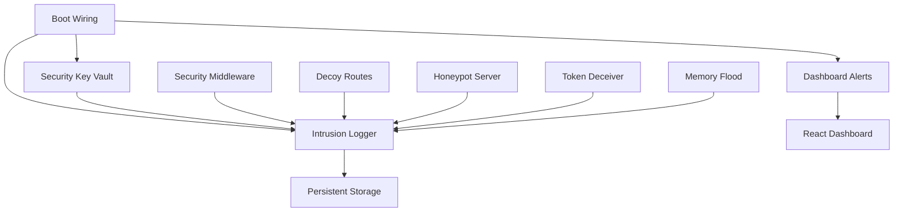
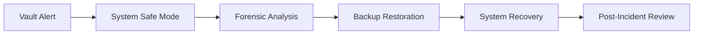

# Phase 16 Security Enhancements - Integration Reference

## Overview

Phase 16 implements comprehensive security enhancements for the JRVI system, focusing on boot-time integrity checks, live defense mechanisms, intrusion detection, and threat deception. This document provides integration notes and workflow guidance for deploying and operating the security systems.

## Architecture Integration

### Component Dependencies



### Integration Points

1. **Boot Sequence Integration**
   - `boot-wiring.ts` integrates with system startup
   - Vault validation occurs before service initialization
   - Security alerts configured during boot

2. **Express.js Middleware Integration**
   - Decoy routes middleware added to Express app
   - Security middleware validates all requests
   - Honeypot detection integrated with request handling

3. **React Dashboard Integration**
   - Alert hooks provide real-time UI notifications
   - Security metrics displayed in dashboard widgets
   - Administrative controls for security management

## Deployment Workflow

### 1. Pre-Deployment Setup

#### Environment Configuration
```bash
# Create security directories
mkdir -p ./security/vault
mkdir -p ./security/intrusion-logs
mkdir -p ./security/honeypot-logs

# Set environment variables
export VAULT_KEY="your-secure-vault-key"
export VAULT_PATH="./security/vault"
export SECURITY_LOG_PATH="./security/intrusion-logs"
export HONEYPOT_ENABLED="true"
export DECOY_ROUTES_ENABLED="true"
```

#### File Permissions
```bash
# Secure vault directory
chmod 700 ./security/vault
chmod 600 ./security/vault/*

# Secure log directories  
chmod 750 ./security/intrusion-logs
chmod 640 ./security/intrusion-logs/*
```

### 2. Application Integration

#### Server-Side Integration (Express.js)

```typescript
// server/index.js or main server file
import express from 'express';
import { bootWiring } from './src/security/boot-wiring';
import { securityDefenseDecoyRoutes } from './src/security/security_defense_decoy-routes';
import { securityDefenseHoneypotServer } from './src/security/security_defense_honeypot-server';
import { securityMiddleware } from './src/security/middleware';

const app = express();

// Initialize security systems during boot
async function initializeServer() {
  try {
    // Phase 16: Boot-time security initialization
    const bootStatus = await bootWiring.initializeSystem();
    
    if (!bootStatus.success) {
      console.error('Security initialization failed:', bootStatus.errors);
      if (bootStatus.errors.some(e => e.includes('critical'))) {
        process.exit(1); // Exit on critical security failures
      }
    }

    // Add security middleware
    app.use(securityMiddleware.checkSecurity);
    
    // Add decoy routes BEFORE your actual routes
    app.use(securityDefenseDecoyRoutes.getDecoyMiddleware());
    
    // Your actual application routes here
    app.get('/api/health', (req, res) => {
      res.json({ status: 'healthy', security: 'active' });
    });
    
    console.log('✅ Security systems initialized successfully');
    
  } catch (error) {
    console.error('❌ Security initialization failed:', error);
    process.exit(1);
  }
}

// Start server with security
initializeServer().then(() => {
  app.listen(3001, () => {
    console.log('🚀 Server running with Phase 16 security');
  });
});
```

#### Client-Side Integration (React)

```typescript
// src/App.tsx
import React from 'react';
import { AlertProvider, FloatingAlert } from './security/dashboard-alert-hook';
import Dashboard from './components/Dashboard';

function App() {
  return (
    <AlertProvider>
      <div className="App">
        <Dashboard />
        <FloatingAlert />
      </div>
    </AlertProvider>
  );
}

export default App;
```

```typescript
// src/components/Dashboard.tsx
import React from 'react';
import { 
  AlertDashboardWidget, 
  useBootWiringIntegration 
} from '../security/dashboard-alert-hook';

export default function Dashboard() {
  // Initialize boot wiring integration
  useBootWiringIntegration();

  return (
    <div className="dashboard">
      <h1>JRVI Dashboard</h1>
      
      {/* Security Alert Widget */}
      <AlertDashboardWidget className="mb-6" />
      
      {/* Other dashboard content */}
    </div>
  );
}
```

### 3. Honeypot Server Setup

#### Automatic Honeypot Initialization
```typescript
// The honeypot server starts automatically with default ports
// No additional setup required - it integrates with boot wiring

// To customize honeypot ports:
import { securityDefenseHoneypotServer } from './src/security/security_defense_honeypot-server';

// Add custom honeypot port
await securityDefenseHoneypotServer.addHoneypotPort(8888);

// Remove default port if needed
securityDefenseHoneypotServer.removeHoneypotPort(3389);
```

#### Manual Honeypot Configuration
```typescript
// Configure honeypot settings
securityDefenseHoneypotServer.updateConfig({
  enabled: true,
  ports: [22, 23, 80, 8080, 3306, 5432],
  maxConnections: 50,
  connectionTimeout: 30,
  responseDelay: 2000, // 2 second delay
  fakeServices: true
});
```

### 4. Live Defense Configuration

#### Memory Flood Protection
```typescript
// Automatic trigger on suspicious activity
import { securityDefenseMemoryFlood } from './src/security/security_defense_memory-flood';

// Configure thresholds
securityDefenseMemoryFlood.updateConfig({
  enabled: true,
  maxMemoryUsage: 200, // 200MB
  simulationDuration: 60, // 60 seconds
  triggerThreshold: 100, // 100 requests per minute
  autoCleanup: true,
  alertOnTrigger: true
});

// Manual stress test (for testing)
await securityDefenseMemoryFlood.performMemoryStressTest(30, 100);
```

#### Token Deception Setup
```typescript
import { securityDefenseTokenDeceiver } from './src/security/security_defense_token-deceiver';

// Generate honeypot tokens for threat research
const honeypotToken = securityDefenseTokenDeceiver.generateFakeToken({
  username: 'admin',
  role: 'administrator',
  includeHoneypot: true
});

// Validate tokens and detect abuse
const validation = await securityDefenseTokenDeceiver.validateToken(
  requestToken, 
  clientIp
);

if (validation.isHoneypot) {
  console.log('🍯 Honeypot token detected!');
}
```

## Operational Workflows

### Daily Operations

#### 1. Morning Security Check
```bash
# Check vault integrity
curl http://localhost:3001/api/security/vault/status

# Review overnight intrusion attempts
curl http://localhost:3001/api/security/intrusions/summary

# Check honeypot activity
curl http://localhost:3001/api/security/honeypot/stats
```

#### 2. Alert Management
```typescript
// Get unacknowledged alerts
const alerts = bootWiring.getDashboardAlerts(false);

// Acknowledge critical alerts
alerts.filter(a => a.severity === 'critical').forEach(alert => {
  bootWiring.acknowledgeAlert(alert.id);
});
```

#### 3. System Health Monitoring
```typescript
// Check all security component health
const vaultStats = securityKeyVault.getVaultStats();
const intrusionStats = intrusionLogger.getIntrusionStats();
const honeypotStats = securityDefenseHoneypotServer.getHoneypotStats();
const memoryStats = securityDefenseMemoryFlood.getMemoryFloodStats();

console.log('Security Health Report:', {
  vault: vaultStats.isHealthy,
  intrusions: intrusionStats.last24Hours,
  honeypots: honeypotStats.activeServers,
  memory: memoryStats.enabled
});
```

### Incident Response Workflows

#### 1. Vault Integrity Failure


**Response Steps:**
1. System automatically enters safe mode
2. Critical alert triggered in dashboard
3. Vault operations suspended
4. Forensic analysis of corrupted entries
5. Restore from backup if necessary
6. Conduct post-incident review

#### 2. Mass Intrusion Detection


**Response Steps:**
1. Intrusion logger triggers high-volume alert
2. Analyze attack patterns and sources
3. Identify coordinated vs. distributed attacks
4. Implement IP blocking if necessary
5. Deploy additional honeypots
6. Enhance monitoring of affected services

#### 3. Memory Flood Attack


**Response Steps:**
1. Memory flood system detects attack
2. Analyze memory usage patterns
3. Trigger flood simulation to slow attacker
4. Learn attack patterns for future defense
5. Update detection algorithms

### Maintenance Workflows

#### Weekly Maintenance

```bash
#!/bin/bash
# weekly-security-maintenance.sh

echo "🔒 JRVI Security Weekly Maintenance"

# 1. Vault integrity check
echo "Checking vault integrity..."
node -e "
const { securityKeyVault } = require('./src/security/security_key-vault');
securityKeyVault.performIntegrityCheck().then(status => {
  console.log('Vault status:', status.isValid ? '✅ VALID' : '❌ CORRUPTED');
});
"

# 2. Rotate intrusion logs
echo "Rotating intrusion logs..."
find ./security/intrusion-logs -name "*.json" -mtime +7 -exec gzip {} \;

# 3. Clean up honeypot logs
echo "Cleaning honeypot logs..."
node -e "
const { securityDefenseHoneypotServer } = require('./src/security/security_defense_honeypot-server');
console.log('Honeypot stats:', securityDefenseHoneypotServer.getHoneypotStats());
"

# 4. Memory flood cleanup
echo "Cleaning memory flood data..."
node -e "
const { securityDefenseMemoryFlood } = require('./src/security/security_defense_memory-flood');
securityDefenseMemoryFlood.forceCleanup();
console.log('Memory flood cleanup completed');
"

# 5. Token deceiver cleanup
echo "Cleaning token abuse logs..."
node -e "
const { securityDefenseTokenDeceiver } = require('./src/security/security_defense_token-deceiver');
securityDefenseTokenDeceiver.cleanupAbuseLogs();
console.log('Token abuse logs cleaned');
"

echo "✅ Weekly maintenance completed"
```

#### Monthly Security Review

```typescript
// monthly-security-report.ts
import { 
  securityKeyVault,
  intrusionLogger,
  securityDefenseHoneypotServer,
  securityDefenseTokenDeceiver,
  securityDefenseMemoryFlood
} from './src/security';

async function generateMonthlyReport() {
  const report = {
    period: `${new Date().getFullYear()}-${String(new Date().getMonth() + 1).padStart(2, '0')}`,
    vault: securityKeyVault.getVaultStats(),
    intrusions: intrusionLogger.getIntrusionStats(),
    honeypots: securityDefenseHoneypotServer.getHoneypotStats(),
    tokens: securityDefenseTokenDeceiver.getTokenDeceiverStats(),
    memory: securityDefenseMemoryFlood.getMemoryFloodStats(),
    timestamp: new Date().toISOString()
  };

  console.log('📊 Monthly Security Report:');
  console.log(JSON.stringify(report, null, 2));
  
  // Save report
  require('fs').writeFileSync(
    `./security/reports/monthly-${report.period}.json`,
    JSON.stringify(report, null, 2)
  );
}

generateMonthlyReport();
```

## API Integration

### Security API Endpoints

```typescript
// Add these to your Express router
import { Router } from 'express';

const securityRouter = Router();

// Vault status
securityRouter.get('/vault/status', (req, res) => {
  const stats = securityKeyVault.getVaultStats();
  res.json(stats);
});

// Intrusion summary
securityRouter.get('/intrusions/summary', (req, res) => {
  const stats = intrusionLogger.getIntrusionStats();
  res.json(stats);
});

// Honeypot activity
securityRouter.get('/honeypot/stats', (req, res) => {
  const stats = securityDefenseHoneypotServer.getHoneypotStats();
  res.json(stats);
});

// Security alerts
securityRouter.get('/alerts', (req, res) => {
  const alerts = bootWiring.getDashboardAlerts();
  res.json(alerts);
});

// Acknowledge alert
securityRouter.post('/alerts/:id/acknowledge', (req, res) => {
  const success = bootWiring.acknowledgeAlert(req.params.id);
  res.json({ success });
});

export default securityRouter;
```

## Testing and Validation

### Security Component Testing

```typescript
// test/security-integration.test.ts
import { describe, test, expect } from '@jest/globals';
import { bootWiring } from '../src/security/boot-wiring';

describe('Phase 16 Security Integration', () => {
  test('Boot sequence completes successfully', async () => {
    const status = await bootWiring.initializeSystem();
    expect(status.success).toBe(true);
    expect(status.vaultStatus.isValid).toBe(true);
    expect(status.securitySystemsOnline).toBe(true);
  });

  test('Vault integrity check passes', async () => {
    const status = await securityKeyVault.performIntegrityCheck();
    expect(status.isValid).toBe(true);
    expect(status.corruptedEntries).toHaveLength(0);
  });

  test('Intrusion logging works', async () => {
    const eventId = await intrusionLogger.logIntrusion({
      type: 'suspicious_activity',
      severity: 'low',
      source: { ip: '127.0.0.1' },
      target: { endpoint: 'test' },
      details: { description: 'Test event' },
      response: { action: 'logged', success: true },
      context: {}
    });
    
    expect(eventId).toBeDefined();
  });
});
```

### Performance Testing

```bash
#!/bin/bash
# performance-test.sh

echo "🔬 Phase 16 Performance Testing"

# Test decoy route response times
echo "Testing decoy routes..."
for route in /admin /api/users /.env /phpmyadmin; do
  time curl -s "http://localhost:3001$route" > /dev/null
done

# Test honeypot response times
echo "Testing honeypot connections..."
for port in 22 80 3306; do
  timeout 5 telnet localhost $port || true
done

# Test memory flood performance
echo "Testing memory flood simulation..."
node -e "
const { securityDefenseMemoryFlood } = require('./src/security/security_defense_memory-flood');
const start = Date.now();
securityDefenseMemoryFlood.performMemoryStressTest(5, 10).then(() => {
  console.log(\`Memory test completed in \${Date.now() - start}ms\`);
});
"

echo "✅ Performance testing completed"
```

## Troubleshooting

### Common Issues

#### 1. Vault Initialization Fails
```bash
# Check vault directory permissions
ls -la ./security/vault

# Verify environment variables
echo $VAULT_KEY
echo $VAULT_PATH

# Check disk space
df -h .
```

#### 2. Honeypot Ports Already in Use
```bash
# Check which process is using the port
netstat -tulpn | grep :22

# Kill conflicting process if safe
sudo systemctl stop ssh  # For SSH on port 22

# Or configure different ports
```

#### 3. Memory Flood Not Triggering
```typescript
// Check configuration
const config = securityDefenseMemoryFlood.getMemoryFloodStats();
console.log('Memory flood config:', config.config);

// Manually trigger for testing
await securityDefenseMemoryFlood.triggerMemoryFlood('manual test', '127.0.0.1', 50);
```

#### 4. Dashboard Alerts Not Appearing
```typescript
// Check alert provider setup
import { useAlerts } from './src/security/dashboard-alert-hook';

// In your component:
const { alerts, addAlert } = useAlerts();
console.log('Current alerts:', alerts);

// Test alert generation
addAlert({
  type: 'system_error',
  severity: 'info',
  title: 'Test Alert',
  message: 'Testing alert system',
  source: 'manual-test'
});
```

## Security Considerations

### Production Deployment

1. **Environment Security**
   - Use secure vault keys (32+ characters)
   - Enable TLS for all communications
   - Restrict file permissions appropriately
   - Use environment variables for secrets

2. **Monitoring Integration**
   - Connect to SIEM systems
   - Set up automated alerting
   - Configure log forwarding
   - Enable audit trails

3. **Performance Optimization**
   - Tune honeypot response delays
   - Optimize memory flood thresholds
   - Configure appropriate log rotation
   - Monitor system resource usage

4. **Compliance Requirements**
   - Enable comprehensive logging
   - Configure data retention policies
   - Implement access controls
   - Document security procedures

---

**Document Version**: 1.0  
**Last Updated**: January 2024  
**Integration Status**: Ready for Deployment  
**Support Contact**: security-team@jrvi.com